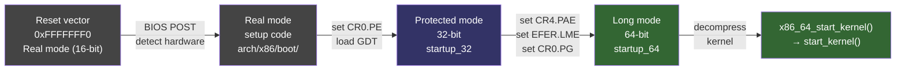

# x86-64 Architecture

> Real mode, protected mode, long mode — and everything the kernel does to keep it all running

## Why x86-64 internals matter

x86-64 is the architecture that runs the overwhelming majority of Linux servers, desktops, and cloud infrastructure. Understanding its internals is essential for:

- **Kernel developers** debugging crashes — reading oops output requires knowing how exceptions are delivered, what `CR2` contains, and how `pt_regs` is laid out on the stack
- **Performance engineers** diagnosing regressions — KPTI CR3 switching costs, PCID invalidation overhead, and TSC drift are x86-specific phenomena
- **Security researchers** understanding mitigations — Spectre, Meltdown, and their fixes are deeply architecture-specific
- **Systems programmers** building OS-adjacent tools — vDSO, seccomp BPF, and ptrace all depend on how SYSCALL and SYSRET work

The x86-64 architecture carries 40 years of backward compatibility — from real mode BIOS boot, through protected mode, to 64-bit long mode. The kernel must navigate all of these modes during boot and then maintain the long-mode invariants that user processes rely on.

---

## Mode transitions at boot



UEFI boot skips the real mode steps entirely — the firmware hands off to the kernel's EFI stub already in protected mode (32-bit) or directly in long mode (64-bit), depending on the firmware bitness.

---

## Pages in this section

| Page | What it covers |
|------|----------------|
| [Boot Sequence](boot.md) | BIOS/UEFI reset vector → startup_64 → start_kernel(); bzImage layout, real→protected→long mode transition |
| [Page Tables](page-tables.md) | 4-level and 5-level paging, PTE bit layout, CR3, PCID, KPTI, huge pages |
| [Syscall Entry](syscall-entry.md) | SYSCALL instruction, MSR setup, entry_SYSCALL_64, vDSO, signal delivery |
| [Exception Handling](exceptions.md) | IDT, exception entry, hardware push sequence, page fault handler, IST stacks |
| [CPU Features](cpu-features.md) | CPUID, x86_capability[], alternative patching, CPU bug mitigations |
| [Spectre and Meltdown](spectre-meltdown.md) | Hardware vulnerabilities, KPTI, retpoline, IBRS/IBPB/STIBP, MDS/VERW |
| [War Stories](war-stories.md) | KPTI regression, TSC drift, AMD SYSRET bug, BPF JIT + retpoline, INVPCID fallback |

---

## Suggested reading order

**If you are new to x86-64 kernel internals:**

1. **[Boot Sequence](boot.md)** — understand how the kernel gets from reset to `start_kernel()`; this grounds every other topic
2. **[Page Tables](page-tables.md)** — virtual address translation is a prerequisite for understanding exceptions, syscall entry, and KPTI
3. **[Exception Handling](exceptions.md)** — the IDT, hardware exception delivery, `pt_regs`, and the page fault handler
4. **[Syscall Entry](syscall-entry.md)** — how user processes enter the kernel and return to userspace
5. **[CPU Features](cpu-features.md)** — CPUID detection, alternative patching, and runtime feature checks
6. **[Spectre and Meltdown](spectre-meltdown.md)** — the security mitigations that cut across all of the above
7. **[War Stories](war-stories.md)** — real incidents that bring the theory to life

**If you are debugging a specific issue**, jump directly to the relevant page. Each page is self-contained.

---

## Quick reference: key x86-64 registers

| Register | Width | Purpose |
|----------|-------|---------|
| `rsp` | 64-bit | Stack pointer — always points to the current top of stack |
| `rbp` | 64-bit | Frame pointer (by convention; can be used as general-purpose) |
| `rip` | 64-bit | Instruction pointer — next instruction to execute |
| `rflags` | 64-bit | Flags: CF, PF, AF, ZF, SF, TF, IF, DF, OF, IOPL, NT, RF, VM, AC, VIF, VIP, ID |
| `cr0` | 64-bit | Control: PE (protected mode), MP, EM, TS, ET, NE, WP, AM, NW, CD, PG (paging) |
| `cr2` | 64-bit | Page fault linear address — set by hardware on #PF |
| `cr3` | 64-bit | Physical address of PGD (top-level page table); bits 11:0 = PCID |
| `cr4` | 64-bit | Extended control: PAE, PSE, VME, PGE, OSFXSR, OSXMMEXCPT, UMIP, LA57, PCIDE, SMEP, SMAP, PKE |
| `EFER` | MSR 0xC0000080 | Extended Feature Enable: LME (long mode enable), LMA (long mode active), SCE (SYSCALL enable), NXE (no-execute enable) |
| `FS.base` | MSR 0xC0000100 | Base address for FS segment — used for per-thread TLS in userspace |
| `GS.base` | MSR 0xC0000101 | Base address for GS segment — used for per-CPU data in the kernel |
| `KernelGSbase` | MSR 0xC0000102 | Saved user GS base; swapped with GS.base by `swapgs` on syscall entry |
| `STAR` | MSR 0xC0000081 | Segment selectors for SYSCALL/SYSRET: CS/SS for kernel and user |
| `LSTAR` | MSR 0xC0000082 | 64-bit SYSCALL target RIP — points to `entry_SYSCALL_64` |
| `SFMASK` | MSR 0xC0000084 | RFLAGS bits to clear on SYSCALL entry |

### Checking register values at runtime

```bash
# Read a MSR (requires msr kernel module or root)
modprobe msr
rdmsr 0xC0000082   # LSTAR — should be address of entry_SYSCALL_64

# Verify via kallsyms
grep entry_SYSCALL_64 /proc/kallsyms

# CPU features (CPUID-derived)
cat /proc/cpuinfo | grep flags

# CR4 value (approximate, via dmesg or crash)
dmesg | grep -i "cr4\|SMEP\|SMAP"
```

---

## Key source locations

| Path | Description |
|------|-------------|
| `arch/x86/boot/` | Real mode setup code: memory detection, video, mode switch |
| `arch/x86/boot/compressed/` | Decompression stub: `startup_32`, `startup_64`, `decompress_kernel()` |
| `arch/x86/kernel/head_64.S` | Early 64-bit entry: page table setup, GS base, BSS clear |
| `arch/x86/kernel/cpu/` | CPU feature detection, CPUID parsing |
| `arch/x86/kernel/alternative.c` | Alternative instruction patching at boot |
| `arch/x86/kernel/idt.c` | IDT initialization |
| `arch/x86/entry/entry_64.S` | `entry_SYSCALL_64`, exception entry stubs |
| `arch/x86/entry/common.c` | `do_syscall_64()`, syscall table dispatch |
| `arch/x86/mm/fault.c` | Page fault handler |
| `arch/x86/mm/pgtable.c` | Page table allocation and manipulation |
| `arch/x86/include/asm/cpufeatures.h` | `X86_FEATURE_*` definitions |
| `arch/x86/include/asm/msr-index.h` | MSR address definitions |
