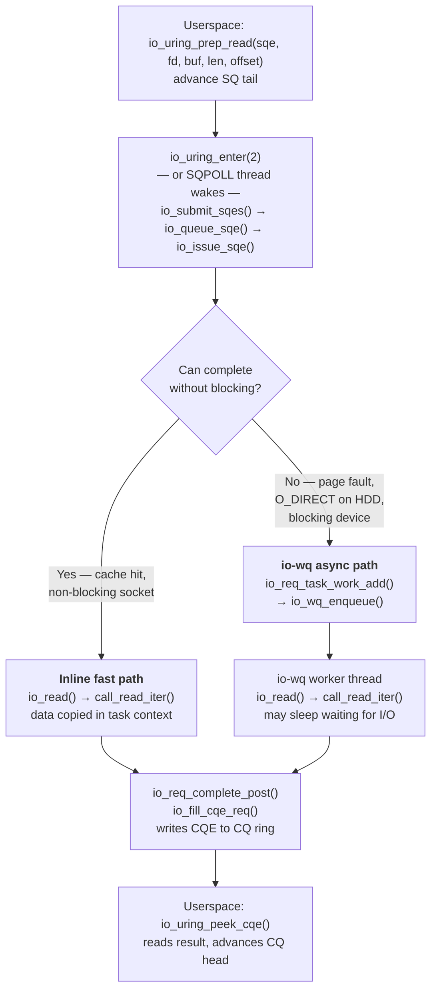
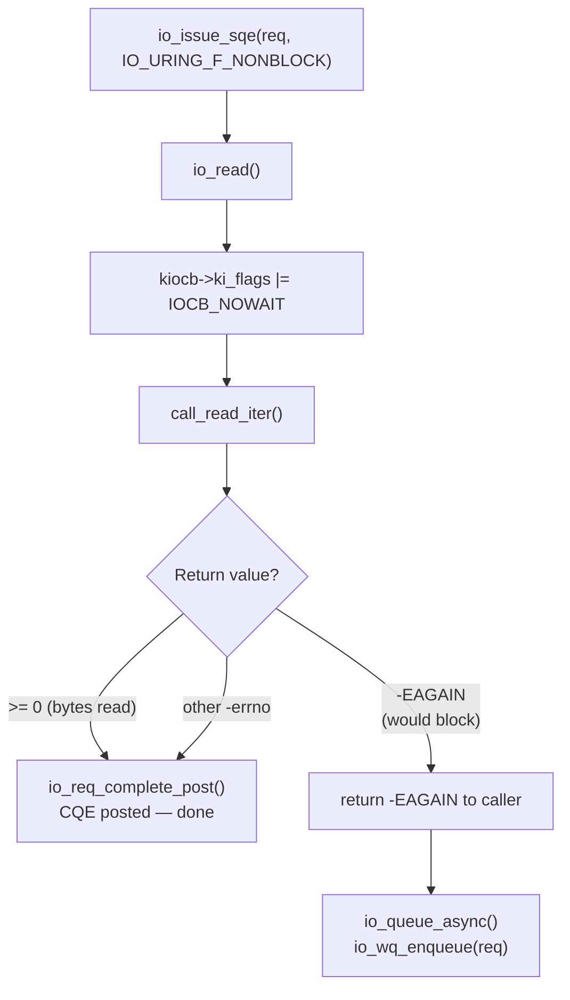
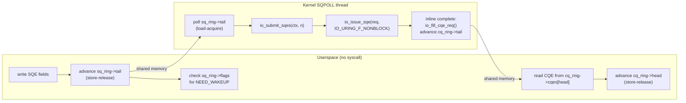
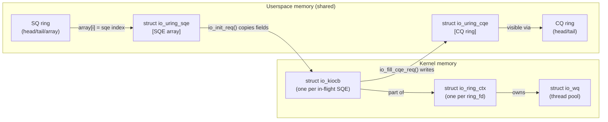

# Life of an io_uring request

> Tracing a single read from SQE submission to CQE completion

## What happens when you submit an io_uring read?

When a program submits a read via io_uring, it writes a Submission Queue Entry (SQE) into a shared-memory ring, then optionally calls `io_uring_enter(2)` to hand control to the kernel. The kernel picks up the SQE, attempts to execute the read immediately (the inline fast path), and if that would block, offloads the work to an io-wq worker thread. Either way, when the read finishes the kernel writes a Completion Queue Entry (CQE) into the completion ring, and userspace reaps it.



The key insight: **io_uring decouples submission from completion**. The application never blocks inside the syscall waiting for a disk read to finish. It submits, does other work, and harvests completions when it is ready.

## Preparing the SQE

### struct io_uring_sqe field layout

The SQE is a 64-byte structure defined in `include/uapi/linux/io_uring.h`:

```c
/* include/uapi/linux/io_uring.h */
struct io_uring_sqe {
    __u8    opcode;         /* IORING_OP_READ, IORING_OP_WRITE, ... */
    __u8    flags;          /* IOSQE_FIXED_FILE, IOSQE_IO_LINK, etc. */
    __u16   ioprio;         /* I/O scheduling priority (ionice class) */
    __s32   fd;             /* target file descriptor */
    union {
        __u64   off;        /* file offset for read/write */
        __u64   addr2;      /* used by some other opcodes */
    };
    union {
        __u64   addr;       /* pointer to userspace buffer */
        __u64   splice_off_in;
    };
    __u32   len;            /* number of bytes to read/write */
    union {
        __kernel_rwf_t  rw_flags;   /* RWF_HIPRI, RWF_NOWAIT, etc. */
        __u32           fsync_flags;
        /* ... other per-opcode flags ... */
    };
    __u64   user_data;      /* opaque tag: copied verbatim to CQE */
    union {
        __u16   buf_index;  /* registered buffer index */
        __u16   buf_group;  /* buffer group for automatic selection */
    };
    __u16   personality;    /* credential override (see io_uring_register) */
    union {
        __s32   splice_fd_in;
        __u32   file_index; /* fixed file slot when IOSQE_FIXED_FILE */
    };
    __u64   addr3;
    __u64   __pad2[1];
};
```

For a read operation, the meaningful fields are: `opcode`, `fd`, `off`, `addr`, `len`, `rw_flags`, and `user_data`.

### What io_uring_prep_read sets

liburing's `io_uring_prep_read()` is a thin wrapper that sets those fields:

```c
/* liburing/src/include/liburing/io_uring.h */
static inline void io_uring_prep_read(struct io_uring_sqe *sqe,
                                      int fd,
                                      void *buf,
                                      unsigned nbytes,
                                      __u64 offset)
{
    io_uring_prep_rw(IORING_OP_READ, sqe, fd, buf, nbytes, offset);
}

static inline void io_uring_prep_rw(int op,
                                    struct io_uring_sqe *sqe,
                                    int fd,
                                    const void *addr,
                                    unsigned len,
                                    __u64 offset)
{
    memset(sqe, 0, sizeof(*sqe));
    sqe->opcode = (__u8) op;
    sqe->fd     = fd;
    sqe->off    = offset;
    sqe->addr   = (unsigned long) addr;
    sqe->len    = len;
}
```

After returning, the caller sets `sqe->user_data` to a correlation tag — typically a pointer to an application-level request struct or a monotonic counter — so it can match the CQE back to the right operation.

### user_data for request correlation

`user_data` is the only field the kernel copies unchanged from SQE to CQE. Nothing inside the kernel interprets it; it is purely a cookie for the application:

```c
/* Typical usage */
struct my_request {
    int    fd;
    char  *buf;
    size_t len;
};

struct my_request *req = alloc_request(...);
sqe->user_data = (uint64_t)(uintptr_t) req;   /* store pointer */

/* ... later, when harvesting CQEs: */
struct io_uring_cqe *cqe;
io_uring_wait_cqe(&ring, &cqe);
struct my_request *completed = (struct my_request *)(uintptr_t) cqe->user_data;
```

### SQE flags

The `flags` byte controls request-level behaviours independent of the opcode:

| Flag | Effect |
|------|--------|
| `IOSQE_FIXED_FILE` | `fd` is a slot index into the ring's registered file table, avoiding per-operation `fget`/`fput` |
| `IOSQE_IO_DRAIN` | Do not start this SQE until all previously submitted SQEs have completed (ordering barrier) |
| `IOSQE_IO_LINK` | Link this SQE to the next one; the next SQE is submitted only if this one succeeds |
| `IOSQE_IO_HARDLINK` | Like `IO_LINK`, but the next SQE is submitted regardless of this one's result |
| `IOSQE_ASYNC` | Always go through io-wq; never attempt the inline fast path |
| `IOSQE_BUFFER_SELECT` | Let the kernel pick a buffer from a registered buffer group (`buf_group`) |
| `IOSQE_CQE_SKIP_SUCCESS` | Do not post a CQE if the operation succeeds (useful in linked chains) |

### The SQ ring as a producer-consumer queue

The SQ ring is a pair of monotonically-increasing head and tail counters in shared memory. Userspace is the sole producer; the kernel is the sole consumer:

```
SQ ring in shared memory:

  sq_ring->head  (kernel advances after consuming SQE)
  sq_ring->tail  (userspace advances after writing SQE)
  sq_ring->array[] (indirection: sq_ring->array[i & mask] = index into sqe array)

  Invariant: head <= tail
  Available to kernel: tail - head entries
```

Userspace publishes the SQE with a store-release on `sq_ring->tail`; the kernel reads it with a load-acquire. No locks are taken on the hot path.

## Submission — entering the kernel

### io_uring_enter(2)

After advancing the SQ tail, the application calls:

```c
int io_uring_enter(unsigned int fd,
                   unsigned int to_submit,
                   unsigned int min_complete,
                   unsigned int flags,
                   const void __user *argp,
                   size_t argsz);
```

// The argp/argsz pair replaced the earlier sigset_t argument in Linux 5.11 when IORING_ENTER_EXT_ARG was introduced.

- `to_submit`: how many SQEs to consume from the ring.
- `min_complete`: if `IORING_ENTER_GETEVENTS` is set in `flags`, block until at least this many CQEs are available before returning. Setting this to `0` with `IORING_ENTER_GETEVENTS` performs a non-blocking poll.
- `IORING_ENTER_GETEVENTS`: combine submission and wait in one syscall; avoids a second `epoll_wait`-style call.

```c
/* Submit 4 SQEs and wait for at least 1 completion */
io_uring_enter(ring_fd, 4, 1, IORING_ENTER_GETEVENTS, NULL, 0);
```

### Kernel entry point

The syscall lands in `io_uring/io_uring.c`:

```c
/* io_uring/io_uring.c (simplified) */
SYSCALL_DEFINE6(io_uring_enter, unsigned int, fd, u32, to_submit,
                u32, min_complete, u32, flags, const void __user *, argp,
                size_t, argsz)
{
    struct io_ring_ctx *ctx = /* look up ctx from ring_fd */;

    if (to_submit) {
        ret = io_submit_sqes(ctx, to_submit);
    }

    if (flags & IORING_ENTER_GETEVENTS) {
        ret = io_cqring_wait(ctx, min_complete, sig, argsz, ts);
    }

    return ret;
}
```

### io_submit_sqes → io_queue_sqe → io_issue_sqe

`io_submit_sqes()` loops over `to_submit` entries, calling `io_queue_sqe()` for each, which in turn calls `io_issue_sqe()`:

```c
/* io_uring/io_uring.c (simplified) */
static int io_submit_sqes(struct io_ring_ctx *ctx, unsigned int nr)
{
    unsigned int i;
    int submitted = 0;

    for (i = 0; i < nr; i++) {
        struct io_uring_sqe *sqe = io_get_sqe(ctx);  /* advance head */
        struct io_kiocb *req     = io_alloc_req(ctx); /* from slab cache */

        io_init_req(ctx, req, sqe);      /* copy SQE fields into req */
        io_queue_sqe(ctx, req);          /* dispatch */
        submitted++;
    }
    return submitted;
}

static void io_queue_sqe(struct io_ring_ctx *ctx, struct io_kiocb *req)
{
    /* Link, drain, and personality checks */
    io_issue_sqe(req, IO_URING_F_NONBLOCK);
}
```

`IO_URING_F_NONBLOCK` tells the per-opcode handler to use `IOCB_NOWAIT` semantics: if the operation would block, return `-EAGAIN` immediately rather than sleeping. That `-EAGAIN` is the signal to fall back to io-wq.

### The SQPOLL path (no syscall required)

With `IORING_SETUP_SQPOLL`, `io_uring_setup()` creates a kernel thread (`io_sq_data`) that polls the SQ ring in a tight loop. Userspace simply writes the SQE and advances `sq_ring->tail`; the kernel thread sees it without any syscall:

```c
/* io_uring/sqpoll.c (simplified) */
static int io_sq_thread(void *data)
{
    struct io_sq_data *sqd = data;

    for (;;) {
        /* Poll each ring this thread serves */
        list_for_each_entry(ctx, &sqd->ctx_list, sqd_list) {
            unsigned int to_submit = io_sqring_entries(ctx);
            if (to_submit)
                io_submit_sqes(ctx, to_submit);
        }

        if (idle_for_too_long) {
            /* Set IORING_SQ_NEED_WAKEUP, then sleep */
            atomic_or(IORING_SQ_NEED_WAKEUP, &ctx->rings->sq_flags);
            schedule();
        }
    }
}
```

Userspace must check `sq_ring->flags & IORING_SQ_NEED_WAKEUP` after each batch; if the bit is set, it must call `io_uring_enter()` with `IORING_ENTER_SQ_WAKEUP` to wake the kernel thread.

## Request dispatch — the inline fast path

### io_read in io_uring/rw.c

For `IORING_OP_READ`, `io_issue_sqe()` calls the `io_read` handler in `io_uring/rw.c`:

```c
/* io_uring/rw.c (simplified) */
static int io_read(struct io_kiocb *req, unsigned int issue_flags)
{
    struct io_rw      *rw    = io_kiocb_to_cmd(req, struct io_rw);
    struct kiocb      *kiocb = &rw->kiocb;
    struct iov_iter    iter;
    ssize_t            ret;

    /* 1. Set up the kiocb */
    /* ki_pos was set from sqe->off during io_read_prep() */
    kiocb->ki_filp  = req->file;

    kiocb_set_rw_flags(kiocb, req->rw.flags);

    /* 2. If IO_URING_F_NONBLOCK, add IOCB_NOWAIT so VFS won't sleep */
    if (issue_flags & IO_URING_F_NONBLOCK)
        kiocb->ki_flags |= IOCB_NOWAIT;

    /* 3. Build iov_iter over the user buffer */
    import_ubuf(ITER_DEST, req->buf, req->len, &iter);

    /* 4. Try to call the file system's read_iter directly */
    ret = call_read_iter(req->file, kiocb, &iter);

    if (ret == -EAGAIN && (issue_flags & IO_URING_F_NONBLOCK)) {
        /* Inline attempt failed — needs to block */
        return -EAGAIN;   /* caller will enqueue to io-wq */
    }

    /* 5. Success or real error: complete inline */
    io_req_complete_post(req, ret);
    return IOU_OK;
}
```

`call_read_iter()` calls `file->f_op->read_iter()`, which routes to the same `generic_file_read_iter()` path a plain `read(2)` would take — including the page cache lookup.

### Conditions for staying on the inline fast path

The operation stays inline (no io-wq) when:

1. **Page cache hit**: the page is already in memory and up-to-date; `filemap_read()` returns without sleeping.
2. **Non-blocking socket**: data is already in the socket receive buffer; the network stack returns immediately.
3. **`IOCB_NOWAIT` respected by the filesystem**: the filesystem checks `kiocb->ki_flags & IOCB_NOWAIT` and returns `-EAGAIN` rather than blocking, so io_uring can decide what to do.
4. **Not HIPRI/polling**: high-priority polling (`RWF_HIPRI`) has a dedicated path; ordinary reads do not use it unless explicitly requested.



## Request dispatch — the io-wq async path

### When inline fails

The inline attempt returns `-EAGAIN` when:

- The requested file offset is not in the page cache (cold cache miss).
- The file is opened `O_DIRECT` and the underlying storage cannot satisfy the request without blocking (common for HDDs with deep queues).
- The filesystem itself returns `-EAGAIN` because it is holding a lock that would sleep (e.g., during certain ext4 journal operations).
- The SQE has `IOSQE_ASYNC` set, forcing async unconditionally.

### Enqueuing to io-wq

When `io_issue_sqe()` gets `-EAGAIN` back from the opcode handler, it calls into `io_uring/io_uring.c`:

```c
/* io_uring/io_uring.c (simplified) */
static void io_queue_async(struct io_kiocb *req, int ret)
{
    if (ret != -EAGAIN || (req->flags & REQ_F_NOWAIT))
        goto fail;

    /* Remove NOWAIT — worker is allowed to sleep */
    req->flags &= ~REQ_F_NOWAIT;

    /* Hand off to io-wq */
    io_req_task_work_add(req);   /* or io_wq_enqueue directly */
}
```

`io_wq_enqueue()` in `io_uring/io-wq.c` adds the request to a per-CPU work queue managed by the io-wq thread pool:

```c
/* io_uring/io-wq.c (simplified) */
void io_wq_enqueue(struct io_wq *wq, struct io_wq_work *work)
{
    struct io_wq_acct *acct = io_work_get_acct(wq, work);

    raw_spin_lock(&wq->lock);
    io_wq_insert_work(wq, work);
    raw_spin_unlock(&wq->lock);

    /* Wake a worker if needed */
    io_wq_wake_worker(wq, acct);
}
```

### The io-wq thread pool

io-wq maintains two classes of workers:

| Class | `io_wq_acct` | Use |
|-------|-------------|-----|
| Bounded | `IO_WQ_ACCT_BOUND` | Work that is expected to complete in finite time (most I/O) |
| Unbounded | `IO_WQ_ACCT_UNBOUND` | Work that may take arbitrarily long (e.g., filesystem operations that block indefinitely) |

Workers are created lazily and reaped after a configurable idle timeout. The maximum number of bounded workers can be tuned with `io_uring_register(IORING_REGISTER_IOWQ_MAX_WORKERS)`.

### Credential inheritance

Each io-wq worker inherits the credentials of the task that submitted the request (`req->creds`), set during `io_init_req()`:

```c
/* io_uring/io_uring.c (simplified) */
static void io_init_req(struct io_ring_ctx *ctx,
                        struct io_kiocb *req,
                        const struct io_uring_sqe *sqe)
{
    /* ... copy fields ... */
    req->creds = get_current_cred();   /* snapshot submitter's creds */
}
```

The worker calls `override_creds(req->creds)` before executing the request, ensuring file permission checks see the submitting task's uid/gid, not the worker's.

## Execution in io-wq

### The worker executes the same io_read path

The io-wq worker calls back into the same opcode dispatch table, this time without `IO_URING_F_NONBLOCK`:

```c
/* io_uring/io-wq.c (simplified) */
static void io_worker_handle_work(struct io_worker *worker,
                                  struct io_wq_acct *acct)
{
    struct io_wq_work *work = io_get_next_work(acct);
    struct io_kiocb   *req  = container_of(work, struct io_kiocb, work);

    override_creds(req->creds);

    /* Issue without NONBLOCK — worker is free to sleep */
    io_issue_sqe(req, 0);

    revert_creds(old_creds);
}
```

This calls `io_read()` again. This time `IOCB_NOWAIT` is not set in the kiocb, so `call_read_iter()` is free to block.

### The page fault path

If the page is not in the page cache, `filemap_read()` calls into the readahead engine and then blocks on `folio_wait_locked()` until the disk I/O completes:

```c
/* mm/filemap.c (simplified) */
ssize_t filemap_read(struct kiocb *iocb, struct iov_iter *iter,
                     ssize_t already_read)
{
    for (;;) {
        folio = filemap_get_folio(mapping, index);
        if (IS_ERR(folio)) {
            /* Cache miss — kick readahead, allocate page */
            page_cache_sync_readahead(mapping, ra, file, index, last_index - index);
            folio = filemap_get_folio(mapping, index);
        }

        /* Block here until I/O completes */
        folio_wait_locked(folio);

        copied = copy_folio_to_iter(folio, offset, bytes, iter);
        index++;
        if (copied == bytes)
            break;
    }
}
```

The io-wq worker sleeps inside `folio_wait_locked()`. The block layer completes the I/O, wakes the folio's waitqueue, and the worker resumes and copies the data.

### O_DIRECT in io-wq

For `O_DIRECT` files, `generic_file_read_iter()` bypasses the page cache entirely and calls `mapping_direct_IO()`, which builds a `bio` and submits it to the block layer. The worker blocks on the bio completion. This is the dominant path for high-performance database workloads using io_uring.

## Completion — posting the CQE

### io_req_complete_post

When `io_read()` finishes (inline or in io-wq), it calls `io_req_complete_post()`:

```c
/* io_uring/io_uring.c (simplified) */
void io_req_complete_post(struct io_kiocb *req, s32 res)
{
    struct io_ring_ctx *ctx = req->ctx;

    req->cqe.res = res;   /* bytes read, or -errno */

    spin_lock(&ctx->completion_lock);
    io_fill_cqe_req(ctx, req);
    io_commit_cqring(ctx);
    spin_unlock(&ctx->completion_lock);

    io_cqring_ev_posted(ctx);   /* wake anyone sleeping in io_cqring_wait */
}
```

### io_fill_cqe_req

This writes the CQE into the ring:

```c
/* io_uring/io_uring.c (simplified) */
static bool io_fill_cqe_req(struct io_ring_ctx *ctx,
                             struct io_kiocb *req)
{
    struct io_rings   *rings = ctx->rings;
    struct io_uring_cqe *cqe;
    unsigned int      tail;

    tail = ctx->cached_cq_tail;
    cqe  = &rings->cqes[tail & ctx->cq_mask];

    /* Write fields — user_data first so it is visible when tail advances */
    WRITE_ONCE(cqe->user_data, req->cqe.user_data);
    WRITE_ONCE(cqe->res,       req->cqe.res);
    WRITE_ONCE(cqe->flags,     req->cqe.flags);

    ctx->cached_cq_tail++;
    return true;
}
```

### io_commit_cqring — the store-release

After writing the CQE fields, `io_commit_cqring()` advances the CQ tail with a store-release, making the entry visible to userspace:

```c
static void io_commit_cqring(struct io_ring_ctx *ctx)
{
    /* smp_store_release ensures all CQE writes are visible before tail update */
    smp_store_release(&ctx->rings->cq.tail, ctx->cached_cq_tail);
}
```

### The CQ ring as a producer-consumer queue

The CQ ring is the mirror image of the SQ ring. The kernel is the sole producer; userspace is the sole consumer:

```
CQ ring in shared memory:

  cq_ring->head  (userspace advances after consuming CQE)
  cq_ring->tail  (kernel advances after writing CQE)
  cq_ring->cqes[head & mask] → next CQE to consume

  Available to userspace: tail - head entries
```

If userspace is too slow and the CQ ring fills up, the kernel increments `cq_ring->overflow` (the "CQ overflow" counter). With `IORING_SETUP_CQ_NODROP` (implied by `IORING_FEAT_NODROP` on supported kernels), overflowed CQEs are buffered internally and drained when space becomes available.

### IORING_CQE_F_MORE for multishot operations

For multishot operations (e.g., `IORING_OP_RECV` with `IORING_RECV_MULTISHOT`), the kernel may post multiple CQEs from a single SQE. As long as the operation is still active, each CQE has `IORING_CQE_F_MORE` set in `cqe->flags`. When the final CQE arrives (due to error or explicit cancellation), `IORING_CQE_F_MORE` is clear.

```c
struct io_uring_cqe {
    __u64   user_data;  /* copied from SQE */
    __s32   res;        /* bytes read/written, or -errno */
    __u32   flags;      /* IORING_CQE_F_MORE, IORING_CQE_F_SOCK_NONEMPTY, ... */
};
```

## Reaping the CQE

### io_uring_peek_cqe and io_uring_wait_cqe

liburing provides two primitives for harvesting completions:

```c
/* Non-blocking: returns 0 if a CQE is available, -EAGAIN if not */
int io_uring_peek_cqe(struct io_uring *ring, struct io_uring_cqe **cqe_ptr);

/* Blocking: waits until at least one CQE is available */
int io_uring_wait_cqe(struct io_uring *ring, struct io_uring_cqe **cqe_ptr);
```

Internally, `io_uring_peek_cqe()` is a pure userspace operation — no syscall:

```c
/* liburing (simplified) */
static inline int io_uring_peek_cqe(struct io_uring *ring,
                                    struct io_uring_cqe **cqe_ptr)
{
    unsigned head = *ring->cq.khead;  /* atomic load */
    unsigned tail = io_uring_smp_load_acquire(ring->cq.ktail);

    if (head == tail)
        return -EAGAIN;   /* ring empty */

    *cqe_ptr = &ring->cq.cqes[head & ring->cq.ring_mask];
    return 0;
}
```

`io_uring_wait_cqe()` falls back to `io_uring_enter()` with `IORING_ENTER_GETEVENTS` and `min_complete=1` if the ring is empty, putting the task to sleep until the kernel posts a CQE.

### io_uring_cqe_seen — advancing the CQ head

After processing a CQE, the application must call `io_uring_cqe_seen()` to mark it consumed:

```c
/* liburing (simplified) */
static inline void io_uring_cqe_seen(struct io_uring *ring,
                                     struct io_uring_cqe *cqe)
{
    if (cqe)
        io_uring_cq_advance(ring, 1);
        /* which does: smp_store_release(ring->cq.khead,
                                         *ring->cq.khead + 1) */
}
```

The store-release ensures the kernel does not overwrite the CQE slot before userspace has read it.

### Waiting with a timeout

To avoid blocking indefinitely, pass a `__kernel_timespec` via `IORING_ENTER_EXT_ARG`:

```c
struct io_uring_getevents_arg arg = {
    .sigmask    = 0,
    .sigmask_sz = 0,
    .ts         = (uint64_t)(uintptr_t)&timeout,  /* struct __kernel_timespec */
};

io_uring_enter(ring_fd, 0, 1,
               IORING_ENTER_GETEVENTS | IORING_ENTER_EXT_ARG,
               &arg, sizeof(arg));
```

Or use liburing's `io_uring_wait_cqe_timeout()`, which wraps this.

## The zero-syscall path — SQPOLL in depth

With `IORING_SETUP_SQPOLL`, the entire submit-and-complete cycle can run without any syscall:



**The idle sleep mechanism**: after `sq_thread_idle` milliseconds without new SQEs (configurable in `io_uring_params`), the SQPOLL thread sets `IORING_SQ_NEED_WAKEUP` and calls `schedule()`. Userspace must then make one `io_uring_enter(IORING_ENTER_SQ_WAKEUP)` call to wake it. The pattern:

```c
/* After writing SQEs and advancing tail: */
if (IO_URING_READ_ONCE(*ring->sq.kflags) & IORING_SQ_NEED_WAKEUP) {
    io_uring_enter(ring_fd, 0, 0, IORING_ENTER_SQ_WAKEUP, NULL, 0);
}
```

liburing's `io_uring_submit()` performs this check automatically.

**When SQPOLL helps most**: workloads that submit many operations per unit time, where the per-syscall overhead of `io_uring_enter()` would otherwise dominate. Database engines and network proxies with thousands of in-flight operations per second are typical users.

**When SQPOLL does not help**: bursty workloads with long idle periods between bursts. The SQPOLL thread wastes CPU spinning if submissions are infrequent. In that case, regular `io_uring_enter()` submission is more appropriate.

## Key data structures

### struct io_ring_ctx — the kernel-side ring context

`struct io_ring_ctx` is allocated once per `io_uring_setup()` call and anchors all kernel-side state:

```c
/* io_uring/io_uring.h (selected fields) */
struct io_ring_ctx {
    /* Submission state */
    struct io_rings         *rings;       /* pointer to shared SQ/CQ ring memory */
    struct io_uring_sqe     *sq_sqes;     /* pointer to shared SQE array */
    unsigned                sq_mask;      /* sq_entries - 1 */
    unsigned                cq_mask;      /* cq_entries - 1 */
    unsigned                cached_sq_head;   /* kernel's private SQ head */
    unsigned                cached_cq_tail;   /* kernel's private CQ tail */

    /* Completion */
    spinlock_t              completion_lock;
    struct list_head        locked_free_list; /* completed reqs awaiting free */

    /* SQPOLL */
    struct io_sq_data       *sq_data;     /* SQPOLL thread state */

    /* Async workers */
    struct io_wq            *io_wq;       /* per-ring io-wq instance */

    /* File table (for IOSQE_FIXED_FILE) */
    struct io_rsrc_data     *file_data;
    unsigned                nr_user_files;

    /* Buffer table (for fixed buffers) */
    struct io_rsrc_data     *buf_data;
    unsigned                nr_user_bufs;

    /* Credentials */
    struct xarray           personalities; /* registered credential sets */

    /* Configuration */
    unsigned                flags;        /* IORING_SETUP_* flags */
};
```

### struct io_kiocb — the kernel-side request

Each submitted SQE is represented internally as a `struct io_kiocb` ("kiocb" because it embeds a `struct kiocb` for VFS integration):

```c
/* io_uring/io_uring.h (selected fields) */
struct io_kiocb {
    struct file             *file;    /* resolved file pointer (standalone field) */

    struct io_ring_ctx      *ctx;     /* owning ring */
    struct io_uring_task    *tctx;    /* submitting task's io_uring state */

    /* CQE being built */
    struct io_uring_cqe      cqe;    /* user_data, res, flags */

    /* Request flags (REQ_F_*) */
    unsigned long            flags;

    /* Work item for io-wq */
    struct io_wq_work        work;

    /* Reference counting for linked/multishot requests */
    atomic_t                 refs;

    /* Credentials snapshot */
    const struct cred        *creds;

    /* Linked request chain */
    struct io_kiocb          *link;

    /* Cleanup / free */
    struct callback_head      task_work;

    /* Command-specific data lives in a flexible array at the end of the
     * struct, accessed via io_kiocb_to_cmd(req, struct io_rw) etc.
     * file is NOT in a union with command data. */
    u8                        cmd[];  /* e.g. struct io_rw, struct io_poll_iocb */
};
```

### Relationship between structures



`struct io_kiocb` lives in a slab cache managed by the ring context. It is allocated at submission time, lives through the entire request lifetime (inline or io-wq), and is freed after `io_fill_cqe_req()` returns.

## Try it yourself

### strace an io_uring program

```bash
# Build a minimal io_uring read program (with liburing)
# Then trace the syscalls:
strace -e trace=io_uring_setup,io_uring_enter,io_uring_register ./your-program

# You will see something like:
# io_uring_setup(32, {flags=0, sq_thread_cpu=0, sq_thread_idle=0,
#                     features=IORING_FEAT_SINGLE_MMAP|IORING_FEAT_NODROP|...,
#                     sq_off={head=0, tail=64, ...},
#                     cq_off={head=128, tail=192, ...}}) = 3
# mmap(NULL, 4096, PROT_READ|PROT_WRITE, MAP_SHARED, 3, IORING_OFF_SQ_RING) = 0x7f...
# mmap(NULL, 4096, PROT_READ|PROT_WRITE, MAP_SHARED, 3, IORING_OFF_SQES)    = 0x7f...
# io_uring_enter(3, 1, 1, IORING_ENTER_GETEVENTS, NULL, 0) = 1
```

With SQPOLL enabled, you will see `io_uring_setup` and the initial mmaps, but no `io_uring_enter` for individual operations.

### /proc/PID/fdinfo/\<ring_fd\>

The kernel exposes ring state via fdinfo:

```bash
# Find the ring fd (usually the first fd after stdin/stdout/stderr)
ls -la /proc/$(pgrep your-program)/fd

# Dump the ring state
cat /proc/$(pgrep your-program)/fdinfo/3

# Output (example):
# pos:	0
# flags:	02000002
# sq entries:	32
# cq entries:	64
# sq head:	17
# sq tail:	17
# sq mask:	0x1f
# cq head:	17
# cq tail:	17
# cq_overflow:	0
```

A non-zero `cq_overflow` means CQEs were posted faster than userspace consumed them — the most common cause of missed completions.

### ftrace io_uring tracepoints

The kernel has a full set of tracepoints for io_uring activity:

```bash
# Enable all io_uring tracepoints
echo 1 > /sys/kernel/debug/tracing/events/io_uring/enable

# Start capturing
cat /sys/kernel/debug/tracing/trace_pipe &

# Run your workload...

# Disable
echo 0 > /sys/kernel/debug/tracing/events/io_uring/enable
```

Key tracepoints to watch:

| Tracepoint | Fires when |
|------------|------------|
| `io_uring:io_uring_create` | `io_uring_setup()` completes |
| `io_uring:io_uring_submit_sqe` | An SQE is consumed from the ring |
| `io_uring:io_uring_queue_async_work` | A request is handed to io-wq |
| `io_uring:io_uring_defer` | A request is deferred (IOSQE_IO_DRAIN) |
| `io_uring:io_uring_complete` | A CQE is posted to the ring |
| `io_uring:io_uring_cqring_wait` | The caller blocks waiting for completions |

Example output for a single read:

```
io_uring_submit_sqe:   ring 0xffff... req 0xffff... opcode=READ user_data=0x1 flags=0
io_uring_queue_async_work: ring 0xffff... req 0xffff... rw=0 op=READ flags=0 work_flags=1
io_uring_complete:     ring 0xffff... req 0xffff... user_data=0x1 res=4096 cflags=0
```

A `io_uring_queue_async_work` line between submit and complete means the request hit the io-wq path (the page was not in cache or the device blocked). Absence of that line means the inline fast path was taken.

### Measure inline vs async split

```bash
# Count how often requests go async
perf stat -e 'io_uring:io_uring_queue_async_work' \
          -e 'io_uring:io_uring_submit_sqe' \
          -- ./your-io-workload

# The ratio async/total tells you your cache hit rate from io_uring's perspective.
# A cold-cache sequential read workload will show ~100% async.
# A warm-cache workload should show close to 0% async.
```

### Inspect io-wq worker count

```bash
# While a workload is running, check how many io-wq workers exist
cat /proc/$(pgrep your-program)/status | grep Threads

# Or watch for kworker-style threads named "iou-wrk-<pid>"
ps -eLf | grep iou-wrk
```

io-wq worker threads appear as `iou-wrk-<ring_pid>` in `ps` output. Under a heavy parallel read workload against cold storage you may see several; under a cached workload you should see none (all completions are inline).

## Key source files

| File | What it contains |
|------|-----------------|
| [`io_uring/io_uring.c`](https://git.kernel.org/pub/scm/linux/kernel/git/torvalds/linux.git/tree/io_uring/io_uring.c) | Core ring management, syscall entry, SQE dispatch, CQE posting |
| [`io_uring/rw.c`](https://git.kernel.org/pub/scm/linux/kernel/git/torvalds/linux.git/tree/io_uring/rw.c) | `io_read`, `io_write`, `io_readv`, `io_writev` handlers |
| [`io_uring/io-wq.c`](https://git.kernel.org/pub/scm/linux/kernel/git/torvalds/linux.git/tree/io_uring/io-wq.c) | io-wq thread pool: worker lifecycle, work queue, bounded/unbounded accounting |
| [`io_uring/sqpoll.c`](https://git.kernel.org/pub/scm/linux/kernel/git/torvalds/linux.git/tree/io_uring/sqpoll.c) | SQPOLL kernel thread |
| [`io_uring/io_uring.h`](https://git.kernel.org/pub/scm/linux/kernel/git/torvalds/linux.git/tree/io_uring/io_uring.h) | `struct io_ring_ctx`, `struct io_kiocb` |
| [`include/uapi/linux/io_uring.h`](https://git.kernel.org/pub/scm/linux/kernel/git/torvalds/linux.git/tree/include/uapi/linux/io_uring.h) | ABI: `struct io_uring_sqe`, `struct io_uring_cqe`, `IORING_*` constants |
| [`mm/filemap.c`](https://git.kernel.org/pub/scm/linux/kernel/git/torvalds/linux.git/tree/mm/filemap.c) | `filemap_read()`, `filemap_get_folio()` — executed by io-wq workers |

## Notorious bugs and edge cases

The io_uring request path is complex: it crosses the userspace/kernel boundary, involves shared mutable memory, a thread pool, and touches the VFS. Several categories of bugs have emerged.

---

### Case 1: Inline completion and CQ ring overflow

#### What happened

If userspace is slow to consume CQEs, the CQ ring can fill up. On kernels without `IORING_FEAT_NODROP`, the kernel would silently drop CQEs that did not fit, incrementing the overflow counter. Requests completed successfully in the kernel, but userspace never saw the result.

#### The bug

Without `IORING_FEAT_NODROP`, a program that submits faster than it reaps will silently lose completions:

```c
/* Unsafe: submit many requests without reaping */
for (int i = 0; i < 1000; i++)
    io_uring_submit(&ring);
/* If CQ ring (default 2x SQ entries) fills up, completions are dropped */
```

#### Real-world implications

Any application that submits bursts of requests and reaps lazily must either:
- Size the CQ ring large enough via `IORING_SETUP_CQSIZE` in `io_uring_params`, or
- Interleave reaping with submission, or
- Rely on `IORING_FEAT_NODROP` (available since kernel 5.5), which buffers overflowed CQEs internally.

#### Mitigation

Check `io_uring_params.features & IORING_FEAT_NODROP` at setup time. On older kernels, monitor `cq_overflow` in `/proc/PID/fdinfo/<ring_fd>` and alert if it is non-zero.

---

### Case 2: Fixed file table races during unregistration

#### What happened

When userspace registers a file table with `io_uring_register(IORING_REGISTER_FILES)` and then unregisters while requests using those files are still in-flight (via io-wq), there is a window where the file pointer can be freed while the worker is still holding it.

#### The bug

The kernel uses reference counting on `io_rsrc_data` to keep the file table alive until all in-flight requests complete. Bugs in the reference counting have caused use-after-free in the fixed file path:

```c
/* Dangerous if requests are in-flight */
io_uring_register(ring_fd, IORING_UNREGISTER_FILES, NULL, 0);
/* Worker thread may still be executing with the just-freed file table */
```

#### Real-world implications

Use-after-free in kernel code typically means exploitable privilege escalation or kernel crash. Several CVEs have been filed against io_uring's resource management code.

#### Mitigation

Always drain in-flight requests (`io_uring_register(IORING_REGISTER_SYNC_CANCEL)` or submit a barrier SQE with `IOSQE_IO_DRAIN`) before unregistering resources.

---

### Case 3: SQPOLL CPU pinning and missed wakeups

#### What happened

When `IORING_SETUP_SQ_AFF` is set, the SQPOLL thread is pinned to a specific CPU. If that CPU goes offline (CPU hotplug), the SQPOLL thread stalls and the ring stops processing new SQEs — without any error to userspace.

#### The bug

The SQPOLL thread uses `kthread_bind()` to pin to the requested CPU. If the CPU goes offline after setup:
1. The SQPOLL thread is migrated off (or blocked) by the hotplug code.
2. `IORING_SQ_NEED_WAKEUP` may not be set correctly in this state.
3. Userspace keeps writing SQEs that are never consumed.
4. No CQEs are ever posted.

#### Mitigation

Avoid `IORING_SETUP_SQ_AFF` in environments with CPU hotplug (cloud VMs with vCPU resizing, containers with CPU pinning). If you must pin, monitor `sq_head` and `sq_tail` in fdinfo: if `tail - head` grows without bound, the SQPOLL thread has stalled.

---

### Case 4: Credential confusion in personality-switched requests

#### What happened

io_uring allows submitting requests under a different credential set via `personality` in the SQE combined with `io_uring_register(IORING_REGISTER_PERSONALITY)`. A bug could allow a less-privileged credential to be promoted to a more-privileged one if the personality index was not validated correctly.

#### The bug

```c
sqe->personality = some_index;  /* which credential set to use */
```

If `some_index` is out of bounds or maps to the wrong credential set due to a race during personality unregistration, the worker thread calls `override_creds()` with the wrong creds. In the worst case, a request executes with elevated privileges.

#### Real-world implications

Privilege escalation. Several security audits of io_uring have focused specifically on the personality mechanism, leading to tighter bounds checking and reference counting fixes.

#### Mitigation

Keep personality usage to a minimum; do not share ring file descriptors across trust boundaries. See [`io_uring/security.md`](security.md) in this documentation for the full threat model.

---

### Case 5: io-wq worker count unbounded growth

#### What happened

If requests arrive faster than io-wq workers can complete them, and the per-ring worker limit is set too high (or not set), the kernel spawns many threads, exhausting the system's PID space or memory.

#### The bug

```c
/* No limit on workers — catastrophic under pathological workloads */
/* Default: no explicit cap, grows until system resources run out */
```

Under a workload that intentionally blocks many io-wq workers (e.g., many O_DIRECT reads to a very slow device), a buggy application can DoS the machine.

#### Mitigation

Set an explicit worker cap during setup:

```c
unsigned int max_workers[2] = { 64, 64 };  /* bounded, unbounded */
io_uring_register(ring_fd, IORING_REGISTER_IOWQ_MAX_WORKERS,
                  max_workers, 2);
```

---

### Summary: Lessons learned

| Bug | Root Cause | Impact | Prevention |
|-----|------------|--------|------------|
| **CQ overflow** | Slow CQE reaping | Lost completions | Size CQ ring; use `IORING_FEAT_NODROP` |
| **Fixed file UAF** | Ref-count race on unregister | Crash / privilege escalation | Drain requests before unregistering resources |
| **SQPOLL CPU offline** | CPU hotplug + kthread_bind | Ring stalls silently | Avoid `SQ_AFF` with hotplug; monitor fdinfo |
| **Personality confusion** | Credential index race | Privilege escalation | Minimize personality use; audit boundary |
| **Worker count explosion** | No cap on io-wq workers | DoS, OOM | Set `IORING_REGISTER_IOWQ_MAX_WORKERS` |

The common thread: **io_uring's performance comes from eliminating synchronization on the hot path, but that same design makes races and resource lifetime bugs harder to detect**. Careful use of the registration and cancellation APIs is essential for correctness.

## Further reading

### Related docs

- [io_uring Architecture and Rings](io-uring-arch.md) — Ring layout, `io_uring_setup`, SQE/CQE structs
- [Operations and Advanced Features](io-uring-ops.md) — Full opcode list, SQPOLL, fixed buffers, linked requests
- [Fixed Buffers](fixed-buffers.md) — Registered buffer internals
- [Multishot Operations](multishot-ops.md) — `IORING_CQE_F_MORE` and repeated completions
- [Security](security.md) — io_uring threat model and hardening
- [Life of a file read](../mm/life-of-read.md) — The page cache path that io-wq workers traverse

### LWN articles

- [Ringing in a new asynchronous I/O API](https://lwn.net/Articles/776703/) (2019) — Original io_uring introduction by Jonathan Corbet
- [The rapid growth of io_uring](https://lwn.net/Articles/810414/) (2020) — Feature expansion through 5.7
- [io_uring and security](https://lwn.net/Articles/902466/) (2022) — Security concerns and mitigations
- [io_uring in Android](https://lwn.net/Articles/945584/) (2023) — Production deployment considerations
- [Avoiding the page cache with io_uring](https://lwn.net/Articles/863071/) (2021) — Direct I/O and fixed buffers
