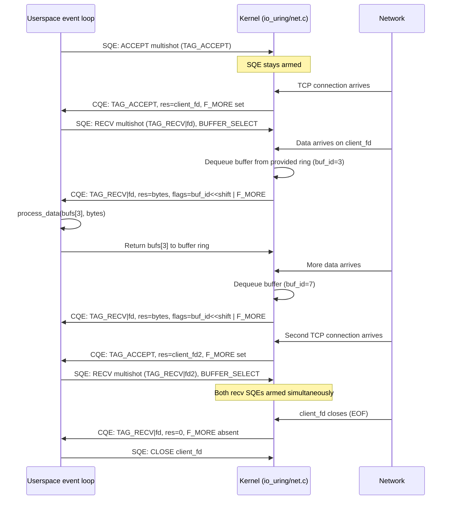

# io_uring Networking

> Zero-syscall network I/O, multishot accept, zero-copy send, and high-performance server patterns

## Why io_uring for networking?

The classic Linux networking stack pairs `epoll` with non-blocking sockets. It works well, but every individual I/O operation still costs a syscall:

1. `epoll_wait` blocks until a socket is readable/writable.
2. `recv`/`send` performs the actual transfer.

That is two syscalls per data transfer at minimum — more if you also call `accept` and `close`. Under high connection rates the syscall overhead accumulates and becomes measurable.

io_uring with `IORING_SETUP_SQPOLL` eliminates per-operation syscalls entirely. After ring setup, the kernel's SQ polling thread monitors the submission queue continuously. Userspace drops SQEs into the ring and reads CQEs out without ever entering the kernel again. For network servers processing tens of thousands of connections, this is the difference between the kernel being on the hot path and being completely out of it.

### Comparison: epoll+recv vs io_uring multishot recv

| Aspect | epoll + non-blocking recv | io_uring multishot recv |
|---|---|---|
| Syscalls per message | 2 (`epoll_wait` + `recv`) | 0 (with SQPOLL after setup) |
| Syscalls per connection | 4+ (`epoll_ctl` + `accept` + `epoll_ctl` + ...) | ~0 (multishot accept) |
| Buffer management | Caller allocates before each recv | Kernel picks from pre-registered pool |
| Unknown message size | Caller must size buffer conservatively | Provided buffer ring; kernel uses what fits |
| Zero-copy send | Via `MSG_ZEROCOPY` + error queue polling | `IORING_OP_SEND_ZC`, two clean CQEs |
| API complexity | Familiar POSIX | New but consistent SQE/CQE model |
| Kernel version requirement | Ubiquitous | Linux 5.1+ (networking ops), 5.19+ (multishot) |

## Basic network operations

All network operations follow the same SQE model. The liburing helpers paper over the raw struct fields.

### `IORING_OP_ACCEPT`

Equivalent to `accept4(2)`. `res` in the CQE holds the new client file descriptor on success.

```c
struct io_uring_sqe *sqe = io_uring_get_sqe(&ring);
struct sockaddr_in client_addr;
socklen_t client_addrlen = sizeof(client_addr);

io_uring_prep_accept(sqe, listen_fd,
                     (struct sockaddr *)&client_addr,
                     &client_addrlen,
                     0);           /* flags passed to accept4 */
io_uring_sqe_set_data64(sqe, TAG_ACCEPT);
```

For multishot accept (Linux 5.19), use `io_uring_prep_multishot_accept` — covered in detail in the next section.

### `IORING_OP_CONNECT`

Equivalent to `connect(2)`. Non-blocking: the SQE is submitted and the CQE arrives when the connection completes (or fails). `res == 0` on success.

```c
struct io_uring_sqe *sqe = io_uring_get_sqe(&ring);
struct sockaddr_in addr = {
    .sin_family = AF_INET,
    .sin_port   = htons(8080),
};
inet_pton(AF_INET, "127.0.0.1", &addr.sin_addr);

io_uring_prep_connect(sqe, sock_fd,
                      (struct sockaddr *)&addr,
                      sizeof(addr));
io_uring_sqe_set_data64(sqe, TAG_CONNECT);
```

### `IORING_OP_SEND` and `IORING_OP_RECV`

Direct equivalents of `send(2)` and `recv(2)`. `res` holds bytes transferred or `-errno`.

```c
/* Send */
sqe = io_uring_get_sqe(&ring);
io_uring_prep_send(sqe, client_fd, buf, len, 0 /* msg_flags */);
io_uring_sqe_set_data64(sqe, TAG_SEND);

/* Recv */
sqe = io_uring_get_sqe(&ring);
io_uring_prep_recv(sqe, client_fd, buf, len, 0 /* msg_flags */);
io_uring_sqe_set_data64(sqe, TAG_RECV);
```

For multishot recv, set `IORING_RECV_MULTISHOT` and `IOSQE_BUFFER_SELECT` — covered in the section on provided buffers.

### `IORING_OP_SENDMSG` and `IORING_OP_RECVMSG`

Equivalents of `sendmsg(2)` and `recvmsg(2)`. Accept a pointer to `struct msghdr` in `sqe->addr`. Useful for scatter-gather I/O and sending ancillary data.

```c
struct msghdr msg = {
    .msg_iov    = iov,
    .msg_iovlen = iov_count,
};

/* Sendmsg */
sqe = io_uring_get_sqe(&ring);
io_uring_prep_sendmsg(sqe, client_fd, &msg, 0 /* msg_flags */);

/* Recvmsg */
sqe = io_uring_get_sqe(&ring);
io_uring_prep_recvmsg(sqe, client_fd, &msg, 0 /* msg_flags */);
```

### Key SQE flags for network operations

| Flag | Effect |
|---|---|
| `IOSQE_FIXED_FILE` | `fd` field is an index into the registered file table, not an OS fd |
| `IOSQE_BUFFER_SELECT` | Kernel picks a buffer from `buf_group`; required for multishot recv |
| `IOSQE_IO_LINK` | Chain this SQE to the next; next starts only after this one completes |
| `IOSQE_IO_HARDLINK` | Chain unconditionally; next runs even if this one fails |
| `IOSQE_ASYNC` | Force async execution (skip inline attempt; useful for known-blocking ops) |

## High-performance accept loop

### Multishot accept (Linux 5.19)

`IORING_ACCEPT_MULTISHOT` keeps a single `IORING_OP_ACCEPT` SQE armed indefinitely. Each new connection produces a CQE with `res = new_client_fd`. The SQE is never consumed — it remains active until explicitly cancelled or until a fatal error forces it to disarm.

The implementation lives in `io_uring/net.c`. The key function `io_accept_multishot()` calls `inet_csk_accept()`, posts a CQE for the returned socket, and immediately re-arms — entirely in kernel context, with no userspace round-trip between connections.

```c
#include <liburing.h>
#include <netinet/in.h>
#include <stdio.h>
#include <string.h>
#include <errno.h>

#define QUEUE_DEPTH   128
#define TAG_ACCEPT    1ULL

void start_multishot_accept(struct io_uring *ring, int listen_fd)
{
    struct io_uring_sqe *sqe = io_uring_get_sqe(ring);
    io_uring_prep_multishot_accept(sqe, listen_fd,
                                   NULL,  /* sockaddr: filled per-CQE if non-NULL */
                                   NULL,  /* addrlen */
                                   0);    /* flags */
    io_uring_sqe_set_data64(sqe, TAG_ACCEPT);
    io_uring_submit(ring);
}

int accept_loop(int listen_fd)
{
    struct io_uring ring;
    struct io_uring_cqe *cqe;

    io_uring_queue_init(QUEUE_DEPTH, &ring, 0);
    start_multishot_accept(&ring, listen_fd);

    for (;;) {
        if (io_uring_wait_cqe(&ring, &cqe) < 0)
            break;

        if (io_uring_cqe_get_data64(cqe) == TAG_ACCEPT) {
            bool more = cqe->flags & IORING_CQE_F_MORE;

            if (cqe->res >= 0) {
                int client_fd = cqe->res;
                on_new_connection(client_fd, &ring);
            } else if (cqe->res != -ECANCELED) {
                fprintf(stderr, "accept: %s\n", strerror(-cqe->res));
            }

            io_uring_cqe_seen(&ring, cqe);

            if (!more) {
                /* SQE was disarmed — resubmit to keep accepting */
                start_multishot_accept(&ring, listen_fd);
            }
        } else {
            dispatch_cqe(cqe, &ring);
            io_uring_cqe_seen(&ring, cqe);
        }
    }

    io_uring_queue_exit(&ring);
    return 0;
}
```

`IORING_CQE_F_MORE` absent means the SQE was disarmed. This happens on `ECANCELED`, `EMFILE` (file descriptor table full), or certain socket errors. Always check and resubmit.

To cancel the accept cleanly:

```c
sqe = io_uring_get_sqe(&ring);
io_uring_prep_cancel64(sqe, TAG_ACCEPT, 0);
io_uring_submit(&ring);
/* The multishot accept posts a final CQE with res == -ECANCELED */
```

## Multishot recv with provided buffers

### Why provided buffers are required

With normal `IORING_OP_RECV`, the caller specifies a buffer before submission. The kernel knows exactly where to write data. For multishot recv, data arrives at unpredictable times and in unpredictable sizes. The kernel cannot borrow userspace memory between events — it needs a buffer available the moment data arrives.

Provided buffer rings solve this: the application pre-registers a pool of buffers. Each time the kernel needs one (for a recv, for an accept result, or for any `IOSQE_BUFFER_SELECT` operation), it atomically dequeues one from the ring. The CQE carries the buffer ID so the application knows which buffer holds the data.

`IORING_RECV_MULTISHOT` requires `IOSQE_BUFFER_SELECT`. Without it, the submission returns `EINVAL`.

### Buffer ring setup

```c
#define NUM_BUFS   64      /* must be a power of 2 */
#define BUF_SIZE   4096    /* per-buffer size */
#define BUF_GID    0       /* buffer group ID */

struct io_uring_buf_ring *buf_ring;
void *bufs[NUM_BUFS];
int ret;
unsigned ring_mask = io_uring_buf_ring_mask(NUM_BUFS);

/* Allocate and register the buffer ring with the kernel */
buf_ring = io_uring_setup_buf_ring(&ring, NUM_BUFS, BUF_GID, 0, &ret);
if (!buf_ring) {
    fprintf(stderr, "buf_ring setup: %s\n", strerror(-ret));
    return -1;
}

/* Allocate backing memory and add each buffer to the ring */
for (int i = 0; i < NUM_BUFS; i++) {
    bufs[i] = malloc(BUF_SIZE);
    io_uring_buf_ring_add(buf_ring,
                          bufs[i],    /* buffer pointer */
                          BUF_SIZE,   /* length */
                          i,          /* buffer ID (returned in CQE flags) */
                          ring_mask,
                          i);         /* offset into ring */
}
/* Publish all buffers to the kernel at once */
io_uring_buf_ring_advance(buf_ring, NUM_BUFS);
```

### Submitting multishot recv

```c
#define TAG_RECV(fd)  ((uint64_t)(fd) | (1ULL << 32))

void arm_recv(struct io_uring *ring, int client_fd)
{
    struct io_uring_sqe *sqe = io_uring_get_sqe(ring);
    io_uring_prep_recv_multishot(sqe, client_fd, NULL, 0, 0);
    sqe->buf_group = BUF_GID;
    io_uring_sqe_set_flags(sqe, IOSQE_BUFFER_SELECT);
    io_uring_sqe_set_data64(sqe, TAG_RECV(client_fd));
    io_uring_submit(ring);
}
```

### Handling recv CQEs and recycling buffers

```c
void handle_recv_cqe(struct io_uring_cqe *cqe,
                     struct io_uring_buf_ring *buf_ring,
                     void **bufs)
{
    bool more = cqe->flags & IORING_CQE_F_MORE;

    if (cqe->res > 0) {
        /* Extract buffer ID from the upper bits of flags */
        int buf_id = cqe->flags >> IORING_CQE_BUFFER_SHIFT;
        int bytes  = cqe->res;

        process_data(bufs[buf_id], bytes);

        /* Return the buffer to the pool so the kernel can reuse it */
        unsigned ring_mask = io_uring_buf_ring_mask(NUM_BUFS);
        io_uring_buf_ring_add(buf_ring, bufs[buf_id], BUF_SIZE,
                              buf_id, ring_mask, 0);
        io_uring_buf_ring_advance(buf_ring, 1);

    } else if (cqe->res == 0) {
        /* EOF: peer closed the connection */
        close_connection(cqe->user_data);

    } else if (cqe->res == -ENOBUFS) {
        /* Buffer pool exhausted — refill and resubmit handled below */

    } else {
        fprintf(stderr, "recv error: %s\n", strerror(-cqe->res));
    }

    /* If the SQE was disarmed (including -ENOBUFS), resubmit */
    if (!more) {
        int client_fd = (int)(cqe->user_data & 0xFFFFFFFF);
        arm_recv(&ring, client_fd);
    }
}
```

### `-ENOBUFS` handling

When the buffer pool is exhausted, the multishot SQE is automatically disarmed and a CQE with `res == -ENOBUFS` is posted (`IORING_CQE_F_MORE` will be absent). The application should:

1. Return any already-processed buffers to the ring.
2. Resubmit the multishot recv SQE.

Tuning `NUM_BUFS` to match your expected concurrency avoids `ENOBUFS` entirely. A useful heuristic: at least one buffer per active connection, plus slack for burst traffic.

## `IORING_OP_SEND_ZC` — zero-copy send (Linux 6.1)

### Background: MSG_ZEROCOPY before io_uring

The kernel's `MSG_ZEROCOPY` flag (added in Linux 4.14) allows `send()` to avoid copying user data into kernel buffers. Instead, the kernel pins the user pages and transfers them directly. When the transmission is complete and the pages can be unpinned, the kernel notifies the application via a message on the socket's error queue, which the application must then read with `recvmsg(MSG_ERRQUEUE)`.

The result works but is cumbersome: sending is one syscall, and collecting the completion notification is a second `recvmsg` call on a different code path. Zero-copy adds complexity proportional to the benefit.

### How `IORING_OP_SEND_ZC` works

`IORING_OP_SEND_ZC` integrates zero-copy directly into the io_uring model. A single SQE submission produces **two CQEs**:

1. **First CQE** (`res = bytes_sent`): The kernel has taken ownership of the data pages. The send is committed. The application must not modify the buffer yet.
2. **Second CQE** (`res = 0`, `flags & IORING_CQE_F_NOTIF` set): The kernel has released the pages. The buffer is now safe to reuse or free.

```c
#include <liburing.h>

#define TAG_SEND_ZC  10ULL

void send_zero_copy(struct io_uring *ring, int fd,
                    void *buf, size_t len)
{
    struct io_uring_sqe *sqe = io_uring_get_sqe(ring);

    io_uring_prep_send_zc(sqe, fd, buf, len,
                          0,    /* msg_flags */
                          0);   /* zc_flags */
    io_uring_sqe_set_data64(sqe, TAG_SEND_ZC);
    io_uring_submit(ring);
}

void handle_send_zc_cqe(struct io_uring_cqe *cqe, void *buf)
{
    if (cqe->flags & IORING_CQE_F_NOTIF) {
        /* Second CQE: kernel released the buffer */
        free_or_reuse_buffer(buf);
    } else {
        /* First CQE: send committed */
        if (cqe->res < 0)
            fprintf(stderr, "send_zc: %s\n", strerror(-cqe->res));
        /* Do NOT touch buf until the NOTIF CQE arrives */
    }
}
```

### When zero-copy helps

Zero-copy avoids a `memcpy` from userspace into kernel socket buffers. The benefit only materialises for large transfers; for small messages the pinning overhead exceeds the copy cost.

| Message size | Recommendation |
|---|---|
| < ~10 KB | Use regular `IORING_OP_SEND`; copy is faster than page pinning |
| 10 KB – 100 KB | Benchmark; break-even is workload-dependent |
| > 100 KB | `IORING_OP_SEND_ZC` is consistently faster |

A sensible approach: fall back to `IORING_OP_SEND` for small messages and promote to `IORING_OP_SEND_ZC` for large ones.

```c
void adaptive_send(struct io_uring *ring, int fd,
                   void *buf, size_t len)
{
    struct io_uring_sqe *sqe = io_uring_get_sqe(ring);

    if (len >= 10 * 1024) {
        io_uring_prep_send_zc(sqe, fd, buf, len, 0, 0);
        io_uring_sqe_set_data64(sqe, TAG_SEND_ZC);
    } else {
        io_uring_prep_send(sqe, fd, buf, len, 0);
        io_uring_sqe_set_data64(sqe, TAG_SEND);
    }
    io_uring_submit(ring);
}
```

## `IORING_OP_SENDMSG_ZC` — zero-copy sendmsg

`IORING_OP_SENDMSG_ZC` (Linux 6.1) extends zero-copy to scatter-gather I/O via `struct msghdr`. It follows the same two-CQE protocol as `IORING_OP_SEND_ZC`: a result CQE then a `IORING_CQE_F_NOTIF` release CQE.

```c
struct iovec iov[2] = {
    { .iov_base = header_buf, .iov_len = header_len },
    { .iov_base = body_buf,   .iov_len = body_len   },
};
struct msghdr msg = {
    .msg_iov    = iov,
    .msg_iovlen = 2,
};

struct io_uring_sqe *sqe = io_uring_get_sqe(&ring);
io_uring_prep_sendmsg_zc(sqe, client_fd, &msg, 0 /* msg_flags */);
io_uring_sqe_set_data64(sqe, TAG_SENDMSG_ZC);
io_uring_submit(&ring);
```

### Using `IORING_OP_SENDMSG_ZC` with fixed buffers

Pre-registering buffers with `io_uring_register_buffers()` allows the kernel to pin them once at registration time rather than per-send. Combine with `IORING_SENDMSG_FIXED_BUF` in `sqe->ioprio` to indicate the iovec references registered buffers:

```c
/* Register buffers once at startup */
struct iovec reg_iov = { .iov_base = send_buf, .iov_len = SEND_BUF_SIZE };
io_uring_register_buffers(&ring, &reg_iov, 1);

/* Use in sendmsg_zc — the kernel uses already-pinned pages */
struct msghdr msg = { .msg_iov = &reg_iov, .msg_iovlen = 1 };
sqe = io_uring_get_sqe(&ring);
io_uring_prep_sendmsg_zc(sqe, fd, &msg, 0);
sqe->ioprio |= IORING_RECVSEND_FIXED_BUF;
io_uring_sqe_set_data64(sqe, TAG_SENDMSG_ZC);
io_uring_submit(&ring);
```

## Chaining network operations

### Linked accept + recv

A newly accepted connection immediately needs a receive armed. Using `IOSQE_IO_LINK` chains the recv to start the moment accept delivers a client fd — but note that with multishot accept the fd isn't known at submission time, so this pattern is more useful for one-shot accept:

```c
/* One-shot accept linked to recv */
sqe = io_uring_get_sqe(&ring);
io_uring_prep_accept(sqe, listen_fd, NULL, NULL, 0);
io_uring_sqe_set_flags(sqe, IOSQE_IO_LINK);
io_uring_sqe_set_data64(sqe, TAG_ACCEPT);

sqe = io_uring_get_sqe(&ring);
io_uring_prep_recv(sqe, /* fd set by kernel at accept time? No — */ -1, buf, BUF_SIZE, 0);
/* Note: fd=-1 does not work for recv; for this pattern use multishot accept
   and submit recv independently from the accept CQE handler. */
```

Linked SQEs share the same ring submission but sequential execution. The kernel fills in results in order. For network ops where the next fd depends on the current result, the multishot pattern (submit recv from the CQE handler) is cleaner.

### Linked send + close

After sending a response, close the connection. Using a hard link ensures `close` runs even if the send fails:

```c
/* Send response */
sqe = io_uring_get_sqe(&ring);
io_uring_prep_send(sqe, client_fd, response, response_len, 0);
io_uring_sqe_set_flags(sqe, IOSQE_IO_HARDLINK);  /* close runs even on send failure */
io_uring_sqe_set_data64(sqe, TAG_SEND);

/* Close the connection */
sqe = io_uring_get_sqe(&ring);
io_uring_prep_close(sqe, client_fd);
io_uring_sqe_set_data64(sqe, TAG_CLOSE);

io_uring_submit(&ring);
```

### Connect with timeout

`IORING_OP_LINK_TIMEOUT` cancels the preceding linked SQE if it does not complete within the deadline. Soft-link (`IOSQE_IO_LINK`) is correct here: if the connect succeeds before the timeout, the timeout SQE is automatically cancelled.

```c
struct __kernel_timespec ts = { .tv_sec = 5, .tv_nsec = 0 };

/* Connect */
sqe = io_uring_get_sqe(&ring);
io_uring_prep_connect(sqe, sock_fd,
                      (struct sockaddr *)&server_addr,
                      sizeof(server_addr));
io_uring_sqe_set_flags(sqe, IOSQE_IO_LINK);
io_uring_sqe_set_data64(sqe, TAG_CONNECT);

/* Timeout: cancels the connect if it takes > 5s */
sqe = io_uring_get_sqe(&ring);
io_uring_prep_link_timeout(sqe, &ts, 0);
io_uring_sqe_set_data64(sqe, TAG_TIMEOUT);

io_uring_submit(&ring);

/* Collect two CQEs: connect result, timeout result.
 * On success:  connect CQE res=0, timeout CQE res=-ECANCELED
 * On timeout:  connect CQE res=-ECANCELED, timeout CQE res=0
 * On error:    connect CQE res=-errno, timeout CQE res=-ECANCELED
 */
```

## Fixed files for sockets

Every `IORING_OP_RECV`, `IORING_OP_SEND`, and `IORING_OP_ACCEPT` on a regular file descriptor calls `fdget` and `fdput` internally to look up and pin the file in the file descriptor table. Under high connection rates this adds up.

**Fixed files** pre-register a table of file descriptors with the ring at startup. Each operation that sets `IOSQE_FIXED_FILE` skips `fdget`/`fdput` entirely — the kernel references the pre-pinned `struct file` directly.

### Registering the server socket

```c
/* Register listen_fd as fixed file slot 0 */
int fds[MAX_CLIENTS + 1];
memset(fds, -1, sizeof(fds));   /* -1 = empty slot */
fds[0] = listen_fd;

io_uring_register_files(&ring, fds, MAX_CLIENTS + 1);
```

### Adding accepted client sockets dynamically

`IORING_REGISTER_FILES_UPDATE` updates individual slots without re-registering the entire table. When a new client fd arrives from multishot accept, install it into the next free slot:

```c
int install_fixed_file(struct io_uring *ring, int client_fd, int slot)
{
    struct io_uring_files_update update = {
        .offset = slot,
        .fds    = (__u64)(uintptr_t)&client_fd,
    };
    return io_uring_register(ring->ring_fd,
                             IORING_REGISTER_FILES_UPDATE,
                             &update, 1);
}
```

Alternatively, `io_uring_prep_multishot_accept_direct()` submits a multishot accept that installs each new client fd directly into the fixed file table without any userspace `IORING_REGISTER_FILES_UPDATE` call. The CQE `res` field then carries the fixed file slot index, not an OS file descriptor. Note that `io_uring_prep_accept_direct()` is a one-shot accept that installs the result into a fixed file slot; for multishot operation with direct fd installation, use `io_uring_prep_multishot_accept_direct()`.

### Using fixed files in subsequent operations

```c
/* All ops on slot `fixed_slot` skip fdget/fdput */
sqe = io_uring_get_sqe(&ring);
io_uring_prep_recv_multishot(sqe, fixed_slot, NULL, 0, 0);
sqe->buf_group = BUF_GID;
io_uring_sqe_set_flags(sqe, IOSQE_FIXED_FILE | IOSQE_BUFFER_SELECT);
io_uring_sqe_set_data64(sqe, TAG_RECV(fixed_slot));
```

When closing a fixed file slot, use `IORING_OP_CLOSE` with `IOSQE_FIXED_FILE` set in `sqe->flags`, or the liburing wrapper `io_uring_prep_close_direct()`, to remove the entry from the registered table and close the underlying socket atomically.

## Multishot accept + recv flow

The following diagram shows the complete event flow for a server using multishot accept and per-connection multishot recv with provided buffers. All events drain into a single CQ; the event loop dispatches by `user_data` tag.



## io_uring vs epoll for networking

### Feature comparison

| | epoll + non-blocking sockets | io_uring |
|---|---|---|
| Syscalls per message (steady state) | 2 | 0 (SQPOLL) |
| Multishot accept | No — one accept per readiness event | Yes — Linux 5.19 |
| Multishot recv | No — one recv per EPOLLIN | Yes — Linux 5.20/6.0 |
| Zero-copy send | `MSG_ZEROCOPY` + error queue | `IORING_OP_SEND_ZC`, clean two-CQE API |
| Scatter-gather zero-copy | `MSG_ZEROCOPY` + `sendmsg` | `IORING_OP_SENDMSG_ZC` |
| Per-op fd lookup overhead | `fdget`/`fdput` every op | Eliminated with fixed files |
| API familiarity | POSIX standard | New but well-documented |
| Kernel version requirement | Linux 2.6+ | Linux 5.1+ (ops), 5.19+ (multishot) |
| Portability | Linux, BSD, macOS (kqueue analogue) | Linux only |
| Integration with existing codebases | Easy (drop-in for select/poll) | Requires redesign of I/O loop |

### When to keep epoll

- **Existing codebases** where the I/O loop is structured around `epoll_fd` and event callbacks. The redesign cost outweighs the benefit for moderate workloads.
- **Libraries that expose file descriptors** to callers (e.g. libev, libevent integration). epoll's fd-centric model maps directly.
- **Portability requirements** — epoll is Linux-specific, but applications that also target BSD or macOS may use libuv or a portability shim that unifies kqueue/epoll.
- **Simple workloads** — at fewer than ~10,000 connections, the syscall savings from io_uring are not the bottleneck.

### When io_uring wins

- **New high-performance servers** built without an existing event loop to preserve.
- **High connection rates** (>100,000 connections, or >1M connections with SO_REUSEPORT per-core rings). Multishot accept eliminates the accept syscall bottleneck.
- **Large response bodies** — `IORING_OP_SEND_ZC` avoids copying multi-hundred-KB payloads into socket buffers.
- **Kernel bypass comparison** — io_uring does not bypass the kernel networking stack the way DPDK or io_uring + AF_XDP does, but it eliminates the userspace-kernel transition overhead for each individual operation. For applications that do not need raw packet access, io_uring is a pragmatic middle ground.
- **Mixed workloads** — disk I/O, timers, network, and `splice`/`tee` operations can all share a single event loop without a separate `aio` context or thread pool.

## Complete echo server example

A minimal but complete echo server demonstrating:

- Multishot accept for connection intake
- Multishot recv with a provided buffer ring
- Direct `IORING_OP_SEND` to echo data back
- Fixed files for all socket operations

```c
/*
 * echo_server.c — io_uring echo server
 * Requires: Linux 5.19+, liburing
 * Build:    gcc -O2 -o echo_server echo_server.c -luring
 */
#include <liburing.h>
#include <netinet/in.h>
#include <stdio.h>
#include <stdlib.h>
#include <string.h>
#include <errno.h>
#include <unistd.h>

#define QUEUE_DEPTH   256
#define NUM_BUFS      128       /* must be power of 2 */
#define BUF_SIZE      4096
#define BUF_GID       0
#define MAX_FDS       1024
#define FIXED_LISTEN  0         /* fixed file slot for listen socket */

/* user_data tags */
#define TAG_ACCEPT      1ULL
#define TAG_RECV(slot)  (0x100000000ULL | (uint32_t)(slot))
#define TAG_SEND(slot)  (0x200000000ULL | (uint32_t)(slot))
#define TAG_NOTIF(slot) (0x300000000ULL | (uint32_t)(slot))
#define TAG_TYPE(tag)   ((tag) >> 32)
#define TAG_SLOT(tag)   ((uint32_t)(tag))

static struct io_uring        ring;
static struct io_uring_buf_ring *buf_ring;
static void                  *bufs[NUM_BUFS];
static int                    fixed_fds[MAX_FDS];

static void arm_recv(int slot)
{
    struct io_uring_sqe *sqe = io_uring_get_sqe(&ring);
    io_uring_prep_recv_multishot(sqe, slot, NULL, 0, 0);
    sqe->buf_group = BUF_GID;
    io_uring_sqe_set_flags(sqe, IOSQE_FIXED_FILE | IOSQE_BUFFER_SELECT);
    io_uring_sqe_set_data64(sqe, TAG_RECV(slot));
}

static void arm_accept(void)
{
    struct io_uring_sqe *sqe = io_uring_get_sqe(&ring);
    io_uring_prep_multishot_accept_direct(sqe, FIXED_LISTEN, NULL, NULL, 0);
    io_uring_sqe_set_flags(sqe, IOSQE_FIXED_FILE);
    io_uring_sqe_set_data64(sqe, TAG_ACCEPT);
}

int main(void)
{
    int listen_fd, ret;
    unsigned ring_mask = io_uring_buf_ring_mask(NUM_BUFS);

    /* Create and bind listening socket */
    listen_fd = socket(AF_INET, SOCK_STREAM | SOCK_NONBLOCK, 0);
    setsockopt(listen_fd, SOL_SOCKET, SO_REUSEADDR,
               &(int){1}, sizeof(int));
    struct sockaddr_in addr = {
        .sin_family = AF_INET,
        .sin_port   = htons(8080),
        .sin_addr   = { INADDR_ANY },
    };
    bind(listen_fd, (struct sockaddr *)&addr, sizeof(addr));
    listen(listen_fd, 512);

    /* Set up io_uring */
    io_uring_queue_init(QUEUE_DEPTH, &ring, 0);

    /* Register fixed file table; slot 0 = listen_fd */
    memset(fixed_fds, -1, sizeof(fixed_fds));
    fixed_fds[FIXED_LISTEN] = listen_fd;
    io_uring_register_files(&ring, fixed_fds, MAX_FDS);

    /* Set up provided buffer ring */
    buf_ring = io_uring_setup_buf_ring(&ring, NUM_BUFS, BUF_GID, 0, &ret);
    for (int i = 0; i < NUM_BUFS; i++) {
        bufs[i] = malloc(BUF_SIZE);
        io_uring_buf_ring_add(buf_ring, bufs[i], BUF_SIZE,
                              i, ring_mask, i);
    }
    io_uring_buf_ring_advance(buf_ring, NUM_BUFS);

    /* Start multishot accept */
    arm_accept();
    io_uring_submit(&ring);

    printf("Listening on :8080\n");

    /* Event loop */
    for (;;) {
        struct io_uring_cqe *cqe;
        if (io_uring_wait_cqe(&ring, &cqe) < 0)
            break;

        uint64_t tag  = io_uring_cqe_get_data64(cqe);
        uint64_t type = TAG_TYPE(tag);
        bool     more = cqe->flags & IORING_CQE_F_MORE;

        if (tag == TAG_ACCEPT) {
            if (cqe->res >= 0) {
                int slot = cqe->res;   /* fixed file slot index */
                arm_recv(slot);
                io_uring_submit(&ring);
            } else if (cqe->res != -ECANCELED) {
                fprintf(stderr, "accept: %s\n", strerror(-cqe->res));
            }
            if (!more) arm_accept(), io_uring_submit(&ring);

        } else if (type == 1 /* TAG_RECV */) {
            int slot = TAG_SLOT(tag);
            if (cqe->res > 0) {
                int buf_id = cqe->flags >> IORING_CQE_BUFFER_SHIFT;
                int bytes  = cqe->res;
                /* Echo: send the data back */
                struct io_uring_sqe *sqe = io_uring_get_sqe(&ring);
                io_uring_prep_send(sqe, slot, bufs[buf_id], bytes, 0);
                io_uring_sqe_set_flags(sqe, IOSQE_FIXED_FILE);
                io_uring_sqe_set_data64(sqe, TAG_SEND(buf_id));
                io_uring_submit(&ring);
                /* Buffer will be recycled in the SEND CQE handler */
            } else if (cqe->res == 0) {
                /* Peer disconnected — close the fixed file slot */
                struct io_uring_sqe *sqe = io_uring_get_sqe(&ring);
                io_uring_prep_close_direct(sqe, slot);
                io_uring_sqe_set_data64(sqe, 0);
                io_uring_submit(&ring);
            } else if (cqe->res != -ENOBUFS) {
                fprintf(stderr, "recv slot %d: %s\n",
                        slot, strerror(-cqe->res));
            }
            if (!more) arm_recv(slot), io_uring_submit(&ring);

        } else if (type == 2 /* TAG_SEND */) {
            /* Send complete — return buffer to the pool */
            int buf_id = TAG_SLOT(tag);
            io_uring_buf_ring_add(buf_ring, bufs[buf_id], BUF_SIZE,
                                  buf_id, ring_mask, 0);
            io_uring_buf_ring_advance(buf_ring, 1);
        }

        io_uring_cqe_seen(&ring, cqe);
    }

    io_uring_queue_exit(&ring);
    close(listen_fd);
    return 0;
}
```

A few notes on the example:

- `io_uring_prep_multishot_accept_direct` installs accepted sockets straight into the fixed file table. The `cqe->res` is a fixed slot index, not an OS fd. No `IORING_REGISTER_FILES_UPDATE` call is needed.
- The send CQE handler doubles as buffer recycling: the `TAG_SEND` carries the `buf_id` so the buffer can be returned to the ring once the send completes.
- All operations use `IOSQE_FIXED_FILE`, avoiding `fdget`/`fdput` on every SQE dispatch.
- There is no `epoll_fd`, no separate poll thread, and no per-connection thread. A single CQ handles accept, recv, and send events for all connections.

## Further reading

- [Architecture and Rings](io-uring-arch.md) — SQE/CQE structures, ring layout, `io_uring_enter`
- [Multishot, Linked Requests, and Probing](multishot-ops.md) — `IORING_CQE_F_MORE`, linked SQEs, capability probing
- `io_uring/net.c` in the kernel tree — `io_accept()`, `io_accept_multishot()`, `io_send_zc()`, `io_recv_multishot()`
- `include/uapi/linux/io_uring.h` — `IORING_OP_SEND_ZC`, `IORING_ACCEPT_MULTISHOT`, `IORING_RECV_MULTISHOT`, `IORING_CQE_F_NOTIF`
- `liburing` GitHub repository — `io_uring_prep_send_zc()`, `io_uring_prep_multishot_accept_direct()`, `io_uring_setup_buf_ring()`
- `tools/testing/selftests/net/` in the kernel tree — zero-copy send and recv selftests
