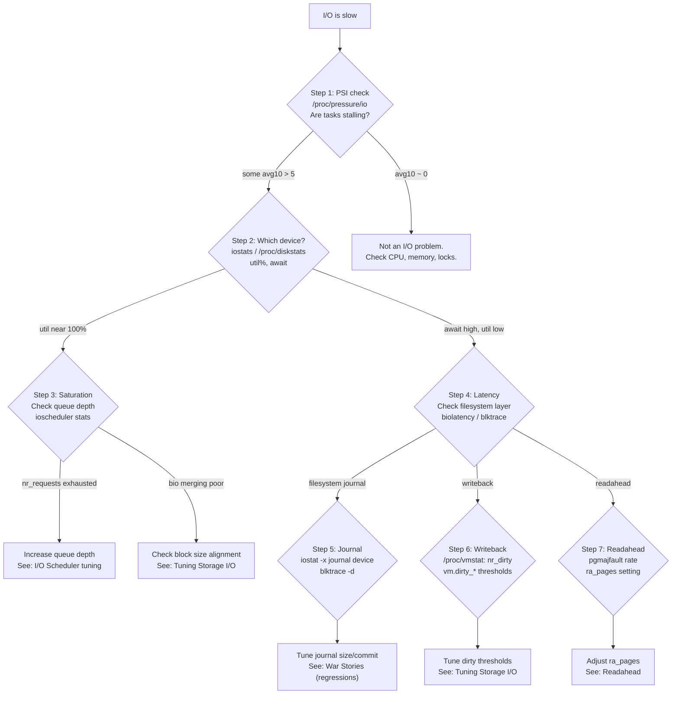

# Why is my I/O slow? (diagnosis guide)

> A systematic troubleshooting guide for I/O performance problems — from the first symptom to the root cause

## The problem

Your application is slow, and you suspect I/O. But "I/O problem" covers a wide range: write stalls from dirty throttling, read latency from readahead mismatches, queue depth exhaustion on the block layer, filesystem journal contention, writeback flusher storms, or scheduler interference. This guide gives you a systematic path from observation to root cause.

## Decision flowchart



---

## Step 1: Is it I/O at all?

Confirm I/O pressure exists before investigating the I/O stack. Since Linux 4.20 ([commit 0e94682b73bf](https://git.kernel.org/linus/0e94682b73bf)), PSI (Pressure Stall Information) tracks tasks stalling on I/O directly.

```bash
cat /proc/pressure/io
# some avg10=12.4 avg60=8.1 avg300=3.2 total=123456789
# full avg10=0.8 avg60=0.3 avg300=0.1 total=12345678
```

| Metric | Meaning |
|--------|---------|
| `some` | % of time at least one task is stalled waiting for I/O |
| `full` | % of time all tasks are stalled (no progress being made) |
| `avg10` | 10-second moving average |
| `avg60` / `avg300` | 60-second and 5-minute averages |

**How to interpret:**

- `some avg10 = 0`: No I/O pressure. The slowness is elsewhere — check `/proc/pressure/cpu` and `/proc/pressure/memory`.
- `some avg10 > 5`: Meaningful I/O pressure. Continue to Step 2.
- `full avg10 > 1`: Severe. The entire system is blocked on I/O — disk is saturated or a device has stalled.

!!! tip "PSI vs iostat"
    `iostat` tells you about *device utilization*. PSI tells you whether tasks are actually *waiting*. A device at 60% utilization is fine. A device at 60% utilization with PSI `full avg10 = 5` means tasks are stalling frequently — the device is the bottleneck even before saturation.

---

## Step 2: Which device and what kind of I/O?

```bash
iostat -xz 1
```

Key columns from `iostat -x`:

| Column | What it tells you |
|--------|------------------|
| `%util` | Fraction of time the device had at least one I/O in flight. Near 100% = saturated (for spinning disk) or queue full (for NVMe, where 100% is normal) |
| `await` | Average time from I/O submission to completion (ms). Includes queue wait + device service time |
| `r_await` / `w_await` | Separate read and write latency |
| `aqu-sz` | Average queue depth. High values mean I/Os are queuing |
| `rareq-sz` / `wareq-sz` | Average request size (KB). Very small requests suggest random I/O or alignment issues |

```bash
# More detail: per-device stats with merge ratios
iostat -xz 1 /dev/nvme0n1

# For NVMe specifically, check the queue stats
cat /sys/block/nvme0n1/queue/nr_requests    # maximum queue depth
cat /sys/block/nvme0n1/inflight             # currently in-flight I/Os
```

**What the numbers mean:**

- `await` consistently above device spec (e.g., > 1ms for NVMe, > 10ms for SSD): queue saturation or a kernel-layer bottleneck (scheduler, BIO merging, filesystem).
- `aqu-sz` >> `nr_requests`: I/Os are being throttled before reaching the device. Check `blk-mq` queue stats.
- `rareq-sz` < 16KB on a database workload: random I/O, or misaligned writes forcing RMW cycles.

---

## Step 3: Identify write vs read pressure separately

```bash
# Watch read and write bytes/second separately
vmstat -d 1

# Or: use /proc/diskstats directly
# Fields (after device name): reads completed, reads merged, sectors read, ms reading,
#                              writes completed, writes merged, sectors written, ms writing,
#                              I/Os in progress, ms doing I/O, weighted ms doing I/O
cat /proc/diskstats | grep nvme0n1
```

Check `/proc/vmstat` for page cache behavior:

```bash
grep -E '(pgpgin|pgpgout|pswpin|pswpout|pgmajfault|pgfault|nr_dirty|nr_writeback|nr_dirtied|nr_written)' /proc/vmstat
```

Key counters:

| Counter | What it means |
|---------|---------------|
| `pgmajfault` | Major page faults — reads from disk to satisfy a page fault. High rate means working set exceeds RAM |
| `nr_dirty` | Pages in the page cache that are dirty (modified but not yet written to disk) |
| `nr_writeback` | Pages currently being written to disk by writeback. Persistently high means writeback is behind |
| `nr_dirtied` | Running total of pages ever dirtied. Rate indicates write workload intensity |
| `nr_written` | Running total of pages ever written to disk. `nr_dirtied - nr_written` approximates the writeback lag |

---

## Step 4: Diagnose write stalls (dirty throttling)

If writes are slow and `nr_dirty` is consistently high, the application may be hitting dirty throttling in `balance_dirty_pages()`.

```bash
# Check dirty thresholds
cat /proc/sys/vm/dirty_background_ratio   # % of RAM: background writeback starts
cat /proc/sys/vm/dirty_ratio              # % of RAM: application writers start getting throttled
cat /proc/sys/vm/dirty_background_bytes  # absolute alternative to dirty_background_ratio
cat /proc/sys/vm/dirty_bytes             # absolute alternative to dirty_ratio
cat /proc/sys/vm/dirty_writeback_centisecs  # how often pdflush/kworker runs (in 1/100 s)
cat /proc/sys/vm/dirty_expire_centisecs    # how old dirty pages must be before flusher takes them

# Current state
grep -E '(nr_dirty|nr_writeback|dirty_thresh|nr_dirty_threshold)' /proc/vmstat
```

**Detecting throttling with `ftrace`:**

```bash
# Trace dirty throttling using bpftrace — measures time spent inside
# balance_dirty_pages_ratelimited(), which is where write() stalls occur
bpftrace -e '
kprobe:balance_dirty_pages_ratelimited { @start[tid] = nsecs; }
kretprobe:balance_dirty_pages_ratelimited /@start[tid]/ {
    $us = (nsecs - @start[tid]) / 1000;
    if ($us > 1000) {  /* only log stalls > 1ms */
        printf("dirty throttle stall: %s pid %d: %d us\n", comm, pid, $us);
    }
    delete(@start[tid]);
}'

# Or use the writeback tracepoints to see throttle decisions:
# (check which are available on your kernel first)
ls /sys/kernel/debug/tracing/events/writeback/ | grep -E '(balance|dirty)'
echo 1 > /sys/kernel/debug/tracing/events/writeback/writeback_dirty_page/enable
echo 1 > /sys/kernel/debug/tracing/tracing_on
sleep 5
echo 0 > /sys/kernel/debug/tracing/tracing_on
cat /sys/kernel/debug/tracing/trace | grep writeback_dirty | head -20
echo 0 > /sys/kernel/debug/tracing/events/writeback/writeback_dirty_page/enable
```

If the bpftrace output shows frequent stalls (pauses > 1ms from `balance_dirty_pages_ratelimited`), write throttling is the cause. See [Writeback Internals](writeback-internals.md) for the algorithm details and [Tuning Storage I/O](tuning-storage.md) for remediation. See [Writeback Internals](writeback-internals.md) for the algorithm details and [Tuning Storage I/O](tuning-storage.md) for remediation.

---

## Step 5: Diagnose read stalls (page cache misses and readahead)

```bash
# Major fault rate: how many reads from disk to satisfy page faults
watch -n 1 'grep pgmajfault /proc/vmstat'

# Readahead hit/miss ratio
grep -E '(pgpgin|pgpgout|pra_hit|pra_miss)' /proc/vmstat
# Note: direct readahead hit tracking added in v5.12 via mm_readahead_* tracepoints

# Per-device readahead settings
cat /sys/block/sda/queue/read_ahead_kb    # readahead window size
```

**Detecting readahead waste with `bpftrace`:**

```bash
# Track readahead pages that were never used (wasted)
bpftrace -e '
tracepoint:mm:mm_readahead_file { @ra_issued = count(); }
tracepoint:mm:mm_filemap_add_to_page_cache {
    @cached = count();
}
interval:s:1 {
    printf("readahead: %d, cached: %d\n", @ra_issued, @cached);
    clear(@ra_issued); clear(@cached);
}'
```

Readahead that is never used wastes I/O bandwidth and pollutes the page cache, causing useful pages to be evicted. If your workload is random (database index lookups, key-value store), readahead is actively harmful:

```bash
# Disable readahead for a device doing purely random I/O
echo 0 > /sys/block/sda/queue/read_ahead_kb

# Or tune per-file with fadvise (application level)
# posix_fadvise(fd, 0, 0, POSIX_FADV_RANDOM);  // disables readahead for this fd
```

---

## Step 6: Diagnose block layer latency

When device `await` is high but the device itself is not saturated, the bottleneck is often in the block layer (scheduler, plug/unplug, BIO merging).

```bash
# Check which I/O scheduler is active
cat /sys/block/sda/queue/scheduler
# e.g.: [mq-deadline] kyber bfq none

# BFQ debug stats (if using BFQ)
cat /sys/kernel/debug/bfq/bfq.*/queues  # per-process queue stats

# Check for I/O being plugged/unplugged (blk_start_plug / blk_finish_plug)
# This is visible in blktrace output
```

**Using `blktrace` to see the full I/O lifecycle:**

```bash
# Capture block I/O trace on a device (Ctrl-C to stop)
blktrace -d /dev/sda -o - | blkparse -i -

# Key event codes in blkparse output:
# Q: I/O queued to the device driver
# G: get request (allocated from request pool)
# I: inserted into queue
# M: merged with existing request
# D: dispatched to driver
# C: completed

# The gap between Q and D is scheduler delay.
# The gap between D and C is device service time.
```

**Using `biolatency` (BCC/bpftrace) for a latency histogram:**

```bash
# BCC tools
/usr/share/bcc/tools/biolatency -d sda 10

# bpftrace equivalent
bpftrace -e '
kprobe:blk_account_io_start { @start[arg0] = nsecs; }
kprobe:blk_account_io_done /@start[arg0]/ {
    @latency_us = hist((nsecs - @start[arg0]) / 1000);
    delete(@start[arg0]);
}'
```

---

## Step 7: Diagnose filesystem-layer latency

When block device latency is fine but application I/O is still slow, the bottleneck is at the filesystem layer: journal contention, lock serialization, or extent tree overhead.

```bash
# ext4: journal stats via JBD2
ls /proc/fs/jbd2/                     # list active journals (one per mounted ext4)
cat /proc/fs/jbd2/sda1-8/info        # journal stats: commits, blocks written
# Fields: transactions committed, blocks logged, average commit time, etc.
# To check journaling mode (data=ordered, data=writeback, data=journal):
tune2fs -l /dev/sda1 | grep "Default mount options"

# xfs: per-filesystem stats
cat /proc/fs/xfs/stat
# Look for: xs_log_writes (journal write rate), xs_log_blocks (journal data written)
# High xs_log_noiclogs means log space is a bottleneck

# Generic: use strace on a slow process
strace -e trace=read,write,fsync,fdatasync,open,close -T -p <pid> 2>&1 | head -50
# -T shows time spent in each syscall
```

**Tracing VFS-layer latency:**

```bash
# opensnoop: trace open() calls and their latency
/usr/share/bcc/tools/opensnoop -p <pid>

# ext4slower: trace ext4 operations slower than a threshold (BCC)
/usr/share/bcc/tools/ext4slower 10  # show ops > 10ms

# fileslower: filesystem-agnostic version
/usr/share/bcc/tools/fileslower 10

# xfsslower, btrfsslower work the same way
```

---

## Step 8: Diagnose I/O from specific processes

```bash
# iotop: per-process I/O bandwidth and wait time
iotop -ao   # -a: accumulated since start, -o: only show processes doing I/O

# pidstat: per-process I/O stats
pidstat -d 1  # 1-second interval, disk I/O stats per process

# /proc/<pid>/io: per-process I/O accounting
cat /proc/<pid>/io
# rchar: bytes read (includes page cache hits — not all disk reads)
# wchar: bytes written (includes buffered writes not yet on disk)
# read_bytes: bytes actually read from storage
# write_bytes: bytes actually written to storage
# cancelled_write_bytes: writes cancelled because pages were truncated before flush
```

The difference between `wchar` and `write_bytes` reveals how much buffering is happening: a large gap means writes are being absorbed by the page cache and haven't hit disk yet.

---

## Step 9: Distinguish sync vs async I/O stalls

```bash
# Check if a process is blocked in sync I/O (D state)
ps aux | grep ' D '  # D = uninterruptible sleep = waiting for I/O

# Get the kernel stack of a blocked process to see where it's waiting
cat /proc/<pid>/wchan        # single word: function name where blocked
cat /proc/<pid>/stack        # full kernel stack trace (requires CAP_SYS_ADMIN)

# Or use /proc/<pid>/status
grep State /proc/<pid>/status
# State: D (disk sleep)
```

Common kernel stack frames for I/O waits:

| Stack frame | What it means |
|-------------|---------------|
| `io_schedule` / `io_schedule_timeout` | Generic block I/O wait |
| `wait_for_completion` | Waiting for a specific I/O to complete |
| `ext4_file_write_iter` + `jbd2_log_wait_commit` | Waiting for ext4 journal commit |
| `balance_dirty_pages_ratelimited` | Dirty throttling stall in `write()` |
| `filemap_fault` | Page fault reading from file (major fault) |
| `do_page_cache_ra` | Synchronous readahead in progress |

---

## Quick-reference checklist

```
[ ] PSI io/some > 5? — I/O pressure confirmed
[ ] iostat %util, await — which device, read or write?
[ ] nr_dirty high, nr_writeback high — writeback is behind
[ ] pgmajfault rate high — page cache misses, random I/O, or insufficient RAM
[ ] blktrace D→C latency high — device is slow or scheduler is holding I/Os
[ ] ext4slower / fileslower — filesystem layer contention
[ ] ps D-state processes — what are they blocked on (check /proc/pid/stack)?
[ ] iotop -ao — which process is responsible?
```

## Related pages

- [Writeback Internals](writeback-internals.md) — how `balance_dirty_pages` works
- [Readahead](readahead.md) — readahead algorithm and tuning
- [I/O Tracepoints](io-tracepoints.md) — complete tracepoint reference
- [ftrace for I/O](ftrace-io.md) — function-level tracing
- [perf for I/O](perf-io.md) — PMU-based I/O profiling
- [Tuning Storage I/O](tuning-storage.md) — sysctl and scheduler tuning
- [Debugging I/O Hangs](debugging-io-hangs.md) — when I/O is not just slow but stuck
