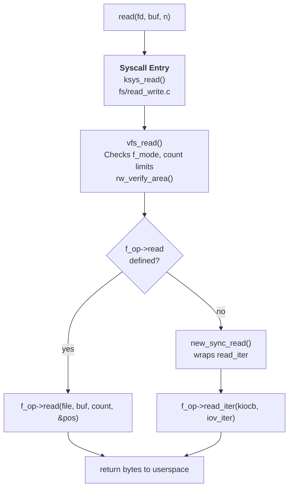
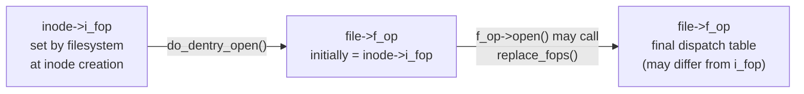

# struct file_operations

> The VFS dispatch table: how every filesystem operation on an open file gets routed to the right code

## What is struct file_operations?

When a process calls `open()`, the kernel walks the directory tree, finds an inode, and copies a pointer from `inode->i_fop` into the new `struct file` at `file->f_op`. From that moment forward, every `read()`, `write()`, `ioctl()`, `mmap()`, `fsync()`, and a dozen other operations on that file descriptor are dispatched through this single function-pointer table.

`struct file_operations` is the primary abstraction that makes VFS filesystem-agnostic. ext4, XFS, btrfs, tmpfs, procfs, a char device, a socket — they all look identical to the syscall layer. The kernel calls `f_op->read_iter()` and the right code runs, regardless of what sits underneath.



The chain is the same for every operation: syscall stub → VFS gate (permission check, size check) → `f_op` function pointer dispatch → filesystem implementation.

---

## The struct definition

The full struct lives in `include/linux/fs.h`. As of Linux 6.6:

```c
/* include/linux/fs.h */
struct file_operations {
    struct module *owner;
    loff_t (*llseek)(struct file *, loff_t, int);
    ssize_t (*read)(struct file *, char __user *, size_t, loff_t *);
    ssize_t (*write)(struct file *, const char __user *, size_t, loff_t *);
    ssize_t (*read_iter)(struct kiocb *, struct iov_iter *);
    ssize_t (*write_iter)(struct kiocb *, struct iov_iter *);
    int (*iopoll)(struct kiocb *kiocb, struct io_comp_batch *,
                  unsigned int flags);
    int (*iterate_shared)(struct file *, struct dir_context *);
    __poll_t (*poll)(struct file *, struct poll_table_struct *);
    long (*unlocked_ioctl)(struct file *, unsigned int, unsigned long);
    long (*compat_ioctl)(struct file *, unsigned int, unsigned long);
    int (*mmap)(struct file *, struct vm_area_struct *);
    unsigned long mmap_supported_flags;
    int (*open)(struct file *);
    int (*flush)(struct file *, fl_owner_t id);
    int (*release)(struct file *, fl_owner_t id);
    int (*fsync)(struct file *, loff_t, loff_t, int datasync);
    int (*fasync)(int, struct file *, int);
    int (*lock)(struct file *, int, struct file_lock *);
    unsigned long (*get_unmapped_area)(struct file *, unsigned long,
                                       unsigned long, unsigned long,
                                       unsigned long);
    int (*check_flags)(int);
    int (*flock)(struct file *, int, struct file_lock *);
    ssize_t (*splice_write)(struct pipe_inode_info *, struct file *,
                            loff_t *, size_t, unsigned int);
    ssize_t (*splice_read)(struct file *, loff_t *,
                           struct pipe_inode_info *, size_t, unsigned int);
    void (*splice_eof)(struct file *);
    int (*setlease)(struct file *, int, struct file_lock **, void **);
    long (*fallocate)(struct file *file, int mode, loff_t offset,
                      loff_t len);
    void (*show_fdinfo)(struct seq_file *m, struct file *f);
    ssize_t (*copy_file_range)(struct file *, loff_t, struct file *,
                               loff_t, size_t, unsigned int);
    loff_t (*remap_file_range)(struct file *file_in, loff_t pos_in,
                               struct file *file_out, loff_t pos_out,
                               loff_t len, unsigned int remap_flags);
    int (*fadvise)(struct file *, loff_t, loff_t, int);
    int (*uring_cmd)(struct io_uring_cmd *ioucmd, unsigned int issue_flags);
    int (*uring_cmd_iopoll)(struct io_uring_cmd *, struct io_comp_batch *,
                            unsigned int poll_flags);
};
```

All fields are function pointers except `owner` (a `struct module *` used by the reference counting machinery) and `mmap_supported_flags` (a bitmask of `MAP_*` flags the filesystem supports). Every pointer can be `NULL`; VFS checks before calling and returns an appropriate error (`EINVAL`, `EBADF`, `ESPIPE`) when an operation is not implemented.

---

## Field-by-field reference

### owner

```c
struct module *owner;
```

Set to `THIS_MODULE` in out-of-tree drivers. The VFS layer calls `try_module_get(f_op->owner)` during `open()` to prevent the module from unloading while a file is open. Built-in filesystems set this to `NULL`.

### llseek

```c
loff_t (*llseek)(struct file *, loff_t, int);
```

Called by `lseek(2)` and `lseek64(2)`. The third argument is the whence value (`SEEK_SET`, `SEEK_CUR`, `SEEK_END`, `SEEK_DATA`, `SEEK_HOLE`).

- If `NULL`, VFS falls back to `default_llseek()`, which handles `SEEK_SET`/`SEEK_CUR`/`SEEK_END` against `i_size`.
- Filesystems that support sparse files (XFS, ext4, btrfs) implement `SEEK_DATA`/`SEEK_HOLE` in their own `llseek`.
- Pipes and sockets set `no_llseek`, which returns `ESPIPE`.
- Devices where position has no meaning (e.g., `/dev/null`) set `noop_llseek`, which accepts any seek without actually moving anywhere.

### read and write (legacy)

```c
ssize_t (*read)(struct file *, char __user *, size_t, loff_t *);
ssize_t (*write)(struct file *, const char __user *, size_t, loff_t *);
```

The original single-buffer synchronous interfaces. The `loff_t *` is a pointer to the file's position, updated in-place.

Most filesystems have not implemented `read` directly since Linux 5.10. They implement `read_iter` instead, and VFS adapts it with `new_sync_read()` / `new_sync_write()` for callers that use the legacy interface. The only common users of the raw `read` pointer today are:

- procfs / sysfs pseudo-files that generate data on demand
- Some character devices with simple byte-stream semantics
- Legacy out-of-tree drivers

### read_iter and write_iter

```c
ssize_t (*read_iter)(struct kiocb *, struct iov_iter *);
ssize_t (*write_iter)(struct kiocb *, struct iov_iter *);
```

The modern interface. These two function pointers replaced the separate `aio_read`/`aio_write` pointers (removed in Linux 4.1) and the `readv`/`writev` equivalents. A single function handles:

- Synchronous single-buffer I/O (from `read(2)`/`write(2)`)
- Vectored I/O (from `readv(2)`/`writev(2)` / `preadv2(2)`)
- Asynchronous I/O (from `io_submit(2)` and `io_uring`)
- `O_DIRECT` (signalled by `IOCB_DIRECT` in `ki_flags`)

The `struct kiocb` carries per-operation state:

```c
/* include/linux/fs.h */
struct kiocb {
    struct file       *ki_filp;    /* file being operated on */
    loff_t             ki_pos;     /* current file offset */
    void (*ki_complete)(struct kiocb *, long);  /* async completion cb */
    void              *private;
    int                ki_flags;   /* IOCB_* flags */
    u16                ki_ioprio;  /* IO priority / class */
    struct wait_page_queue *ki_waitq; /* for async page-wait */
};
```

For synchronous calls, `ki_complete` is `NULL`. For async (io_uring, AIO), `ki_complete` is set to the completion callback; the filesystem can return `-EIOCBQUEUED` to signal that it will call `ki_complete` later from an interrupt or workqueue.

The `struct iov_iter` describes the destination (read) or source (write) buffer:

```c
/* include/linux/uio.h  — simplified */
struct iov_iter {
    u8         iter_type;   /* ITER_IOVEC, ITER_BVEC, ITER_KVEC, … */
    size_t     count;       /* bytes remaining */
    union {
        const struct iovec *iov;   /* userspace iovec array */
        const struct bio_vec *bvec; /* kernel page array (O_DIRECT) */
        const struct kvec   *kvec;  /* kernel virtual address array */
        /* … */
    };
    /* ... */
};
```

### iopoll

```c
int (*iopoll)(struct kiocb *kiocb, struct io_comp_batch *,
              unsigned int flags);
```

Used exclusively by io_uring's `IORING_SETUP_IOPOLL` mode. Instead of waiting for a completion interrupt, io_uring calls `iopoll` in a tight loop to check whether an in-flight `O_DIRECT` I/O has completed. The filesystem calls down through `bio_poll()` to drain the NVMe completion queue.

This is only viable for `O_DIRECT` I/O on devices with poll support (NVMe, some NVMe-oF targets). The trade-off: lower latency at the cost of a CPU core spinning. For a 100µs NVMe drive, polling beats interrupt overhead comfortably. For a spinning disk or a slow network device, it wastes CPU with no benefit.

### iterate_shared

```c
int (*iterate_shared)(struct file *, struct dir_context *);
```

Called by `getdents64(2)` to iterate a directory. The filesystem calls `dir_emit()` for each entry; the `dir_context` carries a callback and the current position. The `_shared` suffix means multiple readers can iterate concurrently (holding `i_rwsem` shared), which is safe for most on-disk formats.

The older `iterate` (exclusive lock) was removed in Linux 6.5.

### poll

```c
__poll_t (*poll)(struct file *, struct poll_table_struct *);
```

Called by `poll(2)`, `select(2)`, and `epoll`. Returns a bitmask of `EPOLLIN`, `EPOLLOUT`, `EPOLLERR`, etc. The `poll_table_struct` allows the filesystem or driver to register a wait queue so that `epoll` can be woken when the state changes.

Regular files always return `EPOLLIN | EPOLLOUT` immediately (they are always "ready" from poll's point of view). The interesting implementations are in pipes, sockets, and device drivers.

### unlocked_ioctl and compat_ioctl

```c
long (*unlocked_ioctl)(struct file *, unsigned int, unsigned long);
long (*compat_ioctl)(struct file *, unsigned int, unsigned long);
```

`unlocked_ioctl` is called by `ioctl(2)`. The name is historical: the old `ioctl` pointer took the BKL (Big Kernel Lock); `unlocked_ioctl` signals that this implementation is BKL-free. All modern drivers use `unlocked_ioctl`.

`compat_ioctl` is called when a 32-bit process runs on a 64-bit kernel. If `NULL`, the kernel returns `-ENOTTY` for 32-bit ioctl calls. Drivers that use pointer-sized arguments in their ioctl structures must implement `compat_ioctl` to translate them.

### mmap

```c
int (*mmap)(struct file *, struct vm_area_struct *);
```

Called by `mmap(2)` after the VMA has been created but before it is inserted into the process address space. The filesystem must either call `generic_file_mmap()` (which sets `vma->vm_ops = &generic_file_vm_ops`) or configure `vm_ops` itself. See the [mmap as an I/O mechanism](mmap-io.md) page for the full fault path.

If `NULL`, `mmap(2)` returns `ENODEV`.

### open

```c
int (*open)(struct file *);
```

Called at the end of `do_dentry_open()`, after `f_op` has been assigned from `inode->i_fop`. The filesystem uses this to:

- Check access conditions that depend on open flags (e.g., block writes to an encrypted file that isn't fully set up)
- Initialize per-open private state (`file->private_data`)
- Increment quota or accounting counters
- Replace `f_op` entirely (see character devices below)

A non-zero return causes `open()` to fail with that error.

### flush

```c
int (*flush)(struct file *, fl_owner_t id);
```

Called when the last reference to a file descriptor within a process is dropped — before `release`. The distinction matters for NFS: `flush` is called on `close(2)` to flush any errors back to the caller while the fd is still nominally valid. Most local filesystems leave this `NULL`.

### release

```c
int (*release)(struct file *, fl_owner_t id);
```

Called when the `struct file` refcount drops to zero (the last `close()` or `dup()`-inherited descriptor is closed). This is the counterpart of `open`. The filesystem should free any state in `file->private_data`. The return value is ignored by VFS.

### fsync

```c
int (*fsync)(struct file *, loff_t, loff_t, int datasync);
```

Called by `fsync(2)`, `fdatasync(2)`, and `sync_file_range(2)`. The `loff_t` pair is the byte range to sync; `datasync` is 1 when called from `fdatasync(2)` (skip inode metadata unless needed to find the data). The filesystem must flush all dirty pages in the range and — unless `datasync` — the inode metadata to stable storage, then wait for the device to acknowledge.

### fasync

```c
int (*fasync)(int, struct file *, int);
```

Called when `F_SETFL` with `O_ASYNC` is used to set or clear asynchronous notification on the file descriptor. Drivers that support SIGIO implement this; most filesystems do not.

### lock and flock

```c
int (*lock)(struct file *, int, struct file_lock *);
int (*flock)(struct file *, int, struct file_lock *);
```

`lock` is called for POSIX record locks (`fcntl(F_SETLK)`). `flock` is called for BSD advisory locks (`flock(2)`). NFS overrides both to delegate locking to the server. Local filesystems typically leave both `NULL` and use the generic VFS lock manager.

### splice_read, splice_write, splice_eof

```c
ssize_t (*splice_read)(struct file *, loff_t *,
                       struct pipe_inode_info *, size_t, unsigned int);
ssize_t (*splice_write)(struct pipe_inode_info *, struct file *,
                        loff_t *, size_t, unsigned int);
void (*splice_eof)(struct file *);
```

Called by `splice(2)` and `sendfile(2)`. `splice_read` moves data from the file into a pipe; `splice_write` drains a pipe into the file. Both avoid a copy through userspace. `splice_eof` is called when the pipe is closed at EOF.

The generic implementations (`filemap_splice_read`, `iter_file_splice_write`) use the page cache splice path. See [Zero-copy I/O: splice, sendfile, and friends](splice-sendfile.md).

### fallocate

```c
long (*fallocate)(struct file *file, int mode, loff_t offset, loff_t len);
```

Called by `fallocate(2)`. The filesystem preallocates space for the byte range `[offset, offset+len)` according to `mode`:

| Mode flag | Meaning |
|-----------|---------|
| `0` | Preallocate blocks, update file size if needed |
| `FALLOC_FL_KEEP_SIZE` | Preallocate without extending file size |
| `FALLOC_FL_PUNCH_HOLE` | Deallocate range (create a hole) |
| `FALLOC_FL_COLLAPSE_RANGE` | Remove range, shift data down |
| `FALLOC_FL_INSERT_RANGE` | Insert zeros, shift data up |
| `FALLOC_FL_ZERO_RANGE` | Zero the range (allocated or not) |

If `NULL`, `fallocate(2)` returns `EOPNOTSUPP`.

### copy_file_range

```c
ssize_t (*copy_file_range)(struct file *src, loff_t src_off,
                           struct file *dst, loff_t dst_off,
                           size_t len, unsigned int flags);
```

Called by `copy_file_range(2)`. When both files are on the same filesystem, the filesystem can implement a server-side copy without ever moving data through the kernel's page cache. On btrfs and XFS, this is how reflink copies work: the destination extent list grows to reference the same physical blocks as the source without copying data.

If `NULL` — or if the source and destination are on different filesystems — VFS falls back to a read+write loop through the page cache.

### remap_file_range

```c
loff_t (*remap_file_range)(struct file *file_in, loff_t pos_in,
                           struct file *file_out, loff_t pos_out,
                           loff_t len, unsigned int remap_flags);
```

Called by `FICLONE`, `FICLONERANGE`, and `FIDEDUPERANGE` ioctls. Used for reflink (clone) and deduplication. Returns the number of bytes remapped.

### fadvise

```c
int (*fadvise)(struct file *, loff_t, loff_t, int);
```

Called by `fadvise64(2)`. Allows the application to hint at expected access patterns (`POSIX_FADV_SEQUENTIAL`, `POSIX_FADV_RANDOM`, `POSIX_FADV_DONTNEED`, etc.). Most filesystems leave this `NULL` and VFS handles it with the generic `generic_fadvise()` implementation.

### show_fdinfo

```c
void (*show_fdinfo)(struct seq_file *m, struct file *f);
```

Called when `/proc/<pid>/fdinfo/<fd>` is read. Allows the filesystem or driver to add extra lines (key: value) to the output. Used by eventfd, timerfd, io_uring, and a few others to expose internal state through procfs.

### uring_cmd and uring_cmd_iopoll

```c
int (*uring_cmd)(struct io_uring_cmd *ioucmd, unsigned int issue_flags);
int (*uring_cmd_iopoll)(struct io_uring_cmd *, struct io_comp_batch *,
                        unsigned int poll_flags);
```

New in Linux 5.19. `uring_cmd` is called when an io_uring SQE with opcode `IORING_OP_URING_CMD` is submitted against the file descriptor. The command is passed opaquely to the driver as a `struct io_uring_cmd`.

The primary use is NVMe passthrough: `/dev/ngXnY` NVMe character devices implement `nvme_uring_cmd()`, allowing userspace to submit arbitrary NVMe admin and I/O commands through io_uring without blocking a thread. `uring_cmd_iopoll` is the poll-mode completion counterpart for `IORING_SETUP_IOPOLL` rings.

---

## read vs read_iter

The kernel has carried two parallel read interfaces since Linux 4.1 when `aio_read` was folded into `read_iter`. Understanding when each is used matters for implementing and debugging filesystem code.

```
read(fd, buf, count)
  → ksys_read()                           [fs/read_write.c]
  → vfs_read()
  → if (f_op->read)
        f_op->read(file, buf, count, pos)
    else
        new_sync_read(file, buf, count, pos)
            → init_sync_kiocb(&kiocb, file)
            → import_ubuf(READ, buf, count, &iter)
            → call_read_iter(file, &kiocb, &iter)
                → f_op->read_iter(kiocb, iter)
```

`new_sync_read()` is the compatibility shim that makes the old `read` interface work for filesystems that have dropped the `read` pointer. It builds a `kiocb` with `ki_complete = NULL` (synchronous) and a single-entry `iov_iter` wrapping the user buffer, then calls `read_iter`.

### Why prefer read_iter

| Feature | read | read_iter |
|---------|------|-----------|
| Vectored I/O (`readv`) | No | Yes |
| Async I/O (io_uring, AIO) | No | Yes |
| `O_DIRECT` | Limited | Yes (IOCB_DIRECT) |
| io_uring fixed buffers | No | Yes |
| Wait/retry via ki_waitq | No | Yes |

Since Linux 5.10, the kernel deprecated separate `read`/`write` implementations for new filesystems. The last major holdout was sysfs, which moved to `read_iter` in 5.17. procfs pseudo-files that generate data on demand still commonly use `read` because they don't benefit from the additional complexity of `iov_iter`.

---

## How f_op is set

The dispatch table reaches a `struct file` through a chain of three assignments.

### Step 1: inode creation

When a filesystem reads or creates an inode, it sets `inode->i_fop`:

```c
/* fs/ext4/inode.c */
void ext4_set_inode_flags(struct inode *inode, bool init)
{
    if (S_ISREG(inode->i_mode))
        inode->i_fop = &ext4_file_operations;
    else if (S_ISDIR(inode->i_mode))
        inode->i_fop = &ext4_dir_operations;
    /* symlinks have no i_fop; VFS handles them via i_op->get_link */
}
```

### Step 2: do_dentry_open

When `open()` reaches `do_dentry_open()`, VFS copies `i_fop` to the new `struct file`:

```c
/* fs/open.c */
static int do_dentry_open(struct file *f,
                          struct inode *inode,
                          int (*open)(struct inode *, struct file *))
{
    /* ... permission and flag checks ... */

    f->f_op = fops_get(inode->i_fop);  /* increments module refcount */

    if (!open)
        open = f->f_op->open;
    if (open) {
        error = open(inode, f);         /* filesystem open() hook */
        if (error)
            goto cleanup_all;
    }
    /* ... */
}
```

### Step 3: f_op replacement in open()

A filesystem's `open()` callback can replace `f_op` entirely. This is how character devices work:

```c
/* fs/char_dev.c */
static int chrdev_open(struct inode *inode, struct file *filp)
{
    const struct file_operations *fops;
    struct cdev *p;

    /* look up cdev from major:minor */
    p = inode->i_cdev;
    fops = fops_get(p->ops);    /* driver's real file_operations */

    replace_fops(filp, fops);   /* swap out the generic chrdev fops */

    if (fops->open) {
        ret = fops->open(inode, filp);  /* driver's open() */
        /* ... */
    }
}
```

After `chrdev_open` returns, `filp->f_op` points to the driver's own `file_operations` — not the generic `def_chr_fops` that was there from `i_fop`. Future `read()`/`write()` calls go directly to the driver.



---

## ext4 file_operations

ext4 is the most-deployed Linux filesystem and a good reference for what a complete `file_operations` implementation looks like:

```c
/* fs/ext4/file.c */
const struct file_operations ext4_file_operations = {
    .llseek         = ext4_llseek,
    .read_iter      = ext4_file_read_iter,
    .write_iter     = ext4_file_write_iter,
    .iopoll         = iocb_bio_iopoll,
    .unlocked_ioctl = ext4_ioctl,
#ifdef CONFIG_COMPAT
    .compat_ioctl   = ext4_compat_ioctl,
#endif
    .mmap           = ext4_file_mmap,
    .open           = ext4_file_open,
    .release        = ext4_release_file,
    .fsync          = ext4_sync_file,
    .get_unmapped_area = thp_get_unmapped_area,
    .splice_read    = filemap_splice_read,
    .splice_write   = iter_file_splice_write,
    .fallocate      = ext4_fallocate,
};
```

Notable choices:

- No `read` pointer — `read_iter` only. VFS's `new_sync_read` handles compatibility.
- `ext4_file_read_iter` calls `generic_file_read_iter()` for buffered I/O, but intercepts `IOCB_DIRECT` to go through ext4's DIO path.
- `ext4_file_write_iter` handles encryption (ext4 uses `fscrypt`), inline data, and the distinction between buffered and direct writes.
- `ext4_llseek` extends `generic_file_llseek()` to add `SEEK_DATA`/`SEEK_HOLE` support by walking the extent tree.
- `iocb_bio_iopoll` is a generic helper (not ext4-specific) that calls `bio_poll()` on the kiocb's outstanding bio.

---

## Generic VFS implementations

VFS provides generic implementations that any filesystem can use directly or call from its own wrapper. These live primarily in `mm/filemap.c` and `fs/read_write.c`.

### I/O

| Function | Location | Purpose |
|----------|----------|---------|
| `generic_file_read_iter()` | `mm/filemap.c` | Buffered read via page cache; handles both sync and O_DIRECT |
| `generic_file_write_iter()` | `mm/filemap.c` | Buffered write via page cache |
| `filemap_splice_read()` | `fs/splice.c` | Splice from page cache into pipe (renamed from `generic_file_splice_read` in v5.18) |
| `iter_file_splice_write()` | `fs/splice.c` | Drain pipe into file via write_iter |

### Seeking

| Function | Location | Behavior |
|----------|----------|---------|
| `generic_file_llseek()` | `fs/read_write.c` | Handles SEEK_SET/CUR/END; serializes with i_rwsem |
| `generic_file_llseek_size()` | `fs/read_write.c` | Same but caller passes max size |
| `fixed_size_llseek()` | `fs/read_write.c` | For fixed-size devices/files |
| `noop_llseek()` | `fs/read_write.c` | Accepts seek, changes nothing (e.g., `/dev/null`) |
| `no_llseek()` | `fs/read_write.c` | Returns `ESPIPE` (pipes, sockets) |

### mmap

| Function | Location | Purpose |
|----------|----------|---------|
| `generic_file_mmap()` | `mm/mmap.c` | Sets `vma->vm_ops = &generic_file_vm_ops` |
| `generic_file_readonly_mmap()` | `mm/mmap.c` | Same, but denies `PROT_WRITE` |

### Synchronization

| Function | Location | Purpose |
|----------|----------|---------|
| `generic_file_fsync()` | `fs/libfs.c` | Calls `filemap_write_and_wait_range()` + `sync_blockdev()` |
| `noop_fsync()` | `fs/libfs.c` | Returns 0 immediately (RAM-backed filesystems) |

---

## Special file_operations

Different file types use radically different `file_operations`. The VFS layer sees them all identically.

### Character devices

```c
/* fs/char_dev.c */
/*
 * Installed as i_fop for all character special inodes.
 * chrdev_open() replaces f_op with the driver's real ops.
 */
const struct file_operations def_chr_fops = {
    .open  = chrdev_open,
    .llseek = noop_llseek,
};
```

Every character special file (`S_ISCHR`) starts with `def_chr_fops`. During `open()`, `chrdev_open()` looks up the registered driver by major/minor number and calls `replace_fops()`. From that point, `f_op` points to the driver's table.

Examples:

| Device | file_operations struct | Location |
|--------|----------------------|----------|
| `/dev/null`, `/dev/zero` | `null_fops` | `drivers/char/mem.c` |
| `/dev/urandom` | `urandom_fops` | `drivers/char/random.c` |
| `/dev/ttyS0` | `tty_fops` | `drivers/tty/tty_io.c` |
| `/dev/ngXnY` (NVMe char) | `nvme_ctrl_fops` | `drivers/nvme/host/core.c` |

### procfs and sysfs

procfs and sysfs pseudo-files generate data dynamically. They do not back a real inode with stored bytes; instead, `read()` calls a show function that formats kernel state into the user buffer on demand.

Most still implement the legacy `read` pointer (not `read_iter`) because they generate small, bounded output and the simpler interface is sufficient:

```c
/* Example: a simple procfs file using proc_ops */
static const struct proc_ops my_proc_fops = {
    .proc_open    = my_proc_open,
    .proc_read    = seq_read,       /* seq_file generic read */
    .proc_lseek   = seq_lseek,
    .proc_release = single_release,
};
```

For multi-page outputs (e.g., `/proc/net/tcp`, `/proc/slabinfo`), the `seq_file` API handles chunking: the kernel calls the `show()` callback repeatedly, buffering output into an internal page, and `seq_read()` hands chunks to userspace on each `read()` call.

### Pipes

```c
/* fs/pipe.c */
const struct file_operations pipefifo_fops = {
    .open           = fifo_open,
    .llseek         = no_llseek,
    .read_iter      = pipe_read,
    .write_iter     = pipe_write,
    .poll           = pipe_poll,
    .unlocked_ioctl = pipe_ioctl,
    .release        = pipe_release,
    .fasync         = pipe_fasync,
    .splice_write   = iter_file_splice_write,
    .splice_read    = filemap_splice_read,
    .show_fdinfo    = pipe_show_fdinfo,
};
```

Pipes diverge from regular files in important ways:

- `no_llseek` — position is meaningless; all data is consumed in order
- `pipe_read` blocks if the pipe is empty (unless `O_NONBLOCK`); `pipe_write` blocks if the pipe is full (default capacity: 65536 bytes, configurable via `F_SETPIPE_SZ`)
- `poll` returns `EPOLLIN` when data is available and `EPOLLOUT` when space is available
- EOF: `read` returns 0 when there are no writers; `write` receives `SIGPIPE` / `EPIPE` when there are no readers

### Sockets

Sockets are not created via the filesystem namespace — they are created by `socket(2)`. But they are represented internally as `struct file` objects with their own `file_operations`:

```c
/* net/socket.c */
static const struct file_operations socket_file_ops = {
    .owner      = THIS_MODULE,
    .llseek     = no_llseek,
    .read_iter  = sock_read_iter,
    .write_iter = sock_write_iter,
    .poll       = sock_poll,
    .unlocked_ioctl = sock_ioctl,
    .mmap       = sock_mmap,
    .release    = sock_close,
    .fasync     = sock_fasync,
    .splice_write = generic_splice_sendpage,
    .splice_read  = sock_splice_read,
    .show_fdinfo  = sock_show_fdinfo,
};
```

`sock_read_iter` and `sock_write_iter` wrap `recvmsg()` and `sendmsg()`, passing the `iov_iter` as the message data. The socket's `poll` drives `epoll` for network event notifications.

---

## mmap: f_op->mmap in detail

The `mmap(2)` syscall path reaches `f_op->mmap` after creating and partially initializing a VMA:

```
mmap(addr, len, prot, flags, fd, offset)
  → ksys_mmap_pgoff()
  → vm_mmap_pgoff()
  → do_mmap()
      → mmap_region()
          → vma_set_anonymous() or call_mmap()
              → f_op->mmap(file, vma)
```

At the point `mmap` is called, `vma->vm_start`, `vma->vm_end`, `vma->vm_pgoff`, and `vma->vm_flags` are already set. The filesystem must either:

1. **Call `generic_file_mmap()`**, which sets `vma->vm_ops = &generic_file_vm_ops`. This is correct for any filesystem that uses the page cache for its data.
2. **Set `vma->vm_ops` itself**, for filesystems with unusual fault behavior (DAX, huge pages, special coherency requirements).

```c
/* mm/filemap.c */
int generic_file_mmap(struct file *file, struct vm_area_struct *vma)
{
    struct address_space *mapping = file->f_mapping;

    if (!mapping->a_ops->read_folio)
        return -ENOEXEC;
    file_accessed(file);
    vma->vm_ops = &generic_file_vm_ops;
    return 0;
}

const struct vm_operations_struct generic_file_vm_ops = {
    .fault      = filemap_fault,
    .map_pages  = filemap_map_pages,
    .page_mkwrite = filemap_page_mkwrite,
};
```

When a process touches a page in the mapped range and there is no PTE, the hardware raises a page fault. The kernel calls `vma->vm_ops->fault()`, which is `filemap_fault()`. This function looks up the page in the address space's `i_pages` xarray. On a miss, it calls `a_ops->read_folio()` to read the page from disk, then maps the physical frame into the process's page table.

For the full fault path, see [mmap as an I/O mechanism](mmap-io.md) and [File-backed mmap and page faults](../mm/file-mmap.md).

---

## fallocate and copy_file_range

### fallocate

`fallocate(2)` asks the filesystem to manipulate the block allocation of a file range without necessarily writing data. The most common usage is preallocating space to avoid fragmentation:

```c
/* Preallocate 1 GB at offset 0 */
fallocate(fd, 0, 0, 1ULL << 30);
```

VFS dispatches to `f_op->fallocate()`:

```c
/* fs/open.c */
long do_fallocate(struct file *file, int mode, loff_t offset, loff_t len)
{
    /* ... bounds checks, frozen-fs check ... */
    return file->f_op->fallocate(file, mode, offset, len);
}
```

ext4's implementation (`ext4_fallocate()`) handles each `FALLOC_FL_*` mode separately, walking the extent tree to allocate, punch, collapse, or insert blocks. Notably:

- `FALLOC_FL_PUNCH_HOLE | FALLOC_FL_KEEP_SIZE` creates a sparse hole: the blocks are freed and reads from the range return zeroes.
- `FALLOC_FL_COLLAPSE_RANGE` is a non-trivial operation: it moves all extents above `offset + len` down by `len`, requiring a full extent-tree rewrite and careful journaling.

### copy_file_range

```c
/* fs/read_write.c */
ssize_t do_copy_file_range(struct file *file_in, loff_t pos_in,
                           struct file *file_out, loff_t pos_out,
                           size_t len, unsigned int flags)
{
    if (file_in->f_op->copy_file_range)
        return file_in->f_op->copy_file_range(file_in, pos_in,
                                              file_out, pos_out,
                                              len, flags);
    return generic_copy_file_range(file_in, pos_in,
                                   file_out, pos_out, len, flags);
}
```

When the filesystem implements `copy_file_range`, it can perform a server-side copy. On btrfs and XFS, if source and destination are on the same filesystem, this becomes a reflink: a new extent entry is added to the destination's extent tree pointing at the same physical blocks as the source. No data is read from or written to disk.

`generic_copy_file_range()` is the fallback: it reads from the source into the page cache and writes from the page cache to the destination. It is zero-copy in the sense that there is no kernel↔userspace copy, but data does move through DRAM.

---

## uring_cmd: NVMe passthrough

`IORING_OP_URING_CMD` (added in Linux 5.19) allows io_uring to issue opaque commands to a file descriptor. The command is passed as a fixed-size SQE payload to `f_op->uring_cmd()`:

```c
/* io_uring/uring_cmd.c */
int io_uring_cmd(struct io_uring_cmd *ioucmd, unsigned int issue_flags)
{
    struct file *file = ioucmd->file;

    if (!file->f_op->uring_cmd)
        return -EOPNOTSUPP;
    return file->f_op->uring_cmd(ioucmd, issue_flags);
}
```

The NVMe character device driver (`/dev/ngXnY`) implements `uring_cmd` to expose NVMe admin and I/O commands:

```c
/* drivers/nvme/host/ioctl.c */
static const struct file_operations nvme_ctrl_fops = {
    .owner          = THIS_MODULE,
    .open           = nvme_dev_open,
    .release        = nvme_dev_release,
    .unlocked_ioctl = nvme_dev_ioctl,
    .compat_ioctl   = compat_ptr_ioctl,
    .uring_cmd      = nvme_uring_cmd,
    .uring_cmd_iopoll = nvme_uring_cmd_iopoll,
};
```

`nvme_uring_cmd()` translates the io_uring SQE into an NVMe command (`struct nvme_command`), submits it to the NVMe queue, and returns `-EIOCBQUEUED`. When the NVMe completion queue entry arrives, the driver calls `io_uring_cmd_done()` to complete the SQE.

Use cases:
- Custom NVMe admin commands (Get/Set Features, Firmware Update) from userspace daemons without blocking a thread
- NVMe ZNS (Zoned Namespace) zone management commands
- Vendor-specific I/O commands for computational storage devices
- Low-latency I/O with `IORING_SETUP_IOPOLL` — the completion is polled via `uring_cmd_iopoll` rather than interrupt-driven

---

## The dispatch table in practice: tracing a write

To make the whole chain concrete, here is a `write(2)` on an ext4 file traced end-to-end:

```
write(fd, buf, 4096)
│
├── SYSCALL_DEFINE3(write)                    [fs/read_write.c]
│       ksys_write(fd, buf, count)
│           file = fdget_pos(fd)              ← get struct file from fd table
│           pos  = file_pos_read(file)
│           vfs_write(file, buf, count, &pos)
│
├── vfs_write()                               [fs/read_write.c]
│       rw_verify_area(WRITE, file, &pos, count)   ← size/offset checks
│       if (f_op->write)
│           f_op->write(file, buf, count, pos)     ← legacy path (not ext4)
│       else
│           new_sync_write(file, buf, count, pos)
│               init_sync_kiocb(&kiocb, file)
│               import_ubuf(WRITE, buf, count, &iter)
│               call_write_iter(file, &kiocb, &iter)
│
├── ext4_file_write_iter()                    [fs/ext4/file.c]
│       ext4_unwritten_wait(inode)            ← wait for unwritten extents
│       if (IS_ENCRYPTED(inode))
│           ext4_file_write_iter → fscrypt path
│       generic_file_write_iter(iocb, from)   ← fall through to mm/filemap.c
│
├── generic_file_write_iter()                 [mm/filemap.c]
│       inode_lock(inode)
│       generic_perform_write(iocb, from)
│           a_ops->write_begin()              ← ext4_write_begin()
│               grab_cache_page_write_begin() ← find/allocate page in i_pages
│               ext4_journal_start()          ← start jbd2 transaction
│           copy_page_from_iter_atomic()      ← copy userspace buf → page
│           a_ops->write_end()               ← ext4_write_end()
│               block_write_end()
│               ext4_journal_stop()
│           balance_dirty_pages_ratelimited() ← trigger writeback if needed
│       inode_unlock(inode)
│
└── return 4096 to userspace
    (data is in page cache; not yet on disk)
```

The key abstraction boundary is at `f_op->write_iter`: above it, VFS knows nothing about ext4. Below it, ext4 knows nothing about the syscall or process context. The `kiocb` and `iov_iter` carry all the information that needs to cross the boundary.

---

## Key source files

| File | Purpose |
|------|---------|
| `include/linux/fs.h` | `struct file_operations`, `struct file`, `struct kiocb`, `struct inode` definitions |
| `fs/read_write.c` | `vfs_read()`, `vfs_write()`, `new_sync_read()`, `new_sync_write()`, `generic_file_llseek()` |
| `fs/open.c` | `do_dentry_open()`, `do_sys_openat2()`, `do_fallocate()` |
| `fs/char_dev.c` | `chrdev_open()`, `def_chr_fops`, character device registration |
| `mm/filemap.c` | `generic_file_read_iter()`, `generic_file_write_iter()`, `filemap_fault()`, `generic_file_mmap()` |
| `fs/ext4/file.c` | `ext4_file_operations`, `ext4_file_read_iter()`, `ext4_file_write_iter()` |
| `fs/ext4/inode.c` | `ext4_set_inode_flags()`, `ext4_write_begin()`, `ext4_write_end()` |
| `fs/pipe.c` | `pipefifo_fops`, `pipe_read()`, `pipe_write()` |
| `net/socket.c` | `socket_file_ops`, `sock_read_iter()`, `sock_write_iter()` |
| `fs/splice.c` | `filemap_splice_read()`, `iter_file_splice_write()` |
| `io_uring/uring_cmd.c` | `io_uring_cmd()`, `io_uring_cmd_done()` |
| `drivers/nvme/host/ioctl.c` | `nvme_uring_cmd()`, `nvme_ctrl_fops` |
| `fs/libfs.c` | `generic_file_fsync()`, `noop_fsync()`, `noop_llseek()` |

---

## Further reading

- [Life of an open()](life-of-an-open.md) — how `f_op` reaches a `struct file` via `do_dentry_open()`
- [Buffered I/O](buffered-io.md) — `generic_file_read_iter` and the page cache in detail
- [Direct I/O](direct-io.md) — the `IOCB_DIRECT` path through `read_iter`
- [Vectored I/O](vectored-io.md) — `struct iov_iter` and how `readv`/`writev` map to `read_iter`
- [mmap as an I/O mechanism](mmap-io.md) — the `f_op->mmap` path and `filemap_fault`
- [Zero-copy I/O: splice, sendfile](splice-sendfile.md) — `splice_read`, `splice_write`, `copy_file_range`
- [fallocate](fallocate.md) — `FALLOC_FL_*` modes and filesystem implementations
- [Async I/O](async-io.md) — io_uring, `read_iter` with `ki_complete`, and `uring_cmd`
- [Life of a read()](life-of-a-read.md) — end-to-end trace from syscall to disk and back
- [Life of a write()](life-of-a-write.md) — end-to-end trace from syscall through writeback
