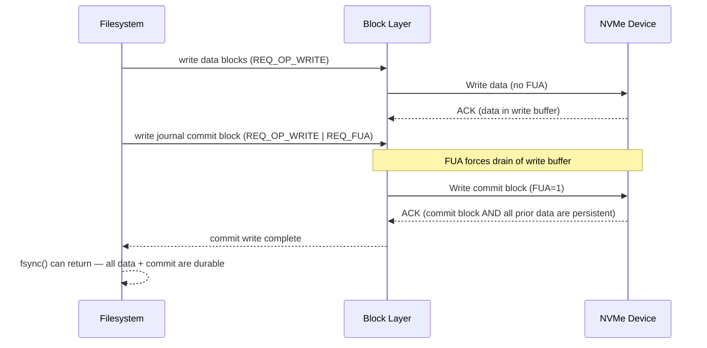

# Durability Semantics: fsync, fdatasync, O_SYNC, and Write Barriers

> What each durability syscall actually promises, where the guarantees break down, and how databases use them correctly

## The durability gap

`write()` returns when data is in DRAM — specifically in the kernel's **page cache**. The call does not touch persistent storage. Between the moment `write()` returns and the moment data survives a power cut, three independent layers can each lose data:

```
User process
    │  write(fd, buf, n)
    ▼
┌─────────────────────────────────────────────────────┐  ← DRAM
│  Page cache (kernel)                                │
│  Page marked PG_dirty. write() returns here.        │
│  Data lost if: kernel panic, OOM kill, power cut    │
└─────────────────────────────────────────────────────┘
    │  writeback (async, bdflush / wb_workfn)
    ▼
┌─────────────────────────────────────────────────────┐  ← DRAM (drive)
│  Drive write buffer (volatile DRAM on the device)   │
│  Data written to device but not yet to platter/cell │
│  Data lost if: power cut without battery-backed WBC │
└─────────────────────────────────────────────────────┘
    │  FLUSH CACHE / FUA command
    ▼
┌─────────────────────────────────────────────────────┐  ← persistent
│  Persistent storage medium (flash cells, platters)  │
│  Data survives power loss                           │
└─────────────────────────────────────────────────────┘
```

**Layer 1 — page cache**: A `write()` makes the page dirty and returns. The kernel's writeback threads flush dirty pages to the drive at their own pace (controlled by `dirty_expire_centisecs`, `dirty_writeback_centisecs`, and memory pressure). A kernel panic before writeback loses the data completely.

**Layer 2 — drive write buffer**: Modern drives have DRAM write caches. The kernel can deliver a block write to the drive and receive an ACK before the drive has committed to flash cells or platters. A power cut at this stage loses data unless the drive has a battery-backed write cache (BBWC) or the kernel issued a FLUSH command (or FUA — Force Unit Access — on the write itself).

**Layer 3 — storage medium**: Once data is on the medium, only physical destruction can lose it. Flash cells and platters are persistent.

The contract of each durability mechanism specifies which layers it closes:

| Mechanism | Flushes page cache | Flushes drive buffer | Notes |
|---|---|---|---|
| `write()` | No | No | Data in DRAM only |
| background writeback | Yes | No | Timing non-deterministic |
| `fsync(fd)` | Yes | Yes | Full durability for the file |
| `fdatasync(fd)` | Yes | Yes | Durability without non-essential metadata |
| `sync()` | Yes | No* | System-wide; see caveats below |
| `syncfs(fd)` | Yes | No* | Per-filesystem; see caveats below |
| `O_SYNC` write | Yes | Yes | Per-write, after each `write_iter` |
| `O_DSYNC` write | Yes | Yes (data+size) | Per-write, data-only variant |

*`sync()` and `syncfs()` do not unconditionally issue a FLUSH to each device; they rely on the filesystem's journal commit (which does issue a FLUSH) having run, or on the caller also calling `fsync()` on representative files.

---

## fsync()

### POSIX definition

POSIX requires that `fsync()` cause all modified data **and metadata** of the file to be transferred to the underlying hardware. "Transferred" means the hardware has acknowledged persistence — the application can assume the data will survive a power failure.

The key phrase is *all metadata*: `fsync()` must persist not only file data blocks but also the inode (size, block pointers, modification time, change time) and any filesystem-level journal records needed to make that inode state recoverable.

### Kernel implementation

The entry point is `SYSCALL_DEFINE1(fsync)` in `fs/sync.c`, which calls `do_fsync(fd, 0)`. The `0` is the `datasync` flag — for `fsync()` it is always 0. The path from syscall to filesystem is:

```
fsync(fd)
  → do_fsync(fd, datasync=0)            [fs/sync.c]
  → vfs_fsync(file, datasync=0)
  → vfs_fsync_range(file, 0, LLONG_MAX, 0)
  → file->f_op->fsync(file, 0, LLONG_MAX, datasync=0)
```

`vfs_fsync_range()` is the canonical VFS entry point:

```c
/* fs/sync.c */
int vfs_fsync_range(struct file *file, loff_t start, loff_t end, int datasync)
{
    struct inode *inode = file->f_mapping->host;

    if (!file->f_op->fsync)
        return -EINVAL;

    return file->f_op->fsync(file, start, end, datasync);
}
```

The range `[start, end]` is used by `msync()` for partial flushes; for a plain `fsync()` call the entire file range is passed. The `datasync` argument is forwarded unchanged to the filesystem, which uses it to decide whether to flush non-essential metadata.

### What "stable storage" means for different hardware

On rotating disk, stable storage is the platter. The drive must drain its volatile write cache — the kernel does this by issuing a `REQ_OP_FLUSH` block request, which translates to the ATA `FLUSH CACHE EXT` command or SCSI `SYNCHRONIZE CACHE`.

On SATA SSD and NVMe, stable storage is flash cells that have been programmed (not just sitting in the write buffer). NVMe exposes two mechanisms: the `FLUSH` command (drain the write cache) and FUA (Force Unit Access) on a specific write — a flag on the NVMe write command that bypasses the write buffer for that operation only.

On enterprise flash with battery-backed write cache (BBWC) or capacitor-backed persistent memory (PMem/Optane), writes to the device's RAM are already considered durable, so FLUSH can be made a no-op. The kernel respects a `BLK_FEAT_FUA` flag indicating the device honors FUA, and a `BLK_FEAT_WRITE_CACHE` flag indicating a volatile write cache is present.

### Ext4 journal modes and fsync cost

Ext4 has three journal modes that dramatically affect what `fsync()` must do:

**`data=ordered` (default)**: Data blocks are written to disk *before* the journal commit that records metadata changes. On `fsync()`:
1. Dirty data pages are written back via `filemap_write_and_wait_range()`.
2. `ext4_sync_file()` calls `jbd2_complete_transaction()` to commit the current journal transaction.
3. The journal commit block is written with a FLUSH or FUA to the journal device.
4. If the file's data is on a separate device, a second FLUSH may be needed.

This means `fsync()` typically causes one journal commit plus one storage barrier, even if no data has changed since the last commit (because the metadata journal entry referencing the data must be committed).

```c
/* fs/ext4/fsync.c */
int ext4_sync_file(struct file *file, loff_t start, loff_t end, int datasync)
{
    struct inode *inode = file->f_mapping->host;
    struct ext4_inode_info *ei = EXT4_I(inode);
    journal_t *journal = EXT4_SB(inode->i_sb)->s_journal;
    int ret = 0, err;
    tid_t commit_tid;
    bool needs_barrier = false;

    if (unlikely(ext4_forced_shutdown(inode->i_sb)))
        return -EIO;

    ASSERT(ext4_journal_current_handle() == NULL);

    trace_ext4_sync_file_enter(file, datasync);

    if (inode->i_sb->s_flags & SB_RDONLY) {
        /* Make sure that we read updated s_mount_flags value */
        smp_rmb();
        if (EXT4_SB(inode->i_sb)->s_mount_flags & EXT4_MF_FS_ABORTED)
            ret = -EROFS;
        goto out;
    }

    if (!journal) {
        ret = __generic_file_fsync(file, start, end, datasync);
        if (!ret)
            ret = ext4_sync_parent(inode);
        if (test_opt(inode->i_sb, BARRIER))
            goto issue_flush;
        goto out;
    }

    ret = filemap_write_and_wait_range(inode->i_mapping, start, end);
    if (ret)
        goto out;

    /*
     * data=writeback,ordered: if the inode is in the journal's
     * checkpoint list, we need to commit the journal.
     */
    if (datasync)
        commit_tid = atomic_read(&ei->i_datasync_tid);
    else
        commit_tid = atomic_read(&ei->i_sync_tid);

    if (journal->j_flags & JBD2_BARRIER &&
        !jbd2_trans_will_send_data_barrier(journal, commit_tid))
        needs_barrier = true;

    ret = jbd2_complete_transaction(journal, commit_tid);
    if (needs_barrier) {
issue_flush:
        err = blkdev_issue_flush(inode->i_sb->s_bdev);
        if (!ret)
            ret = err;
    }
out:
    trace_ext4_sync_file_exit(inode, ret);
    return ret;
}
```

**`data=writeback`**: Metadata is journaled but data block writes are not ordered with respect to journal commits. On `fsync()`, ext4 still calls `filemap_write_and_wait_range()` and commits the journal, but there is no ordering guarantee between data and metadata — a crash-and-recover can expose stale data in blocks that have valid metadata pointing to them. This mode is faster but requires the application to tolerate the risk.

**`data=journal`**: All data is written to the journal before being written to its final location. `fsync()` is expensive because it must commit the journal transaction that contains the data itself, not just metadata. Rarely used; reserved for applications that need strict ordering and can tolerate the write amplification.

### XFS: log force vs data write ordering

XFS does not use a block-level journal in the ext4 sense; it uses a log structured for transactions. `xfs_file_fsync()` issues a log force (`xfs_log_force_seq()`) to flush the in-memory log to disk, then optionally issues a storage barrier.

```c
/* fs/xfs/xfs_file.c */
int xfs_file_fsync(struct file *file, loff_t start, loff_t end, int datasync)
{
    struct xfs_inode *ip = XFS_I(file->f_mapping->host);
    struct xfs_mount *mp = ip->i_mount;
    int error = 0;
    int log_flushed = 0;
    xfs_lsn_t lsn = 0;

    trace_xfs_file_fsync(ip);

    error = file_write_and_wait_range(file, start, end);
    if (error)
        return error;

    xfs_iflags_clear(ip, XFS_ITRUNCATED);

    /*
     * If we have an RT and/or log subvolume we need to make sure
     * to flush the write cache the device used for file data
     * first. This is to ensure all pending I/O is flushed prior
     * to issuing the log force.
     */
    if (mp->m_rtdev_targp != mp->m_ddev_targp)
        blkdev_issue_flush(mp->m_rtdev_targp->bt_bdev);

    if (datasync && !xfs_ipincount(ip))
        goto out;

    if (!xfs_ilog_flushed(ip)) {
        lsn = xfs_fsync_lsn(ip, datasync);
        if (lsn) {
            error = xfs_log_force_seq(mp, lsn, XFS_LOG_SYNC,
                                      &log_flushed);
        }
    }

out:
    if (log_flushed || !mp->m_logdev_targp)
        goto out_flush;
    /* ... */
out_flush:
    if (mp->m_logdev_targp != mp->m_ddev_targp)
        error = blkdev_issue_flush(mp->m_logdev_targp->bt_bdev);
    return error;
}
```

### Typical fsync latency

These are representative numbers for a single `fsync()` call with a small write workload:

| Storage type | Typical fsync latency |
|---|---|
| NVMe SSD (PCIe 4.0) | 50–500 µs |
| NVMe SSD (PCIe 3.0) | 100–1000 µs |
| SATA SSD | 1–5 ms |
| SATA HDD (7200 RPM) | 5–15 ms |
| HDD (5400 RPM) | 10–30 ms |
| Network block device (iSCSI/FC) | 1–10 ms (depends on storage array) |

The latency is dominated by the time to drain the write cache and for the journal commit block to land on stable media. On NVMe, a FUA write to the journal removes the need for a separate FLUSH command, cutting latency roughly in half.

---

## fdatasync()

### POSIX definition

`fdatasync()` transfers file data and **enough metadata to retrieve the data** to stable storage. It explicitly does not need to flush metadata that does not affect the ability to read back data. From POSIX:

> *If the file is not in a special file, it is not required to update metadata such as st_atime or st_mtime.*

The metadata `fdatasync()` can skip:
- `atime` (last access time) — never affects data retrieval
- `mtime` (last modification time) — does not affect data location
- `ctime` (last status change time) — inode change timestamp

The metadata `fdatasync()` **must** flush:
- File size (`i_size`) — if the file grew, the new size is needed to locate the new data
- Block pointers — any newly allocated data blocks must be findable
- Indirect/extent tree changes — required to locate data

### The datasync flag path

`SYSCALL_DEFINE1(fdatasync)` calls `do_fsync(fd, 1)`. The `1` travels through `vfs_fsync_range()` and into the filesystem's `fsync` method as the `datasync` argument.

```c
/* fs/sync.c */
SYSCALL_DEFINE1(fdatasync, unsigned int, fd)
{
    return do_fsync(fd, 1);  /* datasync = 1 */
}
```

In ext4, `datasync=1` selects `ei->i_datasync_tid` instead of `ei->i_sync_tid`:

```c
/* fs/ext4/fsync.c — simplified */
if (datasync)
    commit_tid = atomic_read(&ei->i_datasync_tid);
else
    commit_tid = atomic_read(&ei->i_sync_tid);

ret = jbd2_complete_transaction(journal, commit_tid);
```

`i_datasync_tid` is the transaction ID of the last transaction that affected data-accessible metadata. For a file that has not changed size since the last journal commit, `i_datasync_tid` may already be committed, making the `jbd2_complete_transaction()` call return immediately. This is the common case for databases writing to pre-allocated files — there is no size change, so there is no metadata journal commit to wait for.

### When fdatasync is equivalent to fsync

`fdatasync()` must perform a full metadata flush (equivalent to `fsync()`) when:

- **File size changed**: a `write()` past end-of-file, or `truncate()`. The new `i_size` must be on disk before the data it describes can be retrieved safely.
- **New blocks allocated**: on block-based filesystems, if a write caused new extent or indirect-block entries to be created.
- **New file**: a newly created file has never had its inode committed. Both data and all inode metadata must be flushed.
- **File renamed or linked**: the directory entry is part of the metadata that describes the file's location.

For a database WAL file that is pre-allocated and written sequentially without size changes, `fdatasync()` skips the metadata journal commit entirely on every write after the first. This is why PostgreSQL uses `fdatasync()` for WAL writes — the WAL file is pre-allocated and its size rarely changes during normal operation.

### Why fdatasync is faster

The performance advantage is not about writing less data — both `fsync()` and `fdatasync()` must flush dirty data pages. The advantage is in journal commits: a metadata journal commit requires writing a commit block to the journal device and waiting for the FLUSH or FUA acknowledgment. On a heavily written filesystem, this commit may include unrelated metadata from other files, serializing all fsync() callers. `fdatasync()` avoids this serialization point when no metadata change is needed.

Benchmarks on a SATA SSD with ext4 `data=ordered` typically show `fdatasync()` at 2–3× the throughput of `fsync()` for small random writes to pre-allocated files, primarily because `fdatasync()` avoids the journal commit serialization.

---

## sync() and syncfs()

### sync() — system-wide flush

`sync()` instructs the kernel to flush all dirty pages and all journal transactions across all mounted filesystems. Historically `sync()` initiated writeback and returned immediately — this was intentional; the Unix documentation simply said it "schedules" writes, not that it waits for them.

**Linux behavior**: unlike the bare POSIX requirement, Linux `sync()` has waited for writeback and journal commits to complete for a very long time (the behaviour predates the 2.6 series — see the NOTES in `sync(2)`). The current kernel implementation delegates to `ksys_sync()`:

```c
/* fs/sync.c */
void ksys_sync(void)
{
    int nowait = 0, wait = 1;

    wakeup_flusher_threads(WB_REASON_SYNC);
    iterate_supers(sync_inodes_one_sb, NULL);  /* write back + wait on inodes */
    iterate_supers(sync_fs_one_sb, &nowait);   /* ->sync_fs, no wait */
    iterate_supers(sync_fs_one_sb, &wait);     /* ->sync_fs, wait */
    sync_bdevs(false);                         /* flush block-device caches */
    sync_bdevs(true);                          /* ... and wait */
}

SYSCALL_DEFINE0(sync)
{
    ksys_sync();
    return 0;
}
```

Despite waiting, `sync()` does **not** issue a FLUSH command to every storage device. It relies on the filesystem's journal commits (which do use barriers) to ensure ordering. If a filesystem has dirty data but no pending journal commit (e.g., `nobarrier` mount option), `sync()` may not fully flush the drive write cache.

**When to use `sync()`**: system shutdown, testing, and scripting scenarios where you need everything on disk. Not appropriate for application-level durability — the scope is too broad and the cost too high.

### syncfs() — per-filesystem flush

`syncfs()` was added in Linux 2.6.39 to give per-filesystem semantics without the system-wide cost of `sync()`. It takes a file descriptor and flushes the filesystem that contains it:

```c
/* fs/sync.c */
SYSCALL_DEFINE1(syncfs, int, fd)
{
    CLASS(fd, f)(fd);              /* scope-guarded fd, released on return */
    struct super_block *sb;
    int ret, ret2;

    if (fd_empty(f))
        return -EBADF;
    sb = fd_file(f)->f_path.dentry->d_sb;

    down_read(&sb->s_umount);
    ret = sync_filesystem(sb);
    up_read(&sb->s_umount);

    /* report any writeback error seen since this fd last checked */
    ret2 = errseq_check_and_advance(&sb->s_wb_err, &fd_file(f)->f_sb_err);
    return ret ? ret : ret2;
}
```

`sync_filesystem()` calls `sb->s_op->sync_fs()` (if defined) and then `sync_blockdev()` on the superblock's block device. It waits for writeback and journal commits. Like `sync()`, it does not explicitly send a FLUSH to the storage device unless the filesystem's journal commit does so.

**`syncfs()` vs multiple `fsync()` calls**: `syncfs()` is useful when you need to flush everything on a filesystem — for example before a snapshot — without calling `fsync()` on every file. It is cheaper than `sync()` and scoped to one filesystem. For per-file durability guarantees, `fsync()` or `fdatasync()` is still required.

---

## O_SYNC and O_DSYNC

### Per-fd synchronous I/O

`O_SYNC` and `O_DSYNC` are flags passed to `open()` that make every subsequent `write()` on the file descriptor synchronous — the write call blocks until data is on stable storage. They avoid the need for a separate `fsync()` call after each write.

```c
int fd = open("wal.log", O_WRONLY | O_CREAT | O_DSYNC, 0644);
write(fd, record, len);  /* blocks until data is on stable storage */
```

### IOCB flags and generic_write_sync

When `O_SYNC` or `O_DSYNC` is set on the file, the VFS sets corresponding flags in the `kiocb` struct before calling `write_iter`:

```c
/* include/linux/fs.h — open flags become kiocb flags */
static inline int iocb_flags(struct file *file)
{
    int res = 0;
    /* ... O_APPEND -> IOCB_APPEND, O_DIRECT -> IOCB_DIRECT ... */
    if (file->f_flags & O_DSYNC)
        res |= IOCB_DSYNC;   /* both O_DSYNC and O_SYNC set the O_DSYNC bit */
    if (file->f_flags & __O_SYNC)
        res |= IOCB_SYNC;    /* only full O_SYNC sets the __O_SYNC bit */
    return res;
}
```

(`O_SYNC` is defined as `__O_SYNC | O_DSYNC`, so a full `O_SYNC` file gets *both* `IOCB_DSYNC` and `IOCB_SYNC`, while `O_DSYNC` gets only `IOCB_DSYNC` — which is why the sync check must test `__O_SYNC`, not `O_SYNC`.)

After `write_iter` completes, `generic_file_write_iter()` checks these flags and calls `generic_write_sync()`:

```c
/* mm/filemap.c */
ssize_t generic_file_write_iter(struct kiocb *iocb, struct iov_iter *from)
{
    struct file *file = iocb->ki_filp;
    struct inode *inode = file->f_mapping->host;
    ssize_t ret;

    inode_lock(inode);
    ret = generic_write_checks(iocb, from);
    if (ret > 0)
        ret = generic_perform_write(iocb, from);
    inode_unlock(inode);

    if (ret > 0)
        ret = generic_write_sync(iocb, ret);
    return ret;
}

/* include/linux/fs.h */
static inline ssize_t generic_write_sync(struct kiocb *iocb, ssize_t count)
{
    if (iocb->ki_flags & IOCB_DSYNC) {
        int ret = vfs_fsync_range(iocb->ki_filp,
                                   iocb->ki_pos - count, iocb->ki_pos - 1,
                                   (iocb->ki_flags & IOCB_SYNC) ? 0 : 1);
        if (ret)
            return ret;
    }
    return count;
}
```

The `vfs_fsync_range()` call passes `datasync=1` for `O_DSYNC` (only `IOCB_DSYNC` set) and `datasync=0` for `O_SYNC` (both `IOCB_SYNC` and `IOCB_DSYNC` set). This is the precise semantic difference:

- **`O_DSYNC`** (`IOCB_DSYNC` only): calls `vfs_fsync_range(..., datasync=1)` — data and size-related metadata, no timestamp flush.
- **`O_SYNC`** (`IOCB_SYNC | IOCB_DSYNC`): calls `vfs_fsync_range(..., datasync=0)` — full metadata including timestamps.

In practice, for most write workloads on pre-allocated files, `O_DSYNC` and `O_SYNC` have identical performance because `fdatasync` and `fsync` behave identically when no pure-metadata change is pending.

### Performance cost

`O_SYNC` and `O_DSYNC` serialize each write with a storage flush. On random small writes, this eliminates all write coalescing:

| Write pattern | Buffered throughput | O_DSYNC throughput | Ratio |
|---|---|---|---|
| 4KB sequential, NVMe | ~3 GB/s | ~400 MB/s | 7× slower |
| 4KB random, NVMe | ~2 GB/s | ~30 MB/s | 60× slower |
| 64KB sequential, NVMe | ~3 GB/s | ~1 GB/s | 3× slower |
| 4KB sequential, SATA SSD | ~500 MB/s | ~50 MB/s | 10× slower |

The large ratio for random 4KB writes is because each write round-trips to the drive (commit latency ~100 µs on NVMe) and there is no pipelining.

### When to use O_SYNC / O_DSYNC

- **WAL files and redo logs**: databases that need every log record durable before acknowledging a commit. Using `O_DSYNC` on the WAL file avoids a separate `fdatasync()` call and reduces syscall count.
- **Audit logs**: security-critical logs where every event must survive a crash.
- **Transaction log files in message queues** (e.g., Kafka segment files): `O_DSYNC` on the segment file ensures each message is durable before acknowledging the producer.

**Do not use** `O_SYNC`/`O_DSYNC` for general application data files — the performance cost is too high and most applications are better served by occasional `fsync()` checkpoints.

---

## Write barriers in filesystems

### The ordering problem

Consider a database writing a data page and then a journal record describing that write. If the storage device reorders these two writes — journal record lands first, crash occurs, data page never arrives — recovery replays a journal entry that points to stale data. The file is now corrupt.

Write barriers solve this: a barrier ensures all writes issued before it are persistent before any write issued after it begins. On NVMe:
- **FUA (Force Unit Access)**: a flag on a specific write command that bypasses the volatile write cache for that command only.
- **FLUSH command** (`REQ_OP_FLUSH`): drains the entire volatile write cache; all previous writes are persistent before this command returns.

The kernel bio flags:

```c
/* include/linux/blk_types.h */
#define REQ_FUA         ((__force blk_opf_t)(1 << __REQ_FUA))
#define REQ_PREFLUSH    ((__force blk_opf_t)(1 << __REQ_PREFLUSH))
```

`REQ_FUA` sets the FUA bit on the NVMe write command. `REQ_PREFLUSH` causes a FLUSH command to be issued before the write. The block layer in `blk-flush.c` sequences these correctly for drives that require FLUSH+WRITE instead of FUA.

### How journaling filesystems use barriers



**ext4**: The journal commit block (`jbd2_commit_block`) is written with `REQ_FUA` (if the device supports FUA) or with a preceding `REQ_PREFLUSH` (if the device requires FLUSH before the commit). The `JBD2_BARRIER` journal flag controls whether barriers are used; it is enabled by default and can be disabled with the `nobarrier` mount option (dangerous — only for testing or battery-backed storage).

**XFS**: XFS uses `xlog_write()` to write log records, and the log record at the tail of a log flush is written with `REQ_FUA`. The log head is protected by `xfs_log_force()`, which issues the FUA write and waits for completion. Like ext4, XFS respects a `nobarrier` mount option.

**btrfs**: btrfs uses ordered writes for data (data is on disk before the tree root that references it) and writes the superblock with `REQ_FUA | REQ_PREFLUSH` to ensure the new tree root is persistent before the superblock is updated.

### Barrier detection and the nobarrier risk

The `nobarrier` mount option disables write barriers. On a storage device with a volatile write cache, this creates a window where journal commits are acknowledged before the data they describe is persistent. On crash-and-recover, the journal replays the commit but the referenced data blocks contain stale or zeroed content.

`nobarrier` is safe only when:
1. The block device is known to have no volatile write cache (e.g., a RAMDISK, certain PMem configurations, or a storage array with battery-backed NVRAM that is automatically flushed to persistent media).
2. The application explicitly handles durability at a higher level and does not rely on filesystem crash consistency.

To test whether a device honors FLUSH commands, see the [Benchmarking fsync](#benchmarking-fsync) section.

---

## The new-file durability trap

A common application mistake is to create a new file, write data, `fsync()` the file, and assume the file is durable. This is insufficient.

When a file is created, two things happen:
1. The file's inode is allocated and its data is written.
2. A directory entry (dentry) is added to the parent directory, linking the filename to the inode.

`fsync(fd)` flushes the inode and its data — but the directory entry is in the *parent directory's* inode, which has its own dirty state. A crash after `fsync(fd)` but before the directory entry is flushed can leave the data blocks on disk with no directory entry pointing to them. The file data is irrecoverable.

**Correct pattern for durable file creation:**

```c
/* Create a new file durably */
int fd = open("/data/new_file", O_WRONLY | O_CREAT | O_TRUNC, 0644);
write(fd, data, len);
fsync(fd);   /* flush file data and inode */
close(fd);

/* Also flush the directory containing the new file */
int dirfd = open("/data", O_RDONLY);
fsync(dirfd);   /* flush directory entry to disk */
close(dirfd);
```

The two `fsync()` calls ensure:
1. The file's data and inode are on disk.
2. The directory entry linking the filename to the inode is on disk.

On ext4 `data=ordered`, the two `fsync()` calls may collapse into a single journal commit if both happen within the same transaction window — but the application cannot assume this and must issue both calls.

### Who does this correctly

**SQLite**: in WAL mode, SQLite calls `fsync()` on the WAL file and on the directory after creating the WAL file. See `unixSync()` in `os_unix.c`:

```c
/* SQLite os_unix.c — simplified */
static int unixSync(sqlite3_file *id, int flags)
{
    unixFile *pFile = (unixFile*)id;
    /* ... */
    rc = full_fsync(pFile->h, isFullSync, isDataOnly);
    SimulateIOError( rc=1 );
    if( rc ){
        storeLastErrno(pFile, errno);
        return SQLITE_IOERR_FSYNC;
    }
    if( pFile->dirfd>=0 ){
        /* Also sync the directory that contains the WAL file */
        full_fsync(pFile->dirfd, 0, 0);
        robust_close(pFile, pFile->dirfd, __LINE__);
        pFile->dirfd = -1;
    }
    return SQLITE_OK;
}
```

**PostgreSQL**: `pg_fsync()` in `fd.c` calls `fsync()` on data files. After creating a new file in `PathNameOpenFile()`, PostgreSQL also opens and fsyncs the parent directory via `fsync_fname()`. See `storage/file/fd.c` and `storage/smgr/md.c`.

**LevelDB / RocksDB**: both call `SyncDir()` after creating new SST files, which opens the directory with `O_RDONLY` and calls `fsync()` on it. In RocksDB, `env/io_posix.cc` contains `PosixDirectory::FsyncWithDirOptions()`.

---

## Durability matrix

The following table summarizes what each write mechanism guarantees across the three durability layers:

| Mechanism | Page cache flushed | Drive write cache flushed | Survives power loss | Notes |
|---|---|---|---|---|
| `write()` | No | No | No | Data in DRAM only |
| `write()` + background writeback | Yes (eventually) | No | No | Timing non-deterministic |
| `write()` + `fsync()` | Yes | Yes | Yes | Full durability for the file |
| `write()` + `fdatasync()` | Yes | Yes | Yes | No non-essential metadata flush |
| `write()` + `sync()` | Yes | Partially* | Partially* | System-wide; barriers via journal |
| `O_SYNC` write | Yes | Yes | Yes | Per-write; full metadata |
| `O_DSYNC` write | Yes | Yes | Yes | Per-write; data + size metadata |
| `O_DIRECT` write | Yes (bypass) | No | No | Bypasses page cache; drive buffer still volatile |
| `O_DIRECT` + `O_DSYNC` | Yes (bypass) | Yes | Yes | Bypasses page cache AND flushes drive cache |
| `O_DIRECT` + `fsync()` | Yes (bypass) | Yes | Yes | Most common DB pattern |

*`sync()` flushing the drive write cache depends on whether a journal commit with barriers runs during the sync.

---

## Atomic write guarantees

### POSIX atomicity and its limits

POSIX does **not** guarantee that `write()` is atomic with respect to concurrent readers. A reader calling `read()` on the same file concurrently with a `write()` may see a partial write — some bytes old, some bytes new, depending on page cache state and filesystem implementation.

POSIX does guarantee:

- `O_APPEND` writes are atomic **for the offset assignment only** — the file offset is assigned atomically so that two concurrent `write()` calls with `O_APPEND` do not assign the same offset. The data of each write is serialized.
- `pwrite()` updates are visible atomically at the sector level on most Linux filesystems (ext4, xfs, btrfs) for writes within a single filesystem block, but this is an implementation detail, not a POSIX guarantee.

### O_APPEND atomicity

When a file is opened with `O_APPEND`, the kernel holds `inode_lock` across the seek-to-end and write, making the offset assignment and the write itself atomic with respect to other `O_APPEND` writers on the same inode. This is why write(2) says:

> *If the O_APPEND file status flag is set on the open file description, then a write() shall atomically seek the file offset to the end of the file before each write.*

This atomicity holds for writes that complete in a single `write()` call. If the write spans multiple pages and requires partial writes (e.g., due to signal interruption or `PIPE_BUF` limits), the kernel may release and reacquire the inode lock between page writes, breaking atomicity.

### io_uring RWF_ATOMIC (Linux 6.11+)

Linux 6.11 introduced `RWF_ATOMIC` via io_uring, providing true atomic writes up to `stx_atomic_write_unit_max` bytes (reported via `statx(2)`):

```c
/* include/uapi/linux/fs.h */
#define RWF_ATOMIC  ((__kernel_rwf_t)0x00000040)
```

With `RWF_ATOMIC`, the kernel guarantees that a concurrent reader sees either all of the write or none of it — no torn writes within the specified size boundary. NVMe devices expose atomic write unit size via `IDENTIFY` controller data. The filesystem communicates this to userspace via `stx_atomic_write_unit_min` and `stx_atomic_write_unit_max` in `struct statx`.

```c
struct statx sbuf;
statx(fd, "", AT_EMPTY_PATH, STATX_WRITE_FLAGS, &sbuf);

printf("atomic_write_unit_min = %u\n", sbuf.stx_atomic_write_unit_min);
printf("atomic_write_unit_max = %u\n", sbuf.stx_atomic_write_unit_max);

/* Issue an atomic write via io_uring */
struct io_uring_sqe *sqe = io_uring_get_sqe(&ring);
io_uring_prep_write(sqe, fd, buf, len, offset);
sqe->rw_flags = RWF_ATOMIC;
```

`RWF_ATOMIC` is separate from durability — an atomic write does not imply `fsync()` semantics. It guarantees torn-write protection, not persistence through a power loss.

---

## Common database patterns

### PostgreSQL WAL

PostgreSQL writes its Write-Ahead Log to files in `pg_wal/`. Each transaction's WAL records are written with `write()`, and `fdatasync()` is called before the transaction is acknowledged to the client. The WAL files are pre-allocated (via `posix_fallocate()`), so file size rarely changes — this means `fdatasync()` avoids the metadata journal commit on every flush.

The WAL flush path in `src/backend/access/transam/xlog.c`:

```c
/*
 * XLogFlush -- make sure xlog through given position is flushed to disk.
 */
void XLogFlush(XLogRecPtr record)
{
    /* ... write WAL pages to WAL file ... */

    issue_xlog_fsync(openLogFile, openLogSegNo, tli);
}

static void issue_xlog_fsync(int fd, XLogSegNo segno, TimeLineID tli)
{
    switch (sync_method) {
    case SYNC_METHOD_FDATASYNC:
        if (pg_fdatasync(fd) != 0)
            ereport(PANIC, ...);
        break;
    case SYNC_METHOD_FSYNC:
        if (pg_fsync_no_writethrough(fd) != 0)
            ereport(PANIC, ...);
        break;
    case SYNC_METHOD_OPEN_DSYNC:
        /* fd was opened with O_DSYNC; no explicit sync needed */
        break;
    /* ... */
    }
}
```

`wal_sync_method` defaults to `fdatasync` on Linux, `fsync` on macOS (where `fdatasync` behavior differs).

### SQLite WAL mode

In WAL mode, SQLite writes transactions to a WAL file and periodically checkpoints (copies WAL records back to the main database file). The checkpoint requires a specific fsync sequence:

1. `fdatasync(wal_fd)` — ensure WAL records are durable before the checkpoint starts.
2. Copy WAL records to database file.
3. `fdatasync(db_fd)` — ensure the database file has the checkpointed data.
4. Update the WAL header to mark the checkpoint complete.
5. `fdatasync(wal_fd)` again — ensure the checkpoint completion marker is durable.

This two-phase barrier pattern ensures that a crash at any point leaves either the WAL or the database file in a consistent state.

### MySQL InnoDB: innodb_flush_method

InnoDB exposes `innodb_flush_method` to control how it flushes data and log files:

| Method | Data files | Log files | Notes |
|---|---|---|---|
| `fsync` (default) | `fsync()` | `fsync()` | Portable; double-buffers via OS page cache |
| `O_DIRECT` | `O_DIRECT` | `fsync()` | Bypasses page cache for data; log still buffered |
| `O_DIRECT_NO_FSYNC` | `O_DIRECT` | `O_DIRECT` (no fsync) | Requires hardware BBWC; dangerous without it |
| `O_DSYNC` | buffered | `O_DSYNC` | Each log write synchronous; data file buffered |
| `littlesync` | buffered | `O_DSYNC` | Reduced sync for replicas |

`O_DIRECT_NO_FSYNC` skips `fsync()` on data files entirely, relying on `O_DIRECT` bypassing the page cache (so there is nothing to flush in the OS). It still requires the drive write cache to be drained — this is only safe with BBWC or an NVMe device that is configured to disable the volatile write cache.

### RocksDB: use_fsync

RocksDB defaults to `fdatasync()` (`use_fsync = false`) for SST file flushes and compaction output files. The `use_fsync` option switches to `fsync()`:

```cpp
/* RocksDB env/io_posix.cc */
IOStatus PosixWritableFile::Sync(const IOOptions& opts, IODebugContext* dbg) {
  if (use_direct_io()) {
    /* O_DIRECT: no page cache to flush */
    if (IsPageCacheFlushRequired()) {
      IOStatus s = Flush(opts, dbg);
      if (!s.ok()) return s;
    }
  }
#ifdef HAVE_FULLFSYNC
  if (use_fsync_) {
    if (::fcntl(fd_, F_FULLFSYNC) < 0)
      return IOError("fsync failed", filename_, errno);
  } else
#endif
  if (use_fsync_) {
    if (::fsync(fd_) < 0)
      return IOError("fsync failed", filename_, errno);
  } else {
    if (::fdatasync(fd_) < 0)
      return IOError("fdatasync failed", filename_, errno);
  }
  return IOStatus::OK();
}
```

`fdatasync()` is preferred because SST files are written once and never appended to after creation — they are immutable. The file size is set during the write and does not change, so `fdatasync()` skips the metadata journal commit with no durability impact.

macOS requires `F_FULLFSYNC` (an `fcntl` call) instead of `fsync()` because macOS `fsync()` only flushes to the kernel's write buffer, not to the drive's write cache. RocksDB handles this via `#ifdef HAVE_FULLFSYNC`.

---

## Benchmarking fsync

### fio: measuring throughput and latency

fio provides `--fsync=N` and `--fdatasync=N` options to issue a sync every N writes:

```bash
# Baseline: buffered writes, no fsync
fio --name=buffered --rw=randwrite --bs=4k --size=1G \
    --filename=/mnt/test/bench --ioengine=libaio --iodepth=32 \
    --numjobs=1 --runtime=30 --time_based

# fdatasync after every write
fio --name=fdatasync --rw=randwrite --bs=4k --size=1G \
    --filename=/mnt/test/bench --ioengine=sync --fsync=0 \
    --fdatasync=1 --numjobs=1 --runtime=30 --time_based

# fsync after every write
fio --name=fsync --rw=randwrite --bs=4k --size=1G \
    --filename=/mnt/test/bench --ioengine=sync --fsync=1 \
    --numjobs=1 --runtime=30 --time_based

# O_DSYNC writes
fio --name=odsync --rw=randwrite --bs=4k --size=1G \
    --filename=/mnt/test/bench --ioengine=sync \
    --sync_file_range=write:4k --sync=1 \
    --open_flags=O_DSYNC --numjobs=1 --runtime=30 --time_based
```

Key fio output fields for fsync benchmarking:
- `lat (usec)`: per-operation latency including the fsync
- `iops`: operations per second
- `clat percentiles`: 99th/99.9th percentile latency reveals outliers

### bpftrace: per-fsync latency

Measure actual fsync latency distribution from userspace to kernel return:

```bash
# Histogram of fsync() latency in microseconds
bpftrace -e '
tracepoint:syscalls:sys_enter_fsync { @start[tid] = nsecs; }
tracepoint:syscalls:sys_exit_fsync  /@start[tid]/
{
    @fsync_lat_us = hist((nsecs - @start[tid]) / 1000);
    delete(@start[tid]);
}
'

# Track fsync latency per process
bpftrace -e '
tracepoint:syscalls:sys_enter_fsync { @start[tid] = nsecs; }
tracepoint:syscalls:sys_exit_fsync  /@start[tid]/
{
    @lat_by_proc[comm] = hist((nsecs - @start[tid]) / 1000);
    delete(@start[tid]);
}
'

# Alert on any fsync over 10ms
bpftrace -e '
tracepoint:syscalls:sys_enter_fsync { @start[tid] = nsecs; }
tracepoint:syscalls:sys_exit_fsync  /@start[tid]/
{
    $lat_us = (nsecs - @start[tid]) / 1000;
    if ($lat_us > 10000) {
        printf("SLOW fsync: pid=%d comm=%s lat=%d us\n",
               pid, comm, $lat_us);
    }
    delete(@start[tid]);
}
'
```

### Detecting whether a drive honors FLUSH

A drive that ignores FLUSH commands will report very low fsync latency — too low. On NVMe with no write cache, fsync on a 4KB write should take ~50–200 µs. If you see consistent 10–20 µs, the drive may be ignoring FLUSH.

The definitive test is the write-cache discard test:

```bash
# 1. Write a large amount of data (fills write cache)
fio --name=fill --rw=write --bs=1M --size=4G \
    --filename=/dev/nvme0n1 --ioengine=libaio --iodepth=32 \
    --direct=1

# 2. Immediately cut power (or use a VM snapshot rollback)
# 3. On next boot, check if the last writes are present

# For testing without cutting power: use hdparm/nvme-cli to
# check if volatile write cache is enabled
hdparm -I /dev/sda | grep -i cache
nvme id-ctrl /dev/nvme0 | grep vwc   # vwc=1 means volatile write cache present
nvme id-ctrl /dev/nvme0 | grep awun  # atomic write unit normal
```

Check drive write cache status with `nvme-cli`:

```bash
# Check if volatile write cache is enabled on NVMe
nvme get-feature /dev/nvme0 -f 6    # Feature ID 6 = Volatile Write Cache

# For SATA drives
hdparm -W /dev/sda    # 1 = write caching enabled, 0 = disabled

# Check if drive supports and uses FUA
cat /sys/block/nvme0n1/queue/write_cache   # "write back" or "write through"
```

A device reporting `write through` does not buffer writes and does not require FLUSH commands — `fsync()` on such a device is a no-op at the barrier level (data still needs to be written, but no FLUSH is needed).

---

## Key source files

| File | Purpose |
|---|---|
| `fs/sync.c` | `fsync()`, `fdatasync()`, `sync()`, `syncfs()` syscall implementations; `vfs_fsync_range()` |
| `mm/filemap.c` | `filemap_write_and_wait_range()`, `generic_file_write_iter()`, `generic_write_sync()` |
| `fs/ext4/fsync.c` | `ext4_sync_file()` — ext4's fsync implementation |
| `fs/xfs/xfs_file.c` | `xfs_file_fsync()` — XFS's fsync implementation |
| `fs/btrfs/file.c` | `btrfs_sync_file()` — btrfs's fsync implementation |
| `fs/jbd2/commit.c` | `jbd2_journal_commit_transaction()` — ext4 journal commit with barriers |
| `block/blk-flush.c` | `blkdev_issue_flush()`, flush sequencing for PREFLUSH and FUA |
| `include/linux/fs.h` | `kiocb`, `file_operations`, `address_space` struct definitions; `IOCB_SYNC`, `IOCB_DSYNC` flags |
| `include/linux/blk_types.h` | `REQ_FUA`, `REQ_PREFLUSH` bio flags |
| `include/uapi/linux/fs.h` | `RWF_ATOMIC`, `RWF_SYNC`, `RWF_DSYNC` userspace flags |

### Further reading

- POSIX `fsync` specification: The Open Group Base Specifications Issue 8, `<unistd.h>`
- [Filesystem Robustness - The Linux Documentation Project](https://www.kernel.org/doc/html/latest/filesystems/ext4/journal.html)
- Pillai et al., *All File Systems Are Not Created Equal* (OSDI 2014) — systematic study of application-level crash consistency bugs, including the new-file trap
- Zheng et al., *Fast Crash Recovery in RAMCloud* (SOSP 2013) — discussion of write barrier semantics at scale
- [PostgreSQL WAL Internals](https://www.postgresql.org/docs/current/wal-internals.html)
- [SQLite WAL mode documentation](https://www.sqlite.org/wal.html) — explains the checkpoint fsync sequence
- `Documentation/block/writeback_cache_control.rst` in the kernel tree — covers FUA and FLUSH from the block layer perspective
- `Documentation/filesystems/journalling.rst` in the kernel tree — covers ext4/jbd2 journal modes
