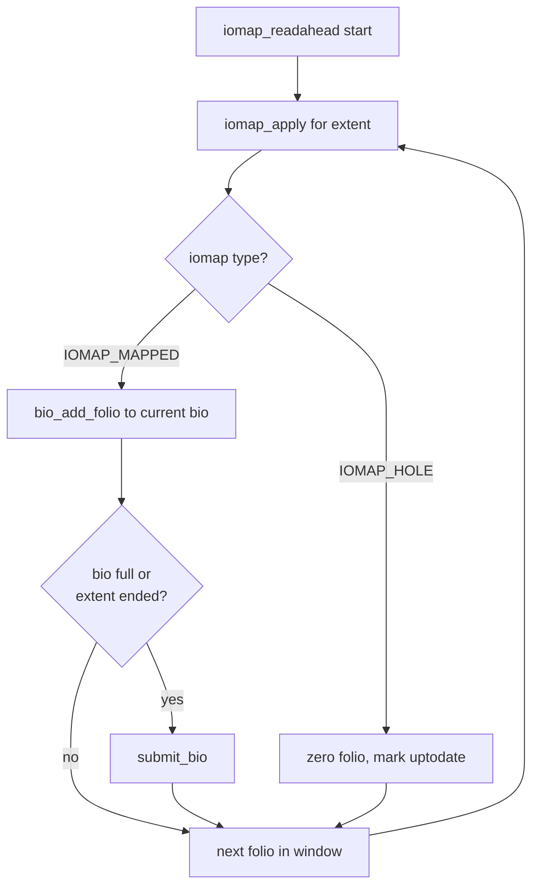

# iomap Internals

> The modern layer that replaces per-filesystem buffer_head boilerplate with a single `iomap_begin()` callback

## What iomap replaces

Before iomap, every Linux filesystem that wanted to support buffered reads, buffered writes, O_DIRECT, and writeback had to implement the same set of `address_space_operations` callbacks:

| Operation | Callback | What it did |
|-----------|----------|-------------|
| Buffered write | `write_begin` / `write_end` | Allocate blocks, get a locked page, copy user data in |
| Buffered read | `read_folio` / `readahead` | Map extents, submit bios |
| Direct I/O | `direct_IO` | Walk iov_iter, submit bios directly |
| Writeback | `writepages` | Iterate dirty pages, build write bios |

Each filesystem re-implemented these from scratch. ext4, XFS, btrfs, and every other filesystem had its own version — each subtly different, each carrying its own bugs. The shared infrastructure was `struct buffer_head`, which attached per-4 KB metadata to every page:

```c
/* include/linux/buffer_head.h */
struct buffer_head {
    unsigned long      b_state;      /* BH_Uptodate, BH_Dirty, BH_Mapped, … */
    struct buffer_head *b_this_page; /* circular list of page's buffers */
    union {
        struct page    *b_page;      /* page this bh is mapped to */
        struct folio   *b_folio;
    };
    sector_t           b_blocknr;   /* start block number */
    size_t             b_size;      /* size of mapping */
    struct block_device *b_bdev;
    bh_end_io_t        *b_end_io;
    void               *b_private;
    /* … */
};
```

This design has a fundamental scalability problem: one `buffer_head` per 512-byte sector, per page. A single 2 MB large folio backed by 512-byte sectors requires 4096 buffer heads. Allocating and tracking that metadata for every folio in the page cache is expensive, and the linked-list structure makes large-folio I/O fundamentally slow.

iomap, introduced by Dave Chinner and Christoph Hellwig starting in Linux 4.8 and reaching maturity in 4.14, cuts the knot. Instead of attaching per-block metadata to every page, iomap asks the filesystem a single question at I/O time: **"What is the block mapping for this file offset range?"** The filesystem answers via one callback — `iomap_begin()` — and iomap handles the rest.

```
Before iomap:
  filesystem implements write_begin → get_block() → buffer_head per sector → …
  filesystem implements readahead  → mpage_readahead() → buffer_head per sector → …
  filesystem implements direct_IO  → __blockdev_direct_IO() → buffer_head per sector → …

After iomap:
  filesystem implements iomap_begin() → returns struct iomap (one mapping for the range)
  iomap layer handles all paths: buffered write, readahead, direct I/O, writeback
```

The buffer_head is not gone from the kernel — many older filesystems still use it — but for filesystems that adopt iomap, it disappears entirely from the I/O hot path.

---

## struct iomap

The central data structure is `struct iomap`. It describes a single contiguous mapping from a range of file offsets to a physical disk address (or a special non-disk type like a hole or inline data).

```c
/* include/linux/iomap.h */
struct iomap {
    u64              addr;     /* disk address in bytes, or IOMAP_NULL_ADDR */
    loff_t           offset;   /* file offset of this mapping */
    u64              length;   /* length of the mapping in bytes */
    u16              type;     /* see IOMAP_* types below */
    u16              flags;    /* see IOMAP_F_* flags below */
    struct block_device *bdev;
    struct dax_device   *dax_dev;
    void               *inline_data;
    void               *private;
    const struct iomap_folio_ops *folio_ops;
    u64              validity_cookie;
};
```

### The `type` field

| Type | Value | Meaning |
|------|-------|---------|
| `IOMAP_HOLE` | 0 | File range has no backing blocks; reads return zeros |
| `IOMAP_DELALLOC` | 1 | Delayed allocation: blocks reserved but not yet physically assigned |
| `IOMAP_MAPPED` | 2 | Fully mapped: `addr` is a valid disk address |
| `IOMAP_UNWRITTEN` | 3 | Extent allocated but not yet written (reads as zeros; XFS preallocated extents) |
| `IOMAP_INLINE` | 4 | Data lives inline in the inode, not in a block; `inline_data` points to it |

### The `flags` field

| Flag | Meaning |
|------|---------|
| `IOMAP_F_NEW` | Extent was just allocated by `iomap_begin()`; `iomap_end()` may need to trim it if the write failed |
| `IOMAP_F_DIRTY` | Inode has dirty metadata that needs flushing |
| `IOMAP_F_SHARED` | Extent is shared (copy-on-write semantics); write must unshare |
| `IOMAP_F_MERGED` | This iomap covers more than one extent merged together (advisory) |
| `IOMAP_F_BUFFER_HEAD` | Filesystem still uses buffer_heads for this mapping (compatibility path) |
| `IOMAP_F_XATTR` | Mapping is for extended attribute data, not file data |

### `addr` encoding

`addr` is in bytes from the start of the block device. For `IOMAP_HOLE` and `IOMAP_INLINE` mappings, `addr` is set to `IOMAP_NULL_ADDR` (all-bits-set: `(u64)-1`), which signals to the iomap layer that there is no physical block address.

### `validity_cookie`

The `validity_cookie` field was added to handle a subtle race in buffered writes: between the time `iomap_begin()` returns a mapping and the time the folio is actually dirtied, the mapping can become stale (e.g., a punch-hole operation could free the extent). Filesystems set `validity_cookie` to a sequence number or generation counter. `iomap_valid()` in `struct iomap_folio_ops` is called before marking a folio dirty; if the mapping is no longer valid, the write is restarted with a fresh `iomap_begin()`.

---

## struct iomap_ops: the filesystem interface

Filesystems connect to iomap by providing `struct iomap_ops`:

```c
/* include/linux/iomap.h */
struct iomap_ops {
    int (*iomap_begin)(struct inode *inode, loff_t pos, loff_t length,
                       unsigned flags, struct iomap *iomap,
                       struct iomap *srcmap);
    int (*iomap_end)(struct inode *inode, loff_t pos, loff_t length,
                     ssize_t written, unsigned flags, struct iomap *iomap);
};
```

`iomap_end` is optional. If the filesystem does not need post-I/O work (e.g., converting UNWRITTEN extents to MAPPED), it can leave `iomap_end` as NULL.

### `iomap_begin`

Given a file offset `pos` and a byte range `length`, fill in `*iomap` with the block mapping that covers `pos`. The returned mapping does not need to cover the full `length` — it only needs to cover `pos` and extend forward as far as the mapping is contiguous. The iomap layer loops, calling `iomap_begin()` again for the remaining range after each call.

The `srcmap` parameter is used for copy-on-write paths (e.g., reflinked files). For a COW write, `srcmap` receives the source extent (the shared data to be copied) and `iomap` receives the newly allocated destination extent. For normal writes, `srcmap` is left zeroed.

### `flags` parameter

| Flag | Meaning |
|------|---------|
| `IOMAP_WRITE` | This is a write; the filesystem should allocate blocks if needed |
| `IOMAP_ZERO` | Write path is zeroing a range; optimization hint |
| `IOMAP_REPORT` | Read-only query; do not allocate |
| `IOMAP_FAULT` | Called from a page fault handler (mmap write) |
| `IOMAP_DIRECT` | O_DIRECT I/O |
| `IOMAP_NOWAIT` | Non-blocking; return `-EAGAIN` rather than sleep for locks or allocation |
| `IOMAP_OVERWRITE_ONLY` | Only succeed if the range is already allocated (no new block allocation) |

### `iomap_end`

Called after I/O completes for a range. `written` is the number of bytes successfully written (may be less than `length` on partial writes or errors). Common uses:

- **XFS UNWRITTEN conversion**: after a write into a preallocated UNWRITTEN extent, `iomap_end()` calls `xfs_iomap_write_unwritten()` to convert the written portion to MAPPED.
- **Delayed allocation cleanup**: if `iomap_begin()` set `IOMAP_F_NEW` and the write failed (`written == 0`), `iomap_end()` can release the reserved blocks.

### The `iomap_apply()` engine

All iomap paths funnel through `iomap_apply()` (in `fs/iomap/apply.c`):

```c
/* fs/iomap/apply.c */
loff_t iomap_apply(struct inode *inode, loff_t pos, loff_t length,
                   unsigned flags, const struct iomap_ops *ops,
                   void *data, iomap_actor_t actor)
{
    struct iomap iomap = { .type = IOMAP_HOLE };
    struct iomap srcmap = { .type = IOMAP_HOLE };
    loff_t written = 0, ret;

    ret = ops->iomap_begin(inode, pos, length, flags, &iomap, &srcmap);
    if (ret)
        return ret;

    /* Clamp to what iomap_begin actually returned */
    if (iomap.offset > pos) {
        /* … gap before the mapping: treat as a hole */
    }
    written = actor(inode, pos, min(length, iomap.offset + iomap.length - pos),
                    data, &iomap, &srcmap);

    if (ops->iomap_end)
        ops->iomap_end(inode, pos, length,
                       written > 0 ? written : 0, flags, &iomap);
    return written;
}
```

Callers then loop:

```c
while (length > 0) {
    ret = iomap_apply(inode, pos, length, flags, ops, data, actor);
    if (ret <= 0)
        break;
    pos    += ret;
    length -= ret;
}
```

This loop-and-callback structure is used by every iomap path: buffered writes, buffered reads, direct I/O, writeback, seek-hole/seek-data, fiemap, and zeroing.

```mermaid
sequenceDiagram
    participant Caller as iomap_file_buffered_write()
    participant Apply as iomap_apply()
    participant FS as ops->iomap_begin()
    participant Actor as iomap_write_actor()
    participant End as ops->iomap_end()

    loop while length > 0
        Caller->>Apply: pos, length, flags
        Apply->>FS: iomap_begin(pos, length, IOMAP_WRITE)
        FS-->>Apply: struct iomap (addr, offset, length, type)
        Apply->>Actor: actor(inode, pos, clamped_len, data, &iomap)
        Actor-->>Apply: bytes written
        Apply->>End: iomap_end(pos, length, written, flags)
        Apply-->>Caller: bytes written this iteration
    end
```

---

## iomap for buffered writes

```c
/* fs/iomap/buffered-io.c */
ssize_t iomap_file_buffered_write(struct kiocb *iocb, struct iov_iter *from,
                                  const struct iomap_ops *ops)
```

This is the function filesystems set as `file_operations.write_iter` (via `generic_file_write_iter()`, which calls it after acquiring `inode->i_rwsem`).

### Call tree

```
iomap_file_buffered_write()
  └── iomap_write_iter()                      ← outer loop over write range
        └── iomap_apply()                     ← calls iomap_begin for each chunk
              └── iomap_write_actor()
                    ├── iomap_write_begin()   ← find/allocate folio, handle uptodate
                    │     ├── filemap_grab_folio()
                    │     └── iomap_read_folio_sync()   ← if partial folio needs read-before-write
                    ├── copy_page_from_iter_atomic()    ← user data → folio
                    └── iomap_write_end()
                          ├── folio_mark_dirty()
                          └── folio_unlock()
  └── balance_dirty_pages_ratelimited()       ← dirty throttle after each chunk
```

### `iomap_write_begin()`

```c
/* fs/iomap/buffered-io.c */
static int iomap_write_begin(struct iomap_iter *iter, loff_t pos,
                             unsigned len, struct folio **foliop)
```

1. **Grab or allocate the folio** via `filemap_grab_folio()`. If the folio does not exist in the page cache, a new one is allocated and added.
2. **Check uptodate state**. If the write covers only a portion of the folio and the folio is not fully uptodate, a synchronous read is submitted for the missing portion. This is the "read-before-write" path: the kernel cannot hand a folio with stale data back to the user after a partial write.
3. For `IOMAP_INLINE` type: copy inline data into the folio directly.
4. For `IOMAP_UNWRITTEN`: the extent is allocated but zeroed on disk; the folio can be marked uptodate without a read.

### Dirty throttling

After copying user data into the folio and marking it dirty, `balance_dirty_pages_ratelimited()` is called. This enforces the kernel's dirty ratio limits: if too much memory is dirty (controlled by `/proc/sys/vm/dirty_ratio` and `dirty_background_ratio`), the writing process is put to sleep until the writeback threads drain enough dirty pages. This is the mechanism that prevents an unbounded dirty memory build-up.

---

## iomap for readahead

```c
/* fs/iomap/buffered-io.c */
void iomap_readahead(struct readahead_control *rac, const struct iomap_ops *ops)
```

Filesystems using iomap set `address_space_operations.readahead = iomap_readahead`. The readahead machinery in `mm/readahead.c` calls this with a `readahead_control` describing the window to prefetch.

### Call tree

```
iomap_readahead()
  └── iomap_readahead_iter()        ← for each extent in the window
        ├── [IOMAP_MAPPED]  → iomap_readahead_submit_bio()
        │     └── bio_add_folio() into a growing bio
        │           └── submit_bio() when bio fills or extent ends
        └── [IOMAP_HOLE]    → folio_zero_range() + folio_mark_uptodate()
```

### Bio coalescing

This is a key advantage over the buffer_head readahead path. With buffer heads, `mpage_readahead()` builds one bio per contiguous block run within a page. When pages are small (4 KB) and blocks are also small, you get many small bios.

With iomap readahead, the bio is built across consecutive folios that belong to the same mapping. As long as the disk addresses are contiguous, each new folio is appended to the same bio via `bio_add_folio()`. The bio is only submitted when:

- The mapping ends (a new `iomap_begin()` call is needed),
- The bio is full (`bio_full()` returns true), or
- The folio is already uptodate (no I/O needed).

On a large sequential read, this produces a single bio covering the entire readahead window — often 512 KB to 4 MB — dramatically reducing per-bio overhead in the block layer.



---

## iomap for direct I/O

```c
/* fs/iomap/direct-io.c */
ssize_t iomap_dio_rw(struct kiocb *iocb, struct iov_iter *iter,
                     const struct iomap_ops *ops,
                     const struct iomap_dio_ops *dops,
                     unsigned int dio_flags,
                     const struct iov_iter *done_before,
                     size_t private_size)
```

O_DIRECT bypasses the page cache. The block mapping from `iomap_begin()` is used to build bios directly from the user's iov_iter pages.

### Call tree

```
iomap_dio_rw()
  ├── kiocb_invalidate_post_direct_read()    ← flush any conflicting page cache
  └── iomap_apply() for each extent
        └── iomap_dio_iter()
              ├── [IOMAP_INLINE] → iomap_dio_inline_iter()   ← memcpy inline data
              ├── [IOMAP_HOLE]   → zero iov_iter destination (reads)
              └── [IOMAP_MAPPED / IOMAP_UNWRITTEN] → iomap_dio_bio_iter()
                    ├── iov_iter_get_pages2()   ← pin user pages
                    ├── bio_iov_iter_get_pages() ← add pages to bio
                    └── iomap_dio_submit_bio()  → submit_bio()
```

### Async vs sync completion

Direct I/O supports two completion modes depending on whether the `kiocb` is async (`ki_complete != NULL`) or sync:

**Async** (`io_uring`, `aio`):
1. Bios are submitted with a `bi_end_io` callback pointing to `iomap_dio_bio_end_io()`.
2. `iomap_dio_rw()` returns `-EIOCBQUEUED` immediately to indicate the operation is in flight.
3. When all bios complete, `iomap_dio_bio_end_io()` calls `kiocb->ki_complete(iocb, bytes_done)`.

**Sync** (regular `pread`/`pwrite` with `O_DIRECT`):
1. Bios are submitted and `wait_for_completion_io()` blocks the calling thread.
2. Returns the total bytes transferred (positive) or a negative error code.

### `struct iomap_dio_ops`

An optional second ops struct for direct I/O allows filesystems to hook completion:

```c
/* include/linux/iomap.h */
struct iomap_dio_ops {
    int (*end_io)(struct kiocb *iocb, ssize_t size, int error,
                  unsigned flags);
    void (*submit_io)(const struct iomap_iter *iter, struct bio *bio,
                      loff_t file_offset);
    struct bio_set *bio_set;
};
```

XFS uses `end_io` to convert UNWRITTEN extents after a direct write. `submit_io` allows filesystems to intercept bio submission (e.g., for encryption or zone management). If `bio_set` is non-NULL, it is used for bio allocation instead of `fs_bio_set`.

---

## struct iomap_folio_state: large folio tracking

The old buffer_head model tracked uptodate and dirty state per 512-byte sector, per page. With 4 KB pages and 512-byte sectors, that was 8 bits of uptodate state per page — manageable by embedding buffer_heads in the page.

With large folios (introduced in 5.16 for the file page cache, with practical use in 6.1+), a single folio can span 512 KB or more. Tracking 1024 sectors per folio using buffer_heads would be prohibitively expensive. iomap solves this with `struct iomap_folio_state`:

```c
/* fs/iomap/buffered-io.c */
struct iomap_folio_state {
    spinlock_t    state_lock;
    unsigned int  read_bytes_pending;
    atomic_t      write_bytes_pending;
    unsigned long state[];     /* bitmap: 1 bit per 512B sector for uptodate */
};
```

This structure is attached to the folio as `folio->private` (replacing the old buffer_head chain). The `state[]` flexible array member is sized at allocation time based on the folio order: a 2^N-page folio needs `2^N * PAGE_SIZE / 512` bits.

### State transitions

```
folio allocated, not uptodate
  → iomap_readahead submits bio for missing sectors
  → bio completion: iomap_finish_folio_read()
      → set uptodate bits for completed sectors
      → if all sectors uptodate: folio_mark_uptodate(), wake_up_folio()

partial write begins:
  → iomap_write_begin() checks if needed sectors are uptodate
  → if not: synchronous read for the partial page

folio dirtied:
  → write_bytes_pending tracks in-progress writes
  → iomap_write_end() decrements write_bytes_pending
  → if uptodate and no pending writes: folio_mark_dirty()
```

The `read_bytes_pending` counter tracks how many bytes of in-flight read I/O are outstanding for this folio. When it reaches zero, the folio is considered fully read and can be unlocked.

---

## iomap writeback

```c
/* fs/iomap/buffered-io.c */
int iomap_writepages(struct address_space *mapping,
                     struct writeback_control *wbc,
                     struct iomap_writepage_ctx *wpc,
                     const struct iomap_ops *ops)
```

Filesystems set `address_space_operations.writepages = iomap_writepages` (via a thin wrapper that sets up `struct iomap_writepage_ctx`).

### Call tree

```
iomap_writepages()
  └── write_cache_pages()              ← core mm/ dirty page iterator
        └── iomap_writepage()          ← called for each dirty folio
              └── iomap_writepage_map()
                    ├── iomap_begin()  ← get block mapping for this folio's offset
                    ├── iomap_writepage_map_blocks()
                    │     └── iomap_submit_ioend()   ← build/extend ioend
                    └── iomap_writepage_end_bio()    ← attached to bio as bi_end_io
```

### struct iomap_ioend

The writeback path introduces `struct iomap_ioend` as a per-extent write descriptor:

```c
/* fs/iomap/buffered-io.c */
struct iomap_ioend {
    struct list_head    io_list;     /* chain of ioends for this writeback run */
    u16                 io_type;     /* IOMAP_MAPPED, IOMAP_UNWRITTEN, … */
    u16                 io_flags;
    u32                 io_folios;   /* number of folios covered */
    struct inode       *io_inode;
    size_t              io_size;     /* bytes of I/O */
    loff_t              io_offset;   /* file offset */
    sector_t            io_sector;   /* start sector on disk */
    struct bio          *io_bio;     /* the bio for this extent */
    struct work_struct  io_work;     /* for scheduling end_io in process context */
    atomic_t            io_remaining;/* bios still in flight */
    xfs_extlen_t        io_length;   /* for UNWRITTEN conversion */
};
```

### Extent coalescing

Adjacent extents in the same `iomap_writepage_ctx` are merged into a single ioend and bio if:

1. The new extent immediately follows the previous one on disk (`io_sector + io_size/512 == new_sector`), and
2. The extent type is the same (both MAPPED, or both UNWRITTEN).

This merging is what allows iomap writeback to produce large sequential write bios even when dirty folios are individually small.

### UNWRITTEN conversion on completion

When a write into an UNWRITTEN extent completes, the on-disk extent status must be updated from UNWRITTEN to MAPPED (otherwise a subsequent crash-recovery read would return zeros for data that was written). This is handled in the bio completion callback chain:

```
bio_end_io → iomap_finish_ioend()
  → if io_type == IOMAP_UNWRITTEN:
      queue io_work for process context (cannot run in interrupt)
  → process context: ops->iomap_end() → xfs_iomap_write_unwritten()
      → xfs_bunmapi() + xfs_bmapi_write() → log transaction → extent now MAPPED
```

The work is deferred to process context because `iomap_end()` may need to take sleeping locks and write to the filesystem journal.

```mermaid
sequenceDiagram
    participant WB as write_cache_pages()
    participant WM as iomap_writepage_map()
    participant FS as ops->iomap_begin()
    participant BIO as bio/ioend
    participant END as bio completion

    WB->>WM: dirty folio
    WM->>FS: iomap_begin(offset, IOMAP_WRITE)
    FS-->>WM: struct iomap (UNWRITTEN, addr=X)
    WM->>BIO: extend or create ioend, add folio to bio
    WB->>WM: next dirty folio (contiguous)
    WM->>BIO: same ioend, bio_add_folio() merges it
    WB->>BIO: submit_bio()
    BIO->>END: bi_end_io = iomap_finish_ioend
    END->>END: queue io_work (process context)
    END->>FS: ops->iomap_end() → convert UNWRITTEN→MAPPED
```

---

## XFS as the reference implementation

XFS was the first major filesystem to fully adopt iomap (2016, Linux 4.8). It provides separate `iomap_ops` instances for different I/O types:

```c
/* fs/xfs/xfs_iomap.c */
const struct iomap_ops xfs_read_iomap_ops = {
    .iomap_begin    = xfs_read_iomap_begin,
};

const struct iomap_ops xfs_buffered_write_iomap_ops = {
    .iomap_begin    = xfs_buffered_write_iomap_begin,
    .iomap_end      = xfs_buffered_write_iomap_end,
};

const struct iomap_ops xfs_direct_write_iomap_ops = {
    .iomap_begin    = xfs_direct_write_iomap_begin,
    .iomap_end      = xfs_direct_write_iomap_end,
};
```

### XFS read iomap_begin

```c
/* fs/xfs/xfs_iomap.c */
static int xfs_read_iomap_begin(struct inode *inode, loff_t offset,
                                loff_t length, unsigned flags,
                                struct iomap *iomap, struct iomap *srcmap)
{
    struct xfs_inode *ip = XFS_I(inode);
    struct xfs_mount *mp = ip->i_mount;
    xfs_fileoff_t    offset_fsb = XFS_B_TO_FSBT(mp, offset);
    xfs_fileoff_t    end_fsb    = xfs_iomap_end_fsb(mp, offset, length);
    struct xfs_bmbt_irec imap;
    int nimaps = 1, error;
    bool shared;

    /* Hold shared ILOCK while reading extent map */
    xfs_ilock(ip, XFS_ILOCK_SHARED);
    error = xfs_bmapi_read(ip, offset_fsb, end_fsb - offset_fsb,
                           &imap, &nimaps, 0);
    xfs_iunlock(ip, XFS_ILOCK_SHARED);
    if (error)
        return error;
    if (nimaps == 0)
        return xfs_iomap_hole(iomap, offset, length);  /* IOMAP_HOLE */
    return xfs_bmbt_to_iomap(ip, iomap, &imap, offset, length, 0);
}
```

`xfs_bmapi_read()` walks the XFS in-memory B-tree (the "bmbt" — block mapping B-tree) to find the extent record covering `offset_fsb`. The result is a `struct xfs_bmbt_irec` containing the start file block, start disk block, and length in filesystem blocks. `xfs_bmbt_to_iomap()` converts this to `struct iomap`, translating filesystem block addresses to byte addresses and mapping XFS extent flags (`XFS_EXT_UNWRITTEN`) to iomap types (`IOMAP_UNWRITTEN`).

### XFS buffered write iomap_begin

The write path needs to allocate blocks if the range is a hole or delayed allocation:

```c
/* fs/xfs/xfs_iomap.c (simplified) */
static int xfs_buffered_write_iomap_begin(struct inode *inode, loff_t pos,
                                          loff_t length, unsigned flags,
                                          struct iomap *iomap,
                                          struct iomap *srcmap)
{
    /* 1. Check existing extent first (may already be allocated) */
    xfs_ilock(ip, XFS_ILOCK_EXCL);
    error = xfs_bmapi_read(ip, offset_fsb, end_fsb - offset_fsb,
                           &imap, &nimaps, 0);

    if (nimaps && imap.br_startblock != HOLESTARTBLOCK &&
        imap.br_startblock != DELAYSTARTBLOCK) {
        /* Already mapped: return IOMAP_MAPPED or IOMAP_UNWRITTEN */
        goto done;
    }

    /* 2. Reserve delayed allocation blocks */
    if (xfs_is_cow_inode(ip)) {
        /* COW fork: allocate into the COW fork */
        xfs_reflink_allocate_cow(ip, &imap, &cmap, &shared, &lockmode, ...);
    } else {
        /* Normal: reserve delayed alloc in data fork */
        xfs_iomap_write_delay(ip, offset_fsb, end_fsb - offset_fsb, &imap);
    }

done:
    xfs_iunlock(ip, XFS_ILOCK_EXCL);
    return xfs_bmbt_to_iomap(ip, iomap, &imap, pos, length, IOMAP_F_NEW);
}
```

The `IOMAP_DELALLOC` type returned here tells the iomap layer that blocks are reserved but not yet physically assigned. Physical block allocation happens during `writepages` when the dirty folio is flushed — this is XFS's delayed allocation mechanism, which groups small writes into large sequential allocations.

---

## ext4's migration to iomap

ext4's migration was slower than XFS's because ext4 had deeply integrated buffer_head usage throughout all of its I/O paths. The migration happened incrementally:

| Kernel version | What changed |
|---------------|--------------|
| 5.10 | ext4 uses `iomap_dio_rw()` for O_DIRECT I/O |
| 6.4 | ext4 buffered write path migrated to iomap |
| 6.x | ext4 readahead still uses `mpage_readahead()` (buffer_head path) |

### ext4's iomap ops

ext4 provides two separate `iomap_ops` structs for the buffered write path:

```c
/* fs/ext4/inode.c */
static const struct iomap_ops ext4_iomap_ops = {
    .iomap_begin    = ext4_iomap_begin,
    .iomap_end      = ext4_iomap_end,
};

/* Used for reads and O_DIRECT */
static const struct iomap_ops ext4_iomap_report_ops = {
    .iomap_begin    = ext4_iomap_begin,
};
```

`ext4_iomap_begin()` calls `ext4_map_blocks()` — ext4's block mapping function — with appropriate flags. For writes, it sets `EXT4_GET_BLOCKS_CREATE` to trigger block allocation. For reads and O_DIRECT, it passes zero flags (report-only).

### Why readahead still uses buffer_heads in ext4

ext4's readahead path still goes through `mpage_readahead()` → `ext4_get_block()` → buffer_heads. Migrating readahead requires implementing `iomap_readahead` correctly for all ext4 extent types (extents, indirect blocks, inline data) and passing all of ext4's regression tests. The migration work is ongoing but had not landed as of kernel 6.8.

The consequence is that ext4 has two separate block mapping code paths active simultaneously:
- `ext4_iomap_begin()` → `ext4_map_blocks()` (used for writes and O_DIRECT)
- `ext4_get_block()` → buffer_head (used for readahead and some internal paths)

These two paths must return consistent results for the same file ranges. Bugs where they diverge (e.g., `ext4_map_blocks()` sees unwritten extents differently from `ext4_get_block()`) have been a source of ext4 correctness issues during the migration period.

---

## iomap for other operations

Beyond the core I/O paths, iomap provides generic implementations for several other filesystem operations:

### fiemap

```c
/* fs/iomap/fiemap.c */
int iomap_fiemap(struct inode *inode, struct fiemap_extent_info *fieinfo,
                 u64 start, u64 len, const struct iomap_ops *ops)
```

Implements `ioctl(FIEMAP)` — userspace extent enumeration. Iterates `iomap_begin()` across the requested range and translates each `struct iomap` to a `struct fiemap_extent` for userspace. FIEMAP is how tools like `filefrag` and `xfs_bmap` report fragmentation.

### seek-hole / seek-data

```c
/* fs/iomap/seek.c */
loff_t iomap_seek_hole(struct inode *inode, loff_t offset,
                       const struct iomap_ops *ops);
loff_t iomap_seek_data(struct inode *inode, loff_t offset,
                       const struct iomap_ops *ops);
```

Implements `lseek(SEEK_HOLE)` and `lseek(SEEK_DATA)` — navigation between sparse regions. Uses `iomap_begin()` with `IOMAP_REPORT` flag to walk extents without allocation.

### zeroing and punch-hole

```c
/* fs/iomap/buffered-io.c */
int iomap_zero_range(struct inode *inode, loff_t pos, loff_t len,
                     bool *did_zero, const struct iomap_ops *ops);
int iomap_truncate_page(struct inode *inode, loff_t pos, bool *did_zero,
                        const struct iomap_ops *ops);
```

These zero-fill portions of the page cache (and optionally the disk) without full write_begin/write_end overhead. Used by `fallocate(FALLOC_FL_PUNCH_HOLE)` and `truncate()`.

---

## Key source files

| File | Contents |
|------|----------|
| `fs/iomap/apply.c` | `iomap_apply()` — the central dispatch loop |
| `fs/iomap/buffered-io.c` | Buffered write, readahead, writeback, `iomap_folio_state` |
| `fs/iomap/direct-io.c` | O_DIRECT path, `iomap_dio_rw()`, async completion |
| `fs/iomap/fiemap.c` | `iomap_fiemap()` |
| `fs/iomap/seek.c` | `iomap_seek_hole()`, `iomap_seek_data()` |
| `include/linux/iomap.h` | All public structs and function declarations |
| `fs/xfs/xfs_iomap.c` | XFS iomap_begin/end implementations |
| `fs/ext4/inode.c` | ext4 iomap ops (`ext4_iomap_ops`, `ext4_iomap_report_ops`) |
| `fs/btrfs/inode.c` | btrfs iomap implementation (buffered write path, 6.2+) |

## Filesystem adoption status

| Filesystem | Buffered write | Readahead | Direct I/O | Writeback |
|-----------|---------------|-----------|-----------|-----------|
| XFS | Yes (4.8) | Yes (4.8) | Yes (4.8) | Yes (4.8) |
| ext4 | Yes (6.4) | No (mpage) | Yes (5.10) | Yes (6.4) |
| btrfs | Yes (6.2) | Yes (6.2) | Yes (6.2) | Yes (6.2) |
| erofs | Yes (5.16) | Yes (5.16) | Yes (5.16) | n/a (read-only) |
| f2fs | Partial | Partial | Yes | Partial |
| nfs | No | No | Partial | No |

---

## Further reading

- `Documentation/filesystems/iomap/` in the kernel tree — the official iomap documentation (added in 6.3)
- `fs/iomap/` — the complete iomap implementation (~2500 lines)
- Dave Chinner's LWN article series on large folios and iomap (2022): [lwn.net/Articles/893512](https://lwn.net/Articles/893512/)
- Christoph Hellwig's original iomap RFC (2015): explains the motivation and early design
- XFS documentation: `Documentation/filesystems/xfs/` — describes XFS extent types and how they map to iomap types
- `include/linux/iomap.h` — every public flag, type, and function declaration, well-commented
