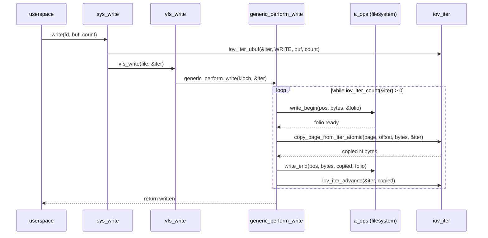
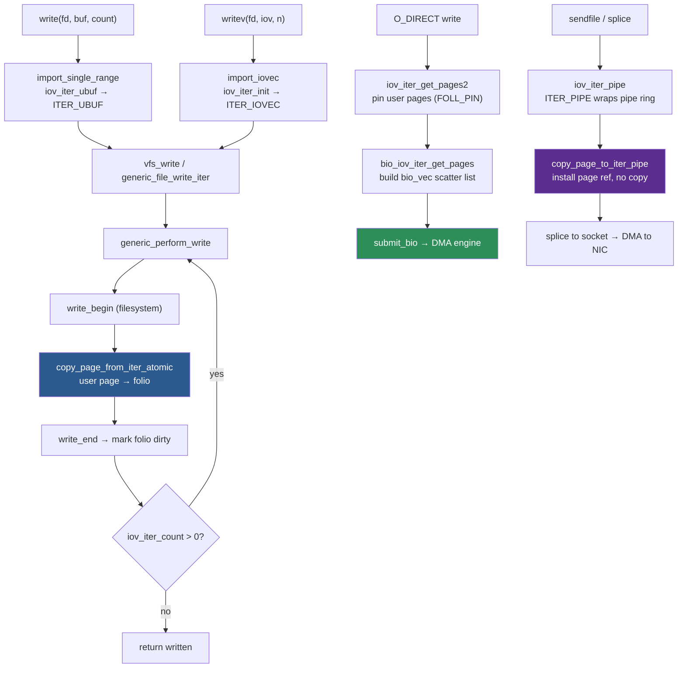

# iov_iter: the kernel's unified scatter/gather buffer abstraction

> How one type replaced a dozen incompatible buffer conventions across VFS, the block layer, networking, and splice

## What is iov_iter?

Before `iov_iter`, every I/O path in the kernel managed buffers differently. There was no common language between a `read()` system call, a `sendmsg()` call, a direct-I/O submission, and an in-kernel `splice()`. Each path invented its own convention:

| Interface | Buffer representation |
|-----------|----------------------|
| `read()` / `write()` | `(void __user *buf, size_t count)` — a single pointer and length |
| `readv()` / `writev()` | `const struct iovec __user *iov, unsigned long nr_segs` — an array |
| `sendmsg()` / `recvmsg()` | `struct msghdr` embedding `msg_iov` and `msg_iovlen` |
| Kernel-internal copies | `struct kvec` — like `iovec` but with a kernel-space pointer |
| Block layer, network zero-copy | `struct bio_vec` — a (page, offset, length) triple |

Every filesystem and driver that wanted to support more than one interface duplicated buffer-walking logic. The `read_iter` / `write_iter` operations on `file_operations` could not be written generically because there was nothing generic to write them against.

`iov_iter` (introduced as a unified abstraction in Linux 3.15, living in `lib/iov_iter.c`) wraps all of these representations into one type. VFS code, iomap, the network stack, and the block layer all operate on `struct iov_iter *`. The caller decides what kind of buffer backs the iterator; the callee does not need to know.

```
User write(fd, buf, count)        User writev(fd, iov, n)        Kernel kvec copy
        │                                  │                            │
        ▼                                  ▼                            ▼
  ITER_UBUF                          ITER_IOVEC                    ITER_KVEC
        │                                  │                            │
        └──────────────────┬───────────────┘                            │
                           │◄───────────────────────────────────────────┘
                           ▼
                    struct iov_iter
                           │
              ┌────────────┼────────────────────────┐
              ▼            ▼                         ▼
     generic_file_      copy_to_iter /         bio_iov_iter_
     write_iter()       copy_from_iter()       get_pages()
```

## The struct iov_iter

The full definition from `include/linux/uio.h`:

```c
/* include/linux/uio.h */
struct iov_iter {
    u8 iter_type;           /* ITER_UBUF, ITER_IOVEC, ITER_KVEC,
                               ITER_BVEC, ITER_PIPE, ITER_XARRAY */
    bool nofault;           /* do not fault in pages (kernel probe paths) */
    bool data_source;       /* false = READ (writing into iter),
                               true  = WRITE (reading from iter) */
    bool user_backed;       /* iter points at userspace memory */
    union {
        size_t iov_offset;  /* bytes consumed in current segment (most types) */
        int last_offset;    /* byte offset within last pipe buffer (ITER_PIPE) */
    };
    union {
        struct iovec __ubuf_iovec;  /* ITER_UBUF: single embedded iovec */
        struct {
            union {
                const struct iovec        *__iov;   /* ITER_IOVEC */
                const struct kvec         *kvec;    /* ITER_KVEC */
                const struct bio_vec      *bvec;    /* ITER_BVEC */
                struct xarray             *xarray;  /* ITER_XARRAY */
                struct pipe_inode_info    *pipe;    /* ITER_PIPE */
                void __user               *ubuf;    /* ITER_UBUF: raw pointer */
            };
            size_t nr_segs; /* number of segments remaining */
        };
    };
    size_t count;           /* bytes remaining in the iterator */
    union {
        unsigned long nr_segs; /* same field, accessible directly */
        loff_t xarray_start;   /* ITER_XARRAY: byte offset into xarray */
    };
};
```

The key invariants:

- `count` is the total number of bytes remaining. It decreases as bytes are consumed; when it reaches zero the iterator is exhausted.
- `iov_offset` is how many bytes into the *current* segment have already been consumed. Combined with `nr_segs` and the segment array pointer, it fully describes the current position within an ITER_IOVEC or ITER_KVEC iterator.
- `data_source` (`READ`/`WRITE`) is from the *kernel's* perspective. A `read()` syscall populates a `READ` iterator (the iterator is a destination for kernel data); a `write()` syscall populates a `WRITE` iterator (the iterator is a source of user data for the kernel).

### Architecture diagram

```
struct iov_iter
┌─────────────────────────────────────────────────────────┐
│ iter_type   │ count   │ iov_offset │ nr_segs             │
│ data_source │ nofault │ user_backed                      │
├─────────────────────────────────────────────────────────┤
│                  type-specific union                     │
│                                                          │
│  ITER_UBUF   → ubuf ──────────────────► [ user buffer ]  │
│                                                          │
│  ITER_IOVEC  → __iov[0] → { base, len }                  │
│                __iov[1] → { base, len }                  │
│                __iov[2] → { base, len }   (nr_segs=3)    │
│                                                          │
│  ITER_KVEC   → kvec[0] → { iov_base (kernel), iov_len } │
│                kvec[1] → { iov_base, iov_len }           │
│                                                          │
│  ITER_BVEC   → bvec[0] → { bv_page, bv_offset, bv_len } │
│                bvec[1] → { bv_page, bv_offset, bv_len }  │
│                                                          │
│  ITER_PIPE   → pipe ──► struct pipe_inode_info           │
│                          └► pipe_buffer ring[]           │
│                                                          │
│  ITER_XARRAY → xarray ──► struct xarray (page cache)    │
└─────────────────────────────────────────────────────────┘
```

## Iterator types

### ITER_UBUF — single userspace buffer (Linux 5.14+)

The most common case for `read()` and `write()` is a single `(pointer, length)` pair. Before 5.14, this was handled by creating a one-element `ITER_IOVEC` — the iterator machinery would then walk an array of length one. `ITER_UBUF`, added in Linux 5.14, is a dedicated fast path: the pointer is stored directly in the `ubuf` field, and the copy routines skip the segment-array indirection entirely.

```c
/* Typical ITER_UBUF initialization — fs/read_write.c */
static ssize_t new_sync_read(struct file *filp, char __user *buf,
                              size_t len, loff_t *ppos)
{
    struct iovec iov = { .iov_base = buf, .iov_len = len };
    struct kiocb kiocb;
    struct iov_iter iter;

    init_sync_kiocb(&kiocb, filp);
    kiocb.ki_pos = *ppos;
    iov_iter_ubuf(&iter, ITER_DEST, buf, len);  /* ITER_UBUF */

    ret = filp->f_op->read_iter(&kiocb, &iter);
    /* ... */
}
```

`ITER_DEST` is an alias for the `READ` direction (the iterator is a *destination* from the kernel's perspective). `ITER_SOURCE` is `WRITE`.

### ITER_IOVEC — array of userspace buffers

Used for `readv()`, `writev()`, `sendmsg()`, `recvmsg()`. The iterator holds a pointer to an array of `struct iovec` in userspace (after validation and copying into a kernel buffer by `import_iovec()`).

```c
/* include/uapi/linux/uio.h */
struct iovec {
    void __user *iov_base;  /* pointer to user buffer */
    __kernel_size_t iov_len; /* length of this segment */
};
```

Walking an `ITER_IOVEC` iterator means stepping through segments: exhaust `iov[0]`, advance to `iov[1]`, and so on, keeping `iov_offset` and `nr_segs` consistent.

### ITER_KVEC — array of kernel buffers

`struct kvec` mirrors `struct iovec` but `iov_base` points into kernel address space. Used for kernel-to-kernel copies, for example when a filesystem copies data through an intermediate kernel buffer:

```c
/* include/linux/uio.h */
struct kvec {
    void  *iov_base;    /* kernel virtual address */
    size_t iov_len;
};
```

`ITER_KVEC` iterators never touch userspace memory and do not require `access_ok()` checks or fault handling. The `nofault` flag is meaningless for them — they can never fault.

### ITER_BVEC — array of page-based segments

`struct bio_vec` describes a segment as a (page, byte-offset-within-page, length) triple. This is the native representation for block layer I/O and for direct I/O, which works with pinned physical pages rather than virtual addresses:

```c
/* include/linux/bvec.h */
struct bio_vec {
    struct page  *bv_page;    /* the physical page */
    unsigned int  bv_len;     /* bytes in this segment */
    unsigned int  bv_offset;  /* byte offset within the page */
};
```

`ITER_BVEC` is used by:
- O_DIRECT read/write paths (`dio_bio_complete`, `iomap_dio_rw`)
- Network zero-copy send (`MSG_ZEROCOPY`)
- `iov_iter_get_pages2()` output after pinning userspace pages

### ITER_PIPE — pipe buffer ring

The pipe is internally a ring of `struct pipe_buffer` entries, each holding a reference to a page:

```c
/* include/linux/pipe_fs_i.h */
struct pipe_buffer {
    struct page          *page;
    unsigned int          offset;  /* byte offset within page */
    unsigned int          len;     /* bytes of valid data */
    const struct pipe_buf_operations *ops;
    unsigned int          flags;   /* PIPE_BUF_FLAG_* */
    unsigned long         private;
};

struct pipe_inode_info {
    struct mutex          mutex;
    wait_queue_head_t     rd_wait, wr_wait;
    unsigned int          head;       /* producer index */
    unsigned int          tail;       /* consumer index */
    unsigned int          ring_size;  /* power of two */
    unsigned int          nr_accounted;
    unsigned int          readers, writers;
    unsigned int          files;      /* O_RDWR opens */
    unsigned int          r_counter, w_counter;
    bool                  poll_usage;
    struct inode         *inode;
    struct pipe_buffer   *bufs;  /* the ring array */
    /* ... */
};
```

`ITER_PIPE` is used by `splice()` and `sendfile()`. Instead of copying bytes, `copy_page_to_iter_pipe()` installs a page reference directly into a pipe buffer slot. This is the zero-copy mechanism: the same physical page is referenced by the pipe reader and the file's page cache simultaneously, with no data movement.

### ITER_XARRAY — XArray of pages

`ITER_XARRAY` addresses a range within an `struct xarray` — typically the `i_pages` xarray of an `address_space`. It is used by the iomap write path (`iomap_write_iter`) and by DAX (direct-access) filesystems that map persistent memory. Instead of walking user or kernel pointers, the iterator maps and unmaps pages from the xarray as it advances.

## Core operations

### Initializers

Each iterator type has a dedicated init function:

```c
/* lib/iov_iter.c — initializer family */

/* Single userspace buffer — most read()/write() calls (Linux 5.14+) */
void iov_iter_ubuf(struct iov_iter *i, unsigned int direction,
                   void __user *buf, size_t count);

/* Array of userspace iovec (already imported into kernel memory) */
void iov_iter_init(struct iov_iter *i, unsigned int direction,
                   const struct iovec *iov, unsigned long nr_segs,
                   size_t count);

/* Array of kernel kvec */
void iov_iter_kvec(struct iov_iter *i, unsigned int direction,
                   const struct kvec *kvec, unsigned long nr_segs,
                   size_t count);

/* Array of bio_vec */
void iov_iter_bvec(struct iov_iter *i, unsigned int direction,
                   const struct bio_vec *bvec, unsigned long nr_segs,
                   size_t count);

/* Pipe ring */
void iov_iter_pipe(struct iov_iter *i, unsigned int direction,
                   struct pipe_inode_info *pipe, size_t count);

/* XArray range */
void iov_iter_xarray(struct iov_iter *i, unsigned int direction,
                     struct xarray *xarray, loff_t start, size_t count);
```

All initializers set `iter_type`, `data_source`, `count`, and the type-specific fields. `iov_offset` starts at zero. After initialization, the iterator is positioned at the beginning of its buffer range.

### Copy operations

The copy operations are the core of `lib/iov_iter.c`. They hide the per-type dispatch behind a uniform API:

```c
/* lib/iov_iter.c */

/*
 * copy_to_iter — copy from a kernel buffer INTO the iterator.
 * Used on the read path: kernel has data, iterator is the destination.
 * Returns bytes copied; may be less than bytes if the iterator is
 * backed by userspace and a page fault occurs.
 */
size_t copy_to_iter(const void *addr, size_t bytes, struct iov_iter *i);

/*
 * copy_from_iter — copy FROM the iterator into a kernel buffer.
 * Used on the write path: iterator carries user data, kernel drains it.
 */
size_t copy_from_iter(void *addr, size_t bytes, struct iov_iter *i);

/*
 * copy_from_iter_nocache — same as copy_from_iter but uses non-temporal
 * stores. Used by O_DIRECT write paths to avoid polluting CPU caches
 * with data that will not be re-read.
 */
size_t copy_from_iter_nocache(void *addr, size_t bytes, struct iov_iter *i);

/*
 * copy_folio_to_iter — copy bytes from a folio directly into the iterator.
 * Handles large folios (multi-page): maps each constituent page and
 * performs the copy without needing a contiguous kernel buffer.
 * Used by filemap_read → copy_folio_to_iter on the read path.
 */
size_t copy_folio_to_iter(struct folio *folio, size_t offset,
                           size_t bytes, struct iov_iter *i);

/*
 * copy_page_to_iter — single-page variant of copy_folio_to_iter.
 */
size_t copy_page_to_iter(struct page *page, size_t offset,
                          size_t bytes, struct iov_iter *i);

/*
 * copy_page_from_iter_atomic — copy from iterator into a kernel-mapped page
 * using kmap_atomic (no sleeping; used inside write_begin/write_end where
 * the page is locked and we must not sleep).
 * Returns bytes copied.
 */
size_t copy_page_from_iter_atomic(struct page *page, size_t offset,
                                   size_t bytes, struct iov_iter *i);
```

Internally, each copy function dispatches through a type-specific helper:

```
copy_to_iter(addr, bytes, iter)
  │
  ├─ iter_type == ITER_UBUF   → __copy_to_user(iter->ubuf + iter->iov_offset, ...)
  ├─ iter_type == ITER_IOVEC  → iterate_iovec → __copy_to_user per segment
  ├─ iter_type == ITER_KVEC   → memcpy per segment (no user_access needed)
  ├─ iter_type == ITER_BVEC   → kmap_local_page + memcpy per bio_vec
  ├─ iter_type == ITER_PIPE   → copy_page_to_iter_pipe (installs page ref)
  └─ iter_type == ITER_XARRAY → kmap_local_page + memcpy per xarray page
```

The `ITER_IOVEC` and `ITER_UBUF` paths use `user_access_begin` / `user_access_end` around the copy loop to enable the SMAP/PAN bypass only once per call rather than once per page, and they use `unsafe_copy_to_user` / `unsafe_copy_from_user` inside that window for maximum throughput.

### Advance and revert

After copying, the caller records how many bytes were actually consumed:

```c
/* lib/iov_iter.c */

/*
 * iov_iter_advance — skip `size` bytes in the iterator.
 * Updates iov_offset and nr_segs. Segments that are fully consumed
 * are retired (the pointer advances past them). This is an O(segments
 * skipped) operation.
 */
void iov_iter_advance(struct iov_iter *i, size_t size);

/*
 * iov_iter_revert — undo a previous advance of `unroll` bytes.
 * Used when write_begin succeeds but the copy partially fails: the
 * iterator is walked backward so the caller can retry or clean up.
 * Only works within the range that was advanced since initialization.
 */
void iov_iter_revert(struct iov_iter *i, size_t unroll);

/*
 * iov_iter_count — bytes remaining in the iterator (reads i->count).
 * Inlined in the header for performance.
 */
static inline size_t iov_iter_count(const struct iov_iter *i)
{
    return i->count;
}

/*
 * iov_iter_zero — write `bytes` zero bytes into the iterator.
 * Used to zero-fill gaps in sparse reads.
 */
size_t iov_iter_zero(size_t bytes, struct iov_iter *i);
```

`copy_to_iter` / `copy_from_iter` do **not** advance the iterator automatically. The caller is responsible for calling `iov_iter_advance` after a successful copy. This allows partial copies (a short copy from a single segment, for example) to be handled: the caller advances by exactly `copied`, not by `bytes`.

### Import and export

Before an ITER_IOVEC iterator can be used, the userspace `iovec` array must be validated (address range checks) and copied into kernel memory:

```c
/* fs/read_write.c */

/*
 * import_iovec — validate and import a userspace iovec array.
 *
 * If nr_segs <= UIO_FASTIOV (8), the fast-path iov array on the stack
 * is used and no allocation is needed. For larger vectors, a heap
 * allocation is made.
 *
 * Returns 0 on success or -EFAULT / -EINVAL. On success, *iov holds
 * the kernel copy and *iter is initialized. The caller must call
 * kfree(*iov) if *iov != fast_iov after use.
 */
int import_iovec(int type, const struct iovec __user *uvec,
                 unsigned nr_segs, unsigned fast_segs,
                 struct iovec **iov, struct iov_iter *i);

/*
 * import_single_range — helper for the single-(buf,len) syscall pattern.
 * Validates the user pointer and initializes an ITER_UBUF iterator.
 * Used by read(), write(), recv(), send().
 */
int import_single_range(int type, void __user *buf, size_t len,
                         struct iovec *iov, struct iov_iter *i);
```

`import_iovec` calls `access_ok()` on every user segment and enforces:
- No individual segment longer than `MAX_RW_COUNT` (~2 GiB)
- Total count does not overflow `ssize_t`
- `nr_segs` does not exceed `UIO_MAXIOV` (1024)

### Page pinning for DMA

For O_DIRECT and `MSG_ZEROCOPY`, the kernel needs physical page addresses to program the DMA engine. `iov_iter_get_pages2()` pins the pages backing an iterator:

```c
/* lib/iov_iter.c */

/*
 * iov_iter_get_pages2 — pin up to `maxsize` bytes worth of pages.
 *
 * Fills `pages[]` with up to `maxpages` struct page pointers.
 * `*start` is set to the byte offset within pages[0].
 * Returns total bytes covered or a negative error.
 *
 * The "2" suffix means the pages are pinned with FOLL_PIN (introduced
 * in Linux 5.7) rather than get_page(). FOLL_PIN is mandatory for DMA
 * and is tracked separately by the mm subsystem to enable safe
 * longterm pinning without breaking page reclaim.
 */
ssize_t iov_iter_get_pages2(struct iov_iter *i, struct page **pages,
                              size_t maxsize, unsigned maxpages,
                              size_t *start);
```

## How iov_iter flows through a write()

Tracing a `write(fd, buf, count)` call from syscall entry to page cache update:

```
write(fd, buf, count)
  │
  ▼
sys_write()  [fs/read_write.c]
  │  ksys_write()
  │    import_single_range(ITER_SOURCE, buf, count, &iov, &iter)
  │        → iov_iter_ubuf(&iter, ITER_SOURCE, buf, count)
  │          iter.iter_type  = ITER_UBUF
  │          iter.data_source = WRITE (true)
  │          iter.ubuf       = buf
  │          iter.count      = count
  │
  ▼
vfs_write()  →  file->f_op->write_iter(&kiocb, &iter)
  │
  ▼
generic_file_write_iter()  [mm/filemap.c]
  │  → inode_lock() for exclusive access
  │  → generic_perform_write(&kiocb, &iter)
  │
  ▼
generic_perform_write()  [mm/filemap.c]
  │
  │  while (iov_iter_count(&iter)) {
  │      offset = pos & (PAGE_SIZE - 1);
  │      bytes  = min(PAGE_SIZE - offset, iov_iter_count(&iter));
  │
  │      /* 1. filesystem prepares the target page */
  │      a_ops->write_begin(file, mapping, pos, bytes, &folio, &fsdata);
  │
  │      /* 2. copy user data into the page — the key iov_iter call */
  │      copied = copy_page_from_iter_atomic(folio_page(folio, 0),
  │                                           offset, bytes, &iter);
  │
  │      /* 3. filesystem commits the write, marks page dirty */
  │      a_ops->write_end(file, mapping, pos, bytes, copied, folio, fsdata);
  │
  │      /* 4. advance iterator by what was actually copied */
  │      iov_iter_advance(&iter, copied);   ← iterator moves forward
  │
  │      pos     += copied;
  │      written += copied;
  │  }
  │
  ▼
return written
```

The iterator crosses subsystem boundaries unchanged. `generic_perform_write` does not know whether the iterator wraps a single buffer, a scatter list, or a kernel kvec — it calls the same `copy_page_from_iter_atomic` regardless.



## ITER_BVEC and DMA scatter-gather

O_DIRECT I/O must transfer data directly between storage and the user's pages without going through the kernel page cache. The DMA engine needs a list of physical (bus) addresses — a scatter-gather list. `iov_iter` bridges userspace virtual addresses to this list.

```
O_DIRECT write(fd, buf, count):

 1. import_single_range / iov_iter_ubuf
       iter: ITER_UBUF → { ubuf = buf, count = count }

 2. iomap_dio_rw → iomap_dio_bio_iter
       iov_iter_get_pages2(&iter, pages[], maxsize, maxpages, &start)
           → get_user_pages_fast(buf >> PAGE_SHIFT, ...)
           → pages[] now holds FOLL_PIN references to user pages

 3. bio_iov_iter_get_pages(bio, &iter)
       → builds struct bio_vec[] from the pinned pages
       → bio now describes the physical pages
       → iter transitions to ITER_BVEC internally

 4. submit_bio(bio)
       → DMA engine reads the bio_vec[] scatter list
       → transfers data directly from/to user pages
       → no kernel bounce buffer, no extra copy

 5. bio completion → unpin pages (unpin_user_pages)
```

The key function is `bio_iov_iter_get_pages()`:

```c
/* block/bio.c */

/*
 * bio_iov_iter_get_pages — populate a bio from an iov_iter.
 *
 * For each segment in the iterator, calls iov_iter_get_pages2() to
 * pin the backing pages, then appends bio_vec entries to the bio.
 * The bio holds FOLL_PIN references; they are released in the bio's
 * end_io handler.
 *
 * This is the bridge between the VFS iov_iter world and the block
 * layer bio_vec world.
 */
int bio_iov_iter_get_pages(struct bio *bio, struct iov_iter *iter);
```

For an `ITER_BVEC` iterator (already in page terms), no pinning is needed — the pages are already known. The block layer can use the `bio_vec` array directly.

### Why FOLL_PIN matters

Before Linux 5.7, `get_user_pages()` incremented the page refcount to pin pages for DMA. This interacted badly with page migration and memory compaction: a page being migrated would find a non-zero extra refcount and could not be moved. `FOLL_PIN` introduces a separate tracking mechanism that the MM layer can detect and wait for without stalling migration indefinitely. All new kernel code that pins pages for DMA must use `FOLL_PIN` via `pin_user_pages()` or `iov_iter_get_pages2()`.

## ITER_PIPE: the splice foundation

`splice()` and `sendfile()` achieve zero-copy by transferring ownership of page cache pages to a pipe ring, bypassing userspace entirely. `iov_iter` with `ITER_PIPE` is the mechanism.

```
sendfile(out_sock, in_file, offset, count):

 1. do_splice_direct → splice_file_to_pipe
       iov_iter_pipe(&iter, ITER_DEST, pipe, count)
           → iter.iter_type = ITER_PIPE
           → iter.pipe      = &pipe_inode_info

 2. generic_file_splice_read → filemap_splice_read
       copy_folio_to_iter(folio, offset, bytes, &iter)
           → copy_page_to_iter_pipe(page, offset, bytes, iter)
               → pipe_buf = &pipe->bufs[pipe->head & mask]
               → pipe_buf->page   = page        ← page reference, no copy
               → pipe_buf->offset = offset
               → pipe_buf->len    = bytes
               → get_page(page)                 ← take ref in pipe ring
               → pipe->head++

 3. vmsplice / splice_pipe_to_socket
       → network stack reads pipe_buf->page directly
       → page moves from file page cache to socket send buffer
       → zero data copies between disk and network card
```

The pipe buffer is a ring. When the reader (the socket or another pipe consumer) finishes with a buffer slot, it calls `pipe_buf_release()` which drops the page reference. The page returns to LRU pressure once both the page cache and the pipe ring have released their references.


This is the path that makes `sendfile()` truly zero-copy for unencrypted static file serving: the data moves from disk to NIC via DMA on both ends, and the CPU only touches metadata (socket headers, etc.), not the file payload.

### ITER_PIPE constraints

`ITER_PIPE` iterators are write-only from the perspective of callers that populate the pipe (the direction is `ITER_DEST`). You cannot `copy_from_iter` from an `ITER_PIPE` into a kernel buffer — that would require reading back from the pipe, which is a consumer operation. The pipe consumer uses a regular file read or `splice` out of the pipe, not the iov_iter API.

## Fault handling and EFAULT

### The normal case: copy_to_user inside user_access_begin

For `ITER_UBUF` and `ITER_IOVEC`, the copy routines use the architecture's user-access window mechanism to batch SMAP/PAN overhead:

```c
/* lib/iov_iter.c — simplified ITER_UBUF copy_to_iter path */
static size_t copy_to_iter_ubuf(const void *from, size_t bytes,
                                  struct iov_iter *iter)
{
    void __user *to = iter->ubuf + iter->iov_offset;

    if (unlikely(!user_access_begin(to, bytes)))
        return 0;

    unsafe_copy_to_user(to, from, bytes, out);  /* no per-byte access check */

    user_access_end();
    /* advance iov_offset; count decremented by caller via iov_iter_advance */
    iter->iov_offset += bytes;
    iter->count      -= bytes;
    return bytes;

out:
    user_access_end();
    return bytes - remaining;  /* short copy; caller must handle EFAULT */
}
```

`unsafe_copy_to_user` uses the CPU's user-memory access instructions directly (no `access_ok()` per word). A page fault during this window is handled by the kernel's exception table: the fault handler finds the faulting instruction, loads the fixup address, and resumes at the fixup which records the number of bytes copied before the fault. The copy function returns a short count; the VFS layer propagates `-EFAULT` to userspace.

### The nofault flag

Some kernel paths probe memory that may not be mapped, and a page fault would be wrong (for example, perf probes on kernel memory, or ftrace reading arguments):

```c
/* Setting nofault prevents faulting in missing pages */
iter.nofault = true;
copy_from_iter(&kernel_buf, sizeof(kernel_buf), &iter);
/* If the page is not present, returns 0 bytes without faulting */
```

When `nofault` is set, the copy routines use `__copy_from_user_inatomic()` / `__copy_to_user_inatomic()` which disable fault handling and return immediately on any page fault.

### Pre-faulting with fault_in_iov_iter_readable

The write path in `generic_perform_write` may need to read data from a user `ITER_IOVEC` whose pages are not yet mapped. Rather than taking a page fault inside `copy_page_from_iter_atomic` (which runs with the page lock held and therefore cannot sleep in all configurations), the caller can pre-fault the user pages first:

```c
/* mm/filemap.c — generic_perform_write pre-fault pattern */
if (unlikely(fault_in_iov_iter_readable(i, bytes))) {
    status = -EFAULT;
    break;
}

status = a_ops->write_begin(file, mapping, pos, bytes, &folio, &fsdata);
/* ... now safe to copy_page_from_iter_atomic with folio locked ... */
```

`fault_in_iov_iter_readable()` walks the iterator's user segments and issues a dummy byte read for each page, causing the page to be faulted in by the MM before the copy begins. The subsequent `copy_page_from_iter_atomic` can then proceed without sleeping.

## Performance evolution

### Linux 3.15: the unified abstraction

Before 3.15, `read_iter` / `write_iter` did not exist on `file_operations`. Each filesystem had separate `read` and `aio_read` (and `write` / `aio_write`) entry points, and the buffer was passed as raw userspace pointer + length. The refactoring by Al Viro in 3.15 unified all of these behind `struct iov_iter`, allowing filesystems to implement a single `read_iter` / `write_iter` that works for synchronous, async, vectored, and direct I/O.

### Linux 5.14: ITER_UBUF

The vast majority of `read()` and `write()` calls operate on a single buffer. Before 5.14, these were still represented as one-element `ITER_IOVEC` arrays. The copy paths would:
1. Fetch the `iovec` pointer
2. Load `iov[0].iov_base` and `iov[0].iov_len`
3. Do the copy
4. Retire `iov[0]` and advance `nr_segs`

`ITER_UBUF` eliminates all of this: the pointer is in the iterator itself, `nr_segs` is always 1 and is never decremented, and the copy path is a direct `unsafe_copy_to/from_user`. For the common case this saves two pointer dereferences and a branch on the fast path through the copy loop.

### Linux 6.0: iter_iov() accessor

The direct `__iov` field of `struct iov_iter` was made private in Linux 6.0. Code that previously accessed `iter->iov` directly must now use the accessor:

```c
/* include/linux/uio.h — Linux 6.0+ */
static inline const struct iovec *iter_iov(const struct iov_iter *iter)
{
    if (iter->iter_type == ITER_UBUF)
        return (const struct iovec *) &iter->__ubuf_iovec;
    return iter->__iov;
}
```

This accessor works uniformly for both `ITER_UBUF` (synthesizes a temporary `iovec` from the embedded fields) and `ITER_IOVEC` (returns the pointer directly). Code that used to do `iter->iov[i]` must now use `iter_iov(iter) + i`.

### Large folio support: copy_folio_to_iter

With large folios in the page cache (Linux 6.1+), a single folio can cover 2, 4, 8, or more base pages. `copy_folio_to_iter()` handles this correctly:

```c
/* lib/iov_iter.c */
size_t copy_folio_to_iter(struct folio *folio, size_t offset,
                           size_t bytes, struct iov_iter *i)
{
    /*
     * A large folio may span multiple pages. kmap_local_folio() maps
     * the relevant portion. For ITER_UBUF/IOVEC the copy is done in
     * chunks aligned to PAGE_SIZE boundaries; for ITER_PIPE a single
     * page reference per PAGE_SIZE chunk is inserted.
     */
    return copy_page_to_iter(folio_page(folio, offset >> PAGE_SHIFT),
                              offset & (PAGE_SIZE - 1), bytes, i);
}
```

Before large folio support, `filemap_read` called `copy_page_to_iter` once per base page. With large folios, `copy_folio_to_iter` can walk the folio's pages in a single call, reducing loop overhead in `filemap_read` for sequential reads over large folios.

## Putting it together: the full data path



## Key source files

| File | Role |
|------|------|
| `lib/iov_iter.c` | All copy operations: `copy_to_iter`, `copy_from_iter`, `copy_folio_to_iter`, `copy_page_from_iter_atomic`, `iov_iter_advance`, `iov_iter_revert`, `iov_iter_get_pages2`, `iov_iter_zero` |
| `include/linux/uio.h` | `struct iov_iter`, `struct iovec`, `struct kvec`, `ITER_UBUF`, `ITER_IOVEC`, `ITER_KVEC`, `ITER_BVEC`, `ITER_PIPE`, `ITER_XARRAY`, all initializer declarations |
| `include/linux/bvec.h` | `struct bio_vec`, `bvec_iter`, bio vector helpers |
| `include/linux/pipe_fs_i.h` | `struct pipe_inode_info`, `struct pipe_buffer`, pipe buffer ops |
| `include/linux/pagemap.h` | `copy_folio_to_iter`, `copy_page_from_iter_atomic` (inline wrappers) |
| `fs/read_write.c` | `import_iovec`, `import_single_range`, `new_sync_read`, `new_sync_write`, the syscall stubs |
| `block/bio.c` | `bio_iov_iter_get_pages` — bridge from iov_iter to bio scatter-gather |
| `mm/filemap.c` | `filemap_read` (`copy_folio_to_iter` call site), `generic_perform_write` (`copy_page_from_iter_atomic` call site) |
| `fs/splice.c` | `copy_splice_read`, `splice_file_to_pipe` — ITER_PIPE consumer |
| `fs/iomap/buffered-io.c` | `iomap_write_iter` — ITER_XARRAY consumer |

## Further reading

- [Vectored I/O](vectored-io.md) — `readv`/`writev`, `struct iovec`, and the atomicity guarantees; the user-facing interface that `ITER_IOVEC` implements
- [Buffered I/O](buffered-io.md) — the `generic_perform_write` loop, `write_begin`/`write_end`, and the page cache lifecycle that `iov_iter` plugs into
- [Zero-copy: splice and sendfile](splice-sendfile.md) — `ITER_PIPE` in depth, the pipe buffer ring, and how `sendfile` eliminates userspace copies
