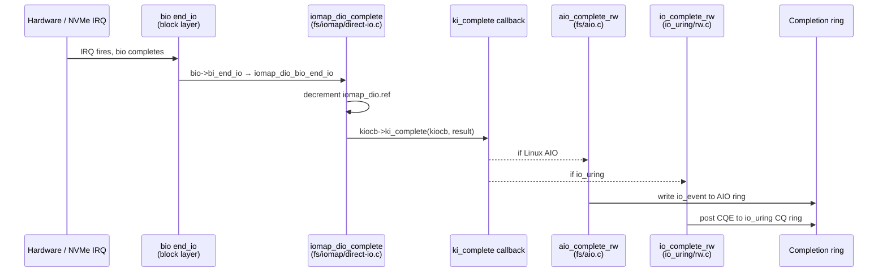
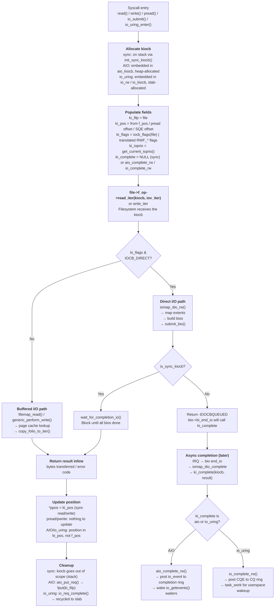

# struct kiocb: the I/O Control Block

> The kernel struct that carries per-operation state from VFS through filesystem to block layer

## What is struct kiocb?

Every read or write operation in the kernel is represented by a `struct kiocb` (kernel I/O control block). It is allocated before the operation begins and lives until the operation completes — synchronously on the stack, or asynchronously on the heap.

The kiocb threads through:

```
read(fd, buf, len)
  → VFS (fs/read_write.c)           allocates kiocb, sets ki_filp, ki_pos, ki_flags
  → file->f_op->read_iter(kiocb)    filesystem receives the kiocb
      → generic_file_read_iter      page cache uses ki_flags to decide buffered vs direct
          → iomap_dio_rw            block layer receives the kiocb
              → bio submission      ki_complete wired to bio->bi_end_io
  → if async: -EIOCBQUEUED          caller queued; ki_complete fires on completion
  → if sync: bytes read             ki_pos updated; returned inline
```

Three distinct roles:

1. **Identity** — which file, which offset (`ki_filp`, `ki_pos`)
2. **Policy** — what constraints apply to this operation (`ki_flags`, `ki_ioprio`)
3. **Completion** — what to do when async I/O finishes (`ki_complete`)

Every place in the I/O stack can inspect any of these. A filesystem can check `ki_flags & IOCB_NOWAIT` and return `-EAGAIN` instead of sleeping. The block layer uses `ki_ioprio` when scheduling requests. The async completion path calls `ki_complete` to notify the submitter.

---

## The struct definition

```c
/* include/linux/fs.h */
struct kiocb {
    struct file        *ki_filp;        /* file being operated on */
    loff_t              ki_pos;         /* current file offset */
    void (*ki_complete)(struct kiocb *iocb, long ret);  /* async completion cb */
    void               *private;        /* filesystem-private data */
    int                 ki_flags;       /* IOCB_* flags */
    u16                 ki_ioprio;      /* ioprio_value */
    union {
        struct wait_page_queue *ki_waitq;   /* async page waits (buffered AIO) */
        ssize_t                 ki_result;  /* sync result storage */
    };
};
```

### ki_filp

Pointer to the open `struct file`. This gives every layer access to:
- `ki_filp->f_inode` — the inode (for `i_size`, `i_rwsem`, `i_sb`)
- `ki_filp->f_mapping` — the `address_space` (page cache)
- `ki_filp->f_flags` — `O_DIRECT`, `O_DSYNC`, `O_APPEND`, etc.
- `ki_filp->f_op` — `read_iter`, `write_iter`, and other file operations

The kiocb does not hold its own reference count on `ki_filp`. The caller is responsible for keeping `struct file` alive while the kiocb is in flight. For async operations (AIO, io_uring), this is done by `get_file()` at submission and `fput()` at completion.

### ki_pos

The file offset for this operation. It has different semantics depending on how the file was opened and which syscall was used:

- **`read()`/`write()`**: copied from `file->f_pos` at entry (under `f_pos_lock`); written back at completion via `file_pos_write`
- **`pread()`/`pwrite()`**: set directly from the caller-supplied offset; `file->f_pos` is never touched
- **`O_APPEND`**: overridden to `i_size` atomically under `inode->i_rwsem` inside `generic_file_write_iter`
- **Linux AIO / io_uring**: set from the SQE offset field at submission; never touches `file->f_pos`

For `O_APPEND`, the update of `ki_pos` to `i_size` and the subsequent write happen under `inode->i_rwsem`, so two concurrent appending writers cannot interleave.

### ki_complete

The async completion callback. When it is `NULL`, the kiocb is synchronous (`is_sync_kiocb()` returns true). When it is non-NULL, the operation is asynchronous and `ki_complete` will be called from the completion context (interrupt, softirq, or worker thread) with the final result.

```c
/* include/linux/fs.h */
static inline bool is_sync_kiocb(struct kiocb *kiocb)
{
    return kiocb->ki_complete == NULL;
}
```

Async contexts set the callback before submitting:

```c
/* fs/aio.c — Linux AIO sets aio_complete as the callback */
req->rw.ki_complete = aio_complete_rw;

/* io_uring/rw.c — io_uring sets io_complete_rw */
kiocb->ki_complete = io_complete_rw;
```

### private

Filesystem-private scratchpad. Used when the filesystem needs to carry extra state through the I/O. For example, `iomap` stores a pointer to `struct iomap_dio` here during direct I/O so the completion callback can access the DIO context:

```c
/* fs/iomap/direct-io.c */
iocb->private = dio;   /* stash iomap_dio for access in ki_complete */
```

### ki_flags

Bit field of `IOCB_*` flags. See the next section for the full table.

### ki_ioprio

I/O priority encoded as a 16-bit `ioprio_value` (class in bits 15:13, data in bits 12:0). Set from the process's I/O priority via `get_current_ioprio()` at kiocb init time, or per-call via `pwritev2(RWF_IOPRIO)` (since Linux 6.3). Passed to the block layer in `bio->bi_ioprio` so BFQ and mq-deadline can schedule requests accordingly.

### ki_waitq / ki_result (union)

For async buffered I/O (Linux AIO with `IOCB_CMD_PREAD` on a non-`O_DIRECT` file), `ki_waitq` points to a `wait_page_queue` that is registered on the folio's wait queue. When the folio becomes uptodate, the waiter is woken and can retry the copy. This avoids spinning on a blocked folio.

For sync operations that store an intermediate result during retry loops, `ki_result` is used as a scratch store.

---

## ki_flags: IOCB_* flags

The `IOCB_*` flags live in `include/linux/fs.h` and control behavior throughout the I/O stack:

```c
/* include/linux/fs.h */
#define IOCB_HIPRI              (__force int) RWF_HIPRI
#define IOCB_DSYNC              (__force int) RWF_DSYNC
#define IOCB_SYNC               (__force int) RWF_SYNC
#define IOCB_NOWAIT             (__force int) RWF_NOWAIT
#define IOCB_APPEND             (__force int) RWF_APPEND
#define IOCB_EVENTFD            (1 << 16)
#define IOCB_DIRECT             (1 << 17)
#define IOCB_WRITE              (1 << 18)
#define IOCB_WAITQ              (1 << 19)
#define IOCB_NOIO               (1 << 20)
#define IOCB_ALLOC_CACHE        (1 << 21)
#define IOCB_DIO_CALLER_COMP    (1 << 22)
#define IOCB_ASYNC_CANCEL       (1 << 23)
```

| Flag | Meaning |
|------|---------|
| `IOCB_HIPRI` | High-priority I/O; use polling completion (NVMe polled queues). Requires `O_DIRECT`. Set by `preadv2(RWF_HIPRI)`. |
| `IOCB_DSYNC` | Write must reach stable storage (data only, not metadata). Equivalent to opening with `O_DSYNC`. |
| `IOCB_SYNC` | Write must reach stable storage, including metadata. Equivalent to `O_SYNC`. |
| `IOCB_NOWAIT` | Do not block. Return `-EAGAIN` if the operation would sleep (page cache miss, lock contention, extent allocation). Used heavily by io_uring. |
| `IOCB_APPEND` | Atomic append: ignore `ki_pos` and write at `i_size` under `i_rwsem`. |
| `IOCB_EVENTFD` | Notify via eventfd on async completion. Linux AIO only — set when the `iocb.aio_flags` field includes `IOCB_FLAG_RESFD`. |
| `IOCB_DIRECT` | Bypass the page cache (`O_DIRECT`). Set during kiocb init when `file->f_flags & O_DIRECT`. |
| `IOCB_WRITE` | This kiocb is a write. Allows shared code paths to distinguish reads from writes. |
| `IOCB_WAITQ` | `ki_waitq` is valid and points to an async page wait queue. Used for async buffered reads. |
| `IOCB_NOIO` | Do not start any new I/O. Useful in reclaim paths where issuing I/O would be a deadlock risk. |
| `IOCB_ALLOC_CACHE` | Hint that this I/O is for cache-allocated memory; may skip readahead or page population. |
| `IOCB_DIO_CALLER_COMP` | Caller handles DIO completion directly (avoids task work queueing). |
| `IOCB_ASYNC_CANCEL` | This kiocb supports async cancellation. |

### How flags are set from file->f_flags

When a kiocb is initialized for a synchronous syscall, flags are derived from the open file:

```c
/* include/linux/fs.h */
static inline void init_sync_kiocb(struct kiocb *kiocb, struct file *filp)
{
    *kiocb = (struct kiocb) {
        .ki_filp    = filp,
        .ki_flags   = iocb_flags(filp),   /* translates f_flags → IOCB_* */
        .ki_ioprio  = get_current_ioprio(),
    };
}

/* include/linux/fs.h */
static inline int iocb_flags(struct file *file)
{
    int res = 0;
    if (file->f_flags & O_APPEND)
        res |= IOCB_APPEND;
    if (file->f_flags & O_DIRECT)
        res |= IOCB_DIRECT;
    if (file->f_flags & __O_SYNC)
        res |= IOCB_SYNC;
    if (file->f_flags & O_DSYNC)
        res |= IOCB_DSYNC;
    if (file->f_flags & O_NONBLOCK)
        res |= IOCB_NOWAIT;
    return res;
}
```

### How RWF_* per-call flags are merged in

`preadv2`/`pwritev2` pass additional per-call flags as the `rwf_t flags` argument. These are merged into `ki_flags` by `kiocb_set_rw_flags`:

```c
/* fs/read_write.c */
static inline int kiocb_set_rw_flags(struct kiocb *ki, rwf_t flags,
                                       int rw_type)
{
    int kiocb_flags = 0;

    /* Check for unsupported flags */
    if (unlikely(flags & ~RWF_SUPPORTED))
        return -EOPNOTSUPP;
    if (unlikely((flags & RWF_APPEND) && (flags & RWF_NOWAIT)))
        return -EINVAL;

    if (flags & RWF_NOWAIT) {
        if (!(ki->ki_filp->f_mode & FMODE_NOWAIT))
            return -EOPNOTSUPP;
        kiocb_flags |= IOCB_NOWAIT;
    }
    if (flags & RWF_HIPRI)
        kiocb_flags |= IOCB_HIPRI | IOCB_NOWAIT;
    if (flags & RWF_DSYNC)
        kiocb_flags |= IOCB_DSYNC;
    if (flags & RWF_SYNC)
        kiocb_flags |= IOCB_DSYNC | IOCB_SYNC;
    if (flags & RWF_APPEND)
        kiocb_flags |= IOCB_APPEND;

    ki->ki_flags |= kiocb_flags;

    if (flags & RWF_WRITE_LIFE_NOT_SET)
        return 0;

    return 0;
}
```

The mapping from `RWF_*` to `IOCB_*` is one-to-one, but there are two important details:
- `RWF_HIPRI` implies `IOCB_NOWAIT` because polled I/O must not block waiting for the scheduler
- `RWF_SYNC` sets both `IOCB_DSYNC` and `IOCB_SYNC` (data sync is a subset of full sync)

---

## Sync vs Async kiocb

### Synchronous (stack-allocated)

For the common `read()`/`write()` and `pread()`/`pwrite()` syscalls, the kiocb lives on the kernel stack:

```c
/* fs/read_write.c */
static ssize_t new_sync_read(struct file *filp, char __user *buf,
                              size_t len, loff_t *ppos)
{
    struct iovec  iov = { .iov_base = buf, .iov_len = len };
    struct kiocb  kiocb;
    struct iov_iter iter;
    ssize_t ret;

    init_sync_kiocb(&kiocb, filp);   /* ki_complete = NULL for sync */
    kiocb.ki_pos = *ppos;
    iov_iter_init(&iter, ITER_DEST, &iov, 1, len);

    ret = filp->f_op->read_iter(&kiocb, &iter);
    BUG_ON(ret == -EIOCBQUEUED);     /* sync kiocb must not queue */
    *ppos = kiocb.ki_pos;
    return ret;
}
```

`init_sync_kiocb` zeroes the struct and leaves `ki_complete` at `NULL`. Since `ki_complete == NULL`, `is_sync_kiocb()` returns true, and:
- Filesystems and the block layer know to wait inline rather than queuing
- `iomap_dio_rw` calls `wait_for_completion_io` instead of returning `-EIOCBQUEUED`
- The result is returned directly from `f_op->read_iter`

### Asynchronous: Linux AIO

Linux AIO embeds a kiocb inside `struct aio_kiocb`, which also holds the AIO context, completion ring state, and the optional eventfd:

```c
/* fs/aio.c */
struct aio_kiocb {
    union {
        struct file         *ki_filp;
        struct kiocb         rw;    /* must be first: allows cast aio_kiocb → kiocb */
    };
    struct kioctx           *ki_ctx;          /* AIO context this belongs to */
    kiocb_cancel_fn         *ki_cancel;       /* cancellation hook */
    struct io_event __user  *ki_user_event;   /* userspace event slot */
    __u64                    ki_user_data;    /* opaque userspace cookie */
    union {
        struct {
            struct iovec      __user   *ki_iovec;
        };
        struct {
            struct wait_queue_entry    wait;
            struct task_struct        *waiter;
        };
    };
    struct eventfd_ctx      *ki_eventfd;      /* eventfd for IOCB_EVENTFD */
};
```

The `ki_complete` callback is `aio_complete_rw`:

```c
/* fs/aio.c */
static void aio_complete_rw(struct kiocb *kiocb, long res)
{
    struct aio_kiocb *iocb = container_of(kiocb, struct aio_kiocb, rw);

    if (!list_empty_careful(&iocb->ki_list))
        aio_remove_iocb(iocb);

    if (iocb->ki_eventfd)
        eventfd_signal(iocb->ki_eventfd);

    /* Write result into the completion ring; wake io_getevents() waiters */
    aio_complete(iocb, res, 0);
}
```

### Asynchronous: io_uring

io_uring embeds a kiocb inside `struct io_rw`, which is the command-specific state for read/write operations inside the per-request `struct io_kiocb`:

```c
/* io_uring/rw.h */
struct io_rw {
    struct kiocb        kiocb;    /* must be first */
    u64                 addr;     /* userspace buffer address */
    u32                 len;      /* transfer length */
    rwf_t               flags;    /* RWF_* flags from SQE */
};
```

`struct io_kiocb` (io_uring's per-request object) holds `struct io_rw` in a union of all command types:

```c
/* io_uring/io_uring.h (simplified) */
struct io_kiocb {
    union {
        struct io_rw            rw;
        struct io_poll_iocb     poll;
        struct io_accept        accept;
        /* ... other op types ... */
    };
    struct io_ring_ctx      *ctx;
    struct io_uring_sqe      sqe_copy;   /* copy of the original SQE */
    unsigned long            flags;      /* REQ_F_* flags */
    struct io_cqe            cqe;        /* completion to post */
    /* ... task_work, linked requests, etc. ... */
};
```

The `ki_complete` callback for io_uring is `io_complete_rw`:

```c
/* io_uring/rw.c */
static void io_complete_rw(struct kiocb *kiocb, long res)
{
    struct io_rw *rw = container_of(kiocb, struct io_rw, kiocb);
    struct io_kiocb *req = cmd_to_io_kiocb(rw);

    if (!kiocb->ki_flags & IOCB_WRITE)
        kiocb_done(kiocb, res, IO_URING_F_COMPLETE_DEFER);
    else
        io_rw_done(kiocb, res);
}
```

---

## ki_complete: the async completion callback

When async I/O completes, the call chain is:



The three levels of indirection (`bio->bi_end_io` → `iomap_dio_bio_end_io` → `kiocb->ki_complete`) exist because:

1. **`bio->bi_end_io`** is the block layer's callback — it knows about bio splitting, retries, and DMA completion. A single kiocb-level I/O may spawn multiple bios (e.g., when a write straddles a zone boundary or when bio size is limited by the queue). `iomap_dio` uses a reference count on `struct iomap_dio` to know when all bios are done.

2. **`iomap_dio_complete`** is the iomap layer's aggregation point — it handles partial completions, error propagation, and the `IOCB_DIO_CALLER_COMP` fast path before invoking `ki_complete`.

3. **`ki_complete`** is the I/O framework's notification point — it is where AIO posts to its completion ring and io_uring posts its CQE.

### Calling context

`ki_complete` can be called from:
- **Interrupt context** (hardirq) — for some NVMe polled completions or direct bio completion
- **Softirq / tasklet** — for most block completions via `blk_mq_complete_request`
- **Workqueue / io-wq** — for io_uring's async fallback path

Both `aio_complete_rw` and `io_complete_rw` are safe to call from any context because they use task_work (for io_uring) or direct ring manipulation (for AIO) rather than sleeping.

---

## IOCB_NOWAIT: non-blocking I/O

`IOCB_NOWAIT` is the flag that makes io_uring's performance model work. With it set, every layer in the I/O stack must return `-EAGAIN` instead of blocking:

```
Without IOCB_NOWAIT:
  io_uring submits read → page not in cache → kernel sleeps → wakes → returns
  All of this happens in the io_uring submission context, blocking the ring

With IOCB_NOWAIT:
  io_uring submits read → page not in cache → returns -EAGAIN immediately
  io_uring sees -EAGAIN → punts to io-wq thread → thread does blocking read
  Submission context stays responsive
```

### VFS checks NOWAIT before taking locks

```c
/* fs/read_write.c */
ssize_t vfs_read(struct file *file, char __user *buf,
                  size_t count, loff_t *pos)
{
    /* ... */
    if (iocb.ki_flags & IOCB_NOWAIT) {
        if (!rwsem_is_locked(&file->f_mapping->host->i_rwsem))
            goto skip_lock_check;
        return -EAGAIN;   /* inode lock contended, bail immediately */
    }
    /* ... */
}
```

### Filesystems check NOWAIT before sleeping

```c
/* fs/ext4/file.c */
static ssize_t ext4_dio_write_iter(struct kiocb *iocb, struct iov_iter *from)
{
    struct inode *inode = file_inode(iocb->ki_filp);

    if (iocb->ki_flags & IOCB_NOWAIT) {
        /* DIO requires exclusive inode lock for certain cases */
        if (!inode_trylock(inode))
            return -EAGAIN;
    } else {
        inode_lock(inode);
    }

    /* Check if DIO is actually supported (e.g., not inline data) */
    if ((iocb->ki_flags & IOCB_NOWAIT) &&
        !ext4_dio_supported(inode)) {
        inode_unlock(inode);
        return -EAGAIN;
    }

    /* ... */
}
```

### Page cache checks NOWAIT before issuing I/O

```c
/* mm/filemap.c */
static ssize_t filemap_read(struct kiocb *iocb, struct iov_iter *iter,
                              ssize_t already_read)
{
    /* ... */
    for (i = 0; i < nr; i++) {
        struct folio *folio = fbatch.folios[i];

        if (!folio_test_uptodate(folio)) {
            /*
             * Page not in cache. For NOWAIT, bail rather than
             * submitting I/O and sleeping.
             */
            if (iocb->ki_flags & IOCB_NOIO) {
                goto would_block;
            }
            if (iocb->ki_flags & IOCB_NOWAIT) {
                goto would_block;
            }
            /* Blocking path: submit read and wait */
            error = filemap_update_page(iocb, mapping,
                                         iter, folio);
        }
    }
    /* ... */
would_block:
    return already_read ? already_read : -EAGAIN;
}
```

### io_uring's NOWAIT retry loop

```c
/* io_uring/rw.c */
static int io_read(struct io_kiocb *req, unsigned int issue_flags)
{
    struct io_rw *rw = io_kiocb_to_cmd(req, struct io_rw);
    struct kiocb *kiocb = &rw->kiocb;
    ssize_t ret;

    /* First attempt: non-blocking */
    kiocb->ki_flags |= IOCB_NOWAIT;
    ret = io_iter_do_read(rw, &s->iter);

    if (ret == -EAGAIN) {
        /*
         * Would have blocked. If we're in a non-blocking context
         * (e.g., SQPOLL thread), signal the caller to retry via io-wq.
         */
        if (issue_flags & IO_URING_F_NONBLOCK)
            return -EAGAIN;

        /* Otherwise queue to io-wq for blocking retry */
        kiocb->ki_flags &= ~IOCB_NOWAIT;   /* allow blocking on retry */
        io_req_task_work_add(req);
        return IOU_ISSUE_SKIP_COMPLETE;
    }

    io_req_set_res(req, ret, 0);
    return IOU_OK;
}
```

---

## ki_ioprio: I/O priority

`ki_ioprio` encodes I/O scheduling priority using the same scheme as the `ioprio_set()` syscall:

```c
/* Bits 15:13 = class, Bits 12:0 = data */
#define IOPRIO_CLASS_SHIFT  (13)
#define IOPRIO_PRIO_CLASS(val) ((val) >> IOPRIO_CLASS_SHIFT)
#define IOPRIO_PRIO_DATA(val)  ((val) & ((1UL << IOPRIO_CLASS_SHIFT) - 1))

/* Classes: */
#define IOPRIO_CLASS_NONE   0   /* inherit from CPU scheduler */
#define IOPRIO_CLASS_RT     1   /* real-time */
#define IOPRIO_CLASS_BE     2   /* best-effort (default) */
#define IOPRIO_CLASS_IDLE   3   /* idle: only when no other I/O */
```

At kiocb init time, `ki_ioprio` is populated from the process's current I/O priority:

```c
/* include/linux/fs.h */
static inline void init_sync_kiocb(struct kiocb *kiocb, struct file *filp)
{
    *kiocb = (struct kiocb) {
        .ki_filp   = filp,
        .ki_flags  = iocb_flags(filp),
        .ki_ioprio = get_current_ioprio(),  /* reads task->io_context */
    };
}
```

When a bio is built from the kiocb, the priority is copied:

```c
/* block/blk-mq.c (simplified) */
bio->bi_ioprio = kiocb->ki_ioprio;
```

The block scheduler (BFQ or mq-deadline) then uses `bio->bi_ioprio` to place the request in the appropriate priority queue. RT-class requests bypass the BFQ queue altogether and are dispatched immediately.

---

## Position tracking: ki_pos

`ki_pos` is a 64-bit signed offset in bytes from the start of the file. Its lifecycle differs between syscall types:

### read() / write() — shared file position

```c
/* fs/read_write.c */
ssize_t ksys_read(unsigned int fd, char __user *buf, size_t count)
{
    struct fd f = fdget_pos(fd);   /* locks f_pos_lock for non-threaded fd */
    loff_t pos;

    pos = file_pos_read(f.file);   /* reads f->f_pos */
    ret = vfs_read(f.file, buf, count, &pos);
    if (ret >= 0)
        file_pos_write(f.file, pos);  /* writes back updated f_pos */
    fdput_pos(f);                  /* unlocks f_pos_lock */
    return ret;
}
```

`fdget_pos` acquires the file's `f_pos_lock` for multithreaded programs. This prevents two threads calling `read()` on the same fd from seeing the same starting offset.

### pread() / pwrite() — explicit offset

```c
/* fs/read_write.c */
SYSCALL_DEFINE4(pread64, unsigned int, fd, char __user *, buf,
                size_t, count, loff_t, pos)
{
    struct fd f = fdget(fd);   /* no position lock needed */
    ret = vfs_read(f.file, buf, count, &pos);
    /* pos is local; f->f_pos is never touched */
    fdput(f);
    return ret;
}
```

`pread`/`pwrite` pass `pos` by value and never update `f->f_pos`. Multiple threads can call `pread` on the same fd concurrently without any position-related locking. This is why databases use `pread`/`pwrite` rather than `lseek` + `read`.

### O_APPEND — atomic append

```c
/* mm/filemap.c */
ssize_t generic_file_write_iter(struct kiocb *iocb, struct iov_iter *from)
{
    struct file  *file  = iocb->ki_filp;
    struct inode *inode = file->f_mapping->host;

    inode_lock(inode);   /* takes inode->i_rwsem exclusive */

    if (iocb->ki_flags & IOCB_APPEND)
        iocb->ki_pos = i_size_read(inode);   /* override to EOF */

    ret = generic_perform_write(iocb, from);

    inode_unlock(inode);
    return ret;
}
```

The update of `ki_pos` to `i_size` and the actual write both happen under `inode->i_rwsem`, guaranteeing that two appending writers see different offsets and their data never overlaps.

---

## kiocb lifecycle

The full lifetime of a kiocb from allocation to completion:



---

## RWF_* flags (preadv2/pwritev2)

The `preadv2`/`pwritev2` syscalls accept a `flags` argument of type `rwf_t` that maps directly to `IOCB_*` flags:

```c
/* include/uapi/linux/fs.h */
typedef __kernel_rwf_t rwf_t;

#define RWF_HIPRI   ((__force __kernel_rwf_t)0x00000001)  /* high priority request, poll if possible */
#define RWF_DSYNC   ((__force __kernel_rwf_t)0x00000002)  /* per-IO O_DSYNC */
#define RWF_SYNC    ((__force __kernel_rwf_t)0x00000004)  /* per-IO O_SYNC */
#define RWF_NOWAIT  ((__force __kernel_rwf_t)0x00000008)  /* per-IO nonblocking mode */
#define RWF_APPEND  ((__force __kernel_rwf_t)0x00000010)  /* per-IO O_APPEND */
```

| RWF_* flag | IOCB_* result | Effect |
|-----------|--------------|--------|
| `RWF_HIPRI` | `IOCB_HIPRI \| IOCB_NOWAIT` | Poll for completion; implies non-blocking |
| `RWF_DSYNC` | `IOCB_DSYNC` | Data reaches stable storage before return |
| `RWF_SYNC` | `IOCB_DSYNC \| IOCB_SYNC` | Data + metadata reach stable storage |
| `RWF_NOWAIT` | `IOCB_NOWAIT` | Return `-EAGAIN` if would block |
| `RWF_APPEND` | `IOCB_APPEND` | Atomically append; ignore supplied offset |

These flags let a single open file descriptor be used with different durability semantics on a per-call basis — for example, issuing most writes as `RWF_DSYNC` but occasionally issuing one as `RWF_HIPRI` for latency-sensitive checkpoints.

### Interaction: RWF_APPEND and RWF_NOWAIT cannot combine

```c
/* fs/read_write.c */
if (unlikely((flags & RWF_APPEND) && (flags & RWF_NOWAIT)))
    return -EINVAL;
```

`RWF_APPEND` requires holding `i_rwsem` while updating `i_size` and writing. `RWF_NOWAIT` forbids acquiring any lock that might sleep. The two are mutually exclusive.

---

## is_sync_kiocb and -EIOCBQUEUED

The contract between VFS and filesystems around sync/async is enforced through two mechanisms:

### is_sync_kiocb()

```c
/* include/linux/fs.h */
static inline bool is_sync_kiocb(struct kiocb *kiocb)
{
    return kiocb->ki_complete == NULL;
}
```

Filesystems check this before deciding whether to wait inline. For example:

```c
/* fs/iomap/direct-io.c */
if (is_sync_kiocb(iocb)) {
    /* Wait for all submitted bios before returning */
    for (;;) {
        set_current_state(TASK_UNINTERRUPTIBLE);
        if (!READ_ONCE(dio->submit.waiter))
            break;
        blk_io_schedule();
    }
    __set_current_state(TASK_RUNNING);
}
```

### -EIOCBQUEUED

When an async kiocb's I/O has been submitted but not yet completed, `f_op->read_iter` returns `-EIOCBQUEUED`. This is not an error — it is a sentinel meaning "I/O in flight; `ki_complete` will fire later." The VFS layer understands `-EIOCBQUEUED` and does not treat it as a failure:

```c
/* fs/read_write.c (new_sync_read) */
ret = filp->f_op->read_iter(&kiocb, &iter);
BUG_ON(ret == -EIOCBQUEUED);   /* sync kiocbs must never queue */
```

A sync kiocb returning `-EIOCBQUEUED` is a kernel bug — hence the `BUG_ON`. An async kiocb returning `-EIOCBQUEUED` is the normal async path.

---

## Tracing kiocb operations

### ftrace: trace the read_iter call

```bash
# Trace all read_iter invocations with kiocb address
echo 'p:kiocb_read generic_file_read_iter iocb=$arg1 flags=+0x28($arg1):x32' \
    > /sys/kernel/debug/tracing/kprobe_events
echo 1 > /sys/kernel/debug/tracing/events/kprobes/kiocb_read/enable
cat /sys/kernel/debug/tracing/trace_pipe
```

### perf: count NOWAIT -EAGAIN fallbacks

```bash
# Count how often io_uring falls back from NOWAIT to async worker
perf stat -e 'io_uring:io_uring_defer' -p <pid> sleep 5
```

### bpftrace: histogram of ki_pos values at read time

```bash
bpftrace -e '
kprobe:generic_file_read_iter {
    @pos = hist(((struct kiocb *)arg0)->ki_pos);
}
interval:s:5 { print(@pos); clear(@pos); }'
```

### /proc/pid/fdinfo: see current f_pos

```bash
# f_pos reflects the shared file position (what ki_pos starts from for read/write)
cat /proc/self/fdinfo/3
# pos:    4096
# flags:  0100002   (O_RDWR | O_LARGEFILE)
# mnt_id: 26
```

---

## Key source files

| File | Role |
|------|------|
| `include/linux/fs.h` | `struct kiocb` definition, `IOCB_*` flags, `init_sync_kiocb`, `is_sync_kiocb`, `iocb_flags` |
| `fs/read_write.c` | `new_sync_read`, `new_sync_write`, `kiocb_set_rw_flags`, `vfs_read`, `vfs_write` |
| `fs/aio.c` | `struct aio_kiocb`, `aio_complete_rw`, `io_submit_one`, kiocb lifecycle for Linux AIO |
| `io_uring/rw.c` | `struct io_rw`, `io_read`, `io_write`, `io_complete_rw`, NOWAIT retry logic |
| `io_uring/io_uring.h` | `struct io_kiocb`, io_uring's per-request object embedding `io_rw` |
| `fs/iomap/direct-io.c` | `iomap_dio_rw`, how DIO uses the kiocb completion callback |
| `mm/filemap.c` | `filemap_read`, `generic_perform_write`, NOWAIT checks in buffered I/O |
| `include/uapi/linux/fs.h` | `rwf_t`, `RWF_*` flags exposed to userspace |
| `block/blk-mq.c` | `bio->bi_ioprio` assignment from `ki_ioprio` |

---

## Further reading

- [Buffered I/O](buffered-io.md) — how `ki_pos` and `ki_flags` flow through `generic_file_read_iter` and the page cache
- [Async I/O evolution](async-io.md) — Linux AIO vs io_uring, how each wraps the kiocb differently
- [Direct I/O](direct-io.md) — how `IOCB_DIRECT` routes the kiocb to `iomap_dio_rw` instead of the page cache
- [Vectored I/O](vectored-io.md) — `preadv2`/`pwritev2` and the `RWF_*` flags that feed `kiocb_set_rw_flags`
- [io_uring: Architecture](../io-uring/io-uring-arch.md) — SQE submission to `io_rw` kiocb setup
- [io_uring: Life of a request](../io-uring/life-of-request.md) — how the io_uring kiocb is built, submitted, and completed end to end
