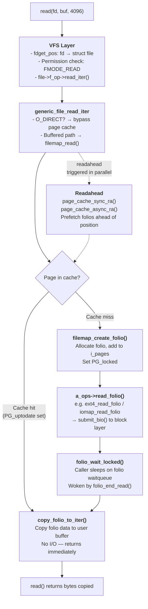

# Life of a read

> Tracing a read() syscall from userspace through the VFS, page cache, readahead, block I/O, and back

## What happens when you read from a file?

When a program calls `read()`, the kernel first checks whether the requested data is already in the **page cache** — a region of DRAM that caches file data as 4 KB pages (or larger folios since Linux 6.1). If the data is cached and up to date, it is copied directly to the userspace buffer with no I/O at all. If it is absent, the kernel allocates a folio, locks it, submits a bio to the block layer, waits for completion, then copies the data to the caller.



The critical insight: **read() on a cached file is nearly free** — it is a hash lookup followed by a `copy_to_user`. The expensive path is a cache miss, which requires allocating a folio, sleeping through block I/O (microseconds for NVMe, milliseconds for HDD), and then copying. Readahead exists to hide this latency by prefetching pages before they are needed.

## Stage 1: The read() syscall entry

A user program calls `read()`:

```c
/* User space */
ssize_t n = read(fd, buffer, 4096);

/* fs/read_write.c */
SYSCALL_DEFINE3(read, unsigned int, fd, char __user *, buf, size_t, count)
{
    return ksys_read(fd, buf, count);
}

ssize_t ksys_read(unsigned int fd, char __user *buf, size_t count)
{
    struct fd f = fdget_pos(fd);
    ssize_t ret = -EBADF;

    if (f.file) {
        loff_t pos, *ppos = file_ppos(f.file);
        if (ppos) {
            pos = *ppos;
            ppos = &pos;
        }
        ret = vfs_read(f.file, buf, count, ppos);
        if (ret >= 0 && ppos)
            f.file->f_pos = pos;
        fdput_pos(f);
    }
    return ret;
}
```

### fdget_pos: fd to struct file

`fdget_pos()` resolves the file descriptor integer to a `struct file *`. It looks up the fd in the current process's `files_struct` (the per-process open file table) and increments the file's reference count:

```c
/* fs/file.c */
static inline struct fd fdget_pos(int fd)
{
    return __to_fd(__fdget_pos(fd));
}
```

Internally this walks `current->files->fdt->fd[fd]`. The `files_struct` is protected by an RCU read lock for the fast path; the reference count bump prevents the `struct file` from being freed while we hold the reference. `fdput_pos()` releases the reference when the syscall is done.

### vfs_read: permission checks and dispatch

`vfs_read()` validates that the file is readable, checks the buffer is accessible, and dispatches to the filesystem:

```c
/* fs/read_write.c */
ssize_t vfs_read(struct file *file, char __user *buf,
                 size_t count, loff_t *pos)
{
    ssize_t ret;

    if (!(file->f_mode & FMODE_READ))
        return -EBADF;
    if (!(file->f_mode & FMODE_CAN_READ))
        return -EINVAL;
    if (unlikely(!access_ok(buf, count)))
        return -EFAULT;

    ret = rw_verify_area(READ, file, pos, count);
    if (ret)
        return ret;

    if (count > MAX_RW_COUNT)
        count = MAX_RW_COUNT;

    if (file->f_op->read)
        ret = file->f_op->read(file, buf, count, pos);
    else if (file->f_op->read_iter)
        ret = new_sync_read(file, buf, count, pos);
    else
        ret = -EINVAL;

    if (ret > 0) {
        fsnotify_access(file);
        add_rchar(current, ret);
    }
    inc_syscr(current);
    return ret;
}
```

`rw_verify_area()` checks mandatory locks (POSIX file locks), verifies that `pos + count` does not overflow, and calls security hooks (LSM). Almost every modern filesystem implements `read_iter` rather than the older `read`, so the call goes through `new_sync_read()`.

## Stage 2: VFS layer — new_sync_read, kiocb, iov_iter

`new_sync_read()` bridges the synchronous single-buffer interface into the iterator-based `read_iter` interface:

```c
/* fs/read_write.c */
static ssize_t new_sync_read(struct file *filp, char __user *buf,
                              size_t len, loff_t *ppos)
{
    struct kiocb kiocb;
    struct iov_iter iter;
    ssize_t ret;

    init_sync_kiocb(&kiocb, filp);
    kiocb.ki_pos = (ppos ? *ppos : 0);
    iov_iter_ubuf(&iter, ITER_DEST, buf, len);

    ret = filp->f_op->read_iter(&kiocb, &iter);
    BUG_ON(ret == -EIOCBQUEUED);
    if (ppos)
        *ppos = kiocb.ki_pos;
    return ret;
}
```

### The kiocb: per-operation context

`struct kiocb` carries per-operation state through the entire read path. It starts life here and travels all the way to the block layer:

```c
/* include/linux/fs.h */
struct kiocb {
    struct file       *ki_filp;    /* file being read */
    loff_t             ki_pos;     /* current file offset (updated on completion) */
    void (*ki_complete)(struct kiocb *, long);  /* async completion; NULL = sync */
    void              *private;
    int                ki_flags;   /* IOCB_DIRECT, IOCB_NOWAIT, IOCB_NOIO, ... */
    u16                ki_ioprio;  /* I/O priority (IOPRIO_CLASS_* | prio level) */
    struct wait_page_queue *ki_waitq;  /* for async page waits (io_uring) */
};
```

`init_sync_kiocb()` zeroes the struct and sets `ki_filp`. The `ki_complete` callback is `NULL` for synchronous reads — the caller will block rather than being woken by a callback.

Key `ki_flags`:

| Flag | Meaning |
|------|---------|
| `IOCB_DIRECT` | Use O_DIRECT path — bypass page cache |
| `IOCB_NOWAIT` | Return `EAGAIN` instead of blocking (io_uring) |
| `IOCB_NOIO` | Do not issue I/O — return error if page is not in cache |
| `IOCB_HIPRI` | High-priority I/O (polled NVMe) |

### The iov_iter: destination abstraction

`iov_iter` abstracts the destination of the read — a userspace buffer, kernel buffer, pipe, or scatter-gather list. The read path calls `copy_folio_to_iter()` uniformly regardless of the underlying buffer type:

```c
/* include/linux/uio.h (simplified) */
struct iov_iter {
    u8              iter_type;    /* ITER_UBUF, ITER_IOVEC, ITER_BVEC, ITER_KVEC, ITER_PIPE */
    bool            nofault;
    bool            data_source;  /* ITER_SOURCE (write) or ITER_DEST (read) */
    size_t          count;        /* bytes remaining */
    union {
        const struct iovec *iov;   /* ITER_IOVEC */
        const struct kvec  *kvec;  /* ITER_KVEC */
        const struct bio_vec *bvec; /* ITER_BVEC */
        struct xarray      *xarray; /* ITER_XARRAY */
        void __user        *ubuf;   /* ITER_UBUF (common single-buffer case) */
    };
    size_t          iov_offset;
    /* ... */
};
```

`iov_iter_ubuf()` initialises an `ITER_UBUF` iterator — the fast path for the common single-buffer `read()` call. When userspace passes an `iovec` array via `readv()`, an `ITER_IOVEC` is used instead. The copy functions are type-aware: `copy_folio_to_iter()` dispatches to `copy_to_user()` for `ITER_UBUF`/`ITER_IOVEC`, or a direct pointer copy for kernel buffers.

## Stage 3: generic_file_read_iter

Most filesystems wire `f_op->read_iter` to `generic_file_read_iter()`:

```c
/* mm/filemap.c */
ssize_t generic_file_read_iter(struct kiocb *iocb, struct iov_iter *iter)
{
    size_t count = iov_iter_count(iter);
    ssize_t retval = 0;

    if (!count)
        return 0; /* skip atime */

    if (iocb->ki_flags & IOCB_DIRECT) {
        struct file *file = iocb->ki_filp;
        struct address_space *mapping = file->f_mapping;
        struct inode *inode = mapping->host;

        retval = kiocb_write_and_wait(iocb, count);
        if (retval < 0)
            return retval;
        file_accessed(file);

        retval = mapping->a_ops->direct_IO(iocb, iter);
        if (retval >= 0) {
            iocb->ki_pos += retval;
            count -= retval;
        }
        iov_iter_revert(iter, count - iov_iter_count(iter));
        if (retval < 0 || !iov_iter_count(iter) ||
            iocb->ki_pos >= i_size_read(inode))
            goto out;
    }

    retval = filemap_read(iocb, iter, retval);
out:
    return retval;
}
```

### O_DIRECT vs buffered split

The first branch checks `IOCB_DIRECT` — set when the file was opened with `O_DIRECT`. Direct I/O bypasses the page cache entirely: data is transferred directly between the userspace buffer (which must be sector-aligned and page-aligned) and the block device. For the direct path, `kiocb_write_and_wait()` first waits for any pending buffered writes to be flushed, ensuring coherency between the two paths.

For the normal buffered path, `file_accessed()` updates the inode's `atime` (unless `O_NOATIME` was set — see the interesting cases section), and then `filemap_read()` does the real work.

## Stage 4: filemap_read — the page cache lookup

`filemap_read()` is the engine of the buffered read path. It loops over the requested byte range one folio-batch at a time, looking up folios in the page cache XArray:

```c
/* mm/filemap.c */
ssize_t filemap_read(struct kiocb *iocb, struct iov_iter *iter,
                     ssize_t already_read)
{
    struct file           *filp    = iocb->ki_filp;
    struct address_space  *mapping = filp->f_mapping;
    struct inode          *inode   = mapping->host;
    struct folio_batch     fbatch;
    int                    i, error = 0;
    bool                   writably_mapped;
    loff_t                 isize;

    if (unlikely(iocb->ki_pos >= inode->i_sb->s_maxbytes))
        return 0;
    if (unlikely(!iov_iter_count(iter)))
        return 0;

    iov_iter_truncate(iter, inode->i_sb->s_maxbytes);
    folio_batch_init(&fbatch);

    do {
        pgoff_t index = iocb->ki_pos >> PAGE_SHIFT;
        pgoff_t last  = DIV_ROUND_UP(iocb->ki_pos + iov_iter_count(iter),
                                      PAGE_SIZE) - 1;
        pgoff_t min_seq = last + 1;
        int nr;

        /* Trigger readahead before looking up the first folio */
        if (iocb->ki_pos >> PAGE_SHIFT != index)
            goto seek_data;

        /*
         * Look up a batch of up to PAGEVEC_SIZE folios in the XArray.
         * Returns immediately with whatever is already present.
         */
        nr = filemap_get_folios(mapping, &index, last, &fbatch);

        if (nr == 0) {
            /* Entire range absent — synchronous readahead then allocate */
            error = filemap_create_folio(filp, mapping,
                                         iocb->ki_pos >> PAGE_SHIFT,
                                         iter);
            if (error == AOP_TRUNCATED_PAGE)
                continue;
            break;
        }

        for (i = 0; i < folio_batch_count(&fbatch); i++) {
            struct folio *folio = fbatch.folios[i];
            loff_t  folio_pos  = folio_pos(folio);
            size_t  offset, size, copied;

            if (folio_pos + folio_size(folio) <= iocb->ki_pos)
                continue; /* advance past earlier folios */

            /*
             * Wait for I/O if folio is locked (being read from disk
             * by another thread, or being written by a concurrent writer).
             */
            if (folio_test_locked(folio)) {
                error = folio_wait_locked_killable(folio);
                if (error)
                    goto out;
            }

            /* Trigger async readahead when we reach the readahead mark */
            if (folio_test_readahead(folio))
                page_cache_async_ra(&filp->f_ra, folio, last - index + 1);

            if (!folio_test_uptodate(folio)) {
                /*
                 * Folio is in cache but not uptodate — the last I/O
                 * failed. Return EIO.
                 */
                if (iocb->ki_pos >= i_size_read(inode)) {
                    error = 0;
                    goto out;
                }
                error = -EIO;
                goto out;
            }

            /* Cache hit: copy data to user buffer */
            offset = iocb->ki_pos - folio_pos;
            size   = min_t(size_t, folio_size(folio) - offset,
                           iov_iter_count(iter));
            copied = copy_folio_to_iter(folio, offset, size, iter);
            already_read  += copied;
            iocb->ki_pos  += copied;

            if (copied < size) {
                error = -EFAULT;
                break;
            }
        }
        folio_batch_release(&fbatch);
        cond_resched();

    } while (iov_iter_count(iter) && iocb->ki_pos < i_size_read(inode) && !error);

out:
    file_accessed(filp);
    return already_read ? already_read : error;
}
```

### The XArray lookup: filemap_get_folios

The page cache is stored as an XArray (`struct xarray i_pages`) inside the inode's `address_space`. `filemap_get_folios()` performs a range lookup, returning up to `PAGEVEC_SIZE` (15) folio pointers in a single call:

```c
/* mm/filemap.c */
unsigned filemap_get_folios(struct address_space *mapping, pgoff_t *start,
                             pgoff_t end, struct folio_batch *fbatch)
{
    XA_STATE(xas, &mapping->i_pages, *start);
    struct folio *folio;

    rcu_read_lock();
    while ((folio = find_get_entry(&xas, end, XA_PRESENT)) != NULL) {
        if (xa_is_value(folio))  /* shadow entry — evicted folio */
            continue;
        if (!folio_batch_add(fbatch, folio))
            break;
    }
    rcu_read_unlock();

    if (folio_batch_count(fbatch))
        *start = folio->index + folio_nr_pages(folio);
    return folio_batch_count(fbatch);
}
```

The XArray lookup is lock-free under RCU for the read path. Each folio found has its reference count incremented before being placed in the batch. Shadow entries (thin records left behind when a folio is evicted) are skipped — they are used by the reclaim code to track eviction frequency, not by the read path.

### Cache hit: copy_folio_to_iter

When a folio is present and `PG_uptodate` is set, `copy_folio_to_iter()` copies the data directly from the folio's kernel mapping to the user buffer. No additional allocations. No extra copies:

```c
/* lib/iov_iter.c */
size_t copy_folio_to_iter(struct folio *folio, size_t offset, size_t bytes,
                           struct iov_iter *i)
{
    return copy_page_to_iter(folio_page(folio, offset >> PAGE_SHIFT),
                              offset & ~PAGE_MASK, bytes, i);
}

size_t copy_page_to_iter(struct page *page, size_t offset, size_t bytes,
                          struct iov_iter *i)
{
    if (likely(iter_is_ubuf(i)))
        return copy_page_to_iter_ubuf(page, offset, bytes, i);

    /* iovec, kvec, bvec, pipe variants ... */
    return copy_page_to_iter_iovec(page, offset, bytes, i);
}
```

For the `ITER_UBUF` fast path (single userspace buffer), this becomes a single `copy_to_user()` call. The kernel's virtual mapping of the folio (via the direct mapping) is used as the source; no additional `kmap()` is needed on x86_64 where all physical memory is directly mapped.

### Cache miss: filemap_create_folio

When `filemap_get_folios()` returns zero folios for the requested range, the kernel must bring the data in from storage:

```c
/* mm/filemap.c */
static int filemap_create_folio(struct file *file,
                                 struct address_space *mapping,
                                 pgoff_t index, struct iov_iter *iter)
{
    struct folio *folio;
    int error;

    folio = filemap_alloc_folio(mapping_gfp_mask(mapping), 0);
    if (!folio)
        return -ENOMEM;

    /*
     * Insert the folio into the page cache with PG_locked set.
     * Any other thread that finds this folio will block in
     * folio_wait_locked() rather than issuing duplicate I/O.
     */
    error = filemap_add_folio(mapping, folio, index,
                               mapping_gfp_mask(mapping));
    if (error) {
        folio_put(folio);
        if (error == -EEXIST)
            error = AOP_TRUNCATED_PAGE; /* race: folio appeared, retry */
        return error;
    }

    error = filemap_read_folio(file, mapping->a_ops->read_folio, folio);
    folio_put(folio);
    return error;
}
```

`filemap_read_folio()` calls the filesystem's `a_ops->read_folio()`, waits for I/O completion, and checks `PG_uptodate`:

```c
/* mm/filemap.c */
static int filemap_read_folio(struct file *file, filler_t filler,
                               struct folio *folio)
{
    bool workingset = folio_test_workingset(folio);
    unsigned long pflags;
    int error;

    /*
     * A previous I/O error may have been set on this folio.
     * Retry the read and see if it clears.
     */
    folio_wait_stable(folio);

    error = filler(file, folio);
    if (error)
        return error;

    error = folio_wait_locked_killable(folio);
    if (error)
        return error;
    if (!folio_test_uptodate(folio))
        return -EIO;
    return 0;
}
```

The folio remains locked (`PG_locked` set) for the entire duration of I/O. The lock acts as a one-shot event: any thread that finds the folio in the XArray but with `PG_locked` set will call `folio_wait_locked()` and sleep on the folio's embedded waitqueue, rather than issuing a second I/O for the same data. When the block I/O completes, `folio_end_read()` sets `PG_uptodate`, clears `PG_locked`, and wakes all waiters.

## Stage 5: Readahead

Sequential reads would be slow if the kernel waited for I/O on every cache miss individually. The readahead subsystem prefetches pages ahead of the current read position to overlap I/O with computation.

### The file_ra_state: per-file readahead state

Each `struct file` carries a `file_ra_state` that tracks the current readahead window:

```c
/* include/linux/fs.h */
struct file_ra_state {
    pgoff_t start;          /* start of the current readahead window */
    unsigned int size;      /* size of the current window, in pages */
    unsigned int async_size; /* threshold: issue async RA when this many pages left */
    unsigned int ra_pages;  /* maximum readahead size; 0 = disabled */
    unsigned int mmap_miss; /* cache miss stat for mmap accesses */
    loff_t prev_pos;        /* previous read position (for detecting sequential access) */
};
```

### Synchronous readahead: page_cache_sync_ra

On first access to a file range (cold start), `page_cache_sync_ra()` is called before the folio lookup to speculatively prefetch pages:

```c
/* mm/readahead.c */
void page_cache_sync_ra(struct readahead_control *ractl,
                         unsigned long req_count)
{
    struct file *file = ractl->file;
    struct file_ra_state *ra = &file->f_ra;
    struct address_space *mapping = file->f_mapping;
    pgoff_t index = readahead_index(ractl);
    pgoff_t expected, prev_index;
    unsigned int order = 0;

    /* No readahead on random access patterns */
    if (ra->ra_pages == 0)
        return;

    /* Detect sequential access: is this read where we expected? */
    prev_index = (unsigned long long)(ra->prev_pos - 1) >> PAGE_SHIFT;
    if (index == prev_index + 1) {
        /* Sequential: grow the window */
        ra->size = min(ra->size * 2, ra->ra_pages);
    } else {
        /* Random or new stream: start conservatively */
        ra->size = req_count;
        ra->start = index;
    }

    ra->async_size = ra->size / 2;
    ractl->_index = ra->start;
    do_page_cache_ra(ractl, ra->size, ra->async_size);
}
```

### Async readahead: page_cache_async_ra

When the reader reaches a folio tagged with `PG_readahead` — the lookahead marker placed at the midpoint of the current window — `page_cache_async_ra()` fires to extend the window before the current prefetch is exhausted:

```c
/* mm/readahead.c */
void page_cache_async_ra(struct readahead_control *ractl,
                          struct folio *folio, unsigned long req_count)
{
    struct file_ra_state *ra = &ractl->file->f_ra;

    /* Already issued readahead for this window? Skip. */
    if (!folio_test_readahead(folio))
        return;

    /* Don't issue readahead if the page cache is under heavy pressure */
    if (blk_cgroup_congested())
        return;

    folio_clear_readahead(folio);
    ractl->_index = ra->start + ra->size;
    ra->start    += ra->size;
    ra->size      = min(ra->size * 2, ra->ra_pages);  /* geometric growth */
    ra->async_size = ra->size / 2;

    do_page_cache_ra(ractl, ra->size, ra->async_size);
}
```

### The readahead window grows geometrically

The readahead size doubles on each sequential trigger, subject to `ra_pages` (controlled by `/sys/block/<dev>/queue/read_ahead_kb`):

```
First access:   window = 4 pages   (16 KB)
Second trigger: window = 8 pages   (32 KB)
Third trigger:  window = 16 pages  (64 KB)
...until:       window = ra_pages  (default 128 pages = 512 KB on most configs)
```

The `async_size` field marks where in the current window the lookahead folio is placed — at the midpoint by default. This means that by the time the reader reaches the lookahead mark, the next window's I/O has already been submitted and is (hopefully) complete.

### do_page_cache_ra: the actual prefetch

`do_page_cache_ra()` allocates folios for the readahead range and submits them all in one pass, allowing the block layer to merge adjacent requests into a single large I/O:

```c
/* mm/readahead.c */
static void do_page_cache_ra(struct readahead_control *ractl,
                               unsigned long nr_to_read,
                               unsigned long lookahead_size)
{
    struct address_space *mapping = ractl->mapping;
    pgoff_t index        = readahead_index(ractl);
    pgoff_t limit        = (i_size_read(ractl->inode) - 1) >> PAGE_SHIFT;
    pgoff_t mark         = index + nr_to_read - lookahead_size;
    unsigned long i;

    if (unlikely(!nr_to_read || index > limit))
        return;

    nr_to_read = min(nr_to_read, limit - index + 1);
    ractl->_nr_pages = nr_to_read;
    ractl->_workingset = false;

    /* Call the filesystem's readahead handler; it submits I/O in batches */
    read_pages(ractl);

    /*
     * Tag the lookahead folio. When filemap_read reaches this folio,
     * page_cache_async_ra will extend the window.
     */
    if (mark <= limit)
        set_page_readahead(mapping, mark);
}
```

## Stage 6: Block I/O submission — the cache miss path

When `a_ops->read_folio()` is called, the filesystem converts the file-level folio into a block-level I/O request.

### a_ops->read_folio dispatch

The dispatch depends on the filesystem:

```c
/* ext4, using iomap (modern path — ext4 since ~5.10): */
static int ext4_read_folio(struct file *file, struct folio *folio)
{
    int ret = -EAGAIN;
    struct inode *inode = folio->mapping->host;

    if (ext4_has_inline_data(inode))
        ret = ext4_readpage_inline(inode, folio);
    if (ret == -EAGAIN)
        return iomap_read_folio(folio, &ext4_iomap_ops);
    return ret;
}

/* xfs: */
static int xfs_vm_read_folio(struct file *unused, struct folio *folio)
{
    return iomap_read_folio(folio, &xfs_read_iomap_ops);
}
```

For filesystems still using buffer heads (FAT, older ext4 paths):

```c
/* fs/mpage.c — buffer-head based read_folio */
int mpage_read_folio(struct folio *folio, get_block_t get_block)
{
    struct bio *bio = NULL;
    sector_t last_block_in_bio = 0;

    bio = do_mpage_readpage(&(struct mpage_readpage_args){
        .bio              = bio,
        .folio            = folio,
        .nr_pages         = 1,
        .last_block_in_bio = &last_block_in_bio,
        .get_block        = get_block,
    });

    if (bio)
        mpage_bio_submit(bio);

    return 0;
}
```

### iomap_read_folio: mapping file offset to disk block

The iomap path asks the filesystem to map the file offset to a physical disk extent, then builds a bio:

```c
/* fs/iomap/buffered-io.c */
int iomap_read_folio(struct folio *folio, const struct iomap_ops *ops)
{
    struct iomap_iter iter = {
        .inode  = folio->mapping->host,
        .pos    = folio_pos(folio),
        .len    = folio_size(folio),
        .flags  = IOMAP_READ,
    };
    struct iomap_folio_state *ifs;
    int ret = 0;

    while ((ret = iomap_iter(&iter, ops)) > 0)
        iter.processed = iomap_readpage_iter(&iter, &(struct iomap_readpage_ctx){
            .cur_folio = folio,
        });

    return ret;
}
```

`iomap_iter()` calls the filesystem's `iomap_begin()` operation, which fills a `struct iomap` describing the physical extent:

```c
/* include/linux/iomap.h */
struct iomap {
    u64              addr;    /* physical disk byte offset (IOMAP_NULL_ADDR = hole) */
    loff_t           offset;  /* file offset of this mapping */
    u64              length;  /* length of this mapping */
    u16              type;    /* IOMAP_HOLE, IOMAP_MAPPED, IOMAP_UNWRITTEN, IOMAP_INLINE */
    u16              flags;   /* IOMAP_F_NEW, IOMAP_F_DIRTY, IOMAP_F_SHARED, ... */
    struct block_device *bdev;
    struct dax_device   *dax_dev;
};
```

### Bio construction and submission

Once the physical block mapping is known, the iomap layer builds a `struct bio` and submits it:

```c
/* include/linux/bio.h — key fields */
struct bio {
    struct block_device  *bi_bdev;      /* target block device */
    blk_opf_t             bi_opf;       /* REQ_OP_READ | REQ_SYNC | REQ_RAHEAD | ... */
    unsigned short        bi_flags;
    unsigned short        bi_ioprio;
    struct bvec_iter      bi_iter;      /* current position within bi_io_vec */
    bio_end_io_t         *bi_end_io;    /* called on I/O completion */
    void                 *bi_private;   /* filesystem private data */
    struct bio_vec        bi_inline_vecs[]; /* scatter-gather list (page, offset, len) */
};
```

The folio is added to the bio as a `bio_vec` entry. For a single 4 KB folio on a single extent, this is one bio_vec pointing to the folio's page at offset 0, length 4096. For a large folio (order-2 = 16 KB), a single bio_vec covers the whole folio.

`submit_bio()` hands the bio to the block layer:

```c
/* block/blk-core.c */
void submit_bio(struct bio *bio)
{
    if (unlikely(bio_op(bio) == REQ_OP_READ &&
                 (bio->bi_opf & REQ_RAHEAD)))
        current->bdacct.read_bytes += bio->bi_iter.bi_size;

    blkcg_bio_issue_init(bio);

    if (!submit_bio_checks(bio))
        return;

    if (blkcg_punt_bio_submit(bio))
        return;  /* cgroup I/O scheduling */

    __submit_bio(bio);
}
```

### PG_locked during I/O: the folio waitqueue

While the bio is in flight, the folio remains locked (`PG_locked` bit set in `folio->flags`). This is the mechanism that prevents duplicate I/O: any other thread that finds this folio in the XArray and observes `PG_locked` will call `folio_wait_locked()` and add itself to the folio's embedded waitqueue:

```c
/* mm/filemap.c */
static inline int folio_wait_locked_killable(struct folio *folio)
{
    if (!folio_test_locked(folio))
        return 0;
    return __folio_lock_killable(folio);
}

/* mm/folio-wait.c */
int __folio_lock_killable(struct folio *folio)
{
    return folio_wait_bit_killable(folio, PG_locked);
}
```

The folio's waitqueue is stored in a hash table (`page_wait_table`) keyed on the folio's address — multiple folios share each waitqueue head to limit memory usage.

## Stage 7: Bio completion — waking the reader

When the storage device completes the read, the interrupt handler triggers the bio's `end_io` chain, eventually calling `folio_end_read()`.

### end_page_read and folio_end_read

```c
/* mm/page_io.c */
void folio_end_read(struct folio *folio, bool success)
{
    unsigned long old;

    /* Set PG_uptodate atomically before clearing PG_locked */
    if (likely(success))
        folio_mark_uptodate(folio);
    else
        folio_clear_uptodate(folio);  /* leave error for reader to handle */

    /*
     * Clear PG_locked and wake all waiters atomically.
     * The memory barrier here ensures PG_uptodate is visible to
     * all threads before they are woken.
     */
    old = folio_clear_flags_newa(folio, 1 << PG_locked);
    if (old & (1 << PG_waiters))
        folio_wake_bit(folio, PG_locked);
}
```

### Folio state transitions during a read

```
Folio allocated by filemap_create_folio:
  PG_locked = 1   (locked; no readers yet)
  PG_uptodate = 0 (data not valid)

Bio submitted to block device:
  PG_locked = 1   (locked; readers sleep on folio waitqueue)
  PG_uptodate = 0

I/O completes successfully (folio_end_read):
  PG_uptodate = 1   ← set first, with barrier
  PG_locked = 0     ← cleared; waiters woken
  PG_readahead = ?  ← may be set by readahead engine as lookahead marker

Folio remains in cache:
  PG_uptodate = 1   (data valid; future readers copy directly)
  PG_active    = 1  (on the active LRU; won't be evicted soon)
```

### Back in filemap_read

Once the sleeping reader is woken, it falls back into the `filemap_read` loop:

1. `folio_wait_locked()` returns (the folio is now unlocked).
2. `folio_test_uptodate()` is checked — if `false`, I/O failed, return `-EIO`.
3. `copy_folio_to_iter()` copies the data to the user buffer.
4. `iocb->ki_pos` advances by the number of bytes copied.
5. The loop continues for the next range.

## Stage 8: Copy to userspace

`copy_folio_to_iter()` performs the final data movement from kernel memory to the user buffer. On x86_64, the folio is permanently mapped in the kernel's direct physical mapping (above `PAGE_OFFSET`), so no temporary `kmap` is needed:

```c
/* lib/iov_iter.c */
size_t copy_folio_to_iter(struct folio *folio, size_t offset, size_t bytes,
                           struct iov_iter *i)
{
    if (unlikely(folio_test_hugetlb(folio)))
        return copy_hugetlb_page_to_iter(folio, offset, bytes, i);
    return copy_page_to_iter(folio_page(folio, offset >> PAGE_SHIFT),
                              offset & ~PAGE_MASK, bytes, i);
}
```

For a user-space `ITER_UBUF` destination (the common `read()` case):

```c
/* lib/iov_iter.c — the fast path */
static size_t copy_page_to_iter_ubuf(struct page *page, size_t offset,
                                      size_t bytes, struct iov_iter *iter)
{
    char *kaddr;

    /* kmap_local_page is a no-op on x86_64 (direct mapping) */
    kaddr = kmap_local_page(page);
    bytes = copyout(iter->ubuf + iter->iov_offset, kaddr + offset, bytes);
    kunmap_local(kaddr);

    iter->iov_offset += bytes;
    iter->count      -= bytes;
    return bytes;
}
```

`copyout()` calls `copy_to_user()`, which handles the potential page fault if the user's destination buffer is not yet faulted in. On a copy fault, the copy returns short — `filemap_read` sees `copied < size` and returns `EFAULT`.

### Position update

After each successful copy, `ki_pos` is updated:

```c
iocb->ki_pos += copied;
already_read  += copied;
```

This position is committed back to `f_pos` in `ksys_read()` after `vfs_read()` returns:

```c
/* fs/read_write.c */
if (ret >= 0 && ppos)
    f.file->f_pos = pos;   /* commit updated position */
```

The update to `f_pos` is not protected by a lock in the fast path — concurrent reads on the same fd will race for the file position. This is intentional: POSIX does not require `f_pos` updates to be atomic across threads. Applications that need per-thread positions should use `pread()` instead.

### Large folios (Linux 6.1+)

When large folios are enabled in the page cache, a single folio may span multiple base pages (e.g., an order-2 folio covers 4 × 4 KB = 16 KB). `copy_folio_to_iter()` handles this uniformly — it computes which base page within the folio the offset falls into, then copies from there. For a 4-page folio, a single bio_vec covers the whole folio, allowing the block layer to issue a single 16 KB read instead of four separate 4 KB reads, reducing both per-I/O overhead and interrupt count.

```c
/* Folio order → size:
 *   order 0 → 1 page  =  4 KB
 *   order 2 → 4 pages = 16 KB
 *   order 4 → 16 pages = 64 KB
 */
size_t folio_size(struct folio *folio)
{
    return PAGE_SIZE << folio_order(folio);
}

/* folio_nr_pages — how many base pages this folio occupies in the XArray */
long folio_nr_pages(const struct folio *folio)
{
    return 1 << folio_order(folio);
}
```

## Stage 9: Return path

### Back through the call stack

After `filemap_read()` returns, control unwinds:

```
filemap_read()                 → returns bytes_read
  ↑ generic_file_read_iter()   → returns bytes_read
      ↑ new_sync_read()        → updates *ppos = kiocb.ki_pos; returns bytes_read
          ↑ vfs_read()         → calls fsnotify_access(); updates task counters; returns bytes_read
              ↑ ksys_read()    → commits f->f_pos; fdput_pos(); returns bytes_read
                  ↑ SYSCALL_DEFINE3(read)  → syscall return to userspace
```

### Partial reads (short reads)

`read()` can return fewer bytes than requested without being an error. This is a valid POSIX outcome:

- **EOF reached**: `iocb->ki_pos` reached `i_size_read(inode)` before the iterator was exhausted. `filemap_read` exits the loop and returns `already_read` (which may be less than the requested count).
- **Signal interrupted**: `folio_wait_locked_killable()` returned `-EINTR` after a signal was delivered. If `already_read > 0`, `filemap_read` returns the partial count rather than the error, and userspace retries from the new position.
- **Copy fault**: `copy_folio_to_iter` returned fewer bytes than expected (destination page not writable). `filemap_read` sets `error = -EFAULT` and breaks. If some bytes were already copied, it returns those.

### EINTR handling

If the read was interrupted by a signal before any data was copied, `filemap_read` returns the error directly, which propagates through `vfs_read()` back to `ksys_read()`. The C library's `read()` wrapper returns `-1` with `errno = EINTR`. Correct applications use a retry loop:

```c
ssize_t read_all(int fd, void *buf, size_t count)
{
    ssize_t total = 0;
    while (total < (ssize_t)count) {
        ssize_t n = read(fd, (char *)buf + total, count - total);
        if (n < 0) {
            if (errno == EINTR)
                continue;   /* retry on signal */
            return -1;
        }
        if (n == 0)
            break;          /* EOF */
        total += n;
    }
    return total;
}
```

## Interesting cases

### Concurrent write in progress: folio locked

Consider a thread doing a buffered write to a page at the same time as a read:

```
Thread A (writer): write_begin() → finds folio, locks it (PG_locked)
                   copy_from_user() → copies data into folio
                   write_end() → marks PG_dirty, unlocks folio

Thread B (reader): filemap_get_folios() → finds the same folio
                   folio_test_locked() → TRUE (locked by writer)
                   folio_wait_locked_killable() → sleeps
                   [Thread A's write_end clears PG_locked, wakes Thread B]
                   Thread B wakes: folio_test_uptodate() → TRUE
                   copy_folio_to_iter() → reads the freshly written data
```

The reader sees the write's data atomically at folio granularity, even without explicit synchronisation in userspace — this is the page cache's coherency guarantee for buffered I/O.

### MADV_SEQUENTIAL hint

When a process calls `madvise(addr, len, MADV_SEQUENTIAL)` on a memory-mapped file region, the kernel sets `VM_SEQ_READ` on the corresponding VMA. This is propagated to the readahead machinery via the `faultaround` and `filemap_map_pages` paths. With `MADV_SEQUENTIAL`, the readahead window starts larger (the VMA's `vm_ra_state` is initialised to the full `ra_pages` rather than a conservative small value) and page reclaim gives these pages a lower reference count on their first LRU cycle, encouraging faster eviction after they are read (since sequential workloads typically don't re-read pages).

For the `read()` path (as opposed to `mmap`), setting `POSIX_FADV_SEQUENTIAL` via `posix_fadvise()` achieves the same effect: it doubles `f_ra.ra_pages`:

```c
/* mm/fadvise.c */
case POSIX_FADV_SEQUENTIAL:
    file->f_ra.ra_pages = inode->i_sb->s_bdi->ra_pages * 2;
    spin_lock(&file->f_lock);
    file->f_mode &= ~FMODE_RANDOM;
    spin_unlock(&file->f_lock);
    break;
```

### O_NOATIME: skipping the atime update

Opening a file with `O_NOATIME` (or mounting with `noatime`) skips the `inode->i_atime` update that would otherwise occur on every read. This matters for read-heavy workloads: without `O_NOATIME`, every `read()` call marks the inode dirty (for the `atime` update), triggering writeback of the inode even for a pure read workload.

The check is in `file_accessed()`, called from `filemap_read()`:

```c
/* fs/inode.c */
void file_accessed(struct file *file)
{
    if (!(file->f_flags & O_NOATIME))
        touch_atime(&file->path);
}

void touch_atime(const struct path *path)
{
    struct inode *inode = d_inode(path->dentry);

    /* Skip if: noatime mount option, relatime with recent atime, or read-only fs */
    if (!relatime_need_update(path->mnt, inode, current_time(inode)))
        return;

    inode_update_time(inode, S_ATIME);
}
```

`relatime` (the modern default, preferred over `noatime`) only updates atime if the current atime is older than mtime, or if atime is more than 24 hours old. This dramatically reduces inode writeback while preserving enough atime semantics for tools like `tmpwatch` and `mutt`.

### Large folios and multi-page reads (Linux 6.1+)

Prior to Linux 6.1, the page cache always used order-0 folios (single 4 KB pages). Large folio support in the file page cache, merged for 6.1, allows filesystems to allocate and cache multi-page folios:

```c
/* mm/filemap.c — large folio allocation path */
static struct folio *filemap_alloc_folio(gfp_t gfp, unsigned int order)
{
    struct folio *folio;

    if (order > 0 && arch_wants_old_prefaulted_order(order))
        order = 0;  /* arch override */

    folio = folio_alloc(gfp, order);
    return folio;
}
```

With large folios:
- A single XArray entry covers multiple pages (an order-2 folio occupies 4 index slots).
- A single bio_vec covers the entire folio, allowing a 16 KB or 64 KB read in one bio instead of four or sixteen.
- `copy_folio_to_iter()` may copy more than `PAGE_SIZE` bytes in a single call.
- Folio lock contention is reduced — one lock covers more data.
- The readahead engine prefers large folios when it can satisfy the allocation.

The net effect is lower overhead per byte read, especially for streaming workloads with large request sizes.

## Try it yourself

### Trace a read with strace

```bash
# Trace read syscalls with timing:
strace -T -e trace=read,pread64,readv dd if=/tmp/testfile of=/dev/null bs=4096 count=256

# Observe:
# - read() duration < 10us: data was in page cache
# - read() duration > 100us: triggered block I/O (cache miss)

# Drop the page cache first to force cold reads:
echo 3 > /proc/sys/vm/drop_caches
strace -T -e trace=read dd if=/tmp/testfile of=/dev/null bs=4096 count=256
```

### Trace filemap_read with bpftrace

```bash
# Trace all filemap_read calls with file name and bytes:
bpftrace -e '
kprobe:filemap_read {
    $iocb = (struct kiocb *)arg0;
    $file = $iocb->ki_filp;
    printf("pid=%-6d comm=%-16s pos=%-12ld file=%s\n",
           pid, comm, $iocb->ki_pos,
           str($file->f_path.dentry->d_name.name));
}'

# Count filemap_read calls per process:
bpftrace -e 'kprobe:filemap_read { @[comm] = count(); }
             interval:s:5 { print(@); clear(@); }'
```

### Trace cache misses with bpftrace

```bash
# Trace filemap_read_folio (cache miss — block I/O being submitted):
bpftrace -e '
kprobe:filemap_read_folio {
    @misses[comm] = count();
}
kretprobe:filemap_read_folio {
    if (retval != 0)
        @errors[comm] = count();
}
interval:s:5 { print(@misses); print(@errors); clear(@misses); clear(@errors); }'

# Trace filemap_create_folio (page allocation for cache miss):
bpftrace -e '
kprobe:filemap_create_folio {
    @allocs[comm] = count();
}
interval:s:5 { print(@allocs); clear(@allocs); }'
```

### Trace readahead behaviour

```bash
# Observe readahead submissions — when does the kernel prefetch?
bpftrace -e '
kprobe:do_page_cache_ra {
    $ractl = (struct readahead_control *)arg0;
    $nr    = arg1;
    printf("pid=%-6d comm=%-16s ra_start=%-8lu nr_pages=%lu\n",
           pid, comm, $ractl->_index, $nr);
}'

# Compare hit rate before and after a sequential read:
cat /proc/vmstat | grep -E "pgpgin|pgpgout|pswpin|pswpout"
cat /tmp/largefile > /dev/null
cat /proc/vmstat | grep -E "pgpgin|pgpgout|pswpin|pswpout"
# pgpgin should increase by ~(file_size_in_kb / 4) on first read, 0 on second read
```

### Measure cache hit rate with perf

```bash
# Profile page cache hits vs. misses using perf:
perf stat -e \
    block:block_bio_remap,\
    filemap:mm_filemap_add_to_page_cache,\
    filemap:mm_filemap_delete_from_page_cache \
    -- cat /tmp/testfile > /dev/null

# mm_filemap_add_to_page_cache: cache misses (new folios allocated)
# block:block_bio_remap: actual I/O requests (subset of misses)

# Second run should show zero block:block_bio_remap if file fits in memory:
cat /tmp/testfile > /dev/null
perf stat -e block:block_bio_remap -- cat /tmp/testfile > /dev/null
```

### Watch readahead with ftrace

```bash
# Enable readahead tracepoints:
echo 1 > /sys/kernel/debug/tracing/events/filemap/mm_filemap_add_to_page_cache/enable
echo 1 > /sys/kernel/debug/tracing/events/block/block_bio_complete/enable
cat /sys/kernel/debug/tracing/trace_pipe &

# Trigger sequential read:
dd if=/tmp/testfile of=/dev/null bs=4096

# Look for batches of filemap_add_to_page_cache events — the readahead window size
# Read pages should cluster: first batch ~8 pages, then ~16, ~32, ...

# Disable:
echo 0 > /sys/kernel/debug/tracing/events/filemap/mm_filemap_add_to_page_cache/enable
echo 0 > /sys/kernel/debug/tracing/events/block/block_bio_complete/enable
kill %1
```

### Check page cache occupancy

```bash
# How much of a file is in the page cache?
# Install fincore (from util-linux) or use vmtouch:
vmtouch -v /path/to/file
# Output: [OOOOOOOOOOOOOOOO] 4096/4096  100.0%  resident

# mincore() syscall shows per-page cache presence:
# (fincore wraps this)
fincore /path/to/file

# Total page cache usage:
grep -E "^Cached:|^Buffers:" /proc/meminfo

# Per-process working set (anon + file-backed):
cat /proc/<pid>/status | grep -E "VmRSS|RssFile|RssAnon"
```

### Tune readahead size

```bash
# Current readahead size (in KB) per device:
cat /sys/block/sda/queue/read_ahead_kb      # default 128
cat /sys/block/nvme0n1/queue/read_ahead_kb  # default 128

# Increase for large sequential workloads (e.g., video streaming, database backup):
echo 2048 > /sys/block/nvme0n1/queue/read_ahead_kb

# Per-file hint via posix_fadvise (from userspace):
posix_fadvise(fd, 0, 0, POSIX_FADV_SEQUENTIAL);  # hint: double ra_pages
posix_fadvise(fd, 0, 0, POSIX_FADV_RANDOM);      # hint: disable readahead
posix_fadvise(fd, offset, len, POSIX_FADV_WILLNEED); # prefetch range now

# Check if readahead is being used (pages fetched in advance, not on demand):
grep "pgpgin\|readahead" /proc/vmstat
# pgpgin_readahead: pages brought in by readahead (not demand)
# readahead_cache_hit: readahead pages that were actually used before eviction
```

## Key source files

| File | What It Does |
|------|-------------|
| [`fs/read_write.c`](https://git.kernel.org/pub/scm/linux/kernel/git/torvalds/linux.git/tree/fs/read_write.c) | `ksys_read`, `vfs_read`, `new_sync_read` — syscall entry and VFS dispatch |
| [`mm/filemap.c`](https://git.kernel.org/pub/scm/linux/kernel/git/torvalds/linux.git/tree/mm/filemap.c) | `generic_file_read_iter`, `filemap_read`, `filemap_get_folios`, `filemap_create_folio`, `copy_folio_to_iter` |
| [`mm/readahead.c`](https://git.kernel.org/pub/scm/linux/kernel/git/torvalds/linux.git/tree/mm/readahead.c) | `page_cache_sync_ra`, `page_cache_async_ra`, `do_page_cache_ra`, `read_pages` |
| [`mm/folio-wait.c`](https://git.kernel.org/pub/scm/linux/kernel/git/torvalds/linux.git/tree/mm/folio-wait.c) | `folio_wait_locked`, `folio_end_read`, folio waitqueue management |
| [`fs/iomap/buffered-io.c`](https://git.kernel.org/pub/scm/linux/kernel/git/torvalds/linux.git/tree/fs/iomap/buffered-io.c) | `iomap_read_folio`, `iomap_readahead` — iomap-based read path (ext4, xfs, btrfs) |
| [`fs/mpage.c`](https://git.kernel.org/pub/scm/linux/kernel/git/torvalds/linux.git/tree/fs/mpage.c) | `mpage_read_folio`, `mpage_readahead` — buffer-head based read path (FAT, older code) |
| [`lib/iov_iter.c`](https://git.kernel.org/pub/scm/linux/kernel/git/torvalds/linux.git/tree/lib/iov_iter.c) | `copy_page_to_iter`, `copy_folio_to_iter` — folio→user copy engine |
| [`include/linux/fs.h`](https://git.kernel.org/pub/scm/linux/kernel/git/torvalds/linux.git/tree/include/linux/fs.h) | `struct kiocb`, `struct address_space`, `address_space_operations`, `file_ra_state` |
| [`include/linux/pagemap.h`](https://git.kernel.org/pub/scm/linux/kernel/git/torvalds/linux.git/tree/include/linux/pagemap.h) | Page cache lookup helpers, folio state accessors (`folio_test_uptodate`, etc.) |
| [`include/linux/iomap.h`](https://git.kernel.org/pub/scm/linux/kernel/git/torvalds/linux.git/tree/include/linux/iomap.h) | `struct iomap`, iomap operation tables |
| [`block/blk-core.c`](https://git.kernel.org/pub/scm/linux/kernel/git/torvalds/linux.git/tree/block/blk-core.c) | `submit_bio`, bio submission to the block layer |

## Further reading

### Related docs in this repo

- [Life of a write](life-of-a-write.md) — the write-side counterpart: dirty pages, throttling, writeback, and fsync
- [Buffered I/O](buffered-io.md) — the full read and write path through the page cache with struct definitions
- [Readahead](readahead.md) — readahead window management, POSIX_FADV_*, and readahead tuning in depth
- [Direct I/O](direct-io.md) — bypassing the page cache with `O_DIRECT`; coherency with buffered I/O
- [Async I/O](async-io.md) — io_uring for non-blocking reads; `IOCB_NOWAIT` and the `IOCB_NOIO` probe
- [Page cache writeback](page-cache-writeback.md) — the dirty side of the cache; when and how folios get written back
- [Observability](observability.md) — bpftrace and ftrace cookbook for I/O performance analysis

### LWN articles

- [Large pages in the page cache](https://lwn.net/Articles/903056/) (2022) — motivation and implementation of large folios in the file page cache
- [Readahead: the documentation I wish I had](https://lwn.net/Articles/372384/) (2010) — deep-dive into the ondemand readahead algorithm
- [The folio introduction](https://lwn.net/Articles/849538/) (2021) — why `struct folio` replaced `struct page` in the page cache
- [Fixing the page cache](https://lwn.net/Articles/712467/) (2017) — XArray replacing the radix tree in `address_space.i_pages`
- [Non-blocking buffered file read](https://lwn.net/Articles/806980/) (2020) — io_uring and `IOCB_NOWAIT` for async buffered reads
- [The VFS layer](https://lwn.net/Articles/13324/) — introduction to VFS, struct file, and the dispatch table
