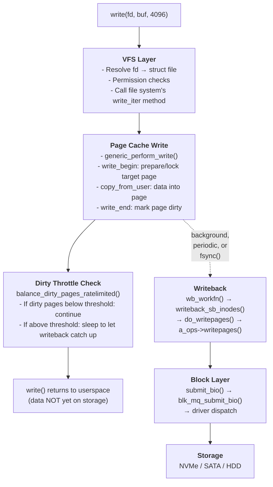
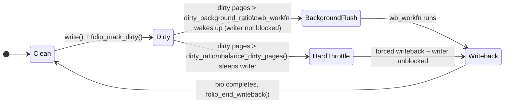

# Life of a write

> Tracing a write() syscall from userspace through the page cache, dirty throttling, writeback, and down to storage

## What happens when you write to a file?

When a program writes to a file, the data almost never goes directly to disk. Instead, the kernel copies it into a **page cache** page, marks that page **dirty**, and returns immediately. The data reaches storage later — either when the OS flushes it in the background, when memory pressure forces eviction, or when the application explicitly calls `fsync()`.



The critical insight: **write() returns before your data is durable**. This is a deliberate design choice — buffering writes in DRAM and flushing them asynchronously in large batches is orders of magnitude faster than writing every byte synchronously. But it means applications that need durability must explicitly ask for it with `fsync()` or `O_SYNC`.

## Stage 1: The write() syscall entry

A user program calls `write()`:

```c
// User space
ssize_t n = write(fd, buffer, 4096);

/* fs/read_write.c */
SYSCALL_DEFINE3(write, unsigned int, fd, const char __user *, buf, size_t, count)
{
    return ksys_write(fd, buf, count);
}

ssize_t ksys_write(unsigned int fd, const char __user *buf, size_t count)
{
    struct fd f = fdget_pos(fd);
    ssize_t ret = -EBADF;

    if (f.file) {
        ret = vfs_write(f.file, buf, count, file_ppos(f.file));
        fdput_pos(f);
    }
    return ret;
}
```

### From syscall to VFS: ksys_write and vfs_write

The syscall stub simply calls `ksys_write()`. `ksys_write()` wraps the fd resolution so the same logic can be called from kernel code without going through `SYSCALL_DEFINE`. `vfs_write()` does the permission checks and dispatches to the filesystem:

```c
// fs/read_write.c
ssize_t vfs_write(struct file *file, const char __user *buf,
                  size_t count, loff_t *pos)
{
    ssize_t ret;

    if (!(file->f_mode & FMODE_WRITE))
        return -EBADF;
    if (!(file->f_mode & FMODE_CAN_WRITE))
        return -EINVAL;
    if (!access_ok(buf, count))
        return -EFAULT;

    ret = rw_verify_area(WRITE, file, pos, count);
    if (ret)
        return ret;

    if (file->f_op->write)
        ret = file->f_op->write(file, buf, count, pos);
    else if (file->f_op->write_iter)
        ret = new_sync_write(file, buf, count, pos);
    else
        ret = -EINVAL;

    if (ret > 0) {
        fsnotify_modify(file);
        add_wchar(current, ret);
    }
    inc_syscw(current);
    return ret;
}
```

Nearly every modern filesystem uses the `write_iter` path. `new_sync_write()` wraps the synchronous interface into the iterator-based one:

```c
// fs/read_write.c
static ssize_t new_sync_write(struct file *filp, const char __user *buf,
                               size_t len, loff_t *ppos)
{
    struct kiocb kiocb;
    struct iov_iter iter;

    init_sync_kiocb(&kiocb, filp);
    kiocb.ki_pos = (ppos ? *ppos : 0);
    iov_iter_ubuf(&iter, ITER_SOURCE, (void __user *)buf, len);

    ret = filp->f_op->write_iter(&kiocb, &iter);

    if (ret > 0)
        *ppos = kiocb.ki_pos;
    return ret;
}
```

### The kiocb and iov_iter

Two structs carry per-operation state through the entire write path:

```c
// include/linux/fs.h
struct kiocb {
    struct file       *ki_filp;    // file being written
    loff_t             ki_pos;     // current file offset (updated after write)
    void (*ki_complete)(struct kiocb *, long); // async completion callback (NULL = sync)
    void              *private;
    int                ki_flags;   // IOCB_DIRECT, IOCB_SYNC, IOCB_DSYNC, ...
    u16                ki_ioprio;  // I/O priority
    struct wait_page_queue *ki_waitq; // for async page waits
};
```

`iov_iter` abstracts the source of data — a user buffer, a kernel buffer, a pipe, or a scatter-gather list:

```c
// include/linux/uio.h (simplified)
struct iov_iter {
    u8              iter_type;   // ITER_UBUF, ITER_IOVEC, ITER_BVEC, ITER_KVEC
    bool            nofault;
    bool            data_source; // ITER_SOURCE (write) or ITER_DEST (read)
    size_t          count;       // bytes remaining in the iterator
    union {
        const struct iovec *iov;
        const struct kvec  *kvec;
        const struct bio_vec *bvec;
        struct xarray      *xarray;
        void __user        *ubuf;  // for ITER_UBUF (single-buffer common case)
    };
    // ...
};
```

Using `iov_iter` means that `generic_perform_write()` does not need to know whether the data is coming from a userspace buffer, a kernel buffer, or an `iovec` array — it calls `copy_page_from_iter_atomic()` uniformly.

Most filesystems wire `f_op->write_iter` to `generic_file_write_iter()`:

```c
// mm/filemap.c
ssize_t generic_file_write_iter(struct kiocb *iocb, struct iov_iter *from)
{
    struct file *file = iocb->ki_filp;
    struct inode *inode = file->f_mapping->host;
    ssize_t ret;

    inode_lock(inode);

    ret = generic_write_checks(iocb, from);
    if (ret > 0)
        ret = generic_perform_write(iocb, from);

    inode_unlock(inode);

    if (ret > 0) {
        // If O_SYNC or O_DSYNC, flush to storage before returning
        ret = generic_write_sync(iocb, ret);
    }
    return ret;
}
```

The `inode_lock()` / `inode_unlock()` wrapping `generic_perform_write` is the inode's `i_rwsem`. This serialises concurrent writers on the same file — only one write is in `generic_perform_write` at a time for buffered I/O.

## Stage 2: The page cache write path

`generic_perform_write()` is the engine of the buffered write path. It loops over the write range one page at a time, calling into the filesystem for each page via the `address_space_operations` (`a_ops`) dispatch table:

```c
// mm/filemap.c (simplified)
ssize_t generic_perform_write(struct kiocb *iocb, struct iov_iter *i)
{
    struct file          *file    = iocb->ki_filp;
    struct address_space *mapping = file->f_mapping;
    const struct address_space_operations *a_ops = mapping->a_ops;
    loff_t pos = iocb->ki_pos;
    ssize_t written = 0;
    int status = 0;

    do {
        struct page *page;
        void        *fsdata = NULL;
        unsigned long offset = pos & (PAGE_SIZE - 1);  // offset within page
        unsigned long bytes  = min_t(unsigned long,
                                     PAGE_SIZE - offset,
                                     iov_iter_count(i));

        // Step 1: Prepare the target page
        status = a_ops->write_begin(file, mapping, pos, bytes,
                                     &page, &fsdata);
        if (unlikely(status < 0))
            break;

        // Step 2: Copy from user into the page
        if (mapping_writably_mapped(mapping))
            flush_dcache_page(page);
        copied = copy_page_from_iter_atomic(page, offset, bytes, i);
        flush_dcache_page(page);

        // Step 3: Mark dirty and unlock
        status = a_ops->write_end(file, mapping, pos, bytes, copied,
                                   page, fsdata);
        if (unlikely(status != copied)) {
            iov_iter_revert(i, copied - max(status, 0L));
            if (unlikely(status < 0))
                break;
        }

        pos     += copied;
        written += copied;

        // Step 4: Throttle if too many dirty pages
        balance_dirty_pages_ratelimited(mapping);

    } while (iov_iter_count(i));

    iocb->ki_pos += written;
    return written ? written : status;
}
```

### write_begin: preparing the page

`a_ops->write_begin` is the filesystem's hook to prepare the target folio before the copy. For iomap-based filesystems, the `a_ops->write_begin` dispatch goes through the filesystem's own write_begin implementation (e.g., `ext4_write_begin`), which then calls into the iomap machinery — `iomap_write_begin()` is an internal iomap helper, not the `a_ops` callback itself. It must:

1. Find or allocate the page in the page cache at the target offset.
2. For a **partial page write** — a write that does not cover the entire 4 KB page — read the existing page content from disk first, so the unwritten bytes retain their on-disk values. This read-modify-write pattern avoids exposing uninitialised data.
3. Allocate any filesystem metadata needed (e.g., journal credits in ext4).
4. Return the locked page to the caller.

```c
// fs/iomap/buffered-io.c (conceptual flow)
static int iomap_write_begin(struct iomap_iter *iter, loff_t pos,
                              unsigned len, struct folio **foliop)
{
    struct address_space *mapping = iter->inode->i_mapping;
    struct folio *folio;

    // Grab or allocate the folio at this file offset
    folio = iomap_get_folio(iter, pos, len);

    // Partial page write?  Read existing content first.
    if (!folio_test_uptodate(folio)) {
        // Only read the blocks that are NOT being fully overwritten
        status = iomap_read_folio_sync(iter, folio, pos, len);
    }

    *foliop = folio;
    return 0;
}
```

The read-on-partial-write is an important performance concern. If your application always writes 4 KB-aligned, full-page chunks, the kernel skips this extra read. Databases and write-optimised applications often align writes for exactly this reason.

### copy_page_from_iter_atomic: the actual copy

With the page locked and uptodate, the kernel copies from the user iterator into the page:

```c
// lib/iov_iter.c
size_t copy_page_from_iter_atomic(struct page *page, unsigned offset,
                                   size_t bytes, struct iov_iter *i)
{
    // kmap_local_page: temporarily map the page into kernel address space
    // (kmap_atomic() is deprecated since ~5.19; kmap_local_page() is the modern replacement)
    // copy_from_user_inatomic: copy without sleeping (we hold the page lock)
    char *kaddr = kmap_local_page(page);
    size_t copied = copyout(kaddr + offset, i, bytes);
    kunmap_local(kaddr);
    return copied;
}
```

### write_end: marking the page dirty

`a_ops->write_end` is called after the copy. It does three things:

1. Updates the inode size (`i_size`) if the write extended the file.
2. Calls `folio_mark_dirty()` to mark the folio dirty. For file-backed pages, only `folio_mark_dirty()` (or its wrappers) should be used — raw flag setters like `SetPageDirty` bypass the `a_ops->dirty_folio` dispatch and inode accounting.
3. Unlocks the page so other waiters can proceed.

```c
// fs/iomap/buffered-io.c (simplified)
static int iomap_write_end(struct iomap_iter *iter, loff_t pos, unsigned len,
                            unsigned copied, struct folio *folio)
{
    struct inode *inode = iter->inode;

    // Update file size if write extended the file
    if (pos + copied > i_size_read(inode))
        i_size_write(inode, pos + copied);

    // Mark the folio dirty — this is what puts it on writeback's radar
    folio_mark_dirty(folio);

    folio_unlock(folio);
    folio_put(folio);

    return copied;
}
```

## Stage 3: What "dirty" means

Marking a page dirty is the key event that separates "data written to memory" from "data written to disk". The kernel tracks dirty pages globally, per-node, and per-cgroup.

### folio_mark_dirty and SetPageDirty

```c
// include/linux/pagemap.h / mm/page-writeback.c
bool folio_mark_dirty(struct folio *folio)
{
    struct address_space *mapping = folio_mapping(folio);

    if (mapping)
        return mapping->a_ops->dirty_folio(mapping, folio);
    return folio_mark_dirty_lock(folio);
}
```

The `dirty_folio` a_ops hook dispatches to one of two implementations depending on whether the filesystem uses buffer heads:

**`filemap_dirty_folio`** (used by iomap-based filesystems — ext4 with iomap, xfs, btrfs, f2fs; replaces the legacy page-based `__set_page_dirty_nobuffers`):

```c
// mm/page-writeback.c
bool filemap_dirty_folio(struct address_space *mapping, struct folio *folio)
{
    // Atomically test-and-set PG_dirty
    if (folio_test_set_dirty(folio))
        return false;   // already dirty, nothing to do

    // Account this folio as dirty in per-node stats
    folio_account_dirtied(folio, mapping);

    // Put the inode on the BDI's dirty list (b_dirty)
    __mark_inode_dirty(mapping->host, I_DIRTY_PAGES);
    return true;
}
```

**`__set_page_dirty_buffers`** (used by filesystems that still track per-block state with `struct buffer_head`, e.g., some ext2/ext3 codepaths):

```c
// fs/buffer.c
bool block_dirty_folio(struct address_space *mapping, struct folio *folio)
{
    struct buffer_head *head, *bh;
    bool newly_dirty = false;

    spin_lock(&mapping->private_lock);
    head = folio_buffers(folio);
    bh = head;
    do {
        // Mark each buffer_head dirty too
        if (!buffer_dirty(bh))
            mark_buffer_dirty(bh);
        bh = bh->b_this_page;
    } while (bh != head);
    spin_unlock(&mapping->private_lock);

    if (!folio_test_set_dirty(folio)) {
        folio_account_dirtied(folio, mapping);
        __mark_inode_dirty(mapping->host, I_DIRTY_PAGES);
        newly_dirty = true;
    }
    return newly_dirty;
}
```

### Dirty page accounting

`folio_account_dirtied()` increments the global and per-node dirty page counters:

```c
// mm/page-writeback.c
void folio_account_dirtied(struct folio *folio,
                            struct address_space *mapping)
{
    struct inode *inode = mapping->host;
    int nr = folio_nr_pages(folio);

    // Global counter: NR_FILE_DIRTY (all dirty file pages)
    node_stat_mod_folio(folio, NR_FILE_DIRTY, nr);

    // Per-BDI (per device) bandwidth accounting
    wb_stat_mod(inode_to_wb(inode), WB_RECLAIMABLE, nr);
}
```

You can observe these counters directly:

```bash
# NR_FILE_DIRTY and NR_WRITEBACK from /proc/meminfo:
grep -E "^Dirty:|^Writeback:" /proc/meminfo
# Dirty:           131072 kB   ← pages modified, not yet on disk
# Writeback:         4096 kB   ← pages currently being written to disk

# More detail from /proc/vmstat:
grep -E "nr_dirty|nr_writeback" /proc/vmstat
```

### __mark_inode_dirty: the inode dirty list

Dirtying a page also marks the owning inode dirty. This is how the writeback worker knows which inodes have pages to flush:

```c
// fs/fs-writeback.c
void __mark_inode_dirty(struct inode *inode, int flags)
{
    struct super_block *sb = inode->i_sb;
    struct bdi_writeback *wb;

    // If already dirty with these flags, nothing to do
    if ((inode->i_state & flags) == flags)
        return;

    inode->i_state |= flags;

    // Move inode to the BDI's b_dirty list if not already there
    wb = inode_to_wb(inode);
    if (list_empty(&inode->i_io_list))
        inode->dirtied_when = jiffies;

    if (!(inode->i_state & I_DIRTY))
        wb_wakeup_delayed(wb);  // wake the per-BDI writeback worker only if newly dirty

    list_move(&inode->i_io_list, &wb->b_dirty);
}
```

## Stage 4: Dirty throttling

Buffering writes is fast, but if writers produce dirty pages faster than writeback can flush them, memory fills up. To prevent this, every loop iteration of `generic_perform_write()` calls `balance_dirty_pages_ratelimited()`.

### The two thresholds

The kernel enforces two dirty-memory thresholds, both expressed as percentages of available memory:

| sysctl | Default | Meaning |
|--------|---------|---------|
| `vm.dirty_background_ratio` | 10% | Soft limit — wake background flusher, don't block writers |
| `vm.dirty_ratio` | 20% | Hard limit — block writers until dirty pages drain |
| `vm.dirty_background_bytes` | 0 | Absolute soft limit in bytes (overrides ratio when non-zero) |
| `vm.dirty_bytes` | 0 | Absolute hard limit in bytes (overrides ratio when non-zero) |
| `vm.dirty_writeback_centisecs` | 500 | Flusher wakeup interval (centiseconds; 500 = 5 s) |
| `vm.dirty_expire_centisecs` | 3000 | Pages dirty longer than this are eligible for writeback (30 s) |



> **Note:** The `HardThrottle` state is not a single transition. `balance_dirty_pages()` loops internally — it sleeps the writer, wakes up, rechecks the dirty count, and sleeps again if the count is still above the threshold. The writer is unblocked only once dirty pages drain below the limit.

### balance_dirty_pages_ratelimited

The rate-limited wrapper avoids calling `balance_dirty_pages()` on every single write — that would be too expensive. Instead it amortizes the check:

```c
// mm/page-writeback.c
void balance_dirty_pages_ratelimited(struct address_space *mapping)
{
    struct inode *inode = mapping->host;
    struct bdi_writeback *wb = inode_to_wb(inode);
    int ratelimit;

    // Cheap check: has this task dirtied enough pages to warrant a full check?
    ratelimit = current->nr_dirtied_pause;
    if (current->nr_dirtied >= ratelimit)
        balance_dirty_pages(wb, current->nr_dirtied);
}
```

### balance_dirty_pages: the throttling loop

When dirty pages exceed the hard limit, `balance_dirty_pages()` calculates a sleep duration proportional to how far over the limit we are, and pauses the writer:

```c
// mm/page-writeback.c (simplified)
static void balance_dirty_pages(struct bdi_writeback *wb,
                                 unsigned long pages_dirtied)
{
    for (;;) {
        unsigned long nr_dirty = global_node_page_state(NR_FILE_DIRTY);
        unsigned long dirty_thresh, bg_thresh;

        // Calculate thresholds from ratios × available memory
        global_dirty_limits(&bg_thresh, &dirty_thresh);

        if (nr_dirty <= dirty_thresh)
            break;   // under the hard limit, writer can continue

        // Wake the background flusher (always, even when throttling)
        if (nr_dirty > bg_thresh)
            wb_start_background_writeback(wb);

        // Calculate sleep duration — longer sleep the further over the limit
        nr_reclaimable = nr_dirty - dirty_thresh;
        pause = dirty_poll_interval(nr_dirty, dirty_thresh);
        usleep_range(pause, pause + pause / 8);

        // After waking, loop back and recheck
    }
    current->nr_dirtied = 0;
}
```

### What this looks like in production

When writes overwhelm writeback capacity, `balance_dirty_pages()` starts sleeping writers. The effects are visible:

```bash
# See write throttling in action — look for processes in D state:
ps aux | grep " D "

# Observe the dirty page watermarks and current dirty count:
watch -n1 'grep -E "^Dirty:|^Writeback:|^NFS_Unstable:" /proc/meminfo'

# Check if dirty throttling is happening (requires perf or ftrace):
perf trace -e 'balance_dirty_pages' -p <pid>

# Count throttle events via vmstat:
grep -E "nr_dirty_threshold|nr_dirty_background_threshold" /proc/vmstat
```

The practical production impact: a single large writer can "fill the pipe" and cause all other processes that happen to write files to stall in `balance_dirty_pages()`. This is a common source of application latency spikes on write-heavy machines. Tuning `dirty_ratio` and `dirty_background_ratio` or switching to `dirty_bytes` / `dirty_background_bytes` (which do not scale with memory size) can help.

## Stage 5: When does the write actually hit storage?

After `write()` returns, the data is in the page cache but not on disk. There are four ways it eventually gets there.

### Path 1: Periodic writeback (every 5 seconds by default)

The per-BDI writeback worker `wb_workfn` runs every `dirty_writeback_centisecs` centiseconds (default 500 = 5 s). Each run flushes dirty pages that have been dirty longer than `dirty_expire_centisecs` (default 3000 = 30 s). This is the normal path for most workloads.

### Path 2: Background ratio crossed

When dirty pages exceed `dirty_background_ratio`, `wb_start_background_writeback()` wakes the flusher immediately — without stalling the writer. The flusher runs concurrently with writes.

### Path 3: Memory pressure

When `kswapd` is trying to reclaim pages for new allocations, it cannot reclaim dirty pages until they have been written back. It calls `wakeup_flusher_threads()` to accelerate writeback. If writeback is too slow, `kswapd` itself may write pages directly — this is called **direct writeback** and is a sign of memory pressure.

### Path 4: Explicit sync (fsync, fdatasync, sync)

Applications that need durability guarantees call one of the sync syscalls:

```c
// Ensure file data AND metadata (size, mtime) are durable:
fsync(fd);

// Ensure file data is durable; skip metadata if unchanged:
fdatasync(fd);

// Flush all dirty pages across all filesystems (system-wide):
sync();
```

The kernel path for `fsync`:

```c
// fs/sync.c
SYSCALL_DEFINE1(fsync, unsigned int, fd)
{
    return do_fsync(fd, 0);   // 0 = sync data + metadata
}

SYSCALL_DEFINE1(fdatasync, unsigned int, fd)
{
    return do_fsync(fd, 1);   // 1 = data only (skip metadata if possible)
}

static int do_fsync(unsigned int fd, int datasync)
{
    struct fd f = fdget(fd);
    if (!f.file)
        return -EBADF;

    ret = vfs_fsync(f.file, datasync);
    fdput(f);
    return ret;
}

int vfs_fsync(struct file *file, int datasync)
{
    return vfs_fsync_range(file, 0, LLONG_MAX, datasync);
}

int vfs_fsync_range(struct file *file, loff_t start, loff_t end, int datasync)
{
    // Call the filesystem's fsync implementation
    // (e.g., ext4_sync_file, xfs_file_fsync)
    return file->f_op->fsync(file, start, end, datasync);
}
```

The filesystem fsync implementation must:
1. Writeback all dirty pages in the range (calling `filemap_write_and_wait_range`).
2. Write the inode's metadata to the journal (if using a journalling filesystem).
3. Issue a flush/FUA command to the storage device.

After `fsync()` returns, the write is durable — even if power is lost immediately afterward.

## Stage 6: The writeback path

Writeback is the process by which the kernel actually writes dirty pages to storage. It runs in the context of per-BDI worker threads, driven by `wb_workfn`.

### The writeback call chain

```
wb_workfn()                               fs/fs-writeback.c
  └── wb_do_writeback()
        └── writeback_inodes_wb()
              └── writeback_sb_inodes()   per-superblock iteration
                    └── __writeback_single_inode()
                          └── do_writepages()       mm/page-writeback.c
                                └── a_ops->writepages()   filesystem op
                                      └── (ext4) ext4_writepages()
                                      └── (xfs)  iomap_writepages()
                                            └── submit_bio()
                                                  └── block layer → driver → disk
```

### The wb_workfn worker

```c
// fs/fs-writeback.c
void wb_workfn(struct work_struct *work)
{
    struct bdi_writeback *wb =
        container_of(to_delayed_work(work), struct bdi_writeback, dwork);

    // Process any queued explicit work (fsync, sync) first
    while ((work_item = get_next_work_item(wb)) != NULL) {
        wb_do_writeback(wb, work_item);
        finish_writeback_work(wb, work_item);
    }

    // Then handle periodic/background writeback
    wb_do_writeback(wb, NULL);

    // Reschedule if there is still dirty data
    if (wb_has_dirty_io(wb))
        wb_wakeup_delayed(wb);
}
```

### writeback_sb_inodes: the per-inode loop

```c
// fs/fs-writeback.c (simplified)
static long writeback_sb_inodes(struct super_block *sb,
                                 struct bdi_writeback *wb,
                                 struct wb_writeback_work *work)
{
    while (!list_empty(&wb->b_io)) {
        struct inode *inode = wb_inode(wb->b_io.prev);
        struct writeback_control wbc = {
            .sync_mode      = work->sync_mode,
            .nr_to_write    = writeback_chunk_size(wb, work),
            .range_cyclic   = work->range_cyclic,
            .for_kupdate    = work->for_kupdate,
            .for_background = work->for_background,
        };

        __writeback_single_inode(inode, &wbc);

        work->nr_pages -= wbc.nr_to_write;
        if (work->nr_pages <= 0)
            break;
    }
}
```

### The writeback_control struct

`writeback_control` is the instruction packet passed down through the call chain. It tells each layer how much to write, in what mode, and for what reason:

```c
// include/linux/writeback.h
struct writeback_control {
    long nr_to_write;               // pages to write; decremented as pages are submitted
    long pages_skipped;             // pages that could not be written (locked, etc.)
    loff_t range_start;             // start of file byte range to write
    loff_t range_end;               // end of file byte range

    enum writeback_sync_modes sync_mode;  // WB_SYNC_NONE or WB_SYNC_ALL
    // WB_SYNC_NONE: don't wait for I/O completion (background writeback)
    // WB_SYNC_ALL:  wait for I/O completion (fsync path)

    unsigned for_kupdate:1;         // this is the periodic flusher run
    unsigned for_background:1;      // triggered by dirty_background_ratio
    unsigned tagged_writepages:1;   // use tag-based page selection
    unsigned no_cgroup_owner:1;     // don't charge cgroup writeback
    unsigned range_cyclic:1;        // cycle through file, starting from writeback_index
};
```

### WB_REASON: why writeback was triggered

The `wb_writeback_work` struct carries a `reason` field that records what triggered this writeback pass:

```c
// fs/fs-writeback.c
enum wb_reason {
    WB_REASON_BACKGROUND,       // dirty_background_ratio exceeded
    WB_REASON_VMSCAN,           // kswapd / memory pressure
    WB_REASON_SYNC,             // explicit sync() syscall
    WB_REASON_PERIODIC,         // dirty_writeback_centisecs timer
    WB_REASON_LAPTOP_TIMER,     // laptop mode: delayed writeback
    WB_REASON_FS_FREE_SPACE,    // filesystem running low on space
    WB_REASON_FORKER_THREAD,    // forker thread (internal)
};
```

This is visible in writeback tracepoints — useful for diagnosing unexpected write storms.

### do_writepages and a_ops->writepages

At the bottom of the writeback call chain, `do_writepages()` calls into the filesystem:

```c
// mm/page-writeback.c
int do_writepages(struct address_space *mapping, struct writeback_control *wbc)
{
    const struct address_space_operations *a_ops = mapping->a_ops;
    int ret;

    // Prefer filesystem-specific implementation
    if (a_ops->writepages)
        ret = a_ops->writepages(mapping, wbc);
    else
        ret = generic_writepages(mapping, wbc);

    return ret;
}
```

For ext4 and xfs using iomap, `a_ops->writepages` is `iomap_writepages`. It walks the dirty folios in the address space, calls `iomap_begin` to get block mappings, builds `struct bio` objects, and calls `submit_bio()`.

The folio state transitions during this process:

```c
// Before writeback: folio is PG_dirty
// PG_dirty is cleared before writeback starts, separately from PG_writeback:
folio_clear_dirty_for_io(folio);  // clears PG_dirty (done before writeback begins)
folio_start_writeback(folio);     // sets PG_writeback only — does NOT clear PG_dirty

// After bio completion (bio end_io handler):
folio_end_writeback(folio);    // clears PG_writeback, wakes waiters
```

## Stage 7: Block layer handoff

When `submit_bio()` is called, control passes from the filesystem to the block layer. The write is now a `struct bio` — a description of the I/O operation:

```c
// include/linux/bio.h (key fields)
struct bio {
    struct block_device *bi_bdev;   // target block device
    blk_opf_t            bi_opf;   // REQ_OP_WRITE, REQ_FUA, REQ_PREFLUSH, ...
    unsigned short       bi_flags;
    unsigned short       bi_ioprio;
    struct bvec_iter     bi_iter;   // current position in bi_io_vec
    bio_end_io_t        *bi_end_io; // called when I/O completes
    void                *bi_private;
    struct bio_vec       bi_inline_vecs[]; // scatter-gather list of pages
};
```

### submit_bio to blk_mq_submit_bio

```c
// block/blk-core.c
void submit_bio(struct bio *bio)
{
    if (blkcg_punt_bio_submit(bio))
        return;   // cgroup IO scheduling — bio handed off to a workqueue

    __submit_bio(bio);
}

static void __submit_bio(struct bio *bio)
{
    struct gendisk *disk = bio->bi_bdev->bd_disk;

    // Integrity checks (DIF/DIX)
    if (!blk_crypto_bio_prep(&bio))
        return;

    disk->fops->submit_bio(bio);    // dispatch to driver, or:
    blk_mq_submit_bio(bio);         // multiqueue path (most modern drivers)
}
```

`blk_mq_submit_bio` places the bio into the appropriate hardware dispatch queue, handles I/O scheduling (BFQ, mq-deadline, none), merges adjacent bios where possible, and ultimately calls the device driver's queue command function.

For a deeper look at request queues, I/O schedulers, and driver dispatch, see the [block layer docs](../block/README.md).

## Stage 8: Barriers and persistence guarantees

### O_SYNC and O_DSYNC

Opening a file with `O_SYNC` makes every `write()` call synchronous — it does not return until data and metadata have been confirmed durable by the storage device. `O_DSYNC` is the data-only equivalent (like `fdatasync()` on every write):

```c
// Every write is fully durable (data + metadata):
int fd = open("journal.log", O_WRONLY | O_CREAT | O_SYNC, 0644);
write(fd, record, len);   // blocks until on-disk

// Data durable; inode mtime may lag:
int fd = open("data.bin", O_WRONLY | O_CREAT | O_DSYNC, 0644);
write(fd, buf, len);      // blocks until data on-disk
```

These flags set `IOCB_SYNC` / `IOCB_DSYNC` on the `kiocb`. After `generic_perform_write()` returns, `generic_file_write_iter()` checks:

```c
// mm/filemap.c
if (ret > 0) {
    ret = generic_write_sync(iocb, ret);
    // generic_write_sync → vfs_fsync_range → filesystem fsync
}
```

### FUA vs FLUSH

The block layer communicates ordering requirements to the storage device via two mechanisms:

| Mechanism | How it works | Cost |
|-----------|-------------|------|
| `REQ_PREFLUSH` | Flush the device's write cache before the write | Extra round-trip |
| `REQ_FUA` (Force Unit Access) | Bypass the write cache for this specific write | ~same as write |
| `REQ_SYNC` | Hint: this is a synchronous write (priority) | None |

For `O_DSYNC` writes, the block layer uses FUA if the device supports it (`/sys/block/sda/queue/fua` == 1), avoiding the cost of a separate flush command. For `fsync()`, the filesystem issues a `REQ_PREFLUSH` after flushing dirty pages to ensure ordering.

```bash
# Check FUA support:
cat /sys/block/nvme0n1/queue/fua    # 1 = FUA supported
cat /sys/block/sda/queue/fua        # 0 = no FUA (older SATA drives)

# Check write cache status on a spinning disk:
hdparm -W /dev/sda                  # 1 = write cache enabled (volatile)
```

### NVMe ordering

NVMe has native support for FUA and the `Flush` command. On NVMe, `fsync()` typically maps to:

1. Write all dirty data pages (normal write commands).
2. Write the inode/journal.
3. Issue one `Flush` command to the NVMe controller.

NVMe controllers are required to honour the Flush command — all preceding writes must be committed to non-volatile storage before the Flush command completes. This is the hardware guarantee that makes `fsync()` meaningful.

## Stage 9: What can go wrong

### The volatile write cache problem

Most HDDs and many SSDs have a DRAM write cache. When the kernel issues a write, the device acknowledges it as soon as the data lands in this cache — before writing it to the platters or NAND. If power fails between the acknowledgement and the actual physical write, data is lost.

This means that even after `fsync()` returns successfully, data can be lost on drives with volatile write caches unless:
- The drive's write cache is disabled (`hdparm -W 0 /dev/sda`), or
- The drive supports and honours FUA / Flush commands.

Enterprise HDDs and SSDs typically have battery-backed or capacitor-backed write caches, which mitigate this — the cache survives brief power loss long enough to flush to persistent storage.

### Kernel buffering fooling applications

A common mistake: an application writes data and calls `close()` without `fsync()`, and assumes the data is safe because `close()` succeeded. In fact, `close()` does not flush dirty pages — it merely decrements the file descriptor reference count. Dirty pages may remain in the page cache for up to 30 seconds (the `dirty_expire_centisecs` default) after `close()` returns.

```c
// WRONG: does not guarantee durability
int fd = open("data", O_WRONLY | O_CREAT, 0644);
write(fd, buf, len);
close(fd);    // <-- does NOT flush to disk

// CORRECT:
int fd = open("data", O_WRONLY | O_CREAT, 0644);
write(fd, buf, len);
fsync(fd);    // <-- flush data and metadata to storage
close(fd);
```

### fsync on a directory for rename safety

Renaming a file (which is how most applications do "atomic write": write to a temp file, then rename into place) requires `fsync()` on the directory, not just the file:

```c
// Atomic write pattern used by databases, editors, etc.

// Step 1: write to a temporary file
int fd = open("data.tmp", O_WRONLY | O_CREAT | O_TRUNC, 0644);
write(fd, new_content, len);
fsync(fd);            // flush data and inode to disk
close(fd);

// Step 2: rename into place (atomic on the filesystem)
rename("data.tmp", "data");

// Step 3: fsync the directory so the rename's directory entry is durable
int dir_fd = open(".", O_RDONLY);
fsync(dir_fd);        // <-- without this, after a crash, "data" might not exist
close(dir_fd);
```

Without the directory `fsync`, the rename's directory entry update may still be in the page cache after a crash. On reboot, neither the old nor the new name might exist, leaving the file orphaned or missing.

### Page cache and direct I/O coherency

Mixing buffered writes (which go through the page cache) with direct reads (`O_DIRECT`, which bypass the cache) can produce stale reads:

```c
// Thread A: buffered write
write(fd, "new_value", 9);   // lands in page cache (dirty)

// Thread B: direct read bypasses page cache, sees old on-disk data
int fd_direct = open("file", O_RDONLY | O_DIRECT);
pread(fd_direct, buf, 9, 0); // reads from disk: old data!
```

The kernel does not automatically flush the page cache when a direct read is issued. Applications that mix buffered and direct I/O must call `fsync()` before switching from buffered writes to direct reads.

### NFS and distributed write safety

On NFS, `write()` calls may be buffered by the NFS client. The server does not see the writes until the client flushes them. `fsync()` on an NFS client sends a `COMMIT` RPC to the server, requesting that the server flush its own buffers to stable storage. If the server crashes between the client's write and the `COMMIT`, data can be lost even if the client's `write()` returned success — this is NFS's "unstable write" behaviour.

## Try it yourself

### Trace a write with strace

```bash
# Trace write syscalls for a command:
strace -e trace=write,fsync,fdatasync dd if=/dev/zero of=/tmp/test bs=4096 count=256

# Trace with timing to see where time is spent:
strace -T -e trace=write,fsync dd if=/dev/zero of=/tmp/test bs=4096 count=256 oflag=sync
```

### Watch dirty pages accumulate and flush

```bash
# Continuous monitoring of dirty/writeback pages:
watch -n1 'grep -E "^Dirty:|^Writeback:|^NFS_Unstable:" /proc/meminfo'

# In another terminal, write a large file:
dd if=/dev/zero of=/tmp/bigfile bs=1M count=512

# Observe: Dirty: rises as writes buffer, then drops as writeback runs
```

### Measure the cost of fsync

```bash
# Buffered writes only (no fsync) — fast:
time dd if=/dev/zero of=/tmp/test bs=4096 count=4096

# Buffered writes with fsync at the end — slightly slower:
time dd if=/dev/zero of=/tmp/test bs=4096 count=4096 conv=fsync

# Sync every write (O_SYNC equivalent) — much slower:
time dd if=/dev/zero of=/tmp/test bs=4096 count=4096 oflag=sync
```

### Watch writeback with iostat

```bash
# Real-time I/O statistics per device (1-second intervals):
iostat -x 1

# Look for:
#   wMB/s   — write throughput (rising during writeback)
#   w_await — write latency (rising when drive is saturated)
#   %util   — device utilisation

# When a writeback storm hits, you will see wMB/s spike followed by
# application latency spikes as balance_dirty_pages() throttles writers.
```

### Observe the writeback worker with ftrace

```bash
# Enable writeback tracepoints:
echo 1 > /sys/kernel/debug/tracing/events/writeback/enable
cat /sys/kernel/debug/tracing/trace_pipe &

# Trigger some writes in another terminal:
dd if=/dev/zero of=/tmp/trace_test bs=4096 count=1024

# Disable tracing:
echo 0 > /sys/kernel/debug/tracing/events/writeback/enable

# You should see events like:
# wb_writeback_start: bdi=8:0 nr_pages=... reason=periodic
# writeback_dirty_inode: dev=8:0 ino=... state=I_DIRTY_PAGES
# writeback_single_inode: dev=8:0 ino=... wrote=...
```

### Check dirty throttling thresholds

```bash
# Current sysctl values:
sysctl vm.dirty_ratio vm.dirty_background_ratio \
       vm.dirty_writeback_centisecs vm.dirty_expire_centisecs

# Actual threshold in pages (computed from ratio × available memory):
grep -E "nr_dirty_threshold|nr_dirty_background_threshold" /proc/vmstat

# Tune for a write-heavy workload (more buffering, less stalling):
sudo sysctl -w vm.dirty_ratio=40
sudo sysctl -w vm.dirty_background_ratio=20

# Tune for better durability (flush more frequently):
sudo sysctl -w vm.dirty_writeback_centisecs=100   # wake up every 1 s
sudo sysctl -w vm.dirty_expire_centisecs=500      # flush pages older than 5 s
```

### Monitor per-BDI writeback state

```bash
# List all backing devices:
ls /sys/class/bdi/

# Per-BDI writeback stats:
cat /sys/class/bdi/*/stats

# Example output fields:
# BdiDirtyThresh: dirty threshold for this device (KB)
# BdiDirty:       current dirty pages on this device (KB)
# BdiWriteback:   pages currently in writeback (KB)
# BdiWritten:     total bytes written since boot
```

## Key source files

| File | What It Does |
|------|--------------|
| [`mm/filemap.c`](https://git.kernel.org/pub/scm/linux/kernel/git/torvalds/linux.git/tree/mm/filemap.c) | `generic_file_write_iter`, `generic_perform_write`, `filemap_dirty_folio` |
| [`mm/page-writeback.c`](https://git.kernel.org/pub/scm/linux/kernel/git/torvalds/linux.git/tree/mm/page-writeback.c) | `balance_dirty_pages`, dirty accounting, `do_writepages`, `folio_mark_dirty` |
| [`fs/fs-writeback.c`](https://git.kernel.org/pub/scm/linux/kernel/git/torvalds/linux.git/tree/fs/fs-writeback.c) | `wb_workfn`, `writeback_sb_inodes`, `__writeback_single_inode`, `__mark_inode_dirty` |
| [`fs/sync.c`](https://git.kernel.org/pub/scm/linux/kernel/git/torvalds/linux.git/tree/fs/sync.c) | `fsync`, `fdatasync`, `sync` syscall implementations |
| [`fs/read_write.c`](https://git.kernel.org/pub/scm/linux/kernel/git/torvalds/linux.git/tree/fs/read_write.c) | `vfs_write`, `ksys_write`, `new_sync_write` |
| [`include/linux/fs.h`](https://git.kernel.org/pub/scm/linux/kernel/git/torvalds/linux.git/tree/include/linux/fs.h) | `struct address_space`, `struct kiocb`, `address_space_operations` |
| [`include/linux/writeback.h`](https://git.kernel.org/pub/scm/linux/kernel/git/torvalds/linux.git/tree/include/linux/writeback.h) | `struct writeback_control`, `wb_reason` enum |
| [`fs/iomap/buffered-io.c`](https://git.kernel.org/pub/scm/linux/kernel/git/torvalds/linux.git/tree/fs/iomap/buffered-io.c) | `iomap_write_begin`, `iomap_write_end`, `iomap_writepages` |

## Further reading

### Related docs

- [Page cache writeback](page-cache-writeback.md) — writeback mechanics in depth
- [Buffered I/O](buffered-io.md) — the full read and write path through the page cache
- [Direct I/O](direct-io.md) — bypassing the page cache entirely with `O_DIRECT`
- [Async I/O](async-io.md) — io_uring for non-blocking write submission
- [Life of a read](../mm/life-of-read.md) — the read-side counterpart to this page

### LWN articles

- [Writeback and control groups](https://lwn.net/Articles/648292/) (2015) — per-cgroup writeback accounting
- [Dynamic writeback throttling](https://lwn.net/Articles/405076/) (2010) — dirty throttling history
- [Flushing out pdflush](https://lwn.net/Articles/326552/) — replacing the single pdflush thread with per-BDI flusher threads
- [The end of block barriers](https://lwn.net/Articles/400541/) — the move from I/O barriers to the FLUSH/FUA model
- [The rapid growth of io_uring](https://lwn.net/Articles/810414/) (2020) — the first year of io_uring's feature growth
