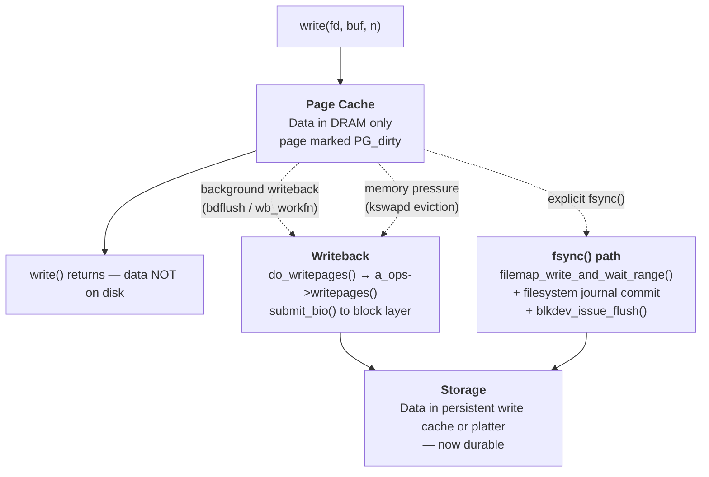
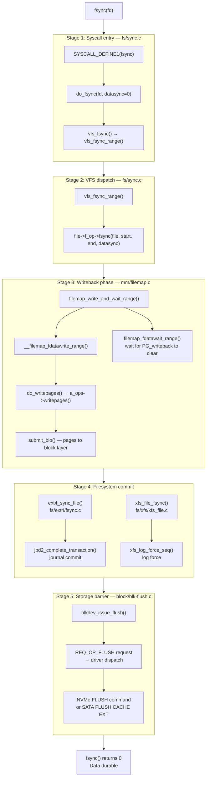
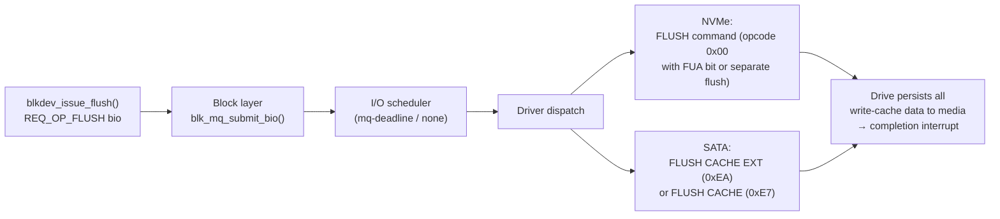

# Life of an fsync

> Tracing an fsync() syscall from userspace through the VFS, filesystem journal, and storage barrier all the way to durable media

## Why fsync matters: the durability gap

When `write()` returns successfully, your data is in the kernel's **page cache** — a region of DRAM. The kernel has *not* written it to persistent storage. This is by design: buffering writes in memory and flushing them asynchronously produces throughput orders of magnitude better than synchronous writes to spinning disk or even NVMe.



The gap between "write returned" and "data durable" can last tens of seconds. A kernel crash, power cut, or controller reset in that window means data loss. Three properties are needed for a file write to be truly durable:

1. **Data on disk** — the file's actual bytes have been written to persistent storage and will survive a power cycle.
2. **Metadata consistent** — the filesystem's on-disk structures (inode size, block pointers, directory entries) correctly reflect the new state. Without this, a file can become inaccessible even if its blocks are on disk.
3. **Barriers ordered** — a storage write cache can reorder writes. A hardware barrier (FLUSH command) ensures that all preceding writes have been committed to persistent media before the acknowledgment reaches the kernel.

`fsync()` delivers all three.

### fsync vs fdatasync vs sync vs syncfs

| Call | Data flushed | Metadata flushed | Scope |
|---|---|---|---|
| `fsync(fd)` | Yes | Yes | Single file |
| `fdatasync(fd)` | Yes | Only if needed for data retrieval | Single file |
| `sync()` | Yes | Yes | All mounted filesystems |
| `syncfs(fd)` | Yes | Yes | Filesystem containing `fd` |
| `msync(addr, len, MS_SYNC)` | Yes (mapped pages) | Yes | Memory-mapped range |

`fdatasync` skips metadata updates that are not required to correctly read back the data — for example, `mtime` and `atime` changes. It *does* flush metadata when the file has grown (because the new size is needed to find the new data blocks), or when block allocation has changed. The `fdatasync` optimisation is most useful for databases writing to pre-allocated files: they can skip the journal commit for every metadata update, reducing latency by 30–50% on some workloads.

`sync()` and `syncfs()` are coarser tools. `syncfs` scopes the flush to one filesystem, which is useful in containers or when only one volume needs a checkpoint. Neither blocks until the hardware write cache is flushed by default — the kernel queues the I/O and returns. Applications needing hard guarantees must use `fsync`.

## Full path overview



---

## Stage 1: The fsync() syscall

The syscall entry lives in `fs/sync.c`:

```c
/* fs/sync.c */
SYSCALL_DEFINE1(fsync, unsigned int, fd)
{
    return do_fsync(fd, 0);  /* datasync = 0 */
}

SYSCALL_DEFINE1(fdatasync, unsigned int, fd)
{
    return do_fsync(fd, 1);  /* datasync = 1 */
}

static int do_fsync(unsigned int fd, int datasync)
{
    struct fd f = fdget(fd);
    int ret = -EBADF;

    if (f.file) {
        ret = vfs_fsync(f.file, datasync);
        fdput(f);
        inc_syscw(current);
    }
    return ret;
}
```

`fdget()` looks up the file descriptor in the current process's file descriptor table (`current->files`), incrementing a reference count. The `fdput()` on the way out releases that reference. The `datasync` flag is passed all the way down to the filesystem's `fsync` method and controls whether metadata needs to be flushed.

`inc_syscw()` increments the process's write syscall counter — visible in `/proc/[pid]/io` as `syscw`.

### vfs_fsync and vfs_fsync_range

```c
/* fs/sync.c */
int vfs_fsync(struct file *file, int datasync)
{
    return vfs_fsync_range(file, 0, LLONG_MAX, datasync);
}

int vfs_fsync_range(struct file *file, loff_t start, loff_t end, int datasync)
{
    struct inode *inode = file->f_mapping->host;

    if (!file->f_op->fsync)
        return -EINVAL;

    /*
     * We must make sure that any dirty folio in the range is
     * written back before the filesystem-level sync, otherwise
     * the filesystem journal could commit with stale data.
     */
    return file->f_op->fsync(file, start, end, datasync);
}
```

`vfs_fsync_range()` is the canonical entry point. The range parameters (`start`, `end`) allow filesystem-level partial syncs used by `msync()` and by some direct I/O paths. For a plain `fsync()` call the full file range `[0, LLONG_MAX]` is passed.

Notice that `vfs_fsync_range` simply checks that the `fsync` method exists and calls it. The two phases — writeback and journal commit — are both handled inside the filesystem's `fsync` implementation, not at the VFS layer. This gives each filesystem complete control over ordering.

---

## Stage 2: VFS dispatch — every filesystem implements fsync

Every filesystem that supports durability registers an `fsync` method in its `file_operations` struct:

```c
/* include/linux/fs.h */
struct file_operations {
    /* ... */
    int (*fsync) (struct file *, loff_t, loff_t, int datasync);
    /* ... */
};
```

Examples from the kernel source:

```c
/* fs/ext4/file.c */
const struct file_operations ext4_file_operations = {
    /* ... */
    .fsync          = ext4_sync_file,
    /* ... */
};

/* fs/xfs/xfs_file.c */
const struct file_operations xfs_file_operations = {
    /* ... */
    .fsync          = xfs_file_fsync,
    /* ... */
};

/* fs/btrfs/file.c */
const struct file_operations btrfs_file_operations = {
    /* ... */
    .fsync          = btrfs_sync_file,
    /* ... */
};
```

Filesystems that do not provide durability guarantees (e.g., `tmpfs`) set `.fsync = noop_fsync`, which returns immediately. Network filesystems like NFS translate the call to an `NFS_COMMIT` RPC.

The two phases inside every `fsync` implementation are:

1. **Writeback phase**: flush dirty pages for this inode to the block layer and wait for I/O completion. This ensures the data blocks are written before the journal commits a transaction that references them.
2. **Metadata commit phase**: commit the filesystem journal (or equivalent log structure) so that metadata — inode size, block pointers, timestamps — is atomically updated on disk.

---

## Stage 3: Writeback phase

Most filesystems delegate the writeback phase to `filemap_write_and_wait_range()`, a VFS helper in `mm/filemap.c`:

```c
/* mm/filemap.c */
int filemap_write_and_wait_range(struct address_space *mapping,
                                  loff_t lstart, loff_t lend)
{
    int err = 0, err2;

    atomic_long_inc(&mapping->writeback_index);

    if (mapping_needs_writeback(mapping)) {
        err = __filemap_fdatawrite_range(mapping, lstart, lend,
                                          WB_SYNC_ALL);
        /*
         * Even if the writeback errored (err != 0), we still
         * want to wait for in-flight I/O to complete so that
         * we don't report success for data that is still in flight.
         */
        err2 = filemap_fdatawait_range(mapping, lstart, lend);
        if (!err)
            err = err2;
    } else {
        err = filemap_check_errors(mapping);
    }
    return err;
}
```

### __filemap_fdatawrite_range: submitting dirty pages

```c
/* mm/filemap.c */
int __filemap_fdatawrite_range(struct address_space *mapping,
                                loff_t start, loff_t end, int sync_mode)
{
    struct writeback_control wbc = {
        .sync_mode      = sync_mode,      /* WB_SYNC_ALL */
        .nr_to_write    = LONG_MAX,       /* write everything */
        .range_start    = start,
        .range_end      = end,
    };

    if (!mapping_can_writeback(mapping))
        return 0;

    return do_writepages(mapping, &wbc);
}
```

`do_writepages()` calls the filesystem's `a_ops->writepages()`:

```c
/* mm/page-writeback.c */
int do_writepages(struct address_space *mapping, struct writeback_control *wbc)
{
    int ret;
    struct bdi_writeback *wb;

    if (wbc->nr_to_write <= 0)
        return 0;
    wb = inode_to_wb_and_lock_list(mapping->host);
    ret = mapping->a_ops->writepages(mapping, wbc);
    wb_dec_stat(wb, WB_WRITEBACK);
    spin_unlock(&wb->list_lock);
    return ret;
}
```

The `writepages` callback walks the inode's dirty page tree and submits `struct bio` requests to the block layer. For ext4 in ordered data mode this means the actual file data is written at this point, before the journal commit in Stage 4.

### filemap_fdatawait_range: waiting for I/O completion

After submitting the writes, `filemap_fdatawait_range()` blocks until every page in the range has cleared its `PG_writeback` flag:

```c
/* mm/filemap.c */
int filemap_fdatawait_range(struct address_space *mapping,
                             loff_t start_byte, loff_t end_byte)
{
    return wait_on_page_writeback_range(mapping, start_byte >> PAGE_SHIFT,
                                         end_byte >> PAGE_SHIFT);
}
```

Each page has a `PG_writeback` bit set when block-layer I/O is in flight. When the storage controller signals completion, the block layer calls `end_page_writeback()`, which clears `PG_writeback` and wakes any waiters. `filemap_fdatawait_range()` blocks on those waiters using `wait_on_page_bit()`.

This is fundamentally different from background writeback:

| | Background writeback | fsync writeback |
|---|---|---|
| Trigger | Dirty ratio threshold, periodic timer | Explicit `fsync()` call |
| Sync mode | `WB_SYNC_NONE` — skip locked pages | `WB_SYNC_ALL` — wait for locked pages |
| Wait for completion | No | Yes (`filemap_fdatawait_range`) |
| Error handling | Stored in `mapping->wb_err` | Returned immediately to caller |
| Range | Entire inode (or all inodes) | Specified range only |

The `WB_SYNC_ALL` vs `WB_SYNC_NONE` distinction is critical: with `WB_SYNC_NONE`, the writeback code skips pages that are already locked (e.g., under I/O). With `WB_SYNC_ALL` it waits for the lock, ensuring that every dirty page in the range is submitted before returning.

---

## Stage 4: Filesystem-specific fsync — ext4

ext4's fsync implementation lives in `fs/ext4/fsync.c`:

```c
/* fs/ext4/fsync.c */
int ext4_sync_file(struct file *file, loff_t start, loff_t end, int datasync)
{
    int ret = 0, err;
    bool needs_barrier = false;
    struct inode *inode = file->f_mapping->host;
    struct ext4_sb_info *sbi = EXT4_SB(inode->i_sb);

    if (unlikely(ext4_forced_shutdown(sbi)))
        return -EIO;

    ASSERT(ext4_journal_current_handle() == NULL);

    trace_ext4_sync_file_enter(file, datasync);

    if (inode->i_sb->s_flags & SB_RDONLY) {
        /* Make sure that we read updated s_mount_flags value */
        smp_rmb();
        if (ext4_test_mount_flag(inode->i_sb, EXT4_MF_FS_ABORTED))
            ret = -EROFS;
        goto out;
    }

    if (!sbi->s_journal) {
        /* No journal — flush data and metadata directly */
        ret = __generic_file_fsync(file, start, end, datasync);
        if (!ret)
            err = ext4_sync_parent(inode);
        if (test_opt(inode->i_sb, BARRIER))
            goto issue_flush;
        goto out;
    }

    ret = file_write_and_wait_range(file, start, end);  /* writeback phase */
    if (ret)
        goto out;

    /*
     * Fast commit path — only available since 5.10.
     * Commits only the changes to this inode rather than the full journal.
     */
    if (ext4_should_journal_data(inode) ||
        ext4_test_inode_state(inode, EXT4_STATE_NEW))
        goto full_commit;

    err = ext4_fc_commit(sbi->s_journal, EXT4_I(inode)->i_sync_tid);
    if (err == -EOPNOTSUPP)
        goto full_commit;
    if (err)
        ret = err;
    goto out;

full_commit:
    /*
     * Full jbd2 commit — writes journal blocks and issues FLUSH.
     */
    if (datasync)
        needs_barrier = ext4_should_order_data(inode) &&
                        ext4_inode_datasync_dirty(inode);
    err = jbd2_complete_transaction(EXT4_JOURNAL(inode),
                                     EXT4_I(inode)->i_sync_tid);
    if (!ret)
        ret = err;

issue_flush:
    if (needs_barrier) {
        err = blkdev_issue_flush(inode->i_sb->s_bdev);
        if (!ret)
            ret = err;
    }
out:
    trace_ext4_sync_file_exit(inode, ret);
    return ret;
}
```

### Journal commit: jbd2_complete_transaction

ext4's journaling layer is **jbd2** (Journaling Block Device 2). When ext4 is mounted in `ordered` or `writeback` journal mode, the file's data is written before the journal commits:

```c
/* fs/jbd2/journal.c */
int jbd2_complete_transaction(journal_t *journal, tid_t tid)
{
    int need_to_wait = 1;

    read_lock(&journal->j_state_lock);
    if (journal->j_running_transaction &&
        journal->j_running_transaction->t_tid == tid) {
        /*
         * Transaction is still open — request a commit and
         * wait for it to complete.
         */
        read_unlock(&journal->j_state_lock);
        jbd2_log_start_commit(journal, tid);
        jbd2_log_wait_commit(journal, tid);
        return 0;
    }
    /* Transaction may already be committed or in flight */
    if (!tid_geq(journal->j_commit_sequence, tid))
        need_to_wait = 1;
    read_unlock(&journal->j_state_lock);

    if (need_to_wait)
        jbd2_log_wait_commit(journal, tid);
    return 0;
}
```

`jbd2_log_start_commit()` wakes the kjournald2 kernel thread, which writes the journal's transaction blocks (descriptor block, data/metadata blocks, and commit block) to the journal area on disk. Only after the commit block is durably written does jbd2 consider the transaction committed.

### ext4 journal modes

ext4 supports three journal modes, selected at mount time with `data=`:

| Mode | What is journalled | fsync behaviour |
|---|---|---|
| `journal` | Data + metadata | Safest; data written to journal then to file; slowest |
| `ordered` (default) | Metadata only | Data written to file *before* journal commit; safe |
| `writeback` | Metadata only | Data and metadata written independently; may expose stale data on crash |

In `ordered` mode, `ext4_sync_file` calls `file_write_and_wait_range()` to flush data to the data blocks *before* committing the journal. This ensures that when the journal commit is durable, the data it refers to is also durable.

### The fast commit path (ext4 since 5.10)

```c
/* fs/ext4/fast_commit.c */
int ext4_fc_commit(journal_t *journal, tid_t commit_tid)
{
    /*
     * Fast commit writes only the delta for this inode:
     * inode state + extent tree changes, not the full transaction.
     * This reduces journal I/O from ~256KB to a few hundred bytes
     * for single-file workloads.
     */
    struct super_block *sb = journal->j_private;
    struct ext4_sb_info *sbi = EXT4_SB(sb);
    int nblks = 0, ret, bsize = journal->j_blocksize;
    /* ... */
}
```

Fast commit (introduced in Linux 5.10) records only the specific inode's changes rather than committing the full running transaction. For workloads with many small files being fsynced concurrently (e.g., a mail server), this dramatically reduces journal write amplification. The fast commit path is bypassed for inodes with `data=journal` mode, or when the inode has complex extent tree changes that exceed the fast commit budget.

---

## Stage 5: XFS fsync

XFS takes a different approach. Rather than an extent-based journal that stores both metadata and data, XFS uses a **write-ahead log (WAL)** for metadata only and relies on the page cache writeback ordering for data.

```c
/* fs/xfs/xfs_file.c */
int xfs_file_fsync(struct file *file, loff_t start, loff_t end, int datasync)
{
    struct xfs_inode  *ip = XFS_I(file->f_mapping->host);
    struct xfs_mount  *mp = ip->i_mount;
    int                error = 0;
    int                log_flushed = 0;
    xfs_lsn_t          lsn = 0;

    trace_xfs_file_fsync(ip);

    error = file_write_and_wait_range(file, start, end);
    if (error)
        return error;

    xfs_iflags_clear(ip, XFS_ISYNC);

    if (xfs_is_shutdown(mp))
        return -EIO;

    xfs_ilock(ip, XFS_ILOCK_SHARED);

    /*
     * If we are only doing a datasync and the inode is not dirty,
     * we can skip the log force entirely.
     */
    if (datasync && !(ip->i_diflags & XFS_DIFLAG_SYNC)) {
        if (!xfs_ipincount(ip) || !(ip->i_itemp) ||
            !(ip->i_itemp->ili_fsync_fields & ~XFS_ILOG_TIMESTAMP)) {
            xfs_iunlock(ip, XFS_ILOCK_SHARED);
            goto out;
        }
    }

    /*
     * Grab the LSN of the last log item committed to the in-memory log.
     * We need to force the log to this LSN.
     */
    if (ip->i_itemp)
        lsn = ip->i_itemp->ili_last_lsn;

    xfs_iunlock(ip, XFS_ILOCK_SHARED);

    if (lsn) {
        error = xfs_log_force_seq(mp, lsn, XFS_LOG_SYNC, &log_flushed);
    } else {
        error = xfs_log_force(mp, XFS_LOG_SYNC);
        log_flushed = 1;
    }

out:
    /*
     * If the log was not flushed (already committed and written),
     * we still need to issue a cache flush to ensure ordering.
     */
    if (!log_flushed && !XFS_SB_VERSION_HASLOGV2(&mp->m_sb))
        blkdev_issue_flush(mp->m_ddev_targp->bt_bdev);

    return error;
}
```

### xfs_log_force_seq

```c
/* fs/xfs/xfs_log.c */
int xfs_log_force_seq(struct xfs_mount *mp, xfs_csn_t seq,
                       uint flags, int *log_flushed)
{
    struct xlog     *log = mp->m_log;
    struct xlog_in_core *iclog;
    int              ret;

    XFS_STATS_INC(mp, xs_log_force);
    trace_xfs_log_force(mp, seq, _RET_IP_);

    xlog_cil_force_seq(log, seq);  /* flush the Committed Item List */

    spin_lock(&log->l_icloglock);
    /* Find the in-core log buffer containing this sequence */
    ret = xlog_force_iclog(iclog);
    /* ... wait for completion ... */
    spin_unlock(&log->l_icloglock);

    return ret;
}
```

The Committed Item List (CIL) is XFS's delayed logging mechanism: metadata changes are accumulated in memory and only written to the log when the CIL is flushed. `xlog_cil_force_seq()` ensures that any in-memory CIL entries up to the requested sequence are written to the on-disk log before `xfs_log_force_seq` returns.

### XFS vs ext4 design comparison

| Property | ext4 (ordered mode) | XFS |
|---|---|---|
| Data journaling | No (data written directly) | No |
| Metadata journaling | jbd2 transaction | XFS write-ahead log |
| Journal structure | Circular log, full-transaction commits | Circular log, CIL for delayed logging |
| Fast path | ext4 fast commit (5.10+) | CIL aggregation always |
| fsync data flush | `filemap_write_and_wait_range` | `file_write_and_wait_range` |
| Metadata force | `jbd2_complete_transaction` | `xfs_log_force_seq` |
| FLUSH after log | Issued by jbd2 commit | Issued by `xfs_file_fsync` if needed |

Both XFS and ext4 end up issuing a hardware FLUSH command to the storage device. The difference is in how they coordinate the ordering between data and metadata writes.

---

## Stage 6: The storage barrier

After the filesystem has written its journal commit block, it must ensure the storage device's write cache has been flushed to persistent media. Even if the kernel's block layer has completed the I/O, many drives have volatile write caches: data acknowledged by the drive may still be in the drive's DRAM, not on the magnetic platter or NAND cells.

### blkdev_issue_flush

```c
/* block/blk-flush.c */
int blkdev_issue_flush(struct block_device *bdev)
{
    struct request_queue *q = bdev_get_queue(bdev);
    struct bio bio;

    if (!q)
        return -ENXIO;

    bio_init(&bio, bdev, NULL, 0, REQ_OP_WRITE | REQ_PREFLUSH);
    return submit_bio_wait(&bio);
}
```

`REQ_PREFLUSH` instructs the block layer to issue a FLUSH command to the drive before any pending writes, ensuring all prior writes in the queue are durable. `submit_bio_wait()` blocks the calling thread until the bio completes.

### The FLUSH command path



The NVMe FLUSH command (NVM Command Set opcode 0x00 with the flush action) and the SATA `FLUSH CACHE EXT` command (opcode 0xEA) both instruct the drive controller to commit its volatile write cache to non-volatile media. The drive may not return the completion until this is done.

### Battery-backed write caches and power-loss protection

Drives with **Power-Loss Protection (PLP)** — capacitors or batteries that can flush the write cache on sudden power loss — can report themselves as not requiring explicit FLUSHes. Linux reads this capability via:

- NVMe: `Volatile Write Cache` field in the Identify Controller response (`vwc` bit). If `vwc = 0`, the drive has no volatile cache, and FLUSH is unnecessary.
- SATA: `Write cache` bit in IDENTIFY DEVICE word 85.

Filesystems and the block layer check these capabilities at mount time. On enterprise NVMe drives with PLP, `fsync` can return considerably faster because the FLUSH step is elided.

### FUA: Force Unit Access

An alternative to a separate FLUSH command is FUA (Force Unit Access). A write with the FUA bit set instructs the drive to bypass its write cache and write directly to persistent media before acknowledging:

```c
/* Setting FUA on a bio */
bio->bi_opf |= REQ_FUA;
```

FUA is attractive for the journal commit block: instead of writing the commit block and then issuing a separate FLUSH, the commit block can be written with FUA. This avoids one round-trip to the drive. jbd2 uses FUA for journal commits when `REQ_FUA` is supported:

```c
/* fs/jbd2/commit.c */
flags = REQ_SYNC;
if (journal->j_flags & JBD2_BARRIER)
    flags |= REQ_FUA;
```

The trade-off: FUA writes bypass the drive's write cache, so they get none of the reordering benefits the write cache provides. For sequential journal writes, this is usually fine; for random data writes, it would be prohibitively slow.

---

## Stage 7: fdatasync differences

`fdatasync()` is a lighter-weight alternative to `fsync()`. The goal: flush data to disk, but skip metadata updates that are not needed to retrieve the data correctly.

```c
/* fs/sync.c */
SYSCALL_DEFINE1(fdatasync, unsigned int, fd)
{
    return do_fsync(fd, 1);   /* datasync = 1 */
}

static int do_fsync(unsigned int fd, int datasync)
{
    struct fd f = fdget(fd);
    int ret = -EBADF;

    if (f.file) {
        ret = vfs_fsync(f.file, datasync);
        fdput(f);
    }
    return ret;
}
```

The `datasync` flag is threaded through `vfs_fsync_range()` all the way to the filesystem's `fsync` handler:

```c
/* fs/ext4/fsync.c — checking datasync */
if (datasync)
    needs_barrier = ext4_should_order_data(inode) &&
                    ext4_inode_datasync_dirty(inode);
```

### The needs_datasync check

The filesystem consults `inode->i_datasync_dirty` or equivalent state to decide whether metadata must be synced even for a `datasync` call. This is set when:

- **File size increased** — the new `i_size` is required to access the new data blocks.
- **Block allocation changed** — new extents were added; without updated block pointers, the data is inaccessible.
- **Inline data changed** — for very small files where data is stored in the inode itself.

Metadata that `fdatasync` can skip:

- `mtime` and `atime` — timestamps do not affect data retrieval.
- `ctime` — metadata change time; not needed for reads.
- Permissions/owner changes — not relevant to reading the file.

### When fdatasync is NOT sufficient

There is a common correctness trap: `fdatasync` on a newly created file is not sufficient to make the file durable. Consider:

```c
int fd = open("newfile", O_CREAT | O_WRONLY, 0644);
write(fd, data, len);
fdatasync(fd);   /* flushes newfile's data */
/* CRASH HERE — newfile may not exist after recovery */
```

After the crash, the file's data may be durable, but the directory entry linking `newfile` into its parent directory may not have been committed. The file is orphaned — its inode exists on disk but is unreachable.

To guarantee a new file survives a crash, you must also fsync the parent directory:

```c
int fd = open("newfile", O_CREAT | O_WRONLY, 0644);
write(fd, data, len);
fsync(fd);                  /* or fdatasync — file data */

int dfd = open(parent_dir, O_RDONLY | O_DIRECTORY);
fsync(dfd);                 /* directory entry durability */
close(dfd);
close(fd);
```

This two-step fsync pattern is required by POSIX and is used by databases like PostgreSQL and SQLite when creating WAL files or database files for the first time.

---

## Stage 8: O_SYNC and O_DSYNC

`O_SYNC` and `O_DSYNC` make every `write()` call synchronous — effectively calling `fsync` or `fdatasync` automatically after each write, without the application needing to call them explicitly.

```c
/* include/uapi/asm-generic/fcntl.h */
#define O_DSYNC   00010000   /* synchronise data (like fdatasync) */
#define O_SYNC    04010000   /* synchronise data + metadata (like fsync) */
```

These flags are recorded on the `struct file` and translated into `kiocb` flags at write time:

```c
/* fs/read_write.c — init_sync_kiocb */
static inline void init_sync_kiocb(struct kiocb *kiocb, struct file *filp)
{
    *kiocb = (struct kiocb) {
        .ki_filp = filp,
        .ki_flags = iocb_flags(filp),  /* copies O_SYNC, O_DSYNC, O_DIRECT */
        .ki_ioprio = get_current_ioprio(),
    };
}

/* fs/fcntl.c */
int iocb_flags(struct file *file)
{
    int res = 0;
    if (file->f_flags & O_APPEND)
        res |= IOCB_APPEND;
    if (iocb_is_dsync(file))
        res |= IOCB_DSYNC;
    if (file->f_flags & __O_SYNC)
        res |= IOCB_SYNC;
    /* ... */
    return res;
}
```

### generic_write_sync

After `generic_perform_write()` completes, `generic_file_write_iter()` calls `generic_write_sync()` if the `kiocb` has `IOCB_SYNC` or `IOCB_DSYNC`:

```c
/* include/linux/fs.h */
static inline int generic_write_sync(struct kiocb *iocb, ssize_t count)
{
    if (iocb->ki_flags & (IOCB_DSYNC | IOCB_SYNC)) {
        struct file *file = iocb->ki_filp;
        loff_t sync_from = iocb->ki_pos - count;
        int ret = (iocb->ki_flags & IOCB_SYNC) ?
                  vfs_fsync_range(file, sync_from, iocb->ki_pos - 1, 0) :
                  vfs_fsync_range(file, sync_from, iocb->ki_pos - 1, 1);
        if (ret)
            return ret;
    }
    return 0;
}
```

`IOCB_SYNC` maps to `datasync=0` (full fsync), `IOCB_DSYNC` maps to `datasync=1` (fdatasync). The range passed is exactly the bytes written in this call, which allows iomap-based filesystems to do range-limited journal commits.

### Performance cost of O_SYNC

Opening a file `O_SYNC` incurs a full `fsync()` round-trip per write call. On a typical NVMe drive with a write latency of 20–100 µs and journal commit overhead, this means:

| Mode | Effective write throughput (small random writes) |
|---|---|
| Buffered writes, no fsync | ~500,000 IOPS |
| `fsync()` once at end | ~500,000 IOPS (same cost amortised) |
| `O_DSYNC` per write | ~50,000–100,000 IOPS |
| `O_SYNC` per write | ~20,000–50,000 IOPS |
| `O_SYNC` on HDD | ~100–200 IOPS (one rotation per write) |

The performance difference between buffered writes and `O_SYNC` is 10x–100x for small sequential writes and can exceed 1000x for small random writes on spinning disk. This is why databases batch their writes into WAL blocks and call `fsync` once per transaction commit rather than once per write.

---

## Common mistakes and patterns

### Mistake 1: fsync the file but not the directory

As discussed in Stage 7, creating a new file and fsyncing only the file is insufficient:

```c
/* WRONG — new file may vanish after crash */
int fd = open("/data/important.db-new", O_CREAT | O_WRONLY, 0644);
write(fd, header, sizeof(header));
fsync(fd);
close(fd);
rename("/data/important.db-new", "/data/important.db");
/* crash here — rename may be lost, new file orphaned */

/* CORRECT */
int fd = open("/data/important.db-new", O_CREAT | O_WRONLY, 0644);
write(fd, header, sizeof(header));
fsync(fd);
close(fd);
rename("/data/important.db-new", "/data/important.db");

int dfd = open("/data", O_RDONLY | O_DIRECTORY);
fsync(dfd);   /* makes the rename durable */
close(dfd);
```

The rename itself modifies the directory's data, so fsyncing the directory after the rename ensures the new name-to-inode mapping is durable.

### SQLite: WAL vs journal mode

SQLite demonstrates two approaches to durable writes:

**Journal mode** (default before SQLite 3.7.0):
1. Write original page content to `-journal` rollback file
2. `fsync` the rollback journal
3. Modify the database file pages
4. `fsync` the database file
5. Delete the rollback journal
6. `fsync` the directory

This requires 3 fsync calls per transaction commit.

**WAL mode** (Write-Ahead Log, preferred for concurrent access):
1. Append changed pages to the WAL file
2. `fsync` the WAL file
3. Update the WAL index (shared memory — no fsync needed)

Only 1 fsync per transaction commit in WAL mode. Periodically, WAL frames are checkpointed back into the database file (another fsync). WAL mode achieves 3–5x better write throughput than journal mode while maintaining the same durability guarantees.

SQLite's `PRAGMA synchronous` maps directly to Linux fsync calls:

| SQLite pragma | fsync behaviour |
|---|---|
| `FULL` | fsync after journal write AND after database write |
| `NORMAL` | fsync only in WAL mode; risky in journal mode |
| `OFF` | No fsync — data loss on OS crash |

### PostgreSQL synchronous_commit levels

PostgreSQL exposes fsync granularity through `synchronous_commit`:

```
synchronous_commit = on         # wait for WAL flush to disk (fsync)
synchronous_commit = remote_write # wait for WAL write to replica OS buffer
synchronous_commit = local      # wait for local WAL fsync only
synchronous_commit = off        # return before WAL flush (up to 0.6s data loss)
```

Internally, PostgreSQL's WAL writer calls `pg_fsync()` which wraps `fsync()` or `fdatasync()` depending on platform capabilities:

```c
/* src/backend/storage/file/fd.c (PostgreSQL) */
int pg_fsync(int fd)
{
#ifdef HAVE_FSYNC_WRITETHROUGH
    if (sync_method == SYNC_METHOD_FSYNC_WRITETHROUGH)
        return pg_fsync_writethrough(fd);
    else
#endif
        return pg_fsync_no_writethrough(fd);
}
```

On macOS, PostgreSQL uses `F_FULLFSYNC` (via `fcntl`) because macOS's `fsync()` does not guarantee that the drive's write cache is flushed. Linux's `fsync()` does issue the hardware FLUSH command and provides stronger guarantees.

### The WAL then data file sequence

Databases that use a WAL pattern always flush in this order:

1. **fsync the WAL** — ensures the redo log is durable before touching the data file.
2. **Write data file pages** — apply WAL changes to the data file.
3. **fsync the data file** — make the data file changes durable.

The ordering is critical for crash recovery: if the system crashes between steps 1 and 3, recovery replays the WAL to reconstruct the committed state. If the data file were fsynced *before* the WAL, a crash could leave the data file partially updated with no way to roll back or roll forward.

```c
/* Pseudocode for correct WAL commit sequence */
write_wal_record(transaction);
fsync(wal_fd);           /* Step 1: WAL durable */

apply_to_datafile(transaction);
fsync(data_fd);          /* Step 3: data file durable */

/* Now safe to reclaim WAL space */
```

PostgreSQL, MySQL InnoDB (`innodb_flush_log_at_trx_commit = 1`), SQLite WAL mode, and LMDB all follow this pattern.

---

## Try It Yourself

### 1. Observe fsync calls with strace

```bash
# Trace fsync/fdatasync calls for a process
strace -e trace=fsync,fdatasync,sync,syncfs -p $(pidof postgres)

# Or run a command under strace
strace -e trace=fsync,fdatasync -T sqlite3 /tmp/test.db \
    "PRAGMA journal_mode=WAL; BEGIN; INSERT INTO t VALUES (1); COMMIT;"
```

The `-T` flag shows the time spent in each syscall. You will see `fsync()` calls taking 1–20ms on typical NVMe and 5–30ms on SATA SSD.

### 2. Watch the FLUSH command reach the block device with blktrace

```bash
# Record block I/O events on /dev/nvme0n1 for 5 seconds
blktrace -d /dev/nvme0n1 -o /tmp/trace -w 5

# Parse and show flush events
blkparse /tmp/trace.blktrace.* | grep -E ' F '
```

Output looks like:
```
  8,0    1      241     0.123456789  1234  I   F WS 0 + 0 [fsync]
  8,0    1      242     0.123467891  1234  D   F WS 0 + 0 [fsync]
  8,0    1      243     0.125123456     0  C   F WS 0 ++ 0 [0]
```

Column 6 `F` means FLUSH. The time between `D` (dispatched to driver) and `C` (completed) is the hardware flush latency.

### 3. Measure fsync latency distribution with bpftrace

```bash
# Histogram of fsync latency in microseconds
bpftrace -e '
tracepoint:syscalls:sys_enter_fsync { @start[tid] = nsecs; }
tracepoint:syscalls:sys_exit_fsync  /@start[tid]/
{
    @latency_us = hist((nsecs - @start[tid]) / 1000);
    delete(@start[tid]);
}
'
```

Sample output:
```
@latency_us:
[1, 2)                 3 |                                      |
[2, 4)                12 |@                                     |
[4, 8)               187 |@@@@@@@@@@@@@@@@@@                    |
[8, 16)              423 |@@@@@@@@@@@@@@@@@@@@@@@@@@@@@@@@@@@@@@|
[16, 32)             201 |@@@@@@@@@@@@@@@@@@@                   |
[32, 64)              44 |@@@@                                  |
[64, 128)              8 |                                      |
[128, 256)             2 |                                      |
```

### 4. Identify which files are being fsynced

```bash
# Show which file each fsync call targets
bpftrace -e '
tracepoint:syscalls:sys_enter_fsync {
    printf("pid=%d comm=%s fd=%d\n", pid, comm, args->fd);
}
'
```

### 5. Check if your NVMe drive has a volatile write cache

```bash
# Check NVMe volatile write cache feature
nvme id-ctrl /dev/nvme0 | grep -i "vwc\|write cache"

# Check SATA write cache status
hdparm -I /dev/sda | grep -i "write cache"

# See if kernel is issuing FUA or explicit FLUSHes
cat /sys/block/nvme0n1/queue/write_cache
# "write back" = volatile cache present, FLUSHes needed
# "write through" = no volatile cache
```

### 6. Benchmark fsync throughput

```bash
# fio benchmark: measure fsync IOPS
fio --name=fsync-test \
    --filename=/mnt/data/test \
    --ioengine=sync \
    --rw=randwrite \
    --bs=4k \
    --size=1G \
    --numjobs=1 \
    --fsync=1 \       # fsync after every write
    --runtime=30s \
    --time_based \
    --output-format=normal

# Compare with no fsync
fio --name=buffered-test \
    --filename=/mnt/data/test2 \
    --ioengine=sync \
    --rw=randwrite \
    --bs=4k \
    --size=1G \
    --numjobs=1 \
    --runtime=30s \
    --time_based
```

---

## Key source files

| File | Purpose |
|---|---|
| `fs/sync.c` | `fsync`, `fdatasync`, `sync`, `syncfs` syscall entry points; `do_fsync`, `vfs_fsync_range` |
| `mm/filemap.c` | `filemap_write_and_wait_range`, `__filemap_fdatawrite_range`, `filemap_fdatawait_range` |
| `mm/page-writeback.c` | `do_writepages`, `balance_dirty_pages_ratelimited`, writeback control |
| `fs/ext4/fsync.c` | `ext4_sync_file` — ext4 fsync implementation |
| `fs/ext4/fast_commit.c` | `ext4_fc_commit` — ext4 fast commit path (5.10+) |
| `fs/jbd2/journal.c` | `jbd2_complete_transaction`, `jbd2_log_start_commit`, `jbd2_log_wait_commit` |
| `fs/jbd2/commit.c` | jbd2 commit thread — writes journal blocks with FUA |
| `fs/xfs/xfs_file.c` | `xfs_file_fsync` — XFS fsync implementation |
| `fs/xfs/xfs_log.c` | `xfs_log_force_seq` — XFS log force |
| `fs/xfs/xfs_log_cil.c` | `xlog_cil_force_seq` — CIL flush |
| `block/blk-flush.c` | `blkdev_issue_flush`, flush queue management |
| `include/linux/fs.h` | `struct file_operations`, `struct kiocb`, `struct address_space_operations` |
| `include/linux/blk_types.h` | `REQ_PREFLUSH`, `REQ_FUA` request flags |

---

## Further reading

### Kernel documentation

- `Documentation/filesystems/ext4/journal.rst` — ext4 journaling internals
- `Documentation/filesystems/xfs/xfs-self-describing-metadata.rst` — XFS log design
- `Documentation/block/writeback_cache_control.rst` — flush and FUA in the block layer
- `Documentation/admin-guide/ext4.rst` — ext4 mount options including `data=` journal modes

### Papers and talks

- **"Optimistic Crash Consistency"** (SOSP 2013, Chidambaram et al.) — shows that most fsync-induced overhead comes from unnecessarily strict ordering; proposes optimistic barriers
- **"All File Systems Are Not Created Equal"** (OSDI 2014, Pillai et al.) — systematic study of how applications use fsync and where they get it wrong; basis for the ALICE tool
- **"Protocol-Aware Recovery for Consensus-Based Storage"** (FAST 2018) — how distributed systems interact with fsync semantics in Raft and Paxos implementations
- **ext4 fast commit design document** — https://www.kernel.org/doc/html/latest/filesystems/ext4/fast_commit.html
- **PostgreSQL WAL reliability** — https://www.postgresql.org/docs/current/wal-reliability.html

### Tools

- `blktrace(8)` / `blkparse(8)` — block layer I/O tracing
- `bpftrace(8)` — dynamic tracing of kernel functions
- `fio(1)` — flexible I/O tester; supports `--fsync=N` and `--fdatasync=N`
- `ioping(1)` — I/O latency measurement including fsync latency
- `filebench(1)` — workload-level filesystem benchmarking
- `ALICE` (Application-Level Intelligent Crash Explorer) — static analysis tool that checks applications for fsync correctness
