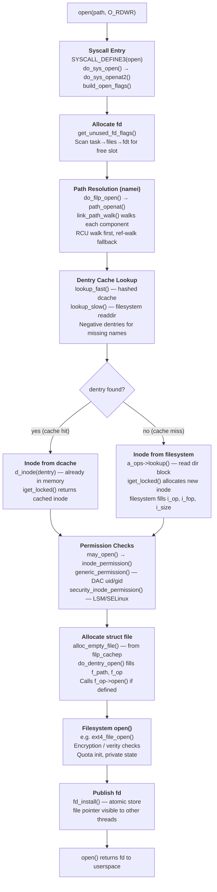

# Life of an open

> Tracing an open() syscall from userspace through path resolution, the dentry cache, inode lookup, permission checks, and the allocation of a struct file

## What happens when you open a file?

Unlike `read()` or `write()`, `open()` moves **no data**. Its entire job is to build kernel data structures — a `struct file`, backed by a `struct inode`, addressable through an integer file descriptor — that future I/O operations can use. The fd you get back is just an index; the real work is establishing the chain of pointers behind it.



The three layers you need to understand upfront:

| Layer | Kernel type | What it represents |
|-------|------------|-------------------|
| **fd** | `int` | Per-process index into `task->files->fdt` |
| **struct file** | `fs/file_table.c` | One open-file instance: flags, position, refcount |
| **struct inode** | `fs/inode.c` | The file itself: size, permissions, data pointers |

Multiple fds (even in different processes) can point to the same `struct file` (after `dup()` or `fork()`). Multiple `struct file` objects can point to the same `struct inode` (two separate `open()` calls on the same path). The separation exists because each open has its own position and flags, but they share the underlying data.

## Stage 1: The open() syscall entry

A user program calls `open()`:

```c
// User space
int fd = open("/etc/hostname", O_RDONLY);

/* fs/open.c */
SYSCALL_DEFINE3(open, const char __user *, filename,
                int, flags, umode_t, mode)
{
    if (force_o_largefile())
        flags |= O_LARGEFILE;
    return do_sys_open(AT_FDCWD, filename, flags, mode);
}
```

`openat()` (the modern form, and the one glibc actually wraps) shares the same implementation:

```c
/* fs/open.c */
SYSCALL_DEFINE4(openat, int, dfd, const char __user *, filename,
                int, flags, umode_t, mode)
{
    if (force_o_largefile())
        flags |= O_LARGEFILE;
    return do_sys_open(dfd, filename, flags, mode);
}
```

Both converge in `do_sys_open()`:

```c
/* fs/open.c */
long do_sys_open(int dfd, const char __user *filename,
                 int flags, umode_t mode)
{
    struct open_how how = build_open_how(flags, mode);
    return do_sys_openat2(dfd, filename, &how);
}
```

### struct open_how and openat2

Linux 5.6 added `openat2()`, a new syscall that accepts a `struct open_how` directly. This allows future flag extensions without running out of bits in the `int flags` argument. The internal path always uses `struct open_how`:

```c
/* include/uapi/linux/openat2.h */
struct open_how {
    __u64 flags;     /* O_* flags */
    __u64 mode;      /* Mode for O_CREAT / O_TMPFILE */
    __u64 resolve;   /* RESOLVE_* flags (new in openat2) */
};
```

The `resolve` field gives fine-grained control over path traversal:

```c
/* include/uapi/linux/openat2.h */
#define RESOLVE_NO_XDEV      0x01  /* Don't cross mount points */
#define RESOLVE_NO_MAGICLINKS 0x02  /* Don't follow magic /proc symlinks */
#define RESOLVE_NO_SYMLINKS   0x04  /* Don't follow any symlinks */
#define RESOLVE_BENEATH       0x08  /* All path components must be under dfd */
#define RESOLVE_IN_ROOT       0x10  /* Treat dfd as the root (like chroot) */
#define RESOLVE_CACHED        0x20  /* Fail if any step would block (5.12+) */
```

### build_open_flags() — translating O_* to struct open_flags

The public `O_*` constants are UAPI values that map to an internal `struct open_flags`:

```c
/* fs/open.c */
static int build_open_flags(const struct open_how *how,
                             struct open_flags *op)
{
    int flags = how->flags;
    int lookup_flags = 0;
    int acc_mode = ACC_MODE(flags);  /* R, W, or RW from O_RDONLY/O_WRONLY/O_RDWR */

    /*
     * O_PATH forces no access mode; the fd is a reference, not
     * a read/write channel.
     */
    if (flags & O_PATH) {
        flags &= O_DIRECTORY | O_NOFOLLOW | O_PATH;
        acc_mode = 0;
    }

    op->open_flag = flags;

    /* Translate O_CREAT / O_EXCL / O_TRUNC into intent bits */
    if (flags & O_CREAT) {
        op->intent |= LOOKUP_CREATE;
        if (flags & O_EXCL) {
            op->intent |= LOOKUP_EXCL;
            /* O_EXCL without O_CREAT is meaningless */
        }
    }

    if (flags & O_DIRECTORY)
        lookup_flags |= LOOKUP_DIRECTORY;
    if (!(flags & O_NOFOLLOW))
        lookup_flags |= LOOKUP_FOLLOW;

    op->lookup_flags = lookup_flags;
    return 0;
}
```

`ACC_MODE()` collapses the three-way read/write encoding into a bitmask the VFS can check against inode permissions.

### do_sys_openat2() — the main entry point

```c
/* fs/open.c (simplified) */
static long do_sys_openat2(int dfd, const char __user *filename,
                            struct open_how *how)
{
    struct open_flags op;
    int fd;
    struct file *f;

    /* Validate and translate flags */
    fd = build_open_flags(how, &op);
    if (fd)
        return fd;   /* validation error */

    /* Reserve a file descriptor number */
    fd = get_unused_fd_flags(how->flags);
    if (fd < 0)
        return fd;

    /* Do the heavy work: path resolution, inode lookup, struct file */
    f = do_filp_open(dfd, filename, &op);
    if (IS_ERR(f)) {
        put_unused_fd(fd);
        return PTR_ERR(f);
    }

    /* Atomically publish the file pointer under the fd */
    fsnotify_open(f);
    fd_install(fd, f);
    return fd;
}
```

This three-step sequence — reserve fd, build file, publish — is important. Between `get_unused_fd_flags()` and `fd_install()`, the fd number exists in the process's table but is not yet visible to other threads. Other threads cannot accidentally inherit a half-constructed file.

## Stage 2: Allocating the file descriptor

### struct files_struct and struct fdtable

Each process has a `struct files_struct` (pointed to by `task_struct->files`):

```c
/* include/linux/fdtable.h */
struct files_struct {
    atomic_t        count;        /* reference count (shared after fork) */
    bool            resize_in_progress;
    wait_queue_head_t resize_wait;

    struct fdtable __rcu *fdt;    /* pointer to current fd table */
    struct fdtable  fdtab;        /* inline table for the common case */

    spinlock_t      file_lock;    /* protects fd table writes */
    unsigned int    next_fd;      /* hint: first likely-free slot */

    unsigned long   close_on_exec_init[1]; /* FD_CLOEXEC bits */
    unsigned long   open_fds_init[1];      /* open fd bitmap */
    unsigned long   full_fds_bits_init[1]; /* second-level bitmap */

    struct file __rcu *fd_array[NR_OPEN_DEFAULT]; /* inline array (64 fds) */
};
```

The `fdtable` itself:

```c
/* include/linux/fdtable.h */
struct fdtable {
    unsigned int    max_fds;            /* current capacity */
    struct file __rcu **fd;             /* pointer to fd array */
    unsigned long  *close_on_exec;      /* FD_CLOEXEC bitmap */
    unsigned long  *open_fds;           /* which slots are open */
    unsigned long  *full_fds_bits;      /* for fast free-slot search */
    struct rcu_head rcu;
};
```

For processes with 64 or fewer open files (the common case), `fdt->fd` points directly to the inline `fd_array` inside `files_struct` — no heap allocation needed.

### get_unused_fd_flags()

```c
/* fs/file.c */
int get_unused_fd_flags(unsigned flags)
{
    return __alloc_fd(current->files, 0, rlimit(RLIMIT_NOFILE), flags);
}

static int __alloc_fd(struct files_struct *files,
                      unsigned start, unsigned end, unsigned flags)
{
    unsigned int fd;
    int error;
    struct fdtable *fdt;

    spin_lock(&files->file_lock);
repeat:
    fdt = files_fdtable(files);
    fd = start;

    /* Use next_fd as a hint to skip already-scanned low bits */
    if (fd < files->next_fd)
        fd = files->next_fd;

    if (fd < fdt->max_fds)
        /* Scan the open_fds bitmap for a zero bit */
        fd = find_next_zero_bit(fdt->open_fds, fdt->max_fds, fd);

    /* Expand the table if we ran out of room */
    error = expand_files(files, fd);
    if (error < 0)
        goto out;
    if (error)
        goto repeat;  /* table was expanded, retry */

    /* Mark the slot as allocated */
    __set_open_fd(fd, fdt);
    if (flags & O_CLOEXEC)
        __set_close_on_exec(fd, fdt);
    else
        __clear_close_on_exec(fd, fdt);

    files->next_fd = fd + 1;
    error = fd;
out:
    spin_unlock(&files->file_lock);
    return error;
}
```

Notice that `O_CLOEXEC` is handled here, in the fd allocation, not inside the file itself. `FD_CLOEXEC` is a per-fd-slot flag, not a per-file flag — the same `struct file` can be open in one process with close-on-exec set and in another without it.

### fd_install() — atomic publish

```c
/* fs/file.c */
void fd_install(unsigned int fd, struct file *file)
{
    struct files_struct *files = current->files;
    struct fdtable *fdt;

    rcu_read_lock_sched();
    fdt = rcu_dereference_sched(files->fdt);
    /* RCU-safe store: other threads see the file or NULL, never garbage */
    rcu_assign_pointer(fdt->fd[fd], file);
    rcu_read_unlock_sched();
}
```

The `rcu_assign_pointer()` store includes the memory barrier needed so that any thread that subsequently reads `fdt->fd[fd]` and sees a non-NULL pointer is guaranteed to also see the fully initialised `struct file`.

## Stage 3: Path resolution (namei)

`do_filp_open()` is the bridge between fd management and the filesystem:

```c
/* fs/namei.c */
struct file *do_filp_open(int dfd, struct filename *pathname,
                          const struct open_flags *op)
{
    struct nameidata nd;
    int flags = op->lookup_flags;
    struct file *filp;

    set_nameidata(&nd, dfd, pathname, NULL);
    filp = path_openat(&nd, op, flags | LOOKUP_RCU);
    if (unlikely(filp == ERR_PTR(-ECHILD)))
        filp = path_openat(&nd, op, flags);   /* RCU walk failed, retry */
    if (unlikely(filp == ERR_PTR(-ESTALE)))
        filp = path_openat(&nd, op, flags | LOOKUP_REVAL); /* NFS stale */
    restore_nameidata();
    return filp;
}
```

The three attempts reflect the two-phase walking strategy: try the fast lockless RCU walk first, fall back to the slower ref-walk if necessary, then retry with forced revalidation for network filesystems.

### struct nameidata — the path resolution state machine

`struct nameidata` is the scratchpad for the walk. It is stack-allocated and never leaves the call chain:

```c
/* fs/namei.c (internal, not in headers) */
struct nameidata {
    struct path     path;        /* current position: {vfsmount, dentry} */
    struct qstr     last;        /* the component we just parsed */
    struct path     root;        /* process root (for absolute paths) */
    struct inode    *inode;      /* cached inode of path.dentry */
    unsigned int    flags;       /* LOOKUP_* flags */
    unsigned        seq;         /* RCU sequence number for path.dentry */
    unsigned        m_seq;       /* RCU sequence number for path.mnt */
    int             last_type;   /* LAST_NORM, LAST_ROOT, LAST_DOT, ... */
    unsigned        depth;       /* symlink nesting depth (max 40) */
    int             total_link_count;
    struct saved {
        struct path link;
        struct delayed_call done;
        const char *name;
        unsigned seq;
    } *stack, internal[EMBEDDED_LEVELS];  /* symlink stack */
    struct filename *name;       /* original filename */
    struct nameidata *saved;     /* nested nameidata for symlinks */
    unsigned        root_seq;
    int             dfd;         /* directory fd for relative paths */
};
```

### link_path_walk() — component-by-component traversal

`link_path_walk()` parses the path string into slash-separated components and resolves each one:

```c
/* fs/namei.c (simplified) */
static int link_path_walk(const char *name, struct nameidata *nd)
{
    int depth = 0;

    /* Skip leading slashes */
    while (*name == '/')
        name++;

    do {
        struct qstr this;
        long len;
        int type;

        /* Extract next component (up to the next '/') */
        len = hash_name(nd->path.dentry, name, &this.hash);
        this.name = name;
        this.len = len;

        type = LAST_NORM;
        if (name[0] == '.') {
            if (len == 1)
                type = LAST_DOT;         /* "." — stay put */
            else if (len == 2 && name[1] == '.')
                type = LAST_DOTDOT;      /* ".." — go to parent */
        }

        name += len;
        if (!*name)
            goto last_component;

        /* Not the last component — must be a directory */
        err = walk_component(nd, WALK_MORE);
        if (err < 0)
            return err;

        /* Symlinks can divert us to a whole new path */
        if (err) {
            err = nested_symlink(name, nd);
            ...
        }
        name = nd->last.name;
    } while (*name);

last_component:
    nd->last = this;
    nd->last_type = type;
    return 0;
}
```

### walk_component() — lookup_fast then lookup_slow

For each non-final component, `walk_component()` first tries the dcache:

```c
/* fs/namei.c (simplified) */
static int walk_component(struct nameidata *nd, int flags)
{
    struct dentry *dentry;
    struct inode *inode;
    unsigned seq;

    /* Special cases: "." and ".." */
    if (unlikely(nd->last_type != LAST_NORM)) {
        if (nd->last_type == LAST_DOTDOT)
            return handle_dots(nd, nd->last_type);
        return 0;
    }

    /* Fast path: dcache lookup under RCU */
    dentry = lookup_fast(nd, &inode, &seq);
    if (IS_ERR(dentry))
        return PTR_ERR(dentry);

    if (unlikely(!dentry)) {
        /* Cache miss — take filesystem locks and ask the FS */
        dentry = lookup_slow(&nd->last, nd->path.dentry, nd->flags);
        if (IS_ERR(dentry))
            return PTR_ERR(dentry);
    }

    return step_into(nd, flags, dentry, inode, seq);
}
```

### The dentry cache (dcache)

The dentry cache is the kernel's directory-entry cache — a hash table mapping `(parent_dentry, name)` pairs to `struct dentry` objects:

```c
/* include/linux/dcache.h */
struct dentry {
    unsigned int        d_flags;        /* DCACHE_* flags */
    seqcount_spinlock_t d_seq;          /* per-dentry seqlock */
    struct hlist_bl_node d_hash;        /* hash table linkage */
    struct dentry       *d_parent;      /* parent directory */
    struct qstr         d_name;         /* name (short names inline) */
    struct inode        *d_inode;       /* NULL for negative dentries */
    unsigned char       d_iname[DNAME_INLINE_LEN]; /* short name storage */
    struct lockref      d_lockref;      /* refcount + spinlock in one word */
    const struct dentry_operations *d_op;
    struct super_block  *d_sb;          /* filesystem's superblock */
    unsigned long       d_time;         /* revalidation timestamp */
    void                *d_fsdata;      /* filesystem private data */
    struct list_head    d_lru;          /* LRU list for reclaim */
    struct list_head    d_child;        /* child of parent directory */
    struct list_head    d_subdirs;      /* our children */
    union {
        struct hlist_node d_alias;      /* inode alias list */
        struct hlist_bl_node d_in_lookup_hash;
        struct rcu_head d_rcu;
    } d_u;
};
```

Key properties:

- **Positive dentries** have `d_inode != NULL` — they map a name to an inode.
- **Negative dentries** have `d_inode == NULL` — they cache the fact that a name does **not** exist. This turns a repeated `open("missing", O_RDONLY)` from an expensive directory read into a dcache hit.
- **The hash** is computed over `(parent dentry pointer, name hash)`. The table is `dentry_hashtable`, sized at boot based on available RAM.

`lookup_fast()` does the hash lookup under RCU:

```c
/* fs/namei.c (simplified) */
static struct dentry *lookup_fast(struct nameidata *nd,
                                   struct inode **inode,
                                   unsigned *seqp)
{
    struct dentry *parent = nd->path.dentry;
    struct dentry *dentry;

    /* RCU walk: no locks, validate with sequence numbers */
    rcu_read_lock();
    dentry = __d_lookup_rcu(parent, &nd->last, seqp);
    if (unlikely(!dentry)) {
        rcu_read_unlock();
        return NULL;  /* cache miss */
    }

    *inode = d_backing_inode(dentry);
    /* Validate the seqcount hasn't changed under us */
    if (unlikely(read_seqcount_retry(&dentry->d_seq, *seqp))) {
        rcu_read_unlock();
        return ERR_PTR(-ECHILD);  /* abort RCU walk */
    }
    rcu_read_unlock();
    return dentry;
}
```

### RCU walk vs ref-walk

Path resolution has two modes:

**RCU walk** (fast path):
- Holds `rcu_read_lock()` — no spinlocks, no reference count bumps.
- Uses seqcounts to detect concurrent modifications.
- If anything looks unstable (a dentry is being deleted, a mount point is changing, a symlink needs sleeping), it returns `-ECHILD` to trigger fallback.
- Nearly all path walks on warm caches complete entirely in RCU mode.

**Ref-walk** (slow path):
- Takes `d_lockref` locks, bumps reference counts on each dentry.
- Safe for any situation, including sleeping operations.
- Used when RCU walk fails, or when `LOOKUP_RCU` is not set.

The switchover is triggered by `unlazy_walk()`:

```c
/* fs/namei.c */
static int unlazy_walk(struct nameidata *nd)
{
    struct dentry *parent = nd->path.dentry;

    /* Attempt to grab a real reference while still under RCU */
    if (nd->flags & LOOKUP_RCU) {
        if (unlikely(!lockref_get_not_dead(&parent->d_lockref)))
            return -ECHILD;
        /* Recheck seq after acquiring the ref */
        if (read_seqcount_retry(&parent->d_seq, nd->seq)) {
            dput(parent);
            return -ECHILD;
        }
        nd->flags &= ~LOOKUP_RCU;
        rcu_read_unlock();
    }
    return 0;
}
```

## Stage 4: Inode lookup

### Cache hit — dentry already in dcache

When `lookup_fast()` returns a positive dentry, `d_inode(dentry)` is already pointing to a live `struct inode`. No I/O is needed. The inode was either populated during a previous `open()`, `stat()`, or directory read.

### Cache miss — lookup_slow()

When the dcache has no entry for a name, `lookup_slow()` acquires the parent directory's inode semaphore and asks the filesystem:

```c
/* fs/namei.c */
static struct dentry *lookup_slow(const struct qstr *name,
                                   struct dentry *dir,
                                   unsigned int flags)
{
    struct inode *inode = dir->d_inode;
    struct dentry *dentry, *old;

    inode_lock_shared(inode);

    dentry = d_alloc_parallel(dir, name, &wq);  /* allocate + dedup concurrent lookups */
    if (IS_ERR(dentry))
        goto out;
    if (unlikely(!d_in_lookup(dentry)))
        goto out;  /* another thread raced us and filled it in */

    /* Ask the filesystem to resolve the name */
    old = inode->i_op->lookup(inode, dentry, flags);
    if (unlikely(old)) {
        dput(dentry);
        dentry = old;
    }
out:
    inode_unlock_shared(inode);
    return dentry;
}
```

The filesystem's `->lookup()` reads a directory block and either calls `d_add(dentry, inode)` to install a positive dentry or calls `d_add(dentry, NULL)` to install a negative dentry.

### iget_locked() and the inode cache

Filesystems acquire inodes through `iget_locked()` (for filesystems where inode numbers are unique) or `iget5_locked()` (for filesystems with more complex identity):

```c
/* fs/inode.c */
struct inode *iget_locked(struct super_block *sb, unsigned long ino)
{
    struct hlist_head *head = inode_hashtable + hash(sb, ino);
    struct inode *inode;

    /* Check the hash table first */
    inode = find_inode_fast(sb, head, ino);
    if (inode) {
        /* Found — wait for it to be fully initialised if needed */
        wait_on_inode(inode);
        return inode;   /* cache hit */
    }

    /* Allocate a new inode from the inode_cachep SLAB */
    inode = alloc_inode(sb);
    if (!inode)
        return NULL;

    inode->i_ino = ino;
    inode->i_state = I_NEW;   /* mark as not-yet-initialised */
    hlist_add_head(&inode->i_hash, head);
    /* Caller must call unlock_new_inode() after filling it in */
    return inode;
}
```

When `I_NEW` is set, other threads calling `iget_locked()` for the same inode will block in `wait_on_inode()` until the filesystem completes initialisation (typically by reading from disk) and calls `unlock_new_inode()`.

### struct inode — key fields

```c
/* include/linux/fs.h (selected fields) */
struct inode {
    umode_t             i_mode;       /* file type + permission bits (S_IFREG etc.) */
    unsigned short      i_opflags;
    kuid_t              i_uid;        /* owner uid */
    kgid_t              i_gid;        /* owner gid */
    unsigned int        i_flags;      /* S_* inode flags (S_IMMUTABLE etc.) */

    const struct inode_operations   *i_op;   /* mkdir, create, lookup, ... */
    struct super_block  *i_sb;        /* which filesystem */
    struct address_space *i_mapping;  /* page cache for this inode */

    unsigned long       i_ino;        /* inode number */
    union {
        const unsigned int i_nlink;   /* hard link count */
        unsigned int    __i_nlink;
    };
    dev_t               i_rdev;       /* device number (block/char devices) */
    loff_t              i_size;       /* file size in bytes */
    struct timespec64   i_atime;
    struct timespec64   i_mtime;
    struct timespec64   __i_ctime;

    spinlock_t          i_lock;
    unsigned short      i_bytes;      /* bytes in last block */
    u8                  i_blkbits;
    u8                  i_write_hint;
    blkcnt_t            i_blocks;     /* 512-byte blocks allocated */

    /* Writeback state */
    unsigned long       i_state;      /* I_DIRTY, I_NEW, I_FREEING, ... */
    struct rw_semaphore i_rwsem;      /* serialises writers */
    unsigned long       dirtied_when;

    const struct file_operations    *i_fop;  /* open, read, write, ioctl, ... */
    struct file_lock_context        *i_flctx;
    struct address_space            i_data;  /* own page cache (for regular files) */
    struct list_head                i_devices; /* for block/char devices */

    /* Filesystem-specific extension (e.g., ext4_inode_info contains this) */
    void                *i_private;
};
```

`i_op` and `i_fop` are the two most important dispatch tables:

- `i_op` (`struct inode_operations`) — operations on the inode itself: `lookup`, `create`, `mkdir`, `rename`, `getattr`, `setattr`, `permission`.
- `i_fop` (`struct file_operations`) — operations on an open file: `read_iter`, `write_iter`, `mmap`, `ioctl`, `fsync`, `poll`. This is copied to `f_op` when a `struct file` is created.

## Stage 5: Permission checks

Before creating a `struct file`, the kernel checks whether the calling process is allowed to open the inode with the requested access mode.

### may_open()

```c
/* fs/namei.c */
static int may_open(const struct path *path, int acc_mode, int flag)
{
    struct dentry *dentry = path->dentry;
    struct inode *inode = dentry->d_inode;
    int error;

    if (!inode)
        return -ENOENT;

    switch (inode->i_mode & S_IFMT) {
    case S_IFLNK:
        return -ELOOP;   /* open() on a symlink without O_PATH is an error */
    case S_IFDIR:
        if (acc_mode & MAY_WRITE)
            return -EISDIR;
        break;
    case S_IFBLK:
    case S_IFCHR:
        if (path->mnt->mnt_flags & MNT_NODEV)
            return -EACCES;
        fallthrough;
    case S_IFIFO:
    case S_IFSOCK:
        flag &= ~O_TRUNC;
        break;
    }

    error = inode_permission(inode, MAY_OPEN | acc_mode);
    if (error)
        return error;

    /* O_NOATIME requires ownership or CAP_FOWNER */
    if (flag & O_NOATIME && !inode_owner_or_capable(inode))
        return -EPERM;

    return 0;
}
```

### inode_permission() — DAC and MAC

```c
/* fs/namei.c */
int inode_permission(struct inode *inode, int mask)
{
    int retval;

    /*
     * DAC check: owner/group/other bits.
     * Calls into the filesystem's ->permission() if defined,
     * otherwise falls back to generic_permission().
     */
    retval = do_inode_permission(inode, mask);
    if (retval)
        return retval;

    /* MAC check: LSM hooks (SELinux, AppArmor, Smack, ...) */
    retval = security_inode_permission(inode, mask);
    return retval;
}
```

### generic_permission() — discretionary access control

```c
/* fs/namei.c */
int generic_permission(struct inode *inode, int mask)
{
    unsigned int mode = inode->i_mode;

    /* Root bypass (but not for DAC_READ_SEARCH / DAC_OVERRIDE) */
    if (likely(!is_group_or_other(current_fsuid(), inode))) {
        /* We are the owner */
        mode >>= 6;
    } else if (in_group_p(inode->i_gid)) {
        /* We are in the owning group */
        mode >>= 3;
    }
    /* else: use the "other" bits */

    if ((mask & ~MODE_IMPLICIT_EXEC & ~mode) == 0)
        return 0;   /* all requested bits are set */

    /* Setuid/setgid directories and execute bits */
    if (!(mask & MAY_EXEC) || (mode & S_IXUGO) ||
        S_ISDIR(inode->i_mode)) {
        if (capable_wrt_inode_uidgid(inode, CAP_DAC_OVERRIDE))
            return 0;
    }
    if (mask == MAY_READ ||
        (S_ISDIR(inode->i_mode) && !(mask & MAY_WRITE))) {
        if (capable_wrt_inode_uidgid(inode, CAP_DAC_READ_SEARCH))
            return 0;
    }
    return -EACCES;
}
```

### LSM hooks — mandatory access control

`security_inode_permission()` is a hook point for Linux Security Modules:

```c
/* security/security.c */
int security_inode_permission(struct inode *inode, int mask)
{
    if (unlikely(IS_PRIVATE(inode)))
        return 0;
    return call_int_hook(inode_permission, 0, inode, mask);
}
```

Each registered LSM (SELinux, AppArmor, Smack, Tomoyo, …) gets a chance to veto the access based on its own policy — SELinux context labels, AppArmor profiles, etc. A denial here produces an AVC (access vector cache) denial message in the kernel log.

## Stage 6: Creating the struct file

If all permission checks pass, `do_dentry_open()` builds the `struct file`:

### alloc_empty_file()

```c
/* fs/file_table.c */
struct file *alloc_empty_file(int flags, const struct cred *cred)
{
    static long old_max;
    struct file *f;

    /* Enforce per-user and system-wide open file limits */
    if (unlikely(get_nr_files() >= files_stat.max_files &&
                 !capable(CAP_SYS_ADMIN))) {
        ...
        return ERR_PTR(-ENFILE);
    }

    f = kmem_cache_zalloc(filp_cachep, GFP_KERNEL);
    if (unlikely(!f))
        return ERR_PTR(-ENOMEM);

    f->f_cred   = get_cred(cred);
    f->f_flags  = flags;
    f->f_mode   = OPEN_FMODE(flags);
    /* f_count starts at 1 */
    atomic_long_set(&f->f_count, 1);
    rwlock_init(&f->f_owner.lock);
    spin_lock_init(&f->f_lock);
    ...
    return f;
}
```

`filp_cachep` is a dedicated SLAB cache for `struct file` objects, sized at boot. Allocating from a SLAB cache is much faster than `kmalloc()` for frequently-allocated, fixed-size objects.

### struct file — key fields

```c
/* include/linux/fs.h (selected fields) */
struct file {
    union {
        struct llist_node   f_llist;
        struct rcu_head     f_rcuhead;
        unsigned int        f_iocb_flags;
    };
    struct path             f_path;      /* {vfsmount, dentry} — what's open */
    struct inode            *f_inode;    /* cached: f_path.dentry->d_inode */
    const struct file_operations *f_op; /* copied from inode->i_fop at open */

    spinlock_t              f_lock;
    atomic_long_t           f_count;    /* reference count */
    unsigned int            f_flags;    /* O_RDONLY, O_NONBLOCK, etc. */
    fmode_t                 f_mode;     /* FMODE_READ, FMODE_WRITE, ... */
    struct mutex            f_pos_lock; /* serialises f_pos updates */
    loff_t                  f_pos;      /* current file offset */
    struct fown_struct      f_owner;    /* for SIGIO delivery */
    const struct cred       *f_cred;    /* credentials at open time */
    struct file_ra_state    f_ra;       /* readahead state */

    u64                     f_version;  /* incremented on write */
    void                    *f_security; /* LSM private data */
    void                    *private_data; /* filesystem private (e.g. socket, pipe) */
    struct address_space    *f_mapping; /* page cache — usually inode->i_mapping */

#ifdef CONFIG_EPOLL
    struct hlist_head       *f_ep;      /* epoll interest list */
#endif
};
```

`f_mode` is derived from the `O_RDONLY`/`O_WRONLY`/`O_RDWR` flags:

```c
/* include/linux/fs.h */
#define FMODE_READ          ((__force fmode_t)0x1)
#define FMODE_WRITE         ((__force fmode_t)0x2)
#define FMODE_EXEC          ((__force fmode_t)0x20)
#define FMODE_NONBLOCK      ((__force fmode_t)0x8000)  /* O_NONBLOCK */
#define FMODE_APPEND        ((__force fmode_t)0x200000) /* O_APPEND */
#define FMODE_NONOTIFY      ((__force fmode_t)0x4000000)
```

### do_dentry_open()

```c
/* fs/open.c (simplified) */
static int do_dentry_open(struct file *f,
                          struct inode *inode,
                          int (*open)(struct inode *, struct file *))
{
    int error;

    f->f_mode  = OPEN_FMODE(f->f_flags) | FMODE_LSEEK | FMODE_PREAD | FMODE_PWRITE;
    path_get(&f->f_path);
    f->f_inode = inode;
    f->f_mapping = inode->i_mapping;

    /* Assign the file operations table from the inode */
    if (unlikely(f->f_flags & O_PATH)) {
        f->f_op = &empty_fops;  /* O_PATH: no real operations */
        return 0;
    }
    f->f_op = fops_get(inode->i_fop);

    if (f->f_mode & FMODE_WRITE && !special_file(inode->i_mode)) {
        error = get_write_access(inode);  /* bump i_writecount */
        if (unlikely(error))
            goto cleanup_file;
        error = __mnt_want_write(f->f_path.mnt); /* check mount is not read-only */
        if (unlikely(error)) {
            put_write_access(inode);
            goto cleanup_file;
        }
        f->f_mode |= FMODE_WRITER;
    }

    /* Call the filesystem's open() method if it defined one */
    if (!open)
        open = f->f_op->open;
    if (open) {
        error = open(inode, f);
        if (error)
            goto cleanup_all;
    }

    f->f_mode |= FMODE_OPENED;
    if ((f->f_mode & FMODE_READ) && likely(f->f_op->read_iter))
        f->f_mode |= FMODE_CAN_READ;
    if ((f->f_mode & FMODE_WRITE) && likely(f->f_op->write_iter))
        f->f_mode |= FMODE_CAN_WRITE;

    if (f->f_flags & O_NONBLOCK)
        f->f_mode |= FMODE_NONBLOCK;
    if (f->f_flags & O_APPEND)
        f->f_mode |= FMODE_APPEND;

    file_ra_state_init(&f->f_ra, f->f_mapping);
    return 0;

cleanup_all:
    ...
cleanup_file:
    path_put(&f->f_path);
    return error;
}
```

## Stage 7: Filesystem open — ext4 example

When `do_dentry_open()` calls `f->f_op->open(inode, f)`, it dispatches to the filesystem's own open function. For ext4 regular files:

```c
/* fs/ext4/file.c */
static int ext4_file_open(struct inode *inode, struct file *filp)
{
    int ret;

    if (unlikely(ext4_forced_shutdown(inode->i_sb)))
        return -EIO;

    /*
     * Check if the file uses inline data — the data is stored in
     * the inode itself rather than in separate data blocks.
     */
    ret = ext4_inode_attach_jinode(inode);
    if (ret < 0)
        return ret;

    /*
     * Encryption: if the filesystem is encrypted, we need the
     * encryption key to be available before any I/O.
     */
    if (IS_ENCRYPTED(inode)) {
        ret = fscrypt_file_open(inode, filp);
        if (ret)
            return ret;
    }

    /*
     * fs-verity: integrity verification via a Merkle tree.
     * Opening a verity file checks the file's measurement.
     */
    if (IS_VERITY(inode)) {
        ret = fsverity_file_open(inode, filp);
        if (ret)
            return ret;
    }

    /*
     * Initialize quotas for this file open.
     * dquot_file_open() checks that the filesystem isn't in an
     * error state and updates the quota accounting structures.
     */
    ret = dquot_file_open(inode, filp);
    return ret;
}
```

### Directory opens

Directories use a different `file_operations` table (`ext4_dir_operations` instead of `ext4_file_operations`). The filesystem assigns `i_fop` at inode creation time based on `i_mode`:

```c
/* fs/ext4/inode.c (during ext4_iget()) */
if (S_ISREG(inode->i_mode)) {
    inode->i_op  = &ext4_file_inode_operations;
    inode->i_fop = &ext4_file_operations;
    ext4_set_aops(inode);
} else if (S_ISDIR(inode->i_mode)) {
    inode->i_op  = &ext4_dir_inode_operations;
    inode->i_fop = &ext4_dir_operations;
} else if (S_ISLNK(inode->i_mode)) {
    ...
}
```

This is why reading from a directory fd returns `EISDIR` — the directory's `file_operations` does not implement `read_iter`.

### struct ext4_inode_info — filesystem private data

The generic `struct inode` is embedded inside a larger, filesystem-specific structure. ext4 uses:

```c
/* fs/ext4/ext4.h (simplified) */
struct ext4_inode_info {
    /* ext4-specific fields */
    __le32      i_data[15];          /* block pointers / extent tree root */
    __u32       i_dtime;             /* deletion time */
    __u16       i_state_flags;       /* ext4-specific state */
    __u16       i_extra_isize;       /* size of extra inode fields */
    ext4_group_t i_block_group;      /* block group for allocation */
    ext4_lblk_t i_es_shk_lblk;      /* extent status hint */
    struct ext4_extent_status i_es_lru_nolookup;
    ...
    /* The generic VFS inode is the last field */
    struct inode vfs_inode;
};
```

`container_of(inode, struct ext4_inode_info, vfs_inode)` retrieves the ext4 data from a generic `struct inode *`. This pattern (embedding the VFS inode as the last field) is universal across filesystems.

## Stage 8: O_CREAT and O_EXCL

When `O_CREAT` is set, path resolution takes a different branch in `path_openat()`:

```c
/* fs/namei.c (simplified) */
static struct dentry *lookup_open(struct nameidata *nd,
                                   struct file *file,
                                   const struct open_flags *op,
                                   bool got_write)
{
    struct dentry *dir_dentry = nd->path.dentry;
    struct inode *dir = dir_dentry->d_inode;
    struct dentry *dentry;
    int open_flag = op->open_flag;
    int error;

    dentry = d_alloc_parallel(dir_dentry, &nd->last, &nd->wq);
    if (IS_ERR(dentry))
        return dentry;

    if (!d_in_lookup(dentry)) {
        /* Another thread raced us — dentry is now valid */
        if (!(open_flag & O_EXCL) || d_is_negative(dentry))
            return dentry;
        /* O_EXCL + file exists = error */
        return ERR_PTR(-EEXIST);
    }

    /* Ask the filesystem to create-or-open atomically */
    if (dir->i_op->atomic_open) {
        return atomic_open(nd, dentry, file, op, got_write);
    }

    /* Standard path: lookup first */
    dentry = lookup_slow(&nd->last, dir_dentry, nd->flags);
    if (IS_ERR(dentry))
        return dentry;

    if (d_is_positive(dentry)) {
        /* File already exists */
        if (open_flag & O_EXCL) {
            dput(dentry);
            return ERR_PTR(-EEXIST);
        }
        return dentry;
    }

    /* File does not exist — create it */
    error = vfs_create(dir, dentry, op->mode, open_flag & O_EXCL);
    if (error) {
        dput(dentry);
        return ERR_PTR(error);
    }
    return dentry;
}
```

### vfs_create() → filesystem create

```c
/* fs/namei.c */
int vfs_create(struct inode *dir, struct dentry *dentry,
               umode_t mode, bool excl)
{
    int error;

    error = may_create(dir, dentry);   /* permission to create in directory */
    if (error)
        return error;

    if (!dir->i_op->create)
        return -EACCES;

    error = security_inode_create(dir, dentry, mode);  /* LSM hook */
    if (error)
        return error;

    /* Filesystem allocates a new inode and links it into the directory */
    error = dir->i_op->create(dir, dentry, mode, excl);
    if (!error)
        fsnotify_create(dir, dentry);
    return error;
}
```

For ext4, `ext4_create()` allocates a new inode number from the block group bitmap, initialises an `ext4_inode_info`, and writes a directory entry into the parent directory block (journalled via jbd2).

### O_EXCL semantics

`O_EXCL` combined with `O_CREAT` guarantees atomic test-and-create. Without `O_EXCL`, two concurrent `open(path, O_CREAT, 0644)` calls both succeed — the second open finds the existing file. With `O_EXCL`, exactly one succeeds and the other gets `EEXIST`. This atomicity is guaranteed because the VFS serialises creators on the directory inode's `i_rwsem`.

### O_TMPFILE — unnamed inodes

Added in Linux 4.11, `O_TMPFILE | O_RDWR` creates a new, unnamed inode in the directory's filesystem:

```c
/* Userspace */
int fd = open("/tmp", O_TMPFILE | O_RDWR, 0600);
/* Later, optionally link it into the filesystem: */
linkat(fd, "", AT_FDCWD, "/tmp/myfile", AT_EMPTY_PATH);
```

The file has no directory entry until explicitly linked. If the process exits without linking it, the inode is freed. This is useful for temporary scratch space — no cleanup needed, and the file data is never visible to other processes via the filesystem namespace.

## Stage 9: O_TRUNC

When `O_TRUNC` is set on an existing file, the VFS truncates it to zero length after opening:

```c
/* fs/namei.c */
static int handle_truncate(struct file *filp)
{
    const struct path *path = &filp->f_path;
    struct inode *inode = path->dentry->d_inode;
    int error = get_write_access(inode);
    if (error)
        return error;

    error = locks_verify_truncate(inode, filp, 0);  /* check for mandatory locks */
    if (!error)
        error = security_path_truncate(path);        /* LSM hook */
    if (!error)
        error = do_truncate(path->dentry, 0,
                            ATTR_TRUNC | ATTR_TIME_OVERRIDE, filp);
    put_write_access(inode);
    return error;
}
```

`do_truncate()` calls `vfs_truncate()` which:

1. Checks `inode->i_op->setattr` (or calls `notify_change()` directly).
2. Calls `truncate_pagecache(inode, 0)` — removes all pages from the page cache beyond the new end.
3. Calls the filesystem's `->truncate_blocks()` or `->fallocate()` to free on-disk blocks.
4. Updates `i_size` to zero.

For ext4, this releases all data block pointers and writes a journal transaction. For files in the page cache with dirty pages beyond the truncation point, those pages are discarded without writing.

## Stage 10: Special open behaviors

### O_NONBLOCK — non-blocking mode

```c
/* O_NONBLOCK at open time sets FMODE_NONBLOCK in do_dentry_open() */
if (f->f_flags & O_NONBLOCK)
    f->f_mode |= FMODE_NONBLOCK;
```

For regular files, `O_NONBLOCK` has no effect on `read()`/`write()` — those never block on the data itself (the page cache absorbs the wait). It matters for FIFOs, pipes, sockets, terminals, and device nodes, where `O_NONBLOCK` causes `read()`/`write()` to return `EAGAIN` instead of sleeping.

For FIFOs specifically, `open()` itself blocks until the other end is opened — unless `O_NONBLOCK` is set:

```c
/*
 * On a FIFO with O_RDONLY and no writer yet:
 *   without O_NONBLOCK: open() sleeps
 *   with    O_NONBLOCK: open() returns immediately
 */
int fd = open("/tmp/myfifo", O_RDONLY | O_NONBLOCK);
```

### O_APPEND — atomic end-of-file writes

`O_APPEND` sets `FMODE_APPEND`. Each `write()` atomically positions the write at the current end of file and extends it. The "seek to end + write" is atomic with respect to other concurrent appenders on the same file. This is the standard mechanism for multi-process log files:

```c
/* fs/read_write.c — simplified write path with FMODE_APPEND */
if (file->f_mode & FMODE_APPEND)
    kiocb.ki_flags |= IOCB_APPEND;  /* filesystem sees this and handles atomicity */
```

At the filesystem level, ext4 handles `IOCB_APPEND` by holding `i_rwsem` across the position determination and write, ensuring no other writer can interleave.

### O_CLOEXEC — close-on-exec

```c
/* O_CLOEXEC is handled in __alloc_fd(), not in the file itself */
if (flags & O_CLOEXEC)
    __set_close_on_exec(fd, fdt);
```

When the process calls `execve()`, the kernel walks `close_on_exec` bitmap and closes every fd with the bit set before the new program starts. Without `O_CLOEXEC` (or `fcntl(fd, F_SETFD, FD_CLOEXEC)`), file descriptors leak across exec — a common security issue in setuid programs and daemons.

### O_PATH — a reference, not an I/O channel

Added in Linux 3.6, `O_PATH` opens a file descriptor that refers to a path without granting read or write access:

```c
/* do_dentry_open() with O_PATH */
if (unlikely(f->f_flags & O_PATH)) {
    f->f_op = &empty_fops;  /* no read, write, mmap, etc. */
    return 0;               /* skip all the permission checks for R/W */
}
```

`O_PATH` fds are useful for:

- Passing a directory reference to `openat()`, `fstatat()`, `linkat()` without needing `+x` permission on every intermediate directory.
- `fstat()` on a file you don't have read/write access to.
- `/proc/self/fd/` links — each entry is effectively an `O_PATH` reference.

```c
/* Using O_PATH as a directory anchor */
int dir_fd = open("/some/restricted/dir", O_PATH | O_DIRECTORY);
int file_fd = openat(dir_fd, "file.txt", O_RDONLY);
```

### /proc/self/fd/

`/proc/self/fd/` is a directory of symlinks, one per open file descriptor:

```
lrwx------ 1 user user 64 Apr  6 12:00 0 -> /dev/pts/0
lrwx------ 1 user user 64 Apr  6 12:00 1 -> /dev/pts/0
lr-x------ 1 user user 64 Apr  6 12:00 3 -> /etc/passwd
```

Dereferencing one of these via `readlink` gives you the path. Opening one (e.g., `open("/proc/self/fd/3", O_RDONLY)`) is equivalent to reopening the same file — useful in programs that need to re-open a file after `dup2()` redirects have been applied.

`/proc/self/fdinfo/` provides additional state per fd:

```
pos:    0
flags:  0100000
mnt_id: 23
```

## Reference counting — get_file() and fput()

Every `struct file` has an atomic reference count at `f_count`. The kernel ensures the struct is not freed while any code holds a reference.

### Acquiring a reference

```c
/* include/linux/file.h */
static inline struct file *get_file(struct file *f)
{
    atomic_long_inc(&f->f_count);
    return f;
}
```

This is called implicitly on `dup()`, `fork()`, and by the kernel whenever it needs to hold a file reference across a potentially-sleeping operation.

### Releasing a reference — fput()

```c
/* fs/file_table.c */
void fput(struct file *file)
{
    if (atomic_long_dec_and_test(&file->f_count)) {
        struct task_struct *task = current;

        if (likely(!in_interrupt() && !(task->flags & PF_KTHREAD))) {
            init_task_work(&file->f_rcuhead, ____fput);
            if (!task_work_add(task, &file->f_rcuhead, TWA_RESUME))
                return;
        }
        /* Fallback for interrupt context or kernel threads */
        workqueue_set_current_attributes_override(system_wq);
        INIT_WORK(&file->f_rcuhead.work, delayed_fput);
        schedule_delayed_work(&file->f_rcuhead.work, 1);
    }
}
```

Rather than freeing the file immediately (which could call sleeping filesystem code in the wrong context), `fput()` defers final cleanup as a task work item that runs when the task returns to userspace. This gives filesystem `->release()` methods a safe context.

### The close() path

```c
/* fs/open.c */
SYSCALL_DEFINE1(close, unsigned int, fd)
{
    int retval = __close_fd(current->files, fd);
    ...
    return retval;
}

int __close_fd(struct files_struct *files, unsigned fd)
{
    struct file *file;
    struct fdtable *fdt;

    spin_lock(&files->file_lock);
    fdt = files_fdtable(files);
    file = fdt->fd[fd];
    if (!file)
        goto out_unlock;

    rcu_assign_pointer(fdt->fd[fd], NULL);  /* remove from table */
    __put_unused_fd(files, fd);             /* mark slot free */
    spin_unlock(&files->file_lock);

    return filp_close(file, files);         /* flush + fput */
}
```

`filp_close()` flushes any pending writes (for `O_SYNC` files), calls `f_op->flush()` if defined (important for NFS, where flush sends pending writes to the server), and calls `fput()`. The actual `f_op->release()` (which cleans up filesystem-private state) runs when the refcount hits zero — which may not be at `close()` time if other threads or kernel subsystems still hold references.

## Try It Yourself

### Trace open() calls with strace

```bash
# See every open/openat syscall with its arguments and return value
strace -e trace=openat,open ls /etc 2>&1 | head -30

# Annotate with timing
strace -T -e trace=openat ls /etc 2>&1 | head -20

# Follow a process and all its children
strace -f -e trace=openat bash -c 'cat /etc/hostname'
```

Sample output:
```
openat(AT_FDCWD, "/etc/ld.so.cache", O_RDONLY|O_CLOEXEC) = 3
openat(AT_FDCWD, "/lib/x86_64-linux-gnu/libc.so.6", O_RDONLY|O_CLOEXEC) = 3
openat(AT_FDCWD, "/etc/hostname", O_RDONLY|O_CLOEXEC) = 3
```

### opensnoop with bpftrace

`opensnoop` traces every `openat` syscall system-wide in real time:

```bash
# Using bpftrace directly
bpftrace -e '
tracepoint:syscalls:sys_enter_openat {
    printf("%-6d %-20s %s\n", pid, comm, str(args->filename));
}' 

# Using the bcc opensnoop tool
opensnoop -T    # with timestamps
opensnoop -p 1234  # filter by pid
opensnoop -n python  # filter by process name
```

### Measure dcache hit rate

```bash
# Using perf to count dcache events
perf stat -e dTLB-loads,dTLB-load-misses \
          -e cache-references,cache-misses \
          -- find /usr -name '*.so' > /dev/null

# bpftrace: trace lookup_fast vs lookup_slow to see cache hit ratio
bpftrace -e '
kprobe:lookup_fast    { @fast  = count(); }
kprobe:lookup_slow    { @slow  = count(); }
interval:s:5          { print(@fast); print(@slow); clear(@fast); clear(@slow); }
'
```

### Inspect open file state via /proc

```bash
# List all open fds for a process
ls -la /proc/$$/fd

# See fd flags and position
cat /proc/$$/fdinfo/1

# Check how many files are open system-wide
cat /proc/sys/fs/file-nr
# Output: <open> <free> <max>

# Per-process limit
cat /proc/$$/limits | grep 'open files'

# Watch inode cache size
cat /proc/sys/fs/inode-state
# inodes: <total> <free> <preshrink> 0 0 0 0
```

### Observe negative dentry caching

```bash
# Access a missing file repeatedly — the first miss is slower
time for i in $(seq 1 10000); do
    stat /nonexistent_file_$$_$i 2>/dev/null
done

# After warming the negative dentry cache:
time for i in $(seq 1 10000); do
    stat /nonexistent_file_$$ 2>/dev/null  # same name, cached miss
done
# Second loop is significantly faster
```

### Watch the open/close lifecycle with ftrace

```bash
# Enable function tracing on the open path
cd /sys/kernel/debug/tracing
echo 'do_sys_openat2' > set_graph_function
echo function_graph > current_tracer
echo 1 > tracing_on
cat /etc/hostname
echo 0 > tracing_on
cat trace | head -80
```

### Check file table exhaustion

```bash
# Temporary raise the system limit (root)
sysctl -w fs.file-max=2000000

# Per-process limit (soft/hard)
ulimit -n            # current soft limit
ulimit -Hn           # hard limit
ulimit -n 65536      # raise soft limit (up to hard limit)

# Simulate fd exhaustion (careful!)
python3 -c "
fds = []
try:
    while True:
        fds.append(open('/dev/null'))
except OSError as e:
    print(f'Failed at {len(fds)} fds: {e}')
finally:
    for f in fds:
        f.close()
"
```

## Key source files

| File | What it contains |
|------|-----------------|
| `fs/open.c` | `SYSCALL_DEFINE3(open)`, `do_sys_open()`, `do_sys_openat2()`, `build_open_flags()`, `do_dentry_open()`, `may_open()`, `handle_truncate()` |
| `fs/namei.c` | `do_filp_open()`, `path_openat()`, `link_path_walk()`, `walk_component()`, `lookup_fast()`, `lookup_slow()`, `lookup_open()`, `vfs_create()`, `inode_permission()`, `generic_permission()` |
| `fs/file.c` | `get_unused_fd_flags()`, `__alloc_fd()`, `fd_install()`, `__close_fd()` |
| `fs/file_table.c` | `alloc_empty_file()`, `fput()`, `filp_close()`, `file_free_rcu()`, `filp_cachep` SLAB init |
| `fs/dcache.c` | `d_lookup()`, `__d_lookup_rcu()`, `d_alloc()`, `d_add()`, `d_instantiate()`, `dput()` |
| `fs/inode.c` | `iget_locked()`, `iget5_locked()`, `unlock_new_inode()`, `iput()`, inode hash table |
| `fs/attr.c` | `notify_change()`, `vfs_truncate()`, `do_truncate()` |
| `mm/filemap.c` | `filemap_fault()`, page cache interactions during open |
| `security/security.c` | `security_inode_permission()`, `security_inode_create()` LSM dispatch |
| `fs/ext4/file.c` | `ext4_file_open()`, `ext4_file_operations`, `ext4_dir_operations` |
| `fs/ext4/namei.c` | `ext4_lookup()`, `ext4_create()`, `ext4_new_inode()` |
| `include/linux/fs.h` | `struct file`, `struct inode`, `struct file_operations`, `struct inode_operations`, `struct address_space` |
| `include/linux/fdtable.h` | `struct files_struct`, `struct fdtable` |
| `include/uapi/linux/openat2.h` | `struct open_how`, `RESOLVE_*` flags |

## Further reading

**Kernel documentation**

- `Documentation/filesystems/vfs.rst` — the definitive VFS reference: all operations tables, locking rules, and lifecycle documentation
- `Documentation/filesystems/path-lookup.rst` — an unusually detailed explanation of RCU path walk and ref-walk, written by the implementors
- `Documentation/filesystems/directory-locking.rst` — deadlock avoidance in directory operations
- `Documentation/core-api/memory-allocation.rst` — SLAB/SLUB caches including `filp_cachep`

**Source cross-references**

- [Elixir Cross-Reference: do_sys_openat2](https://elixir.bootlin.com/linux/latest/source/fs/open.c) — browse `fs/open.c` with hyperlinked symbols
- [Elixir Cross-Reference: path_openat](https://elixir.bootlin.com/linux/latest/source/fs/namei.c) — `fs/namei.c`, the largest file in the VFS

**Articles and papers**

- *Linux Kernel Development* (Robert Love, 3rd ed.) — Chapter 13: The Virtual Filesystem; Chapter 14: The Block I/O Layer
- *Understanding the Linux Kernel* (Bovet & Cesati, 3rd ed.) — Chapter 12: The Virtual Filesystem
- Neil Brown, "A look at the Linux VFS" (LWN.net, 2010) — https://lwn.net/Articles/414711/
- Al Viro, "RCU-walk path resolution" (LWN.net, 2012) — https://lwn.net/Articles/488807/ — explains the design goals and implementation of lockless path walking
- Linus Torvalds, "Re: [RFC] openat2() and RESOLVE_*" (lkml, 2020) — the design rationale for openat2 and the `resolve` flags

**Tracing and observability**

- Brendan Gregg, *BPF Performance Tools* (Addison-Wesley, 2019) — Chapter 8 covers file system tracing including `opensnoop`, dcache hit rates, and latency histograms
- `bpftrace` one-liners: https://github.com/bpftrace/bpftrace/blob/master/tools/opensnoop.bt
