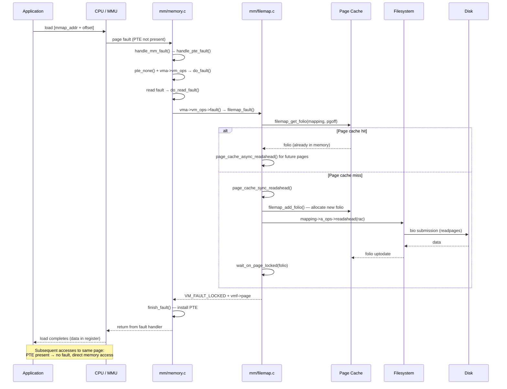

# mmap as an I/O Mechanism

> Using file-backed mmap() for I/O: zero-copy reads, shared writes, and when the page fault cost pays off

## What this page covers

`mmap()` is usually explained in the context of process address spaces and anonymous memory. But `mmap()` of a regular file is also a fully-featured I/O mechanism — an alternative to `read()` and `write()` that trades syscall overhead for page fault overhead and exposes the page cache directly as process memory.

This page focuses on file-backed mmap as an I/O path. For anonymous mmap (heap, stacks, shared memory without a file), see [Process Address Space](../mm/mmap.md). For the low-level page fault and VMA mechanics, see [File-Backed mmap and Page Faults](../mm/file-mmap.md).

---

## File-backed mmap vs read/write

### The basic trade-off

`read()` and `write()` are the universal I/O interface. Every access is a syscall, and the kernel copies data between the page cache and a user-space buffer:

```
read() path:
  user buffer (stack/heap)
       ↑  copy_to_user()
  page cache page
       ↑  readpage (if miss)
  disk
```

`mmap()` maps the page cache directly into the process's virtual address space. After the initial fault, subsequent accesses are plain load/store instructions — no syscall, no copy:

```
mmap() path (after fault):
  process virtual address → (page table) → page cache page
                                                 ↑  readpage (only on first fault)
                                               disk
```

The two costs trade:

| Cost | read/write | mmap |
|------|-----------|------|
| System call per access | Yes | No (after mapping) |
| `copy_to_user` per access | Yes | No |
| Page fault on first access | No | Yes (per 4KB page) |
| TLB pressure | Low | Higher (large mappings fill TLB) |
| Page table entries | None | One PTE per mapped page |

### When mmap wins

**Large files with random access** — A search index, an embedded database, or a large lookup table accessed at arbitrary offsets. With `pread()`, each access is a syscall + copy. With mmap, it is a load instruction after the fault warms the page.

**Multiple processes reading the same file** — All processes share the same physical page cache pages. Their PTEs all point to the same frames. With `read()`, each process has its own user-space buffer; the data is in RAM twice. With mmap, it is in RAM once.

**Read-heavy workloads that fit in RAM** — Once faulted in, repeated access has zero kernel involvement. LMDB, RocksDB with block cache disabled, and Lucene's segment files all exploit this.

**Avoiding double-buffering** — If an application implements its own in-process cache on top of `read()`, that cache plus the OS page cache means the same bytes are in RAM twice. mmap eliminates the application-side copy.

### When read/write wins

**Sequential streaming of large files** — `read()` with a 128KB–1MB buffer amortizes syscall overhead across many pages. The kernel's readahead fires identically in both cases. But with mmap, 32 page faults per 128KB (32 × 4KB) add fault overhead. `read()` often wins here, especially with `O_DIRECT` eliminated as a variable.

**O_DIRECT workloads** — O_DIRECT bypasses the page cache entirely. mmap cannot do this; it is fundamentally tied to the page cache.

**Short-lived processes** — A process that reads a 4KB config file and exits will pay the mmap setup cost (kernel allocates a VMA, installs the mapping) for no benefit. `read()` is simpler and faster for small one-shot reads.

**Writes that need explicit durability control** — `write()` + `fsync()` is a familiar, well-tested path. mmap writes require `msync()` for durability, and the semantics are subtler (see [msync() semantics](#msync-semantics)).

**When page table overhead dominates** — Mapping 100 GB of files and touching a tiny fraction means 100 GB worth of PTEs potentially allocated and TLB pressure on every context switch. `pread()` has no per-byte virtual memory overhead.

---

## mmap() call anatomy

```c
#include <sys/mman.h>

void *mmap(void *addr, size_t length, int prot, int flags, int fd, off_t offset);
```

### Protection flags (prot)

```c
PROT_READ    /* pages are readable */
PROT_WRITE   /* pages are writable */
PROT_EXEC    /* pages are executable */
PROT_NONE    /* no access (guard pages, userfaultfd) */
```

For read-only file I/O: `PROT_READ`.
For read-write file I/O: `PROT_READ | PROT_WRITE`.

### MAP_SHARED vs MAP_PRIVATE

`MAP_SHARED` — Writes go directly into the page cache. The modified page is visible to all other processes that have the same file mapped (or that call `read()` on it). The kernel will write the dirty page back to disk during writeback or when `msync()` is called.

`MAP_PRIVATE` — Writes trigger copy-on-write. A private copy of the page is made for this process. The original page cache page is untouched. Other processes never see the write. The private copy is never written back to the file.

```c
/* Read-only view, no COW overhead */
char *ro = mmap(NULL, len, PROT_READ, MAP_SHARED, fd, 0);

/* Read-write, changes visible to all and written back to file */
char *rw = mmap(NULL, len, PROT_READ | PROT_WRITE, MAP_SHARED, fd, 0);

/* Read-write, changes private (like loading a config you may modify) */
char *priv = mmap(NULL, len, PROT_READ | PROT_WRITE, MAP_PRIVATE, fd, 0);
```

### MAP_POPULATE: eager fault-in

By default, pages are faulted in lazily on first access. `MAP_POPULATE` tells the kernel to pre-fault the entire mapping synchronously during the `mmap()` call itself, using `readahead` to batch the I/O:

```c
/* mmap() returns only after all pages are faulted in */
void *addr = mmap(NULL, len, PROT_READ, MAP_SHARED | MAP_POPULATE, fd, 0);
/* All pages are now in memory. No faults on subsequent access. */
```

This is useful when the latency of individual faults scattered across a workload is more harmful than a single up-front I/O burst. LMDB uses `MAP_POPULATE` for its environment open.

`MAP_POPULATE` with `MAP_PRIVATE` also pre-faults, but does not trigger COW — pages are mapped read-only from the page cache and will COW on first write.

### MAP_FIXED: map at an exact address

```c
/* Force the mapping at a specific virtual address */
/* WARNING: silently replaces any existing mapping at that address */
void *addr = mmap((void *)0x7f0000000000, len,
                  PROT_READ, MAP_SHARED | MAP_FIXED, fd, 0);
```

`MAP_FIXED_NOREPLACE` (Linux 4.17) is safer — it fails with `EEXIST` instead of silently clobbering an existing mapping:

```c
void *addr = mmap(hint, len, PROT_READ,
                  MAP_SHARED | MAP_FIXED_NOREPLACE, fd, 0);
if (addr == MAP_FAILED && errno == EEXIST)
    /* hint was occupied, try elsewhere */
```

### MAP_HUGETLB: huge page mappings

```c
#include <linux/mman.h>

/* Map a file using 2MB huge pages */
void *addr = mmap(NULL, len,
                  PROT_READ | PROT_WRITE,
                  MAP_SHARED | MAP_HUGETLB | (MAP_HUGE_2MB << MAP_HUGE_SHIFT),
                  fd, 0);
```

`MAP_HUGETLB` is primarily for hugetlbfs-backed files or `memfd_create()` with `MFD_HUGETLB`. For regular file mmaps, Transparent Huge Pages (THP) are a more flexible option — see [Huge Pages and THP](../mm/thp.md).

---

## How a file-backed mmap read works

The first access to a page in an mmap'd file triggers a hardware page fault. The kernel's fault handler walks the VMA tree, finds the file-backed VMA, and reads the page from the page cache (or from disk if it is not cached). Subsequent accesses hit the page table directly — no kernel involvement.



### Kernel code path

```c
/* mm/memory.c — entry point from architecture fault handler */
vm_fault_t handle_mm_fault(struct vm_area_struct *vma,
                            unsigned long address, unsigned int flags,
                            struct pt_regs *regs)
{
    /* Walk/allocate page table levels: pgd → p4d → pud → pmd */
    return handle_pte_fault(vmf);
}

static vm_fault_t handle_pte_fault(struct vm_fault *vmf)
{
    pte_t entry = *vmf->pte;

    if (!pte_present(entry)) {
        if (pte_none(entry)) {
            if (vmf->vma->vm_ops)
                return do_fault(vmf);       /* file-backed */
            return do_anonymous_page(vmf);  /* anonymous */
        }
        return do_swap_page(vmf);           /* swapped out */
    }
    /* Present but write-protected: copy-on-write */
    if (vmf->flags & FAULT_FLAG_WRITE && !pte_write(entry))
        return do_wp_page(vmf);
    return 0;
}

/* mm/memory.c — dispatch read vs write vs shared faults */
static vm_fault_t do_fault(struct vm_fault *vmf)
{
    if (!(vmf->flags & FAULT_FLAG_WRITE))
        return do_read_fault(vmf);          /* read: share page cache page */
    if (!(vmf->vma->vm_flags & VM_SHARED))
        return do_cow_fault(vmf);           /* MAP_PRIVATE write: COW */
    return do_shared_fault(vmf);            /* MAP_SHARED write: dirty in-place */
}
```

### filemap_fault: page cache lookup

```c
/* mm/filemap.c */
vm_fault_t filemap_fault(struct vm_fault *vmf)
{
    struct file *file        = vmf->vma->vm_file;
    struct address_space *mapping = file->f_mapping;
    pgoff_t offset           = vmf->pgoff;
    struct file_ra_state *ra = &file->f_ra;
    struct folio *folio;

    /* Step 1: look up in the page cache (radix tree / xarray) */
    folio = filemap_get_folio(mapping, offset);

    if (!folio) {
        /* Cache miss */
        count_vm_event(PGMAJFAULT);         /* major fault counter */
        mem_cgroup_count_vm_event(vma->vm_mm, PGMAJFAULT);

        /* Synchronous readahead: read this page + surrounding pages */
        page_cache_sync_readahead(mapping, ra, file, offset, ra->ra_pages);

        /* Allocate and add folio to page cache */
        folio = filemap_alloc_folio(vmf->gfp_mask, 0);
        filemap_add_folio(mapping, folio, offset, vmf->gfp_mask);

        /* Invoke filesystem readahead: submits bio(s) */
        mapping->a_ops->readahead(rac);
        /* → ext4_readahead → ext4_mpage_readpages → submit_bio */

        /* Wait for disk I/O to complete */
        wait_on_page_locked(folio);
    } else {
        /* Cache hit: async readahead for pages ahead of this one */
        count_vm_event(PGMINORAULT);
        page_cache_async_readahead(mapping, ra, file, folio,
                                   offset, ra->ra_pages);
    }

    vmf->page = folio_file_page(folio, offset);
    return VM_FAULT_LOCKED;
    /* do_read_fault will call finish_fault() to install the PTE */
}
```

After `finish_fault()` installs the PTE, the virtual address maps directly to the physical page in the page cache. The next load to any byte on that page is resolved entirely in hardware — no trap to the kernel.

---

## How writes to MAP_SHARED work

With `MAP_SHARED | PROT_WRITE`, writes go directly into the page cache. There is no separate user-space buffer; the process is writing into the kernel's page cache.

### Initial state and first write fault

Even though the VMA is marked writable, PTEs are initially installed read-only. This is intentional: the kernel needs to know when a page first becomes dirty so it can set the dirty bit, start tracking it for writeback, and (for filesystems with journaling like ext4) start a journal transaction.

```
Initial state after read fault:
  PTE → page cache page [read-only PTE]

First write to the page:
  Hardware: write to read-only page → fault
  do_shared_fault():
    1. Ensure page is in cache (__do_fault)
    2. Call vma->vm_ops->page_mkwrite (if set)
       → ext4: starts journal transaction, reserves blocks
    3. set_page_dirty(page) — mark page dirty in page cache
    4. Install writable PTE
    5. Writeback daemon (pdflush/flusher) will eventually write to disk
```

```c
/* mm/memory.c */
static vm_fault_t do_shared_fault(struct vm_fault *vmf)
{
    struct vm_area_struct *vma = vmf->vma;
    vm_fault_t ret;

    /* Read the page from cache (or disk) */
    ret = __do_fault(vmf);
    if (unlikely(ret & (VM_FAULT_ERROR | VM_FAULT_NOPAGE | VM_FAULT_RETRY)))
        return ret;

    /* Notify filesystem of imminent write (journaling, etc.) */
    if (vma->vm_ops->page_mkwrite) {
        ret = do_page_mkwrite(vmf);
        if (unlikely(ret & (VM_FAULT_ERROR | VM_FAULT_NOPAGE)))
            return ret;
    }

    /* Mark dirty and install writable PTE */
    fault_dirty_shared_page(vmf);
    return ret;
}
```

### Visibility to other processes

A write to a `MAP_SHARED` mapping is immediately visible to all other processes that have the same file mapped. They share the same physical page; their PTEs point to the same frame. No `msync()` is needed for process-to-process visibility — it is instantaneous.

```c
/* Process A */
int fd = open("shared.dat", O_RDWR);
char *a = mmap(NULL, 4096, PROT_READ | PROT_WRITE, MAP_SHARED, fd, 0);
a[0] = 'X';   /* instantly visible to Process B */

/* Process B (same file open) */
char *b = mmap(NULL, 4096, PROT_READ | PROT_WRITE, MAP_SHARED, fd, 0);
printf("%c\n", b[0]);   /* prints 'X' — no msync needed */
```

### Writeback to disk

The kernel writes dirty pages to disk automatically as part of normal writeback (controlled by `dirty_expire_centisecs`, `dirty_writeback_centisecs`, and `dirty_ratio`). This happens asynchronously without any application action.

For explicit control, use `msync()` — see [msync() semantics](#msync-semantics).

---

## MAP_PRIVATE: copy-on-write semantics

`MAP_PRIVATE` creates an independent view of the file. Reads share the page cache (no copying). Writes create a private copy of the page that is never written back to the file.

### COW fault path

```
Initial (read fault, MAP_PRIVATE):
  PTE → page cache page [read-only]

First write to page:
  Hardware: write to read-only page → fault
  do_cow_fault():
    1. Allocate a fresh anonymous page
    2. __do_fault(): get the original file page
    3. copy_user_highpage(): copy file page → new anonymous page
    4. Install writable PTE → new anonymous page
    5. Page cache page untouched, original file unchanged
```

```c
/* mm/memory.c */
static vm_fault_t do_cow_fault(struct vm_fault *vmf)
{
    struct vm_area_struct *vma = vmf->vma;
    vm_fault_t ret;

    /* Allocate a new anonymous page for the private copy */
    vmf->cow_page = alloc_page_vma(GFP_HIGHUSER_MOVABLE, vma, vmf->address);
    if (!vmf->cow_page)
        return VM_FAULT_OOM;

    /* Read the original file page into vmf->page */
    ret = __do_fault(vmf);
    if (unlikely(ret & (VM_FAULT_ERROR | VM_FAULT_NOPAGE | VM_FAULT_RETRY)))
        goto uncharge_out;

    /* Copy file page → private page */
    copy_user_highpage(vmf->cow_page, vmf->page, vmf->address, vma);
    __SetPageUptodate(vmf->cow_page);

    /* Install PTE pointing to the private copy (writable) */
    ret |= finish_fault(vmf);
    unlock_page(vmf->page);
    put_page(vmf->page);
    return ret;
}
```

### Use cases for MAP_PRIVATE on files

**Read-only access with potential local modifications** — A process loads a large read-only dataset but may modify a few entries locally (for a session-scoped cache, normalization, etc.). MAP_PRIVATE is read-efficient (pages shared with page cache) and write-efficient (only modified pages are copied).

**Process isolation / fork semantics** — After `fork()`, both parent and child inherit MAP_PRIVATE mappings. The PTEs are write-protected; the first write in either process creates a private copy. This is exactly how `exec()` works for text segments.

**Implementing application-level snapshots** — Map a database file with MAP_PRIVATE. Take a "snapshot" of the current state. The application can modify the snapshot freely; the underlying file is untouched.

```c
/* Load a read-only dataset; modifications stay local */
int fd = open("embedding-index.bin", O_RDONLY);
struct stat st;
fstat(fd, &st);

float *index = mmap(NULL, st.st_size,
                    PROT_READ | PROT_WRITE,
                    MAP_PRIVATE,           /* writes never reach the file */
                    fd, 0);
close(fd);   /* fd can be closed immediately after mmap */

/* Reads share the page cache — no extra RAM for unmodified pages */
float score = index[1024];

/* This write creates a private COW copy of only this page */
index[42] = 0.0f;   /* normalize without touching the file */
```

---

## msync() semantics

`msync()` controls the relationship between dirty pages in a `MAP_SHARED` mapping and the data on disk.

```c
#include <sys/mman.h>

int msync(void *addr, size_t length, int flags);
```

### MS_SYNC: wait for writeback

`MS_SYNC` initiates writeback of all dirty pages in the range and waits for it to complete before returning. After `MS_SYNC` returns, the data is guaranteed to have reached the storage device (subject to the device's own write cache — combine with `O_SYNC` or a subsequent `sync_file_range()` for full durability).

```c
char *map = mmap(NULL, len, PROT_READ | PROT_WRITE, MAP_SHARED, fd, 0);

/* ... modify pages ... */
map[0] = 'A';
map[4096] = 'B';

/* Flush to disk and wait */
if (msync(map, len, MS_SYNC) != 0)
    perror("msync");
/* Data is on disk now */
```

### MS_ASYNC: advisory flush

`MS_ASYNC` marks the range as needing writeback and schedules it, but returns immediately without waiting. It is a hint to the kernel: "I am done writing this range, please start flushing." On Linux, `MS_ASYNC` has been a no-op in many kernel versions (the writeback daemon handles scheduling independently), but calling it is still a good practice for clarity.

```c
/* Write a block, schedule flush, continue processing */
memcpy(map + offset, data, chunk_size);
msync(map + offset, chunk_size, MS_ASYNC);
/* Continue doing other work; writeback happens in background */
```

### MS_INVALIDATE: discard cached changes

`MS_INVALIDATE` discards any in-memory changes to the range and reloads from the underlying file. It is used when another process (or the file on disk) may have changed the backing data and you want the mapping to reflect the on-disk state.

```c
/* Another process wrote to the file; reload our view */
msync(map, len, MS_INVALIDATE);
/* Subsequent reads will re-fault pages from disk */
```

`MS_INVALIDATE` combined with `MS_SYNC` (as `MS_SYNC | MS_INVALIDATE`) writes out dirty pages first, then invalidates.

### When is msync required?

| Goal | What to do |
|------|-----------|
| Writes visible to other mmap processes | Nothing — automatic (shared page cache) |
| Writes visible via read() by other processes | Nothing — same page cache |
| Writes durably on disk (survive power loss) | `msync(MS_SYNC)` or `fsync(fd)` |
| Writes durably, async (best-effort) | `msync(MS_ASYNC)` |
| Reload from disk after external change | `msync(MS_INVALIDATE)` |
| Partial-file durability | `sync_file_range(fd, offset, len, SYNC_FILE_RANGE_WRITE \| SYNC_FILE_RANGE_WAIT_AFTER)` |

### msync vs fsync

`fsync(fd)` and `msync(addr, len, MS_SYNC)` both flush dirty pages to disk, but they operate on different objects. `fsync()` takes a file descriptor and flushes all dirty pages for that file (plus metadata). `msync()` takes a virtual address range, which is a subset of the mapping (and a subset of the file).

For a full-file durability guarantee, `fsync(fd)` is simpler. For range durability on a large file, `msync()` on the specific range is more efficient.

```c
/* Equivalent for full-file durability */
msync(map, file_size, MS_SYNC);
/* vs */
fsync(fd);
```

---

## File sealing with F_SEAL_*

File sealing (introduced in Linux 3.17) allows a process to permanently restrict operations on a file descriptor, creating an immutable or partially-immutable shared memory region. It is most useful with `memfd_create()` but applies to any `tmpfs` file with sealing enabled.

### The seals

```c
#include <linux/memfd.h>
#include <fcntl.h>

/* Prevent adding further seals */
F_SEAL_SEAL

/* Prevent write() calls and MAP_SHARED | PROT_WRITE mappings */
F_SEAL_WRITE

/* Prevent shrinking the file */
F_SEAL_SHRINK

/* Prevent growing the file (write beyond end, ftruncate to larger size) */
F_SEAL_GROW

/* Prevent MAP_SHARED | PROT_WRITE, but allow MAP_PRIVATE | PROT_WRITE */
F_SEAL_FUTURE_WRITE   /* Linux 5.1 */
```

### Applying seals

```c
int fd = memfd_create("shared_data", MFD_ALLOW_SEALING);

/* Write initial data */
ftruncate(fd, DATA_SIZE);
write(fd, data, DATA_SIZE);

/* Seal: prevent any further writes or size changes */
fcntl(fd, F_ADD_SEALS, F_SEAL_WRITE | F_SEAL_GROW | F_SEAL_SHRINK);

/* Now pass fd to another process. That process can: */
/*   - mmap with MAP_SHARED | PROT_READ ✓ */
/*   - mmap with MAP_SHARED | PROT_WRITE ✗ (EPERM) */
/*   - write() to fd ✗ (EPERM) */
/*   - ftruncate() ✗ (EPERM) */

/* Seal the seal list (no more seals can be added) */
fcntl(fd, F_ADD_SEALS, F_SEAL_SEAL);
```

### Query current seals

```c
int seals = fcntl(fd, F_GET_SEALS);
if (seals & F_SEAL_WRITE)
    printf("file is write-sealed\n");
```

### Android Ashmem replacement

Android's original shared memory mechanism, Ashmem, was replaced by `memfd_create()` + sealing in Android 10 (API level 29). The pattern:

1. Process A creates a `memfd`, writes data, applies `F_SEAL_WRITE | F_SEAL_SHRINK | F_SEAL_GROW`.
2. Process A sends the fd to Process B over a Unix socket (with `SCM_RIGHTS`).
3. Process B verifies the seals with `F_GET_SEALS` before mmap'ing.
4. Process B can safely mmap `MAP_SHARED` knowing the data cannot change under it.

Sealing provides a security contract: the receiver verifies what the sender promises, without trusting the sender not to modify the data after the fact.

```c
/* Sender */
int fd = memfd_create("asset", MFD_ALLOW_SEALING);
ftruncate(fd, asset_size);
write(fd, asset_data, asset_size);
fcntl(fd, F_ADD_SEALS, F_SEAL_SEAL | F_SEAL_WRITE |
                        F_SEAL_GROW | F_SEAL_SHRINK);
send_fd_over_socket(sock, fd);

/* Receiver */
int fd = recv_fd_from_socket(sock);
int seals = fcntl(fd, F_GET_SEALS);
assert((seals & (F_SEAL_WRITE | F_SEAL_SEAL)) ==
               (F_SEAL_WRITE | F_SEAL_SEAL));  /* verify promise */
void *data = mmap(NULL, asset_size, PROT_READ, MAP_SHARED, fd, 0);
/* Safe: sender cannot modify data */
```

---

## Performance characteristics

### Benchmark intuition

The break-even point between mmap and read/write depends on:

- **File size** — Large files favour mmap (amortize VMA/fault overhead)
- **Access pattern** — Random access strongly favours mmap; sequential access is similar or slightly favours read()
- **Reuse** — Multiple passes over the same data strongly favour mmap (faults amortized)
- **CPU architecture** — TLB size matters; x86 has a large TLB; ARM often has a smaller one

### The copy_to_user elimination

`read()` calls `copy_to_user()` to move data from the page cache into the user buffer. On modern x86 with ERMS (Enhanced REP MOVSB), this is fast but not free — for a 4KB page it costs roughly 400–1000 ns depending on cache state.

mmap eliminates this copy. After the page fault, a load from the mapped address hits the page cache page directly (possibly L1/L2 cache if recently accessed). For workloads that access the same page many times, this is a significant win.

### TLB cost

Every new PTE installed by a page fault must eventually be evicted from the TLB on context switch or TLB shootdown. Large mappings can cause TLB pressure, especially on multi-core systems where TLB invalidations are broadcast as IPIs.

Using huge pages (2MB via `MAP_HUGETLB` or THP) reduces TLB pressure dramatically — one TLB entry covers 512 × 4KB instead of one.

```c
/* 2MB THP for large mmap: 512x fewer TLB entries */
void *addr = mmap(NULL, 512 * 1024 * 1024,
                  PROT_READ, MAP_SHARED, fd, 0);
madvise(addr, 512 * 1024 * 1024, MADV_HUGEPAGE);
```

### When mmap page table overhead dominates

A 100 GB mapping with random access to 1% of pages still requires the kernel to allocate PTEs for every faulted page. Each PTE is 8 bytes; 1% of 100 GB / 4KB = ~260,000 PTEs = ~2 MB just for page tables. The VMA itself is O(1). For most workloads this is negligible, but for thousands of sparse mappings it adds up.

`pread()` has zero per-page virtual memory overhead.

### Summary table

| Scenario | Winner | Reason |
|----------|--------|--------|
| Large file, random reads, multiple passes | mmap | No copy, faults amortized |
| Large file, random reads, single pass | Tie | Fault cost ≈ copy cost |
| Sequential streaming, single pass | read() | Readahead equally effective; no fault overhead |
| Multiple processes reading same file | mmap | Physical pages shared |
| Small file, read once | read() | VMA + fault overhead not worth it |
| Database buffer pool | O_DIRECT | Bypass page cache entirely |
| Embedded key-value store (LMDB) | mmap | Zero-copy, shared across processes |
| Write with durability guarantee | Depends | fsync vs msync; read/write simpler |

---

## madvise() for I/O hints

`madvise()` tells the kernel how the application will access a mapped region. The kernel uses these hints for readahead, page eviction policy, and THP decisions.

```c
int madvise(void *addr, size_t length, int advice);
```

### Hints that affect I/O behaviour

**MADV_SEQUENTIAL** — The application will access pages in order. The kernel increases the readahead window and marks pages as candidates for early eviction (they have been "used" in order). This is the most important hint for streaming reads through a large file.

```c
madvise(map, file_size, MADV_SEQUENTIAL);
/* Read sequentially: kernel prefetches aggressively */
for (size_t i = 0; i < file_size; i += 64)
    process_byte(map[i]);
```

**MADV_RANDOM** — The application will access pages in random order. Readahead is disabled. Without this hint, the kernel wastes I/O prefetching pages that will not be accessed soon.

```c
madvise(map, file_size, MADV_RANDOM);
/* Random access: no wasted readahead */
uint64_t key = hash_to_page_offset(query);
return *(uint64_t *)(map + key);
```

**MADV_WILLNEED** — Prefetch the given range asynchronously now. The kernel schedules readahead for the range immediately. The call returns before the I/O completes. Useful for overlapping computation with I/O:

```c
/* Start prefetching the next chunk while processing the current one */
madvise(map + next_offset, CHUNK_SIZE, MADV_WILLNEED);
process_chunk(map + current_offset, CHUNK_SIZE);
/* By the time we get here, next chunk is likely in cache */
```

**MADV_DONTNEED** — The kernel may reclaim the physical pages for this range. The virtual mapping remains valid; the next access will re-fault pages from disk. Used to release memory after processing a section of a large file:

```c
/* Done with this chunk; release physical pages */
madvise(map + processed_offset, CHUNK_SIZE, MADV_DONTNEED);
```

**MADV_FREE** (Linux 4.5) — Like `MADV_DONTNEED` but lazy: the pages are marked as free candidates but not immediately reclaimed. If memory pressure is low, they may still be in memory on next access (avoiding a fault). Useful for reuse patterns where the caller "might" need the data again.

### MADV_POPULATE_READ and MADV_POPULATE_WRITE (Linux 5.14)

These hints explicitly pre-populate a range by simulating faults, without the calling thread needing to access each page:

```c
/* Pre-fault pages for reading: equivalent to MAP_POPULATE, but post-mmap */
madvise(map, file_size, MADV_POPULATE_READ);

/* Pre-fault pages for writing: triggers COW on MAP_PRIVATE regions */
madvise(map, file_size, MADV_POPULATE_WRITE);
```

`MADV_POPULATE_READ` is useful when you want to start I/O on a range while continuing other setup. Unlike `MADV_WILLNEED`, it guarantees that pages are fully faulted in (not just scheduled) before returning. Like `MAP_POPULATE` but can be applied to a sub-range at any time after mmap.

`MADV_POPULATE_WRITE` on a `MAP_PRIVATE` mapping pre-triggers all COW faults, so the process owns writable copies of all pages before any actual writes. This eliminates COW latency from the hot path.

### Kernel implementation

```c
/* mm/madvise.c */
static long madvise_behavior(struct vm_area_struct *vma,
                              struct vm_area_struct **prev,
                              unsigned long start, unsigned long end,
                              int behavior)
{
    struct mm_struct *mm = vma->vm_mm;
    int error = 0;
    pgoff_t pgoff;
    unsigned long new_flags = vma->vm_flags;

    switch (behavior) {
    case MADV_SEQUENTIAL:
        new_flags |= VM_SEQ_READ;
        new_flags &= ~VM_RAND_READ;
        break;
    case MADV_RANDOM:
        new_flags |= VM_RAND_READ;
        new_flags &= ~VM_SEQ_READ;
        break;
    case MADV_DONTNEED:
        return madvise_dontneed_single_vma(vma, start, end);
    case MADV_WILLNEED:
        return madvise_willneed(vma, prev, start, end);
    /* ... */
    }
    /* Update VMA flags */
    vma = vma_modify_flags(vma, prev, start, end, new_flags);
}

/* filemap_fault reads the vm_flags to set readahead size */
/* mm/filemap.c */
if (vma->vm_flags & VM_RAND_READ)
    ra->ra_pages = 0;    /* disable readahead */
if (vma->vm_flags & VM_SEQ_READ)
    ra->ra_pages = max(ra->ra_pages, bdi->ra_pages);
```

---

## Practical examples

### Example 1: Read-only data file

Map a large read-only file for random access (e.g., a pre-built lookup table):

```c
#include <fcntl.h>
#include <sys/mman.h>
#include <sys/stat.h>
#include <stdio.h>
#include <stdlib.h>
#include <unistd.h>

struct lookup_entry {
    uint64_t key;
    uint64_t value;
};

struct lookup_table {
    const struct lookup_entry *entries;
    size_t count;
    void *map_addr;
    size_t map_size;
};

int lookup_open(struct lookup_table *tbl, const char *path)
{
    int fd = open(path, O_RDONLY);
    if (fd < 0)
        return -1;

    struct stat st;
    if (fstat(fd, &st) < 0) {
        close(fd);
        return -1;
    }

    /* Random access: disable readahead */
    void *addr = mmap(NULL, st.st_size, PROT_READ, MAP_SHARED, fd, 0);
    close(fd);   /* fd no longer needed after mmap */

    if (addr == MAP_FAILED)
        return -1;

    madvise(addr, st.st_size, MADV_RANDOM);

    tbl->map_addr  = addr;
    tbl->map_size  = st.st_size;
    tbl->entries   = addr;
    tbl->count     = st.st_size / sizeof(struct lookup_entry);
    return 0;
}

uint64_t lookup_query(const struct lookup_table *tbl, uint64_t key)
{
    /* Binary search: touches O(log N) pages, fault cost per new page */
    size_t lo = 0, hi = tbl->count;
    while (lo < hi) {
        size_t mid = lo + (hi - lo) / 2;
        if (tbl->entries[mid].key == key)
            return tbl->entries[mid].value;
        if (tbl->entries[mid].key < key)
            lo = mid + 1;
        else
            hi = mid;
    }
    return 0;
}

void lookup_close(struct lookup_table *tbl)
{
    munmap(tbl->map_addr, tbl->map_size);
}
```

### Example 2: Memory-mapped database (LMDB pattern)

LMDB (Lightning Memory-Mapped Database) maps its entire data file into the process address space and uses B-tree navigation via pointer dereferences. This is the canonical mmap-as-database pattern:

```c
#include <fcntl.h>
#include <sys/mman.h>
#include <sys/stat.h>
#include <stdio.h>
#include <stdint.h>

#define DB_MAX_SIZE (1UL << 32)   /* 4 GB virtual address space reservation */

typedef struct {
    uint32_t magic;
    uint32_t version;
    uint64_t root_pgno;         /* B-tree root page number */
    uint64_t num_pages;
} db_meta_t;

typedef struct {
    void    *addr;              /* base of mmap */
    size_t   map_size;          /* current mapping size */
    int      fd;
} db_env_t;

int db_open(db_env_t *env, const char *path)
{
    env->fd = open(path, O_RDWR | O_CREAT, 0644);
    if (env->fd < 0)
        return -1;

    struct stat st;
    fstat(env->fd, &st);

    /* Map the full address space reservation upfront.
     * Physical pages are only allocated as the file grows.
     * LMDB does exactly this — maps DB_MAX_SIZE but the file starts small. */
    env->map_size = DB_MAX_SIZE;
    env->addr = mmap(NULL, env->map_size,
                     PROT_READ | PROT_WRITE,
                     MAP_SHARED,      /* writes go to file */
                     env->fd, 0);
    if (env->addr == MAP_FAILED)
        return -1;

    /* Read the meta page (always page 0) */
    db_meta_t *meta = env->addr;
    if (meta->magic != 0xBEEFCAFE) {
        /* New database: initialize meta page */
        meta->magic    = 0xBEEFCAFE;
        meta->version  = 1;
        meta->root_pgno = 1;
        meta->num_pages = 2;
        msync(env->addr, 4096, MS_SYNC);   /* durably write meta page */
    }

    return 0;
}

/* Page access: just a pointer dereference after the first fault */
static inline void *db_page(db_env_t *env, uint64_t pgno)
{
    return (char *)env->addr + (pgno * 4096);
}

void db_close(db_env_t *env)
{
    msync(env->addr, env->map_size, MS_SYNC);  /* flush dirty pages */
    munmap(env->addr, env->map_size);
    close(env->fd);
}
```

Key design points from LMDB:
- The mapping is `MAP_SHARED` — writes are visible to all reader processes immediately.
- Readers need no locks for read-only access because the B-tree is updated via copy-on-write at the database level (MVCC pages, not OS COW).
- `msync(MS_SYNC)` is called only when committing a transaction, not on every write.
- The full virtual address space is reserved upfront; the kernel only allocates PTEs (and physical pages) for pages that are actually accessed.

### Example 3: Shared memory IPC via file-backed mmap

Two processes share a ring buffer backed by a regular file:

```c
/* shared_ring.h */
#define RING_MAGIC   0xABCD1234
#define RING_ENTRIES 256

typedef struct {
    uint32_t magic;
    uint32_t head;          /* producer writes here */
    uint32_t tail;          /* consumer reads here */
    uint32_t _pad;
    char     data[RING_ENTRIES][64];   /* fixed-size slots */
} ring_t;

/* Producer */
int ring_produce(ring_t *ring, const char *msg, size_t len)
{
    uint32_t next = (ring->head + 1) % RING_ENTRIES;
    if (next == ring->tail)
        return -1;  /* full */

    memcpy(ring->data[ring->head], msg, len < 64 ? len : 63);
    /* Compiler/CPU memory barrier before updating head */
    __atomic_store_n(&ring->head, next, __ATOMIC_RELEASE);
    return 0;
    /* No msync needed: consumer shares same page cache page */
}

/* Consumer */
int ring_consume(ring_t *ring, char *out, size_t out_len)
{
    if (__atomic_load_n(&ring->tail, __ATOMIC_ACQUIRE) ==
        __atomic_load_n(&ring->head, __ATOMIC_ACQUIRE))
        return -1;  /* empty */

    memcpy(out, ring->data[ring->tail], out_len < 64 ? out_len : 63);
    __atomic_store_n(&ring->tail,
                     (ring->tail + 1) % RING_ENTRIES,
                     __ATOMIC_RELEASE);
    return 0;
}

/* Setup (both processes) */
ring_t *ring_open(const char *path)
{
    int fd = open(path, O_RDWR | O_CREAT, 0600);
    ftruncate(fd, sizeof(ring_t));

    ring_t *r = mmap(NULL, sizeof(ring_t),
                     PROT_READ | PROT_WRITE,
                     MAP_SHARED,    /* essential: shared page cache */
                     fd, 0);
    close(fd);

    if (r->magic != RING_MAGIC) {
        r->magic = RING_MAGIC;
        r->head  = 0;
        r->tail  = 0;
    }
    return r;
}
```

This IPC mechanism requires no `msync()` for inter-process visibility — the `MAP_SHARED` page is the same physical page in both processes. The only synchronization needed is atomic operations for the head/tail indices. `msync(MS_SYNC)` would only be needed if the data must survive a crash.

---

## Further reading

- [File-Backed mmap and Page Faults](../mm/file-mmap.md) — VMA internals, page fault mechanics, readahead
- [Page Cache](../mm/page-cache.md) — the shared backing store for all file-backed mmaps
- [Direct I/O](direct-io.md) — the alternative: bypass the page cache entirely
- [Buffered I/O](buffered-io.md) — read/write path through the page cache
- [Copy-on-Write](../mm/cow.md) — MAP_PRIVATE COW mechanics in depth
- [Process Address Space](../mm/mmap.md) — VMA layout, munmap, mremap
- [Huge Pages and THP](../mm/thp.md) — reducing TLB pressure on large mappings
- [userfaultfd](../mm/userfaultfd.md) — intercept page faults from userspace
- `mm/filemap.c` — `filemap_fault()`, `filemap_get_folio()`, readahead
- `mm/memory.c` — `do_fault()`, `do_cow_fault()`, `do_shared_fault()`
- `mm/mmap.c` — `mmap_region()`, VMA creation
- `mm/madvise.c` — `madvise()` implementation
