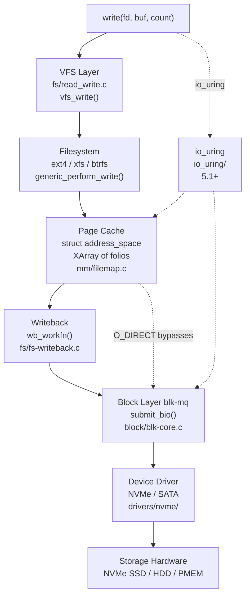

# I/O: The Story

> From Linus's first `read()` in 1991 to io_uring's proactor model in 2024 — how Linux learned to move data at the speed of hardware

---

## The Problem (1991)

On August 25, 1991, Linus Torvalds posted his famous announcement to comp.os.minix. Within weeks he had a working MINIX filesystem driver and the first `read()` and `write()` system calls. They were brutally simple: the calling process blocked, data was copied synchronously, and control returned when the disk operation finished.

That design had a name: **synchronous blocking I/O**. It was the only model anyone seriously implemented at the time. Every read went directly to disk. Every write waited for the hardware to confirm it had accepted the data. The application thread sat idle during all of it.

```c
/* Very early Linux — read() was a direct path to the driver */
int sys_read(unsigned int fd, char *buf, int count)
{
    struct file *file = current->filp[fd];
    struct inode *inode = file->f_inode;

    /* Call the filesystem's read method directly */
    return file->f_op->read(inode, file, buf, count);
}
```

This worked for a hobby OS running one process at a time. It did not work for anything real. A 40 MB/s hard disk in 1991 took 25 microseconds per sector read. Multiply that by every file access in a busy system and the CPU spent most of its time waiting for spinning metal.

Two problems had to be solved before Linux I/O could be useful:

1. **Buffering**: Keep recently-used file data in DRAM so it does not have to be re-read from disk on every access.
2. **Asynchrony**: Let the CPU do useful work while I/O is in flight, rather than blocking the calling thread.

These two problems drove thirty years of Linux I/O evolution. Every major subsystem described in this document is an answer to one of them.

---

## The Page Cache Arrives

### The Buffer Cache (1991–1995)

The first attempt at buffering was the **buffer cache**, a separate pool of fixed-size 512-byte or 1KB `buffer_head` structures that cached raw disk blocks. Each `buffer_head` tracked a single block on a single device:

```c
/* include/linux/fs.h (early) */
struct buffer_head {
    char            *b_data;       /* pointer to data block (1KB) */
    unsigned long    b_blocknr;    /* block number */
    unsigned short   b_dev;        /* device */
    unsigned char    b_uptodate;   /* 1 if data is valid */
    unsigned char    b_dirty;      /* 1 if data needs to be written */
    struct buffer_head *b_next;    /* hash chain */
    struct buffer_head *b_prev_free;
    struct buffer_head *b_next_free;
};
```

The buffer cache solved the re-read problem for disk blocks, but it was completely separate from the virtual memory subsystem. Anonymously mapped pages lived in one pool; file data lived in another. This meant the same file data could occupy memory twice — once in the buffer cache, once mapped into a process's address space — with no way to share it.

### The Page Cache (2.0–2.2)

Linux 2.0 introduced the **page cache**: a unified cache of 4KB pages indexed by `(inode, offset)` pairs. Instead of caching raw disk blocks, the page cache cached file data at the logical file level. Reads populated pages; writes dirtied them; the kernel flushed dirty pages asynchronously.

The key insight: **write() does not need to touch the disk**. The kernel accepts the data into a DRAM page, marks that page dirty, and tells the application it's done. Actual disk I/O happens later, in the background, when the kernel decides it's convenient. This made writes appear nearly instantaneous from the application's perspective.

```
write() performance comparison:
  Synchronous path: write() → wait 10ms for disk → return    ← 10ms latency
  Buffered path:    write() → copy to page cache → return     ← ~1μs latency
                                    ↓ (background)
                              flush to disk
```

### The Unification (2.4 — 1999–2001)

For years, Linux 2.2 had a split personality: the page cache for file reads and a separate buffer cache for filesystem metadata and write paths. Ingo Molnár and Andrea Arcangeli drove the **unified page cache** work that merged into Linux 2.4. The buffer cache became a compatibility layer on top of the page cache. `buffer_head` structures were repurposed to describe sub-page disk blocks within a page cache page, but the page itself was always managed by the page cache.

This had a profound effect on memory accounting: the kernel now had a single authoritative view of how much memory was used for file data. Pressure in one area could be relieved by reclaiming pages from the other.

> **LWN reference**: The page cache unification is described in [LWN: Unified page cache](https://lwn.net/Articles/712467/) and in Mel Gorman's "Understanding the Linux Virtual Memory Manager" (2004).

---

## The Big Architecture Picture

Before diving into individual subsystems, here is the complete stack for a buffered `write()`:

```
┌─────────────────────────────────────────────────────────┐
│                     User Space                          │
│   write(fd, buf, count)                                 │
└────────────────────────┬────────────────────────────────┘
                         │  syscall (int 0x80 / syscall insn)
┌────────────────────────▼────────────────────────────────┐
│                    VFS Layer                            │
│   sys_write() → vfs_write() → file->f_op->write_iter() │
│   fs/read_write.c                                       │
└────────────────────────┬────────────────────────────────┘
                         │  calls into filesystem
┌────────────────────────▼────────────────────────────────┐
│              Filesystem (ext4, xfs, btrfs…)             │
│   ext4_file_write_iter() → generic_file_write_iter()    │
│   → generic_perform_write()                             │
│   fs/ext4/file.c, mm/filemap.c                          │
└────────────────────────┬────────────────────────────────┘
                         │  operates on address_space
┌────────────────────────▼────────────────────────────────┐
│                   Page Cache                            │
│   struct address_space, XArray of struct folio          │
│   find or allocate folio, copy_from_user, mark dirty    │
│   mm/filemap.c, mm/folio-compat.c                       │
└────────────────────────┬────────────────────────────────┘
                         │  writeback (asynchronous)
┌────────────────────────▼────────────────────────────────┐
│                   Writeback Layer                       │
│   wb_workfn() → writeback_sb_inodes()                   │
│   → do_writepages() → a_ops->writepages()               │
│   fs/fs-writeback.c, mm/page-writeback.c                │
└────────────────────────┬────────────────────────────────┘
                         │  submits bio
┌────────────────────────▼────────────────────────────────┐
│                   Block Layer (blk-mq)                  │
│   submit_bio() → blk_mq_submit_bio()                    │
│   I/O scheduler (mq-deadline, kyber, bfq)               │
│   block/blk-core.c, block/blk-mq.c                      │
└────────────────────────┬────────────────────────────────┘
                         │  dispatch to driver
┌────────────────────────▼────────────────────────────────┐
│                   Device Driver                         │
│   NVMe: nvme_queue_rq() → nvme_submit_cmd()             │
│   SATA: libata via ahci_queue_cmd()                     │
│   drivers/nvme/host/pci.c, drivers/ata/libata-core.c    │
└────────────────────────┬────────────────────────────────┘
                         │  DMA
┌────────────────────────▼────────────────────────────────┐
│                   Storage Hardware                      │
│   NVMe SSD / SATA SSD / HDD / PMEM (DAX)               │
└─────────────────────────────────────────────────────────┘
```



The two dotted paths are where things get interesting: `O_DIRECT` cuts the page cache out of the read/write path entirely, while `io_uring` provides an asynchronous submission interface that can drive any of the paths above.

---

## VFS: The Abstraction Layer

### The Problem VFS Solves

By Linux 1.0, there were already two filesystems: the MINIX filesystem (inherited from Torvalds's early work) and the new ext filesystem. Both needed `read()`, `write()`, `open()`, and `stat()` to work identically from the application's perspective. VFS (Virtual File System) was the indirection layer that made that possible.

VFS defines a set of operations tables — structs of function pointers — that each filesystem must implement. The kernel's generic code calls through these tables. The filesystem provides the implementation.

### `struct file_operations`

The central abstraction for open file handles:

```c
/* include/linux/fs.h */
struct file_operations {
    struct module       *owner;
    loff_t             (*llseek)(struct file *, loff_t, int);
    ssize_t            (*read)(struct file *, char __user *, size_t, loff_t *);
    ssize_t            (*write)(struct file *, const char __user *, size_t, loff_t *);
    ssize_t            (*read_iter)(struct kiocb *, struct iov_iter *);
    ssize_t            (*write_iter)(struct kiocb *, struct iov_iter *);
    int                (*mmap)(struct file *, struct vm_area_struct *);
    int                (*open)(struct inode *, struct file *);
    int                (*fsync)(struct file *, loff_t, loff_t, int datasync);
    long               (*unlocked_ioctl)(struct file *, unsigned int, unsigned long);
    /* ... many more ... */
};
```

The `read_iter` and `write_iter` variants replaced the older `read`/`write` pointers starting in Linux 3.16. They accept an `iov_iter` instead of a single `(buf, count)` pair, which is the foundation for scatter-gather I/O and zero-copy operations.

When a filesystem registers with VFS, it fills in a `file_operations` struct and attaches it to its inodes at open time. `vfs_write()` simply calls `file->f_op->write_iter()` — it does not know or care whether that leads to ext4, XFS, NFS, or a character device.

### `struct address_space_operations`

The page cache calls into the filesystem through a second operations table, `address_space_operations`, to handle the page-level details of reading and writing:

```c
/* include/linux/fs.h */
struct address_space_operations {
    int  (*writepage)(struct page *page, struct writeback_control *wbc);
    int  (*read_folio)(struct file *, struct folio *);
    int  (*writepages)(struct address_space *, struct writeback_control *);
    bool (*dirty_folio)(struct address_space *, struct folio *);
    int  (*write_begin)(struct file *, struct address_space *mapping,
                        loff_t pos, unsigned len,
                        struct page **pagep, void **fsdata);
    int  (*write_end)(struct file *, struct address_space *mapping,
                      loff_t pos, unsigned len, unsigned copied,
                      struct page *page, void *fsdata);
    sector_t (*bmap)(struct address_space *, sector_t);
    /* ... */
};
```

`write_begin` and `write_end` bracket the `copy_from_user()` call in `generic_perform_write()`. The filesystem uses them to set up block mappings and handle journal transactions before the copy and to mark the folio dirty after.

---

## The Page Cache

### `struct address_space`

Every file in the VFS has an embedded `address_space` inside its inode. This is the object that owns the file's cached pages:

```c
/* include/linux/fs.h */
struct address_space {
    struct inode            *host;          /* owning inode */
    struct xarray            i_pages;       /* XArray of cached folios */
    struct rw_semaphore      invalidate_lock;
    gfp_t                    gfp_mask;      /* allocation flags */
    atomic_t                 i_mmap_writable; /* count of writable VMAs */
    struct rb_root_cached    i_mmap;        /* tree of VMAs mapping this file */
    unsigned long            nrpages;       /* total number of pages */
    unsigned long            writeback_index;/* writeback starts here */
    const struct address_space_operations *a_ops; /* filesystem callbacks */
    unsigned long            flags;         /* error bits and AS_* flags */
    errseq_t                 wb_err;        /* writeback error stamp */
    spinlock_t               private_lock;
    struct list_head         private_list;
} __attribute__((aligned(sizeof(long))));
```

The `i_pages` XArray maps `pgoff_t` (file offset in pages) to `struct folio *`. Looking up a cached page is a single XArray lookup by offset. Inserting a new page requires taking a lock and calling `__filemap_add_folio()`.

### From Radix Tree to XArray (4.20)

Until Linux 4.20, `i_pages` was a `struct radix_tree_root`. The radix tree worked but had an awkward API: it was not RCU-safe by default, required separate locking, and mixed pagecache-specific tricks into the generic data structure.

Matthew Wilcox replaced it with the **XArray** (merged in 4.20, 2019), a lockless-read-capable sorted array built on a radix tree internally but presenting a clean, consistent API. XArray supports multi-index entries (used for large folios), marks (used for dirty and writeback tracking), and RCU-safe iteration without holding a lock.

> **Commit**: The XArray introduction is in [commit b803b42c7f2b](https://git.kernel.org/linus/b803b42c7f2b). The design rationale is in Matthew Wilcox's LWN article [The XArray data structure](https://lwn.net/Articles/745073/) (2018).

### Folios: Replacing `struct page` (5.16+)

`struct page` was designed for 4KB pages. As the kernel grew support for huge pages (2MB, 1GB), every function that took a `struct page *` had to be audited to decide whether it was operating on a single 4KB page or the head page of a compound page. The API was a minefield of implicit conventions.

Matthew Wilcox introduced `struct folio` in Linux 5.16 ([commit 6b24ca4a1a8d](https://git.kernel.org/linus/6b24ca4a1a8d), 2022) to represent a physically contiguous, power-of-two-aligned set of pages as a first-class type. A folio may be a single 4KB page or a 2MB huge page; the type system carries that information rather than relying on `PageCompound()` checks.

```c
/* include/linux/mm_types.h (simplified) */
struct folio {
    /* MUST be first — a folio IS a page at order 0 */
    union {
        struct page page;
        struct {
            /* folio-specific fields when order > 0 */
        };
    };
};

/* Helper: get the order (log2 of page count) */
static inline unsigned int folio_order(struct folio *folio)
{
    return folio->page._folio_order;
}

/* Helper: get byte size */
static inline size_t folio_size(struct folio *folio)
{
    return PAGE_SIZE << folio_order(folio);
}
```

Large folios in the page cache (order > 0) arrived in Linux 6.1. They allow the kernel to read and write contiguous disk extents as a single unit, reducing the overhead of managing thousands of individual 4KB pages for large sequential I/O. XFS was the first filesystem to opt in to large folios; ext4, btrfs, and others followed in 6.2–6.5.

---

## Writeback: The Asynchronous Path

### pdflush (2.6.0–2.6.31)

Linux 2.6.0 (2003) introduced `pdflush` threads — a pool of kernel threads that woke up periodically to flush dirty pages to storage. The implementation was simple: a global pool of 2–8 threads, each of which would pick up a dirty inode and flush it.

The problem was contention. All pdflush threads shared a single global dirty inode list. On systems with multiple storage devices, one slow device could block a pdflush thread that should be working on a fast NVMe. The pool size was fixed and not easily tunable.

### Per-BDI Flusher Threads (2.6.32)

Jens Axboe and Christoph Hellwig replaced pdflush in Linux 2.6.32 (2009) with per-BDI (backing device info) writeback threads. Each block device gets its own `bdi_writeback` structure and an associated `wb_workfn` work item.

> **Commit**: [c0bfa1b8ed18](https://git.kernel.org/linus/c0bfa1b8ed18) — "writeback: per-bdi writeback threads"  
> **LWN**: [Per-device writeback threads](https://lwn.net/Articles/326552/) (2009)

```c
/* fs/fs-writeback.c */
void wb_workfn(struct work_struct *work)
{
    struct bdi_writeback *wb =
        container_of(to_delayed_work(work), struct bdi_writeback, dwork);
    long pages_written;

    /* Process any explicit work items first (sync, fsync requests) */
    if (work_item = get_next_work_item(wb))
        pages_written = wb_do_writeback(wb);
    else
        pages_written = wb_writeback(wb, &work);

    /*
     * Reschedule if there's more work, or if dirty pages
     * crossed the periodic writeback threshold.
     */
    if (dirty_writeback_enabled(wb))
        wb_wakeup_delayed(wb);
}
```

### Dirty Throttling

The writeback layer also enforces a ceiling on how many dirty pages can exist system-wide. If a process writes faster than writeback can flush, `balance_dirty_pages_ratelimited()` (called from `generic_perform_write()` after each write) will put the process to sleep until the dirty ratio drops.

The threshold is controlled by two knobs:
- `/proc/sys/vm/dirty_ratio` — hard limit as % of RAM (default 20%)
- `/proc/sys/vm/dirty_background_ratio` — soft limit that triggers background writeback (default 10%)

When dirty pages exceed the background ratio, writeback threads are woken. When they exceed the hard ratio, writing processes are throttled. This feedback loop keeps dirty data bounded while still allowing write bursts to absorb transient spikes.

---

## Direct I/O: Bypassing the Page Cache

### Why Databases Needed It

The page cache is excellent for general-purpose workloads. For databases, it is a liability. A database like PostgreSQL or Oracle InnoDB implements its own buffer pool — a carefully tuned in-memory cache of database blocks. Running that buffer pool on top of the OS page cache means database blocks are cached twice: once in the DB buffer pool and again in the kernel page cache. This wastes memory and adds overhead to every I/O.

More importantly, databases need **predictable I/O latency**. The page cache introduces read amplification (reads may promote unnecessary surrounding data) and write reordering (writeback may reorder writes to optimize disk throughput in ways that violate the database's durability guarantees).

### `O_DIRECT` (2.4.10)

`O_DIRECT` arrived in Linux 2.4.10 (2001), backported from SGI's IRIX where it was known as `F_DIRECT`. Opening a file with `O_DIRECT` causes `read()` and `write()` to bypass the page cache entirely: data is transferred directly between the user buffer and the storage device via DMA.

```c
/* Opening a file for direct I/O */
int fd = open("database.db", O_RDWR | O_DIRECT);

/*
 * Alignment requirements for O_DIRECT:
 *  - user buffer must be aligned to logical block size (usually 512B or 4KB)
 *  - file offset must be aligned
 *  - transfer length must be aligned
 *
 * Failure to align returns EINVAL.
 */
void *buf;
posix_memalign(&buf, 4096, 4096);   /* 4KB-aligned buffer */
pread(fd, buf, 4096, 0);             /* offset 0, length 4096 */
```

The alignment requirements are a constant source of bugs. The minimum alignment is the device's logical block size, accessible via `ioctl(fd, BLKSSZGET, &size)`. Most modern NVMe drives use 4KB physical sectors, making 4KB alignment a safe default.

In the kernel, `O_DIRECT` reads and writes flow through `kiocb.ki_flags & IOCB_DIRECT` in `generic_file_read_iter()` and `generic_file_write_iter()`, which dispatch to `a_ops->direct_IO()` (now replaced by `iomap_dio_rw()` in filesystems that have migrated to iomap).

---

## Vectored and Scatter-Gather I/O

### `readv`/`writev` (early Linux)

The POSIX `readv()`/`writev()` system calls allow a single I/O operation to span multiple non-contiguous memory buffers:

```c
struct iovec iov[2];
iov[0].iov_base = header_buf;
iov[0].iov_len  = sizeof(header);
iov[1].iov_base = payload_buf;
iov[1].iov_len  = payload_len;

writev(fd, iov, 2);   /* single syscall, two buffers */
```

This is valuable for network protocols (TCP header + payload), record-oriented formats, and any application that assembles data from disjoint buffers. Without `writev`, the same operation requires either two `write()` calls (two syscall round-trips) or a memcpy to assemble into a single buffer (extra CPU work).

### `iov_iter` Unification (3.15)

Before Linux 3.15, the kernel had several parallel implementations of scatter-gather I/O: one for user-space `iovec` arrays, one for kernel-space `kvec` arrays, one for BVEC (bio vectors used by the block layer), and another for ITER_PIPE. Each subsystem reimplemented the same buffer-walking logic.

Al Viro unified all of these into `struct iov_iter` in Linux 3.15 (2014). A single abstraction now represents any source or destination for I/O data:

```c
/* include/linux/uio.h */
struct iov_iter {
    u8          iter_type;   /* ITER_IOVEC, ITER_KVEC, ITER_BVEC,
                                ITER_PIPE, ITER_XARRAY, ITER_UBUF */
    bool        nofault;
    bool        data_source; /* true = write to iterator (read from file) */
    size_t      iov_offset;
    union {
        const struct iovec  *iov;   /* userspace buffers */
        const struct kvec   *kvec;  /* kernel buffers */
        const struct bio_vec *bvec; /* page-based block vectors */
        struct xarray       *xarray;
        void __user         *ubuf;  /* single user buffer (ITER_UBUF) */
    };
    size_t count;       /* bytes remaining */
    /* ... */
};
```

`copy_to_iter()` and `copy_from_iter()` work on any iterator type. `file->f_op->write_iter()` accepts an `iov_iter *` — the filesystem does not know or care whether the source is a userspace `iovec` array, a kernel buffer, or a pipe's page ring.

`ITER_UBUF` was added in Linux 5.14 as an optimization for the common case of a single contiguous user buffer, avoiding the overhead of an `iovec[1]` array.

---

## The Zero-Copy Era

### The Copies Problem

Moving a file to a network socket the naive way looks like this:

```
1. read(file_fd, buf, n)    ← DMA: disk → kernel page cache
                             ← CPU copy: page cache → user buffer
2. write(sock_fd, buf, n)   ← CPU copy: user buffer → socket send buffer
                             ← DMA: socket send buffer → NIC
```

Four data movements. Two of them are CPU copies that consume memory bandwidth and cache. For a web server sending files, this is pure overhead.

### `sendfile()` (2.2)

Linux 2.2 (1999) added `sendfile()`, which moves data from a file descriptor to a socket without passing through userspace:

```c
/* include/linux/sendfile.h */
ssize_t sendfile(int out_fd, int in_fd, off_t *offset, size_t count);
```

```
sendfile(sock_fd, file_fd, NULL, size):
  ← DMA: disk → kernel page cache
  ← DMA or CPU copy: page cache → NIC send buffer
  (no user buffer, no user-kernel boundary crossing for data)
```

`sendfile()` was immediately adopted by web servers. Apache, Nginx, and lighttpd all use it for static file serving. The syscall is now handled by `do_sendfile()` in `fs/read_write.c`, which calls `vfs_sendpage()` and ultimately `splice_direct_to_actor()`.

### `splice()` (2.6.17)

Linus Torvalds designed `splice()` for Linux 2.6.17 (2006) as a generalization of `sendfile()`. The key insight was to make the **pipe** the universal connector between file descriptors:

```c
/* splice from file to pipe, then from pipe to socket */
ssize_t splice(int fd_in, loff_t *off_in,
               int fd_out, loff_t *off_out,
               size_t len, unsigned int flags);
```

A pipe in this context is not a named or anonymous pipe in the traditional sense — it is a **ring buffer of page pointers**. `splice()` does not copy data; it moves page references. A page in the file's page cache can be referenced by the pipe without copying the underlying 4KB.

```
splice(file_fd → pipe_fd):
  page cache page is added to pipe's buffer ring (no copy)

splice(pipe_fd → sock_fd):
  page is sent via DMA from page cache directly to NIC (no copy)
```

The intermediate pipe buffer is also what `tee()` uses to duplicate data streams without copying:

```c
/* tee: duplicate without consuming */
tee(pipe_in_fd, pipe_out_fd, len, flags);
```

Together, `splice()`, `tee()`, and `vmsplice()` (for user buffers) form a zero-copy data movement primitive. The pipe buffer struct underpinning all of this:

```c
/* include/linux/pipe_fs_i.h */
struct pipe_buffer {
    struct page     *page;      /* the actual page */
    unsigned int     offset;    /* offset within page */
    unsigned int     len;       /* bytes in use */
    const struct pipe_buf_operations *ops;
    unsigned int     flags;     /* PIPE_BUF_FLAG_* */
    unsigned long    private;
};
```

---

## AIO: Three Attempts

### Attempt 1: POSIX AIO (Fake Threads in glibc)

POSIX defines `aio_read()`, `aio_write()`, `aio_fsync()` and related calls. Linux glibc implements them using a thread pool: each async I/O request dispatches to a worker thread that calls `pread()`/`pwrite()` synchronously. The thread blocks, the caller returns immediately, and glibc delivers the completion via signal or callback.

This approach has every cost of threading (stack memory, context switches, scheduler overhead) while providing only the illusion of async I/O. It does not scale.

### Attempt 2: Linux Kernel AIO (2.6, O_DIRECT Only)

Linux 2.6.0 (2003) added native async I/O: `io_setup()`, `io_submit()`, `io_getevents()`, `io_destroy()`. This is real kernel async I/O — `io_submit()` returns without blocking, and the kernel delivers completions to the event ring.

```c
/* fs/aio.c — simplified path for O_DIRECT pread */
static int aio_read(struct aio_kiocb *req, const struct iocb *iocb, ...)
{
    struct kiocb *kiocb = &req->rw;
    kiocb->ki_flags |= IOCB_DIRECT;   /* bypass page cache */

    /* For O_DIRECT: submits bio and returns -EIOCBQUEUED immediately */
    /* For buffered: may call filemap_read() and BLOCK right here    */
    return file->f_op->read_iter(kiocb, &iter);
}
```

The fatal flaw: Linux AIO only truly works asynchronously for `O_DIRECT` files. Buffered I/O submits synchronously even through `io_submit()`. The call blocks inside `io_submit()` itself, defeating the entire purpose. Additionally, Linux AIO only supports file and block device I/O — not sockets, pipes, or timers.

Linux AIO found a niche in database storage engines (all of which use `O_DIRECT`) but never achieved general adoption.

### Attempt 3: io_uring (5.1, 2019)

Jens Axboe introduced io_uring in Linux 5.1 (May 2019). It solves the async I/O problem from first principles: rather than trying to make existing blocking paths appear asynchronous, it provides a new submission model where I/O is always initiated without blocking.

The mechanism is two shared-memory ring buffers between kernel and userspace:

```
Userspace                          Kernel
    │                                 │
    │   SQ ring (Submission Queue)    │
    │   ┌──────────────────────────┐  │
    │   │ SQE₀ SQE₁ SQE₂ SQE₃ …  │──▶ io_uring_enter()
    │   └──────────────────────────┘  │        ↓
    │                              submit & execute I/O
    │   CQ ring (Completion Queue)    │
    │   ┌──────────────────────────┐  │
    │   │ CQE₀ CQE₁ CQE₂ CQE₃ …  │◀──┤ kernel writes completions
    │   └──────────────────────────┘  │
```

The rings are mapped into userspace with `mmap()`. Userspace writes SQEs (Submission Queue Entries) by advancing the SQ tail. The kernel reads SQEs by advancing the SQ head. Completions go the other way. No locking is required because the tail is owned by one side and the head by the other.

```c
/* include/uapi/linux/io_uring.h */
struct io_uring_sqe {
    __u8    opcode;         /* IORING_OP_READ, IORING_OP_WRITE, etc. */
    __u8    flags;          /* IOSQE_FIXED_FILE, IOSQE_IO_LINK, etc. */
    __u16   ioprio;
    __s32   fd;
    union { __u64 off; __u64 addr2; };
    union { __u64 addr; __u64 splice_off_in; };
    __u32   len;
    /* opcode-specific fields */
    __u64   user_data;      /* returned in CQE to identify completion */
    /* ... */
};

struct io_uring_cqe {
    __u64   user_data;      /* from the SQE */
    __s32   res;            /* result (bytes or -errno) */
    __u32   flags;
};
```

Critically, io_uring works for **all I/O**, not just `O_DIRECT`:
- Regular file reads and writes (buffered or direct)
- Socket operations (`recv`, `send`, `accept`, `connect`)
- Pipes and splice
- `fsync`, `fallocate`, `statx`, `openat`, `unlinkat`
- Timers and timeouts

> **Commit**: [2b188cc1bb85](https://git.kernel.org/linus/2b188cc1bb85) — "Add io_uring IO interface" (May 2019)  
> **LWN**: [Ringing in a new asynchronous I/O API](https://lwn.net/Articles/776703/) (2019)

---

## iomap: Replacing Buffer Heads

### The buffer_head Problem

`struct buffer_head` was the original unit of I/O in Linux's page cache. Every page in the page cache was accompanied by one or more `buffer_head` structures describing the on-disk layout of each 512-byte or 4KB block within that page.

```
4KB page cache page for a file:
  [block 0][block 1][block 2][block 3][block 4][block 5][block 6][block 7]
  [bh    ] [bh    ] [bh    ] [bh    ] [bh    ] [bh    ] [bh    ] [bh    ]
  ← 8 buffer_head structures, one per 512-byte block →
```

For a 4MB write to a file on a filesystem with 512-byte blocks, the kernel would allocate and manage 8192 `buffer_head` structures. Each allocation went through the slab allocator. The per-page linked list of buffer heads added cache pressure to every page cache operation.

More fundamentally, `buffer_head` encodes a block device model: it holds a device number, a block number, and state bits. This made it awkward to support features like:
- Inline file data (data stored in the inode itself, no block device involvement)
- DAX (direct access to persistent memory — no page cache, no block layer)
- Extent-based layouts that map large file regions to contiguous disk extents

### iomap (4.10)

Christoph Hellwig introduced the iomap infrastructure in Linux 4.10 (2017). Instead of describing I/O at the 512-byte block level, iomap describes it at the **file extent** level:

```c
/* include/linux/iomap.h */
struct iomap {
    u64         addr;       /* disk offset of mapping, bytes */
    loff_t      offset;     /* file offset of mapping, bytes */
    u64         length;     /* length of mapping, bytes */
    u16         type;       /* IOMAP_HOLE, IOMAP_MAPPED, IOMAP_UNWRITTEN,
                               IOMAP_INLINE, IOMAP_DELALLOC */
    u16         flags;      /* IOMAP_F_NEW, IOMAP_F_DIRTY, etc. */
    struct block_device *bdev;
    struct dax_device   *dax_dev;
};
```

A single `iomap` can describe a mapping of millions of bytes. The filesystem provides the mapping via `iomap_ops->iomap_begin()`, and the iomap framework drives the page cache operations using that extent-level information. No `buffer_head` allocation required.

```c
/* fs/iomap/buffered-io.c — iomap write path */
ssize_t iomap_file_buffered_write(struct kiocb *iocb, struct iov_iter *from,
                                  const struct iomap_ops *ops)
{
    /* Calls ops->iomap_begin() once per extent, not once per block */
    return iomap_write_iter(iocb, from, ops, NULL);
}
```

XFS was the first major filesystem to migrate to iomap (4.10). ext4 followed in stages: buffered writes in 5.13, direct I/O in 5.10. btrfs is in the process of migrating. Filesystems on iomap shed thousands of lines of buffer_head management code and gain consistent support for DAX, large folios, and future I/O path improvements automatically.

> **LWN**: [The iomap interface](https://lwn.net/Articles/715467/) (2017)  
> **Commit**: [iomap initial commit for XFS](https://git.kernel.org/linus/b3f0ed4e4529) (4.10)

---

## Folios: The Page Cache Rewrite

### Why `struct page` Did Not Scale

`struct page` predates compound pages, huge pages, transparent huge pages, and every other attempt to work in units larger than 4KB. Over time, each new feature added flags and conventions to `struct page` to indicate "this page is part of a larger compound page, check the head page for the real information."

The result was a minefield of PageCompound(), PageHead(), PageTail() checks scattered through every path that touched page cache pages. A function signature of `foo(struct page *)` was ambiguous: did it expect a head page? A tail page? Either? Passing the wrong one silently produced corruption.

Matthew Wilcox's folio series, merged over Linux 5.16–6.1, replaced this with explicit types:

```c
/* mm/folio-compat.c — the transition period */

/* Old API: still works, implemented in terms of folios */
void lock_page(struct page *page)
{
    lock_folio(page_folio(page));
}

/* New API: explicit about operating on a folio */
void lock_folio(struct folio *folio)
{
    /* No ambiguity: this is always a head page */
    __lock_folio(folio);
}
```

For I/O specifically, the folio conversion enables:

1. **Large folios in the page cache** (6.1+): A single `struct folio` representing a 2MB region means one lock, one dirty bit, one writeback operation for 512 pages worth of data. Sequential I/O to large files avoids the per-4KB-page overhead entirely.

2. **Fewer page table operations**: A large folio backed by a huge page (PMD-mapped) uses a single TLB entry, dramatically reducing TLB pressure for large sequential readers.

3. **Better read-ahead integration**: `readahead` can issue a single large read and back it with a large folio, avoiding the need to stitch 512 individual pages into a bio.

The folio conversion is one of the largest multi-year refactors in kernel history, touching essentially every filesystem and every mm path. As of Linux 6.6, the page cache core (mm/filemap.c) is fully folio-native; filesystem-specific code is still being migrated.

> **LWN**: [Large folios in the page cache](https://lwn.net/Articles/893512/) (2022)  
> **Commit**: [folio introduction](https://git.kernel.org/linus/6b24ca4a1a8d) (5.16)

---

## io_uring Matures

### Fixed Buffers and Registered Files (5.1+)

Every `read()` or `write()` through the kernel requires pinning the user buffer in memory (to prevent it from being swapped out while DMA is in flight) and mapping it into the kernel's address space. For high-frequency I/O, this per-operation overhead adds up.

io_uring allows pre-registration of both buffers and file descriptors:

```c
/* Register buffers once at setup time */
struct iovec iov = { .iov_base = buf, .iov_len = 4096 };
io_uring_register(ring_fd, IORING_REGISTER_BUFFERS, &iov, 1);

/* Use fixed buffer index in SQE — no per-op pin/unpin */
struct io_uring_sqe *sqe = io_uring_get_sqe(&ring);
io_uring_prep_read_fixed(sqe, fd, buf, 4096, offset, 0 /* buf_index */);
```

Fixed buffers are pinned once, their physical pages are locked, and the DMA mapping is established at registration time. Subsequent I/O operations using those buffers skip the mapping entirely.

Registered files (`IORING_REGISTER_FILES`) pre-resolve file descriptors to `struct file *` pointers, skipping the fdtable lookup on every operation.

### SQPOLL: The Zero-Syscall Path (5.1)

With `IORING_SETUP_SQPOLL`, io_uring spawns a kernel thread that polls the SQ ring continuously. Userspace can submit I/O by writing SQEs and advancing the SQ tail — no `io_uring_enter()` syscall required:

```c
struct io_uring_params params = {
    .flags          = IORING_SETUP_SQPOLL,
    .sq_thread_idle = 2000,  /* sleep after 2s of inactivity (ms) */
    .sq_thread_cpu  = 3,     /* pin poller to CPU 3 (optional) */
};
io_uring_queue_init_params(256, &ring, &params);

/* Submit: just write to SQ ring, no syscall */
struct io_uring_sqe *sqe = io_uring_get_sqe(&ring);
io_uring_prep_read(sqe, fd, buf, 4096, 0);
io_uring_sqe_set_flags(sqe, IOSQE_FIXED_FILE);
/* ring.sq.ktail advanced by io_uring_submit() or directly */
```

This is the proactor pattern: rather than the application polling readiness (epoll's reactor model), the kernel polls the submission ring and drives completions back. For NVMe devices that support hardware polling (`IORING_SETUP_IOPOLL`), the completion path can also be driven without interrupts.

### io-wq: The Worker Thread Pool (5.1)

Not all operations can be completed without blocking. If a buffered read misses the page cache, something has to wait for disk I/O. io_uring handles this through **io-wq** (io work queue): a per-ring pool of kernel threads that handle operations which cannot complete inline.

```
Submission path:
  io_uring_enter()
    → io_queue_sqe()
      → io_issue_sqe()
        → try to complete inline (non-blocking attempt)
          → if would-block: queue to io-wq worker
            → worker calls io_issue_sqe() again in blocking context
              → completion posted to CQ ring
```

io-wq is significantly more efficient than creating a new thread per blocking operation (as POSIX AIO glibc does). Workers are reused across requests, and the pool size is bounded.

### Request Chaining (5.3)

`IOSQE_IO_LINK` allows chaining SQEs so that the second only executes when the first completes successfully:

```c
/* Read from file, then write to socket — no round-trip to userspace */
struct io_uring_sqe *read_sqe  = io_uring_get_sqe(&ring);
struct io_uring_sqe *write_sqe = io_uring_get_sqe(&ring);

io_uring_prep_read(read_sqe, file_fd, buf, 4096, 0);
io_uring_sqe_set_flags(read_sqe, IOSQE_IO_LINK);  /* chain to next */

io_uring_prep_write(write_sqe, sock_fd, buf, 4096, 0);

io_uring_submit(&ring);  /* submits both; write won't start until read completes */
```

Chains can be extended arbitrarily. `IOSQE_IO_HARDLINK` provides the same functionality but continues the chain even if a prior step fails.

### Multishot Operations (5.19)

Rather than resubmitting an accept SQE after each connection, `IORING_ACCEPT_MULTISHOT` automatically rearms the accept and delivers a new CQE for each incoming connection. This removes a source of latency between accepting connections:

```c
struct io_uring_sqe *sqe = io_uring_get_sqe(&ring);
io_uring_prep_multishot_accept(sqe, listen_fd, NULL, NULL, 0);
/* One submission drives unlimited completions */
```

Multishot variants exist for `recv`, `recvmsg`, and `poll` as well.

---

## Where We Are Today

### The Current Stack (Linux 6.6–6.12)

```
┌──────────────────────────────────────────────────────────────┐
│  Application choices (2024)                                  │
│                                                              │
│  General purpose:  buffered read()/write() via page cache    │
│  High performance: io_uring with fixed buffers + SQPOLL      │
│  Databases:        O_DIRECT + io_uring (replaces Linux AIO)  │
│  File serving:     sendfile() or splice() or io_uring splice │
│  PMEM:             DAX mmap() — no page cache, no block layer│
└──────────────────────────────────────────────────────────────┘
```

**io_uring** has become the dominant choice for high-performance I/O. Production deployments using liburing include:
- RocksDB (Meta's storage engine): replaced Linux AIO in 2021
- MySQL InnoDB: io_uring support added in MySQL 8.0.27
- Nginx: experimental io_uring support for file I/O
- QEMU: virtio storage backend switched to io_uring

**iomap** migration is largely complete for the major filesystems. XFS has been iomap-native since 4.10. ext4 completed the migration in Linux 5.x series. This means buffer_head is now a legacy compatibility layer rather than the active data path on most production systems.

**Large folios** are enabled by default in Linux 6.4+ for filesystems that have opted in. The performance benefit for streaming reads is measurable: on NVMe with large sequential reads, large folios reduce CPU time in the page cache by 10–30% by eliminating per-page bookkeeping.

**DAX** (Direct Access) provides a completely different path for persistent memory (PMEM/NVDIMM) devices. DAX bypasses both the page cache and the block layer, mapping persistent memory directly into process address space:

```
mmap() with MAP_SYNC on a DAX filesystem:
  page fault → filesystem iomap_begin() → DAX mapping
  → process reads/writes PMEM directly (byte-addressable, cache-coherent)
  → no page cache, no writeback, no block I/O
```

DAX support requires filesystem cooperation (XFS and ext4 support it), hardware that provides a DAX-capable `dax_device`, and the `dax=always` mount option.

---

## What Makes Linux I/O Hard

Thirty years of evolution have produced a capable, high-performance I/O stack. Understanding why it is complex requires appreciating the fundamental tensions that shaped it.

### Coherency vs. Performance

The page cache provides coherency: if two processes read the same file, they see the same data. The kernel maintains a single canonical copy in DRAM and ensures all mappings reflect it. This coherency has a cost: every write goes through the kernel, every read checks the page cache first, and maintaining consistency with memory-mapped regions (`mmap`) requires careful interaction between the VM and the page cache.

`O_DIRECT` breaks coherency for a performance gain. Two processes accessing the same file, one with `O_DIRECT` and one with buffered I/O, can see inconsistent data. The kernel does not prevent this combination — it is the caller's responsibility.

io_uring's fixed buffer registration trades flexibility for performance: the buffer is pinned, the DMA mapping is pre-established, but the application cannot resize or move that buffer without re-registration.

### Generality vs. Optimization

The VFS abstraction layer makes Linux support hundreds of filesystems through a common API. That generality requires indirection: every file operation goes through function pointers, every page cache access goes through `address_space_operations`. For the common case (ext4, XFS), this overhead is small. For workloads that push millions of IOPS, it matters.

io_uring addresses this with `IOSQE_FIXED_FILE`, which bypasses the `fdtable` lookup on every operation. Registered buffers bypass the page-pinning path. SQPOLL bypasses the syscall entirely. Each optimization is a deliberate narrowing of generality for a specific workload.

### The Durability Contract

The default Linux write semantics are: data is in DRAM after `write()` returns. It is on durable storage only after `fsync()` (or `O_SYNC`) returns. This is well-documented but widely misunderstood.

The write barrier story became a crisis in 2009–2010 when it emerged that many storage devices (especially consumer SSDs) were reordering writes internally in ways that violated the ordering guarantees filesystems relied on. The kernel added explicit write barriers to `struct bio` (`REQ_PREFLUSH`, `REQ_FUA`) and required storage devices to honor them. Not all devices do.

Today, applications that care about durability must be explicit:
- `fsync(fd)` — flush data and metadata to durable storage
- `fdatasync(fd)` — flush data only (faster when metadata is not needed)
- `O_SYNC` — each `write()` returns only after data reaches storage
- `O_DSYNC` — like `O_SYNC` but only for data (like per-write `fdatasync`)

The latency cost of `fsync()` is the fundamental performance limit for any workload that requires durability. NVMe drives can deliver `fsync()` in 100–300 microseconds. SATA SSDs typically take 1–5 milliseconds.

### Simplicity vs. Features

The original `read()`/`write()` interface is twelve system calls and fits in a 1-page man page. io_uring's feature set as of Linux 6.6 spans over 60 operation types, dozens of `IORING_SETUP_*` flags, `IORING_REGISTER_*` operations, and filling in for multiple previously-separate syscalls.

This complexity is not accidental. Each feature in io_uring addresses a real bottleneck in a real production workload: SQPOLL for ultra-low-latency NVMe, fixed buffers for high-IOPS databases, multishot for high-connection-count servers, request chaining for protocol implementations.

The challenge for the next decade is keeping this complexity manageable. The io_uring maintainers have invested heavily in a selftests suite (`tools/testing/selftests/io_uring/`) and a reference userspace library (liburing) that abstracts the raw ring manipulation. But the surface area keeps growing.

---

## Timeline

| Year | Kernel | Change |
|------|--------|--------|
| 1991 | 0.01 | First `read()`/`write()`, direct synchronous disk access |
| 1994 | 1.0 | VFS established; multiple filesystem support |
| 1996 | 2.0 | `sendfile()` predecessor work; buffer cache mature |
| 1999 | 2.2 | `sendfile()` merged |
| 2001 | 2.4 | Unified page cache; `O_DIRECT` (2.4.10) |
| 2003 | 2.6.0 | Linux kernel AIO (`io_submit`); pdflush threads |
| 2006 | 2.6.17 | `splice()` and `tee()` merged (Linus Torvalds) |
| 2009 | 2.6.32 | Per-BDI writeback threads replace pdflush |
| 2014 | 3.15 | `iov_iter` unification (Al Viro) |
| 2017 | 4.10 | iomap infrastructure; XFS migrates |
| 2019 | 4.20 | XArray replaces radix tree in page cache |
| 2019 | 5.1 | io_uring merged (Jens Axboe) |
| 2021 | 5.14 | `ITER_UBUF` for single-buffer fast path |
| 2022 | 5.16 | `struct folio` introduced (Matthew Wilcox) |
| 2022 | 6.1 | Large folios in page cache for I/O |
| 2023 | 6.4 | Large folios on by default for opted-in filesystems |
| 2024 | 6.6–6.12 | io_uring multishot, more iomap migrations, folio cleanup |

---

## Related Docs

- [buffered-io.md](buffered-io.md) — Deep dive into the `read()`/`write()` path through VFS and the page cache
- [life-of-a-write.md](life-of-a-write.md) — Step-by-step trace of a single `write()` from syscall to storage
- [page-cache-writeback.md](page-cache-writeback.md) — Dirty throttling, BDI writeback threads, and `fsync()` internals
- [direct-io.md](direct-io.md) — `O_DIRECT`: alignment requirements, use cases, kernel path
- [async-io.md](async-io.md) — POSIX AIO, Linux AIO, and io_uring compared
- [splice-sendfile.md](splice-sendfile.md) — Zero-copy I/O with `sendfile()`, `splice()`, and pipe buffers
- [vectored-io.md](vectored-io.md) — `readv`/`writev`, `iov_iter`, and scatter-gather internals
- [readahead.md](readahead.md) — How the kernel predicts and prefetches file data
- [mmap-io.md](mmap-io.md) — Memory-mapped I/O, page faults, and DAX
- [fallocate.md](fallocate.md) — Pre-allocating file space; `FALLOC_FL_*` modes
- [observability.md](observability.md) — Tracing I/O with blktrace, eBPF, and `io_uring` instrumentation
- [war-stories.md](war-stories.md) — Real bugs in the I/O stack and what they taught us

### External References

- [LWN: Ringing in a new asynchronous I/O API](https://lwn.net/Articles/776703/) — io_uring design overview
- [LWN: The iomap interface](https://lwn.net/Articles/715467/) — iomap motivation and API
- [LWN: Large folios in the page cache](https://lwn.net/Articles/893512/) — folio conversion rationale
- [LWN: Per-device writeback threads](https://lwn.net/Articles/326552/) — BDI writeback design
- [LWN: The XArray data structure](https://lwn.net/Articles/745073/) — XArray replacing radix tree
- [io_uring.pdf](https://kernel.dk/io_uring.pdf) — Jens Axboe's original io_uring design document
- [Kernel source: fs/read_write.c](https://git.kernel.org/pub/scm/linux/kernel/git/torvalds/linux.git/tree/fs/read_write.c)
- [Kernel source: mm/filemap.c](https://git.kernel.org/pub/scm/linux/kernel/git/torvalds/linux.git/tree/mm/filemap.c)
- [Kernel source: io_uring/](https://git.kernel.org/pub/scm/linux/kernel/git/torvalds/linux.git/tree/io_uring)
- [Kernel source: fs/iomap/](https://git.kernel.org/pub/scm/linux/kernel/git/torvalds/linux.git/tree/fs/iomap)
