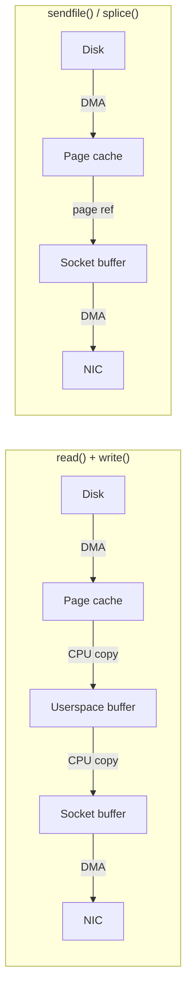

# Zero-copy I/O: splice, sendfile, and friends

> Moving data between file descriptors without touching userspace

## The problem: unnecessary copies

The naive way to serve a file over a network socket is:

```c
/* Classic read+write loop — two copies, four context switches */
char buf[65536];
ssize_t n;
while ((n = read(file_fd, buf, sizeof buf)) > 0)
    write(sock_fd, buf, n);
```

Every iteration pays a full round trip through userspace. To understand why that hurts, trace what the kernel actually does:

```
┌─────────────────────────────────────────────────────────────────┐
│  Traditional read() + write() data path                         │
│                                                                  │
│  1. read(file_fd, buf, n)                                        │
│     ┌──────┐  DMA   ┌───────────────┐  CPU copy  ┌──────────┐   │
│     │ Disk │──────► │ Kernel page   │──────────► │ Userspace│   │
│     └──────┘        │ cache         │            │ buffer   │   │
│                     └───────────────┘            └──────────┘   │
│                                                                  │
│  2. write(sock_fd, buf, n)                                       │
│     ┌──────────┐  CPU copy  ┌───────────────┐  DMA   ┌─────┐   │
│     │ Userspace│──────────► │ Socket send   │──────► │ NIC │   │
│     │ buffer   │            │ buffer (sk_buff│        └─────┘   │
│     └──────────┘            └───────────────┘                   │
│                                                                  │
│  Copies: 4 (disk→pagecache, pagecache→user, user→skbuff,        │
│             skbuff→NIC)                                          │
│  Context switches: 4 (user→kernel read, kernel→user,            │
│                        user→kernel write, kernel→user)           │
└─────────────────────────────────────────────────────────────────┘
```

For a static file web server pushing hundreds of megabytes per second, those CPU copies add up. The kernel page cache already holds the file data; the network stack needs a reference to it. The copies through userspace are pure overhead.

Linux provides three syscalls that eliminate them: `sendfile(2)`, `splice(2)`, and `vmsplice(2)`. A fourth, `copy_file_range(2)`, eliminates copies for file-to-file transfers.



The zero-copy path passes a **page reference** (a pointer and length) rather than copying bytes. The NIC's scatter-gather DMA then reads directly from the page cache page. No CPU is involved in moving the data bytes at all.

---

## `sendfile(2)` — file to socket without userspace

`sendfile` was added in Linux 2.2 and is the simplest zero-copy interface. It transfers data from a file directly to a socket inside the kernel.

```c
#include <sys/sendfile.h>

ssize_t sendfile(int out_fd, int in_fd, off_t *offset, size_t count);
```

- `out_fd` — must be a socket (or a pipe on kernels >= 2.6.33)
- `in_fd` — must be a regular file or block device; supports `mmap`-style access
- `offset` — if non-NULL, read starts here and is updated on return; the file's position is unchanged
- `count` — bytes to transfer; kernel loops internally until `count` bytes sent or error

```c
/* Serve a file over HTTP — the canonical sendfile pattern */
#include <sys/sendfile.h>
#include <sys/stat.h>
#include <fcntl.h>

void serve_file(int sock_fd, const char *path)
{
    int file_fd = open(path, O_RDONLY);
    if (file_fd < 0) { /* handle error */ return; }

    struct stat st;
    fstat(file_fd, &st);

    off_t offset = 0;
    ssize_t remaining = st.st_size;

    while (remaining > 0) {
        ssize_t sent = sendfile(sock_fd, file_fd, &offset, remaining);
        if (sent < 0) {
            if (errno == EAGAIN || errno == EINTR) continue;
            break;  /* real error */
        }
        remaining -= sent;
    }

    close(file_fd);
}
```

### What sendfile does in the kernel

Internally `sendfile` calls `do_sendfile` in `fs/read_write.c`, which:

1. Calls `in_file->f_op->splice_read` to populate a temporary pipe with page references from the file
2. Calls `sock_sendpage` (or `generic_splice_sendpage`) to pass those page references into the socket's send buffer as `skb_frag_t` entries
3. If the NIC supports scatter-gather DMA (`NETIF_F_SG`), the NIC reads the page cache pages directly — zero CPU copies

Without NIC scatter-gather support, the kernel falls back to a single copy from page cache into a contiguous `sk_buff` — still one copy fewer than the `read+write` path.

### Non-blocking sendfile

Linux's `sendfile(2)` takes no flags argument. To get non-blocking behavior, set `O_NONBLOCK` on the output socket. When the socket buffer is full, `sendfile` returns `EAGAIN`.

```c
/* Set output socket non-blocking for async sendfile */
fcntl(sock_fd, F_SETFL, O_NONBLOCK);
/* sendfile returns EAGAIN if socket buffer full */
ret = sendfile(sock_fd, file_fd, &offset, len);
if (ret == -1 && errno == EAGAIN) {
    /* wait for socket writability with poll/epoll */
}
```

### nginx and sendfile

nginx enables `sendfile` by default:

```nginx
http {
    sendfile        on;
    tcp_nopush      on;   # TCP_CORK: batch small headers with first data chunk
    tcp_nodelay     on;   # flush after cork releases
    sendfile_max_chunk 512k;   # limit per-call to avoid starving other connections
}
```

`tcp_nopush` sets `TCP_CORK` before `sendfile` so the HTTP headers and the start of the file body go out in one TCP segment, then the cork is released.

### sendfile limitations

- `out_fd` must be a socket (or a pipe); file-to-file doesn't work
- Cannot interpose a transform (compression, encryption) — those require touching the data
- HTTPS cannot use sendfile without kTLS (`SO_TLS_TX`); see [kTLS](../net/ktls.md)
- Offsets are limited to `off_t` size — use `sendfile64` (which glibc maps to `sendfile` on 64-bit)

---

## `splice(2)` — the generalisation

`splice` was introduced in Linux 2.6.17 by Jens Axboe, generalising the file-to-socket case. It transfers data between any two file descriptors where **at least one is a pipe**.

```c
#define _GNU_SOURCE
#include <fcntl.h>

ssize_t splice(int fd_in,  loff_t *off_in,
               int fd_out, loff_t *off_out,
               size_t len, unsigned int flags);
```

- `fd_in` / `fd_out` — source and destination; one must be a pipe
- `off_in` / `off_out` — file offsets (updated on return); must be NULL for pipes
- `len` — maximum bytes to move in this call
- `flags` — `SPLICE_F_MOVE | SPLICE_F_NONBLOCK | SPLICE_F_MORE | SPLICE_F_GIFT`

### Flags

| Flag | Meaning |
|------|---------|
| `SPLICE_F_MOVE` | Hint: move pages rather than copy (may be ignored by kernel) |
| `SPLICE_F_NONBLOCK` | Do not block on pipe I/O; file I/O may still block |
| `SPLICE_F_MORE` | More data is coming; hint for socket layer (like `MSG_MORE`) |
| `SPLICE_F_GIFT` | Used with `vmsplice`: user pages are gifted to the kernel permanently |

### File to socket via a pipe

`sendfile` can be emulated with two `splice` calls through a pipe:

```c
/* splice-based file-to-socket (generalises sendfile) */
int pfd[2];
pipe(pfd);

off_t offset = 0;
ssize_t remaining = file_size;

while (remaining > 0) {
    /* Step 1: file → pipe read-end  (adds page refs to pipe buffer) */
    ssize_t n = splice(file_fd, &offset, pfd[1], NULL,
                       remaining, SPLICE_F_MOVE | SPLICE_F_MORE);
    if (n <= 0) break;

    /* Step 2: pipe write-end → socket  (sends page refs as skb frags) */
    ssize_t sent = 0;
    while (sent < n) {
        ssize_t r = splice(pfd[0], NULL, sock_fd, NULL,
                           n - sent, SPLICE_F_MOVE | SPLICE_F_MORE);
        if (r <= 0) goto done;
        sent += r;
    }
    remaining -= n;
}
done:
close(pfd[0]);
close(pfd[1]);
```

### Valid splice combinations

```
file  → pipe  ✓   (adds page refs from page cache into pipe)
pipe  → file  ✓   (writes pipe buffer pages into a file)
pipe  → socket ✓  (passes pipe buffer pages as socket frags)
pipe  → pipe  ✓   (moves pipe_buffer references between pipes)
file  → file  ✗   (EINVAL — neither fd is a pipe)
socket → pipe ✓   (drains socket receive buffer into pipe)
```

---

## `tee(2)` — duplicating pipe data without consuming it

`tee` copies data between two pipe file descriptors without removing it from the source. Pages are shared by reference; no bytes are copied.

```c
ssize_t tee(int fd_in, int fd_out, size_t len, unsigned int flags);
```

Both `fd_in` and `fd_out` must be pipes. After `tee`, the data remains readable from `fd_in` and is also available in `fd_out`.

### Log-and-forward pattern

```c
/*
 * Read from a source, log every byte to disk,
 * and simultaneously forward to a downstream socket.
 */
int src_pipe[2];    /* data arrives here */
int log_pipe[2];    /* copy for logging */

pipe(src_pipe);
pipe(log_pipe);

/* Producer fills src_pipe[1] */

/* --- Consumer loop --- */
while (1) {
    /* 1. Duplicate src_pipe → log_pipe (pages shared, not consumed) */
    ssize_t n = tee(src_pipe[0], log_pipe[1], 65536, SPLICE_F_NONBLOCK);
    if (n < 0 && errno == EAGAIN) {
        /* nothing to tee yet */
        poll_on(src_pipe[0]);
        continue;
    }

    /* 2. Flush log_pipe to disk (consumes log_pipe side) */
    splice(log_pipe[0], NULL, log_fd, &log_offset, n, SPLICE_F_MOVE);

    /* 3. Consume from src_pipe → downstream socket */
    splice(src_pipe[0], NULL, downstream_fd, NULL, n, SPLICE_F_MOVE);
}
```

This is the basis of `tee(1)` in GNU coreutils — it uses `tee(2)` internally when both source and destination are pipes.

---

## How splice works internally

### The pipe as a page-reference queue

The central data structure is `struct pipe_inode_info` (`include/linux/pipe_fs_i.h`), which contains a ring of `struct pipe_buffer` entries:

```c
/* include/linux/pipe_fs_i.h */
struct pipe_buffer {
    struct page             *page;    /* the actual page */
    unsigned int             offset;  /* byte offset within the page */
    unsigned int             len;     /* byte count */
    const struct pipe_buf_operations *ops;
    unsigned int             flags;
    unsigned long            private;
};

struct pipe_inode_info {
    struct mutex             mutex;
    wait_queue_head_t        rd_wait, wr_wait;
    unsigned int             head;    /* index of next slot to write */
    unsigned int             tail;    /* index of next slot to read */
    unsigned int             ring_size;
    unsigned int             nr_accounted;
    unsigned int             readers;
    unsigned int             writers;
    unsigned int             files;
    unsigned int             r_counter;
    unsigned int             w_counter;
    unsigned int             poll_usage;
    struct page             *tmp_page;
    struct fasync_struct    *fasync_readers;
    struct fasync_struct    *fasync_writers;
    struct pipe_buffer      *bufs;   /* ring buffer of pipe_buffer */
    struct user_struct      *user;
#ifdef CONFIG_WATCH_QUEUE
    struct watch_queue      *watch_queue;
#endif
};
```

When `splice(file_fd, ..., pipe_wr, ...)` runs, `do_splice_to` calls `file->f_op->splice_read` (e.g., `filemap_splice_read` for regular files). This function finds the pages in the page cache and installs references to them — not copies — as `pipe_buffer` entries in the pipe ring. The page's reference count is incremented; no data moves.

When `splice(pipe_rd, ..., sock_fd, ...)` runs, `do_splice_from` calls `sock_splice_write` (or the socket's `splice_write` file operation). For TCP, this calls `tcp_sendpage`, which attaches the page as a fragment in an `sk_buff` — again by reference, not by copy.

The bytes finally leave the machine when the NIC's DMA engine reads the page cache page directly, driven by the scatter-gather descriptor in the transmit ring.

### splice_from_pipe and splice_to_pipe

The kernel exports two helpers used by filesystem and socket drivers:

```c
/* fs/splice.c — called by socket/file splice_write implementations */
ssize_t splice_from_pipe(struct pipe_inode_info *pipe,
                         struct file *out,
                         loff_t *ppos, size_t len,
                         unsigned int flags,
                         splice_actor *actor);

/* fs/splice.c — called by file splice_read implementations */
ssize_t splice_to_pipe(struct pipe_inode_info *pipe,
                       struct splice_pipe_desc *spd);
```

`splice_from_pipe` iterates over the pipe's `pipe_buffer` ring and calls the `actor` callback (e.g., `pipe_to_sendpage` for sockets, `pipe_to_file` for files) once per buffer. The actor hands the page off without copying it.

### When splice must fall back to copying

Not all combinations are truly zero-copy at the kernel level:

- **`O_DIRECT` files**: Direct I/O bypasses the page cache, so there are no cached pages to reference. The kernel must copy into a temporary page.
- **Certain encrypted filesystems**: fscrypt-encrypted files store ciphertext in the page cache. Splice would expose ciphertext to the receiving socket; the kernel refuses and returns `EOPNOTSUPP`, forcing the caller to decrypt through userspace.
- **Network filesystems (NFS, CIFS)**: Remote pages may not be pinnable in the same way; the implementation falls back to a kernel-level copy.
- **Pipes with `O_DIRECT` set** (`F_SETPIPE_SZ` with `O_DIRECT` semantics on older kernels): forces packet-mode behaviour.

---

## Comparison: sendfile vs splice vs io_uring vs MSG_ZEROCOPY

| Feature | `sendfile` | `splice` | `io_uring IORING_OP_SPLICE` | `MSG_ZEROCOPY` |
|---------|-----------|---------|----------------------------|----------------|
| Kernel version | 2.2 | 2.6.17 | 5.7 | 4.14 |
| Zero-copy (with SG NIC) | Yes | Yes | Yes | Yes |
| Works file→socket | Yes | Via pipe | Via pipe | N/A (send only) |
| Works file→file | No | Via pipe | Via pipe | No |
| Needs a pipe fd | No | Yes | Yes | No |
| Async / non-blocking | No (blocks for disk) | No | Yes (submission queue) | Callback via `SO_EE_ORIGIN_ZEROCOPY` |
| Complexity | Low | Medium | Medium | High |
| Typical use case | Static file serving | Pipelines, log shipping | High-concurrency servers | High-throughput senders |
| Transform possible | No | No | No | No |

### io_uring splice

`IORING_OP_SPLICE` was added in Linux 5.7 and allows chaining splice operations asynchronously in an io_uring submission ring:

```c
#include <liburing.h>

/* Chain: file → pipe → socket, all submitted as one batch */
void submit_splice_chain(struct io_uring *ring,
                         int file_fd, off_t file_off,
                         int pipe_wr, int pipe_rd,
                         int sock_fd, size_t len)
{
    struct io_uring_sqe *sqe;

    /* SQE 1: file → pipe write-end */
    sqe = io_uring_get_sqe(ring);
    io_uring_prep_splice(sqe, file_fd, file_off, pipe_wr, -1,
                         len, SPLICE_F_MOVE);
    io_uring_sqe_set_flags(sqe, IOSQE_IO_LINK);

    /* SQE 2: pipe read-end → socket (linked, runs after SQE 1) */
    sqe = io_uring_get_sqe(ring);
    io_uring_prep_splice(sqe, pipe_rd, -1, sock_fd, -1,
                         len, SPLICE_F_MOVE);

    io_uring_submit(ring);
    /* Completions arrive in the CQ ring — no thread blocks */
}
```

### MSG_ZEROCOPY

`MSG_ZEROCOPY` (Linux 4.14, `include/uapi/linux/socket.h`) is different in character: it operates on `send(2)` / `sendmsg(2)` and tells the kernel to hold the user buffer pages rather than copying them into socket buffers. The application gets a notification via the socket error queue (`SO_EE_ORIGIN_ZEROCOPY`) when the kernel is done with the pages.

```c
/* Enable on socket */
int one = 1;
setsockopt(sock_fd, SOL_SOCKET, SO_ZEROCOPY, &one, sizeof one);

/* Send without copying */
send(sock_fd, buf, len, MSG_ZEROCOPY);

/* Wait for completion notification */
struct msghdr msg = {};
struct iovec  iov;
char control[100];
msg.msg_control    = control;
msg.msg_controllen = sizeof control;
recvmsg(sock_fd, &msg, MSG_ERRQUEUE);
/* parse cmsg for SO_EE_ORIGIN_ZEROCOPY range */
```

`MSG_ZEROCOPY` is best for large `send` calls (> ~10 KB); for small sends the notification overhead exceeds the copy cost. It also requires the application to track in-flight buffers carefully.

---

## `vmsplice(2)` — userspace memory into a pipe

`vmsplice` splices userspace virtual memory into a pipe, allowing user pages to be passed to the kernel without copying.

```c
#define _GNU_SOURCE
#include <fcntl.h>
#include <sys/uio.h>

ssize_t vmsplice(int fd, const struct iovec *iov,
                 unsigned long nr_segs, unsigned int flags);
```

`fd` must be the write end of a pipe. Each `iovec` describes a range of the caller's virtual address space.

### SPLICE_F_GIFT

Without `SPLICE_F_GIFT`, the kernel copies the pages before they enter the pipe (because the user might modify them before the pipe consumer reads them). With `SPLICE_F_GIFT`, the user promises not to modify or free the pages — the kernel accepts them as a gift and maps them directly into the pipe ring:

```c
/* Producer: hand off a page-aligned buffer to the kernel (zero-copy) */
void *buf;
posix_memalign(&buf, getpagesize(), BUF_SIZE);

/* Fill buf ... */

struct iovec iov = { .iov_base = buf, .iov_len = BUF_SIZE };

/*
 * SPLICE_F_GIFT: kernel owns these pages now.
 * Do NOT access buf after this call.
 */
ssize_t n = vmsplice(pipe_wr, &iov, 1, SPLICE_F_GIFT);
/* buf is now a kernel page; the application must not touch it */

/* Consumer can splice pipe_rd → socket / file zero-copy */
splice(pipe_rd, NULL, sock_fd, NULL, n, SPLICE_F_MOVE);
```

`SPLICE_F_GIFT` is effectively a zero-copy transfer of user pages to the kernel. `SPLICE_F_GIFT` is a user-space contract — the kernel trusts the caller not to modify the pages after the gift. There is no kernel-level enforcement; the kernel does NOT unmap the pages from the calling process. Accessing `buf` after the gift is undefined behaviour that may silently corrupt data in the pipe, but will not cause a segfault or other kernel protection. In practice, `vmsplice` + `SPLICE_F_GIFT` is used in high-performance message brokers and kernel bypass-adjacent code.

---

## Practical patterns

### Pattern 1: nginx-style static file serving

This is the fundamental zero-copy web server loop. Real nginx uses `sendfile` directly; the splice version shown below works for any socket type:

```c
#define _GNU_SOURCE
#include <fcntl.h>
#include <sys/sendfile.h>
#include <sys/socket.h>
#include <sys/stat.h>
#include <unistd.h>
#include <errno.h>

#define CHUNK (1 << 20)   /* 1 MiB per sendfile call — avoids starvation */

/*
 * serve_static: send file_fd contents to sock_fd using sendfile.
 *
 * Returns 0 on success, -1 on error.
 */
int serve_static(int sock_fd, int file_fd)
{
    struct stat st;
    if (fstat(file_fd, &st) < 0)
        return -1;

    off_t  offset    = 0;
    size_t remaining = (size_t)st.st_size;

    while (remaining > 0) {
        size_t  chunk = remaining < CHUNK ? remaining : CHUNK;
        ssize_t sent  = sendfile(sock_fd, file_fd, &offset, chunk);

        if (sent < 0) {
            if (errno == EINTR)  continue;
            if (errno == EAGAIN) {
                /* Socket send buffer full: wait for writability */
                fd_set wfds;
                FD_ZERO(&wfds);
                FD_SET(sock_fd, &wfds);
                select(sock_fd + 1, NULL, &wfds, NULL, NULL);
                continue;
            }
            return -1;
        }
        remaining -= (size_t)sent;
    }
    return 0;
}
```

### Pattern 2: splice-based log shipping with tee

Forward a byte stream to both a log file and a downstream service, zero-copy:

```c
#define _GNU_SOURCE
#include <fcntl.h>
#include <poll.h>
#include <unistd.h>

#define BUF 65536

/*
 * log_and_forward:
 *   reads from src_fd (e.g., stdin or a socket),
 *   writes all bytes to log_fd,
 *   and forwards all bytes to fwd_fd.
 */
void log_and_forward(int src_fd, int log_fd, int fwd_fd)
{
    int a[2], b[2];   /* a = primary pipe, b = tee copy */
    pipe(a);
    pipe(b);

    while (1) {
        /* 1. Drain src into primary pipe */
        ssize_t n = splice(src_fd, NULL, a[1], NULL,
                           BUF, SPLICE_F_MOVE);
        if (n <= 0) break;

        /* 2. Duplicate a[0] → b[1] without consuming a[0] */
        ssize_t t = tee(a[0], b[1], n, 0);
        if (t < n) break;  /* partial tee is unusual but possible */

        /* 3. Forward b[0] → downstream (consumes b side) */
        while (t > 0) {
            ssize_t r = splice(b[0], NULL, fwd_fd, NULL,
                               t, SPLICE_F_MOVE);
            if (r <= 0) goto done;
            t -= r;
        }

        /* 4. Write a[0] → log file (consumes a side) */
        ssize_t w = n;
        while (w > 0) {
            ssize_t r = splice(a[0], NULL, log_fd, NULL,
                               w, SPLICE_F_MOVE);
            if (r <= 0) goto done;
            w -= r;
        }
    }
done:
    close(a[0]); close(a[1]);
    close(b[0]); close(b[1]);
}
```

### Pattern 3: pipe-stage data processing

When a transformation is required (e.g., prepend a header to each message), splice the data around the transform:

```c
/*
 * Process a stream: read chunks from src, prepend a 4-byte
 * length header, and send to dst. Only the header goes
 * through userspace; the payload is spliced.
 */
void framed_forward(int src_fd, int dst_sock)
{
    int p[2];
    pipe(p);

    while (1) {
        /* Peek at available data */
        ssize_t n = splice(src_fd, NULL, p[1], NULL,
                           65536, SPLICE_F_MOVE | SPLICE_F_NONBLOCK);
        if (n < 0 && errno == EAGAIN) {
            struct pollfd pf = { .fd = src_fd, .events = POLLIN };
            poll(&pf, 1, -1);
            continue;
        }
        if (n <= 0) break;

        /* Write 4-byte header through userspace (tiny, unavoidable) */
        uint32_t hdr = htonl((uint32_t)n);
        send(dst_sock, &hdr, 4, MSG_MORE);

        /* Splice payload zero-copy */
        splice(p[0], NULL, dst_sock, NULL, n, SPLICE_F_MOVE);
    }
    close(p[0]); close(p[1]);
}
```

---

## When zero-copy doesn't help

Zero-copy is not universally beneficial. Understand the cases where it hurts or doesn't apply:

### Small files

`sendfile` and `splice` have per-call overhead: syscall entry, pipe buffer allocation, page reference management, and scatter-gather descriptor setup. For files smaller than roughly 64 KB, this overhead can exceed the cost of a simple `read+write` with a hot CPU cache. Static asset servers often use `sendfile` only for files above a configurable threshold.

### HTTPS without kTLS

TLS encryption requires reading plaintext, encrypting it, and writing ciphertext. The CPU *must* touch the data. `sendfile` cannot help unless **kTLS** (`SO_TLS_TX`) is in use (Linux 4.17+). With kTLS, the kernel's TLS record layer encrypts pages on their way to the NIC, preserving zero-copy for the file-to-network segment. See [kTLS](../net/ktls.md).

Without kTLS:

```
Disk → page cache → CPU decrypt (TLS record) → socket buffer → NIC
                      ↑
             userspace (or kTLS) must touch every byte
```

### Compressed content

Sending gzip or Brotli-compressed files can use `sendfile` fine — the compressed bytes are already in the page cache. However, *on-the-fly compression* (as nginx does with `gzip on`) requires reading and compressing in userspace, so zero-copy provides no benefit for that path.

### Content transformations

Any transformation — substitution, encoding conversion, image resizing — requires touching the bytes. In those cases, the only optimisation available is to minimise extra copies (use `O_DIRECT` + `mmap` for the source, write directly to the socket buffer), not `splice` or `sendfile`.

### High-frequency small sends (MSG_ZEROCOPY)

`MSG_ZEROCOPY` has a per-send completion notification that must be collected from the error queue. For messages smaller than ~10 KB, the synchronisation cost dominates. Benchmarks from the Linux networking team suggest the break-even point is around 10–100 KB depending on the workload.

### NUMA effects

When the NIC and the page cache are on different NUMA nodes, the DMA read that the NIC performs crosses the interconnect. This is inherent to the hardware topology and not something splice can fix. For latency-sensitive paths on multi-socket systems, pin worker threads and their page allocations to the NUMA node local to the NIC.

---

## `copy_file_range(2)` — server-side file copy

`copy_file_range` was added in Linux 4.5. It copies bytes between two file descriptors entirely within the kernel — no userspace buffer involved.

```c
#define _GNU_SOURCE
#include <unistd.h>

ssize_t copy_file_range(int fd_in,  loff_t *off_in,
                        int fd_out, loff_t *off_out,
                        size_t len, unsigned int flags);
```

`flags` is currently unused and must be 0. `off_in` and `off_out` are optional; if NULL, the file's current position is used.

### The filesystem shortcut

The kernel calls the filesystem's `copy_file_range` operation first:

```c
/* fs/read_write.c */
SYSCALL_DEFINE6(copy_file_range, ...)
{
    /* Try filesystem-specific implementation */
    if (out_file->f_op->copy_file_range) {
        ret = out_file->f_op->copy_file_range(file_in, pos_in,
                                               file_out, pos_out,
                                               len, flags);
        if (ret != -EOPNOTSUPP && ret != -EXDEV)
            return ret;
    }
    /* Fallback: do_splice_direct — splice-based kernel copy */
    return do_splice_direct(file_in, &pos_in, file_out, &pos_out,
                            len, 0);
}
```

On filesystems that implement it:

- **Btrfs** (`btrfs_copy_file_range`): performs a **reflink** — the destination file shares the source's extent tree nodes, with copy-on-write semantics. The copy completes in microseconds regardless of file size; no data is read from or written to disk.
- **XFS** (with `reflink=1` mount option, Linux 4.16+): same reflink semantics.
- **NFS v4.2+** (`nfs42_copy_file_range`): delegates to `COPY` operation on the server — the server copies internally.
- **SMB3** (`smb2_copychunk_range`): uses the `IOCTL FSCTL_SRV_COPYCHUNK` operation.
- **All others**: fall back to `do_splice_direct`, which opens a temporary pipe and uses splice internally. Still zero userspace copies, but not instantaneous.

### Reflink: copy-on-write file copies

```
Before copy_file_range on Btrfs:
  src inode ──► [leaf A] ──► [extent: blocks 0..127]
                [leaf B] ──► [extent: blocks 128..255]

After copy_file_range (reflink):
  src inode ──► [leaf A] ──► [extent: blocks 0..127]   ◄── shared
  dst inode ──► [leaf A']    [extent: blocks 0..127]   ──┘

  A write to dst block 0 triggers copy-on-write:
  dst inode ──► [new leaf]──► [new extent: blocks 0..127 (private)]
```

The practical effect: `cp --reflink=always large-file copy` returns instantly:

```bash
# Check filesystem reflink support
cp --reflink=always src.img dst.img   # error if not supported
cp --reflink=auto   src.img dst.img   # silently falls back to copy

# XFS: verify reflink is enabled
xfs_info /mount/point | grep reflink

# Btrfs: always supported on modern kernels
```

### copy_file_range and cross-filesystem copies

`copy_file_range` returns `-EXDEV` when `fd_in` and `fd_out` are on different filesystems (or different mounts of the same filesystem). The kernel falls back to `do_splice_direct` in this case since Linux 5.3; earlier kernels returned the error to userspace.

### Comparison with splice for file copies

| | `splice` (via pipe) | `copy_file_range` |
|--|--------------------|--------------------|
| Needs pipe fd | Yes | No |
| Works file→file | Yes (via pipe) | Yes (direct) |
| Reflink support | No | Yes (on capable FS) |
| Cross-fs | Yes | No (EXDEV) |
| Typical speed | Fast (page refs) | Instantaneous (reflink) |

---

## Kernel source references

The implementation lives in two main files:

- `fs/splice.c` — `sys_splice`, `sys_tee`, `sys_vmsplice`, `do_splice_to`, `do_splice_from`, `splice_pipe_to_pipe`, `splice_from_pipe`, `filemap_splice_read`, `generic_splice_sendpage`
- `include/linux/splice.h` — `struct splice_pipe_desc`, `splice_actor` typedef, `splice_from_pipe` / `splice_to_pipe` prototypes, pipe buffer operation tables
- `fs/read_write.c` — `sys_sendfile64`, `do_sendfile`, `sys_copy_file_range`, `do_splice_direct`
- `include/linux/pipe_fs_i.h` — `struct pipe_inode_info`, `struct pipe_buffer`, `struct pipe_buf_operations`
- `net/socket.c` — `sock_splice_read`, `sock_splice_write` (socket-side splice hooks)

---

## Further reading

- [Buffered I/O and the page cache](buffered-io.md) — what splice's page references point into
- [Direct I/O](direct-io.md) — why O_DIRECT and splice don't mix well
- [io_uring: Operations](../io-uring/io-uring-ops.md) — `IORING_OP_SPLICE` and `IORING_OP_TEE`
- [kTLS](../net/ktls.md) — zero-copy HTTPS via in-kernel TLS
- [splice, sendfile, copy_file_range (VFS layer)](../vfs/splice-sendfile.md) — VFS-level view of the same syscalls
- [Page cache](../mm/page-cache.md) — page reference counting that makes zero-copy safe
- `fs/splice.c` — canonical implementation
- `include/linux/splice.h` — data structures and exported helpers
