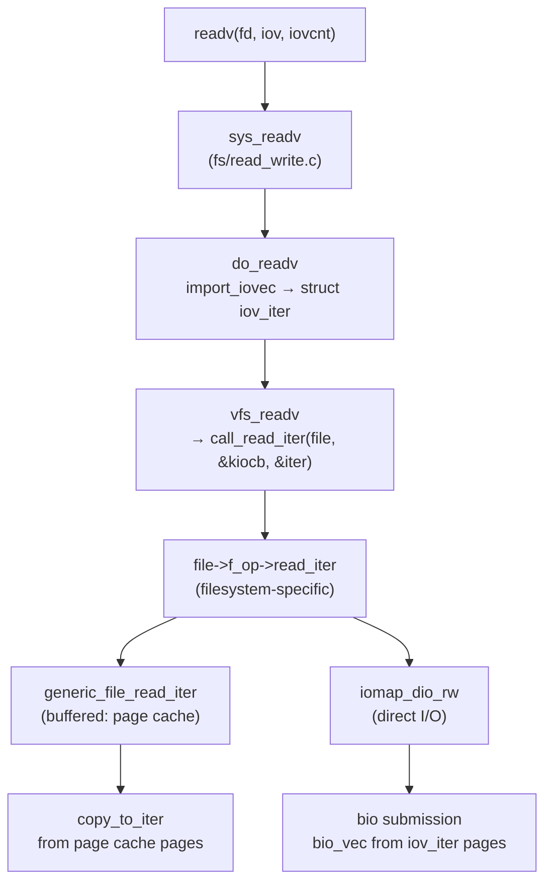

# Vectored I/O (Scatter-Gather)

> readv/writev: one syscall, multiple buffers — the kernel's scatter-gather interface

## What vectored I/O is

A single `read()` or `write()` call works with one contiguous buffer. Real applications rarely have data in one place: a network packet has a fixed header, a variable-length payload, and sometimes a trailer. Building a contiguous buffer requires an extra `malloc` and `memcpy`.

Vectored I/O solves this with an array of `(pointer, length)` pairs called an **iovec**. One syscall scatters data into or gathers data from multiple non-contiguous buffers:

```
writev(fd, iov, 3):
  iov[0] → [header buf, 20 bytes]  ─┐
  iov[1] → [payload buf, 512 bytes] ├─→ written atomically as 532 bytes
  iov[2] → [trailer buf, 4 bytes]  ─┘

readv(fd, iov, 3):
  disk/socket ─┬→ [header buf, 20 bytes]
               ├→ [payload buf, 512 bytes]
               └→ [trailer buf, 4 bytes]
```

### The atomicity guarantee

The POSIX specification — and the Linux implementation — guarantees that a `readv()` or `writev()` is **atomic at the file level**: the combined transfer appears as a single operation. Another writer on a pipe or regular file cannot interleave between the vectors. This is the key difference from calling `write()` three times in a row, where another process sharing the fd can interpose writes between your calls.

### The syscall family

| Syscall | Description |
|---------|-------------|
| `readv(fd, iov, iovcnt)` | Scatter read from current file position |
| `writev(fd, iov, iovcnt)` | Gather write to current file position |
| `preadv(fd, iov, iovcnt, offset)` | Scatter read at explicit offset |
| `pwritev(fd, iov, iovcnt, offset)` | Gather write at explicit offset |
| `preadv2(fd, iov, iovcnt, offset, flags)` | `preadv` + per-call flags |
| `pwritev2(fd, iov, iovcnt, offset, flags)` | `pwritev` + per-call flags |

---

## `struct iovec` and the syscall interface

The user-space structure is defined in `include/uapi/linux/uio.h`:

```c
struct iovec {
    void  *iov_base;   /* starting address of the buffer */
    size_t iov_len;    /* number of bytes in this buffer */
};
```

The total transfer is the sum of all `iov_len` values. Buffers need not be contiguous in memory, and they need not be the same size.

### IOV_MAX

POSIX defines `IOV_MAX` as the maximum number of `iovec` entries per call. On Linux this is **1024** (`UIO_MAXIOV` in `include/uapi/linux/uio.h`). Passing more than 1024 vectors returns `EINVAL`. In practice, exceeding a few dozen vectors is unusual — use `sendfile` or `splice` when you need to send many disjoint ranges.

```c
#include <limits.h>   /* IOV_MAX */
#include <sys/uio.h>

/* Verify at compile time */
_Static_assert(IOV_MAX >= 16, "need at least 16 vectors");
```

### `preadv2`/`pwritev2` flags

The `flags` argument to `preadv2`/`pwritev2` gives per-call control without reopening the file:

| Flag | Value | Meaning |
|------|-------|---------|
| `RWF_HIPRI` | `0x01` | Poll for completion (NVMe polled queues); requires `O_DIRECT` |
| `RWF_DSYNC` | `0x02` | Data-sync semantics for this write (like `O_DSYNC`) |
| `RWF_SYNC` | `0x04` | Full sync for this write (metadata + data, like `O_SYNC`) |
| `RWF_NOWAIT` | `0x08` | Return `EAGAIN` instead of blocking (page cache hit or miss) |
| `RWF_APPEND` | `0x10` | Atomic append: write at end-of-file regardless of `offset` |

These flags are defined in `include/uapi/linux/fs.h` as the `rwf_t` type.

---

## `iov_iter` — the kernel's unified I/O iterator

The kernel does not pass raw `iovec` arrays all the way down to filesystems and drivers. Instead, the VFS translates the user-space `iovec` into a `struct iov_iter` — a single abstraction that all layers speak.

`struct iov_iter` is defined in `include/linux/uio.h`:

```c
struct iov_iter {
    u8 iter_type;          /* ITER_IOVEC, ITER_KVEC, ITER_BVEC,
                              ITER_XARRAY, ITER_PIPE, ITER_UBUF */
    bool nofault;
    bool data_source;      /* WRITE (true) or READ (false) */
    size_t iov_offset;     /* bytes consumed in current segment */
    union {
        /* ITER_IOVEC / ITER_UBUF */
        struct {
            union {
                const struct iovec *__iov;
                const struct kvec  *kvec;
                const struct bio_vec *bvec;
                struct xarray      *xarray;
                struct pipe_inode_info *pipe;
                void __user        *ubuf;
            };
            size_t count;  /* bytes remaining */
        };
    };
    /* ... pipe-specific fields omitted ... */
};
```

### Iterator flavours

| `iter_type` | Backing store | Used by |
|-------------|--------------|---------|
| `ITER_IOVEC` | User-space `struct iovec[]` | Syscalls from user space |
| `ITER_KVEC` | Kernel `struct kvec[]` | Kernel-internal I/O |
| `ITER_BVEC` | `struct bio_vec[]` | Block layer / DMA |
| `ITER_XARRAY` | Page cache xarray | `iomap`, direct-I/O |
| `ITER_PIPE` | Pipe ring buffer | `splice`, `sendfile` |
| `ITER_UBUF` | Single user buffer | Optimised single-vector fast path |

### Core iterator operations (`lib/iov_iter.c`)

```c
/* Copy data to user space (read path) */
size_t copy_to_iter(const void *addr, size_t bytes, struct iov_iter *i);

/* Copy data from user space (write path) */
size_t copy_from_iter(void *addr, size_t bytes, struct iov_iter *i);

/* Advance iterator by 'bytes' without copying */
void iov_iter_advance(struct iov_iter *i, size_t bytes);

/* How many bytes remain in the iterator */
size_t iov_iter_count(const struct iov_iter *i);

/* Revert the last advance (used on partial writes) */
void iov_iter_revert(struct iov_iter *i, size_t bytes);
```

### Why this abstraction exists

Before `iov_iter`, each layer (network, VFS, block) handled scatter-gather differently. `iov_iter` gives a single calling convention: the network `recvmsg` path, the filesystem `read_iter`, and the block layer DMA mapping code all accept an `iov_iter *` and call the same helpers. Code that previously had to special-case `iovec` vs kernel buffer vs page list now handles all cases through one interface.

---

## How `readv` flows through the kernel



The call chain in `fs/read_write.c`:

```c
SYSCALL_DEFINE3(readv, unsigned long, fd,
                const struct iovec __user *, vec, unsigned long, vlen)
{
    return do_readv(fd, vec, vlen, 0);
}

static ssize_t do_readv(unsigned long fd, const struct iovec __user *vec,
                        unsigned long vlen, rwf_t flags)
{
    struct fd f = fdget_pos(fd);
    struct iovec iovstack[UIO_FASTIOV];   /* stack buffer for small counts */
    struct iovec *iov = iovstack;
    struct iov_iter iter;
    ssize_t ret;

    /* Import and validate the user iovec array */
    ret = import_iovec(READ, vec, vlen, ARRAY_SIZE(iovstack), &iov, &iter);
    if (ret < 0)
        return ret;

    ret = do_iter_read(f.file, &iter, &f.file->f_pos, flags);

    kfree(iov);   /* only if heap-allocated (vlen > UIO_FASTIOV) */
    fdput_pos(f);
    return ret;
}
```

`import_iovec` copies the `iovec` array from user space, validates that each `iov_base` is a valid user pointer and `iov_len` is sane, and initialises the `iov_iter`. From this point the iovec is never touched again — everything goes through `iov_iter`.

`do_iter_read` calls `call_read_iter`, which invokes `file->f_op->read_iter`. For ext4 with buffered I/O this reaches `generic_file_read_iter`, which loops over page cache pages calling `copy_page_to_iter` (which internally calls `copy_to_iter`). For O_DIRECT it reaches `iomap_dio_rw`, which maps the iterator pages into `bio_vec` entries and submits them to the block layer.

---

## Scatter-gather for network I/O

The socket layer uses the same scatter-gather concept through `struct msghdr`:

```c
/* include/linux/socket.h */
struct msghdr {
    void            *msg_name;       /* optional address (UDP) */
    int              msg_namelen;
    int              msg_inq;
    struct iov_iter  msg_iter;       /* the actual data iterator */
    /* ... control message fields ... */
    unsigned int     msg_flags;
};
```

User space fills a `struct user_msghdr` with an `iovec` array and calls `sendmsg`/`recvmsg`. The kernel converts it to the internal `msghdr` with `msg_iter` set up as `ITER_IOVEC`.

### Packet headers and payload in separate buffers

A common network pattern: iovec[0] holds a fixed protocol header, iovec[1] holds the payload. This avoids copying the payload into a contiguous buffer just to prepend a header.

```c
#include <sys/socket.h>
#include <sys/uio.h>
#include <netinet/in.h>
#include <string.h>

/* Protocol header (fixed layout) */
struct proto_header {
    uint32_t magic;
    uint32_t payload_len;
    uint16_t msg_type;
    uint16_t flags;
} __attribute__((packed));

ssize_t send_framed(int sockfd, const void *payload, size_t paylen)
{
    struct proto_header hdr = {
        .magic       = htonl(0xDEADBEEF),
        .payload_len = htonl(paylen),
        .msg_type    = htons(1),
        .flags       = 0,
    };

    struct iovec iov[2] = {
        { .iov_base = &hdr,           .iov_len = sizeof(hdr)  },
        { .iov_base = (void *)payload, .iov_len = paylen       },
    };

    struct msghdr msg = {
        .msg_iov    = iov,
        .msg_iovlen = 2,
    };

    return sendmsg(sockfd, &msg, 0);
    /*
     * The kernel gathers hdr + payload into sk_buff fragments.
     * No memcpy of payload into a larger buffer is needed.
     */
}
```

Inside the kernel, `tcp_sendmsg_locked` calls `sk_msg_from_msghdr` (or the TCP zero-copy path) to pull pages directly from the `iov_iter` into `sk_buff` fragments — the payload pages can be sent without being copied to a new allocation.

---

## Block layer scatter-gather — `struct bio_vec`

At the block layer, scatter-gather uses `struct bio_vec` rather than `iovec`. Where `iovec` describes user-space virtual buffers, `bio_vec` describes **physical pages**:

```c
/* include/linux/bvec.h */
struct bio_vec {
    struct page *bv_page;    /* the physical page */
    unsigned int bv_len;     /* bytes in this segment */
    unsigned int bv_offset;  /* offset within the page */
};
```

A `struct bio` carries an array of `bio_vec` entries. Each entry describes a contiguous run of bytes within one page. Non-contiguous physical memory is expressed as multiple `bio_vec` entries.

### Iterating segments

```c
/* include/linux/bio.h */
struct bio_vec bv;
struct bvec_iter iter;

bio_for_each_segment(bv, bio, iter) {
    void *kaddr = kmap_local_page(bv.bv_page);
    /* process bv.bv_len bytes at kaddr + bv.bv_offset */
    kunmap_local(kaddr);
}
```

### DMA scatter-gather at the hardware level

When the block layer submits a `bio` to an NVMe or SATA controller, it converts the `bio_vec` array into a **Physical Region Descriptor Table (PRDT)** or **PRP list** that the DMA engine understands. The DMA engine transfers directly between device and RAM without any CPU copying:

```
bio_vec[0]: page=0x1a000, offset=0, len=4096  ─┐
bio_vec[1]: page=0x3c000, offset=0, len=4096   ├─→ NVMe PRDT entries
bio_vec[2]: page=0x7f000, offset=512, len=3584 ─┘
                                                    ↕ DMA (no CPU involved)
                                                  NVMe SSD controller
```

The physical pages do not have to be contiguous — the DMA engine's scatter-gather capability handles the discontiguous list. This is what makes `O_DIRECT` reads with `iov_iter` efficient: the pages pinned from the user `iovec` become `bio_vec` entries that the DMA engine writes directly.

### `iov_iter` ↔ `bio_vec` conversion

When `iomap_dio_rw` processes a direct I/O request, it calls `iov_iter_get_pages2` to pin the user pages, then builds `bio_vec` entries from them. The `iov_iter` machinery handles the conversion transparently.

---

## `process_vm_readv` / `process_vm_writev`

Linux 3.2 added two syscalls for cross-process vectored I/O:

```c
#include <sys/uio.h>

ssize_t process_vm_readv(pid_t pid,
                         const struct iovec *local_iov,  unsigned long liovcnt,
                         const struct iovec *remote_iov, unsigned long riovcnt,
                         unsigned long flags);

ssize_t process_vm_writev(pid_t pid,
                          const struct iovec *local_iov,  unsigned long liovcnt,
                          const struct iovec *remote_iov, unsigned long riovcnt,
                          unsigned long flags);
```

`local_iov` describes buffers in the **calling** process; `remote_iov` describes buffers in the **target** process (identified by `pid`). The kernel copies data directly between the two address spaces without going through `ptrace`.

### Authorization

The caller must have the equivalent of `PTRACE_MODE_ATTACH_REALCREDS` permission on the target process (same check as `ptrace(PTRACE_ATTACH, ...)`). This means:

- Same UID/GID, or
- `CAP_SYS_PTRACE` capability, and
- The target process must not have set `PR_SET_DUMPABLE` to 0

### Why prefer this over ptrace

`ptrace(PTRACE_PEEKDATA, ...)` reads one word at a time and requires the target to be stopped. `process_vm_readv` reads arbitrarily large regions in a single syscall while the target continues running. Debuggers and memory profilers (e.g., those that snapshot a live process's heap) use this for performance.

```c
/* Read 4 KB from address 0x400000 in process pid */
struct iovec local_iov  = { .iov_base = local_buf, .iov_len = 4096 };
struct iovec remote_iov = { .iov_base = (void *)0x400000, .iov_len = 4096 };

ssize_t n = process_vm_readv(pid, &local_iov, 1, &remote_iov, 1, 0);
if (n < 0)
    perror("process_vm_readv");
```

Note: there is no atomicity guarantee across the two address spaces. The remote process may be modifying the region as you read it.

---

## Performance considerations

### Avoid per-iovec syscall overhead

The main win from vectored I/O is **fewer syscalls**. Each syscall costs a user→kernel→user round trip (~100–300 ns on modern hardware plus TLB flushes). If you are sending a header + payload + checksum, one `writev` is faster than three `write` calls even if the data fits in one page.

```
Three write() calls:             One writev():
  syscall overhead × 3     vs    syscall overhead × 1
  possible interleaving    vs    atomic at file level
  three cache-line fills   vs    one iov[] array prefetch
```

### Ideal iovec granularity

Too many small iovecs hurt: `import_iovec` validates each entry, and the iterator advances one segment at a time. As a rule of thumb:

- Keep `iovcnt` below ~16 for typical request/response protocols.
- Avoid iovecs smaller than a cache line (64 bytes) — the iterator overhead exceeds the copy savings.
- For large payloads split across many pages, prefer `sendfile` or `splice` to avoid pinning user pages.

### `RWF_NOWAIT` for non-blocking page cache reads

`preadv2` with `RWF_NOWAIT` returns `EAGAIN` immediately if the read would block — either because the pages are not in the page cache or because the filesystem would need to take a lock. This is useful for building non-blocking I/O without io_uring:

```c
#include <sys/uio.h>
#include <linux/fs.h>   /* RWF_NOWAIT */

/*
 * Try to read from the page cache without blocking.
 * Returns EAGAIN if pages are not cached — fall back to
 * a blocking read or submit via io_uring.
 */
ssize_t try_cached_read(int fd, void *buf, size_t len, off_t offset)
{
    struct iovec iov = { .iov_base = buf, .iov_len = len };

    ssize_t n = preadv2(fd, &iov, 1, offset, RWF_NOWAIT);
    if (n == -1 && errno == EAGAIN) {
        /* Pages not in cache — would block. Submit async. */
        return -EAGAIN;
    }
    return n;
}
```

`RWF_NOWAIT` is checked in `generic_file_read_iter`: if `iocb->ki_flags & IOCB_NOWAIT` and the page is not in cache, the read returns `-EAGAIN` rather than sleeping in `filemap_get_pages`.

### Multi-part network packet example

```c
#include <sys/uio.h>
#include <sys/socket.h>
#include <netinet/in.h>
#include <stdint.h>
#include <string.h>
#include <errno.h>

/*
 * Reassemble a response from three parts:
 *   [status header 8 bytes] [body N bytes] [CRC32 4 bytes]
 * into separate buffers without a staging allocation.
 */
struct resp_header {
    uint32_t status;
    uint32_t body_len;
};

int recv_response(int fd, struct resp_header *hdr,
                  void *body, size_t body_max,
                  uint32_t *crc_out)
{
    struct iovec iov[3] = {
        { .iov_base = hdr,     .iov_len = sizeof(*hdr)  },
        { .iov_base = body,    .iov_len = body_max       },
        { .iov_base = crc_out, .iov_len = sizeof(uint32_t) },
    };

    ssize_t n = readv(fd, iov, 3);
    if (n < 0)
        return -errno;
    if ((size_t)n < sizeof(*hdr) + sizeof(uint32_t))
        return -EIO;    /* short read — connection closed */

    /*
     * hdr, body, and crc_out are now filled.
     * No intermediate allocation; no memcpy from a flat buffer.
     */
    return 0;
}
```

### `preadv2` with `RWF_NOWAIT` in a poll loop

```c
#include <sys/uio.h>
#include <linux/fs.h>
#include <poll.h>
#include <errno.h>

ssize_t nonblocking_file_read(int fd, struct iovec *iov, int iovcnt,
                               off_t offset)
{
    for (;;) {
        ssize_t n = preadv2(fd, iov, iovcnt, offset, RWF_NOWAIT);
        if (n >= 0)
            return n;

        if (errno == EAGAIN) {
            /* Pages not in cache; wait for the fd to become readable */
            struct pollfd pfd = { .fd = fd, .events = POLLIN };
            poll(&pfd, 1, -1);   /* or use io_uring for true async */
            continue;
        }
        return -errno;
    }
}
```

---

## Kernel source references

| File | Contents |
|------|----------|
| `include/uapi/linux/uio.h` | `struct iovec`, `struct iovmax`, `UIO_MAXIOV` |
| `include/linux/uio.h` | `struct iov_iter`, `iter_type` enum, iterator function prototypes |
| `lib/iov_iter.c` | `copy_to_iter`, `copy_from_iter`, `iov_iter_advance`, `iov_iter_get_pages2` |
| `fs/read_write.c` | `do_readv`, `do_writev`, `do_iter_read`, `do_iter_write` |
| `include/uapi/linux/fs.h` | `RWF_*` flags, `rwf_t` type |
| `include/linux/bvec.h` | `struct bio_vec`, `bvec_iter`, `bio_for_each_segment` |
| `kernel/process_vm_access.c` | `process_vm_readv`, `process_vm_writev` |

---

## Further reading

- [Direct I/O](direct-io.md) — O_DIRECT + preadv2 for database workloads
- [Async I/O Evolution](async-io.md) — io_uring replaces aio for scatter-gather
- [Buffered I/O and the Page Cache](buffered-io.md) — what RWF_NOWAIT tests against
- [Block Layer: bio and request](../block/bio-request.md) — bio_vec and DMA mapping
- [sk_buff: The Network Buffer](../net/sk-buff.md) — how sendmsg iovecs become sk_buff fragments
- [splice, sendfile, copy_file_range](../vfs/splice-sendfile.md) — zero-copy alternatives
