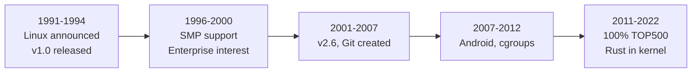

# The Evolution of Linux

> From a hobby project to running the world's infrastructure

## Visual Timeline

## Timeline at a Glance

| Year | Event | Kernel Impact |
|------|-------|---------------|
| 1991 | Linus announces Linux | Monolithic kernel for i386 |
| 1992 | GPL adoption | Community contributions begin |
| 1994 | v1.0 released | Production-ready |
| 1996 | v2.0: SMP support | Multi-processor systems |
| 1999 | v2.2: Enterprise features | Large memory, better networking |
| 2001 | v2.4: Enterprise adoption | IBM, Oracle, SAP support |
| 2003 | v2.6: O(1) scheduler | Scalability improvements |
| 2005 | Git created for kernel | Development scales |
| 2007 | Android announced | Mobile era begins |
| 2008 | v2.6.28: Containers (cgroups) | Cloud foundation |
| 2011 | v3.0: Version numbering change | 20th anniversary |
| 2017 | 100% of TOP500 | Supercomputer dominance |
| 2018 | Meltdown/Spectre | Security hardening era begins |
| 2022 | v6.1: Rust in kernel | Language evolution |

---

## 1991-1994: The Beginning

### The Announcement (August 25, 1991)

Linus Torvalds, a 21-year-old student at University of Helsinki, [posted to `comp.os.minix`](https://www.cs.cmu.edu/~awb/linux.history.html):

> *"I'm doing a (free) operating system (just a hobby, won't be big and professional like gnu) for 386(486) AT clones."*

He was frustrated that MINIX (Andrew Tanenbaum's teaching OS) couldn't be freely modified. Linux 0.01 had:
- Basic process management
- Simple memory management (buddy allocator)
- Minimal filesystem support
- Only ran on `i386`

### The GPL Decision (1992)

Originally under a restrictive license, Torvalds switched to [GPL](https://www.gnu.org/licenses/old-licenses/gpl-2.0.html) in February 1992. This was pivotal - it meant:
- Anyone could contribute
- Improvements had to be shared back
- Companies couldn't make proprietary forks

### The Tanenbaum Debate (January 1992)

Andrew Tanenbaum [declared "Linux is obsolete"](https://www.oreilly.com/openbook/opensources/book/appa.html), arguing:
- Monolithic kernels were outdated
- Microkernels were the future
- Linux was too tied to `i386`

Torvalds defended the pragmatic choice: monolithic was simpler, faster, and actually worked. History sided with Torvalds - Linux runs everywhere while pure microkernels remain niche.

### v1.0 (March 1994)

After 3 years of development, [Linux 1.0](https://cdn.kernel.org/pub/linux/kernel/v1.0/) was released. It supported:
- Networking (`TCP/IP`)
- Loadable kernel modules
- Multiple filesystems
- Virtual memory

---

## 1996-2000: Growing Up

### v2.0: SMP Support (1996)

**The need**: Multi-processor systems were becoming affordable.

**The challenge**: The original kernel assumed single CPU. Adding SMP required:
- Spinlocks for synchronization
- Per-CPU data structures
- Big Kernel Lock (`BKL`) as initial solution

The `BKL` was a single global lock - simple but limited scalability. It took years to eliminate completely. The ["kill the BKL" effort](https://lore.kernel.org/all/alpine.LFD.1.10.0805141452330.3019@woody.linux-foundation.org/T/) began in 2008, and was finally [removed in v2.6.39](https://lore.kernel.org/all/1295993854-4971-1-git-send-email-arnd@arndb.de/T/) (2011).

### Enterprise Interest Begins

By late 1990s, companies noticed Linux:
- **1998**: [Oracle shipped Oracle8 for Linux](https://www.theregister.com/1998/10/09/oracle_aims_oracle8_for_linux/)
- **1999**: [HP formed Linux organization](https://www.linux.co.cr/oem-support/review/1999/0301.html), offered 24x7 support
- **2000**: [IBM invested $1 billion in Linux](https://www.linux.co.cr/oem-support/review/2000/1212.html), Dell shipping Linux servers

**Why?** Free OS that ran on commodity hardware. No licensing fees. Source access for debugging.

### v2.2: Enterprise Features (1999)

- Support for more RAM (`2GB`+)
- Improved networking stack
- Better SMP scalability
- More filesystem options

---

## 2001-2007: Enterprise Dominance

### v2.4: Production Ready (2001)

The kernel that convinced enterprises:
- Journaling filesystems (`ext3`, ReiserFS)
- LVM (Logical Volume Manager)
- USB support
- Better laptop support (ACPI)

**IBM's all-in**: IBM ported Linux to their mainframes (S/390) in 2000, proving it could scale up as well as down.

### The SCO Lawsuit (2003-2007)

[SCO Group sued IBM](https://en.wikipedia.org/wiki/SCO_Group,_Inc._v._International_Business_Machines_Corp.) claiming Linux contained stolen Unix code. The lawsuit:
- Created fear, uncertainty, doubt (FUD)
- Led to better documentation of code origins
- Eventually collapsed (SCO lost, [settled 2021](https://en.wikipedia.org/wiki/SCO%E2%80%93Linux_disputes#Settlement))

The [Groklaw](https://en.wikipedia.org/wiki/SCO%E2%80%93Linux_disputes) website became a community hub for tracking and countering SCO's claims.

Result: Stronger processes for tracking code provenance, [Developer Certificate of Origin (DCO)](https://docs.kernel.org/process/submitting-patches.html#sign-your-work-the-developer-s-certificate-of-origin).

### v2.6: The Scalability Kernel (2003)

Major rewrite with:
- **`O(1)` scheduler**: Constant-time scheduling regardless of process count (later replaced by CFS in v2.6.23, 2007)
- **Preemptible kernel**: Better responsiveness
- **NPTL**: Native POSIX Thread Library (vastly improved threading)
- **`sysfs`**: Modern device model

This kernel could scale from embedded to enterprise.

### Git Created (2005)

Kernel development outgrew BitKeeper (proprietary). Torvalds [announced the need for a replacement](https://lore.kernel.org/all/Pine.LNX.4.58.0504060800280.2215@ppc970.osdl.org/) and wrote Git in weeks. Impact:
- Distributed development model
- Anyone can have full history
- Branching/merging became trivial
- Enabled much faster development pace

---

## 2007-2012: Mobile and Cloud

### Android Announced (November 2007)

[Google's mobile OS](https://www.openhandsetalliance.com/press_110507.html), built on Linux kernel. Required:
- **Binder IPC**: Fast inter-process communication
- **Ashmem**: Anonymous shared memory for apps
- **Wakelocks**: Power management for mobile
- **Low memory killer**: Aggressive memory reclaim

Some Android patches took years to upstream, others remain Android-specific.

### Containers Foundation (2006-2008)

Cloud computing needed lightweight virtualization:
- **Namespaces** (2006): Isolate process views of system
- **[Cgroups](https://lwn.net/Articles/236038/)** (v2.6.24, 2008): Resource limits per process group

These became the foundation for Docker (2013) and modern container orchestration.

### v2.6.28-v2.6.39: Rapid Evolution

The 2.6.x series lasted until 2011, with rapid feature additions:
- [KVM virtualization](https://lwn.net/Articles/205580/) (v2.6.20, 2007)
- `ext4` filesystem (2008)
- `btrfs` development begins
- Performance events subsystem (`perf`)

---

## 2011-2017: Maturity

### v3.0 (2011)

Not a major technical change - Torvalds [changed versioning](https://lwn.net/Articles/452531/) for the 20th anniversary: *"it's simply a way to drop an inconvenient numbering system in honor of twenty years of Linux."*

### Supercomputer Dominance

Linux share of [TOP500 supercomputers](https://www.top500.org/statistics/details/osfam/1):
- 2000: ~30%
- 2005: ~75%
- 2010: ~90%
- 2017: 100%

**Why?** Custom hardware support, no licensing costs, source access for optimization.

### Systemd Adoption (2010-2015)

Not kernel, but significant: [systemd](https://systemd.io/) replaced SysVinit across major distributions. Controversial but became standard. Kernel added features to support it (`cgroups v2`, unified hierarchy).

### Real-time Improvements (`PREEMPT_RT`)

Gradual merging of real-time patches:
- Threaded interrupt handlers
- Priority inheritance for mutexes
- High-resolution timers

Enabling Linux in industrial and automotive applications.

---

## 2017-Present: Security and Scale

### Meltdown/Spectre (2018)

[CPU vulnerabilities](https://meltdownattack.com/) requiring kernel-level mitigations:
- **[KPTI](https://lore.kernel.org/all/20171204150606.306546484@linutronix.de/T/)**: Kernel page table isolation (Meltdown)
- **Retpoline**: Speculative execution mitigation
- **`IBRS`/`IBPB`**: Indirect branch controls

Performance impact: 5-30% for some workloads. Led to hardware/software co-design conversations.

### Extended BPF (eBPF)

[Extended BPF (eBPF)](https://lore.kernel.org/netdev/1395404418-25376-9-git-send-email-dborkman@redhat.com/) transformed from packet filtering to:
- Tracing and profiling
- Security enforcement
- Network acceleration
- Custom kernel extensions without modules

Safe, JIT-compiled programs running in kernel space with verifier guarantees.

### Rust in Kernel (2022-)

**Commit**: [8aebac82933f](https://git.kernel.org/pub/scm/linux/kernel/git/torvalds/linux.git/commit/?id=8aebac82933ff1497f89082d2d8ae1cb35e5d319) (v6.1)

First high-level language besides C in Linux kernel. [Pull request for v6.1](https://lore.kernel.org/lkml/CAK7LNAQ2xBLG_aSDm64SSYRBOBKwhJnZ6UDg8ycAezATVToFLg@mail.gmail.com/t/) accepted. Motivation:
- Memory safety guarantees
- Prevent entire classes of bugs
- Modern language features

Starting with drivers, expanding gradually.

---

## How the Kernel Adapted

### Scaling Down (Embedded/Mobile)

- Tickless kernel (`CONFIG_NO_HZ`)
- Memory compaction
- Kernel size reduction options
- Power management frameworks

### Scaling Up (Servers/Supercomputers)

- NUMA awareness throughout
- Lock-free data structures where possible
- Per-CPU data
- RCU (Read-Copy-Update) for scalable reads

### Scaling Out (Cloud/Containers)

- Namespace isolation
- `cgroups v2` for resource control
- Overlay filesystems
- `seccomp` for syscall filtering

### Hardware Diversity

| Platform | First Support | Key Challenges |
|----------|---------------|----------------|
| `x86-64` | 2001 (v2.4.x) | New calling conventions |
| ARM | 1994 | Many variants, device trees |
| `ARM64` | 2012 (v3.7) | Server-class ARM |
| `RISC-V` | 2017 (v4.15) | Open ISA, clean slate |
| Apple Silicon | 2021 | Reverse-engineered drivers |

---

## Governance Evolution

### The Maintainer Model

Linux uses a hierarchical [maintainer model](https://docs.kernel.org/process/maintainer-netdev.html):
- ~1,700 active maintainers
- Subsystem maintainers review patches
- Lieutenants collect subsystem work
- Torvalds makes final decisions for mainline

### Development Statistics (2023)

- ~14,000 contributors per release
- ~10,000 patches per release
- ~8 week release cycle
- 30+ million lines of code

### Code of Conduct (2018)

After years of often harsh communication, Linux adopted a [Code of Conduct](https://docs.kernel.org/process/code-of-conduct.html). Cultural shift toward more inclusive community.

---

## Key Lessons

### Why Linux Won

1. **GPL**: Required sharing improvements
2. **Pragmatism**: Working code over theoretical purity
3. **"Good enough" timing**: Right OS at the right time
4. **Corporate adoption**: Enterprise money funded development
5. **Modularity**: Could adapt to wildly different use cases

### What Changed Over Time

| Early Linux | Modern Linux |
|-------------|--------------|
| Hobbyist project | Critical infrastructure |
| Single developer | Thousands of contributors |
| Desktop focus | Everywhere but desktop |
| Performance at all costs | Security/stability balance |
| `x86` only | Every architecture |
| Monolithic | Modular (but still monolithic kernel) |

---

## Further Reading

### Primary Sources
- [Linux History](https://www.cs.cmu.edu/~awb/linux.history.html) - Original announcements
- [Tanenbaum-Torvalds Debate](https://www.oreilly.com/openbook/opensources/book/appa.html) - Microkernel vs monolithic
- [kernel.org](https://kernel.org/) - Official source
- [Kernel Archives](https://cdn.kernel.org/pub/linux/kernel/) - All historical releases
- [LWN.net Kernel Index](https://lwn.net/Kernel/Index/) - Comprehensive kernel news archive

### Official Documentation
- [Kernel Development Process](https://docs.kernel.org/process/) - How patches get in
- [Submitting Patches](https://docs.kernel.org/process/submitting-patches.html) - DCO and contribution guide
- [Maintainers File](https://git.kernel.org/pub/scm/linux/kernel/git/torvalds/linux.git/tree/MAINTAINERS) - Who maintains what

### Books
- "Just for Fun" - Torvalds autobiography
- "Rebel Code" - Glyn Moody
- "The Cathedral and the Bazaar" - [Eric Raymond](http://www.catb.org/~esr/writings/cathedral-bazaar/)

### Related Documentation
- [Back to main documentation](index.md)
