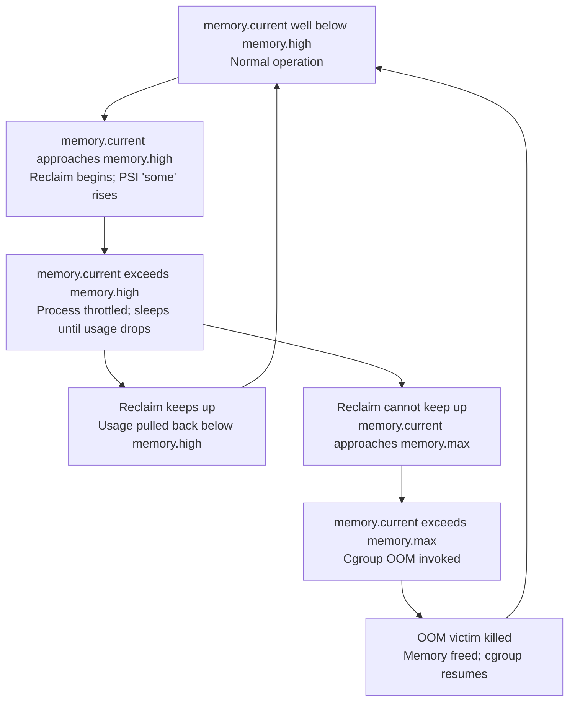
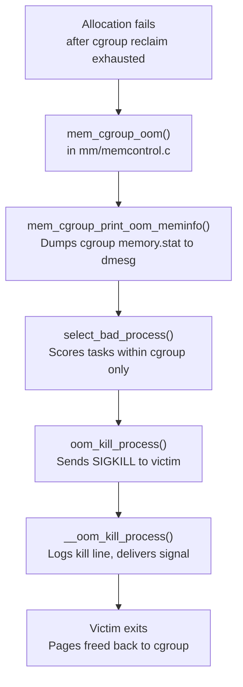

# What Happens When a Container Hits Its Memory Limit

> The full sequence from normal operation to OOM kill and recovery

## The Story in Brief

A container's memory limit is not a wall that appears without warning. The kernel's cgroup memory controller imposes a graduated series of interventions before killing anything: soft throttling at `memory.high`, escalating reclaim pressure, PSI signals visible to observability tooling, and finally — only if all else fails — a cgroup-scoped OOM kill that is entirely separate from the global OOM killer.

Understanding each stage helps you set limits intelligently, write alerting that fires early enough to be useful, and diagnose OOM kills that already happened.



This page follows that path step by step. See [Memory Cgroups](memcg.md) for how the accounting works, [Tuning Containers](tuning-containers.md) for how to configure limits, and [Running out of memory](oom.md) for the global OOM path that operates outside cgroups.

---

## Stage 1: Normal Operation (below memory.high)

While `memory.current` stays below `memory.high`, the cgroup memory controller is effectively invisible to running processes. Allocations succeed at normal speed; kswapd runs at the system level for global pressure; no per-cgroup throttling occurs.

The kernel tracks per-cgroup memory usage via struct `mem_cgroup` in [`include/linux/memcontrol.h`](https://git.kernel.org/pub/scm/linux/kernel/git/torvalds/linux.git/tree/include/linux/memcontrol.h). Every page charged to a cgroup updates the per-cpu counters attached to that struct via `mod_lruvec_state()` in [`mm/memcontrol.c`](https://git.kernel.org/pub/scm/linux/kernel/git/torvalds/linux.git/tree/mm/memcontrol.c). The counters are periodically synced to the global `mem_cgroup->vmstats` array that `memory.stat` reads.

```bash
# Check current usage and the limits in effect
CGROUP=/sys/fs/cgroup/mycontainer
cat $CGROUP/memory.current    # usage now (bytes)
cat $CGROUP/memory.high       # soft limit
cat $CGROUP/memory.max        # hard limit

# Normal state: current << high
```

The PSI file at `$CGROUP/memory.pressure` will show all zeros during this stage — no tasks are stalling on memory.

---

## Stage 2: Approaching memory.high — Throttling Begins

When an allocation would push `memory.current` past `memory.high`, the kernel enters `mem_cgroup_handle_over_high()` in [`mm/memcontrol.c`](https://git.kernel.org/pub/scm/linux/kernel/git/torvalds/linux.git/tree/mm/memcontrol.c). This function is called from the task's return-to-userspace path (not from the charge function directly — the `over_high` check is deferred to avoid reclaiming on every allocation).

### The throttling mechanism

`mem_cgroup_handle_over_high()` does two things:

1. **Triggers synchronous reclaim** on the current cgroup. It calls `reclaim_high()`, which calls `try_to_free_mem_cgroup_pages()` to reclaim pages from the cgroup's LRU lists. This is direct reclaim scoped to a single cgroup — it does not touch other cgroups.

2. **Throttles the allocating process** if reclaim did not bring usage back below `memory.high`. The process is put to sleep for a calculated number of jiffies, yielding the CPU. The sleep duration scales with how far over `memory.high` the cgroup is — a small overage causes a short sleep; a large overage causes a proportionally longer one (this scaling is a heuristic, not a fixed table).

!!! note "The throttling is per-process, not per-cgroup"
    Each process that allocates while the cgroup is over `memory.high` incurs its own sleep. A single-threaded application serializes its own allocations naturally. A massively multi-threaded application may have many threads sleeping simultaneously.

### What you observe externally

From outside the container, the process appears to be using CPU less efficiently — its runnable time increases while it blocks inside the kernel. PSI begins to register:

```bash
cat $CGROUP/memory.pressure
# some avg10=8.50 avg60=2.10 avg300=0.40 total=128000
# full avg10=0.00 avg60=0.00 avg300=0.00 total=0
```

`some` goes above zero because at least one task is stalling on memory. `full` stays zero as long as there is at least one runnable task in the cgroup not blocked on memory. See [PSI](psi.md) for how these are computed.

The `memory.events` counter `high` increments each time `memory.high` is crossed:

```bash
cat $CGROUP/memory.events
# low 0
# high 34          <- number of times memory.high was exceeded
# max 0
# oom 0
# oom_kill 0
```

!!! tip "Set memory.high as your first alert threshold"
    A rising `high` counter with no `oom` events means the container is exercising the throttle path regularly. This is the ideal place to add more memory or tune the application — before it gets worse.

---

## Stage 3: Sustained Throttling — Reclaim, PSI, and Feedback

If the workload continues to allocate faster than reclaim can free pages, `memory.current` remains near or above `memory.high` for an extended period. The system enters a self-balancing loop:

```
Allocation attempt
       │
       ▼
mem_cgroup_handle_over_high()
       │
       ├─► try_to_free_mem_cgroup_pages()
       │         │
       │         ├─► shrink_lruvec() — walk LRU, reclaim cold pages
       │         └─► wakeup_flusher_threads() — write dirty pages back
       │
       └─► sleep (throttle if still over high)
```

`try_to_free_mem_cgroup_pages()` calls `shrink_lruvec()` in [`mm/vmscan.c`](https://git.kernel.org/pub/scm/linux/kernel/git/torvalds/linux.git/tree/mm/vmscan.c) which walks the cgroup's LRU lists in priority order: inactive file cache first (cheapest to reclaim), then active file cache, then — if no reclaimable file pages remain — anonymous pages (which may require swap I/O).

### What gets reclaimed and in what order

| Page type | Reclaimable? | Notes |
|-----------|-------------|-------|
| Inactive file-backed (page cache) | Yes, always | Cleanest reclaim — no I/O if not dirty |
| Dirty file-backed | Yes, after writeback | Requires flushing to disk first |
| Active file-backed | Yes, after LRU aging | Kernel tries to preserve hot pages |
| Anonymous (heap, stack) | Only if swap is available | Triggers swap I/O if swapped out |
| `memory.min`-protected pages | No | Hard floor, never reclaimed |
| `memory.low`-protected pages | Not unless critical | Best-effort floor |
| Shared memory (tmpfs, shmem) | Yes | Charged to cgroup that faulted it in |
| Kernel slab (kmem) | Partially | Reclaimable dentries and inodes via `shrink_slab()` |

### PSI pressure builds

As reclaim consumes CPU time and swap I/O delays resume of throttled tasks, PSI pressure accumulates:

```bash
cat $CGROUP/memory.pressure
# some avg10=45.00 avg60=22.00 avg300=8.00 total=3200000
# full avg10=12.00 avg60=5.00 avg300=1.00 total=890000
```

A `full` value above zero means there were moments when every task in the cgroup was simultaneously blocked on memory — no useful work was happening at all. This is a serious signal.

PSI is the foundation of proactive memory management tools like Meta's [`oomd`](https://facebookincubator.github.io/oomd/) and systemd-oomd, which monitor `memory.pressure` and kill workloads before the kernel OOM killer fires. See [PSI](psi.md) for how to set up a `memory.pressure` notification trigger.

### memory.reclaim for proactive relief

If you detect rising `high` counts or PSI pressure through monitoring, you can manually trigger proactive reclaim without waiting for the kernel to throttle processes:

```bash
# Reclaim 200MB from the cgroup (v5.19+, commit 94968384dde1)
echo 200M > /sys/fs/cgroup/mycontainer/memory.reclaim
```

This was introduced in [commit 94968384dde1](https://git.kernel.org/linus/94968384dde1) ("memcg: introduce per-memcg reclaim interface") by Shakeel Butt ([LWN article](https://lwn.net/Articles/894849/)). It is a write-only interface that triggers `try_to_free_mem_cgroup_pages()` directly from userspace, useful for pre-emptive memory management in orchestrators.

---

## Stage 4: Exceeding memory.max — Cgroup OOM

If reclaim from the throttle path cannot keep `memory.current` below `memory.high`, and usage continues to rise until it reaches `memory.max`, the kernel invokes a different path: the cgroup OOM killer.

### Entry point: mem_cgroup_out_of_memory()

When an allocation fails after exhausting cgroup reclaim, `mem_cgroup_oom()` in [`mm/memcontrol.c`](https://git.kernel.org/pub/scm/linux/kernel/git/torvalds/linux.git/tree/mm/memcontrol.c) is called. It:

1. Calls `out_of_memory()` in [`mm/oom_kill.c`](https://git.kernel.org/pub/scm/linux/kernel/git/torvalds/linux.git/tree/mm/oom_kill.c) with `oom_memcg` set — this signals a cgroup-scoped OOM.
2. `select_bad_process()` is called with the cgroup constraint, so it only considers tasks within the target cgroup.
3. After the victim is selected, `oom_kill_process()` calls `mem_cgroup_get_oom_group()` to check whether `memory.oom.group` is set — if so, the entire cgroup subtree is killed, not just the victim.

### How cgroup OOM differs from global OOM

| | Global OOM | Cgroup OOM |
|-|-----------|-----------|
| **Trigger** | System-wide allocation fails after direct reclaim | Cgroup `memory.max` exceeded after cgroup reclaim |
| **Candidate pool** | All processes on the system | Only processes in the affected cgroup (and descendents) |
| **Score basis** | `totalpages` = system RAM + swap | `totalpages` = cgroup `memory.max` |
| **Kill prefix in dmesg** | `Out of memory:` | `Memory cgroup out of memory:` |
| **Constraint field** | `CONSTRAINT_NONE` | `CONSTRAINT_MEMCG` |
| **Memory dump** | Full zone/node Mem-Info | Cgroup memory stats via `mem_cgroup_print_oom_meminfo()` |
| **Other containers affected** | Potentially | No — completely isolated |

### The OOM kill sequence



### What dmesg shows for a cgroup OOM

```
[  891.112245] Memory cgroup out of memory: Killed process 12001 (myapp) \
               total-vm:2097152kB, anon-rss:1048320kB, file-rss:512kB, \
               shmem-rss:0kB, UID:1000 pgtables:2048kB oom_score_adj:0
```

Key differences from a global OOM log:

- The line begins with `Memory cgroup out of memory:` not `Out of memory:`
- The `constraint=CONSTRAINT_MEMCG` field in the kill line names the cgroup path
- The memory state section shows cgroup stats, not global zone stats
- The task table lists only processes inside the cgroup

See [Reading an OOM log](reading-oom-log.md) for a full annotated breakdown of these fields.

### memory.oom.group: kill the whole container at once

By default, the OOM killer selects a single process within the cgroup. For multi-process containers (web servers with worker pools, sidecars, etc.), killing one process often leaves the rest in a broken state.

[Commit 3d8b38eb81ca](https://git.kernel.org/linus/3d8b38eb81ca) ("mm, oom: introduce memory.oom.group", Roman Gushchin, kernel v4.19) introduced `memory.oom.group`:

```bash
echo 1 > /sys/fs/cgroup/mycontainer/memory.oom.group
```

When set, `mem_cgroup_get_oom_group()` walks up the cgroup hierarchy to find the highest ancestor with `oom_group` set, then `oom_cgroup_kill()` sends SIGKILL to every task in that subtree (except those with `oom_score_adj = -1000`). The dmesg log includes:

```
Tasks in /myapp.slice/myapp.service are going to be killed due to memory.oom.group set
```

!!! warning "oom.group and nested cgroups"
    When `memory.oom.group` is set on an ancestor, all tasks in all descendant cgroups are killed, not just the cgroup that triggered the OOM. Design your cgroup hierarchy accordingly if you have mixed-criticality workloads sharing a parent.

### memory.events after an OOM

```bash
cat /sys/fs/cgroup/mycontainer/memory.events
# low 0
# high 152
# max 8           <- number of times memory.max was hit
# oom 3           <- OOM events (one per OOM invocation)
# oom_kill 3      <- individual processes killed
# oom_group_kill 0
```

`max` counts how many times usage reached `memory.max` — this includes attempts that triggered reclaim successfully before requiring an OOM kill. `oom` and `oom_kill` count only cases where the OOM killer actually ran.

---

## Stage 5: Recovery After OOM Kill

When the victim process exits, its pages are freed back to the cgroup. The sequence:

1. The process receives SIGKILL and its signal handler (or default disposition) terminates it.
2. `exit_mm()` is called, which calls `mmput()`, which drops the `mm_struct` reference count.
3. When the count reaches zero, `__mmput()` runs `exit_mmap()`, which calls `unmap_vmas()` to walk all VMAs and `free_pgtables()` to release page tables.
4. Each page is unmapped and freed via `release_pages()`, which calls `mem_cgroup_uncharge()` (which takes a `struct folio *` in current kernels) to subtract from the cgroup's counter.
5. `memory.current` drops. If it falls below `memory.max`, further allocations can succeed.

### Will the container recover automatically?

It depends on what was killed and what the container runtime does:

**Single-process container (PID 1 killed)**: The container runtime detects that PID 1 exited and restarts the container according to its restart policy (e.g., `--restart=always` in Docker, `restartPolicy: Always` in Kubernetes).

**Multi-process container (worker killed, not PID 1)**: If `memory.oom.group` is not set, only the selected process dies. The container may continue running in a degraded state — this is the most dangerous case, because the OOM kill is silent from the perspective of container health checks unless you explicitly monitor `memory.events`.

**`memory.oom.group = 1`**: All processes die. The runtime detects the exit of PID 1 and performs a clean restart.

```bash
# Watch for OOM events in a running container (poll memory.events)
watch -n 5 "cat /sys/fs/cgroup/mycontainer/memory.events | grep oom"

# Or use inotify (not all kernels support it on cgroupfs)
# Most production setups poll memory.events at a fixed interval via their metrics agent
```

### The memory.events oom_kill counter does not reset

`memory.events` counters are monotonically increasing since the cgroup was created. They do not reset when an OOM kill occurs or when the container restarts (as long as the cgroup is reused). Some orchestrators recreate the cgroup on restart, giving you a fresh baseline. Others reuse it. Check which behavior your runtime uses before building alerting on absolute event counts.

!!! tip "Alert on rate, not absolute count"
    Build alerts on `oom_kill` events per unit time (e.g., rate over 5 minutes) rather than the raw counter value. A container that had one OOM kill three weeks ago should not be permanently in alert state.

---

## The Full Sequence at a Glance

```
memory.current (grows ───────────────────────────────────────────────►)

│ Normal operation              │ Throttle zone         │ OOM zone
│ (below memory.high)           │ (above memory.high)   │ (above memory.max)
│                               │                       │
│ Fast allocations              │ - Reclaim runs        │ - mem_cgroup_oom()
│ No PSI pressure               │ - Process sleeps      │ - select_bad_process()
│ memory.events unchanged       │ - PSI 'some' rises    │ - SIGKILL to victim
│                               │ - high counter rises  │ - oom/oom_kill++
│                               │                       │
├───────────────────────────────┼───────────────────────┼──────────────────────
                          memory.high              memory.max
```

---

## Practical Configuration

The gap between `memory.high` and `memory.max` is the throttle zone. A well-configured container reaches `memory.high` under load, gets throttled and reclaimed back, and never reaches `memory.max`. This design is explained in [Tuning Containers](tuning-containers.md).

```bash
CGROUP=/sys/fs/cgroup/mycontainer

# Profile first: observe memory.peak under realistic load (v5.19+)
cat $CGROUP/memory.peak     # highest memory.current ever seen

# Set max at ~1.5x observed peak (heuristic: leaves headroom for spikes)
echo 1500M > $CGROUP/memory.max

# Set high at ~80% of max (heuristic: gives throttle zone before OOM)
echo 1200M > $CGROUP/memory.high

# Kill group on OOM for clean restart
echo 1 > $CGROUP/memory.oom.group

# Allow swap buffer between high and max
echo 512M > $CGROUP/memory.swap.max
```

!!! note "The 80% and 1.5x figures are heuristics"
    There is no universally correct gap between `memory.high` and `memory.max`. The right value depends on your application's allocation burst size and how fast your reclaim path is. Observe `memory.pressure` and `memory.events` under load to calibrate.

---

## Key Kernel Functions (mm/memcontrol.c)

| Function | What it does |
|----------|-------------|
| `mem_cgroup_charge()` | Called on every page allocation to update cgroup counters and check limits |
| `mem_cgroup_handle_over_high()` | Entry point for high-limit throttling; calls `reclaim_high()` then sleeps |
| `reclaim_high()` | Calls `try_to_free_mem_cgroup_pages()` to free pages from the cgroup |
| `mem_cgroup_oom()` | Entry point for max-limit OOM; selects victim and invokes `out_of_memory()` |
| `mem_cgroup_get_oom_group()` | Determines the target cgroup for OOM (respects `memory.oom.group`) |
| `mem_cgroup_print_oom_meminfo()` | Dumps cgroup memory stats to dmesg during OOM |
| `mem_cgroup_uncharge()` | Called on page free to subtract from cgroup counters |

---

## Further Reading

- [Memory Cgroups](memcg.md) — How the accounting works and what is charged
- [Tuning Containers](tuning-containers.md) — How to set memory.high, memory.max, and memory.min correctly
- [Reading an OOM log](reading-oom-log.md) — How to parse the dmesg output from a cgroup OOM kill
- [Running out of memory](oom.md) — The global OOM path: watermarks, kswapd, direct reclaim
- [PSI](psi.md) — How pressure stall information is computed and how to use it for alerting
