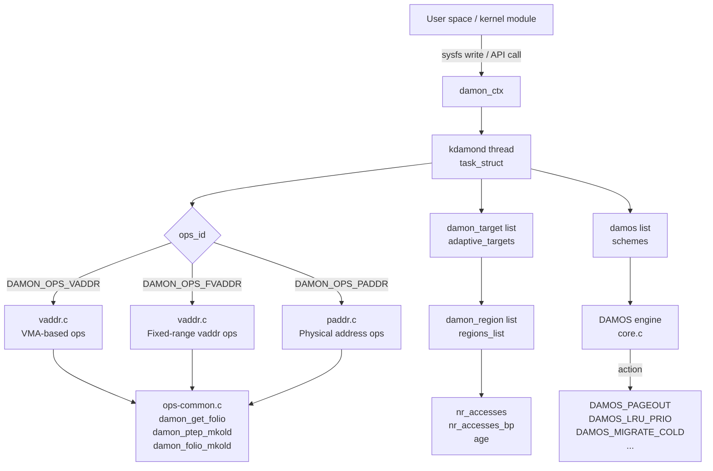

# DAMON: Data Access Monitoring

> A lightweight, accurate, and scalable kernel framework for observing how memory is accessed — and acting on that knowledge

## What Is DAMON?

DAMON (Data Access MONitoring) is a kernel subsystem that tracks how frequently each memory region is accessed at runtime. It is **not** a reclaim policy on its own. Instead, it is a monitoring framework that produces access-frequency data which other subsystems — most importantly DAMOS (DAMON-based Operation Schemes) — can act on.

The key design goals are:

- **Accuracy**: access frequency is tracked per-region, not per-page, but remains close enough to reality to drive useful decisions
- **Scalability**: works across address spaces of arbitrary size without O(n) page-scan cost
- **Adaptivity**: regions grow and shrink automatically to focus monitoring effort where it matters

```
Without DAMON:                        With DAMON:
                                      ┌──────────────────────────────┐
Kernel reclaims pages based on        │  Kernel observes access      │
LRU age alone — no knowledge of       │  patterns over time, then    │
which regions are truly cold.         │  targets cold regions        │
                                      │  precisely via DAMOS         │
                                      └──────────────────────────────┘
```

!!! note "DAMON vs. DAMOS"
    DAMON collects data. DAMOS uses that data to trigger actions (page out cold memory, promote hot memory, etc.). You configure both together via the sysfs interface.

---

## Core Concepts

### Regions: The Unit of Monitoring

DAMON divides a monitoring target's address space into a list of `struct damon_region` objects. Each region represents a contiguous address range `[ar.start, ar.end)` and carries:

- `nr_accesses` — how many sampling intervals detected an access in the current aggregation window
- `nr_accesses_bp` — a basis-point (1/10,000) moving-average version updated every sample interval, useful when you cannot wait for a full aggregation to elapse
- `age` — how many aggregation intervals the region's access frequency has stayed roughly the same; resets to zero when access frequency changes significantly
- `sampling_addr` — the specific address within the region that will be checked for access next interval

For virtual address monitoring (`DAMON_OPS_VADDR`), DAMON initialises regions from the process's VMAs. For physical address monitoring (`DAMON_OPS_PADDR`), regions are initialised to cover the target physical address range.

### Sampling: Catching Accesses

Every `sample_interval` microseconds (field `damon_attrs.sample_interval`), the kdamond thread:

1. Checks whether `sampling_addr` within each region was accessed since the last sample (by testing and clearing the accessed/young bit in the page table entry)
2. Increments `nr_accesses` if an access was found
3. Picks a new `sampling_addr` randomly within the region for the next interval

The default `sample_interval` is 5,000 µs (5 ms).

### Aggregation: Building the Picture

Every `aggr_interval` microseconds (`damon_attrs.aggr_interval`), DAMON:

1. Reports (or acts on) the accumulated `nr_accesses` counts for each region
2. Resets `nr_accesses` to zero
3. Updates each region's `age`
4. Runs the adaptive region sizing logic (split/merge)

The default `aggr_interval` is 100,000 µs (100 ms), meaning each reported `nr_accesses` value represents accesses observed over the last 20 sampling intervals (`100 ms / 5 ms`).

### Adaptive Region Sizing

DAMON maintains `damon_attrs.min_nr_regions` and `damon_attrs.max_nr_regions` bounds (defaults: 10 and 1,000). After each aggregation it adjusts regions:

- **Split**: a region that has been accessed unevenly (some sub-ranges hot, others cold) is split into smaller regions to capture the gradient
- **Merge**: adjacent regions with similar access frequencies are merged to reduce overhead

This keeps the total region count within bounds while concentrating resolution where access patterns vary.

!!! tip "Minimum region size"
    `DAMON_MIN_REGION_SZ` is `PAGE_SIZE`. No region can be smaller than one page. The field `damon_ctx.min_region_sz` stores this lower bound.

### Intervals Auto-tuning

DAMON can automatically tune `sample_interval` and `aggr_interval` together. The goal is expressed as a `struct damon_intervals_goal`:

| Field | Meaning |
|---|---|
| `access_bp` | Target ratio of observed access events to theoretical maximum, in basis points (1/10,000) |
| `aggrs` | Number of aggregation windows over which to achieve the ratio |
| `min_sample_us` | Lower bound on the resulting sample interval |
| `max_sample_us` | Upper bound on the resulting sample interval |

If `aggrs` is zero, auto-tuning is disabled. Via sysfs, these fields appear under `monitoring_attrs/intervals/intervals_goal/`.

---

## Architecture



### The `damon_ctx` Structure

Every monitoring session is anchored by a `struct damon_ctx` (`include/linux/damon.h`):

```c
struct damon_ctx {
    struct damon_attrs attrs;         /* sample/aggr/update intervals, nr_regions */
    struct damon_operations ops;      /* pluggable ops set (vaddr/paddr) */
    unsigned long addr_unit;          /* scale factor for core-to-ops address conversion */
    unsigned long min_region_sz;      /* minimum region size (DAMON_MIN_REGION_SZ) */
    struct list_head adaptive_targets;/* list of damon_target */
    struct list_head schemes;         /* list of damos */
    struct task_struct *kdamond;      /* the monitoring thread */
    /* ... private fields ... */
};
```

### The kdamond Thread

Each `damon_ctx` gets exactly one kernel thread — kdamond. Its main loop (in `mm/damon/core.c`) runs as:

```
while (!should_stop):
    ops.prepare_access_checks(ctx)     # mark pages as old (clear accessed bits)
    sleep(sample_interval)
    ops.check_accesses(ctx)            # re-read accessed bits → nr_accesses
    if aggregation_interval_elapsed:
        report / apply DAMOS schemes
        adaptive_merge_regions()
        adaptive_split_regions()
        reset nr_accesses
    if ops_update_interval_elapsed:
        ops.update(ctx)                # refresh VMAs, etc.
```

The thread is started by `damon_start()` and stopped by `damon_stop()`. While running, all external access to `damon_ctx` internals must go through `damon_call()` or `damos_walk()` to serialize with the kdamond loop.

### Operations Sets (`damon_operations`)

DAMON separates the monitoring algorithm from address-space specifics via `struct damon_operations`:

```c
struct damon_operations {
    enum damon_ops_id id;                           /* DAMON_OPS_VADDR / _FVADDR / _PADDR */
    void (*init)(struct damon_ctx *context);
    void (*update)(struct damon_ctx *context);
    void (*prepare_access_checks)(struct damon_ctx *context);
    unsigned int (*check_accesses)(struct damon_ctx *context);
    int (*get_scheme_score)(struct damon_ctx *context,
                            struct damon_target *t,
                            struct damon_region *r,
                            struct damos *scheme);
    unsigned long (*apply_scheme)(struct damon_ctx *context,
                                  struct damon_target *t,
                                  struct damon_region *r,
                                  struct damos *scheme,
                                  unsigned long *sz_filter_passed);
    bool (*target_valid)(struct damon_target *t);
    void (*cleanup_target)(struct damon_target *t);
};
```

| `damon_ops_id` | sysfs name | Description |
|---|---|---|
| `DAMON_OPS_VADDR` | `vaddr` | Monitors a process's virtual address space; initialises regions from VMAs; requires `CONFIG_DAMON_VADDR` |
| `DAMON_OPS_FVADDR` | `fvaddr` | Like `vaddr` but monitors only user-specified fixed address ranges, not the full VMA set |
| `DAMON_OPS_PADDR` | `paddr` | Monitors the physical address space system-wide; requires `CONFIG_DAMON_PADDR`; used by `DAMON_RECLAIM` and `DAMON_LRU_SORT` |

Both `vaddr` and `paddr` use the page idle flag (`PAGE_IDLE_FLAG`) to detect accesses without modifying the page table's dirty bit.

---

## DAMOS: Data Access Monitoring-based Operation Schemes

DAMOS is the policy engine layered on top of DAMON's monitoring data. A DAMOS scheme (`struct damos`) specifies:

1. Which regions to act on (access pattern filter)
2. What action to take
3. How aggressively to act (quota)
4. Under what system conditions to activate (watermarks)

### Access Pattern

`struct damos_access_pattern` selects regions whose metrics fall within all of these ranges:

| Field | Meaning |
|---|---|
| `min_sz_region` / `max_sz_region` | Region byte size range |
| `min_nr_accesses` / `max_nr_accesses` | Observed accesses in the last aggregation window |
| `min_age_region` / `max_age_region` | Number of aggregation intervals the pattern has been stable |

A cold region that has never been accessed since DAMON started would have `nr_accesses == 0` and a large `age`. A frequently-accessed hot region has high `nr_accesses` and resets its `age` often.

### Actions

The `enum damos_action` values and their effects:

| Action | Effect |
|---|---|
| `DAMOS_WILLNEED` | `madvise(MADV_WILLNEED)` — prefetch the region |
| `DAMOS_COLD` | `madvise(MADV_COLD)` — deactivate pages (move toward LRU tail) |
| `DAMOS_PAGEOUT` | Reclaim (page out) the region |
| `DAMOS_HUGEPAGE` | `madvise(MADV_HUGEPAGE)` — promote to THP |
| `DAMOS_NOHUGEPAGE` | `madvise(MADV_NOHUGEPAGE)` — demote from THP |
| `DAMOS_LRU_PRIO` | Prioritize region on its LRU lists (move to active) |
| `DAMOS_LRU_DEPRIO` | Deprioritize region on its LRU lists (move to inactive) |
| `DAMOS_MIGRATE_HOT` | Migrate region to a faster NUMA node (warmer regions first) |
| `DAMOS_MIGRATE_COLD` | Migrate region to a slower NUMA node (colder regions first) |
| `DAMOS_STAT` | No action — only update statistics counters |

!!! warning "DAMOS_PAGEOUT does not demote"
    `DAMOS_PAGEOUT` reclaims pages to swap. It does **not** demote to a slower NUMA tier. For tiered-memory demotion use `DAMOS_MIGRATE_COLD`.

### Quotas

Without limits, DAMOS could apply its action to gigabytes of memory per second. `struct damos_quota` rate-limits it:

| Field | Meaning |
|---|---|
| `reset_interval` | Window for quota accounting, in milliseconds |
| `ms` | Maximum CPU time (milliseconds) the scheme may spend per `reset_interval` |
| `sz` | Maximum bytes the action may be applied to per `reset_interval` |
| `esz` | Effective size quota (computed internally from `ms`, `sz`, and any goals) |
| `weight_sz` | Prioritization weight for region size |
| `weight_nr_accesses` | Prioritization weight for access frequency |
| `weight_age` | Prioritization weight for region age |

When a quota is reached, DAMON stops applying the action for the remainder of the `reset_interval` and increments `damos_stat.qt_exceeds`.

#### Quota Auto-tuning with Goals

Instead of (or in addition to) hard `ms`/`sz` caps, DAMOS can auto-tune the effective quota using a feedback loop. Goals are expressed as `struct damos_quota_goal` objects. Available goal metrics (`enum damos_quota_goal_metric`):

| sysfs name | Meaning |
|---|---|
| `user_input` | Manually supplied feedback value (user writes `current_value`) |
| `some_mem_psi_us` | System-level "some" memory PSI in µs per reset interval |
| `node_mem_used_bp` | Memory used ratio of a NUMA node in basis points |
| `node_mem_free_bp` | Memory free ratio of a NUMA node in basis points |
| `node_memcg_used_bp` | Memory used ratio of a NUMA node for a specific cgroup |
| `node_memcg_free_bp` | Memory free ratio of a NUMA node for a specific cgroup |
| `active_mem_bp` | Active-to-total LRU memory ratio in basis points |
| `inactive_mem_bp` | Inactive-to-total LRU memory ratio in basis points |

DAMOS increases or decreases the effective quota so that the observed metric value converges toward `target_value`.

### Watermarks

`struct damos_watermarks` controls whether a scheme is active based on a system-level metric:

| Field | Meaning |
|---|---|
| `metric` | `none` (always active) or `free_mem_rate` |
| `interval` | How often to check the metric, in µs |
| `high` | Deactivate scheme when metric is above this value |
| `mid` | Activate scheme when metric is between `mid` and `low` |
| `low` | Deactivate scheme when metric falls below this value |

When all schemes of a context are inactive (watermarks not met), kdamond stops monitoring and only polls the watermarks — greatly reducing overhead.

### DAMOS Filters

Before applying an action to a region, DAMOS can test individual pages within the region against filters (`struct damos_filter`). Filter types (`enum damos_filter_type`):

| sysfs name | Type | Scope |
|---|---|---|
| `anon` | Anonymous pages | ops layer |
| `active` | Active LRU pages | core layer |
| `memcg` | Pages belonging to a specific cgroup | ops layer |
| `young` | Recently accessed (young) pages | core layer |
| `hugepage_size` | Pages that are part of a huge page | core layer |
| `unmapped` | Unmapped pages | core layer |
| `addr` | Specific address range | core layer |
| `target` | Specific DAMON target index | core layer |

Each filter has a `matching` bool (apply to matching pages vs. non-matching) and an `allow` bool (include or exclude the matched pages).

!!! note "Filter handling layers"
    Filters in the "ops layer" (`anon`, `memcg`) are handled by the `damon_operations` implementation and are counted toward `sz_tried` statistics. Core-layer filters are evaluated before `sz_tried` is incremented.

---

## The sysfs Interface

`CONFIG_DAMON_SYSFS` exposes the full DAMON API under `/sys/kernel/mm/damon/admin/`. All monitoring is controlled by reading and writing files in this hierarchy.

### Directory Tree

```
/sys/kernel/mm/damon/admin/
└── kdamonds/
    ├── nr_kdamonds                        # write N to create N kdamond directories
    └── 0/
        ├── state                          # write: on|off|commit|update_schemes_stats|...
        ├── pid                            # read: PID of the kdamond thread
        ├── refresh_ms                     # auto-refresh interval for sysfs reads
        └── contexts/
            ├── nr_contexts                # currently only 1 context per kdamond
            └── 0/
                ├── avail_operations       # read: available ops (vaddr fvaddr paddr)
                ├── operations             # write: vaddr | fvaddr | paddr
                ├── addr_unit              # scale factor for address values
                ├── monitoring_attrs/
                │   ├── intervals/
                │   │   ├── sample_us      # sampling interval in µs (default 5000)
                │   │   ├── aggr_us        # aggregation interval in µs (default 100000)
                │   │   ├── update_us      # ops update interval in µs (default 60000000)
                │   │   └── intervals_goal/
                │   │       ├── access_bp
                │   │       ├── aggrs
                │   │       ├── min_sample_us
                │   │       └── max_sample_us
                │   └── nr_regions/
                │       ├── min            # minimum number of regions (default 10)
                │       └── max            # maximum number of regions (default 1000)
                ├── targets/
                │   ├── nr_targets
                │   └── 0/
                │       ├── pid_target     # PID to monitor (vaddr/fvaddr only)
                │       ├── obsolete_target
                │       └── regions/
                │           ├── nr_regions # for fvaddr: number of fixed regions
                │           └── 0/
                │               ├── start  # region start address
                │               └── end    # region end address
                └── schemes/
                    ├── nr_schemes
                    └── 0/
                        ├── action         # willneed|cold|pageout|hugepage|nohugepage|
                        │                  # lru_prio|lru_deprio|migrate_hot|migrate_cold|stat
                        ├── target_nid     # destination NUMA node for migrate actions
                        ├── apply_interval_us  # override aggr_interval for this scheme
                        ├── access_pattern/
                        │   ├── sz/
                        │   │   ├── min
                        │   │   └── max
                        │   ├── nr_accesses/
                        │   │   ├── min
                        │   │   └── max
                        │   └── age/
                        │       ├── min
                        │       └── max
                        ├── quotas/
                        │   ├── ms
                        │   ├── bytes
                        │   ├── reset_interval_ms
                        │   ├── effective_bytes    # read-only: current effective quota
                        │   ├── weights/
                        │   │   ├── sz_permil
                        │   │   ├── nr_accesses_permil
                        │   │   └── age_permil
                        │   └── goals/
                        │       ├── nr_goals
                        │       └── 0/
                        │           ├── target_metric
                        │           ├── target_value
                        │           ├── current_value
                        │           ├── nid
                        │           └── path
                        ├── watermarks/
                        │   ├── metric         # none | free_mem_rate
                        │   ├── interval_us
                        │   ├── high
                        │   ├── mid
                        │   └── low
                        ├── filters/           # core + ops filters combined
                        │   ├── nr_filters
                        │   └── 0/
                        │       ├── type        # anon|active|memcg|young|hugepage_size|
                        │       │               # unmapped|addr|target
                        │       ├── matching
                        │       ├── allow
                        │       ├── memcg_path
                        │       ├── addr_start
                        │       ├── addr_end
                        │       ├── min         # for hugepage_size filter
                        │       ├── max
                        │       └── damon_target_idx
                        ├── dests/             # for migrate_hot/cold actions
                        │   ├── nr_dests
                        │   └── 0/
                        │       ├── id         # destination NUMA node id
                        │       └── weight
                        ├── stats/             # read-only counters
                        │   ├── nr_tried
                        │   ├── sz_tried
                        │   ├── nr_applied
                        │   ├── sz_applied
                        │   ├── sz_ops_filter_passed
                        │   ├── qt_exceeds
                        │   ├── nr_snapshots
                        │   └── max_nr_snapshots
                        └── tried_regions/     # regions that matched this scheme
                            ├── total_bytes
                            └── 0/
                                ├── start
                                ├── end
                                ├── nr_accesses
                                ├── age
                                └── sz_filter_passed
```

### kdamond State Commands

Write one of these strings to `kdamonds/0/state`:

| Command | Effect |
|---|---|
| `on` | Start the kdamond thread |
| `off` | Stop the kdamond thread |
| `commit` | Apply updated parameters to a running kdamond |
| `commit_schemes_quota_goals` | Push updated quota goal `current_value` fields to the kernel |
| `update_schemes_stats` | Refresh the `stats/` files from kernel state |
| `update_schemes_tried_bytes` | Refresh `tried_regions/total_bytes` |
| `update_schemes_tried_regions` | Populate `tried_regions/` with current matching regions |
| `clear_schemes_tried_regions` | Remove all entries from `tried_regions/` |
| `update_schemes_effective_quotas` | Refresh `quotas/effective_bytes` |
| `update_tuned_intervals` | Refresh `intervals/` with auto-tuned values |

---

## Practical Examples

### 1. Proactive Reclaim: Page Out Cold Pages

This example sets up a physical-address DAMOS scheme that pages out memory regions not accessed for approximately 120 seconds. It mirrors what `CONFIG_DAMON_RECLAIM` does internally.

```bash
#!/bin/bash
ADMIN=/sys/kernel/mm/damon/admin

# Create one kdamond with one context
echo 1 > $ADMIN/kdamonds/nr_kdamonds
echo 1 > $ADMIN/kdamonds/0/contexts/nr_contexts

# Use the physical address space ops (system-wide, no PID needed)
echo paddr > $ADMIN/kdamonds/0/contexts/0/operations

# Tune monitoring intervals
echo 5000   > $ADMIN/kdamonds/0/contexts/0/monitoring_attrs/intervals/sample_us
echo 100000 > $ADMIN/kdamonds/0/contexts/0/monitoring_attrs/intervals/aggr_us

# One target (paddr needs exactly one target; no pid_target needed)
echo 1 > $ADMIN/kdamonds/0/contexts/0/targets/nr_targets

# Create one DAMOS scheme
echo 1 > $ADMIN/kdamonds/0/contexts/0/schemes/nr_schemes
SCHEME=$ADMIN/kdamonds/0/contexts/0/schemes/0

# Action: page out
echo pageout > $SCHEME/action

# Access pattern: size [4KB, unlimited], nr_accesses [0,0], age [24000,max]
# age 24000 = 24000 aggr intervals × 100ms = 2,400,000ms ≈ 2400s ... too long
# Better: age in aggr intervals. 120s / 100ms = 1200 aggregation intervals
echo 4096           > $SCHEME/access_pattern/sz/min
echo 18446744073709551615 > $SCHEME/access_pattern/sz/max
echo 0              > $SCHEME/access_pattern/nr_accesses/min
echo 0              > $SCHEME/access_pattern/nr_accesses/max
echo 1200           > $SCHEME/access_pattern/age/min
echo 18446744073709551615 > $SCHEME/access_pattern/age/max

# Quota: use at most 10ms CPU, page out at most 128MiB per second
echo 10            > $SCHEME/quotas/ms
echo 134217728     > $SCHEME/quotas/bytes       # 128 MiB
echo 1000          > $SCHEME/quotas/reset_interval_ms
# Prioritize older (colder) regions first
echo 0 > $SCHEME/quotas/weights/sz_permil
echo 0 > $SCHEME/quotas/weights/nr_accesses_permil
echo 1000 > $SCHEME/quotas/weights/age_permil

# Watermarks: only activate when free memory is between 20% and 50%
echo free_mem_rate > $SCHEME/watermarks/metric
echo 5000000       > $SCHEME/watermarks/interval_us   # check every 5s
echo 500           > $SCHEME/watermarks/high           # deactivate above 50%
echo 400           > $SCHEME/watermarks/mid            # activate at 40%
echo 200           > $SCHEME/watermarks/low            # deactivate below 20%

# Start monitoring
echo on > $ADMIN/kdamonds/0/state
```

After a few seconds, check what has happened:

```bash
# Trigger stats refresh
echo update_schemes_stats > $ADMIN/kdamonds/0/state

STATS=$ADMIN/kdamonds/0/contexts/0/schemes/0/stats
echo "Regions tried:   $(cat $STATS/nr_tried)"
echo "Bytes tried:     $(cat $STATS/sz_tried)"
echo "Regions applied: $(cat $STATS/nr_applied)"
echo "Bytes applied:   $(cat $STATS/sz_applied)"
echo "Quota exceeded:  $(cat $STATS/qt_exceeds)"
```

### 2. Working Set Estimation: Count Accesses by Region

Use `DAMOS_STAT` to observe which regions are hot without taking any action:

```bash
ADMIN=/sys/kernel/mm/damon/admin
echo 1 > $ADMIN/kdamonds/nr_kdamonds
echo 1 > $ADMIN/kdamonds/0/contexts/nr_contexts
echo vaddr > $ADMIN/kdamonds/0/contexts/0/operations

# Monitor a specific process
echo 1 > $ADMIN/kdamonds/0/contexts/0/targets/nr_targets
echo $(pidof myapp) > $ADMIN/kdamonds/0/contexts/0/targets/0/pid_target

# Scheme: stat action, capture all regions
echo 1 > $ADMIN/kdamonds/0/contexts/0/schemes/nr_schemes
SCHEME=$ADMIN/kdamonds/0/contexts/0/schemes/0
echo stat > $SCHEME/action
echo 0                       > $SCHEME/access_pattern/sz/min
echo 18446744073709551615    > $SCHEME/access_pattern/sz/max
echo 0                       > $SCHEME/access_pattern/nr_accesses/min
echo 18446744073709551615    > $SCHEME/access_pattern/nr_accesses/max
echo 0                       > $SCHEME/access_pattern/age/min
echo 18446744073709551615    > $SCHEME/access_pattern/age/max

echo on > $ADMIN/kdamonds/0/state

# After a monitoring window, snapshot matched regions
echo update_schemes_tried_regions > $ADMIN/kdamonds/0/state

# Read which regions matched
for dir in $SCHEME/tried_regions/[0-9]*/; do
    start=$(cat $dir/start)
    end=$(cat $dir/end)
    acc=$(cat $dir/nr_accesses)
    age=$(cat $dir/age)
    printf "0x%x - 0x%x  accesses=%d  age=%d\n" $start $end $acc $age
done
```

### 3. Memory Tiering: Demote Cold Pages to Slow NUMA Memory

For systems with CXL-attached memory or slow NUMA nodes, use `DAMOS_MIGRATE_COLD` to demote cold pages:

```bash
ADMIN=/sys/kernel/mm/damon/admin
echo 1 > $ADMIN/kdamonds/nr_kdamonds
echo 1 > $ADMIN/kdamonds/0/contexts/nr_contexts
echo paddr > $ADMIN/kdamonds/0/contexts/0/operations
echo 1 > $ADMIN/kdamonds/0/contexts/0/targets/nr_targets

echo 1 > $ADMIN/kdamonds/0/contexts/0/schemes/nr_schemes
SCHEME=$ADMIN/kdamonds/0/contexts/0/schemes/0

# Demote cold, large regions to NUMA node 2 (slow tier)
echo migrate_cold > $SCHEME/action
echo 2 > $SCHEME/target_nid

# Pattern: any size, zero accesses, aged at least 60 aggr intervals (6s at 100ms)
echo 0                       > $SCHEME/access_pattern/sz/min
echo 18446744073709551615    > $SCHEME/access_pattern/sz/max
echo 0                       > $SCHEME/access_pattern/nr_accesses/min
echo 0                       > $SCHEME/access_pattern/nr_accesses/max
echo 60                      > $SCHEME/access_pattern/age/min
echo 18446744073709551615    > $SCHEME/access_pattern/age/max

# Demote at most 256MiB per second
echo 0          > $SCHEME/quotas/ms
echo 268435456  > $SCHEME/quotas/bytes
echo 1000       > $SCHEME/quotas/reset_interval_ms

echo on > $ADMIN/kdamonds/0/state
```

!!! tip "Multiple migration destinations"
    For workloads that benefit from weighted distribution across multiple tiers, use the `dests/` subdirectory of the scheme instead of `target_nid`. Create `nr_dests` entries, each with an `id` (NUMA node) and a `weight`.

---

## Built-in DAMOS Modules

### CONFIG_DAMON_RECLAIM

`DAMON_RECLAIM` (`mm/damon/reclaim.c`) is a prebuilt kernel module that runs a `DAMOS_PAGEOUT` scheme against the physical address space. It is designed for proactive, lightweight reclaim under mild memory pressure, complementing `kswapd`'s reactive scanning.

**Kernel config**: `CONFIG_DAMON_RECLAIM` (depends on `CONFIG_DAMON_PADDR`)

**Module parameters** (readable/writable via `/sys/module/damon_reclaim/parameters/`):

| Parameter | Default | Description |
|---|---|---|
| `enabled` | `N` | Enable/disable DAMON_RECLAIM at runtime |
| `commit_inputs` | `N` | Set to `Y` to re-read all parameters without restarting |
| `min_age` | 120,000,000 µs (120 s) | Minimum age of a cold region before reclaim |
| `quota_mem_pressure_us` | 0 (disabled) | Auto-tune quota to achieve this PSI level (µs per reset interval) |
| `quota_autotune_feedback` | 0 (disabled) | Manual feedback value for auto-tuning (target: 10,000) |
| `skip_anon` | `N` | If `Y`, skip anonymous pages (file-backed only) |
| `monitor_region_start` | 0 | Start of physical address range to monitor |
| `monitor_region_end` | 0 | End of physical address range (0 = largest System RAM region) |

Default quota: 10 ms CPU time and 128 MiB bytes per 1-second window. Default watermarks: activate when free memory is between 20% and 50%.

```bash
# Enable DAMON_RECLAIM with more aggressive settings
echo Y > /sys/module/damon_reclaim/parameters/enabled

# Reclaim pages cold for 60 seconds instead of 120
echo 60000000 > /sys/module/damon_reclaim/parameters/min_age

# Apply changes without restarting
echo Y > /sys/module/damon_reclaim/parameters/commit_inputs
```

!!! warning "When to use DAMON_RECLAIM vs. direct sysfs configuration"
    `DAMON_RECLAIM` is a coarse-grained knob for system-wide proactive reclaim. If you need fine-grained control — per-cgroup targeting, custom watermarks, multiple schemes, or migration rather than swap — configure DAMON directly via the sysfs interface.

### CONFIG_DAMON_LRU_SORT

`DAMON_LRU_SORT` (`mm/damon/lru_sort.c`) uses two DAMOS schemes to influence the LRU lists before `kswapd` sees them: hot pages are prioritized (`DAMOS_LRU_PRIO`) and cold pages are deprioritized (`DAMOS_LRU_DEPRIO`). This makes subsequent kswapd reclaim more precise without bypassing the LRU machinery.

**Kernel config**: `CONFIG_DAMON_LRU_SORT` (depends on `CONFIG_DAMON_PADDR`)

Key module parameters (`/sys/module/damon_lru_sort/parameters/`):

| Parameter | Default | Description |
|---|---|---|
| `enabled` | `N` | Enable/disable |
| `active_mem_bp` | 0 (disabled) | Auto-tune to achieve this active/total LRU ratio |
| `autotune_monitoring_intervals` | `N` | Automatically tune sample/aggr intervals |

### CONFIG_DAMON_STAT

`DAMON_STAT` (`mm/damon/stat.c`) runs DAMON against the physical address space and exposes aggregated access statistics as simple metrics, useful for observability without taking any memory management action.

**Kernel config**: `CONFIG_DAMON_STAT`

`CONFIG_DAMON_STAT_ENABLED_DEFAULT` controls whether it starts automatically at boot.

---

## DAMON and MGLRU

DAMON and Multi-Generational LRU (MGLRU) both track memory access patterns, but at different granularities and for different purposes:

| | DAMON | MGLRU |
|---|---|---|
| **Granularity** | `damon_region` (pages to megabytes, adaptively sized) | Individual page (folio) generation |
| **Mechanism** | Samples a random address per region per interval | Walks page tables, updates folio generations |
| **Output** | `nr_accesses`, `age` per region | Generation number per folio (0=oldest) |
| **Actionable via** | DAMOS schemes (policy-agnostic) | kswapd generation-based eviction |
| **Overhead** | Configurable via intervals; sub-1% typical | Amortized across page table walks |
| **Use case** | Custom policies, tiering, prefetch, working set sizing | General-purpose reclaim ordering |

They complement each other: MGLRU efficiently orders pages for reclaim within the LRU, while DAMON provides region-level access data that can drive actions MGLRU cannot express — proactive demotion to CXL memory, THP promotion decisions, or working set reports for capacity planning.

!!! note "No conflict"
    DAMON and MGLRU can run concurrently. DAMON_LRU_SORT specifically cooperates with MGLRU by manipulating LRU priority before generation-based eviction runs.

---

## Performance Overhead

DAMON's overhead is primarily controlled by three parameters:

```
overhead ≈ (nr_regions × cost_per_region) / sample_interval
```

| Parameter | Effect on overhead | Effect on accuracy |
|---|---|---|
| `sample_interval` (↑) | Reduces CPU time in kdamond | Fewer samples → may miss short-lived accesses |
| `aggr_interval` (↑) | No direct overhead effect | Larger window smooths out transient spikes |
| `max_nr_regions` (↑) | More regions → more page table lookups per sample | Finer spatial resolution |

Typical configurations achieve well under 1% CPU overhead. The `DAMON_RECLAIM` defaults (5ms sample, 100ms aggr, 1000 max regions) are designed for near-zero impact on production workloads.

!!! tip "Overhead tuning guidance"
    - For background observability (working set sizing), prefer longer intervals: `sample_us=50000`, `aggr_us=1000000`
    - For reactive policies (proactive reclaim under pressure), use the defaults or enable `intervals_goal` auto-tuning to let DAMON adjust dynamically

---

## Kernel Configuration

| Config option | Description | Depends on |
|---|---|---|
| `CONFIG_DAMON` | Core DAMON framework | — |
| `CONFIG_DAMON_VADDR` | Virtual address space ops (`vaddr`, `fvaddr`) | `DAMON`, `MMU`, selects `PAGE_IDLE_FLAG` |
| `CONFIG_DAMON_PADDR` | Physical address space ops (`paddr`) | `DAMON`, `MMU`, selects `PAGE_IDLE_FLAG` |
| `CONFIG_DAMON_SYSFS` | sysfs interface under `/sys/kernel/mm/damon/` | `DAMON`, `SYSFS` |
| `CONFIG_DAMON_RECLAIM` | Built-in proactive reclaim module | `DAMON_PADDR` |
| `CONFIG_DAMON_LRU_SORT` | Built-in LRU sorting module | `DAMON_PADDR` |
| `CONFIG_DAMON_STAT` | Built-in access statistics module | `DAMON_PADDR` |
| `CONFIG_DAMON_STAT_ENABLED_DEFAULT` | Enable `DAMON_STAT` at boot | `DAMON_STAT` |
| `CONFIG_DAMON_KUNIT_TEST` | KUnit tests for DAMON core | `DAMON`, `KUNIT=y` |
| `CONFIG_DAMON_VADDR_KUNIT_TEST` | KUnit tests for vaddr ops | `DAMON_VADDR`, `KUNIT=y` |
| `CONFIG_DAMON_SYSFS_KUNIT_TEST` | KUnit tests for sysfs interface | `DAMON_SYSFS`, `KUNIT=y` |

---

## Key Source Files

| File | Role |
|---|---|
| `include/linux/damon.h` | All public structs and enums: `damon_region`, `damon_target`, `damon_ctx`, `damon_attrs`, `damon_operations`, `damos`, `damos_access_pattern`, `damos_quota`, `damos_watermarks`, `damos_filter`, `damos_stat` |
| `mm/damon/core.c` | kdamond main loop, region split/merge, DAMOS engine, `damon_new_ctx()`, `damon_start()`, `damon_stop()`, `damon_register_ops()`, `damon_select_ops()` |
| `mm/damon/vaddr.c` | `DAMON_OPS_VADDR` and `DAMON_OPS_FVADDR` implementation: VMA-based region init, page table walk for access checks |
| `mm/damon/paddr.c` | `DAMON_OPS_PADDR` implementation: physical address region management, folio-level access checks via `damon_pa_mkold()` |
| `mm/damon/ops-common.c` | Shared helpers: `damon_get_folio()`, `damon_ptep_mkold()`, `damon_folio_mkold()` |
| `mm/damon/sysfs.c` | sysfs directory tree: kdamond, contexts, targets, regions, monitoring_attrs |
| `mm/damon/sysfs-schemes.c` | sysfs for schemes: access_pattern, quotas, watermarks, filters, stats, tried_regions |
| `mm/damon/sysfs-common.c` | Shared sysfs helpers: `damon_sysfs_ul_range` for min/max pairs |
| `mm/damon/reclaim.c` | `DAMON_RECLAIM` built-in module: module parameters, DAMOS_PAGEOUT scheme configuration |
| `mm/damon/lru_sort.c` | `DAMON_LRU_SORT` built-in module: DAMOS_LRU_PRIO and DAMOS_LRU_DEPRIO schemes |
| `mm/damon/stat.c` | `DAMON_STAT` built-in module: observability-only DAMOS_STAT scheme |
| `mm/damon/modules-common.c` | Shared helpers for the built-in modules |
| `mm/damon/Kconfig` | All `CONFIG_DAMON_*` options |

## Further reading

### Kernel documentation

- `Documentation/admin-guide/mm/damon/` — administrator guide covering DAMON concepts, the sysfs interface, DAMOS scheme configuration, and the built-in modules (`DAMON_RECLAIM`, `DAMON_LRU_SORT`, `DAMON_STAT`)
- `Documentation/mm/damon/design.rst` — design document describing the adaptive region-based sampling algorithm, the monitoring operations abstraction, and the DAMOS engine
- [mm/damon/](https://git.kernel.org/pub/scm/linux/kernel/git/torvalds/linux.git/tree/mm/damon) — full DAMON implementation: core sampling loop, virtual and physical address ops, sysfs interface, and built-in scheme modules

### LWN articles

- [Memory-management optimization with DAMON](https://lwn.net/Articles/812707/) — Jonathan Corbet's overview of DAMON's design and access-monitoring approach (2020)
- [Using DAMON for proactive reclaim](https://lwn.net/Articles/863753/) — how `DAMON_RECLAIM` was developed and evaluated against `kswapd`-only reclaim (2021)

### Related docs

- [reclaim.md](reclaim.md) — page reclaim; DAMON_RECLAIM targets cold pages identified by DAMON rather than relying solely on LRU age
- [psi.md](psi.md) — pressure stall information; DAMON_RECLAIM can auto-tune its quota using PSI memory pressure as feedback
- [mglru.md](mglru.md) — Multi-Generational LRU; complements DAMON at page granularity for reclaim ordering within the LRU lists
