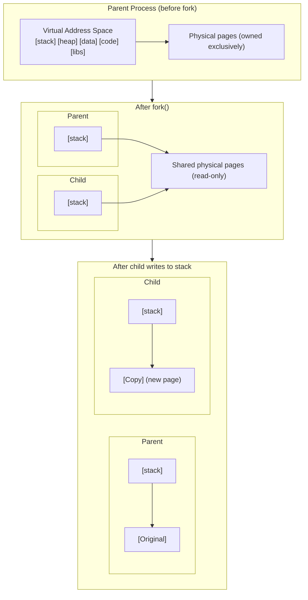
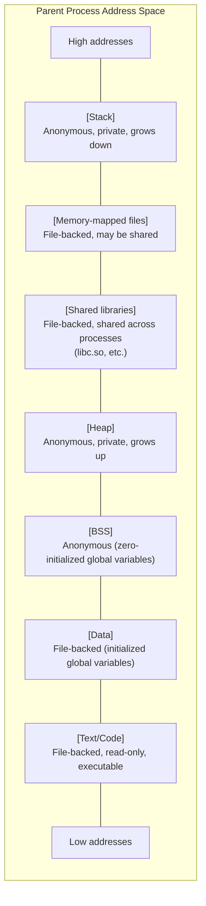
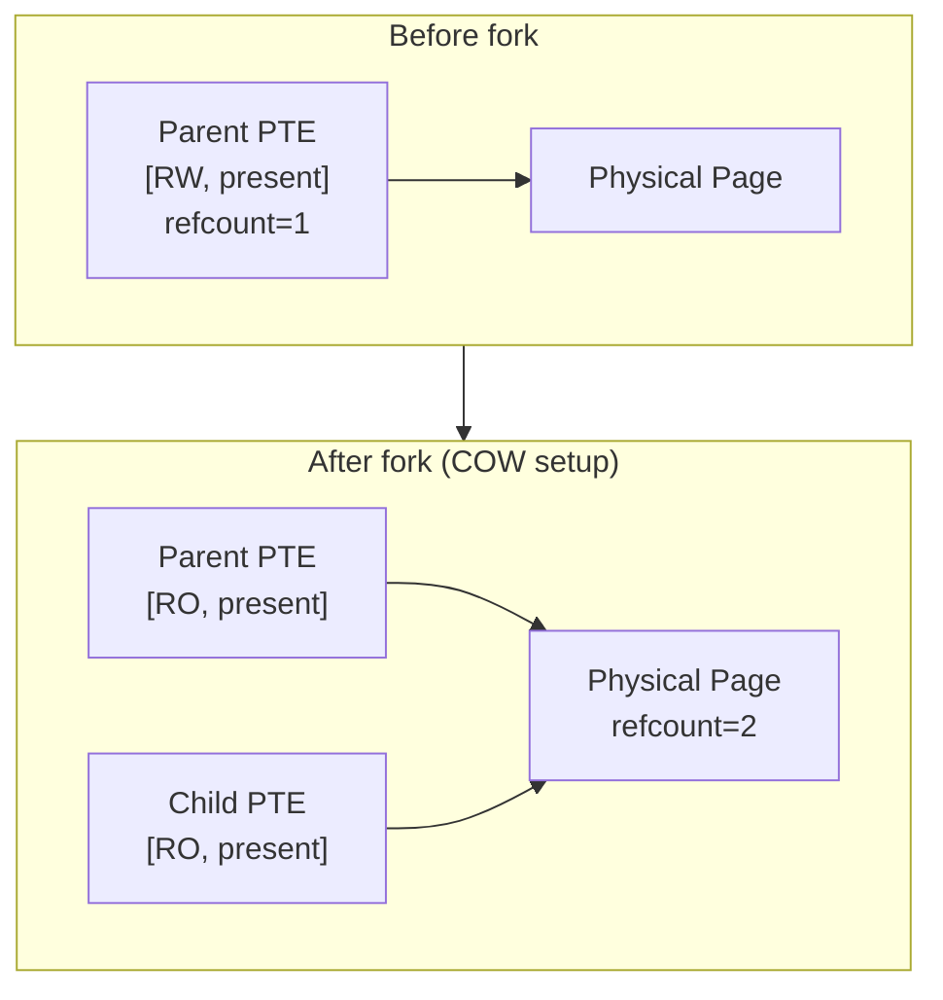
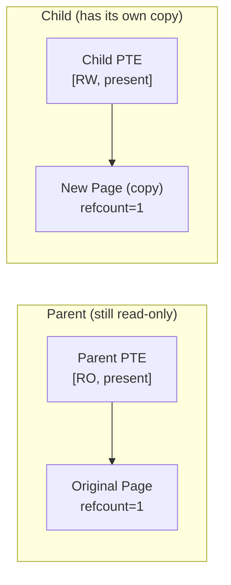
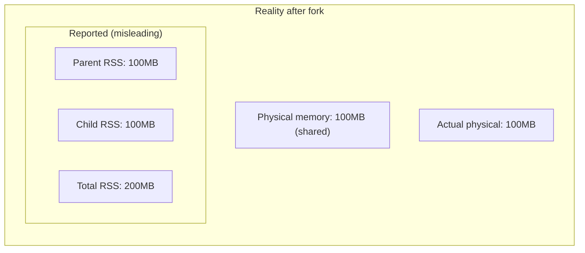
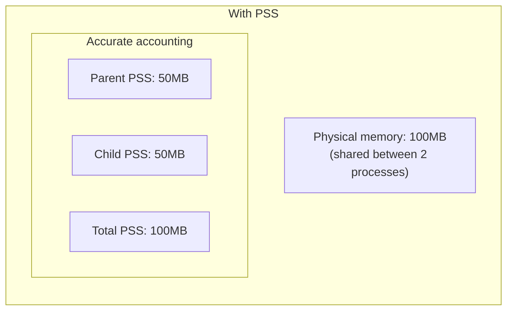
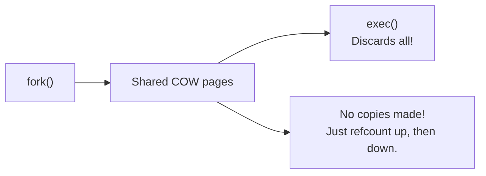

# What happens when you fork

> The memory mechanics of process creation

## fork() in 30 seconds

When a process calls `fork()`, the kernel creates a child process that's almost an exact copy of the parent. But copying gigabytes of memory would be slow and wasteful. Instead, Linux uses **copy-on-write (COW)**: parent and child share the same physical pages until one of them writes.



This makes fork() fast - `O(page tables)` rather than `O(memory used)`.

## Before fork: The parent's memory

A typical process has multiple memory regions, each backed differently:



Each region is represented by a VMA ([Virtual Memory Area](mmap.md)). The kernel must handle each VMA appropriately during fork.

## The fork system call

Fork is implemented via the `clone()` system call internally:

```c
// User calls fork()
pid_t child = fork();

// glibc translates to:
clone(SIGCHLD, 0, NULL, NULL, 0);

// Kernel entry point: kernel/fork.c
SYSCALL_DEFINE0(fork)
{
    struct kernel_clone_args args = {
        .exit_signal = SIGCHLD,
    };
    return kernel_clone(&args);
}
```

### What gets copied

Fork creates copies of many process structures:

| Structure | What Happens |
|-----------|--------------|
| `task_struct` | New copy for child |
| `mm_struct` | New copy (address space descriptor) |
| VMAs | Duplicated (but reference same pages) |
| Page tables | Duplicated (pointing to same physical pages) |
| Physical pages | **Shared** (COW setup) |
| File descriptors | Duplicated (reference same files) |
| Signal handlers | Copied |

The critical insight: **page tables are copied, physical pages are not**.

## Inside dup_mm(): Copying the address space

The memory copying happens in [`dup_mm()`](https://git.kernel.org/pub/scm/linux/kernel/git/torvalds/linux.git/tree/kernel/fork.c):

```c
// kernel/fork.c (simplified)
static struct mm_struct *dup_mm(struct task_struct *tsk,
                                struct mm_struct *oldmm)
{
    struct mm_struct *mm;

    // 1. Allocate new mm_struct
    mm = allocate_mm();

    // 2. Copy mm_struct fields
    memcpy(mm, oldmm, sizeof(*mm));

    // 3. Allocate new page tables (PGD)
    mm->pgd = pgd_alloc(mm);

    // 4. Copy VMAs and page tables
    dup_mmap(mm, oldmm);

    return mm;
}
```

### VMA duplication

Each VMA is duplicated, but the handling depends on its type:

```c
// kernel/fork.c dup_mmap() (simplified)
static int dup_mmap(struct mm_struct *mm, struct mm_struct *oldmm)
{
    struct vm_area_struct *mpnt, *tmp;

    for_each_vma(oldmm, mpnt) {
        // Skip regions marked DONTFORK
        if (mpnt->vm_flags & VM_DONTFORK)
            continue;

        // Create new VMA for child
        tmp = vm_area_dup(mpnt);

        // Handle special cases
        if (mpnt->vm_flags & VM_WIPEONFORK) {
            // Child sees zeros (security feature)
            tmp->anon_vma = NULL;
        }

        // Copy page tables for this VMA
        copy_page_range(mm, oldmm, tmp, mpnt);

        // Add VMA to child's address space
        insert_vm_struct(mm, tmp);
    }
}
```

### Page table copying and COW setup

The key function is [`copy_page_range()`](https://git.kernel.org/pub/scm/linux/kernel/git/torvalds/linux.git/tree/mm/memory.c), which walks the parent's page tables and creates corresponding entries in the child:

```c
// mm/memory.c (simplified)
int copy_page_range(struct mm_struct *dst_mm, struct mm_struct *src_mm,
                    struct vm_area_struct *dst_vma,
                    struct vm_area_struct *src_vma)
{
    // Walk page table levels: PGD → PUD → PMD → PTE
    // For each valid PTE...

    // If it's a private writable mapping:
    if (is_cow_mapping(src_vma->vm_flags)) {
        // Make BOTH parent and child PTEs read-only
        ptep_set_wrprotect(src_mm, addr, src_pte);
        pte = pte_wrprotect(pte);
    }

    // Copy the PTE to child (pointing to same physical page)
    set_pte_at(dst_mm, addr, dst_pte, pte);

    // Increment page reference count
    page_dup_rmap(page);
}
```

**Critical detail**: Both parent AND child are made read-only for private writable mappings. This ensures the first writer (whichever process) triggers the COW fault.

### The COW setup in detail



Both PTEs point to the same physical page. Both are marked read-only. The page's reference count increments to 2.

## COW fault handling

When either process writes to a COW page, a page fault occurs:

```c
// User code (in parent or child)
buffer[0] = 'x';  // Write to shared page

// CPU: "PTE says read-only, but this is a write!"
// → Page fault → Kernel handles it
```

The kernel handles this in [`do_wp_page()`](https://git.kernel.org/pub/scm/linux/kernel/git/torvalds/linux.git/tree/mm/memory.c):

```c
// mm/memory.c (simplified)
static vm_fault_t do_wp_page(struct vm_fault *vmf)
{
    struct folio *old_folio = page_folio(vmf->page);

    // Check if we're the only user of this page
    if (folio_reuse_one_vma(old_folio, vmf->vma)) {
        // We're the only mapper - just make it writable
        wp_page_reuse(vmf, old_folio);
        return 0;
    }

    // Multiple mappers - need to copy
    return wp_page_copy(vmf);
}

static vm_fault_t wp_page_copy(struct vm_fault *vmf)
{
    struct folio *old_folio = page_folio(vmf->page);
    struct folio *new_folio;

    // 1. Allocate new page
    new_folio = vma_alloc_folio(GFP_HIGHUSER_MOVABLE, ...);

    // 2. Copy content (the actual "copy" in copy-on-write)
    copy_user_highpage(&new_folio->page, &old_folio->page, ...);

    // 3. Update page table to point to new page (with write permission)
    set_pte_at(vma->vm_mm, vmf->address, vmf->pte,
               mk_pte(&new_folio->page, vma->vm_page_prot));

    // 4. Decrement old page refcount
    folio_put(old_folio);

    return 0;
}
```

### After COW fault



**Important**: The parent's PTE stays read-only even though it's now the exclusive owner. If the parent writes later, `do_wp_page()` sees refcount=1, calls `wp_page_reuse()`, and simply makes the PTE writable - no copy needed. This lazy approach avoids modifying PTEs that might never be written to.

## TLB considerations

After modifying page tables, stale TLB entries must be invalidated.

### During fork

When making PTEs read-only for COW:

```c
// The parent's PTE changes from RW to RO
// TLB might have cached the old RW entry

ptep_set_wrprotect(src_mm, addr, src_pte);
// This implies a TLB flush for that address
```

On x86, modifying a PTE from writable to read-only requires flushing the TLB entry. Otherwise, the CPU might use a cached writable entry and skip the COW fault.

### During COW fault

After updating the faulting process's PTE:

```c
// Old entry (RO) → New entry (RW, different physical page)
// Flush the old TLB entry

flush_tlb_page(vma, address);
```

### Multi-threaded processes

If the forking process is multi-threaded, all threads share the same `mm_struct`. During fork:

- The forking thread holds `mmap_lock` for write
- Other threads are prevented from faulting during the page table copy
- TLB shootdowns may be needed across CPUs running sibling threads

This is one reason `fork()` in heavily multi-threaded processes can be slow.

## Memory accounting after fork

After fork, memory metrics can be confusing:

```bash
# Parent and child both show:
ps -o pid,vsz,rss,comm -p $PARENT_PID,$CHILD_PID

# VSZ: Same (same virtual address space layout)
# RSS: Initially same, diverges as COW happens
```

### RSS (Resident Set Size)

RSS counts physical pages mapped to a process. After fork:

- Both processes count the shared pages in their RSS
- The sum of parent + child RSS > actual physical memory used
- This is expected! RSS is per-process, not system-wide



### PSS (Proportional Set Size)

PSS divides shared pages among sharing processes:



```bash
# View PSS
cat /proc/$PID/smaps_rollup | grep Pss
```

### Shared vs Private

The `smaps` file distinguishes:

```bash
cat /proc/$PID/smaps | grep -E "^(Shared|Private)"

# Shared_Clean:  Shared, unmodified pages
# Shared_Dirty:  Shared, modified pages (rare after fork)
# Private_Clean: Private pages, not written
# Private_Dirty: Private pages, written (COW completed)
```

After fork, most pages are `Shared_Clean`. As COW happens, they become `Private_Dirty` in the writing process.

## exec() and COW cleanup

The common pattern `fork() + exec()` is highly optimized:

```c
pid_t pid = fork();
if (pid == 0) {
    // Child process
    exec("/bin/ls", ...);  // Replace address space entirely
}
```

When `exec()` runs:

1. **Entire address space is discarded**
2. COW pages are never copied (refcount decremented instead)
3. New program's pages are mapped fresh



This is why shells (which fork+exec constantly) are efficient despite creating many child processes.

### vfork() optimization

`vfork()` goes further - it doesn't even copy page tables:

```c
pid_t pid = vfork();
if (pid == 0) {
    // Child SHARES parent's address space entirely
    // Parent is BLOCKED until child exits or execs
    exec("/bin/ls", ...);
}
```

**Warning**: With `vfork()`, any memory modification in the child corrupts the parent. Only use if you `exec()` or `_exit()` immediately.

## Special cases

### VM_DONTFORK

Some VMAs shouldn't be inherited:

```c
// After mmap, mark the region as don't-fork
void *buf = mmap(NULL, size, PROT_READ | PROT_WRITE,
                 MAP_PRIVATE | MAP_ANONYMOUS, -1, 0);
madvise(buf, size, MADV_DONTFORK);
```

The child simply won't have this mapping. Use for DMA buffers or security-sensitive regions.

### VM_WIPEONFORK

The mapping exists in the child but content is zeroed:

```c
madvise(addr, len, MADV_WIPEONFORK);
```

Added in kernel 4.14 ([commit d2cd9ede6e19](https://git.kernel.org/linus/d2cd9ede6e19) | [LKML](https://lore.kernel.org/lkml/20170811212829.29186-3-riel@redhat.com/)) for security-sensitive data (encryption keys, random state) that shouldn't leak to children.

### Huge pages and fork

Transparent Huge Pages (THP) have special COW handling:

- **Old behavior**: Copy entire 2MB on first write (expensive!)
- **Modern behavior (v4.5+)**: Split THP into 4KB pages, COW only the written page

See the [THP documentation](thp.md) and [COW explainer](cow.md) for details.

## Performance considerations

### Fork latency

Fork time scales with:

1. **Number of VMAs**: Each VMA is duplicated
2. **Page table size**: All page table levels are copied
3. **TLB flush overhead**: Especially on multi-CPU processes

For a process with 1GB of mapped memory (256K pages), fork must walk and copy page table entries for all of them.

### Reducing fork overhead

1. **Use `posix_spawn()` when possible**: Combines fork+exec more efficiently
2. **Avoid huge address spaces before fork**: Unmapping reduces page table copying
3. **Consider `vfork()` for fork+exec**: No page table copy, but dangerous

### Measuring fork impact

```bash
# Time fork() operations
perf stat -e 'syscalls:sys_enter_clone' ./your_program

# Trace fork latency
perf trace -e clone ./your_program

# Watch COW faults after fork
perf stat -e page-faults ./your_program
```

## Try it yourself

### Watch COW in action

```bash
cat > /tmp/cow_demo.c << 'EOF'
#include <stdio.h>
#include <stdlib.h>
#include <string.h>
#include <unistd.h>
#include <sys/wait.h>

int main() {
    // Allocate and touch memory
    size_t size = 100 * 1024 * 1024;  // 100MB
    char *buf = malloc(size);
    memset(buf, 'A', size);  // Fault in all pages

    printf("Before fork - check RSS:\n");
    printf("  Parent PID: %d\n", getpid());
    char cmd[64];
    snprintf(cmd, sizeof(cmd), "ps -o pid,rss -p %d", getpid());
    system(cmd);

    pid_t pid = fork();

    if (pid == 0) {
        // Child
        printf("\nAfter fork - child PID: %d\n", getpid());
        sleep(1);  // Let parent print first

        printf("\nChild writing to all pages (triggering COW)...\n");
        memset(buf, 'B', size);

        printf("\nAfter COW - check both processes:\n");
        char cmd[256];
        snprintf(cmd, sizeof(cmd), "ps -o pid,rss -p %d,%d", getppid(), getpid());
        system(cmd);

        exit(0);
    } else {
        // Parent
        sleep(2);  // Let child do its work
        wait(NULL);
    }

    return 0;
}
EOF
gcc -o /tmp/cow_demo /tmp/cow_demo.c
/tmp/cow_demo
```

### Monitor page sharing

```bash
# View shared vs private memory
cat /proc/$PID/smaps_rollup

# Before fork (in parent):
# Shared_Clean + Shared_Dirty ≈ 0 (no sharing)
# Private_Clean + Private_Dirty ≈ RSS

# After fork (before COW):
# Shared_Clean ≈ most memory (COW shared)
# Private_* ≈ small

# After COW:
# Private_Dirty increases (copies made)
```

### Trace fork system call

```bash
# Trace fork with timing
strace -f -T -e clone,execve ./your_program

# -f: follow forks
# -T: show time spent in syscall
```

### Count page table pages

```bash
# Page table memory is in /proc/PID/status
grep -E "VmPTE|VmPMD" /proc/$PID/status

# VmPTE: PTE-level page table memory
# VmPMD: PMD-level page table memory
```

## Key source files

| File | What It Does |
|------|--------------|
| [`kernel/fork.c`](https://git.kernel.org/pub/scm/linux/kernel/git/torvalds/linux.git/tree/kernel/fork.c) | fork/clone implementation, dup_mm() |
| [`mm/memory.c`](https://git.kernel.org/pub/scm/linux/kernel/git/torvalds/linux.git/tree/mm/memory.c) | copy_page_range(), COW fault handling |
| [`mm/mmap.c`](https://git.kernel.org/pub/scm/linux/kernel/git/torvalds/linux.git/tree/mm/mmap.c) | VMA duplication |
| [`include/linux/mm_types.h`](https://git.kernel.org/pub/scm/linux/kernel/git/torvalds/linux.git/tree/include/linux/mm_types.h) | mm_struct, vm_area_struct |

## History

### Early COW

Copy-on-write in Unix predates Linux. Linux inherited the technique from Unix tradition when Linus Torvalds wrote the initial implementation in 1991.

### Per-VMA locks (v6.4, 2023)

**Commit**: [5e31275cc997](https://git.kernel.org/linus/5e31275cc997) ("mm: add per-VMA lock and helper functions to control it") | [LKML](https://lore.kernel.org/all/20230109205336.3665937-1-surenb@google.com/)

**Author**: Suren Baghdasaryan

COW page faults can now be handled with per-VMA locks instead of the global `mmap_lock`, significantly improving scalability for multi-threaded processes after fork.

### COW under VMA lock (v6.4+, 2023)

**Commit**: [164b06f238b9](https://git.kernel.org/linus/164b06f238b9) ("mm: call wp_page_copy() under the VMA lock") | [LKML](https://lkml.kernel.org/r/20231006195318.4087158-3-willy@infradead.org)

**Author**: Matthew Wilcox (Oracle)

Part of ongoing work to handle COW faults without taking `mmap_lock`, improving concurrent page fault handling.

## Further reading

### Related docs

- [Copy-on-Write](cow.md) - Deep dive into COW mechanics and edge cases
- [Process address space](mmap.md) - VMA structure and management
- [Virtual vs Physical vs Resident](virtual-physical-resident.md) - Understanding memory metrics

### External resources

- [LWN: The price of fork()](https://lwn.net/Articles/820258/) (2020) - Performance analysis of fork in modern systems
