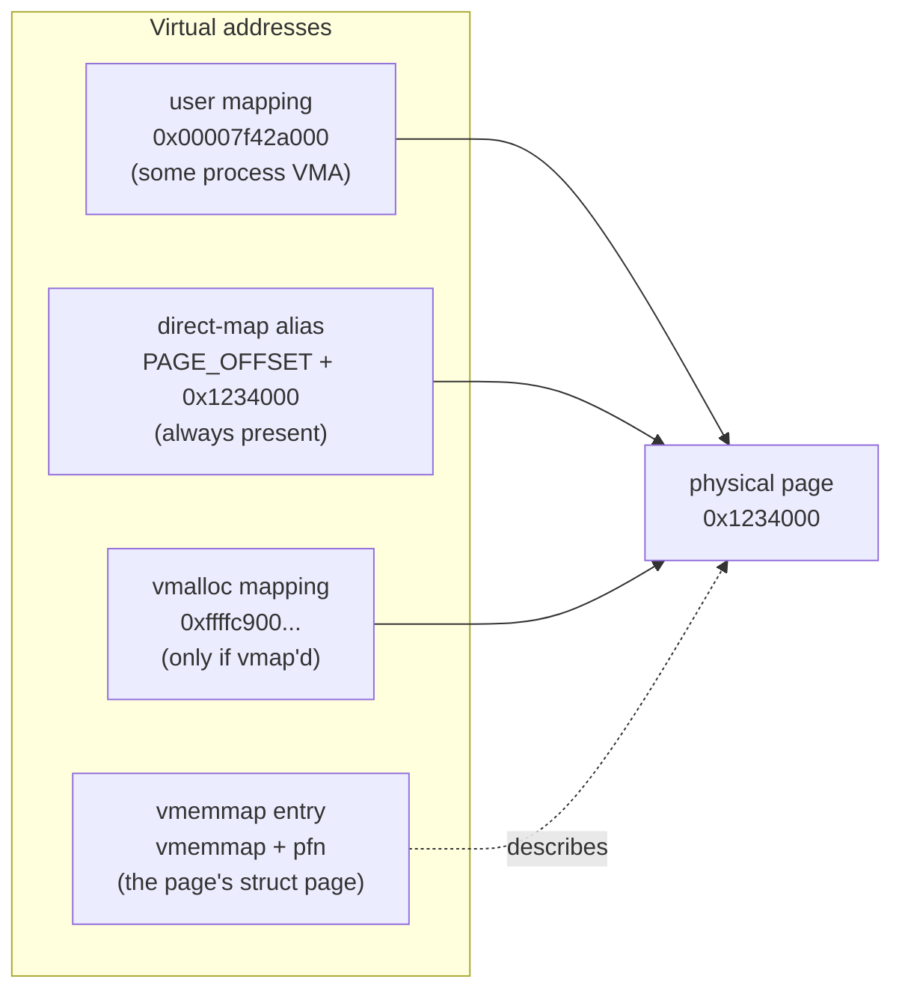

# The Kernel Address Space

> The direct map, vmemmap, vmalloc space, and KASLR — what lives in the kernel half of the address space, and why it's laid out the way it is

Every 64-bit process has an address space split in half: the lower half belongs to userspace and changes on every context switch, while the upper half belongs to the kernel and is (almost) identical in every process. This page is a guided tour of that upper half on x86-64: what each region is *for*, why the regions are placed and sized the way they are, and what the design costs.

If you want the translation mechanics (how a virtual address becomes a physical one), read [Page Tables](page-tables.md) and [x86-64 Page Tables](../arch/x86/page-tables.md) first. If you want to see this layout being *built* instruction by instruction at boot, read [x86_64 Boot Page Table Setup](boot-page-tables.md). This page is about the finished map and its rationale.

---

## The map

The canonical reference is [Documentation/arch/x86/x86_64/mm.rst](https://docs.kernel.org/arch/x86/x86_64/mm.html). For 4-level paging (48-bit virtual addresses), the kernel half looks like this:

```
x86-64 kernel virtual address space (4-level paging):

ffff800000000000 ┌────────────────────────────────┐ ← start of kernel half
                 │ guard hole (8 TB, reserved     │
                 │ for hypervisors)               │
ffff888000000000 ├────────────────────────────────┤ ← PAGE_OFFSET
                 │ direct map of all physical     │
                 │ memory ("physmap", 64 TB)      │   __va() / __pa()
ffffc88000000000 ├────────────────────────────────┤
                 │ hole (1 TB guard)              │
ffffc90000000000 ├────────────────────────────────┤ ← VMALLOC_START
                 │ vmalloc / ioremap (32 TB)      │
ffffe90000000000 ├────────────────────────────────┤
                 │ hole (1 TB guard)              │
ffffea0000000000 ├────────────────────────────────┤ ← VMEMMAP_START
                 │ vmemmap: struct page array     │
                 │ (1 TB)                         │   pfn_to_page() / page_to_pfn()
ffffeb0000000000 ├────────────────────────────────┤
                 │ unused hole                    │
ffffec0000000000 ├────────────────────────────────┤
                 │ KASAN shadow (16 TB, if        │
                 │ CONFIG_KASAN)                  │
fffffe0000000000 ├────────────────────────────────┤
                 │ cpu_entry_area                 │   entry stacks, GDT, TSS
fffffe8000000000 ├────────────────────────────────┤
                 │ LDT remap (PTI), ESPFIX        │
                 │ stacks, EFI runtime services   │
ffffffff80000000 ├────────────────────────────────┤ ← __START_KERNEL_map
                 │ kernel text + data (512 MB /   │
                 │ 1 GB with KASLR)               │   .text, .rodata, .data, .bss
ffffffffa0000000 ├────────────────────────────────┤ ← MODULES_VADDR
                 │ module mapping space (~1.5 GB) │
ffffffffff000000 ├────────────────────────────────┤
                 │ fixmap + legacy vsyscall       │
ffffffffffffffff └────────────────────────────────┘
```

Three observations before diving into individual regions:

1. **Everything is separated by unmapped guard holes.** A stray pointer that runs off the end of one region faults instead of silently corrupting the next one.
2. **The regions are absurdly oversized.** 64 TB of direct map, 32 TB of vmalloc — far more than any machine's RAM. Virtual address space in a 48-bit world is nearly free, so the layout spends it generously to keep region math simple and leave room for growth.
3. **The same map exists in every process.** Kernel mappings use the Global bit and shared page-table pages: every process PGD contains the same entries for the kernel half, so a kernel pointer means the same thing regardless of which process was running when the kernel was entered. ([KPTI](../arch/x86/page-tables.md) complicates this: while running userspace, only a minimal subset of this map is present.)

With 5-level paging (57-bit addresses, `CONFIG_X86_5LEVEL`), the same regions exist with the same ordering, just relocated and scaled up — the direct map grows to 32 PB and moves to `0xff11000000000000`. The layout is designed so the choice of paging depth changes constants, not structure.

### The canonical hole

Bits 63:48 of every valid address must be copies of bit 47 (sign extension). This hardware rule splits the address space into a "low" canonical half (`0x0000...` — userspace) and a "high" canonical half (`0xffff...` — kernel), with an enormous non-canonical gap between. The kernel gets the high half not by convention but because sign-extension makes "high half" cheap to test: any address with the top bit set is a kernel address. This is why kernel pointers all start with `0xffff` — and why a leaked pointer in a log file is instantly recognizable.

---

## The direct map: the kernel's view of RAM

The single most important region is the **direct map** (also called the *linear map* or *physmap*): a mapping of *all* physical memory, in order, starting at `PAGE_OFFSET`.

```c
/* arch/x86/include/asm/page_64.h (simplified) */
#define __va(x)  ((void *)((unsigned long)(x) + PAGE_OFFSET))
#define __pa(x)  ((unsigned long)(x) - PAGE_OFFSET)
```

### Why map all of RAM permanently?

Because the alternative is unbearable. The kernel constantly needs to touch arbitrary physical pages — a page it just allocated, a page cache page it's filling from disk, a page table page during a walk. Without a standing mapping, every such access would require creating a temporary mapping (as 32-bit kernels did with `kmap()` for highmem — a design so painful that killing it was a major motivation for going 64-bit). With the direct map, physical↔virtual conversion is one addition, no page table modification, no TLB shootdown.

This is *the* payoff of 64-bit virtual addresses: 32-bit kernels couldn't map more than ~1 GB of RAM into their 1 GB kernel half, so "highmem" pages had no permanent kernel address. On x86-64 the address space is large enough that mapping all RAM costs nothing but page-table pages.

Two consequences worth internalizing:

- **Every physical page has (at least) two virtual addresses.** A page mapped at `0x00007f...` in some process is *also* visible at `PAGE_OFFSET + phys` in the direct map. `kmalloc()` returns direct-map addresses; that's why `virt_to_phys()` works on kmalloc memory but not on vmalloc memory.


- **The direct map's page tables are shared and huge.** The kernel maps it with 1 GB and 2 MB pages wherever possible (`init_mem_mapping()` in [arch/x86/mm/init.c](https://git.kernel.org/pub/scm/linux/kernel/git/torvalds/linux.git/tree/arch/x86/mm/init.c)), so the whole of a large machine's RAM fits in a handful of TLB entries.

### The cost: fragmentation and attack surface

The direct map's huge pages are also its weakness. Features that change permissions on a *single* 4 KB page — `set_memory_ro()` for module text, `set_memory_np()` for [secretmem](https://lwn.net/Articles/812325/), DEBUG_PAGEALLOC — force the kernel to split a 1 GB or 2 MB direct-map page into 4 KB pages, permanently increasing TLB pressure for all kernel memory access. Direct-map fragmentation is a recurring performance topic on the mm lists, and it's why permission-changing APIs are used sparingly.

The security story is sharper. Because *user* pages are also visible through the direct map, a kernel bug that lets an attacker dereference a controlled kernel address can reach user-controlled data at a kernel address — the *ret2dir* attack family. Responses to this shaped several modern features:

- `memfd_secret()` (Linux 5.14) gives userspace pages that are **removed from the direct map** entirely — even a compromised kernel can't casually read them.
- KVM's `guest_memfd` applies the same idea to confidential-VM guest memory.
- The direct map is **not executable** (NX set), so having a second writable alias of a page can't be directly turned into code execution.

---

## vmemmap: the struct page array as an address-space trick

The kernel tracks every physical 4 KB page with a `struct page` (see [Life of a page](life-of-page.md)). On a 1 TB machine that's 256 million of them — and the core mm code wants `pfn_to_page()` to be *fast*, because it runs in every allocator hot path:

```c
/* include/asm-generic/memory_model.h — CONFIG_SPARSEMEM_VMEMMAP */
#define __pfn_to_page(pfn)  (vmemmap + (pfn))
#define __page_to_pfn(page) ((unsigned long)((page) - vmemmap))
```

One addition. No lookup tables, no bounds checks. This works because of a deliberate illusion: `vmemmap` is a **virtually contiguous** array of `struct page` starting at `VMEMMAP_START`, indexed by physical frame number — but it is only *populated* where physical memory actually exists. Real RAM is rarely physically contiguous (firmware reserves holes, devices claim windows, NUMA nodes start at aligned boundaries), so a flat physical array would waste memory on struct pages for holes. Instead, `SPARSEMEM_VMEMMAP` maps the backing pages for the array on demand, section by section, and leaves the holes unmapped virtual space — spending cheap virtual addresses to make the *logical* array contiguous even though the *physical* backing isn't.

The region is sized for the worst case: 64 TB of physical memory / 4 KB per page × 64 bytes per `struct page` = 1 TB of vmemmap. This is also the machinery that makes [memory hotplug](memory-hotplug.md) tractable — plugging in a new DIMM populates a new slice of vmemmap, and `pfn_to_page()` arithmetic never changes. Mike Rapoport's [LWN survey of memory models](https://lwn.net/Articles/789304/) tells the story of how FLATMEM and DISCONTIGMEM lost to this design.

---

## The vmalloc arena

Third major region: `VMALLOC_START` to `VMALLOC_END`, 32 TB of space for **virtually contiguous, physically scattered** allocations. The [vmalloc](vmalloc.md) page covers the allocator itself; from the address-space perspective, what matters is *why this is a separate region*:

- **It's the escape hatch from physical contiguity.** After boot, large physically-contiguous allocations become unreliable (see [Compaction](compaction.md)); vmalloc trades TLB efficiency (4 KB mappings, unlike the direct map's huge pages) for guaranteed success on large sizes.
- **It's where non-RAM mappings live.** `ioremap()` places device MMIO here; `vmap()` stitches arbitrary page sets into contiguous ranges.
- **Guard pages come free.** Each vmalloc area is separated from the next by an unmapped page, so linear overflows fault. This is exactly why kernel stacks moved into vmalloc space (`CONFIG_VMAP_STACK`, Linux 4.9, [LWN: Virtually mapped kernel stacks](https://lwn.net/Articles/692208/)): a stack overflow now hits a guard page and oopses cleanly instead of silently corrupting whatever was adjacent.

The subtle cost of the region: vmalloc mappings modify the shared kernel page tables at PGD level lazily, which historically required `vmalloc_fault()` — a page-fault path that filled in another process's top-level entries on first touch. Modern kernels pre-populate the shared PGD entries for the whole region to avoid that class of fault entirely.

---

## The top 2 GB: kernel text and modules

Kernel code doesn't run from the direct map. It gets its own alias at the very top of the address space, `__START_KERNEL_map = 0xffffffff80000000`, with modules immediately after. The placement is not aesthetic — it's an ABI constraint:

- The kernel is compiled with `-mcmodel=kernel`, which lets the compiler assume every symbol fits in a **sign-extended 32-bit immediate** — i.e., lives in the top 2 GB of the address space. That makes every global reference a short instruction instead of a 64-bit constant load.
- Modules must live within **±2 GB of kernel text** so that direct `call` instructions (32-bit relative displacement) reach kernel symbols without indirection. This is why the module area is glued to the kernel image, and why it's "only" ~1.5 GB in a space where every other region is measured in terabytes.

So kernel text has *three* addresses: its physical address, its direct-map alias, and its `__START_KERNEL_map` alias — and `__pa()` on a text address needs different arithmetic than on a direct-map address (`__phys_addr()` handles both cases).

---

## KASLR: shuffling the map

Everything above describes the *compile-time* layout. With `CONFIG_RANDOMIZE_BASE` and `CONFIG_RANDOMIZE_MEMORY` (both default on), boot-time KASLR randomizes, independently:

| What | Granularity | Entropy source region |
|------|-------------|----------------------|
| Kernel text (physical load address) | 2 MB | anywhere RAM allows |
| Kernel text (virtual) | 2 MB | 1 GB window at `__START_KERNEL_map` |
| Direct map base | 1 GB (PUD) | shuffled within the region |
| vmalloc base | 1 GB (PUD) | shuffled within the region |
| vmemmap base | 1 GB (PUD) | shuffled within the region |
| Module area base | randomized within its 1.5 GB |

The region randomization lives in [arch/x86/mm/kaslr.c](https://git.kernel.org/pub/scm/linux/kernel/git/torvalds/linux.git/tree/arch/x86/mm/kaslr.c): the direct map, vmalloc, and vmemmap keep their *order* but their bases are re-dealt within the available space, so an attacker who leaks a direct-map pointer learns nothing about where vmalloc or the kernel image landed.

Honest assessment of the design ([LWN: Kernel address space layout randomization](https://lwn.net/Articles/569635/)): KASLR raises the bar from "compute the address" to "find an info leak first" — and kernel pointer leaks are common enough (`%p` hashing, `kptr_restrict`, and `dmesg_restrict` all exist to fight them) that KASLR is best understood as one layer, not a boundary. Some things deliberately *cannot* be randomized: `cpu_entry_area` stays at a fixed address because the syscall/interrupt entry code must find its stacks before it has loaded any randomized base, and the fixmap region exists precisely to give early boot and special features compile-time-constant addresses.

---

## How arm64 does it differently

The same concepts appear on arm64 ([arm64 memory model](../arch/arm64/memory-model.md)) with one elegant hardware difference: instead of one page-table root (CR3) covering both halves, arm64 has **two** — `TTBR0_EL1` for the low (user) half and `TTBR1_EL1` for the high (kernel) half. The kernel half never changes on context switch, so switching processes touches only TTBR0; and the arm64 equivalent of KPTI (unmapping the kernel while in userspace) is a matter of pointing TTBR1 at a minimal table rather than maintaining paired PGDs. The arm64 layout also places the linear map at the *bottom* of the kernel half and the kernel image in vmalloc space — same ingredients, different plate.

---

## Observing the layout

```bash
# The authoritative map for your running kernel
sudo cat /sys/kernel/debug/page_tables/kernel     # CONFIG_PTDUMP_DEBUGFS
# Shows every kernel mapping with size (4K/2M/1G) and permissions —
# you can watch direct-map huge pages split after loading a module

# Where did KASLR put things this boot?
sudo grep -E "startup_64|_text" /proc/kallsyms     # kernel text base
# (non-root reads show 0000000000000000 — that's kptr_restrict working)

# Direct map huge-page coverage (watch DirectMap4k grow = fragmentation)
grep DirectMap /proc/meminfo

# vmalloc region usage
sudo cat /proc/vmallocinfo | head -20

# struct page overhead (the vmemmap's population, roughly)
grep -i memmap /proc/vmstat 2>/dev/null; grep Percpu /proc/meminfo

# Prove kmalloc lives in the direct map and vmalloc doesn't:
sudo cat /proc/vmallocinfo | awk '{print $1}' | head -3   # 0xffffc9... (vmalloc)
# kmalloc pointers (visible in slabinfo debugging) start 0xffff888... (direct map)
```

---

## Common issues

**`DirectMap4k` keeps growing.** Loading/unloading modules, BPF programs, and anything using `set_memory_*()` splits direct-map huge pages, and splits are (mostly) never merged back. On long-running machines this is a real, measurable TLB-pressure regression — one reason BPF and module allocations moved toward shared executable-memory pools.

**"vmalloc: allocation failure" on 64-bit.** Almost never actual space exhaustion (32 TB); usually it's fragmentation of a *sub*-region with tighter constraints (module space) or memory pressure during the backing-page allocation. Check `/proc/vmallocinfo` before assuming address-space exhaustion — and see [vmalloc](vmalloc.md).

**Oops addresses tell you the region.** `0xffff888...` — direct map (likely slab / page allocator memory, see [SLUB internals](slab-internals.md)); `0xffffc9...` — vmalloc/ioremap; `0xffffea...` — vmemmap, meaning someone handed a bad pfn to `pfn_to_page()`; `0xffffffff8...`/`a...` — kernel text or modules, likely a function pointer gone wrong. Memorizing four prefixes turns raw oops dumps into a map. (KASLR shifts these bases, but the prefixes usually survive well enough to classify.)

**NULL-ish but non-canonical pointer faults.** A "general protection fault" instead of a page fault on a bad dereference means the address was *non-canonical* — often a partially-overwritten pointer (e.g. the low bits of `0xffffffffffffffff` from an error code, or use-after-free poison like `0x6b6b6b6b6b6b6b6b`). The canonical hole is diagnostic gold.

---

## Version notes

| Change | Linux version | Why it matters here |
|--------|--------------|---------------------|
| x86-64 port with direct map + high kernel text | 2.4/2.5 era | The layout's basic shape |
| `SPARSEMEM_VMEMMAP` | 2.6.24 | O(1) `pfn_to_page()` via virtual array |
| Kernel text KASLR (`RANDOMIZE_BASE`) | 3.14 | Text base randomized |
| Memory-region KASLR (`RANDOMIZE_MEMORY`) | 4.8 | Direct map/vmalloc/vmemmap bases randomized |
| Virtually-mapped stacks (`VMAP_STACK`) | 4.9 | Stacks moved into vmalloc for guard pages |
| KPTI | 4.15 | Kernel half hidden while in userspace |
| `memfd_secret()` | 5.14 | User pages removable from direct map |
| 5-level paging layout | 4.14+ | Same structure, bigger constants |

---

## Further reading

### Kernel source & documentation

- [Documentation/arch/x86/x86_64/mm.rst](https://docs.kernel.org/arch/x86/x86_64/mm.html) — the canonical memory-map table (both 4- and 5-level)
- [arch/x86/mm/kaslr.c](https://git.kernel.org/pub/scm/linux/kernel/git/torvalds/linux.git/tree/arch/x86/mm/kaslr.c) — memory-region randomization, ~100 very readable lines
- [arch/x86/mm/init_64.c](https://git.kernel.org/pub/scm/linux/kernel/git/torvalds/linux.git/tree/arch/x86/mm/init_64.c) — direct map and vmemmap construction
- [include/asm-generic/memory_model.h](https://git.kernel.org/pub/scm/linux/kernel/git/torvalds/linux.git/tree/include/asm-generic/memory_model.h) — `pfn_to_page()` across memory models
- [Documentation/arch/arm64/memory.rst](https://docs.kernel.org/arch/arm64/memory.html) — the arm64 counterpart map

### Related pages

- [x86-64 Page Tables](../arch/x86/page-tables.md) — the translation machinery beneath this map, KPTI, PCID
- [x86_64 Boot Page Table Setup](boot-page-tables.md) — how this layout is constructed at boot
- [vmalloc](vmalloc.md) — the allocator that manages the vmalloc region
- [Page Tables](page-tables.md) — arch-independent view
- [Memory Hotplug](memory-hotplug.md) — vmemmap population at runtime
- [arm64 Memory Model](../arch/arm64/memory-model.md) — the TTBR0/TTBR1 split in depth

### LWN articles

- [Memory: the flat, the discontiguous, and the sparse](https://lwn.net/Articles/789304/) — why vmemmap won; the history of memory models
- [Kernel address space layout randomization](https://lwn.net/Articles/569635/) — KASLR's design and its honest limitations
- [Virtually mapped kernel stacks](https://lwn.net/Articles/692208/) — why stacks moved into vmalloc space
- [Keeping secrets in memfd areas](https://lwn.net/Articles/812325/) — the proposal that became `memfd_secret()`: removing pages from the direct map
