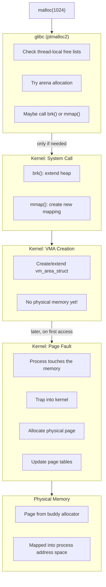
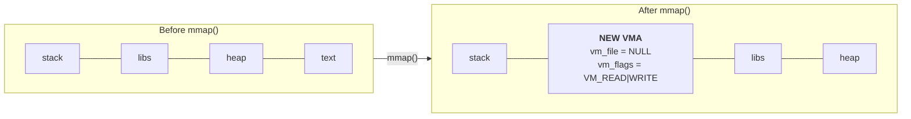
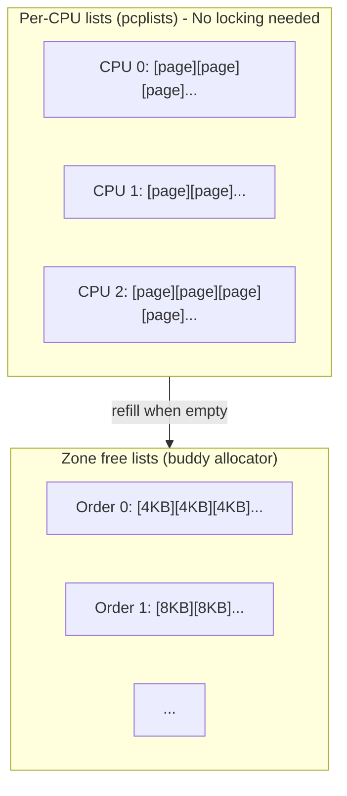
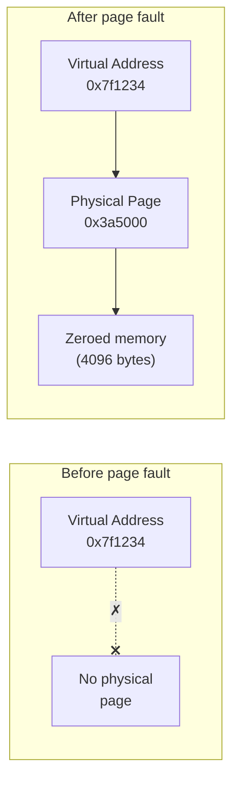

# Life of a malloc

> Tracing a userspace memory allocation from `malloc()` to physical pages

## What happens when you call malloc?

When a program calls `malloc(1024)`, what actually happens? The answer involves multiple layers of software, each optimizing for different goals:



The key insight: **malloc doesn't allocate physical memory**. It reserves virtual address space. Physical pages are allocated later, on first access, through demand paging.

## Stage 1: Userspace (glibc)

### The allocator's job

`malloc()` is a library function, not a system call. glibc implements it using ptmalloc2 (derived from dlmalloc). The allocator has one goal: satisfy memory requests without calling into the kernel more than necessary.

```c
void *malloc(size_t size);
```

For each allocation, ptmalloc2 checks:

1. **Thread-local cache**: Each thread has a tcache with small, recently-freed chunks. Fastest path - no locking.

2. **Fastbins**: Per-arena lists of small freed chunks (up to ~160 bytes default). Quick LIFO access.

3. **Small/large bins**: Sorted lists of freed chunks. Searched for best fit.

4. **Top chunk**: The "wilderness" - unused space at the end of the heap. Can be carved up.

5. **System call**: Only when all else fails does glibc ask the kernel for more memory.

### When glibc calls the kernel

glibc uses two system calls to get memory from the kernel:

| Method | When Used | Typical Threshold |
|--------|-----------|-------------------|
| `brk()` | Small allocations, heap growth | < 128KB (tunable via `M_MMAP_THRESHOLD`) |
| `mmap()` | Large allocations | >= 128KB |

The threshold is adaptive - glibc adjusts it based on allocation patterns. You can override with `mallopt(M_MMAP_THRESHOLD, bytes)`.

**Why two methods?**

- `brk()` extends the heap contiguously. Simple, but freed memory can't return to the kernel until everything above it is also freed.
- `mmap()` creates independent mappings. Can be returned to the kernel immediately with `munmap()`, but has more overhead.

See [brk vs mmap](brk-vs-mmap.md) for the full trade-off analysis.

## Stage 2: Kernel entry

### The brk() path

When glibc calls `brk()`, it's asking the kernel to move the program break - the end of the heap:

```c
// Userspace (glibc)
void *new_mem = sbrk(4096);  // Wrapper around brk()
```

The kernel handles this in [`mm/mmap.c`](https://git.kernel.org/pub/scm/linux/kernel/git/torvalds/linux.git/tree/mm/mmap.c):

```c
// Pseudocode - actual implementation has more validation
SYSCALL_DEFINE1(brk, unsigned long, brk)
{
    struct mm_struct *mm = current->mm;

    // Validate: not decreasing into existing mappings,
    // not exceeding RLIMIT_DATA, etc.

    // Extend or shrink the heap VMA
    if (brk > mm->brk)
        do_brk_flags(...);  // Creates/extends VMA

    mm->brk = brk;
    return brk;
}
```

The kernel updates the process's `mm_struct` to extend the heap VMA. No physical memory is allocated yet - just the virtual address range is reserved.

### The mmap() path

For larger allocations, glibc uses `mmap()` with `MAP_ANONYMOUS`:

```c
// Userspace (glibc simplified)
void *ptr = mmap(NULL, size, PROT_READ | PROT_WRITE,
                 MAP_PRIVATE | MAP_ANONYMOUS, -1, 0);

// Kernel: mm/mmap.c
SYSCALL_DEFINE6(mmap, ...)
{
    // Find free virtual address range
    // Create new VMA
    // Return address to userspace
}
```

Again, no physical memory yet. The kernel creates a VMA describing the mapping and returns. No page table entries exist yet - they'll be created lazily on first access.

## Stage 3: VMA creation

Both `brk()` and `mmap()` result in VMA (Virtual Memory Area) creation or modification.

```c
// From include/linux/mm_types.h
struct vm_area_struct {
    unsigned long vm_start;     // Start address
    unsigned long vm_end;       // End address (exclusive)
    struct mm_struct *vm_mm;    // Owning address space
    pgprot_t vm_page_prot;      // Access permissions
    unsigned long vm_flags;     // VM_READ, VM_WRITE, etc.
    struct file *vm_file;       // NULL for anonymous memory
    // ...
};
```

For a `malloc()` that triggers `mmap()`:



The new VMA is added to the process's maple tree (or red-black tree in kernels before v6.1). See [process address space](mmap.md) for details on VMA organization.

**Key point**: When `malloc()` returns, you have a valid pointer, but no physical memory backs it. The page table entries for this region don't exist yet - they're created on first access when the CPU faults.

## Stage 4: Page fault

Physical memory is allocated on first access. When the program reads or writes the malloc'd memory:

```c
char *ptr = malloc(4096);
ptr[0] = 'x';  // First access - triggers page fault
```

The CPU finds no valid page table entry and triggers a page fault exception. The kernel handles it:

```c
// Simplified from mm/memory.c
static vm_fault_t handle_pte_fault(struct vm_fault *vmf)
{
    // PTE is empty - this is a new page
    if (pte_none(vmf->orig_pte)) {
        if (vma_is_anonymous(vmf->vma))
            return do_anonymous_page(vmf);  // Our path
        else
            return do_fault(vmf);  // File-backed
    }
    // ... other cases (COW, swap, etc.)
}
```

### Anonymous page allocation

For anonymous memory (heap, stack), [`do_anonymous_page()`](https://git.kernel.org/pub/scm/linux/kernel/git/torvalds/linux.git/tree/mm/memory.c) runs:

```c
// Simplified from mm/memory.c
static vm_fault_t do_anonymous_page(struct vm_fault *vmf)
{
    struct folio *folio;

    // 1. Allocate a physical page (folio)
    //    A folio is the modern replacement for struct page - it represents
    //    one or more contiguous pages as a single unit. For most anonymous
    //    allocations, this is a single 4KB page.
    folio = vma_alloc_zeroed_movable_folio(vmf->vma, vmf->address);

    // 2. Prepare page table entry
    entry = mk_pte(&folio->page, vma->vm_page_prot);
    if (vma->vm_flags & VM_WRITE)
        entry = pte_mkwrite(pte_mkdirty(entry), vma);

    // 3. Install in page table
    set_pte_at(vma->vm_mm, vmf->address, vmf->pte, entry);

    // 4. Add to reverse mapping (for reclaim)
    folio_add_new_anon_rmap(folio, vma, vmf->address);

    return 0;
}
```

This is where physical memory finally gets allocated.

## Stage 5: Page allocator

The `vma_alloc_zeroed_movable_folio()` call ultimately reaches the buddy allocator:

```c
// The chain of calls (simplified):
vma_alloc_zeroed_movable_folio()
  → folio_alloc()
    → __folio_alloc()
      → __alloc_pages()  // The core buddy allocator entry point
```

[`__alloc_pages()`](https://git.kernel.org/pub/scm/linux/kernel/git/torvalds/linux.git/tree/mm/page_alloc.c) is the heart of Linux memory allocation:

```c
// mm/page_alloc.c (heavily simplified)
struct page *__alloc_pages(gfp_t gfp, unsigned int order, int nid, nodemask_t *nodemask)
{
    // 1. Fast path: try per-CPU lists
    page = get_page_from_freelist(gfp, order, ...);
    if (page)
        return page;

    // 2. Slow path: wake kswapd, try harder
    page = __alloc_pages_slowpath(gfp, order, ...);
    return page;
}
```

### Fast path

Most allocations succeed immediately from per-CPU page lists or zone free lists:



For a single-page allocation (typical for page faults), the kernel checks the per-CPU list first. This requires no locking and is very fast.

### Slow path

If free pages are low:

1. **Wake kswapd**: Background reclaim daemon
2. **Direct reclaim**: The allocating process frees some pages itself
3. **Compaction**: Defragment memory for high-order allocations
4. **OOM killer**: Last resort - kill a process to free memory

See [page reclaim](reclaim.md) for details on memory pressure handling.

## Stage 6: Return to userspace

After the page fault handler succeeds:

1. **Page table updated**: The PTE now points to the physical page
2. **TLB entry created**: CPU caches the virtual→physical mapping
3. **Execution resumes**: The faulting instruction is retried



The program continues, unaware that a complex dance just occurred. From its perspective, `ptr[0] = 'x'` just worked.

## Why demand paging?

This lazy allocation strategy has major benefits:

### 1. Fast malloc

`malloc()` returns immediately. The kernel work is deferred until actually needed.

### 2. Sparse allocations are cheap

A program can allocate 1GB but only use 4KB. It pays only for what it touches:

```c
// "Allocate" 1GB
char *huge = malloc(1024 * 1024 * 1024);

// Only use 4KB - only one physical page allocated
huge[0] = 'a';
```

### 3. Overcommit works

The kernel can promise more memory than physically exists. Most programs don't use all they request. See [memory overcommit](overcommit.md).

### 4. fork() is fast

Child processes share pages with parents via [copy-on-write](cow.md). Physical copies only happen when either process writes.

## Try it yourself

### Watch malloc in action

```bash
# Trace system calls from a simple allocation
strace -e brk,mmap,munmap -f sh -c 'head -c 1M /dev/zero > /dev/null'

# See page faults
perf stat -e page-faults,minor-faults,major-faults ./your_program
```

### Observe demand paging

```bash
# Create a program that allocates but doesn't touch memory
cat > /tmp/lazy.c << 'EOF'
#include <stdio.h>
#include <stdlib.h>
#include <unistd.h>

int main() {
    printf("PID: %d\n", getpid());
    printf("Before malloc...\n");
    getchar();

    char *p = malloc(100 * 1024 * 1024);  // 100MB
    printf("After malloc, before touch...\n");
    getchar();

    for (int i = 0; i < 100 * 1024 * 1024; i += 4096)
        p[i] = 'x';  // Touch each page
    printf("After touching all pages...\n");
    getchar();

    return 0;
}
EOF
gcc -o /tmp/lazy /tmp/lazy.c
/tmp/lazy

# In another terminal, watch RSS grow:
watch -n 1 'ps -o pid,vsz,rss,comm -p $(pgrep lazy)'
# VSZ jumps after malloc, RSS jumps only after touching
```

### Examine the malloc threshold

```bash
# See glibc's mmap threshold behavior
cat > /tmp/mmap_test.c << 'EOF'
#include <stdio.h>
#include <stdlib.h>

int main() {
    // Small allocation - likely uses brk()
    void *small = malloc(1024);
    printf("Small (1KB): %p\n", small);

    // Large allocation - likely uses mmap()
    void *large = malloc(256 * 1024);
    printf("Large (256KB): %p\n", large);

    // Notice the address ranges are very different
    return 0;
}
EOF
gcc -o /tmp/mmap_test /tmp/mmap_test.c
strace -e brk,mmap /tmp/mmap_test
```

### Trace page faults in the kernel

```bash
# Enable page fault tracing (requires root, debugfs mounted)
echo 1 > /sys/kernel/debug/tracing/events/exceptions/page_fault_user/enable
cat /sys/kernel/debug/tracing/trace_pipe &

# Run a program - see faults in real time
./your_program

# Disable when done
echo 0 > /sys/kernel/debug/tracing/events/exceptions/page_fault_user/enable
```

## Common misconceptions

### "malloc allocates memory"

Not really. It reserves address space. Physical pages come later via page faults.

### "My program uses 1GB because malloc(1GB) succeeded"

Check RSS (Resident Set Size), not VSZ (Virtual Size). VSZ includes all reserved address space; RSS is physical memory actually used.

```bash
ps -o pid,vsz,rss,comm -p <pid>
```

### "Page faults are bad"

Minor faults (demand paging) are normal and expected. Major faults (reading from disk) are expensive. The kernel optimizes for minor faults to be fast.

## Key source files

| File | What It Does |
|------|--------------|
| [`mm/mmap.c`](https://git.kernel.org/pub/scm/linux/kernel/git/torvalds/linux.git/tree/mm/mmap.c) | brk(), mmap() implementation |
| [`mm/memory.c`](https://git.kernel.org/pub/scm/linux/kernel/git/torvalds/linux.git/tree/mm/memory.c) | Page fault handling, do_anonymous_page() |
| [`mm/page_alloc.c`](https://git.kernel.org/pub/scm/linux/kernel/git/torvalds/linux.git/tree/mm/page_alloc.c) | Buddy allocator, __alloc_pages() |
| [`include/linux/mm_types.h`](https://git.kernel.org/pub/scm/linux/kernel/git/torvalds/linux.git/tree/include/linux/mm_types.h) | vm_area_struct, mm_struct definitions |

## History

### Demand paging origins

Demand paging has been part of Linux since the beginning. The basic mechanism - mapping virtual addresses without backing physical memory until access - is fundamental to Unix-like systems.

### VMA management evolution

In **Stage 3** above, when `mmap()` creates a new VMA, it must be inserted into the process's VMA collection for later lookup (e.g., during page faults). The data structure for this has evolved:

**Red-black tree (early Linux)**: VMAs were organized in an rb-tree for `O(log n)` lookup. Simple but required careful locking.

**Maple tree (v6.1, 2022)**: VMAs moved to a maple tree - a B-tree variant optimized for cache locality and RCU-safe operations. This allows concurrent VMA lookups without holding `mmap_lock`, improving page fault scalability.

**Commit**: [d4af56c5c7c6](https://git.kernel.org/linus/d4af56c5c7c6) ("mm: start tracking VMAs with maple tree") | [LKML](https://lore.kernel.org/linux-mm/20220906194824.2110408-9-Liam.Howlett@oracle.com/)

**Author**: Liam Howlett (Oracle)

### Folio conversion (v5.16+)

In **Stage 4** above, `do_anonymous_page()` allocates a `struct folio` rather than a raw `struct page`. A folio is the modern abstraction for memory:

- **What it is**: A folio represents one or more physically contiguous pages managed as a unit
- **Why it exists**: The old `struct page` API was ambiguous - functions didn't know if they received a head page, tail page, or single page. Folios make the semantics explicit.
- **In our flow**: `vma_alloc_zeroed_movable_folio()` allocates a folio, which for anonymous faults is typically a single 4KB page (or a 2MB transparent huge page if enabled)

**Commit**: [62906027091f](https://git.kernel.org/linus/62906027091f) ("mm: add struct folio documentation") | [LKML](https://lore.kernel.org/linux-mm/20210712030701.4000097-1-willy@infradead.org/)

**Author**: Matthew Wilcox (Oracle)

## Further reading

### Related docs

- [Process address space](mmap.md) - VMAs, mmap details
- [Page allocator](page-allocator.md) - Buddy system internals
- [Memory overcommit](overcommit.md) - Why demand paging enables overcommit
- [brk vs mmap](brk-vs-mmap.md) - When glibc uses each method
- [Page reclaim](reclaim.md) - What happens when memory runs low

### External resources

- [glibc malloc internals](https://sourceware.org/glibc/wiki/MallocInternals) - Official glibc documentation
