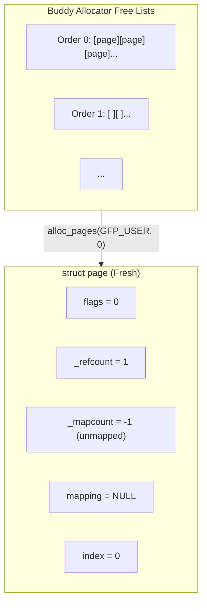

# Life of a page

> Following a physical page from allocation through reclaim and reuse

## The journey of a page

A physical page in Linux leads an eventful life. It's born in the buddy allocator, assigned to serve a process or cache, tracked for activity, and eventually reclaimed when memory runs low. This document follows that journey.


## Birth: Page allocation

Every page's life begins in the buddy allocator's free lists. When the kernel needs a page - for a process, page cache, or kernel data structure - it calls [`alloc_pages()`](https://git.kernel.org/pub/scm/linux/kernel/git/torvalds/linux.git/tree/mm/page_alloc.c):

```c
struct page *alloc_pages(gfp_t gfp, unsigned int order);
```

### From free list to assigned



The page starts with a clean slate: refcount of 1 (the allocator holds it), no mappings, no flags indicating special state.

### Page initialization

Depending on use, the page gets initialized differently:

| Use Case | Initialization |
|----------|----------------|
| Anonymous (heap/stack) | Zeroed, added to anon rmap |
| Page cache | Linked to file's address_space |
| Slab object | Added to slab cache's freelist |
| Kernel buffer | May or may not be zeroed |

For anonymous pages (the most common case from [malloc](life-of-malloc.md)), the kernel zeros the page and sets up reverse mappings:

```c
// From mm/memory.c do_anonymous_page()
folio = vma_alloc_zeroed_movable_folio(vma, addr);
folio_add_new_anon_rmap(folio, vma, addr);
folio_add_lru(folio);  // Add to LRU for tracking
```

## The page structure

Every physical page frame is represented by a `struct page` (or `struct folio` for compound pages):

```c
// Simplified from include/linux/mm_types.h
struct page {
    unsigned long flags;        // Page state flags (PG_locked, PG_dirty, etc.)
    atomic_t _refcount;         // Reference count
    atomic_t _mapcount;         // How many page tables map this page
    struct address_space *mapping;  // Owner (file or anon_vma)
    pgoff_t index;              // Offset within mapping
    struct list_head lru;       // LRU list linkage
    // ... many more fields via unions
};
```

### Key page flags

Flags track the page's state through its lifecycle:

| Flag | Meaning |
|------|---------|
| `PG_locked` | Page is locked for I/O or other exclusive operation |
| `PG_referenced` | Page was recently accessed |
| `PG_uptodate` | Page content is valid |
| `PG_dirty` | Page modified, needs writeback |
| `PG_lru` | Page is on an LRU list |
| `PG_active` | Page is on active LRU list |
| `PG_swapbacked` | Page can be swapped (anonymous) |
| `PG_swapcache` | Page is in swap cache |
| `PG_writeback` | Page is being written to disk |
| `PG_reclaim` | Page is being reclaimed |

View a page's flags in debugfs:

```bash
# For a specific PFN (page frame number)
cat /sys/kernel/debug/page_owner  # If CONFIG_PAGE_OWNER enabled
```

### Reference counting

The page's `_refcount` tracks how many users hold the page:


The `_mapcount` tracks page table mappings specifically:
- `-1`: Not mapped in any page table
- `0`: Mapped in exactly one page table
- `N`: Mapped in N+1 page tables (shared)

## Active use: Working set

Once allocated and mapped, the page enters the working set. The kernel tracks access patterns to make reclaim decisions later.

### LRU lists

Pages are organized into LRU (Least Recently Used) lists per memory node:


Pages move between lists based on access:

1. **New pages**: Start on inactive list
2. **Accessed on inactive**: Get `PG_referenced` flag set
3. **Accessed again**: Promoted to active list
4. **Active but not accessed**: Demoted to inactive
5. **Inactive and not accessed**: Candidates for reclaim

### The referenced flag dance

The `PG_referenced` flag implements a second-chance algorithm:


This prevents single accesses from keeping cold pages in memory while still protecting genuinely hot pages.

### Multi-Gen LRU (MGLRU)

Kernel v6.1 introduced MGLRU as an alternative to the classic two-list model:


MGLRU uses multiple generations instead of two lists, providing finer-grained aging and better performance under memory pressure.

```bash
# Check if MGLRU is enabled
cat /sys/kernel/mm/lru_gen/enabled
# 0x0007 = fully enabled
```

See [page reclaim](reclaim.md) for details on MGLRU.

## Reclaim: The page's twilight

When memory runs low, the kernel must reclaim pages. A page's fate depends on its type and state.

### The reclaim decision tree


### File-backed pages: Easy reclaim

File pages (page cache) are relatively easy to reclaim:


*Can re-read from disk if needed later*

The page can always be re-read from the backing file if needed again.

### Anonymous pages: Swap or die

Anonymous pages (heap, stack) have no backing file. Without swap, they can't be reclaimed:


*Page content preserved in swap space*

This is why running without swap can lead to OOM kills even with "free" file cache pages.

### The swap-out process

When an anonymous page is chosen for swap-out:

```c
// Simplified from mm/vmscan.c shrink_folio_list()
static unsigned int shrink_folio_list(struct list_head *folio_list, ...)
{
    // For each folio on the list...

    // 1. Try to unmap from all page tables
    try_to_unmap(folio, ...);

    // 2. If anonymous and unmapped, add to swap
    if (folio_test_anon(folio) && !folio_mapped(folio)) {
        if (!add_to_swap(folio))
            goto activate_locked;  // Failed, keep the page

        // 3. Write to swap device
        pageout(folio, ...);
    }

    // 4. If writeback complete, free the page
    if (!folio_test_writeback(folio))
        free_unref_folios(...);
}
```

The page table entry is replaced with a swap entry:


## Resurrection: Swap-in

When a process accesses a swapped page, a page fault brings it back:


### Swap cache

The swap cache avoids redundant I/O when multiple processes share a swapped page:


The page stays in swap cache until:
- All processes have private copies (after COW)
- Or the swap slot is needed

## Death and rebirth

Eventually, a page's content is no longer needed. The page returns to the buddy allocator:

```c
// Final path
put_page(page);  // Decrement refcount
  → folio_put()
    → if (refcount == 0)
        → free_unref_page()
          → Return to per-CPU freelist or buddy
```

### Page reuse

The freed page doesn't stay free for long:


Per-CPU lists keep recently-freed pages hot in cache for immediate reuse.

## The complete lifecycle

Putting it all together for a typical anonymous page:


**State transitions:**

| Stage | refcount | mapcount |
|-------|----------|----------|
| Page fault alloc | 1→2 | -1→0 |
| Active/Inactive LRU | 2 | 0 |
| Swap out | 0 | -1 |
| Swap in | 1→2 | -1→0 |

## Try it yourself

### Watch page state changes

```bash
# View system-wide page statistics
cat /proc/vmstat | grep -E "^pg|^ps"

# Key metrics:
# pgalloc_*     - Pages allocated
# pgfree        - Pages freed
# pgactivate    - Pages moved to active list
# pgdeactivate  - Pages moved to inactive list
# pswpin/pswpout - Swap activity
```

### Monitor LRU activity

```bash
# Watch LRU list sizes
watch -n 1 'cat /proc/meminfo | grep -E "Active|Inactive"'

# Per-node LRU stats
cat /sys/devices/system/node/node0/meminfo
```

### Trace page lifecycle events

```bash
# Enable page allocation tracing
echo 1 > /sys/kernel/debug/tracing/events/kmem/mm_page_alloc/enable
echo 1 > /sys/kernel/debug/tracing/events/kmem/mm_page_free/enable

# Watch allocations and frees
cat /sys/kernel/debug/tracing/trace_pipe

# Disable when done
echo 0 > /sys/kernel/debug/tracing/events/kmem/mm_page_alloc/enable
echo 0 > /sys/kernel/debug/tracing/events/kmem/mm_page_free/enable
```

### Observe swap behavior

```bash
# Watch swap activity in real-time
vmstat 1

# Columns si/so show swap in/out per second

# Detailed swap info
cat /proc/swaps
swapon --show

# Per-process swap usage
for pid in /proc/[0-9]*; do
    name=$(cat $pid/comm 2>/dev/null)
    swap=$(grep VmSwap $pid/status 2>/dev/null | awk '{print $2}')
    [ -n "$swap" ] && [ "$swap" != "0" ] && echo "$name: ${swap}kB"
done | sort -t: -k2 -n -r | head
```

### Force reclaim to observe page lifecycle

```bash
# Drop clean caches (doesn't affect anonymous pages)
echo 1 > /proc/sys/vm/drop_caches  # Page cache
echo 2 > /proc/sys/vm/drop_caches  # Dentries and inodes
echo 3 > /proc/sys/vm/drop_caches  # Both

# Force memory pressure (careful on production!)
stress --vm 1 --vm-bytes 90% --vm-keep &
watch -n 1 'cat /proc/meminfo | grep -E "MemFree|SwapUsed|Active|Inactive"'
```

## Key source files

| File | What It Does |
|------|--------------|
| [`include/linux/mm_types.h`](https://git.kernel.org/pub/scm/linux/kernel/git/torvalds/linux.git/tree/include/linux/mm_types.h) | struct page, struct folio definitions |
| [`include/linux/page-flags.h`](https://git.kernel.org/pub/scm/linux/kernel/git/torvalds/linux.git/tree/include/linux/page-flags.h) | PG_* flag definitions |
| [`mm/page_alloc.c`](https://git.kernel.org/pub/scm/linux/kernel/git/torvalds/linux.git/tree/mm/page_alloc.c) | Buddy allocator, page allocation |
| [`mm/vmscan.c`](https://git.kernel.org/pub/scm/linux/kernel/git/torvalds/linux.git/tree/mm/vmscan.c) | Page reclaim, LRU management |
| [`mm/swap_state.c`](https://git.kernel.org/pub/scm/linux/kernel/git/torvalds/linux.git/tree/mm/swap_state.c) | Swap cache |
| [`mm/rmap.c`](https://git.kernel.org/pub/scm/linux/kernel/git/torvalds/linux.git/tree/mm/rmap.c) | Reverse mapping, finding page table entries |

## History

### struct page evolution

The `struct page` has grown and changed significantly over the years:

**Early Linux**: Simple structure tracking basic page state.

**v2.5/2.6**: Added reverse mapping (rmap) support - the ability to find all page table entries pointing to a page. Essential for reclaim.

**v4.x-5.x**: Increasing use of compound pages (multi-page allocations treated as one unit).

**v5.16 (2022)**: Introduction of `struct folio` to formalize compound page handling:

**Commit**: [62906027091f](https://git.kernel.org/linus/62906027091f) ("mm: add struct folio documentation") | [LKML](https://lore.kernel.org/linux-mm/20210712030701.4000097-1-willy@infradead.org/)

**Author**: Matthew Wilcox (Oracle)

Throughout the lifecycle above, you see `folio` instead of `page` in modern code:
- **Stage 1**: `vma_alloc_zeroed_movable_folio()` allocates a folio
- **Stage 4**: `shrink_folio_list()` processes folios during reclaim
- **Why it matters**: A folio explicitly represents one or more contiguous pages as a unit, eliminating ambiguity about whether a function receives a head page, tail page, or single page

### LRU evolution

The LRU system described in Stage 2 (page tracking) has evolved significantly:

**Classic LRU (pre-v2.6.28)**: Single active/inactive list for all pages.

**Split LRU (v2.6.28, 2008)**: Separate lists for anonymous and file pages, as shown in the diagrams above.

**MGLRU (v6.1, 2022)**: Multi-generational LRU (covered in the MGLRU section above) replaces two lists with multiple generations for finer-grained aging.

**Commit**: [ac35a4902374](https://git.kernel.org/linus/ac35a4902374) ("mm: multi-gen LRU: minimal implementation") | [LKML](https://lore.kernel.org/linux-mm/20220815071332.627393-1-yuzhao@google.com/)

**Author**: Yu Zhao (Google)

MGLRU significantly improves performance under memory pressure by avoiding the "refault" problem where useful pages get evicted too aggressively.

## Further reading

### Related docs

- [Page allocator](page-allocator.md) - Buddy system details
- [Page reclaim](reclaim.md) - Reclaim mechanisms in depth
- [Swap](swap.md) - Swap subsystem details
- [Life of a malloc](life-of-malloc.md) - How pages get allocated for userspace

### LWN articles

- [The folio pull request](https://lwn.net/Articles/849538/) (2021) - Why folios were introduced
- [Multi-generational LRU: the basics](https://lwn.net/Articles/851184/) (2021) - MGLRU design
