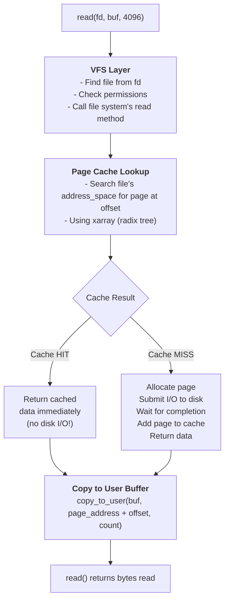
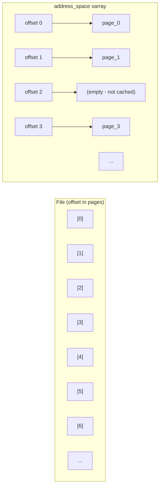
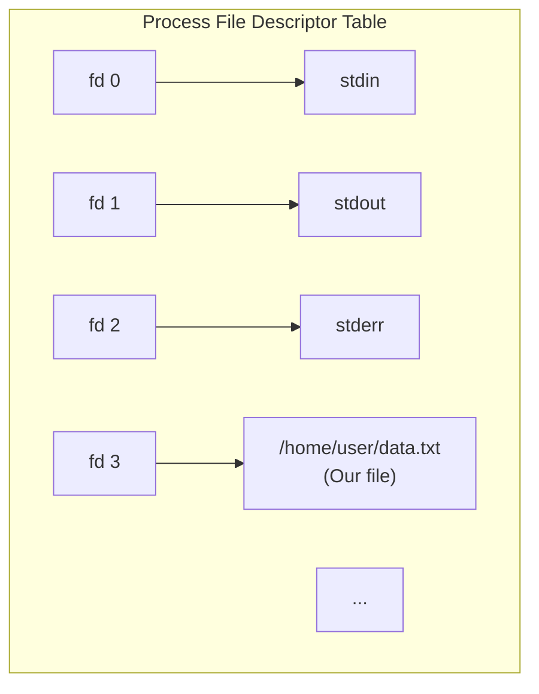
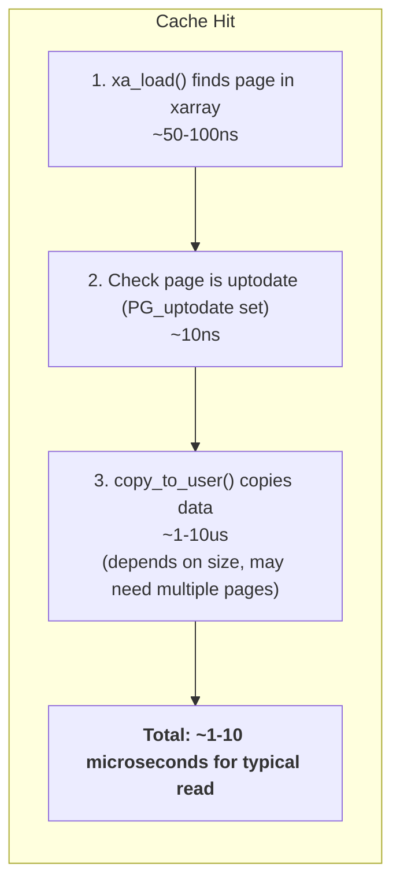
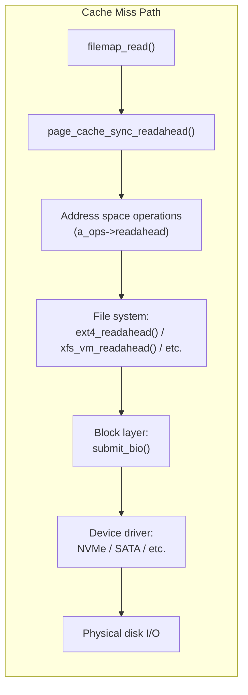
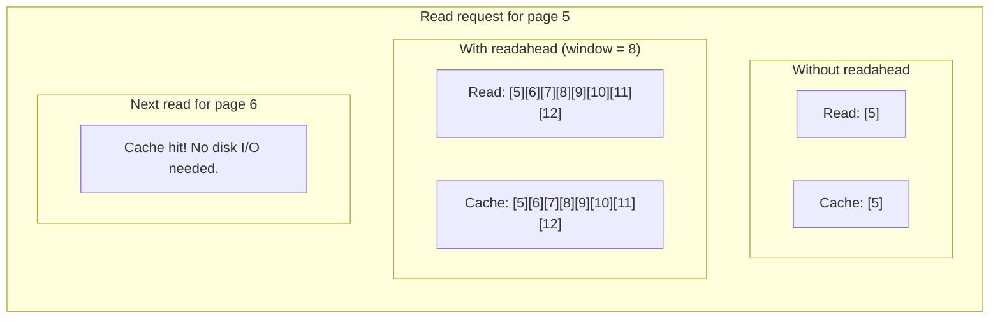
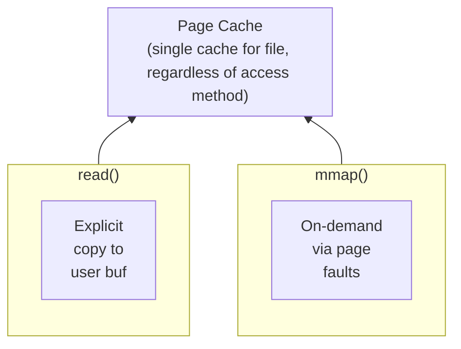
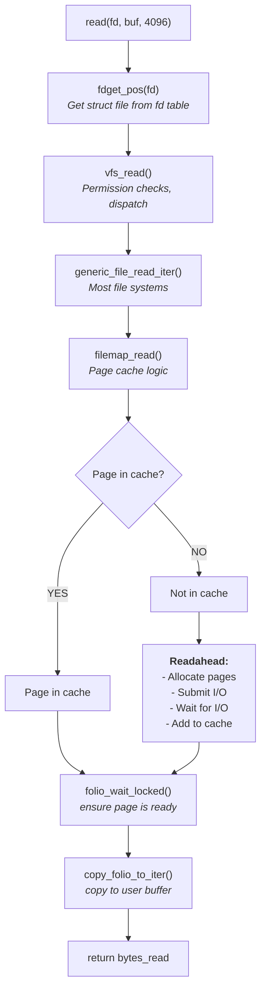

# Life of a file read

> Tracing a read() syscall through the page cache

## What happens when you read a file?

When a program reads a file, the data rarely comes directly from disk. The kernel maintains a **page cache** - a cache of file data in memory. Most reads are satisfied from this cache without touching the disk at all.



The key insight: **the page cache makes most reads fast**. Sequential file reads typically hit cache 99%+ of the time due to readahead.

## The page cache

The page cache is the kernel's cache of file contents. Every file read goes through it.

### Why cache file data?

| Operation | Latency |
|-----------|---------|
| Memory access | ~100 nanoseconds |
| SSD read | ~100 microseconds (1000x slower) |
| HDD read | ~10 milliseconds (100,000x slower) |

Even with fast SSDs, memory is orders of magnitude faster. The page cache exploits temporal locality - data read once is likely to be read again soon.

### Page cache organization

Each open file has an `address_space` that manages its cached pages:

```c
// From include/linux/fs.h
struct address_space {
    struct inode *host;           // Owning inode
    struct xarray i_pages;        // Cached pages (xarray/radix tree)
    atomic_t i_mmap_writable;     // Writable mappings
    struct rb_root_cached i_mmap; // Tree of private/shared mappings
    unsigned long nrpages;        // Number of cached pages
    const struct address_space_operations *a_ops;  // Operations
    // ...
};
```

Pages are indexed by file offset:



## Stage 1: System call entry

A user program calls `read()`:

```c
// User space
ssize_t n = read(fd, buffer, 4096);

// Kernel entry: fs/read_write.c
SYSCALL_DEFINE3(read, unsigned int, fd, char __user *, buf, size_t, count)
{
    struct fd f = fdget_pos(fd);

    // ... permission checks ...

    ret = vfs_read(f.file, buf, count, &pos);

    fdput_pos(f);
    return ret;
}
```

### From fd to file

The kernel translates the file descriptor to a `struct file`:



```c
struct file {
    struct path f_path;           // Dentry and mount
    struct inode *f_inode;        // Inode (file metadata)
    const struct file_operations *f_op;  // read/write operations
    loff_t f_pos;                 // Current file position
    struct address_space *f_mapping;  // Page cache
    // ...
};
```

## Stage 2: VFS read dispatch

`vfs_read()` calls the file system's read implementation:

```c
// fs/read_write.c
ssize_t vfs_read(struct file *file, char __user *buf,
                 size_t count, loff_t *pos)
{
    // Check we can read
    if (!(file->f_mode & FMODE_READ))
        return -EBADF;

    // Check buffer is valid user memory
    if (!access_ok(buf, count))
        return -EFAULT;

    // Call file system's read method
    if (file->f_op->read)
        ret = file->f_op->read(file, buf, count, pos);
    else if (file->f_op->read_iter)
        ret = new_sync_read(file, buf, count, pos);

    return ret;
}
```

Most file systems use the generic `read_iter` path, which goes through `generic_file_read_iter()`:

```c
// mm/filemap.c
ssize_t generic_file_read_iter(struct kiocb *iocb, struct iov_iter *iter)
{
    if (iocb->ki_flags & IOCB_DIRECT)
        return mapping_direct_IO(...);  // Bypass cache

    return filemap_read(iocb, iter, 0);  // Normal path
}
```

## Stage 3: Page cache lookup

The core of file reading is [`filemap_read()`](https://git.kernel.org/pub/scm/linux/kernel/git/torvalds/linux.git/tree/mm/filemap.c):

```c
// mm/filemap.c (simplified)
ssize_t filemap_read(struct kiocb *iocb, struct iov_iter *iter,
                     ssize_t already_read)
{
    struct file *file = iocb->ki_filp;
    struct address_space *mapping = file->f_mapping;
    pgoff_t index = iocb->ki_pos >> PAGE_SHIFT;  // Page index from offset

    for (;;) {
        // 1. Try to find page in cache
        folio = filemap_get_folio(mapping, index);

        if (IS_ERR(folio)) {
            // Cache miss - need to read from disk
            folio = page_cache_sync_readahead(...);
        }

        // 2. Wait for page to be up-to-date
        folio_wait_locked(folio);
        if (!folio_test_uptodate(folio))
            goto error;

        // 3. Copy data to user buffer
        copied = copy_folio_to_iter(folio, offset, bytes, iter);

        folio_put(folio);
        index++;
    }
}
```

### The xarray lookup

Finding a page in the cache uses the xarray (evolved from radix tree):

```c
// Finding page at index
struct folio *filemap_get_folio(struct address_space *mapping,
                                 pgoff_t index)
{
    return __filemap_get_folio(mapping, index, FGP_ENTRY, 0);
}

struct folio *__filemap_get_folio(struct address_space *mapping,
                                   pgoff_t index, fgf_t fgp_flags,
                                   gfp_t gfp)
{
    struct folio *folio;

    // Lock-free lookup in xarray
    folio = xa_load(&mapping->i_pages, index);

    if (!folio || xa_is_value(folio))
        return ERR_PTR(-ENOENT);  // Not in cache

    // Found - increment reference
    folio_get(folio);
    return folio;
}
```

The lookup is effectively `O(1)` for practical file sizes - `xarray` is a radix tree with bounded height, not a balanced tree, so performance doesn't degrade with more pages.

## Stage 4: Cache hit (fast path)

When the page is in cache and up-to-date, reading is fast:



No disk I/O, no waiting, just memory copies.

### The copy to userspace

```c
// Copy from kernel page to user buffer
size_t copy_folio_to_iter(struct folio *folio, size_t offset,
                          size_t bytes, struct iov_iter *i)
{
    // Map the page temporarily
    // Copy bytes to user buffer
    // Handle partial pages (offset within page)
}
```

This is the primary cost of cached reads - copying data from kernel memory to user memory.

## Stage 5: Cache miss (slow path)

When the page isn't in cache, the kernel must read from disk:

```c
// Page not in cache - allocate and read
static struct folio *page_cache_sync_readahead(...)
{
    // 1. Allocate a new folio
    folio = filemap_alloc_folio(gfp, 0);

    // 2. Add to page cache
    error = filemap_add_folio(mapping, folio, index, gfp);

    // 3. Submit I/O to read from disk
    folio_mark_uptodate(folio);  // After I/O completes

    return folio;
}
```

### I/O submission

The actual disk read goes through the file system and block layer:



The process blocks until I/O completes (unless using async I/O).

### Waiting for I/O

```c
// Block until page is ready
folio_wait_locked(folio);

// Check it completed successfully
if (!folio_test_uptodate(folio)) {
    folio_put(folio);
    return -EIO;
}
```

## Stage 6: Readahead

The kernel doesn't just read the requested page - it reads ahead, predicting you'll want subsequent pages:



### Readahead algorithm

The kernel uses an adaptive readahead algorithm:

```c
// mm/readahead.c (simplified)
void page_cache_sync_readahead(struct address_space *mapping,
                                struct file_ra_state *ra,
                                struct file *file,
                                pgoff_t index,
                                unsigned long req_count)
{
    // Check if sequential access pattern
    if (index == ra->prev_pos + 1) {
        // Sequential - expand readahead window
        ra->size = min(ra->size * 2, ra->ra_pages);
    } else {
        // Random - shrink window
        ra->size = 4;  // Start small
    }

    // Submit readahead I/O
    do_page_cache_ra(ractl, ra->size, ra->async_size);
}
```

### Readahead state

Each file has readahead state tracking its access pattern:

```c
struct file_ra_state {
    pgoff_t start;          // Where readahead started
    unsigned int size;      // Current window size
    unsigned int async_size;// Async portion (trigger next readahead)
    unsigned int ra_pages;  // Maximum window
    unsigned int mmap_miss; // Cache miss in mmap
    loff_t prev_pos;        // Previous read position
};
```

### Tuning readahead

```bash
# View default readahead size (in 512-byte sectors)
cat /sys/block/sda/queue/read_ahead_kb

# Adjust (e.g., for sequential workloads)
echo 256 > /sys/block/sda/queue/read_ahead_kb

# Per-file readahead via posix_fadvise
posix_fadvise(fd, 0, 0, POSIX_FADV_SEQUENTIAL);  // Hint: sequential
posix_fadvise(fd, 0, 0, POSIX_FADV_RANDOM);      // Hint: random
```

## mmap vs read

There's another way to read files - memory-mapping with `mmap()`:

```c
// read() approach
char buf[4096];
read(fd, buf, 4096);

// mmap() approach
char *ptr = mmap(NULL, file_size, PROT_READ, MAP_PRIVATE, fd, 0);
// Access ptr directly - page faults load data
```

Both use the same page cache:



**read()**: Explicit copy from page cache to user buffer.
**mmap()**: Map page cache pages directly into process address space; no copy needed.

See [page cache](page-cache.md) and [process address space](mmap.md) for details.

## Direct I/O

Sometimes you want to bypass the page cache entirely:

```c
// Open with O_DIRECT
int fd = open("file.dat", O_RDONLY | O_DIRECT);

// Read bypasses page cache - goes directly to/from user buffer
read(fd, aligned_buffer, size);
```

**When to use direct I/O**:
- Database engines (they have their own caching)
- Very large sequential reads (cache would be wasteful)
- When you need predictable I/O timing

**Requirements**:
- Buffer must be aligned (typically 512 bytes or 4KB)
- Offset and size often must be aligned too

## The complete picture

Here's the full flow for a `read()` call:



## Try it yourself

### Watch cache hit ratio

```bash
# Clear the page cache (requires root)
echo 3 > /proc/sys/vm/drop_caches

# Read a file
cat /path/to/large/file > /dev/null

# Check cache stats
cat /proc/vmstat | grep -E "pgpg|pgfault"
# pgpgin  - pages read from disk
# pgpgout - pages written to disk
```

### Compare cached vs uncached reads

```bash
# First read (cold cache)
time cat /path/to/large/file > /dev/null

# Second read (warm cache)
time cat /path/to/large/file > /dev/null

# The second read should be much faster
```

### Monitor readahead

```bash
# Watch readahead activity
cat /proc/vmstat | grep -E "pgread|pgalloc"

# Trace readahead events
echo 1 > /sys/kernel/debug/tracing/events/filemap/mm_filemap_add_to_page_cache/enable
cat /sys/kernel/debug/tracing/trace_pipe
```

### View cache contents for a file

```bash
# Using fincore (part of util-linux)
fincore /path/to/file

# Shows which pages of the file are in cache

# Using vmtouch (third-party tool)
vmtouch -v /path/to/file
```

### Test direct I/O

```bash
# Read with direct I/O (bypasses cache)
dd if=/path/to/file of=/dev/null bs=4096 iflag=direct

# Compare with buffered I/O
dd if=/path/to/file of=/dev/null bs=4096

# Direct I/O timing is more consistent but potentially slower
# for cached data
```

### Observe page cache size

```bash
# Current cache usage
cat /proc/meminfo | grep -E "Cached|Buffers"

# Watch it grow as you read files
watch -n 1 'cat /proc/meminfo | grep -E "Cached|Buffers"'

# Read a large file in another terminal
cat /path/to/large/file > /dev/null
```

## Key source files

| File | What It Does |
|------|--------------|
| [`mm/filemap.c`](https://git.kernel.org/pub/scm/linux/kernel/git/torvalds/linux.git/tree/mm/filemap.c) | Page cache operations, filemap_read() |
| [`mm/readahead.c`](https://git.kernel.org/pub/scm/linux/kernel/git/torvalds/linux.git/tree/mm/readahead.c) | Readahead algorithm |
| [`fs/read_write.c`](https://git.kernel.org/pub/scm/linux/kernel/git/torvalds/linux.git/tree/fs/read_write.c) | VFS read/write entry points |
| [`include/linux/fs.h`](https://git.kernel.org/pub/scm/linux/kernel/git/torvalds/linux.git/tree/include/linux/fs.h) | struct address_space, file operations |
| [`include/linux/pagemap.h`](https://git.kernel.org/pub/scm/linux/kernel/git/torvalds/linux.git/tree/include/linux/pagemap.h) | Page cache APIs |

## History

### Page cache evolution

**Early Linux**: Simple page cache with manual readahead.

**v2.4**: Unified buffer cache and page cache.

**v2.6**: Radix tree for page cache lookup, adaptive readahead.

**v4.20 (2018)**: XArray replaced radix tree for page cache indexing.

**Commit**: [f8d5d0712c03](https://git.kernel.org/linus/f8d5d0712c03) ("page cache: Convert find_get_entry to XArray") | [LKML](https://lore.kernel.org/linux-mm/20181205145239.17953-1-willy@infradead.org/)

**Author**: Matthew Wilcox

In the flow above, `filemap_get_folio()` uses the `xarray` to look up cached pages by file offset. The `xarray` provides better cache utilization than the radix tree it replaced, speeding up the cache hit path.

### Folio conversion (v5.16+)

In the flow above, functions like `filemap_get_folio()` and `filemap_read()` work with `struct folio` rather than raw `struct page`:

**Commit**: [62906027091f](https://git.kernel.org/linus/62906027091f) ("mm: add struct folio documentation") | [LKML](https://lore.kernel.org/linux-mm/20210712030701.4000097-1-willy@infradead.org/)

**Author**: Matthew Wilcox

- **What it enables**: The page cache can now store large folios (e.g., 64KB or larger) for files, reducing metadata overhead and improving I/O efficiency for large sequential reads
- **In our flow**: When `read()` triggers a cache miss, `filemap_alloc_folio()` may allocate a large folio, and readahead fills it with multiple pages worth of file data in a single I/O operation

## Further reading

### Related docs

- [Page cache](page-cache.md) - Page cache internals
- [Life of a malloc](life-of-malloc.md) - Contrast with anonymous memory
- [Life of a page](life-of-page.md) - Page lifecycle including cache pages
- [Process address space](mmap.md) - mmap alternative to read()

### LWN articles

- [Readahead: the theory](https://lwn.net/Articles/155510/) (2005) - Readahead concepts
- [The XArray data structure](https://lwn.net/Articles/745073/) (2017) - Radix tree replacement
- [Filesystem I/O and the page cache](https://lwn.net/Articles/712467/) (2016) - Overview
