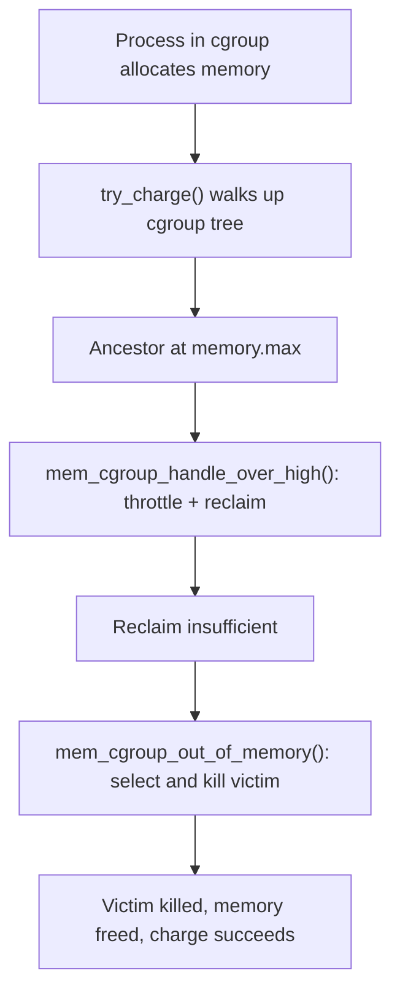

# Cgroup OOM Controller

> How the kernel kills processes when a cgroup runs out of memory

## Cgroup OOM vs Global OOM

The kernel has two OOM paths. The global OOM killer fires when the entire system cannot satisfy an allocation after exhausting reclaim. The cgroup OOM controller fires when a single cgroup exceeds its `memory.max` after exhausting reclaim within that cgroup. The host system can have gigabytes free — the cgroup OOM does not care.

| | Global OOM | Cgroup OOM |
|---|---|---|
| Trigger | System-wide allocation failure | cgroup `memory.max` exceeded after reclaim |
| Candidate pool | All processes on the system | Processes in the cgroup (and descendants) |
| `totalpages` for scoring | System RAM + swap | cgroup's `memory.max` |
| Log prefix | `Out of memory:` | `Memory cgroup out of memory:` |
| `constraint` field | `CONSTRAINT_NONE` | `CONSTRAINT_MEMCG` |
| Host impact | Potentially severe | Isolated to the cgroup |

Both paths converge on the same victim selection function, `oom_badness()` in [`mm/oom_kill.c`](https://git.kernel.org/pub/scm/linux/kernel/git/torvalds/linux.git/tree/mm/oom_kill.c). The difference is which `totalpages` value is passed in — and `totalpages` is the denominator in the `oom_score_adj` calculation, so cgroup size matters.

## What Triggers a Cgroup OOM

The sequence from normal operation to OOM kill has four steps:



1. **Charge**: Every page allocation is charged to the cgroup via `try_charge()` in [`mm/memcontrol.c`](https://git.kernel.org/pub/scm/linux/kernel/git/torvalds/linux.git/tree/mm/memcontrol.c). This walks up the cgroup tree checking each ancestor's limit.

2. **Reclaim**: If a limit is reached, the kernel attempts reclaim within the cgroup. It tries to free reclaimable pages (page cache, reclaimable slab, anonymous pages with swap) belonging to processes in the cgroup.

3. **OOM decision**: If reclaim cannot free enough memory after repeated attempts, `mem_cgroup_out_of_memory()` is called. It calls the same `out_of_memory()` function used by the global path, but with a memcg constraint.

4. **Kill**: A victim is selected and sent `SIGKILL`. Memory is freed, and the original allocation retries.

### The `memory.high` path is separate

`memory.high` does not trigger OOM. When a cgroup exceeds `memory.high`, the kernel throttles allocating processes and reclaims aggressively, but no process is killed. OOM is only triggered when `memory.max` is reached and reclaim fails. See [Tuning memory for containers](tuning-containers.md) for the distinction.

## Victim Selection in a Cgroup Context

The function `oom_badness()` in [`mm/oom_kill.c`](https://git.kernel.org/pub/scm/linux/kernel/git/torvalds/linux.git/tree/mm/oom_kill.c) computes a score for each process:

```
score = (rss_anon + rss_file + rss_shmem + swapents + pgtables_pages)
      + (oom_score_adj × totalpages / 1000)
```

For cgroup OOM, `totalpages` is the cgroup's `memory.max` (or the current usage, whichever is appropriate to compute the score), not the total system RAM. This changes the impact of `oom_score_adj`:

**Example**: A cgroup with `memory.max = 512M` and a process with `oom_score_adj = 500`.

- System RAM = 16G → `totalpages` ≈ 4M pages → adjustment = 4M × 500/1000 = 2M pages (~8G penalty)
- cgroup `memory.max` = 512M → `totalpages` ≈ 128K pages → adjustment = 128K × 500/1000 = 64K pages (~256M penalty)

In the cgroup case, `oom_score_adj` has much less absolute impact because `totalpages` is small. Processes that look highly penalized at the system level may be only moderately penalized within a small cgroup. The relative ordering can change.

### Candidate enumeration

For a cgroup OOM, only processes within the affected cgroup (and its descendants) are candidates. `select_bad_process()` uses `mem_cgroup_scan_tasks()` to iterate only tasks within the target memcg hierarchy, calling `oom_evaluate_task()` for each candidate.

Processes with `oom_score_adj = -1000` are always skipped (immune). Kernel threads are always skipped. The process that triggered the OOM is not automatically the victim — it competes on score like any other process.

## memory.oom.group: Killing the Whole Cgroup

By default, the OOM killer selects and kills one process. For containerized applications, killing one worker process often leaves the container in a broken state: the orchestrator sees the container still running, but a critical subprocess is dead.

`memory.oom.group` solves this by killing all processes in the cgroup together when an OOM occurs.

**Commit**: [3d8b38eb81ca](https://git.kernel.org/linus/3d8b38eb81ca) ("mm, oom: introduce memory.oom.group") | [LKML](https://lore.kernel.org/all/20180730180100.25079-4-guro@fb.com/)

**Author**: Roman Gushchin (kernel v4.19, 2018)

```bash
# Enable group kill for a cgroup
echo 1 > /sys/fs/cgroup/mycontainer/memory.oom.group
```

### How group kill works

When the OOM killer selects a victim and `memory.oom.group = 1` is set on that victim's cgroup (or any ancestor with `oom_group` set), `mem_cgroup_get_oom_group()` in [`mm/memcontrol.c`](https://git.kernel.org/pub/scm/linux/kernel/git/torvalds/linux.git/tree/mm/memcontrol.c) returns the highest ancestor cgroup with `oom_group = 1`. Then `oom_kill_memcg_member()` is called for every process in that cgroup's subtree.

Processes with `oom_score_adj = -1000` are still skipped even during group kill.

The kill log includes an extra line:

```
[  891.112295] Tasks in /myapp.slice/myapp.service are going to be killed due to memory.oom.group set
[  891.112296] Memory cgroup out of memory: Killed process 12001 (worker-1) ...
[  891.112297] Memory cgroup out of memory: Killed process 12002 (worker-2) ...
[  891.112298] Memory cgroup out of memory: Killed process 12003 (worker-3) ...
```

### When to use memory.oom.group

| Use case | Recommendation |
|----------|----------------|
| Single-process container | Default (off) is fine |
| Multi-process container (web server + workers) | Enable — partial kill leaves broken state |
| Microservice with sidecar | Enable — killing the app but not the proxy leaves a zombie |
| Interactive shell session | Do not enable — kills the whole session for one bad command |

## oom_score_adj Interaction with Cgroup OOM

`oom_score_adj` is set per-process (via `/proc/<pid>/oom_score_adj`) and ranges from -1000 to +1000. It modifies the computed OOM score:

```bash
# Make this process less likely to be killed
echo -200 > /proc/$(pgrep myapp)/oom_score_adj

# Make this process immune (never killed by OOM)
echo -1000 > /proc/$(pgrep critical-daemon)/oom_score_adj

# Make this process the preferred victim
echo 1000 > /proc/$(pgrep disposable-worker)/oom_score_adj
```

!!! warning "Immune processes can cause OOM loops"
    If all processes in a cgroup have `oom_score_adj = -1000`, the OOM killer cannot select a victim. The allocation will fail with `-ENOMEM` rather than killing anything. This can cause `ENOMEM` errors or allocation hangs in the triggering process.

### Systemd and oom_score_adj

systemd sets `OOMScoreAdjust` in unit files, which maps directly to `/proc/<pid>/oom_score_adj`. System-critical services (journald, udevd) are set to -1000 by default. For container workloads, set `OOMScoreAdjust` per service to control victim preference within a cgroup.

```ini
# /etc/systemd/system/myapp.service
[Service]
MemoryMax=1G
MemoryHigh=800M
OOMScoreAdjust=200      # Prefer this service as a victim over others
MemoryOOMPolicy=kill    # Default: kill the process (v253+)
```

## The Kill Sequence: Functions and Log Output

The complete call path from charge failure to process kill:

```
try_charge()                         [mm/memcontrol.c]
  → mem_cgroup_oom()
    → mem_cgroup_out_of_memory()     [mm/memcontrol.c]
      → out_of_memory()              [mm/oom_kill.c]
        → select_bad_process()       [mm/oom_kill.c]
          → oom_evaluate_task()
            → oom_badness()
        → oom_kill_process()         [mm/oom_kill.c]
          → mem_cgroup_get_oom_group() [mm/memcontrol.c]  (if oom.group)
          → __oom_kill_process()
            → do_send_sig_info()     [SIGKILL]
```

### What gets logged

The log output is generated by `dump_header()` and `oom_kill_process()` in [`mm/oom_kill.c`](https://git.kernel.org/pub/scm/linux/kernel/git/torvalds/linux.git/tree/mm/oom_kill.c), with cgroup-specific memory stats from `mem_cgroup_print_oom_meminfo()` in [`mm/memcontrol.c`](https://git.kernel.org/pub/scm/linux/kernel/git/torvalds/linux.git/tree/mm/memcontrol.c).

A complete cgroup OOM log has these sections:

```
# 1. Trigger line
[  891.112200] worker-1 invoked oom-killer: gfp_mask=0x140cca(...), order=0, oom_score_adj=0

# 2. Stack trace (who called the allocator)
[  891.112210]  <TASK>
[  891.112215]  oom_kill_process+0x101/0x170
[  891.112220]  out_of_memory+0x116/0x570
[  891.112225]  mem_cgroup_out_of_memory+0x7b/0xa0
[  891.112230]  try_charge_memcg+0x5c4/0x6b0
[  891.112235]  mem_cgroup_charge+0x92/0x1e0

# 3. Cgroup memory stats (not system-wide stats)
[  891.112245] Memory cgroup stats for /myapp.slice/myapp.service:
[  891.112248] anon 536346624
[  891.112248] file 262144
[  891.112248] kernel 2158592
[  891.112248] ...

# 4. Task table (only processes in the cgroup)
[  891.112260] Tasks state (memory values in pages):
[  891.112262] [  pid  ]   uid  tgid total_vm  rss  ...  oom_score_adj name
[  891.112268] [  12001]  1000 12001   524288  130048 ...           0  worker-1
[  891.112275] [  12002]  1000 12002   524288  131072 ...           0  worker-2

# 5. Kill line
[  891.112285] oom-kill:constraint=CONSTRAINT_MEMCG,nodemask=(null),memcg=/myapp.slice/myapp.service,task_memcg=/myapp.slice/myapp.service,task=worker-2,pid=12002,uid=1000
[  891.112290] Memory cgroup out of memory: Killed process 12002 (worker-2) total-vm:2097152kB, anon-rss:524288kB, file-rss:0kB, shmem-rss:0kB, UID:1000 pgtables:1024kB oom_score_adj:0
```

Key differences from a global OOM log:
- Section 3 shows `Memory cgroup stats for <path>:` with named byte counters, not the zone-based `Mem-Info:` dump
- Section 4 lists only processes in the cgroup
- Section 5 shows `constraint=CONSTRAINT_MEMCG` and `Memory cgroup out of memory:`

See [Reading an OOM log](reading-oom-log.md) for a full annotated walkthrough of each field.

## Configuring Cgroup OOM Behavior

### Prevent OOM by setting memory.high

The most effective way to avoid cgroup OOM is to ensure the application encounters throttling (`memory.high`) before hitting the hard limit (`memory.max`). The gap between them gives the kernel room to reclaim and gives monitoring systems time to respond.

```bash
# 200MB gap between high and max
echo 800M > /sys/fs/cgroup/myapp/memory.high
echo 1G   > /sys/fs/cgroup/myapp/memory.max
```

### Allow swap as a buffer

If swap is available, allowing the cgroup to use it gives a buffer between the `memory.high` throttle zone and the `memory.max` OOM zone. See [Swap accounting in cgroups](memcg-swap.md) for details.

```bash
echo 512M > /sys/fs/cgroup/myapp/memory.swap.max
```

### Monitor OOM events proactively

```bash
# Watch for OOM events
watch -n 5 cat /sys/fs/cgroup/myapp/memory.events

# Set up inotify on memory.events for event-driven monitoring
# (systemd-oomd uses inotify on memory.pressure instead)
```

### memory.events fields

```bash
cat /sys/fs/cgroup/myapp/memory.events
# low 0          # times usage dropped below memory.low (reclaim pressure)
# high 152       # times memory.high was exceeded
# max 3          # times memory.max was reached
# oom 1          # OOM events triggered
# oom_kill 1     # processes killed by cgroup OOM
# oom_group_kill 0  # group kill events (memory.oom.group)
```

`oom` counts OOM events. `oom_kill` counts processes killed. If `memory.oom.group = 1`, one OOM event can produce multiple `oom_kill` increments.

## cgroup v1 vs v2 OOM Behavior

| Behavior | cgroup v1 | cgroup v2 |
|----------|-----------|-----------|
| OOM trigger file | `memory.limit_in_bytes` | `memory.max` |
| memsw (memory+swap) limit | `memory.memsw.limit_in_bytes` | Separate `memory.swap.max` |
| Group kill | `memory.oom_control` (OOM disabling only) | `memory.oom.group` |
| OOM disable | `echo 1 > memory.oom_control` | No equivalent — discouraged |
| OOM notification | eventfd on `memory.oom_control` | `memory.events` (poll/inotify) |
| OOM log prefix | `Memory cgroup out of memory:` | Same |
| Kernel memory | Separate `memory.kmem.limit_in_bytes` | Unified under `memory.max` |

!!! warning "memory.oom_control disable in v1 is dangerous"
    Setting `memory.oom_control = 1` in cgroup v1 disables the OOM killer for that cgroup. When the cgroup exceeds its limit, allocations block indefinitely instead of triggering OOM. Processes hang rather than die. This was removed from cgroup v2 by design. If you need allocation failure without killing, use `memory.oom.group` plus a userspace OOM daemon like [systemd-oomd](https://www.freedesktop.org/software/systemd/man/systemd-oomd.service.html) or [Meta's oomd](https://facebookincubator.github.io/oomd/).

## systemd-oomd: Userspace OOM Before the Kernel Fires

[systemd-oomd](https://www.freedesktop.org/software/systemd/man/systemd-oomd.service.html) monitors PSI (Pressure Stall Information) per cgroup and kills cgroups that are under sustained memory pressure, before the kernel OOM killer fires. It acts at the cgroup level (killing the whole cgroup), not the process level.

```bash
# Check systemd-oomd status
systemctl status systemd-oomd

# View oomd's kill history
journalctl -u systemd-oomd

# Configure thresholds in /etc/systemd/oomd.conf
[OOM]
SwapUsedLimit=90%           # Kill if swap > 90% full
DefaultMemoryPressureLimit=60%  # Kill if PSI > 60% for DefaultMemoryPressureDurationSec
DefaultMemoryPressureDurationSec=30
```

PSI-based killing is generally preferable to kernel OOM killing because it acts earlier (during high pressure, not after allocation failure) and kills at the cgroup boundary.

## Try It Yourself

### Trigger a cgroup OOM and observe the log

```bash
# Create a cgroup with a small limit
sudo mkdir -p /sys/fs/cgroup/oom-test
echo "+memory" | sudo tee /sys/fs/cgroup/cgroup.subtree_control
echo 64M | sudo tee /sys/fs/cgroup/oom-test/memory.max
echo 1   | sudo tee /sys/fs/cgroup/oom-test/memory.oom.group

# Move current shell into it
echo $$ | sudo tee /sys/fs/cgroup/oom-test/cgroup.procs

# Allocate more than the limit
python3 -c "x = bytearray(100 * 1024 * 1024)"
# This process will be OOM-killed

# Check the log
dmesg | grep -A 30 "Memory cgroup out of memory"
```

### Compare oom_score_adj impact

```bash
# With two processes in a cgroup, observe which one is selected
sudo mkdir -p /sys/fs/cgroup/score-test
echo 128M | sudo tee /sys/fs/cgroup/score-test/memory.max

# Start two background processes
python3 -c "import time; x = bytearray(30 * 1024 * 1024); time.sleep(300)" &
PID_A=$!
python3 -c "import time; x = bytearray(30 * 1024 * 1024); time.sleep(300)" &
PID_B=$!

# Move both into the cgroup
echo $PID_A | sudo tee /sys/fs/cgroup/score-test/cgroup.procs
echo $PID_B | sudo tee /sys/fs/cgroup/score-test/cgroup.procs

# Penalize one process
echo 500 > /proc/$PID_B/oom_score_adj

# Now trigger OOM — PID_B should be killed first
python3 -c "x = bytearray(80 * 1024 * 1024)" &
echo $! | sudo tee /sys/fs/cgroup/score-test/cgroup.procs

# Check which PID was killed
dmesg | tail -5
```

## Key Source Files

| File | Relevant functions |
|------|--------------------|
| [`mm/memcontrol.c`](https://git.kernel.org/pub/scm/linux/kernel/git/torvalds/linux.git/tree/mm/memcontrol.c) | `mem_cgroup_out_of_memory()` — cgroup OOM entry point; `mem_cgroup_get_oom_group()` — find group to kill; `mem_cgroup_print_oom_meminfo()` — log output; `try_charge()` — charge + limit enforcement |
| [`mm/oom_kill.c`](https://git.kernel.org/pub/scm/linux/kernel/git/torvalds/linux.git/tree/mm/oom_kill.c) | `out_of_memory()` — shared OOM logic; `oom_badness()` — scoring; `select_bad_process()` — candidate enumeration; `oom_kill_process()` — kill + log; `__oom_kill_process()` — actual SIGKILL |
| [`include/linux/memcontrol.h`](https://git.kernel.org/pub/scm/linux/kernel/git/torvalds/linux.git/tree/include/linux/memcontrol.h) | `struct mem_cgroup`, oom_group field |

## History

### Cgroup OOM Notification (cgroup v1, v3.8, 2013)

cgroup v1 introduced `memory.oom_control` with eventfd-based OOM notifications. The interface allowed userspace to be notified when OOM occurred, and optionally to disable the OOM killer entirely (blocking allocations instead). This was useful but fragile — disabled OOM kills led to hung processes.

### memory.oom.group (v4.19, 2018)

**Commit**: [3d8b38eb81ca](https://git.kernel.org/linus/3d8b38eb81ca) ("mm, oom: introduce memory.oom.group") | [LKML](https://lore.kernel.org/all/20180730180100.25079-4-guro@fb.com/)

**Author**: Roman Gushchin

Enabled killing all processes in a cgroup together on OOM, replacing the need for external watchdogs to restart partially-killed containers.

### cgroup v2 OOM (v4.5+)

cgroup v2 removed `memory.oom_control` disable functionality by design. The v2 philosophy is that processes should be killed rather than hung. The `memory.events` file replaced eventfd notifications with a simple counter file suitable for polling.

## References

### Key Code

| File | Description |
|------|-------------|
| [`mm/memcontrol.c`](https://git.kernel.org/pub/scm/linux/kernel/git/torvalds/linux.git/tree/mm/memcontrol.c) | Cgroup memory controller |
| [`mm/oom_kill.c`](https://git.kernel.org/pub/scm/linux/kernel/git/torvalds/linux.git/tree/mm/oom_kill.c) | OOM killer: scoring, selection, killing |

### Kernel Documentation

- [`Documentation/admin-guide/cgroup-v2.rst`](https://docs.kernel.org/admin-guide/cgroup-v2.html) — memory interface files, oom.group
- [`Documentation/filesystems/proc.rst`](https://docs.kernel.org/filesystems/proc.html) — `/proc/<pid>/oom_score_adj` and `oom_score` semantics

### LWN Articles

- [Toward better OOM killing](https://lwn.net/Articles/391222/) — background on the OOM scoring model
- [Group-kill for memory-cgroup OOM](https://lwn.net/Articles/761118/) — memory.oom.group design

### Related

- [Memory Cgroups](memcg.md) — memcg fundamentals
- [Reading an OOM log](reading-oom-log.md) — annotated OOM log walkthrough
- [Running out of memory](oom.md) — the global OOM path
- [Hierarchical memory limits](memcg-hierarchy.md) — how limits propagate in the cgroup tree
- [Swap accounting in cgroups](memcg-swap.md) — using swap to avoid OOM

## Further reading

- [mm/memcontrol.c](https://git.kernel.org/pub/scm/linux/kernel/git/torvalds/linux.git/tree/mm/memcontrol.c) — `mem_cgroup_out_of_memory()` (cgroup OOM entry point), `mem_cgroup_get_oom_group()` (group-kill ancestor walk), `mem_cgroup_print_oom_meminfo()` (per-cgroup log output)
- [mm/oom_kill.c](https://git.kernel.org/pub/scm/linux/kernel/git/torvalds/linux.git/tree/mm/oom_kill.c) — `oom_badness()` scoring, `select_bad_process()` with `mem_cgroup_scan_tasks()`, `oom_kill_process()` log generation — shared between global and cgroup OOM paths
- `Documentation/admin-guide/cgroup-v2.rst` — `memory.oom.group` and `memory.events` semantics, including field definitions for `oom`, `oom_kill`, and `oom_group_kill`
- `Documentation/admin-guide/oom-kill.rst` — `oom_score_adj` range, semantics, and interaction with process scoring
- [LWN: Group-kill for memory-cgroup OOM](https://lwn.net/Articles/761118/) — design discussion and motivation for `memory.oom.group`, including the container-restart problem it solves
- [LWN: Toward better OOM killing](https://lwn.net/Articles/391222/) — background on the OOM scoring model and why `oom_score_adj` was introduced
- [memcg](memcg.md) — memcg fundamentals, including `memory.max` vs `memory.high` and the OOM group kill flag
- [memcg-hierarchy](memcg-hierarchy.md) — how ancestor limits can trigger cgroup OOM even when a child's own `memory.max` has not been reached
- [memcg-swap](memcg-swap.md) — how allowing swap creates a buffer between the `memory.high` throttle zone and `memory.max` OOM
