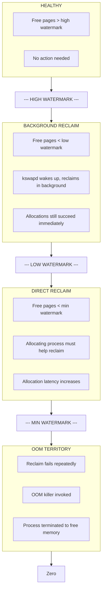
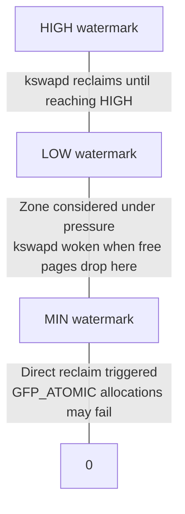
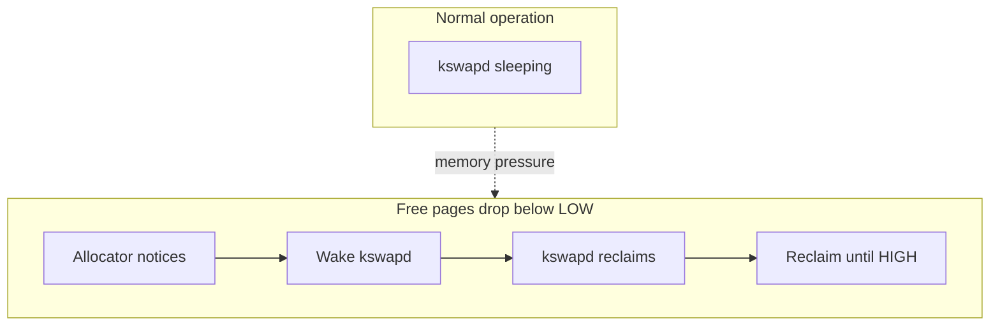
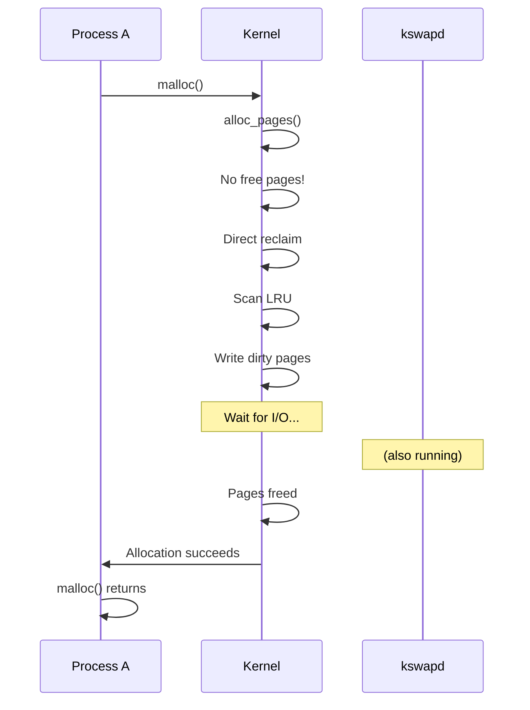
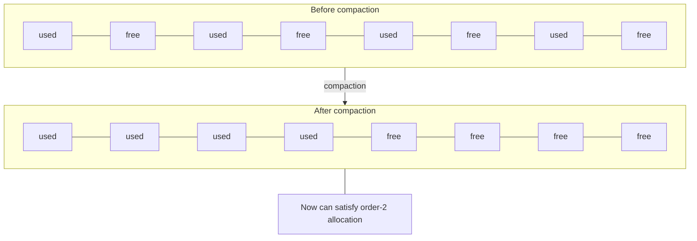
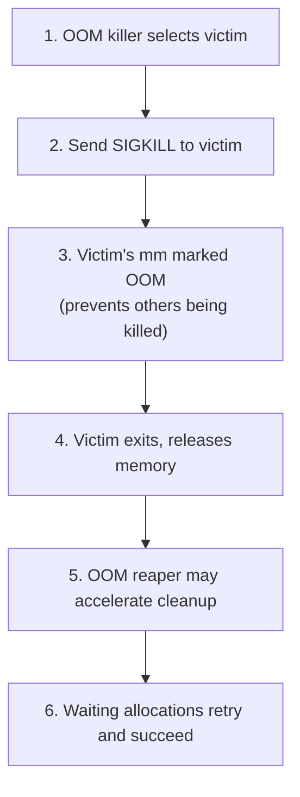

# Running out of memory

> The progression from healthy system to OOM kill

## The path to OOM

When memory runs low, the kernel doesn't immediately panic. It goes through escalating stages of intervention, trying to free memory before resorting to killing processes. Understanding this progression helps you diagnose why your process was killed and how to prevent it.



## Stage 1: Watermarks and pressure detection

Each memory zone has three watermarks that control reclaim behavior:

```c
// From include/linux/mmzone.h
enum zone_watermarks {
    WMARK_MIN,    // Below this: direct reclaim, allocation may fail
    WMARK_LOW,    // Below this: wake kswapd
    WMARK_HIGH,   // Target for kswapd to reach
    WMARK_PROMO,  // For tiered memory promotion
    NR_WMARK
};
```

### How watermarks are calculated

Watermarks derive from `vm.min_free_kbytes` and `vm.watermark_scale_factor`:

```bash
# View current settings
cat /proc/sys/vm/min_free_kbytes
cat /proc/sys/vm/watermark_scale_factor

# min_free_kbytes sets the MIN watermark base
# watermark_scale_factor (default 10 = 0.1%) adjusts LOW and HIGH
# The exact calculation is in mm/page_alloc.c __setup_per_zone_wmarks()
```



### Viewing watermarks

```bash
# Detailed zone information including watermarks
cat /proc/zoneinfo | grep -A 20 "zone   Normal"

# Key fields:
#   pages free     - current free pages
#   min            - min watermark
#   low            - low watermark
#   high           - high watermark
```

## Stage 2: Background reclaim (kswapd)

When free pages drop below the low watermark, `kswapd` wakes up to reclaim pages in the background.

### kswapd mechanics



kswapd is a per-node kernel thread:

```bash
# View kswapd threads
ps aux | grep kswapd
# kswapd0 - for node 0
# kswapd1 - for node 1 (on NUMA systems)
```

### What kswapd reclaims

kswapd scans the inactive LRU lists looking for reclaimable pages:

| Page Type | Reclaim Action |
|-----------|----------------|
| Clean file pages | Drop immediately (can re-read from disk) |
| Dirty file pages | Write back, then drop |
| Anonymous pages | Swap out (if swap available) |
| Slab caches | Shrink via shrinkers |

```c
// Simplified from mm/vmscan.c
static void shrink_node(pg_data_t *pgdat, struct scan_control *sc)
{
    // Scan and reclaim from LRU lists
    shrink_node_memcgs(pgdat, sc);

    // Shrink slab caches
    shrink_slab(sc->gfp_mask, pgdat->node_id, ...);
}
```

### Swappiness

The `vm.swappiness` parameter controls the balance between reclaiming file pages versus swapping anonymous pages:

```bash
# View current swappiness
cat /proc/sys/vm/swappiness
# Default: 60

# Lower value = prefer dropping file cache
# Higher value = more willing to swap
sysctl vm.swappiness=10  # Minimize swapping
```

| Swappiness | Behavior |
|------------|----------|
| 0 | Avoid swap unless absolutely necessary |
| 1-59 | Prefer file page reclaim |
| 60 | Default balance |
| 61-100 | Prefer swapping anonymous pages |
| 101-200 | MGLRU only: finer-grained swap aggressiveness |

**Note**: Values above 100 only have effect with MGLRU enabled (kernel 6.1+). On older kernels or with MGLRU disabled, values are effectively clamped to 0-100.

## Stage 3: Direct reclaim

When kswapd can't keep up and free pages fall below the min watermark, allocating processes must help reclaim pages themselves.

### The allocation slowpath

```c
// mm/page_alloc.c __alloc_pages() (simplified)
struct page *__alloc_pages(gfp_t gfp, unsigned int order, ...)
{
    struct page *page;

    // Fast path: try to allocate immediately
    page = get_page_from_freelist(gfp, order, ...);
    if (page)
        return page;

    // Slow path: need to work for it
    return __alloc_pages_slowpath(gfp, order, ...);
}

static struct page *__alloc_pages_slowpath(...)
{
    // 1. Wake kswapd
    wake_all_kswapds(...);

    // 2. Try again with kswapd running
    page = get_page_from_freelist(...);
    if (page)
        return page;

    // 3. Direct reclaim - we do the work ourselves
    page = __alloc_pages_direct_reclaim(...);
    if (page)
        return page;

    // 4. Try compaction for high-order allocations
    page = __alloc_pages_direct_compact(...);
    if (page)
        return page;

    // 5. Last resort: OOM killer
    page = __alloc_pages_may_oom(...);
    return page;
}
```

### Direct reclaim impact

Direct reclaim blocks the allocating process:



This can cause significant latency spikes. Applications that allocate during memory pressure may see multi-millisecond delays.

### Monitoring direct reclaim

```bash
# Count direct reclaim events
cat /proc/vmstat | grep allocstall
# allocstall_dma
# allocstall_dma32
# allocstall_normal
# allocstall_movable

# Real-time monitoring
watch -n 1 'grep -E "allocstall|pgsteal_direct|pgscan_direct" /proc/vmstat'
```

## Stage 4: Reclaim failures and retries

Sometimes reclaim doesn't free enough memory. The kernel retries with increasing desperation.

### Retry logic

```c
// The allocation retries with __GFP_RETRY_MAYFAIL or similar flags

// Retry conditions (simplified):
// 1. Did we make progress? (freed some pages)
// 2. Have we retried too many times? (MAX_RECLAIM_RETRIES)
// 3. Should we give up? (depends on GFP flags)

#define MAX_RECLAIM_RETRIES 16
```

### What causes reclaim to fail?

| Cause | Description |
|-------|-------------|
| All pages unreclaimable | Locked, pinned, or in active use |
| No swap space | Anonymous pages can't be swapped out |
| I/O bottleneck | Writeback too slow |
| Thrashing | Pages reclaimed and immediately needed again |
| Memory fragmentation | Free pages exist but in wrong zones/orders |

### The compaction fallback

For high-order allocations (multiple contiguous pages), compaction tries to defragment memory:



```bash
# Trigger manual compaction
echo 1 > /proc/sys/vm/compact_memory

# Monitor compaction
cat /proc/vmstat | grep compact
```

## Stage 5: The OOM killer

When all reclaim efforts fail, the OOM (Out Of Memory) killer terminates a process to free memory.

### OOM killer invocation

```c
// mm/page_alloc.c (simplified)
static struct page *__alloc_pages_may_oom(...)
{
    // Check if we should invoke OOM killer
    if (should_oom_retry(...))
        return NULL;  // Keep retrying

    // Invoke OOM killer
    if (oom_killer_disabled)
        return NULL;

    out_of_memory(&oc);

    // OOM killer runs, hopefully frees memory
    // Retry allocation
    return get_page_from_freelist(...);
}
```

### How OOM selects a victim

The OOM killer scores processes by their "badness" - how much memory they use and how easy they are to kill:

```c
// mm/oom_kill.c (simplified)
long oom_badness(struct task_struct *p, ...)
{
    long points;

    // Base score: RSS + swap usage
    points = get_mm_rss(p->mm) + get_mm_counter(p->mm, MM_SWAPENTS);

    // Adjust for oom_score_adj (-1000 to +1000)
    adj = p->signal->oom_score_adj;
    if (adj == OOM_SCORE_ADJ_MIN)  // -1000
        return LONG_MIN;  // Never kill (unless no choice)

    // Apply adjustment as percentage
    points += (points * adj) / 1000;

    return points;
}
```

### OOM score components

| Factor | Impact |
|--------|--------|
| RSS (Resident Size) | Primary factor - bigger = worse |
| Swap usage | Counts against the process |
| `oom_score_adj` | Manual adjustment (-1000 to +1000) |
| Root processes | Slight bonus (3% reduction) |
| Children's memory | Considered if killing parent frees more |

### Controlling OOM behavior

```bash
# View OOM score (higher = more likely to be killed)
cat /proc/$PID/oom_score

# View adjustment
cat /proc/$PID/oom_score_adj

# Protect important processes
echo -1000 > /proc/$PID/oom_score_adj  # Never kill (almost)
echo -500 > /proc/$PID/oom_score_adj   # Less likely to kill

# Make a process OOM target
echo 1000 > /proc/$PID/oom_score_adj   # Kill this first
```

### The OOM kill message

When OOM kills, check `dmesg`:

```bash
dmesg | grep -i "out of memory"

# Typical output:
# [timestamp] Out of memory: Killed process 12345 (myapp) total-vm:1234567kB,
#             anon-rss:123456kB, file-rss:1234kB, shmem-rss:0kB,
#             UID:1000 pgtables:1234kB oom_score_adj:0
```

The log shows:
- Which process was killed
- Memory usage breakdown (vm, rss, file, shmem)
- User ID
- Page table memory
- OOM adjustment value

## Stage 6: Post-OOM recovery

After OOM kills a process:



### OOM reaper

The OOM reaper (v4.6+) accelerates memory freeing from killed processes:

```c
// Instead of waiting for the victim to exit normally,
// OOM reaper can reclaim anonymous memory immediately
// by unmapping pages while the process is still dying
```

This helps when the victim is stuck (e.g., in uninterruptible I/O) and can't exit promptly.

## Memory cgroups and OOM

With cgroups, OOM can be scoped to a container:

```bash
# Set memory limit for a cgroup
echo 500M > /sys/fs/cgroup/memory/mygroup/memory.max

# When the cgroup exceeds its limit:
# - Cgroup-level OOM (kills within the cgroup)
# - Doesn't affect processes outside the cgroup
```

Cgroup OOM events:

```bash
# Monitor cgroup OOM events
cat /sys/fs/cgroup/mygroup/memory.events
# oom           - OOM killer invocations
# oom_kill      - Processes killed by OOM
# oom_group_kill - Entire cgroup killed (cgroup v2)
```

See [memory cgroups](memcg.md) for details.

## Preventing OOM

### Tune watermarks

```bash
# Increase min_free_kbytes for earlier kswapd intervention
sysctl vm.min_free_kbytes=131072  # 128MB

# Tradeoff: more memory reserved, less available for applications
```

### Add swap

Without swap, anonymous pages can't be reclaimed. Even a small swap provides emergency breathing room:

```bash
# Check current swap
free -h

# Create swap file
dd if=/dev/zero of=/swapfile bs=1G count=4
chmod 600 /swapfile
mkswap /swapfile
swapon /swapfile
```

### Protect critical processes

```bash
# Protect database from OOM
echo -1000 > /proc/$(pidof postgres)/oom_score_adj

# Or in systemd unit file
# [Service]
# OOMScoreAdjust=-1000
```

### Use memory cgroups

Isolate workloads with memory limits:

```bash
# Limit a container to 4GB
echo 4G > /sys/fs/cgroup/mycontainer/memory.max

# The container hits OOM before affecting the system
```

## Try it yourself

### Watch OOM progression

```bash
# Terminal 1: Monitor memory state
watch -n 1 'cat /proc/meminfo | grep -E "MemFree|MemAvailable|SwapFree|Active|Inactive"'

# Terminal 2: Consume memory until OOM
stress --vm 1 --vm-bytes 99% --vm-keep

# Terminal 3: Watch for OOM
dmesg -w | grep -i oom
```

### Simulate memory pressure stages

```bash
# Watch watermarks during pressure
watch -n 1 'cat /proc/zoneinfo | grep -A 15 "zone   Normal" | head -20'

# See kswapd wake up
vmstat 1  # watch 'si', 'so', and 'wa' columns
```

### Monitor reclaim activity

```bash
# Comprehensive reclaim stats
cat /proc/vmstat | grep -E "pgscan|pgsteal|allocstall|oom"

# Trace reclaim events
echo 1 > /sys/kernel/debug/tracing/events/vmscan/mm_vmscan_direct_reclaim_begin/enable
cat /sys/kernel/debug/tracing/trace_pipe
```

### Test OOM score adjustment

```bash
# Create test process
sleep 3600 &
PID=$!

# View its OOM score
cat /proc/$PID/oom_score

# Adjust and see score change
echo 500 > /proc/$PID/oom_score_adj
cat /proc/$PID/oom_score
```

## Key source files

| File | What It Does |
|------|--------------|
| [`mm/vmscan.c`](https://git.kernel.org/pub/scm/linux/kernel/git/torvalds/linux.git/tree/mm/vmscan.c) | Page reclaim, kswapd, direct reclaim |
| [`mm/oom_kill.c`](https://git.kernel.org/pub/scm/linux/kernel/git/torvalds/linux.git/tree/mm/oom_kill.c) | OOM killer, victim selection |
| [`mm/page_alloc.c`](https://git.kernel.org/pub/scm/linux/kernel/git/torvalds/linux.git/tree/mm/page_alloc.c) | Watermarks, allocation slowpath |
| [`include/linux/mmzone.h`](https://git.kernel.org/pub/scm/linux/kernel/git/torvalds/linux.git/tree/include/linux/mmzone.h) | Zone and watermark definitions |

## History

### OOM killer evolution

The OOM killer has evolved significantly:

**Early Linux**: Simple heuristics, often killed the wrong process.

**v2.6.36 (2010)**: OOM killer rewrite with better victim selection.

**Commit**: [a63d83f427fb](https://git.kernel.org/linus/a63d83f427fb) ("oom: badness heuristic rewrite") | [LKML](https://lore.kernel.org/lkml/alpine.DEB.2.00.1007271806310.22908@chino.kir.corp.google.com/)

**Author**: David Rientjes (Google)

**v4.6 (2016)**: OOM reaper for faster memory reclaim from killed processes.

**Commit**: [aac45363caeb](https://git.kernel.org/linus/aac45363caeb) ("mm, oom: introduce oom reaper") | [LKML](https://lore.kernel.org/linux-mm/1455813292-18614-2-git-send-email-mhocko@kernel.org/)

**Author**: Michal Hocko

**v4.19 (2018)**: Per-cgroup OOM killer for better container isolation.

### PSI (Pressure Stall Information)

**v4.20 (2018)**: Added PSI for proactive memory pressure monitoring.

**Commit**: [eb414681d5a0](https://git.kernel.org/linus/eb414681d5a0) ("psi: pressure stall information for CPU, memory, and IO") | [LKML](https://lore.kernel.org/linux-mm/20180529093107.13939-1-hannes@cmpxchg.org/)

**Author**: Johannes Weiner (Facebook)

PSI lets you detect memory pressure before OOM:

```bash
# View current pressure
cat /proc/pressure/memory
# some avg10=0.00 avg60=0.00 avg300=0.00 total=0
# full avg10=0.00 avg60=0.00 avg300=0.00 total=0

# "some" = at least one task stalled
# "full" = all tasks stalled
```

## Further reading

### Related docs

- [Page reclaim](reclaim.md) - Reclaim mechanisms in depth
- [Memory overcommit](overcommit.md) - Why OOM happens despite "free" memory
- [Memory cgroups](memcg.md) - Container memory limits
- [Life of a page](life-of-page.md) - Page lifecycle and reclaim

### LWN articles

- [The OOM killer](https://lwn.net/Articles/317814/) (2008) - Classic overview
- [The OOM killer's second chance](https://lwn.net/Articles/627419/) (2015) - OOM reaper motivation
- [PSI - Pressure Stall Information](https://lwn.net/Articles/759781/) (2018) - Proactive pressure monitoring
