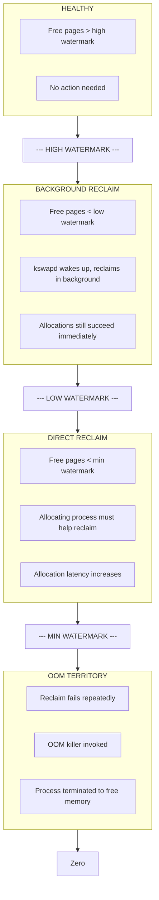
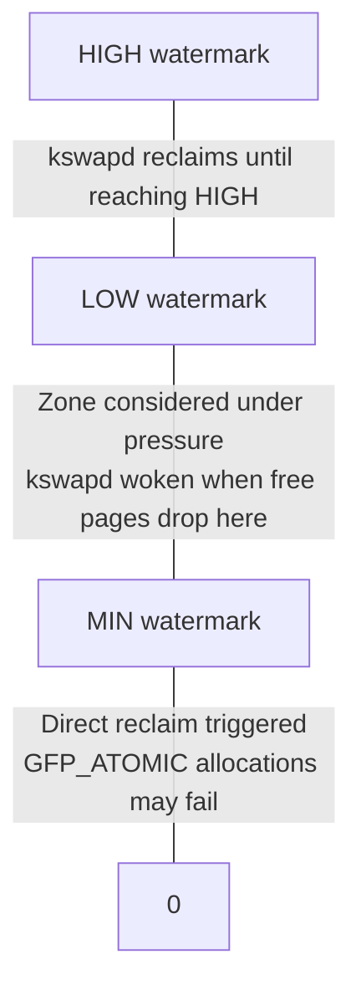
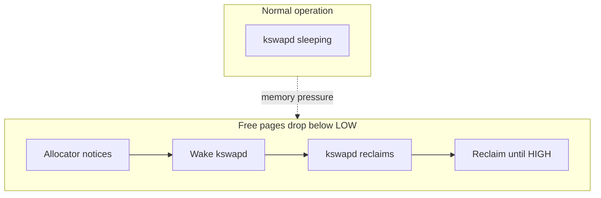
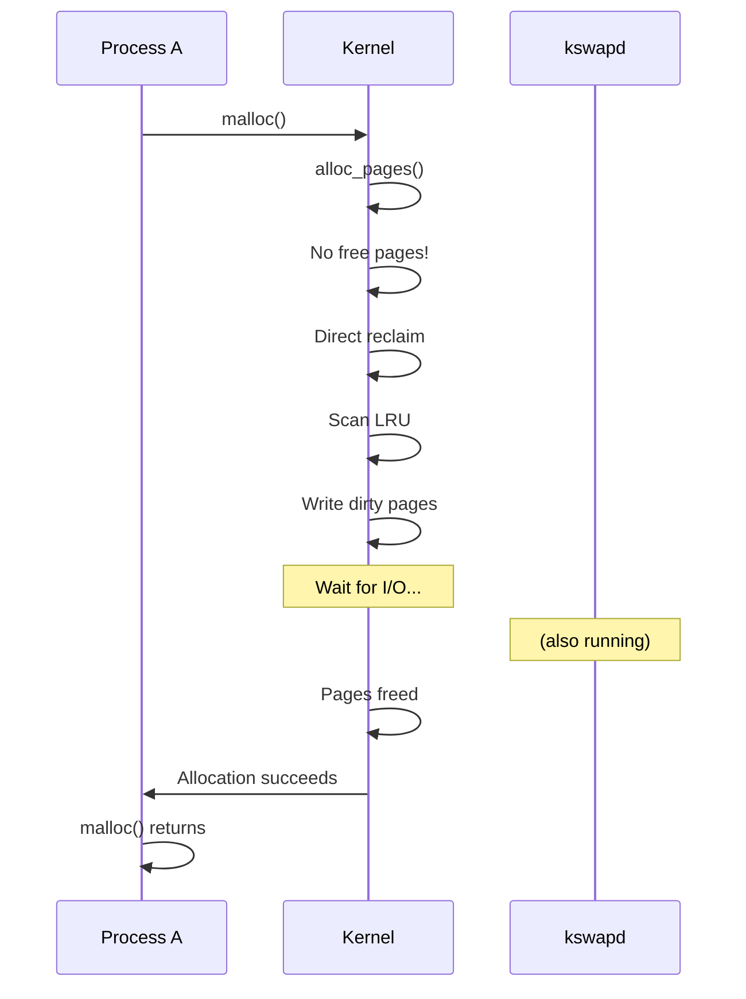
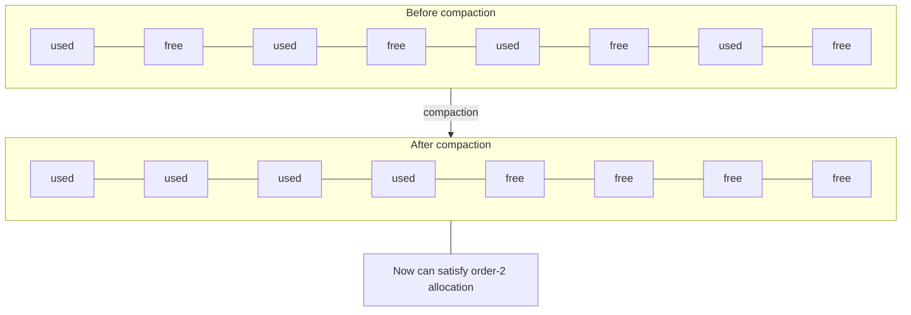
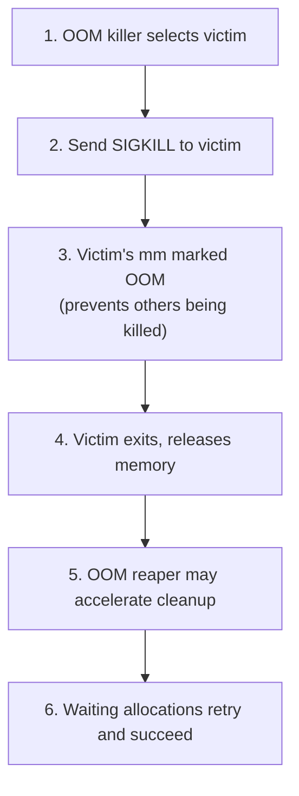
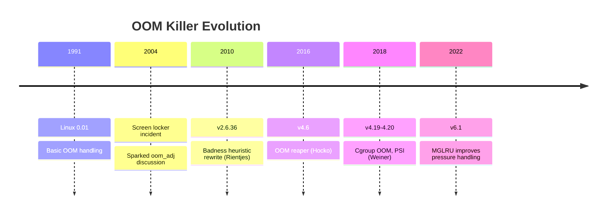
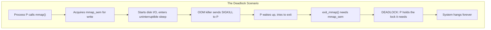

# Running out of memory

> The progression from healthy system to OOM kill

## The path to OOM

When memory runs low, the kernel doesn't immediately panic. It goes through escalating stages of intervention, trying to free memory before resorting to killing processes. Understanding this progression helps you diagnose why your process was killed and how to prevent it.


```mermaid
flowchart TB
    subgraph HEALTHY["HEALTHY"]
        H1["Free pages > high watermark"]
        H2["No action needed"]
    end

    HW["--- HIGH WATERMARK ---"]

    subgraph BACKGROUND["BACKGROUND RECLAIM"]
        B1["Free pages < low watermark"]
        B2["kswapd wakes up, reclaims in background"]
        B3["Allocations still succeed immediately"]
    end

    LW["--- LOW WATERMARK ---"]

    subgraph DIRECT["DIRECT RECLAIM"]
        D1["Free pages < min watermark"]
        D2["Allocating process must help reclaim"]
        D3["Allocation latency increases"]
    end

    MW["--- MIN WATERMARK ---"]

    subgraph OOM["OOM TERRITORY"]
        O1["Reclaim fails repeatedly"]
        O2["OOM killer invoked"]
        O3["Process terminated to free memory"]
    end

    ZERO["Zero"]

    HEALTHY --> HW --> BACKGROUND --> LW --> DIRECT --> MW --> OOM --> ZERO
```

## Stage 1: Watermarks and pressure detection

Each memory zone has three watermarks that control reclaim behavior:

```c
// From include/linux/mmzone.h
enum zone_watermarks {
    WMARK_MIN,    // Below this: direct reclaim, allocation may fail
    WMARK_LOW,    // Below this: wake kswapd
    WMARK_HIGH,   // Target for kswapd to reach
    WMARK_PROMO,  // For tiered memory promotion
    NR_WMARK
};
```

### How watermarks are calculated

Watermarks derive from `vm.min_free_kbytes` and `vm.watermark_scale_factor`:

```bash
# View current settings
cat /proc/sys/vm/min_free_kbytes
cat /proc/sys/vm/watermark_scale_factor

# min_free_kbytes sets the MIN watermark base
# watermark_scale_factor (default 10 = 0.1%) adjusts LOW and HIGH
# The exact calculation is in mm/page_alloc.c __setup_per_zone_wmarks()
```


```mermaid
flowchart TB
    HIGH["HIGH watermark"]
    LOW["LOW watermark"]
    MIN["MIN watermark"]
    ZERO["0"]

    HIGH ---|"kswapd reclaims until reaching HIGH"| LOW
    LOW ---|"Zone considered under pressure<br/>kswapd woken when free pages drop here"| MIN
    MIN ---|"Direct reclaim triggered<br/>GFP_ATOMIC allocations may fail"| ZERO
```

### Viewing watermarks

```bash
# Detailed zone information including watermarks
cat /proc/zoneinfo | grep -A 20 "zone   Normal"

# Key fields:
#   pages free     - current free pages
#   min            - min watermark
#   low            - low watermark
#   high           - high watermark
```

## Stage 2: Background reclaim (kswapd)

When free pages drop below the low watermark, `kswapd` wakes up to reclaim pages in the background.

### kswapd mechanics


```mermaid
flowchart TB
    subgraph Normal["Normal operation"]
        SLEEP["kswapd sleeping"]
    end

    subgraph Pressure["Free pages drop below LOW"]
        A["Allocator notices"] --> B["Wake kswapd"] --> C["kswapd reclaims"]
        C --> D["Reclaim until HIGH"]
    end

    Normal -.->|"memory pressure"| Pressure
```

kswapd is a per-node kernel thread:

```bash
# View kswapd threads
ps aux | grep kswapd
# kswapd0 - for node 0
# kswapd1 - for node 1 (on NUMA systems)
```

### What kswapd reclaims

kswapd scans the inactive LRU lists looking for reclaimable pages:

| Page Type | Reclaim Action |
|-----------|----------------|
| Clean file pages | Drop immediately (can re-read from disk) |
| Dirty file pages | Write back, then drop |
| Anonymous pages | Swap out (if swap available) |
| Slab caches | Shrink via shrinkers |

```c
// Simplified from mm/vmscan.c
static void shrink_node(pg_data_t *pgdat, struct scan_control *sc)
{
    // Scan and reclaim from LRU lists
    shrink_node_memcgs(pgdat, sc);

    // Shrink slab caches
    shrink_slab(sc->gfp_mask, pgdat->node_id, ...);
}
```

### Swappiness

The `vm.swappiness` parameter controls the balance between reclaiming file pages versus swapping anonymous pages:

```bash
# View current swappiness
cat /proc/sys/vm/swappiness
# Default: 60

# Lower value = prefer dropping file cache
# Higher value = more willing to swap
sysctl vm.swappiness=10  # Minimize swapping
```

| Swappiness | Behavior |
|------------|----------|
| 0 | Avoid swap unless absolutely necessary |
| 1-59 | Prefer file page reclaim |
| 60 | Default balance |
| 61-100 | Prefer swapping anonymous pages |
| 101-200 | MGLRU only: finer-grained swap aggressiveness |

**Note**: Values above 100 only have effect with MGLRU enabled (kernel 6.1+). On older kernels or with MGLRU disabled, values are effectively clamped to 0-100.

## Stage 3: Direct reclaim

When kswapd can't keep up and free pages fall below the min watermark, allocating processes must help reclaim pages themselves.

### The allocation slowpath

```c
// mm/page_alloc.c __alloc_pages() (simplified)
struct page *__alloc_pages(gfp_t gfp, unsigned int order, ...)
{
    struct page *page;

    // Fast path: try to allocate immediately
    page = get_page_from_freelist(gfp, order, ...);
    if (page)
        return page;

    // Slow path: need to work for it
    return __alloc_pages_slowpath(gfp, order, ...);
}

static struct page *__alloc_pages_slowpath(...)
{
    // 1. Wake kswapd
    wake_all_kswapds(...);

    // 2. Try again with kswapd running
    page = get_page_from_freelist(...);
    if (page)
        return page;

    // 3. Direct reclaim - we do the work ourselves
    page = __alloc_pages_direct_reclaim(...);
    if (page)
        return page;

    // 4. Try compaction for high-order allocations
    page = __alloc_pages_direct_compact(...);
    if (page)
        return page;

    // 5. Last resort: OOM killer
    page = __alloc_pages_may_oom(...);
    return page;
}
```

### Direct reclaim impact

Direct reclaim blocks the allocating process:


```mermaid
sequenceDiagram
    participant P as Process A
    participant K as Kernel
    participant KS as kswapd

    P->>K: malloc()
    K->>K: alloc_pages()
    K->>K: No free pages!
    K->>K: Direct reclaim
    K->>K: Scan LRU
    K->>K: Write dirty pages
    Note over K: Wait for I/O...
    Note over KS: (also running)
    K->>K: Pages freed
    K->>P: Allocation succeeds
    P->>P: malloc() returns
```

This can cause significant latency spikes. Applications that allocate during memory pressure may see multi-millisecond delays.

### Monitoring direct reclaim

```bash
# Count direct reclaim events
cat /proc/vmstat | grep allocstall
# allocstall_dma
# allocstall_dma32
# allocstall_normal
# allocstall_movable

# Real-time monitoring
watch -n 1 'grep -E "allocstall|pgsteal_direct|pgscan_direct" /proc/vmstat'
```

## Stage 4: Reclaim failures and retries

Sometimes reclaim doesn't free enough memory. The kernel retries with increasing desperation.

### Retry logic

```c
// The allocation retries with __GFP_RETRY_MAYFAIL or similar flags

// Retry conditions (simplified):
// 1. Did we make progress? (freed some pages)
// 2. Have we retried too many times? (MAX_RECLAIM_RETRIES)
// 3. Should we give up? (depends on GFP flags)

#define MAX_RECLAIM_RETRIES 16
```

### What causes reclaim to fail?

| Cause | Description |
|-------|-------------|
| All pages unreclaimable | Locked, pinned, or in active use |
| No swap space | Anonymous pages can't be swapped out |
| I/O bottleneck | Writeback too slow |
| Thrashing | Pages reclaimed and immediately needed again |
| Memory fragmentation | Free pages exist but in wrong zones/orders |

### The compaction fallback

For high-order allocations (multiple contiguous pages), compaction tries to defragment memory:


```mermaid
flowchart TB
    subgraph Before["Before compaction"]
        direction LR
        B1["used"] --- B2["free"] --- B3["used"] --- B4["free"] --- B5["used"] --- B6["free"] --- B7["used"] --- B8["free"]
    end

    subgraph After["After compaction"]
        direction LR
        A1["used"] --- A2["used"] --- A3["used"] --- A4["used"] --- A5["free"] --- A6["free"] --- A7["free"] --- A8["free"]
    end

    Before -->|"compaction"| After

    Note["Now can satisfy order-2 allocation"]
    After --- Note
```

```bash
# Trigger manual compaction
echo 1 > /proc/sys/vm/compact_memory

# Monitor compaction
cat /proc/vmstat | grep compact
```

## Stage 5: The OOM killer

When all reclaim efforts fail, the OOM (Out Of Memory) killer terminates a process to free memory.

### OOM killer invocation

```c
// mm/page_alloc.c (simplified)
static struct page *__alloc_pages_may_oom(...)
{
    // Check if we should invoke OOM killer
    if (should_oom_retry(...))
        return NULL;  // Keep retrying

    // Invoke OOM killer
    if (oom_killer_disabled)
        return NULL;

    out_of_memory(&oc);

    // OOM killer runs, hopefully frees memory
    // Retry allocation
    return get_page_from_freelist(...);
}
```

### How OOM selects a victim

The OOM killer scores processes by their "badness" - how much memory they use and how easy they are to kill:

```c
// mm/oom_kill.c (simplified)
long oom_badness(struct task_struct *p, ...)
{
    long points;

    // Base score: RSS + swap usage
    points = get_mm_rss(p->mm) + get_mm_counter(p->mm, MM_SWAPENTS);

    // Adjust for oom_score_adj (-1000 to +1000)
    adj = p->signal->oom_score_adj;
    if (adj == OOM_SCORE_ADJ_MIN)  // -1000
        return LONG_MIN;  // Never kill (unless no choice)

    // Apply adjustment as percentage
    points += (points * adj) / 1000;

    return points;
}
```

### OOM score components

| Factor | Impact |
|--------|--------|
| RSS (Resident Size) | Primary factor - bigger = worse |
| Swap usage | Counts against the process |
| `oom_score_adj` | Manual adjustment (-1000 to +1000) |
| Root processes | Slight bonus (3% reduction) |
| Children's memory | Considered if killing parent frees more |

### Controlling OOM behavior

```bash
# View OOM score (higher = more likely to be killed)
cat /proc/$PID/oom_score

# View adjustment
cat /proc/$PID/oom_score_adj

# Protect important processes
echo -1000 > /proc/$PID/oom_score_adj  # Never kill (almost)
echo -500 > /proc/$PID/oom_score_adj   # Less likely to kill

# Make a process OOM target
echo 1000 > /proc/$PID/oom_score_adj   # Kill this first
```

### The OOM kill message

When OOM kills, check `dmesg`:

```bash
dmesg | grep -i "out of memory"

# Typical output:
# [timestamp] Out of memory: Killed process 12345 (myapp) total-vm:1234567kB,
#             anon-rss:123456kB, file-rss:1234kB, shmem-rss:0kB,
#             UID:1000 pgtables:1234kB oom_score_adj:0
```

The log shows:
- Which process was killed
- Memory usage breakdown (vm, rss, file, shmem)
- User ID
- Page table memory
- OOM adjustment value

## Stage 6: Post-OOM recovery

After OOM kills a process:


```mermaid
flowchart TB
    A["1. OOM killer selects victim"] --> B["2. Send SIGKILL to victim"]
    B --> C["3. Victim's mm marked OOM<br/>(prevents others being killed)"]
    C --> D["4. Victim exits, releases memory"]
    D --> E["5. OOM reaper may accelerate cleanup"]
    E --> F["6. Waiting allocations retry and succeed"]
```

### OOM reaper

The OOM reaper (v4.6+) accelerates memory freeing from killed processes:

```c
// Instead of waiting for the victim to exit normally,
// OOM reaper can reclaim anonymous memory immediately
// by unmapping pages while the process is still dying
```

This helps when the victim is stuck (e.g., in uninterruptible I/O) and can't exit promptly.

## Memory cgroups and OOM

With cgroups, OOM can be scoped to a container:

```bash
# Set memory limit for a cgroup
echo 500M > /sys/fs/cgroup/memory/mygroup/memory.max

# When the cgroup exceeds its limit:
# - Cgroup-level OOM (kills within the cgroup)
# - Doesn't affect processes outside the cgroup
```

Cgroup OOM events:

```bash
# Monitor cgroup OOM events
cat /sys/fs/cgroup/mygroup/memory.events
# oom           - OOM killer invocations
# oom_kill      - Processes killed by OOM
# oom_group_kill - Entire cgroup killed (cgroup v2)
```

See [memory cgroups](memcg.md) for details.

## Preventing OOM

### Tune watermarks

```bash
# Increase min_free_kbytes for earlier kswapd intervention
sysctl vm.min_free_kbytes=131072  # 128MB

# Tradeoff: more memory reserved, less available for applications
```

### Add swap

Without swap, anonymous pages can't be reclaimed. Even a small swap provides emergency breathing room:

```bash
# Check current swap
free -h

# Create swap file
dd if=/dev/zero of=/swapfile bs=1G count=4
chmod 600 /swapfile
mkswap /swapfile
swapon /swapfile
```

### Protect critical processes

```bash
# Protect database from OOM
echo -1000 > /proc/$(pidof postgres)/oom_score_adj

# Or in systemd unit file
# [Service]
# OOMScoreAdjust=-1000
```

### Use memory cgroups

Isolate workloads with memory limits:

```bash
# Limit a container to 4GB
echo 4G > /sys/fs/cgroup/mycontainer/memory.max

# The container hits OOM before affecting the system
```

## Try it yourself

### Watch OOM progression

```bash
# Terminal 1: Monitor memory state
watch -n 1 'cat /proc/meminfo | grep -E "MemFree|MemAvailable|SwapFree|Active|Inactive"'

# Terminal 2: Consume memory until OOM
stress --vm 1 --vm-bytes 99% --vm-keep

# Terminal 3: Watch for OOM
dmesg -w | grep -i oom
```

### Simulate memory pressure stages

```bash
# Watch watermarks during pressure
watch -n 1 'cat /proc/zoneinfo | grep -A 15 "zone   Normal" | head -20'

# See kswapd wake up
vmstat 1  # watch 'si', 'so', and 'wa' columns
```

### Monitor reclaim activity

```bash
# Comprehensive reclaim stats
cat /proc/vmstat | grep -E "pgscan|pgsteal|allocstall|oom"

# Trace reclaim events
echo 1 > /sys/kernel/debug/tracing/events/vmscan/mm_vmscan_direct_reclaim_begin/enable
cat /sys/kernel/debug/tracing/trace_pipe
```

### Test OOM score adjustment

```bash
# Create test process
sleep 3600 &
PID=$!

# View its OOM score
cat /proc/$PID/oom_score

# Adjust and see score change
echo 500 > /proc/$PID/oom_score_adj
cat /proc/$PID/oom_score
```

## Key source files

| File | What It Does |
|------|--------------|
| [`mm/vmscan.c`](https://git.kernel.org/pub/scm/linux/kernel/git/torvalds/linux.git/tree/mm/vmscan.c) | Page reclaim, kswapd, direct reclaim |
| [`mm/oom_kill.c`](https://git.kernel.org/pub/scm/linux/kernel/git/torvalds/linux.git/tree/mm/oom_kill.c) | OOM killer, victim selection |
| [`mm/page_alloc.c`](https://git.kernel.org/pub/scm/linux/kernel/git/torvalds/linux.git/tree/mm/page_alloc.c) | Watermarks, allocation slowpath |
| [`include/linux/mmzone.h`](https://git.kernel.org/pub/scm/linux/kernel/git/torvalds/linux.git/tree/include/linux/mmzone.h) | Zone and watermark definitions |

## History

The OOM killer has evolved dramatically over 30+ years, driven by production failures and changing workloads.

### Timeline


```mermaid
timeline
    title OOM Killer Evolution
    1991 : Linux 0.01
         : Basic OOM handling
    2004 : Screen locker incident
         : Sparked oom_adj discussion
    2010 : v2.6.36
         : Badness heuristic rewrite (Rientjes)
    2016 : v4.6
         : OOM reaper (Hocko)
    2018 : v4.19-4.20
         : Cgroup OOM, PSI (Weiner)
    2022 : v6.1
         : MGLRU improves pressure handling
```

### Era 1: The wild west (1991-2010)

Early Linux had a simple OOM killer with crude heuristics. It would often kill the wrong process - sometimes critical system daemons, sometimes the user's screen locker (see [Case 1](#case-1-the-screen-locker-incident-2004) above).

The scoring was arbitrary: processes got points based on memory usage, but the formula was ad-hoc and hard to tune. Administrators had no way to protect critical processes.

### Era 2: The Rientjes rewrite (2010)

David Rientjes (Google) rewrote the OOM killer with a principled scoring system.

| Before | After |
|--------|-------|
| Arbitrary point system | Proportional to memory usage |
| `/proc/<pid>/oom_adj` (-17 to +15) | `/proc/<pid>/oom_score_adj` (-1000 to +1000) |
| Hard to predict victim | Score visible in `/proc/<pid>/oom_score` |

**Commit**: [a63d83f427fb](https://git.kernel.org/linus/a63d83f427fb) ("oom: badness heuristic rewrite") | [LKML](https://lore.kernel.org/lkml/alpine.DEB.2.00.1007271806310.22908@chino.kir.corp.google.com/)

**Author**: David Rientjes (Google)

The new `oom_score_adj` interface finally let administrators protect critical processes with `-1000` (never kill) or mark expendable processes with `+1000` (kill first).

### Era 3: The reliability fixes (2016)

Michal Hocko (SUSE) tackled the deadlock problems discovered by Tetsuo Handa (see [Case 2](#case-2-the-mmap_sem-deadlock-2010-2016) above).

**The OOM reaper** - a dedicated kernel thread that reclaims memory from killed processes without waiting for them to exit:

**Commit**: [aac453635549](https://git.kernel.org/linus/aac453635549) ("mm, oom: introduce oom reaper") | [LKML](https://lore.kernel.org/linux-mm/1455813292-18614-2-git-send-email-mhocko@kernel.org/)

**Author**: Michal Hocko (SUSE)

This solved the "OOM fired but system still hung" problem that plagued production systems.

### Era 4: Containers and proactive monitoring (2018)

Two major additions addressed modern workloads:

#### Per-cgroup OOM (v4.19)

Roman Gushchin (Facebook) added cgroup-aware OOM handling. Containers need isolated OOM - one container's memory hog shouldn't kill processes in another container.

The key feature is `memory.oom.group`: when set, the OOM killer treats the cgroup as an indivisible unit - either all tasks are killed together, or none are.

**Commit**: [3d8b38eb81ca](https://git.kernel.org/linus/3d8b38eb81ca) ("mm, oom: introduce memory.oom.group") | [LKML](https://lore.kernel.org/all/20180730180100.25079-4-guro@fb.com/)

**Author**: Roman Gushchin (Facebook)

```bash
# Enable cgroup-as-unit OOM behavior
echo 1 > /sys/fs/cgroup/mycontainer/memory.oom.group

# Cgroup-level OOM events
cat /sys/fs/cgroup/mycontainer/memory.events
# oom 0
# oom_kill 0
```

#### PSI - Pressure Stall Information (v4.20)

Johannes Weiner (Facebook) added PSI to detect pressure *before* OOM (see [Case 3](#case-3-the-thrashing-livelock-2010-present) above).

**Commit**: [eb414681d5a0](https://git.kernel.org/linus/eb414681d5a0) ("psi: pressure stall information for CPU, memory, and IO") | [LKML](https://lore.kernel.org/linux-mm/20180529093107.13939-1-hannes@cmpxchg.org/)

**Author**: Johannes Weiner (Facebook)

```bash
# View current pressure
cat /proc/pressure/memory
# some avg10=0.00 avg60=0.00 avg300=0.00 total=0
# full avg10=0.00 avg60=0.00 avg300=0.00 total=0

# "some" = at least one task stalled on memory
# "full" = all non-idle tasks stalled on memory
```

PSI enabled userspace OOM daemons (`systemd-oomd`, `earlyoom`) to kill processes based on actual pressure rather than just free memory counts.

### Summary of major commits

| Version | Year | Change | Author | Commit |
|---------|------|--------|--------|--------|
| v2.6.36 | 2010 | Badness heuristic rewrite | David Rientjes | [a63d83f427fb](https://git.kernel.org/linus/a63d83f427fb) |
| v4.6 | 2016 | OOM reaper | Michal Hocko | [aac453635549](https://git.kernel.org/linus/aac453635549) |
| v4.19 | 2018 | Per-cgroup OOM (`memory.oom.group`) | Roman Gushchin | [3d8b38eb81ca](https://git.kernel.org/linus/3d8b38eb81ca) |
| v4.20 | 2018 | PSI | Johannes Weiner | [eb414681d5a0](https://git.kernel.org/linus/eb414681d5a0) |

## Notorious bugs and edge cases

The OOM killer's history is littered with edge cases that taught kernel developers painful lessons. Understanding these helps explain why the current design exists and what safeguards are now in place.

---

### Case 1: The screen locker incident (2004)

#### What happened

In September 2004, developer Thomas Habets returned to his Linux workstation to find it unlocked. The OOM killer had terminated his `xlock` screen locker during a memory shortage, leaving his session exposed to anyone walking by.

As Habets [wrote on LKML](https://lwn.net/Articles/104145/): *"I just got a very uncomfortable surprise when found my box unlocked thanks to this."*

#### Real-world implications

This wasn't just an inconvenience - it was a **security breach**. Screen lockers, authentication daemons, and similar security-critical processes must never be killed, even under memory pressure. An attacker with physical access could trigger OOM to unlock a workstation.

#### The proposed fix

Habets submitted the [oom_pardon patch](https://lwn.net/Articles/104145/), proposing a sysctl at `/proc/sys/vm/oom_pardon` that would accept a list of executables to never kill:

> *"How about a sysctl that does 'for the love of kbaek, don't ever kill these processes when OOM. If nothing else can be killed, I'd rather you panic.' Examples for this list would be /usr/bin/vlock and /usr/X11R6/bin/xlock."*

#### Community response

The discussion on [LWN](https://lwn.net/Articles/104179/) and LKML was spirited. Alan Cox [pointed out](https://lwn.net/Articles/104179/) that the real problem was overcommit:

> *"The rest of us just turn on 'no overcommit' in /proc/sys. That way we get told before takeoff that there isn't enough memory instead."*

Andries Brouwer offered a memorable [analogy](https://lwn.net/Articles/104179/):

> *"An aircraft company discovered that it was cheaper to fly its planes with less fuel on board... On rare occasions however the amount of fuel was insufficient, and the plane would crash. This problem was solved by the engineers of the company by the development of a special OOF (out-of-fuel) mechanism."*

It turned out SUSE already had a similar patch allowing administrators to adjust OOM scores per-process.

#### What was fixed

The immediate `oom_pardon` patch wasn't merged, but the discussion led to:

1. **`/proc/<pid>/oom_adj`** (v2.6.11): Allowed adjusting a process's OOM score (-17 to +15)
2. **`/proc/<pid>/oom_score_adj`** (v2.6.36): Cleaner interface (-1000 to +1000), where -1000 means "never kill"

**Commit**: [a63d83f427fb](https://git.kernel.org/linus/a63d83f427fb) ("oom: badness heuristic rewrite") - David Rientjes, 2010

#### Future-proofing

```bash
# Protect critical processes today
echo -1000 > /proc/$(pidof xscreensaver)/oom_score_adj

# Or in systemd unit files
[Service]
OOMScoreAdjust=-1000
```

---

### Case 2: The mmap_sem deadlock (2010-2016)

#### What happened

Tetsuo Handa, a persistent kernel debugger, [demonstrated workloads](https://lwn.net/Articles/666024/) that would cause the OOM killer to fire but never free memory. The system would hang indefinitely.

The problem: a process chosen as OOM victim might be holding `mmap_sem` (now `mmap_lock`) for write - perhaps in the middle of `mmap()` or `munmap()`. When the process receives `SIGKILL`:

1. The signal is pending, but the process is in uninterruptible sleep (e.g., waiting for disk I/O)
2. When it finally wakes, `exit_mmap()` tries to tear down its address space
3. But `exit_mmap()` needs `mmap_sem` - which the dying process already holds
4. Classic self-deadlock


```mermaid
flowchart TD
    subgraph Deadlock["The Deadlock Scenario"]
        A["Process P calls mmap()"] --> B["Acquires mmap_sem for write"]
        B --> C["Starts disk I/O, enters uninterruptible sleep"]
        C --> D["OOM killer sends SIGKILL to P"]
        D --> E["P wakes up, tries to exit"]
        E --> F["exit_mmap() needs mmap_sem"]
        F --> G["DEADLOCK: P holds the lock it needs"]
        G --> H["System hangs forever"]
    end
```

Meanwhile, other processes trying to allocate memory are waiting for this victim to die and release memory - which never happens.

#### Real-world implications

Servers running memory-intensive workloads would hang completely. The OOM killer had fired (visible in dmesg), but no memory was freed. The only recovery was a hard reboot.

Handa [showed](https://lore.kernel.org/linux-mm/1469734954-31247-1-git-send-email-mhocko@kernel.org/) it was *"not hard to construct workloads which break the core assumption... the OOM victim might take unbounded amount of time to exit."*

#### The fix: OOM reaper (v4.6)

Michal Hocko (SUSE) developed the [OOM reaper](https://lwn.net/Articles/666024/), based on ideas from Mel Gorman (LSFMM 2015) and Oleg Nesterov.

The key insight: *"It is not necessary to wait for the targeted process to die before stripping it of much of its memory. That process has received a SIGKILL signal, meaning it will not run again in user mode. That, in turn, means that it will no longer access any of its anonymous pages. Those pages can be reclaimed immediately."*

**Commit**: [aac453635549](https://git.kernel.org/linus/aac453635549) ("mm, oom: introduce oom reaper") | [LKML](https://lore.kernel.org/linux-mm/1455813292-18614-2-git-send-email-mhocko@kernel.org/)

**Author**: Michal Hocko

The reaper is a dedicated kernel thread that:
1. Takes `mmap_sem` for **read** (not write) - much less contention
2. Walks the victim's VMAs and unmaps anonymous pages
3. Frees memory without waiting for the victim to exit

#### Additional safeguards (v4.8)

Hocko added `MMF_OOM_NOT_REAPABLE` flag: if the reaper can't acquire `mmap_sem` after multiple attempts, it marks the mm as "reaped" anyway, allowing the OOM killer to select another victim.

**Commit**: [bc448e897b6d](https://git.kernel.org/linus/bc448e897b6d) ("mm, oom_reaper: do not attempt to reap a task more than twice")

#### Concurrent work: killable mmap_sem

Many code paths holding `mmap_sem` for write were converted to use `down_write_killable()`, so they can be interrupted by `SIGKILL`. This reduces the window for deadlocks.

---

### Case 3: The thrashing livelock (2010, mitigated 2018+)

#### What happened

When memory is tight but not exhausted, systems can enter a pathological state where they're technically alive but completely unresponsive for minutes or hours.

Mandeep Singh Baines (Google/ChromeOS) [documented this in 2010](https://lore.kernel.org/lkml/20101028191523.GA14972@google.com/):

> *"On ChromiumOS, we do not use swap. When memory is low, the only way to free memory is to reclaim pages from the file list. This results in a lot of thrashing... We see the system become unresponsive for minutes before it eventually OOMs."*

The pathology:

1. Memory pressure causes page cache eviction
2. Shared libraries (`libc.so`, etc.) and program text get evicted
3. Every context switch triggers disk I/O to reload code pages
4. System spends 99% of time in I/O wait, 1% doing useful work
5. OOM killer never triggers because there's technically "free" memory (it's just being constantly evicted and reloaded)
6. From the user's perspective, the system is frozen

#### Real-world implications

This affected desktop users severely. The Fedora Workstation working group [discussed](https://fedoraproject.org/wiki/Changes/EnableEarlyoom) *"better interactivity in low-memory situations"* for months:

> *"In certain use cases, typically compiling, if all RAM and swap are completely consumed, system responsiveness becomes so abysmal that a reasonable user can consider the system 'lost', and resorts to forcing a power off. This is objectively a very bad UX."*

The [le9-patch](https://github.com/hakavlad/le9-patch) repository documents: *"The kernel may crash due to OOM even with files present in the page cache, just because it cannot reclaim pages quickly enough to keep up with the allocations... due to memory shortage, the system drops the cache for shared libraries and even for the program text of running processes."*

#### Fixes and mitigations

**1. PSI - Pressure Stall Information (v4.20)**

Johannes Weiner (Facebook) developed [PSI](https://lwn.net/Articles/759781/) to detect pressure before OOM:

> *"When CPU, memory or IO devices are contended, workloads experience latency spikes, throughput losses, and run the risk of OOM kills. Without an accurate measure of such contention, users are forced to either play it safe and under-utilize their hardware resources, or roll the dice."*

**Commit**: [eb414681d5a0](https://git.kernel.org/linus/eb414681d5a0) ("psi: pressure stall information for CPU, memory, and IO") | [LKML](https://lore.kernel.org/linux-mm/20180529093107.13939-1-hannes@cmpxchg.org/)

**Author**: Johannes Weiner (Facebook)

PSI was already used internally at Facebook: *"We now log and graph pressure for the containers in our fleet and can trivially link latency spikes and throughput drops to shortages of specific resources."*

**2. earlyoom (userspace, 2017+)**

[rfjakob's earlyoom](https://github.com/rfjakob/earlyoom) daemon polls memory frequently and kills processes before the system becomes unresponsive.

Red Hat's Chris Murphy proposed [enabling earlyoom by default](https://fedoraproject.org/wiki/Changes/EnableEarlyoom) in Fedora 32:

> *"The idea is to recover from out of memory situations sooner, rather than the typical complete system hang in which the user has no other choice but to force power off."*

**Fedora 32+ enables earlyoom by default on Workstation.**

**3. le9 patches (ChromeOS, out-of-tree)**

The [le9 patches](https://github.com/hakavlad/le9-patch) protect file-backed pages from eviction:

> *"With this patch and min_filelist_kbytes set to 50000, there is very little block layer activity during low memory. The system stays responsive under low memory and browser tab switching is fast."*

ChromeOS has used similar file-locking patches for nearly 10 years, but they haven't been merged upstream.

```bash
# Check for thrashing with PSI
cat /proc/pressure/memory
# full avg10=45.00 avg60=30.00 ...  # 45% of time fully stalled = thrashing

# Use earlyoom for desktop protection
earlyoom -m 5 -s 5  # Kill when <5% memory AND <5% swap
```

---

### Case 4: The fork bomb race (2011)

#### What happened

Fork bombs create processes faster than the OOM killer can kill them:

```c
while(1) fork();
```

KAMEZAWA Hiroyuki [identified the problem](https://lwn.net/Articles/433509/):

> *"If there is a quick fork-bomb and it locks memory... users feel very bad response and will not be able to recover because fork-bomb tend to be faster than killall and oom-kill."*

The OOM killer's per-process scoring fails here:
1. Each new process has low memory usage (COW pages aren't copied yet)
2. OOM killer scans all processes, finds the "worst" one
3. Kills it, waits for exit, memory freed
4. Fork bomb creates 1000 more processes in the meantime
5. Repeat forever

#### Real-world implications

A single malicious (or buggy) user could take down a multi-user system. Even root couldn't recover without a reboot because the shell could barely get CPU time.

#### The fork bomb killer patch

Hiroyuki proposed a [fork bomb killer](https://lwn.net/Articles/435917/) with heuristics:

> *"This can kill a fork-bomb when threads in a bomb are enough young (10min) and the number of new processes are enough large (10)."*

The patch tracked process history in a tree structure:

> *"The fork bomb killer will perform a depth-first traversal of the process history tree... At the end, the process with the highest score is examined; if there are at least ten processes in the history below the high scorer, it is deemed to be a fork bomb."*

When detected:
- All tasks in the fork bomb are killed
- New `fork()` in that session returns `-ENOMEM` for 30 seconds

#### What was actually merged: cgroups pids controller (v4.3)

Instead of kernel heuristics, the solution was the [pids controller](https://docs.kernel.org/admin-guide/cgroup-v1/pids.html):

> *"The process number controller is used to allow a cgroup hierarchy to stop any new tasks from being fork()'d or clone()'d after a certain limit is reached. Since it is trivial to hit the task limit without hitting any kmemcg limits in place, PIDs are a fundamental resource."*

**Commit**: [49b786ea146f](https://git.kernel.org/linus/49b786ea146f) ("cgroup: add pids controller")

**Author**: Aleksa Sarai

```bash
# Prevent fork bombs with cgroups
echo 1000 > /sys/fs/cgroup/mygroup/pids.max

# Or with ulimit
ulimit -u 500  # Max 500 processes for this user
```

---

### Case 5: CVE-2012-4398 - OOM deadlock denial of service

#### What happened

Tetsuo Handa (the same developer who found the mmap_sem deadlock) discovered that a local unprivileged user could trigger a deadlock in the OOM killer.

#### The bug

The [Red Hat CVE page](https://access.redhat.com/security/cve/CVE-2012-4398) describes it:

> *"A deadlock could occur in the Out of Memory (OOM) killer. A process could trigger this deadlock by consuming a large amount of memory, and then causing request_module() to be called."*

The attack pattern:
1. Allocate large amounts of memory to trigger OOM conditions
2. Trigger `request_module()` which tries to load a kernel module
3. Module loading needs memory, but OOM is active
4. Deadlock: OOM waiting for memory, memory waiting for OOM to finish

#### Real-world implications

A local unprivileged user could cause denial of service through excessive memory consumption and system hang. Red Hat rated this as "Moderate" severity.

#### The fix

**Red Hat Errata**: [RHSA-2013:1348](https://access.redhat.com/errata/RHSA-2013:1348)

The fix prevented the deadlock by ensuring proper lock ordering between the OOM killer and module loading paths.

[Red Hat credited Tetsuo Handa](https://access.redhat.com/security/cve/CVE-2012-4398) for reporting this issue.

#### Future-proofing

This CVE highlighted that OOM handling is **security-sensitive**. Subsequent OOM work has been more carefully reviewed for potential abuse by local attackers.

---

### Case 6: systemd cgroup massacre (2022)

#### What happened

With cgroups v2 and systemd's scope management, a new problem emerged: when the kernel OOM killer terminates one process in a user session, systemd would kill **all** processes in that cgroup scope.

[GitHub Issue #25376](https://github.com/systemd/systemd/issues/25376) documents:

> *"The expected behavior is normal kernel OOM killer behavior... However, systemd will kill an entire user slice's scope unit when a process under the scope is OOM killed by the kernel, wrecking everything the user was doing instead of limiting the damage to a single offending process."*

Example scenario:
1. User runs Firefox, Chrome, VS Code, and a terminal
2. One Chrome tab triggers OOM, kernel kills that process
3. systemd sees a process died due to OOM
4. systemd kills the entire session scope - Firefox, VS Code, terminal, everything
5. All unsaved work is lost

#### Real-world implications

Users on Fedora, Arch, and other distributions with systemd-oomd enabled by default experienced unexpected session terminations. [One blogger wrote](https://utcc.utoronto.ca/~cks/space/blog/linux/SystemdOomdNowDisabled): *"I've now disabled systemd-oomd on my Fedora desktops."*

The [related issue #25853](https://github.com/systemd/systemd/issues/25853) requests:

> *"Add systemd-oomd option to kill single, largest process instead of entire cgroup."*

#### The design decision

The [systemd-oomd documentation](https://www.freedesktop.org/software/systemd/man/latest/systemd-oomd.service.html) explains the rationale:

> *"If the configured limits are exceeded, systemd-oomd will select a cgroup to terminate, and send SIGKILL to all processes in it."*

This is intentional - systemd treats cgroups as the unit of resource management. But for user sessions, it's often the wrong granularity.

#### The fix

[GitHub PR #25385](https://github.com/systemd/systemd/pull/25385) added support for `OOMPolicy=` in scope units, allowing users to control how systemd responds to kernel OOM events in user sessions.

```bash
# Modern solution: set OOMPolicy in scope units
[Scope]
OOMPolicy=continue  # Don't kill siblings when one process OOM'd

# Or configure per-service
[Service]
OOMPolicy=continue  # Don't kill siblings

# System-wide default
# In /etc/systemd/system.conf:
DefaultOOMPolicy=continue
```

#### Legacy workarounds (pre-fix)

```bash
# Disable systemd-oomd entirely (still useful if you prefer kernel OOM)
sudo systemctl disable --now systemd-oomd

# Run critical apps in separate scopes
systemd-run --user --scope firefox
```

---

### Summary: Lessons learned

| Era | Problem | Root Cause | Fix | Prevention Today |
|-----|---------|------------|-----|------------------|
| 2004 | Screen locker killed | No way to protect processes | `oom_score_adj` | Set `-1000` for critical processes |
| 2010 | Badness heuristic wrong | Scoring was arbitrary | Heuristic rewrite (Rientjes) | Use proportional memory scoring |
| 2010-2016 | Victim can't exit | `mmap_sem` deadlock | OOM reaper (Hocko) | Kernel ≥4.6 has reaper |
| 2010+ | Thrashing livelock | OOM triggers too late | PSI, earlyoom | Use `earlyoom` or PSI monitoring |
| 2011 | Fork bomb wins | Per-process scoring fails | cgroups pids controller | Set `pids.max` in cgroups |
| 2012 | CVE-2012-4398 | OOM races exploitable | Kernel hardening | Keep kernel updated |
| 2022 | systemd kills session | Cgroup-granularity killing | `OOMPolicy=` in scope units | Fixed in systemd PR #25385 |

The common thread: **OOM handling is harder than it looks**. Each "obvious" assumption - processes die quickly, free memory means healthy system, per-process scoring is sufficient - has been proven wrong in production.

## Further reading

### Related docs

- [Page reclaim](reclaim.md) - Reclaim mechanisms in depth
- [Memory overcommit](overcommit.md) - Why OOM happens despite "free" memory
- [Memory cgroups](memcg.md) - Container memory limits
- [Life of a page](life-of-page.md) - Page lifecycle and reclaim

### LWN articles

- [The OOM killer](https://lwn.net/Articles/317814/) (2008) - Classic overview
- [Respite from the OOM killer](https://lwn.net/Articles/104179/) (2004) - The screen locker incident
- [Toward more predictable and reliable out-of-memory handling](https://lwn.net/Articles/668126/) (2016) - OOM reaper motivation
- [PSI - Pressure Stall Information](https://lwn.net/Articles/759781/) (2018) - Proactive pressure monitoring
