# What happens during swapping

> The journey of a page from memory to disk and back

## What is swapping?

When memory runs low, the kernel can move anonymous pages (heap, stack, private mappings) to a swap device - either a disk partition or a swap file. This frees physical memory for other uses while preserving the page's contents.

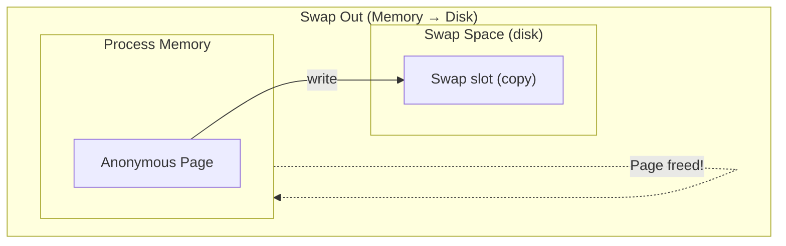

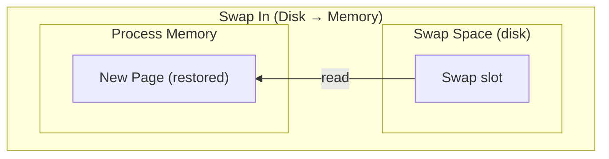

Unlike file pages (which can be re-read from their backing file), anonymous pages have nowhere to go except swap space.

## Why this page was chosen

The kernel doesn't randomly pick pages to swap. It uses the [LRU (Least Recently Used)](reclaim.md) lists to find cold pages - pages that haven't been accessed recently.

### The selection process

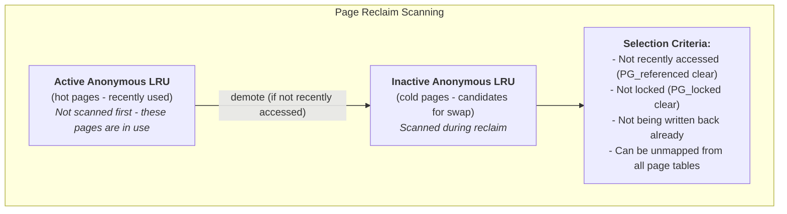

### The referenced flag check

Pages get a "second chance" via the referenced flag:

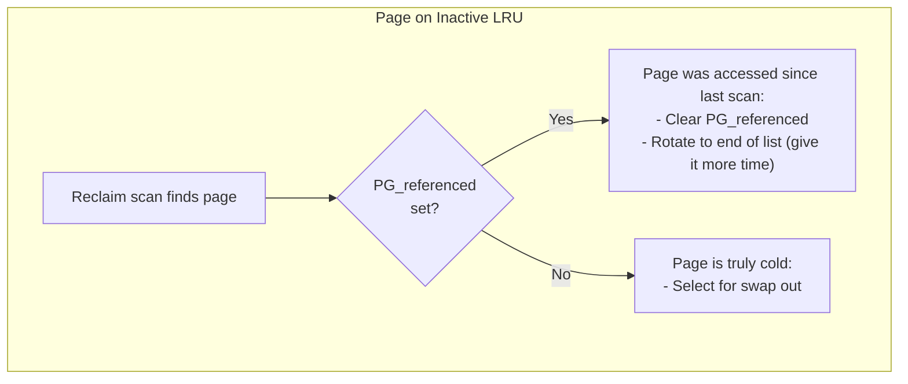

This prevents swapping out pages that are still being used occasionally.

## Swap space organization

Linux supports two types of swap:

| Type | Device | Characteristics |
|------|--------|-----------------|
| Swap partition | `/dev/sda2` | Dedicated, fixed size |
| Swap file | `/swapfile` | Flexible, can resize, easier to manage |

On modern systems (especially SSDs), performance between partition and file swap is nearly identical. The "partition is faster" advice is largely historical - filesystem overhead is negligible compared to actual I/O.

### Swap area structure

```c
// From include/linux/swap.h
struct swap_info_struct {
    unsigned long flags;        // SWP_USED, SWP_WRITEOK, etc.
    signed char prio;           // Priority (higher = used first)
    struct file *swap_file;     // The swap file/device
    struct block_device *bdev;  // Block device (if partition)
    unsigned long *swap_map;    // Usage count per slot
    unsigned long lowest_bit;   // Optimization: first free slot hint
    unsigned long highest_bit;  // Optimization: last used slot
    unsigned int pages;         // Total slots in this area
    unsigned int inuse_pages;   // Currently used slots
    // ...
};
```

### Swap slots

Swap space is divided into page-sized slots:

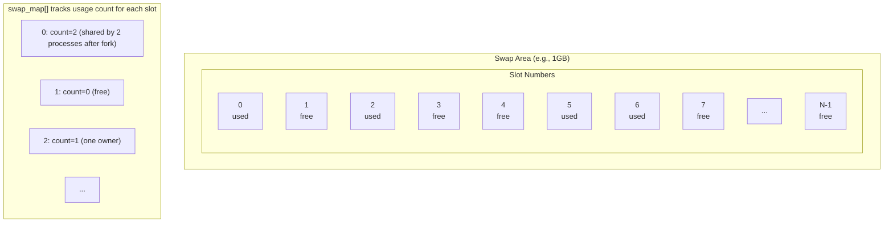

### Viewing swap status

```bash
# View swap areas
cat /proc/swaps
# Filename          Type        Size      Used    Priority
# /dev/nvme0n1p3    partition   8388604   12345   -2

# Detailed swap info
swapon --show

# System-wide swap usage
free -h
```

## Stage 1: Swap slot allocation

When the kernel decides to swap out a page, it first allocates a slot:

```c
// mm/swap_slots.c / mm/swapfile.c (simplified)
swp_entry_t folio_alloc_swap(struct folio *folio)
{
    struct swap_info_struct *si;
    swp_entry_t entry;

    // Find a swap area with free slots
    // Higher priority areas are checked first
    si = swap_info[...];  // Based on priority

    // Allocate a slot
    offset = scan_swap_map_slots(si, ...);

    // Create swap entry (type + offset encoded)
    entry = swp_entry(si->type, offset);

    return entry;
}
```

### Swap entry encoding

A swap entry packs the swap area type and offset into a single value:

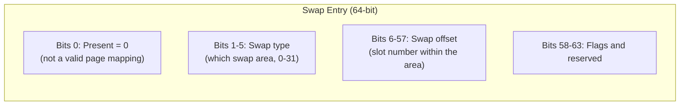

This entry will replace the page table entry (PTE) after the page is written out.

## Stage 2: Writing to swap

Once a slot is allocated, the page content is written to the swap device:

```c
// mm/vmscan.c shrink_folio_list() (simplified)
static unsigned int shrink_folio_list(struct list_head *folio_list, ...)
{
    // For each folio...

    // 1. Unmap from all page tables first
    //    (so no one can access while we're writing)
    try_to_unmap(folio, TTU_BATCH_FLUSH);

    // 2. If anonymous and we can swap...
    if (folio_test_anon(folio)) {
        if (!add_to_swap(folio))
            goto activate;  // Can't swap, keep in memory

        // 3. Write page to swap device
        pageout(folio, mapping);
    }
}
```

### The add_to_swap() function

```c
// mm/swap_state.c
bool add_to_swap(struct folio *folio)
{
    swp_entry_t entry;

    // 1. Get a swap slot
    entry = folio_alloc_swap(folio);
    if (!entry.val)
        return false;  // No swap space available

    // 2. Set up folio for swap
    folio_set_swapcache(folio);
    folio->swap = entry;

    // 3. Add to swap cache (so others can find it during I/O)
    __folio_set_swap_entry(folio, entry);
    xa_store(&swap_address_space->i_pages, ...);

    return true;
}
```

### Writing to disk

```c
// Simplified I/O path
static int pageout(struct folio *folio, struct address_space *mapping)
{
    // Submit write I/O to swap device
    // This is asynchronous - we don't wait here

    struct writeback_control wbc = {
        .sync_mode = WB_SYNC_NONE,  // Don't wait
    };

    return mapping->a_ops->writepage(&folio->page, &wbc);
}
```

The actual I/O goes through the block layer:

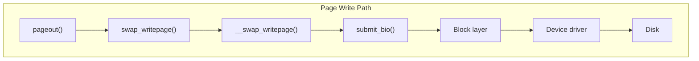

## Stage 3: Page table update

After the write completes, the PTE is updated to contain the swap entry instead of a page mapping:

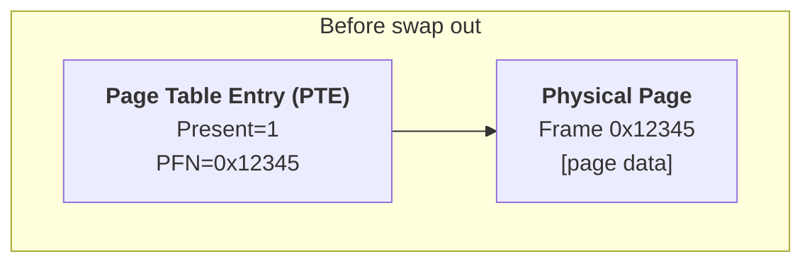

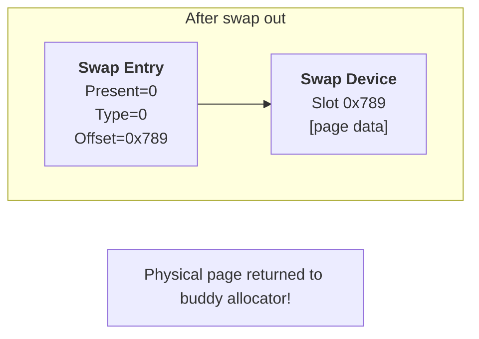

### The swap cache

During I/O, the page stays in the **swap cache** - an address space that allows finding in-flight pages:

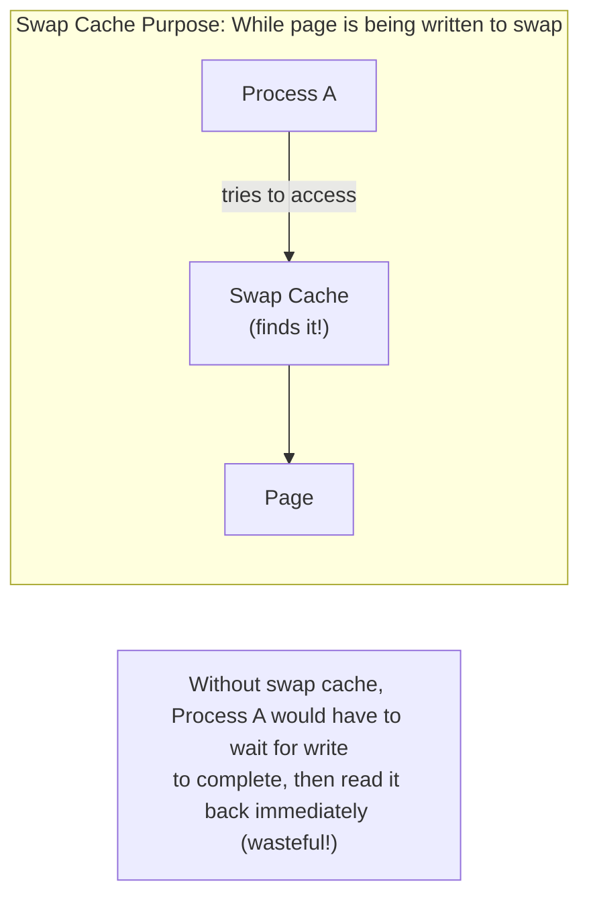

After I/O completes successfully:
- Page is removed from swap cache
- Physical page is freed
- Only the swap slot remains with the data

## Stage 4: Process accesses swapped page

Later, when a process accesses a swapped-out address, a page fault brings it back.

### The fault handler detects a swap entry

```c
// arch/x86/mm/fault.c → mm/memory.c
static vm_fault_t handle_pte_fault(struct vm_fault *vmf)
{
    pte_t entry = vmf->orig_pte;

    if (!pte_present(entry)) {
        if (pte_none(entry))
            return do_anonymous_page(vmf);  // New page

        // PTE has swap entry
        return do_swap_page(vmf);  // ← Our path!
    }

    // ... handle other cases
}
```

### do_swap_page() brings the page back

```c
// mm/memory.c (simplified)
vm_fault_t do_swap_page(struct vm_fault *vmf)
{
    swp_entry_t entry = pte_to_swp_entry(vmf->orig_pte);
    struct folio *folio;

    // 1. Check swap cache first (maybe another thread faulted already)
    folio = swap_cache_get_folio(entry, ...);

    if (!folio) {
        // 2. Not in cache - need to read from swap
        folio = swapin_readahead(entry, ...);
    }

    // 3. Wait for page to be ready
    folio_lock(folio);

    // 4. Verify swap entry still valid (race check)
    // ...

    // 5. Update page table: swap entry → page mapping
    pte = mk_pte(&folio->page, vmf->vma->vm_page_prot);
    if (vmf->flags & FAULT_FLAG_WRITE)
        pte = pte_mkwrite(pte_mkdirty(pte), vmf->vma);

    set_pte_at(vmf->vma->vm_mm, vmf->address, vmf->pte, pte);

    // 6. Update LRU
    folio_add_lru(folio);

    // 7. Free swap slot (if we're the last user)
    swap_free(entry);

    return 0;
}
```

### Swap-in readahead

Like file readahead, the kernel predicts you might access nearby swapped pages:

```c
// mm/swap_state.c
struct folio *swapin_readahead(swp_entry_t entry, gfp_t gfp_mask,
                                struct vm_fault *vmf)
{
    struct page *page;

    // Read the requested page
    page = read_swap_cache_async(entry, ...);

    // Also read nearby pages (readahead)
    if (should_readahead(...)) {
        for (offset = -readahead_win; offset <= readahead_win; offset++) {
            swp_entry_t ra_entry = swp_entry(type, entry_offset + offset);
            read_swap_cache_async(ra_entry, ...);
        }
    }

    return page_folio(page);
}
```

## Stage 5: Swap slot freed

After successful swap-in, the swap slot can be freed:

```c
// mm/swapfile.c
void swap_free(swp_entry_t entry)
{
    struct swap_info_struct *si = swap_info[swp_type(entry)];

    // Decrement usage count
    // (might be >1 if COW shared the slot)
    count = swap_map[swp_offset(entry)]--;

    if (count == 0) {
        // Slot is now free for reuse
        si->inuse_pages--;
    }
}
```

### Swap slots and COW

When processes share a swapped page (after fork + swap):

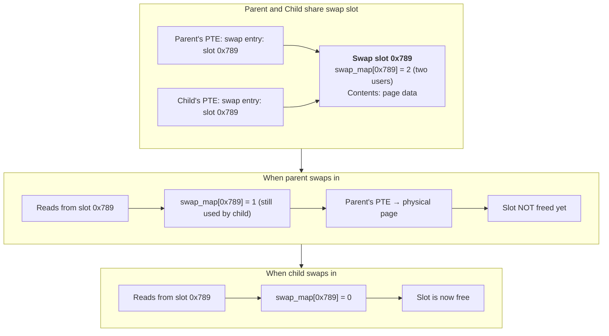

## The complete swap cycle

Putting it all together:

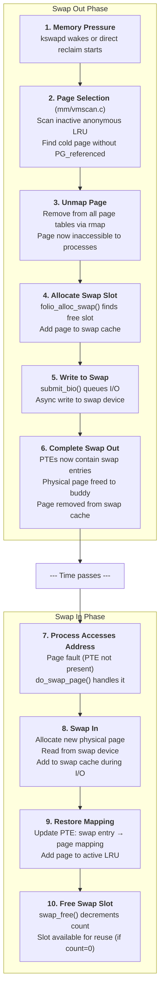

## Swap tunables

### Swappiness

Controls how aggressively the kernel swaps:

```bash
# View current value
cat /proc/sys/vm/swappiness
# Default: 60

# Reduce swapping (prefer reclaiming file cache)
sysctl vm.swappiness=10

# Avoid swapping almost entirely
sysctl vm.swappiness=1
```

| Value | Effect |
|-------|--------|
| 0 | Swap only to avoid OOM |
| 1-30 | Prefer file cache reclaim |
| 60 | Default balance |
| 100 | Aggressive swapping |

### Swap priority

Multiple swap areas can have different priorities:

```bash
# Higher priority = used first
swapon -p 10 /dev/fast_ssd     # Priority 10 (used first)
swapon -p 5 /dev/slow_hdd      # Priority 5 (used when fast is full)

# Same priority = round-robin
swapon -p 10 /dev/ssd1
swapon -p 10 /dev/ssd2         # Striped across both
```

### VFS cache pressure

Affects the balance between reclaiming file cache vs swapping:

```bash
cat /proc/sys/vm/vfs_cache_pressure
# Default: 100

# Lower = keep file caches longer (swap more)
# Higher = drop file caches more readily (swap less)
```

## Swap performance considerations

### SSD vs HDD

| Metric | HDD | SSD |
|--------|-----|-----|
| Random read | ~10ms | ~0.1ms |
| Sequential read | ~100MB/s | ~500-3000MB/s |
| Write endurance | Unlimited | Limited (but usually fine) |

SSDs dramatically improve swap performance, making swapping much less painful.

### Swap thrashing

When the working set exceeds RAM, the system constantly swaps pages in and out:

```mermaid
flowchart LR
    subgraph Thrashing["Thrashing"]
        direction TB
        TimeArrow["Time →"]

        subgraph PageA["Page A"]
            A1["in memory"] --> A2["swap out"] --> A3["swap in"] --> A4["swap out"] --> A5["..."]
        end

        subgraph PageB["Page B"]
            B1["swap in"] --> B2["swap out"] --> B3["swap in"] --> B4["swap out"] --> B5["..."]
        end

        subgraph PageC["Page C"]
            C1["swap out"] --> C2["swap in"] --> C3["swap out"] --> C4["swap in"] --> C5["..."]
        end

        Result["System spends more time swapping than doing useful work!"]
    end
```

**Signs of thrashing**:
- High swap I/O (`vmstat` si/so columns)
- High CPU time in kernel (`top` shows high sy/wa)
- Application responsiveness drops drastically

**Solutions**:
- Add more RAM
- Reduce memory usage
- Use zswap or zram for compression

### zswap and zram

**zswap**: Compresses pages before writing to swap device:

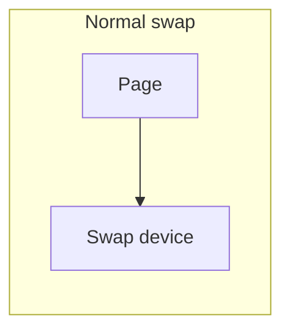

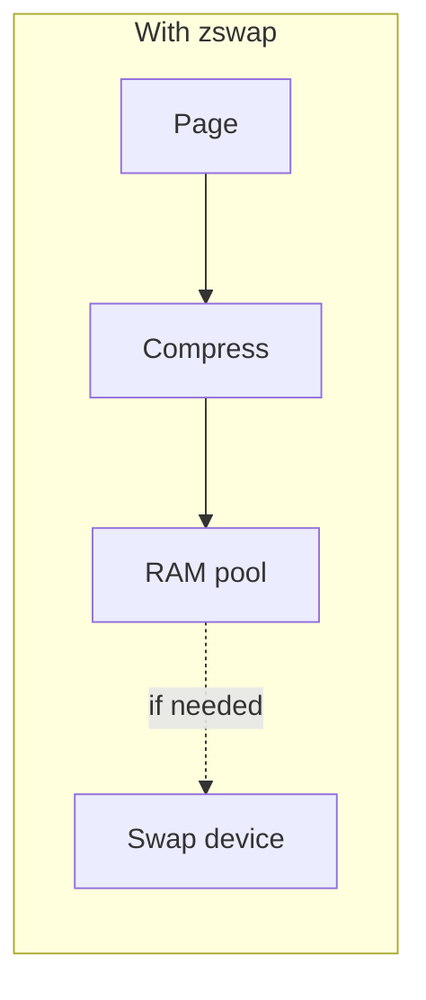

**zram**: Creates a compressed RAM disk as swap:

```bash
# Enable zram
modprobe zram
echo lz4 > /sys/block/zram0/comp_algorithm
echo 2G > /sys/block/zram0/disksize
mkswap /dev/zram0
swapon -p 100 /dev/zram0  # High priority
```

## Try it yourself

### Monitor swap activity

```bash
# Real-time swap I/O
vmstat 1
# si = swap in (KB/s)
# so = swap out (KB/s)

# Detailed swap stats
cat /proc/vmstat | grep -E "pswp|swap"
# pswpin  - pages swapped in
# pswpout - pages swapped out
```

### Watch a swap operation

```bash
# Terminal 1: Monitor swap
watch -n 1 'free -h; echo; cat /proc/swaps'

# Terminal 2: Force swapping
stress --vm 1 --vm-bytes 90% --vm-keep &

# Terminal 3: Watch specific process swap usage
for pid in $(pgrep stress); do
    echo "PID $pid: $(grep VmSwap /proc/$pid/status)"
done
```

### Trace swap events

```bash
# Enable swap tracing
echo 1 > /sys/kernel/debug/tracing/events/vmscan/mm_vmscan_writepage/enable
echo 1 > /sys/kernel/debug/tracing/events/swap/swap_readpage/enable

# Watch events
cat /sys/kernel/debug/tracing/trace_pipe
```

### Examine swap contents

```bash
# Per-process swap usage
for pid in /proc/[0-9]*; do
    comm=$(cat $pid/comm 2>/dev/null)
    swap=$(grep VmSwap $pid/status 2>/dev/null | awk '{print $2}')
    [ "$swap" != "0" ] && [ -n "$swap" ] && echo "$comm: ${swap}kB"
done | sort -t: -k2 -n -r | head -10
```

### Test swap in/out explicitly

```bash
# Allocate memory and force swap
cat > /tmp/swap_test.c << 'EOF'
#include <stdio.h>
#include <stdlib.h>
#include <string.h>
#include <unistd.h>

int main() {
    size_t size = 200 * 1024 * 1024;  // 200MB
    char *buf = malloc(size);

    // Touch all pages
    memset(buf, 'A', size);
    printf("Allocated and touched %zuMB\n", size / 1024 / 1024);
    printf("Press Enter to trigger memory pressure...\n");
    getchar();

    // Let system swap it out
    printf("Sleeping - watch with vmstat...\n");
    sleep(30);

    // Access again (swap in)
    printf("Accessing memory (swap in)...\n");
    volatile char c = buf[0];  // Force access

    printf("Done. Press Enter to exit.\n");
    getchar();
    return 0;
}
EOF
gcc -o /tmp/swap_test /tmp/swap_test.c
/tmp/swap_test
```

## Key source files

| File | What It Does |
|------|--------------|
| [`mm/swapfile.c`](https://git.kernel.org/pub/scm/linux/kernel/git/torvalds/linux.git/tree/mm/swapfile.c) | Swap area management, slot allocation |
| [`mm/swap_state.c`](https://git.kernel.org/pub/scm/linux/kernel/git/torvalds/linux.git/tree/mm/swap_state.c) | Swap cache operations |
| [`mm/page_io.c`](https://git.kernel.org/pub/scm/linux/kernel/git/torvalds/linux.git/tree/mm/page_io.c) | Swap I/O operations |
| [`mm/memory.c`](https://git.kernel.org/pub/scm/linux/kernel/git/torvalds/linux.git/tree/mm/memory.c) | do_swap_page() - swap-in handling |
| [`mm/vmscan.c`](https://git.kernel.org/pub/scm/linux/kernel/git/torvalds/linux.git/tree/mm/vmscan.c) | Page reclaim, swap-out path |
| [`include/linux/swap.h`](https://git.kernel.org/pub/scm/linux/kernel/git/torvalds/linux.git/tree/include/linux/swap.h) | Swap data structures |

## History

### Swap evolution

**Early Linux**: Basic swap support from the beginning.

**v2.6**: Swap clustering for better sequential I/O.

**v3.11 (2013)**: zswap - compressed swap cache.

**Commit**: [d3ab7a30e47e](https://git.kernel.org/linus/d3ab7a30e47e) ("zswap: add to mm/") | [LKML](https://lore.kernel.org/lkml/1368636374-13292-1-git-send-email-sjenning@linux.vnet.ibm.com/)

**Author**: Seth Jennings (IBM)

In the swap-out flow (Stage 2-3 above), zswap intercepts pages before they hit the swap device. It compresses them and stores them in a RAM pool. Only when the pool fills up do pages get written to the actual swap device. This dramatically reduces swap I/O for compressible workloads.

**v3.14 (2014)**: zram moved from staging to mainline.

**Commit**: [92967471cdca](https://git.kernel.org/linus/92967471cdca) ("zram: promote zram from staging") | [LKML](https://lore.kernel.org/lkml/1389107due4-11676-1-git-send-email-minchan@kernel.org/)

**Author**: Minchan Kim (LG Electronics)

Unlike zswap (which caches before a real swap device), zram *is* the swap device - a compressed RAM disk. The entire swap flow above happens, but the "disk" is actually compressed memory. This is popular on memory-constrained systems like Android phones and Chromebooks.

**v5.8 (2020)**: Swap slot allocation improvements for SSD performance.

**Commit**: [ba81f838aec9](https://git.kernel.org/linus/ba81f838aec9) ("mm/swap: fix race between swapoff and swap_entry_free()") | [LKML](https://lore.kernel.org/linux-mm/20200714140753.97sp5xkgmi4xg2r4@techsingularity.net/)

**Author**: Miaohe Lin

In Stage 1 (slot allocation) above, the kernel now uses a swap slot cache to batch slot allocations, reducing contention on SSDs where swap I/O is fast enough that allocation overhead becomes significant.

### Modern swap improvements

The swap subsystem continues to evolve for better SSD utilization and reduced latency:

- Better slot allocation algorithms
- Improved swap readahead
- Integration with memory cgroups for per-cgroup swap accounting

## Further reading

### Related docs

- [Swap](swap.md) - Swap configuration and management
- [Page reclaim](reclaim.md) - How pages are selected for swap
- [Life of a page](life-of-page.md) - Complete page lifecycle
- [Running out of memory](oom.md) - What happens when swap isn't enough

### LWN articles

- [In defense of swap](https://lwn.net/Articles/690079/) (2016) - Why swap matters
- [zswap: compressed swap caching](https://lwn.net/Articles/537422/) (2013) - Compressed swap
