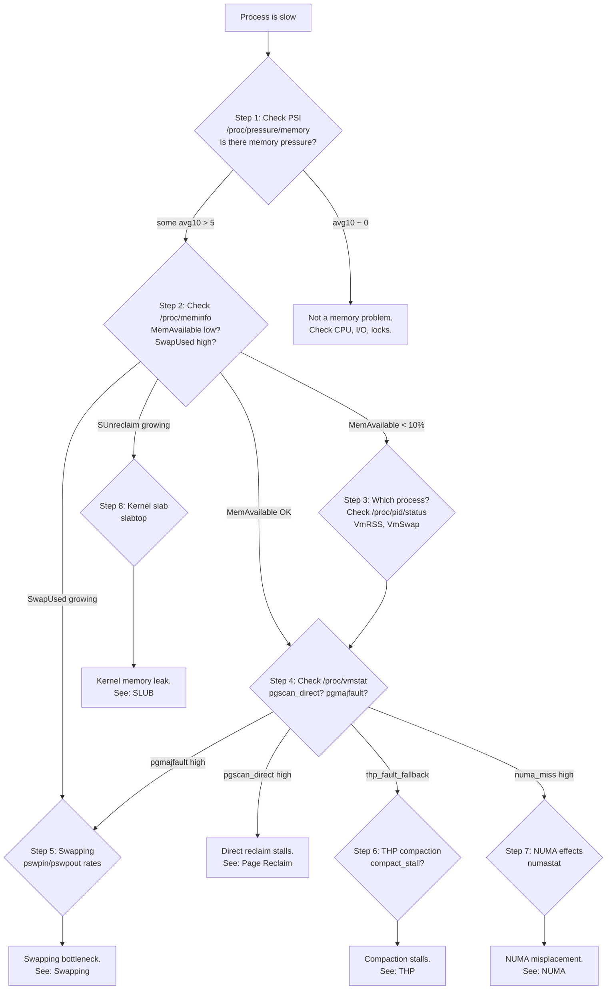

# Why is my process slow? (memory diagnosis)

> A systematic troubleshooting guide for memory-related performance problems

## The problem

Your process is slow, and you suspect memory. But "memory problem" is vague -- it could be swapping, reclaim pressure, NUMA effects, THP compaction stalls, or kernel slab growth eating your available memory. This guide gives you a systematic flowchart so you stop guessing and start measuring.

## Decision flowchart

Start here and follow the arrows. Each step either identifies the problem or sends you deeper.



## Step 1: Is it memory at all?

Before digging into memory internals, confirm that memory pressure actually exists. Since Linux 4.20 ([commit 0e94682b73bf](https://git.kernel.org/linus/0e94682b73bf)), PSI (Pressure Stall Information) tells you directly whether tasks are stalling on memory.

```bash
cat /proc/pressure/memory
# some avg10=3.42 avg60=1.09 avg300=0.37 total=123456789
# full avg10=0.12 avg60=0.04 avg300=0.01 total=12345678
```

**What the numbers mean:**

| Metric | Meaning |
|--------|---------|
| `some` | Percentage of time *at least one* task is stalled on memory |
| `full` | Percentage of time *all* tasks are stalled (nothing productive happening) |
| `avg10` | 10-second moving average |
| `avg60` / `avg300` | 60-second and 5-minute averages |

**How to interpret:**

- `some avg10 = 0`: No memory pressure. Your slowness is elsewhere -- check CPU (`/proc/pressure/cpu`), I/O (`/proc/pressure/io`), or application-level contention.
- `some avg10 > 5`: Meaningful memory pressure. Continue to Step 2.
- `full avg10 > 1`: Severe. The entire system is stalling on memory.

PSI is implemented in [`kernel/sched/psi.c`](https://git.kernel.org/pub/scm/linux/kernel/git/torvalds/linux.git/tree/kernel/sched/psi.c). It tracks stall states per task and aggregates them into time-weighted averages. Facebook developed PSI because load average and `MemAvailable` alone were not sufficient -- they needed to know *if anyone was actually waiting* for memory. See the LWN coverage: [Tracking pressure-stall information](https://lwn.net/Articles/759658/).

!!! tip "Why PSI first?"
    Traditional metrics like `MemAvailable` tell you about *supply*. PSI tells you about *impact*. A system can have low available memory and still perform fine if the working set fits in the remaining pages. Conversely, a system with "enough" free memory can still stall if reclaim is thrashing.

## Step 2: Check /proc/meminfo

Once PSI confirms memory pressure, understand where the memory is going.

```bash
grep -E '^(MemTotal|MemFree|MemAvailable|Buffers|Cached|SwapTotal|SwapFree|SReclaimable|SUnreclaim|Active|Inactive)' /proc/meminfo
```

**Key fields:**

| Field | What it tells you |
|-------|-------------------|
| `MemAvailable` | How much memory is available for new allocations without swapping. This is *not* `MemFree` -- it includes reclaimable page cache and slab. Added in kernel 3.14 ([commit 34e431b0ae39](https://git.kernel.org/linus/34e431b0ae39)). |
| `SwapTotal - SwapFree` | How much swap is in use. If this is large and growing, you are actively swapping. |
| `Cached` | Page cache size. Large `Cached` is normal and healthy -- it means the kernel is caching file data. |
| `SReclaimable` | Slab memory the kernel can free under pressure (dentry cache, inode cache). |
| `SUnreclaim` | Slab memory the kernel *cannot* free. If this is large and growing, suspect a kernel memory leak. |

**How to interpret:**

```bash
# Quick health check: what percentage of memory is available?
awk '/MemTotal/{t=$2} /MemAvailable/{a=$2} END{printf "Available: %.1f%%\n", a/t*100}' /proc/meminfo
```

- **MemAvailable < 10% of MemTotal**: System is under pressure. The kernel is likely reclaiming or swapping.
- **Large Cached but low MemAvailable**: The page cache is being used and is reclaimable, but even after reclaiming it there would not be enough. Processes are using too much anonymous memory.
- **SwapTotal - SwapFree > 0 and growing**: Active swapping. Jump to Step 5.
- **SUnreclaim growing over time**: Kernel slab leak. Jump to Step 8.

The `MemAvailable` estimate is calculated in [`mm/show_mem.c`](https://git.kernel.org/pub/scm/linux/kernel/git/torvalds/linux.git/tree/mm/show_mem.c) (via `si_mem_available()`). It accounts for the zone watermarks, reclaimable page cache, and reclaimable slab.

## Step 3: Check per-process memory

Now find which process is the culprit.

```bash
# Top memory consumers by RSS
ps aux --sort=-%mem | head -20

# For a specific process, get detailed breakdown
grep -E '^(VmSize|VmRSS|VmSwap|RssAnon|RssFile|RssShmem)' /proc/<pid>/status
```

**Key fields in `/proc/<pid>/status`:**

| Field | Meaning |
|-------|---------|
| `VmRSS` | Resident Set Size -- physical memory currently used by this process |
| `VmSwap` | How much of this process has been swapped out |
| `RssAnon` | Anonymous pages (heap, stack) -- these can only go to swap |
| `RssFile` | File-backed pages -- can be dropped and re-read |
| `RssShmem` | Shared memory and tmpfs pages |

For a more detailed per-mapping breakdown:

```bash
# Aggregated summary (fast, available since kernel 4.14)
cat /proc/<pid>/smaps_rollup
```

The `smaps_rollup` file ([commit 493b0e9d945f](https://git.kernel.org/linus/493b0e9d945f)) gives you totals across all VMAs without the overhead of reading the full `smaps` file. Key fields to watch:

| Field | Meaning |
|-------|---------|
| `Pss` | Proportional Set Size -- accounts for shared pages by dividing by number of sharers |
| `Swap` | Total swapped pages across all VMAs |
| `Referenced` | Pages accessed since last clear -- indicates working set size |

!!! note "PSS vs RSS"
    `RSS` double-counts shared pages. If two processes share a 100MB library, both show 100MB in RSS. `PSS` divides shared pages proportionally, so each shows ~50MB. For capacity planning, `PSS` is more accurate. For "is this process the problem?", `RSS` is usually enough.

## Step 4: Check /proc/vmstat for reclaim activity

This is where you identify *what the kernel is doing* about memory pressure.

```bash
# Snapshot key counters
grep -E '^(pgscan_direct|pgscan_kswapd|pgsteal_direct|pgsteal_kswapd|allocstall|pgmajfault|pgfault)' /proc/vmstat
```

These are cumulative counters. Take two snapshots and compare:

```bash
# Watch the rate of change
watch -d -n1 'grep -E "pgscan_direct|allocstall|pgmajfault" /proc/vmstat'
```

**Key counters:**

| Counter | What it means | Why it matters |
|---------|---------------|----------------|
| `pgscan_direct` | Pages scanned by direct reclaim | Process is blocking to free memory. This is the latency killer. |
| `pgscan_kswapd` | Pages scanned by kswapd | Background reclaim -- less harmful but indicates pressure. |
| `pgsteal_direct` / `pgsteal_kswapd` | Pages actually freed | Compare with `pgscan` to get reclaim efficiency. Low steal/scan ratio means the kernel is scanning many pages but few are reclaimable. |
| `allocstall` | Number of direct reclaim events | Each one means a process blocked waiting for memory. |
| `pgmajfault` | Major page faults (required disk I/O) | If high, pages are being faulted in from swap or disk. |
| `pgfault` | All page faults (minor + major) | Minor faults are normal. Focus on major faults. |

**How to interpret:**

- **`pgscan_direct` growing**: Direct reclaim is happening. Processes are stalling. See [Page Reclaim](reclaim.md) for the full reclaim path.
- **`allocstall` increasing**: Each increment means at least one allocation had to wait for reclaim. High rates (>10/sec) will cause visible latency.
- **`pgmajfault` high**: Pages are being read from swap or disk. If the process is faulting on anonymous pages, it is thrashing swap.
- **High `pgscan_direct` but low `pgsteal_direct`**: Reclaim is inefficient. The kernel is scanning pages but cannot free them -- they are all in active use. This is the worst case: high CPU overhead with no benefit.

These counters are maintained in [`mm/vmscan.c`](https://git.kernel.org/pub/scm/linux/kernel/git/torvalds/linux.git/tree/mm/vmscan.c). Direct reclaim happens in `__alloc_pages_direct_reclaim()` within [`mm/page_alloc.c`](https://git.kernel.org/pub/scm/linux/kernel/git/torvalds/linux.git/tree/mm/page_alloc.c).

## Step 5: Is it swapping?

Swapping is often the first suspect when a process is slow, and it is usually correct -- swap I/O is orders of magnitude slower than memory access.

```bash
# Current swap activity rates
vmstat 1 5
# Look at 'si' (swap in) and 'so' (swap out) columns

# Or from /proc/vmstat (cumulative pages)
grep -E '^(pswpin|pswpout)' /proc/vmstat
```

```bash
# Which processes are swapped?
for pid in /proc/[0-9]*; do
    swap=$(grep VmSwap "$pid/status" 2>/dev/null | awk '{print $2}')
    name=$(cat "$pid/comm" 2>/dev/null)
    if [ -n "$swap" ] && [ "$swap" -gt 0 ] 2>/dev/null; then
        echo "$swap kB $name (pid $(basename $pid))"
    fi
done | sort -rn | head -20
```

**How to interpret:**

- **`pswpout` growing, `pswpin` stable**: The kernel is evicting pages to swap. Processes are losing resident pages.
- **`pswpin` growing**: Processes are faulting pages back from swap -- this means swapped-out pages are still being accessed. Each swap-in is a disk I/O that blocks the faulting process.
- **Both high**: Active thrashing. The working set does not fit in memory and the kernel is churning pages between RAM and swap.
- **Per-process `VmSwap` large**: That specific process has been victimized by reclaim.

**Common causes and fixes:**

| Cause | Evidence | Fix |
|-------|----------|-----|
| Working set exceeds RAM | All processes have VmSwap > 0 | Add RAM or reduce workload |
| One process leaked memory | One process has huge VmRSS + VmSwap | Fix the application |
| Swappiness too high | `pswpout` high even with MemAvailable | Tune `vm.swappiness` (see [Swap](swap.md)) |

For the full lifecycle of a swapped page, see [What happens during swapping](swapping.md).

## Step 6: Is it THP compaction?

Transparent Huge Pages can cause surprise latency spikes. When a process faults on memory and the kernel tries to allocate a 2MB huge page, it may stall to compact memory.

```bash
grep -E '^(thp_fault_alloc|thp_fault_fallback|thp_collapse_alloc|thp_collapse_alloc_failed|compact_stall|compact_success|compact_fail)' /proc/vmstat
```

**Key counters:**

| Counter | Meaning |
|---------|---------|
| `thp_fault_alloc` | Successful THP allocations on page fault |
| `thp_fault_fallback` | THP allocation failed, fell back to 4KB pages |
| `compact_stall` | Number of times a process stalled waiting for compaction |
| `compact_fail` | Compaction attempted but failed to create a huge page |

**How to interpret:**

- **`compact_stall` growing rapidly**: Processes are blocking while the kernel rearranges pages. Each stall can be milliseconds to tens of milliseconds.
- **`thp_fault_fallback` >> `thp_fault_alloc`**: Memory is too fragmented for huge pages. The kernel keeps trying and failing.
- **`compact_fail` high**: Compaction is running but not helping. The kernel is doing expensive page migration for nothing.

**Mitigations:**

```bash
# Option 1: Switch THP to madvise-only (no automatic THP on faults)
echo madvise > /sys/kernel/mm/transparent_hugepage/enabled

# Option 2: Disable THP compaction on fault (still allow khugepaged)
echo never > /sys/kernel/mm/transparent_hugepage/defrag
```

The compaction code lives in [`mm/compaction.c`](https://git.kernel.org/pub/scm/linux/kernel/git/torvalds/linux.git/tree/mm/compaction.c). The `defrag` knob controls whether the kernel stalls on allocation to attempt compaction, defers it to `khugepaged`, or skips it entirely. See the LWN article [Proactive compaction](https://lwn.net/Articles/817905/) for background on how compaction has evolved.

For the full THP picture, see [Transparent Huge Pages](thp.md).

## Step 7: Is it NUMA effects?

On multi-socket systems, memory access latency depends on which node the memory lives on. A process running on node 0 accessing memory on node 1 pays a 30-50% latency penalty on each access.

```bash
# System-wide NUMA statistics
numastat

# Per-process NUMA allocation
numastat -p <pid>

# From /proc/vmstat
grep -E '^numa_' /proc/vmstat
```

**Key counters:**

| Counter | Meaning |
|---------|---------|
| `numa_hit` | Allocation satisfied from the preferred/local node |
| `numa_miss` | Allocation went to a non-preferred node |
| `numa_foreign` | This node was preferred but allocation went elsewhere |
| `numa_interleave` | Allocation via interleave policy (intentional) |

**How to interpret:**

- **`numa_miss / (numa_hit + numa_miss)` > 10%**: Significant remote memory access. The process's memory is spread across nodes.
- **`numastat -p <pid>` shows memory on non-local nodes**: The process's working set is not on the node where it is running.

**Common causes:**

| Cause | Evidence | Fix |
|-------|----------|-----|
| Process migrated between nodes | Memory on old node, CPU on new | Pin with `numactl --cpunodebind=N --membind=N` |
| Memory interleaved by default | Even spread across nodes | Use `numactl --localalloc` or `--membind` |
| Allocation overflow | Local node was full | Add memory or balance workload across nodes |

The kernel's NUMA allocation policy is implemented in [`mm/mempolicy.c`](https://git.kernel.org/pub/scm/linux/kernel/git/torvalds/linux.git/tree/mm/mempolicy.c). AutoNUMA (automatic NUMA balancing) was added in kernel 3.8 ([commit 217db1ef6c47](https://git.kernel.org/linus/217db1ef6c47)) and periodically scans pages to migrate them closer to the accessing CPU. See LWN: [AutoNUMA: the other approach to NUMA scheduling](https://lwn.net/Articles/488709/).

For the full NUMA story, see [NUMA Memory Management](numa.md).

## Step 8: Is it a kernel memory issue?

Sometimes the problem is not user-space memory at all -- the kernel itself is consuming memory through slab caches.

```bash
# Watch SUnreclaim over time
watch -n5 'grep SUnreclaim /proc/meminfo'

# See which slab caches are largest
sudo slabtop -o -s c | head -20

# Detailed per-cache stats
cat /proc/slabinfo | head -5
```

**Key indicators:**

- **`SUnreclaim` in `/proc/meminfo` growing over time**: Kernel objects are accumulating and cannot be freed.
- **`SReclaimable` is large but not being reclaimed**: The kernel has not been under enough pressure to shrink dentry/inode caches. This is usually benign.

**Common offenders:**

| Cache | What it is | Why it grows |
|-------|-----------|--------------|
| `dentry` | Directory entry cache | Many files accessed, deep directory trees |
| `inode_cache` | Inode metadata cache | Same as dentry |
| `kmalloc-*` | General-purpose allocations | Possible kernel memory leak |
| `sock_inode_cache` | Socket structures | Many network connections |

```bash
# Force the kernel to reclaim slab caches (drops page cache + slab)
echo 3 > /proc/sys/vm/drop_caches
# WARNING: This drops page cache too, which can cause a temporary I/O spike.
# Use echo 2 to drop slab only (dentries + inodes).
```

!!! warning "drop_caches is for diagnosis, not production"
    If you need to regularly drop caches to keep a system healthy, you have a leak or a sizing problem. Fix the root cause.

The slab allocator is implemented in [`mm/slub.c`](https://git.kernel.org/pub/scm/linux/kernel/git/torvalds/linux.git/tree/mm/slub.c). Slab shrinking during reclaim is handled by shrinker callbacks registered via [`register_shrinker()`](https://git.kernel.org/pub/scm/linux/kernel/git/torvalds/linux.git/tree/mm/shrinker.c). See the LWN article [The slab and protected memory allocations](https://lwn.net/Articles/753154/) for background.

For the full slab story, see [Slab Allocator (SLUB)](slab.md).

## Try It Yourself

Run this all-in-one diagnostic script to get a snapshot of your system's memory health:

```bash
#!/bin/bash
# memory-diag.sh -- Quick memory health snapshot

echo "=== PSI (Pressure Stall Information) ==="
if [ -f /proc/pressure/memory ]; then
    cat /proc/pressure/memory
else
    echo "PSI not available (kernel < 4.20 or CONFIG_PSI=n)"
fi

echo ""
echo "=== Memory Overview ==="
grep -E '^(MemTotal|MemAvailable|SwapTotal|SwapFree|SReclaimable|SUnreclaim)' /proc/meminfo

echo ""
echo "=== Top 10 Processes by RSS ==="
ps aux --sort=-%mem | head -11

echo ""
echo "=== Reclaim Activity (rates need two samples to compare) ==="
grep -E '^(pgscan_direct|pgscan_kswapd|allocstall|pgmajfault|pswpin|pswpout)' /proc/vmstat

echo ""
echo "=== THP / Compaction ==="
grep -E '^(thp_fault_alloc|thp_fault_fallback|compact_stall|compact_fail)' /proc/vmstat

echo ""
echo "=== NUMA (if applicable) ==="
grep -E '^numa_' /proc/vmstat 2>/dev/null || echo "No NUMA counters"

echo ""
echo "=== Top 10 Processes with Swap ==="
for pid in /proc/[0-9]*; do
    swap=$(grep VmSwap "$pid/status" 2>/dev/null | awk '{print $2}')
    name=$(cat "$pid/comm" 2>/dev/null)
    if [ -n "$swap" ] && [ "$swap" -gt 0 ] 2>/dev/null; then
        echo "$swap kB $name (pid $(basename $pid))"
    fi
done | sort -rn | head -10
```

For continuous monitoring, combine PSI with `vmstat`:

```bash
# Terminal 1: Watch PSI
watch -n1 cat /proc/pressure/memory

# Terminal 2: Watch vmstat (si/so = swap in/out, free = free pages)
vmstat 1

# Terminal 3: Watch reclaim counters
watch -d -n1 'grep -E "pgscan_direct|allocstall|compact_stall" /proc/vmstat'
```

## Quick reference: which metric points where

| Symptom | Key metric | Likely cause | Deep-dive doc |
|---------|-----------|--------------|---------------|
| PSI `some` > 0, MemAvailable low | `/proc/meminfo` | System-wide memory shortage | [Page Reclaim](reclaim.md) |
| `allocstall` increasing | `/proc/vmstat` | Direct reclaim stalls | [Page Reclaim](reclaim.md) |
| `pswpin` / `pswpout` high | `/proc/vmstat`, `vmstat` | Active swapping | [Swapping](swapping.md) |
| `pgmajfault` high | `/proc/vmstat` | Pages faulted from disk/swap | [Swapping](swapping.md) |
| `compact_stall` high | `/proc/vmstat` | THP compaction latency | [THP](thp.md), [Compaction](compaction.md) |
| `numa_miss` high | `/proc/vmstat` | Remote NUMA access | [NUMA](numa.md) |
| `SUnreclaim` growing | `/proc/meminfo` | Kernel slab leak | [SLUB](slab.md) |
| Large `VmSwap` on one process | `/proc/<pid>/status` | Process swapped out | [Swapping](swapping.md) |

## Kernel source reference

| File | What it contains |
|------|-----------------|
| [`kernel/sched/psi.c`](https://git.kernel.org/pub/scm/linux/kernel/git/torvalds/linux.git/tree/kernel/sched/psi.c) | PSI tracking and averaging |
| [`mm/vmscan.c`](https://git.kernel.org/pub/scm/linux/kernel/git/torvalds/linux.git/tree/mm/vmscan.c) | Page reclaim, direct reclaim, kswapd |
| [`mm/page_alloc.c`](https://git.kernel.org/pub/scm/linux/kernel/git/torvalds/linux.git/tree/mm/page_alloc.c) | Page allocator, watermarks, alloc stalls |
| [`mm/compaction.c`](https://git.kernel.org/pub/scm/linux/kernel/git/torvalds/linux.git/tree/mm/compaction.c) | Memory compaction for huge pages |
| [`mm/mempolicy.c`](https://git.kernel.org/pub/scm/linux/kernel/git/torvalds/linux.git/tree/mm/mempolicy.c) | NUMA memory policy |
| [`mm/slub.c`](https://git.kernel.org/pub/scm/linux/kernel/git/torvalds/linux.git/tree/mm/slub.c) | SLUB slab allocator |
| [`fs/proc/meminfo.c`](https://git.kernel.org/pub/scm/linux/kernel/git/torvalds/linux.git/tree/fs/proc/meminfo.c) | /proc/meminfo implementation |
| [`fs/proc/array.c`](https://git.kernel.org/pub/scm/linux/kernel/git/torvalds/linux.git/tree/fs/proc/array.c) | /proc/pid/status implementation |

## Further reading

- [LWN: Tracking pressure-stall information](https://lwn.net/Articles/759658/) -- The original PSI proposal from Facebook
- [LWN: The state of the page in 2023](https://lwn.net/Articles/943128/) -- Modern page reclaim overview
- [LWN: AutoNUMA: the other approach to NUMA scheduling](https://lwn.net/Articles/488709/) -- NUMA balancing design
- [LWN: Proactive compaction](https://lwn.net/Articles/817905/) -- THP compaction improvements
- [Kernel docs: PSI](https://docs.kernel.org/accounting/psi.html) -- Official PSI documentation
- [Brendan Gregg: Linux Performance](https://www.brendangregg.com/linuxperf.html) -- Broader performance methodology
