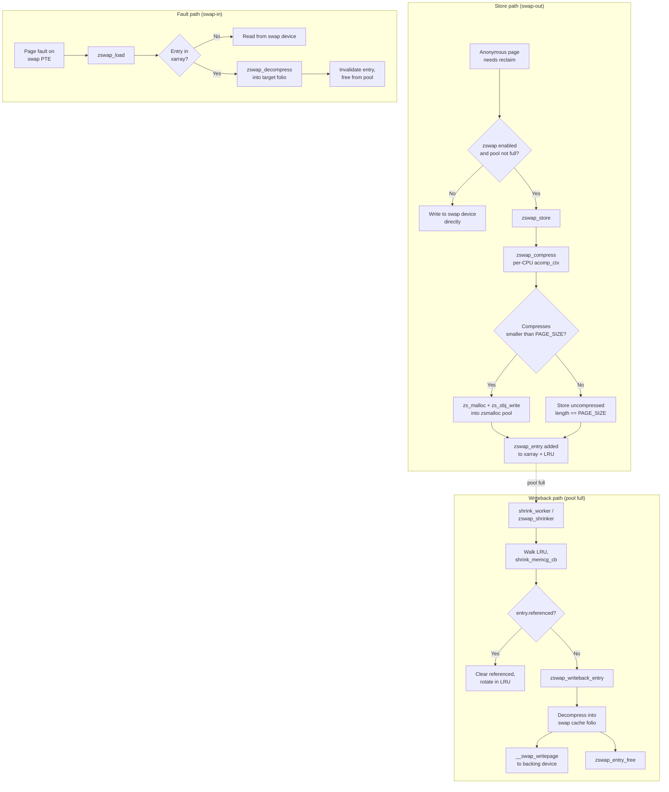
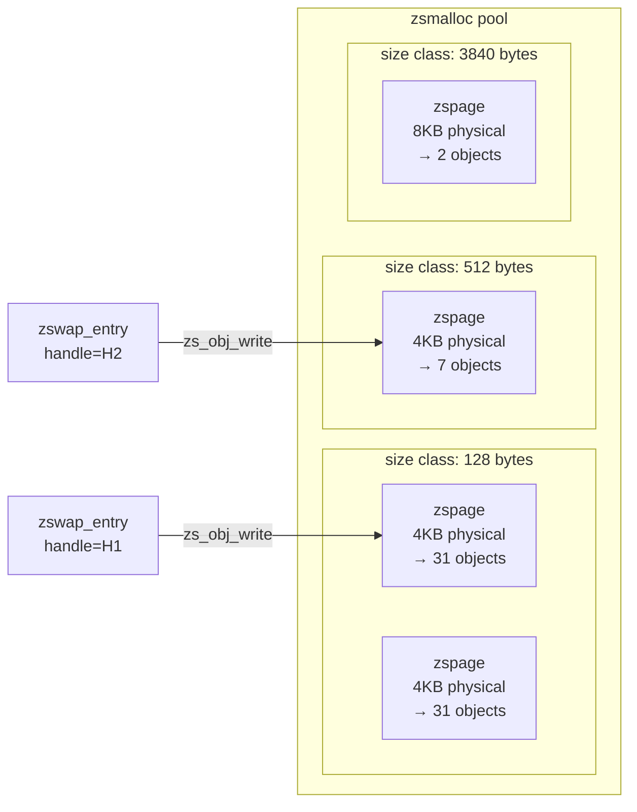
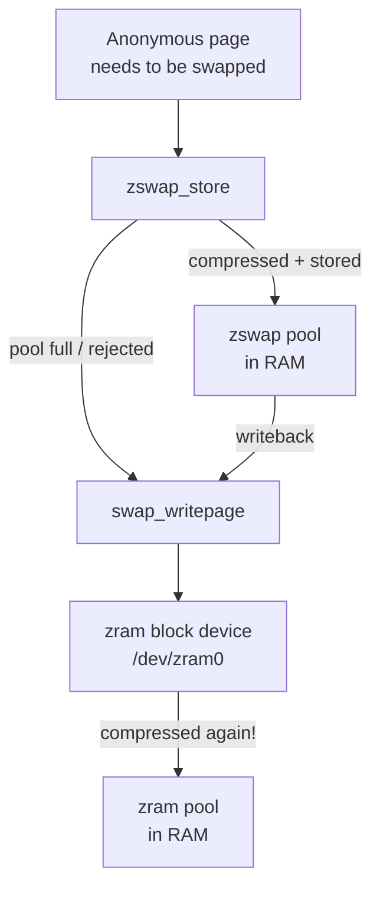

# zswap Internals: Compressed Swap Cache

> A compressed RAM cache that intercepts pages on their way to the swap device — trading CPU cycles for I/O reduction

## What zswap Is (and Is Not)

zswap is a **write-back compressed cache** that sits in front of the swap device. When the kernel decides to swap out an anonymous page, zswap intercepts it, compresses it, and stores the compressed data in a RAM-based pool. If the compressed pool fills up, zswap evicts the coldest entries back to the backing swap device.

The key insight: reading from compressed RAM is orders of magnitude faster than a disk or even SSD read. zswap trades CPU cycles for I/O reduction, which is usually a favorable trade.

!!! note "zswap vs zram — they are not the same thing"
    These two are frequently confused:

    - **zswap**: A compressed *cache* in front of any swap device. It does not appear as a block device. The backing swap device (disk, SSD, or even a zram device) still exists.
    - **zram**: A compressed *block device* that acts as the swap device itself. It replaces the swap device entirely in memory.

    You can stack them: use zram as the swap device and zswap in front of it. However, this means pages get compressed twice — once by zswap and once by zram — which wastes CPU with minimal additional benefit. See [Interaction with zram](#interaction-with-zram).

## Architecture Overview



!!! info "Frontswap is gone"
    Prior to Linux 6.x, zswap hooked into the kernel via the **frontswap** interface (`frontswap_store`, `frontswap_load`, etc.). That interface was removed. zswap now integrates directly: `zswap_store()` and `zswap_load()` are called explicitly from the swap writeback and swapin code paths. The entry points are declared in `include/linux/zswap.h`.

## Key Data Structures

### `struct zswap_pool`

```c
struct zswap_pool {
    struct zs_pool *zs_pool;              /* zsmalloc pool for compressed data */
    struct crypto_acomp_ctx __percpu *acomp_ctx; /* per-CPU compression contexts */
    struct percpu_ref ref;                /* reference count */
    struct list_head list;               /* entry in global zswap_pools list */
    struct work_struct release_work;
    struct hlist_node node;              /* for cpuhp callback */
    char tfm_name[CRYPTO_MAX_ALG_NAME]; /* compressor name */
};
```

Each pool is tied to a single compression algorithm. When you change the compressor at runtime, a new pool is created. The old pool lives on until all its entries are evicted or loaded, then it is destroyed via `zswap_pool_destroy()`.

### `struct zswap_entry`

```c
struct zswap_entry {
    swp_entry_t swpentry;    /* swap type + offset — the lookup key */
    unsigned int length;     /* compressed size in bytes;
                                == PAGE_SIZE means incompressible */
    bool referenced;         /* second-chance bit for LRU writeback */
    struct zswap_pool *pool; /* owning pool */
    unsigned long handle;    /* zsmalloc allocation handle */
    struct obj_cgroup *objcg;/* cgroup charge */
    struct list_head lru;    /* position in global zswap_list_lru */
};
```

Each compressed page stored in zswap has one `zswap_entry`. Entries are stored in per-swap-type xarrays, sharded into 64 MiB regions:

```c
#define ZSWAP_ADDRESS_SPACE_SHIFT  14   /* 2^14 = 16384 pages = 64 MiB */
static struct xarray *zswap_trees[MAX_SWAPFILES];
```

The `swap_zswap_tree()` helper maps a `swp_entry_t` to the right xarray shard.

### `struct crypto_acomp_ctx`

```c
struct crypto_acomp_ctx {
    struct crypto_acomp *acomp; /* async compression transform */
    struct acomp_req    *req;   /* pre-allocated request */
    struct crypto_wait   wait;  /* completion wait */
    u8                  *buffer;/* PAGE_SIZE scratch buffer */
    struct mutex         mutex; /* one operation at a time per CPU */
};
```

One context per CPU per pool. `acomp_ctx_get_cpu_lock()` acquires the mutex for the current CPU's context; `acomp_ctx_put_unlock()` releases it.

## The Compression Pipeline

### Store Path: `zswap_store()`

When the MM subsystem wants to swap out a folio, it calls `zswap_store(struct folio *folio)`:

```
zswap_store(folio)
  ├── Check zswap_enabled
  ├── obj_cgroup_may_zswap()  ← cgroup zswap.max limit
  ├── zswap_check_limits()    ← global max_pool_percent limit
  ├── zswap_pool_current_get() ← RCU-safe ref on current pool
  └── for each page in folio:
        zswap_store_page(page, objcg, pool)
          ├── zswap_entry_cache_alloc()  ← kmem_cache alloc
          ├── zswap_compress(page, entry, pool)
          │     ├── acomp_ctx_get_cpu_lock()
          │     ├── crypto_acomp_compress() + crypto_wait_req()
          │     ├── if dlen >= PAGE_SIZE and writeback enabled:
          │     │       store uncompressed (dlen = PAGE_SIZE)
          │     └── zs_malloc() + zs_obj_write()
          ├── xa_store() into swap xarray
          └── zswap_lru_add()  ← entry.referenced = true
```

If the store fails for any reason (pool full, allocation failure, compression error), any previously stored entry for that swap slot is invalidated via `xa_erase()` + `zswap_entry_free()`. This prevents stale compressed data from being written over by a new version of the page.

### Compression: `zswap_compress()`

zswap uses the kernel's **async compression API** (`crypto/acompress.h`):

1. The input scatter-gather list is set to the source page.
2. `crypto_acomp_compress()` is called — despite the async API, zswap waits synchronously via `crypto_wait_req()`.
3. If `dlen >= PAGE_SIZE` (incompressible) and writeback is permitted for this cgroup, the page is stored **uncompressed** (`entry->length == PAGE_SIZE`). This preserves LRU ordering so cold incompressible pages can still be written back.
4. `zs_malloc()` allocates space in the zsmalloc pool; `zs_obj_write()` writes the compressed bytes.

!!! note "Incompressible pages"
    When a page cannot be compressed below PAGE_SIZE, zswap stores the raw content using `kmap_local_page()` and copies it directly. The entry is tracked as incompressible via `zswap_stored_incompressible_pages`. This counter is exposed in debugfs.

    If writeback is disabled for the cgroup (`memory.zswap.writeback=0`), incompressible pages are **rejected** outright — there is no point storing an uncompressible page if it can never be evicted.

### Decompression: `zswap_decompress()`

Called from both `zswap_load()` (fault path) and `zswap_writeback_entry()` (writeback path):

```c
zs_obj_read_sg_begin()   // map zsmalloc object as scatter-gather
if entry->length == PAGE_SIZE:
    memcpy_from_sglist()  // incompressible: straight copy
else:
    crypto_acomp_decompress() + crypto_wait_req()
zs_obj_read_sg_end()
```

zsmalloc objects can span page boundaries, so the input is always a scatter-gather list of 1–2 entries.

### Load Path: `zswap_load()`

On a page fault, swapin code calls `zswap_load(struct folio *folio)`:

1. Look up `swp_entry_t` in the xarray → get `zswap_entry`.
2. Call `zswap_decompress()` into the fault's target folio.
3. If loading into the swap cache (the common case), **invalidate** the zswap entry immediately — the swap cache becomes the authoritative owner.
4. Mark the folio up-to-date and unlock it.

!!! warning "Large folio limitation"
    `zswap_load()` explicitly rejects large folios with `WARN_ON_ONCE(folio_test_large(folio))` and returns `-EINVAL`. Large folios may be only partially stored in zswap (each constituent page independently), and the load path does not handle this case. The result is a `SIGBUS` from `do_swap_page()`.

## Pool Backend: zsmalloc

In current kernels, zswap **exclusively** uses **zsmalloc** as its memory allocator. The older backends (zbud, z3fold) are no longer used by zswap.

`CONFIG_ZSWAP` selects `CONFIG_ZSMALLOC` automatically.

### How zsmalloc Works

zsmalloc is a variable-size slab allocator designed for compressed page storage. Its key properties:

| Property | Detail |
|----------|--------|
| Allocation granularity | 8-byte aligned size classes from ~32 bytes to PAGE_SIZE |
| Internal structure | Groups of physical pages called **zspages** |
| Addressing | Objects are not directly addressable — accessed via opaque `handle` |
| Fragmentation control | Pages grouped by fullness ratio (0%, 10%, …, 99%, 100%) |
| Maximum pages per zspage | Configurable via `CONFIG_ZSMALLOC_CHAIN_SIZE` |

Because zsmalloc objects are not directly addressable, `zs_obj_write()` and `zs_obj_read_sg_begin()` handle the mapping and scatter-gather setup internally.



The high object density of zsmalloc (especially for small compressed outputs) is why it replaced zbud (2 pages per physical page) and z3fold (up to 3 pages per physical page) — workloads with good compression ratios benefit enormously.

## Pool Management and Writeback

### Global Pool Size Limit

```c
static unsigned int zswap_max_pool_percent = 20;
```

The pool is limited to `totalram_pages() * zswap_max_pool_percent / 100` physical pages of compressed storage. `zswap_check_limits()` is called on every store:

```c
static bool zswap_check_limits(void)
{
    unsigned long cur_pages = zswap_total_pages();
    unsigned long max_pages = zswap_max_pages();

    if (cur_pages >= max_pages) {
        zswap_pool_limit_hit++;
        zswap_pool_reached_full = true;
    } else if (zswap_pool_reached_full &&
               cur_pages <= zswap_accept_thr_pages()) {
        zswap_pool_reached_full = false;
    }
    return zswap_pool_reached_full;
}
```

When the pool hits the limit, `zswap_pool_reached_full = true`. New stores are rejected until the pool drains back below `accept_threshold_percent` of the maximum (default 90%). This hysteresis prevents thrashing at the boundary.

When the pool is full and a store fails, `zswap_store()` queues `zswap_shrink_work` to trigger background writeback.

### The Global LRU

All `zswap_entry` objects across all pools share a single global `list_lru`:

```c
static struct list_lru zswap_list_lru;
```

The LRU is NUMA-aware and memcg-aware. Entries are added to the LRU at store time with `entry->referenced = true`.

### The Shrinker and Writeback: `shrink_worker()`

Two mechanisms trigger writeback to the backing swap device:

**1. Memory pressure shrinker** (`zswap_shrinker`):
Registered as a standard kernel shrinker (`SHRINKER_NUMA_AWARE | SHRINKER_MEMCG_AWARE`). When the memory allocator sees pressure, it calls `zswap_shrinker_scan()` → `list_lru_shrink_walk()` → `shrink_memcg_cb()` for each LRU entry.

**2. Pool-full work queue** (`shrink_worker`):
When `zswap_pool_reached_full` is set and a store fails, `shrink_worker()` is queued on the `zswap-shrink` workqueue. It iterates memcgs round-robin and calls `shrink_memcg()` on each, continuing until the pool drains below `zswap_accept_thr_pages()`.

### Second-Chance LRU Algorithm

`shrink_memcg_cb()` implements a **second-chance** eviction policy:

```c
if (entry->referenced) {
    entry->referenced = false;
    return LRU_ROTATE;  /* give it another chance */
}
/* referenced == false: write back to swap device */
writeback_result = zswap_writeback_entry(entry, swpentry);
```

New entries start with `referenced = true`. The shrinker clears this flag on first encounter and rotates the entry to the tail. Only on the second encounter (when `referenced` is already false) does writeback happen.

### Shrinker Calibration

`zswap_shrinker_count()` scales the number of shrinkable objects by several factors to avoid over-shrinking:

1. **Compression ratio**: `mult_frac(nr_freeable, nr_backing, nr_stored)` — if the pool compresses 4:1, fewer physical pages are freed per writeback, so fewer candidates are reported.
2. **Disk swapin penalty**: `nr_disk_swapins` (tracked in `zswap_lruvec_state.nr_disk_swapins`) is subtracted from `nr_freeable`. If we observe swapins from disk, it means we previously over-evicted from zswap, so we slow down.

### `zswap_writeback_entry()`

The writeback of a single entry:

```
zswap_writeback_entry(entry, swpentry)
  ├── swap_cache_alloc_folio()    ← allocate folio in swap cache
  ├── xa_load() to verify entry is still valid
  ├── zswap_decompress(entry, folio)
  ├── xa_erase() from xarray
  ├── zswap_entry_free()         ← free from pool
  ├── folio_mark_uptodate()
  └── __swap_writepage()         ← issue write to backing swap device
```

If a concurrent swapin allocated the folio first (`!folio_was_allocated`), writeback is skipped — the page just became hot, so evicting it would be wrong.

## Same-Filled Page Detection

!!! info "Note on this kernel version"
    The upstream kernel documentation for older versions describes a same-value-filled (zero page) optimization where pages are checked for uniform content before compression, and only the fill pattern is stored. However, searching the current `mm/zswap.c` source reveals that this optimization **is not present in this version** of the code. There is no `page_same_filled()` call or similar logic in `zswap_store_page()` or `zswap_compress()`. Incompressible pages are handled (stored uncompressed at full PAGE_SIZE when writeback is enabled), but there is no separate path for same-value detection.

    The `stored_incompressible_pages` debugfs counter tracks pages stored at full size.

## Per-Cgroup Limits

Three cgroup v2 files control zswap per cgroup:

| File | Description |
|------|-------------|
| `memory.zswap.max` | Maximum bytes of compressed memory this cgroup can use in zswap. Default: `max` (unlimited). |
| `memory.zswap.current` | Read-only: current bytes used in zswap by this cgroup. |
| `memory.zswap.writeback` | Whether pages can be written back from zswap to the swap device. `0` disables writeback for this cgroup. Default: `1`. |

`obj_cgroup_may_zswap()` checks `memory.zswap.max` before each store. If the cgroup is over its limit, `zswap_store()` first tries to shrink this cgroup's pages via `shrink_memcg()`. If shrinking fails, the store is rejected and the folio goes directly to the swap device.

```bash
# Limit a cgroup to 512 MiB of zswap usage
echo 536870912 > /sys/fs/cgroup/myapp/memory.zswap.max

# Disable zswap writeback for a cgroup (pages stay in zswap or are rejected)
echo 0 > /sys/fs/cgroup/myapp/memory.zswap.writeback
```

!!! warning "writeback=0 and incompressible pages"
    If `memory.zswap.writeback=0` and a page is incompressible, zswap **rejects the store entirely** (returns `false` from `zswap_compress()`). The page then falls through to the swap device. This can cause a feedback loop: the same incompressible page may be rejected repeatedly by zswap and keep triggering swap I/O.

## Sysfs Tunables

All tunables live under `/sys/module/zswap/parameters/`:

| Parameter | Default | Description |
|-----------|---------|-------------|
| `enabled` | `CONFIG_ZSWAP_DEFAULT_ON` | Enable/disable zswap at runtime. Disabling stops new stores but does not flush existing entries. |
| `compressor` | `CONFIG_ZSWAP_COMPRESSOR_DEFAULT` (lzo) | Compression algorithm. Changing creates a new pool; old pools drain and are freed. |
| `max_pool_percent` | `20` | Maximum percentage of total RAM the compressed pool may occupy. |
| `accept_threshold_percent` | `90` | After hitting `max_pool_percent`, resume accepting pages only when pool drops to this percentage of max. Setting to `100` disables hysteresis. |
| `shrinker_enabled` | `CONFIG_ZSWAP_SHRINKER_DEFAULT_ON` (off) | Enable the memory-pressure-driven shrinker. When off, writeback only happens when the pool is full. |

```bash
# Enable zswap at runtime
echo 1 > /sys/module/zswap/parameters/enabled

# Switch compressor to zstd (creates a new pool; old entries remain in lzo pool)
echo zstd > /sys/module/zswap/parameters/compressor

# Increase pool limit to 30% of RAM
echo 30 > /sys/module/zswap/parameters/max_pool_percent

# Enable the memory pressure shrinker
echo Y > /sys/module/zswap/parameters/shrinker_enabled

# Reduce hysteresis — resume accepting when pool is at 70% of max
echo 70 > /sys/module/zswap/parameters/accept_threshold_percent
```

Alternatively, set these at boot time:

```
zswap.enabled=1 zswap.compressor=zstd zswap.max_pool_percent=25
```

## Kconfig Options

| Option | Description |
|--------|-------------|
| `CONFIG_ZSWAP` | Enable zswap support. Automatically selects `CONFIG_ZSMALLOC`. |
| `CONFIG_ZSWAP_DEFAULT_ON` | Enable zswap by default at boot. |
| `CONFIG_ZSWAP_SHRINKER_DEFAULT_ON` | Enable the memory pressure shrinker by default. |
| `CONFIG_ZSWAP_COMPRESSOR_DEFAULT_LZO` | Default compressor: LZO |
| `CONFIG_ZSWAP_COMPRESSOR_DEFAULT_LZ4` | Default compressor: LZ4 |
| `CONFIG_ZSWAP_COMPRESSOR_DEFAULT_LZ4HC` | Default compressor: LZ4HC |
| `CONFIG_ZSWAP_COMPRESSOR_DEFAULT_ZSTD` | Default compressor: zstd |
| `CONFIG_ZSWAP_COMPRESSOR_DEFAULT_DEFLATE` | Default compressor: deflate |
| `CONFIG_ZSWAP_COMPRESSOR_DEFAULT_842` | Default compressor: 842 |
| `CONFIG_ZSMALLOC` | zsmalloc allocator (required by zswap). |
| `CONFIG_ZSMALLOC_STAT` | Export per-size-class statistics for zsmalloc via debugfs. |

## Observability

### debugfs: `/sys/kernel/debug/zswap/`

All counters are read-only and approximate (not atomically consistent with each other, but individually accurate to `u64`):

| File | Description |
|------|-------------|
| `pool_total_size` | Total bytes of physical RAM consumed by all zswap pools (compressed data only). |
| `stored_pages` | Number of pages currently stored in zswap (compressed + incompressible). |
| `stored_incompressible_pages` | Pages stored at full PAGE_SIZE (could not be compressed below PAGE_SIZE). |
| `pool_limit_hit` | Times a store was rejected because the pool was at `max_pool_percent`. |
| `written_back_pages` | Pages successfully written back to the backing swap device. |
| `reject_reclaim_fail` | Store rejected: pool was full and background writeback failed. |
| `reject_alloc_fail` | Store rejected: `zs_malloc()` returned an error (pool exhausted). |
| `reject_kmemcache_fail` | Store rejected: `zswap_entry` metadata allocation failed (rare). |
| `reject_compress_fail` | Store rejected: compression algorithm returned an error. |
| `reject_compress_poor` | Store rejected: compressed output did not fit in the allocator (ENOSPC). |
| `decompress_fail` | Decompression failed during load or writeback (data corruption indicator). |

```bash
# Quick zswap health check
for f in /sys/kernel/debug/zswap/*; do
    printf "%-40s %s\n" "$(basename $f)" "$(cat $f)"
done
```

### vmstat Events

Three events are counted in `/proc/vmstat`:

| Event | Description |
|-------|-------------|
| `zswpout` | Pages stored into zswap (successful `zswap_store()`). |
| `zswpin` | Pages loaded from zswap (successful `zswap_load()`). |
| `zswpwb` | Pages written back from zswap to the swap device. |

```bash
# Watch zswap activity in real time
watch -n1 'grep -E "^zswp" /proc/vmstat'
```

### Per-Cgroup Stats

For cgroup v2, `memory.stat` includes:

| Field | Description |
|-------|-------------|
| `zswap` | Bytes of compressed memory used in zswap by this cgroup. |
| `zswapped` | Number of pages currently stored in zswap by this cgroup. |

```bash
cat /sys/fs/cgroup/myapp/memory.stat | grep zswap
```

### Estimating Compression Ratio

```bash
stored=$(cat /sys/kernel/debug/zswap/stored_pages)
pool_bytes=$(cat /sys/kernel/debug/zswap/pool_total_size)
page_size=4096

if [ "$stored" -gt 0 ]; then
    uncompressed=$((stored * page_size))
    echo "Stored pages:    $stored"
    echo "Uncompressed:    $((uncompressed / 1048576)) MiB"
    echo "Compressed:      $((pool_bytes / 1048576)) MiB"
    echo "Ratio:           $(echo "scale=2; $uncompressed / $pool_bytes" | bc):1"
fi
```

## Interaction with zram

zswap can sit in front of a zram device. The full stack looks like this:



!!! warning "Double compression"
    When zswap sits in front of zram, pages that miss the zswap pool (or get written back by the shrinker) are compressed a **second time** by zram. This means:

    - **CPU overhead is doubled** for those pages.
    - The additional compression benefit is minimal — data already compressed by zswap will not compress meaningfully again.
    - Memory saving is marginal because zswap already compressed the data.

    **Recommendation**: Use either zswap (with a real swap device) or zram, not both. If your goal is to avoid all disk I/O, zram alone is simpler and more efficient. If you have a swap device and want to reduce I/O, use zswap in front of it.

    If you must use both (e.g., the system has both a zram swap and a disk swap), consider disabling zswap for the zram swap type.

## Performance Tradeoffs

### CPU vs. Memory vs. I/O

```
Low compression ratio (data is random, already compressed):
  → zswap stores at PAGE_SIZE (incompressible)
  → Pool fills quickly (no density gain over uncompressed swap)
  → Writeback to swap device happens soon anyway
  → Net result: CPU overhead for no benefit

High compression ratio (text, code, zeroed pages):
  → 4:1 or better compression is common
  → Pool holds 4x more pages than uncompressed
  → Significant reduction in swap I/O
  → Net result: CPU overhead well justified
```

### Compressor Comparison

| Algorithm | Speed | Ratio | Best for |
|-----------|-------|-------|----------|
| `lzo` | Fastest | Moderate | Interactive desktops, latency-sensitive |
| `lz4` | Very fast | Moderate | High-throughput servers, low-overhead environments |
| `lz4hc` | Moderate | Better than lz4 | Balanced; slower compression, same decompression speed as lz4 |
| `zstd` | Moderate | Best | High memory pressure; worth the CPU cost for good ratios |
| `deflate` | Slow | Good | Legacy; generally superseded by zstd |
| `842` | Hardware-accelerated (IBM POWER) | Moderate | POWER systems with hardware offload |

!!! tip "Choosing a compressor"
    - For **latency-sensitive** workloads: `lzo` or `lz4` — fast decompression keeps fault latency low.
    - For **memory-constrained** systems where saving RAM matters most: `zstd` — highest density.
    - The default `lzo` is a safe middle ground for most use cases.

    The compressor can be changed at runtime without flushing existing entries:
    ```bash
    echo zstd > /sys/module/zswap/parameters/compressor
    ```
    Old entries remain in their old pool and are decompressed with the old algorithm until they are evicted.

### When to Enable the Shrinker

By default (`CONFIG_ZSWAP_SHRINKER_DEFAULT_ON=n`), writeback only triggers when the pool hits `max_pool_percent`. This means cold pages can accumulate in the pool indefinitely until the limit is reached.

Enabling the shrinker (`shrinker_enabled=Y`) allows the memory allocator to proactively write cold zswap pages to the backing swap device under memory pressure — before the pool fills. This:

- Reduces the risk of the pool becoming a "black hole" for cold memory.
- Introduces more swap I/O under sustained memory pressure.
- Is governed by the compression ratio and disk swapin penalty to avoid over-eviction.

```bash
echo Y > /sys/module/zswap/parameters/shrinker_enabled
```

### Pool Size Tuning

The default `max_pool_percent=20` is conservative. On systems with ample RAM and slow swap (spinning disk), a larger pool is beneficial:

```bash
# For systems with fast RAM and slow swap
echo 40 > /sys/module/zswap/parameters/max_pool_percent
```

On systems where RAM is more precious (containers, embedded), keep the default or reduce it.

## Initialization and Lifecycle

zswap initializes lazily via `late_initcall(zswap_init)`. This ensures the crypto subsystem is available:

```
zswap_init()
  └── zswap_setup()
        ├── KMEM_CACHE(zswap_entry, 0)
        ├── cpuhp_setup_state_multi(CPUHP_MM_ZSWP_POOL_PREPARE,
        │       zswap_cpu_comp_prepare, zswap_cpu_comp_dead)
        ├── alloc_workqueue("zswap-shrink", WQ_UNBOUND|WQ_MEM_RECLAIM, 1)
        ├── zswap_alloc_shrinker()
        ├── list_lru_init_memcg(&zswap_list_lru, zswap_shrinker)
        ├── shrinker_register(zswap_shrinker)
        ├── __zswap_pool_create_fallback()  ← creates the initial pool
        └── zswap_debugfs_init()
```

CPU hotplug callbacks (`zswap_cpu_comp_prepare` / `zswap_cpu_comp_dead`) allocate and free the per-CPU `crypto_acomp_ctx` as CPUs come online and offline.

When a swap device is enabled (`swapon`), `zswap_swapon()` allocates the xarray shards for that swap type. When disabled (`swapoff`), `zswap_swapoff()` frees them (all entries must have been invalidated by `try_to_unuse()` first).

## Key Source Files

| File | Purpose |
|------|---------|
| `mm/zswap.c` | Main zswap implementation: store, load, writeback, shrinker, pool management, debugfs |
| `include/linux/zswap.h` | Public API: `zswap_store()`, `zswap_load()`, `zswap_invalidate()`, `zswap_swapon()`, `zswap_swapoff()`; `struct zswap_lruvec_state` with `nr_disk_swapins` |
| `mm/zsmalloc.c` | zsmalloc allocator: variable-size compressed object pool used by zswap |
| `include/linux/zsmalloc.h` | zsmalloc API: `zs_create_pool()`, `zs_malloc()`, `zs_obj_write()`, `zs_obj_read_sg_begin()`, `zs_free()`, `zs_destroy_pool()` |
| `mm/memcontrol.c` | Per-cgroup zswap limits: `memory.zswap.max`, `memory.zswap.current`, `memory.zswap.writeback`, `obj_cgroup_may_zswap()` |
| `mm/Kconfig` | Kconfig options: `CONFIG_ZSWAP`, `CONFIG_ZSWAP_DEFAULT_ON`, `CONFIG_ZSWAP_SHRINKER_DEFAULT_ON`, compressor defaults |
| `include/linux/vm_event_item.h` | vmstat events: `ZSWPIN`, `ZSWPOUT`, `ZSWPWB` |
| `include/linux/memcontrol.h` | `MEMCG_ZSWAP_B`, `MEMCG_ZSWAPPED`, `obj_cgroup_may_zswap()`, `mem_cgroup_zswap_writeback_enabled()`; `zswap_max` field in `struct mem_cgroup` |
| `Documentation/admin-guide/mm/zswap.rst` | Upstream admin guide (may lag the source) |
