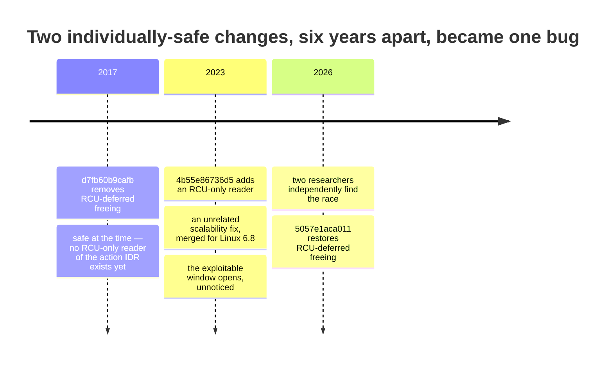
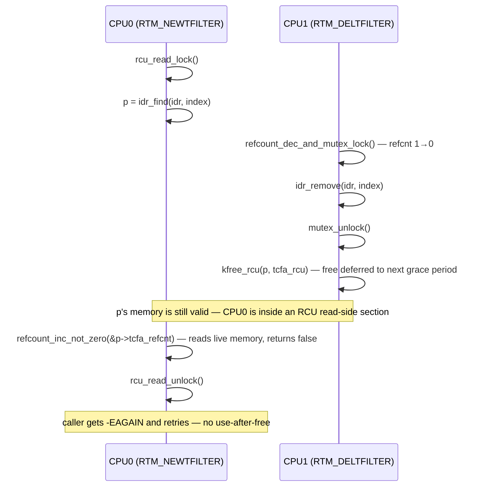

# The net/sched act_api Filter-Delete Race

> CVE-2026-53264 — a 2017 comment's reasoning about RCU safety covered every reader that existed at the time; a 2023 scalability fix quietly added the one it hadn't, and a second researcher independently found the resulting bug and built a working exploit for it as a fresh 0-day, with AI speeding up the exploit development

Disclosed
:   2026-06-25 (Linux kernel CNA record); independent 0-day exploit write-up published July 27, 2026 (STAR Labs)

Reported by
:   Kyle Zeng (OpenAI security research) — original kernel bug report, credited in the fix commit's `Reported-by` tag; Lee Jia Jie (STAR Labs, Singapore) — independently found the same bug and built a working exploit for it as a 0-day, learning only afterward, by their own account, that Zeng had already reported it upstream

CVSS
:   7.8 HIGH (Linux kernel CNA, vector `CVSS:3.1/AV:L/AC:L/PR:L/UI:N/S:U/C:H/I:H/A:H`; mirrored, not independently scored, by NVD) / 7.0 (Red Hat's own scoring, vector `CVSS:3.1/AV:L/AC:H/PR:L/UI:N/S:U/C:H/I:H/A:H`)

Fixed in
:   mainline 7.1-rc7 (commit `5057e1aca011`, authored May 31 2026, committed June 1); backported separately to stable 5.10.259, 5.15.210, 6.1.176, 6.6.143, 6.12.94, 6.18.36, and 7.0.13

Exploit tool
:   yes — full source published: [star-sg/CVE: CVE-2026-53264](https://github.com/star-sg/CVE/tree/master/CVE-2026-53264), Lee Jia Jie's TyphoonPwn 2026 submission, alongside a detailed STAR Labs write-up

Actively exploited
:   no confirmed cases (local-only; requires an existing unprivileged shell; not on CISA KEV as of this writing)

*Part of [War Stories: Network Stack Bugs and CVEs](../war-stories.md).*

## What happened

Two people found the same bug in Linux's traffic-control code, for completely unrelated reasons, and neither knew about the other. A security researcher at OpenAI quietly reported a use-after-free upstream through normal channels, shortly before a hacking competition in Singapore. An intern at a Singapore security firm — hunting kernel bugs with AI assistance ahead of that same competition — had independently found the identical bug on their own and built it into a full local-root exploit; by their own account, they only learned about the upstream report after the competition was over. The vulnerability, CVE-2026-53264, is a locking/RCU mismatch, not sloppy code: two separate, individually reasonable kernel changes, made years apart, quietly combined into something neither author could have anticipated — leaving a window where deleting a network filter could free memory another CPU was still about to use.

## How the code was vulnerable

Linux [traffic control](../tc-qdisc.md) (`tc`) actions — the `gact`, `mirred`, and similar objects a filter runs when it matches a packet — are reference-counted `struct tc_action` objects, indexed per action-type in an IDR (`idr_find(idr, index)`) so that [netlink](../netlink.md) requests can look one up by its numeric index and either attach it to a new filter or delete it. Because the IDR is walked by lookups that only take `rcu_read_lock()`, not the mutex that protects *removing* entries from it, an action's memory has to stay valid for at least one RCU grace period after it's unlinked — otherwise a concurrent reader that found the pointer just before removal can dereference (or refcount) it just after the memory is freed.

That mechanism — an RCU-deferred free protecting a lookup that only takes the read lock — is what's in place today, but it wasn't always there for the reason you might expect. Before 2017, `free_tcf()` *was* the RCU callback itself — `static void free_tcf(struct rcu_head *head)`, recovering the action pointer via `container_of()` — and it was its two callers, `tcf_idr_remove()` and `tcf_idr_cleanup()`, that deferred the free with `call_rcu(&p->tcfa_rcu, free_tcf)` rather than invoking it directly. In September 2017, Cong Wang's commit [`d7fb60b9cafb`](https://git.kernel.org/pub/scm/linux/kernel/git/torvalds/linux.git/commit/?id=d7fb60b9cafb982cb2e46a267646a8dfd4f2e5da) ("net_sched: get rid of tcfa_rcu") removed that deferral: `free_tcf()` was changed to take the `tc_action *` directly and run immediately, with both callers now just calling `free_tcf(p)`.

The commit message gives two reasons. The narrow one is that a related rewrite meant one specific caller no longer needed to wait for a grace period on that account — the commit message itself doesn't name which caller. The other is a real constraint on a follow-up patch the commit was clearing the way for — Wang writes that removing the deferral *"also completely closes a race condition between action free path and filter chain add/remove path for the following patch. Because otherwise the nested RCU callback can't be caught by `rcu_barrier()`"* — a `call_rcu()` nested inside another RCU callback can outlive the `rcu_barrier()` a caller uses to wait out all pending callbacks, which the follow-up work needed to not happen.

Alongside both of those, the rewritten `free_tcf()` carries a comment justifying why dropping the deferral should be safe on its own terms — the load-bearing claim for *this* bug: *"for standalone actions, we don't need a RCU grace period either, because actions are always connected to filters and filters are already destroyed in RCU callbacks, so after a RCU grace period actions are already disconnected from filters. Readers later can not find us."* That argument is about one specific reader path: someone reaching an action *through a filter*. It says nothing about a reader reaching the same action *directly through the IDR* — which is exactly what a concurrent `RTM_NEWTFILTER` lookup does.

That gap didn't turn into a live bug the moment it opened. Direct action-index lookups — what a concurrent `RTM_NEWTFILTER` performs, via `tcf_idr_check_alloc()` — were, through Linux 6.7, entirely mutex-protected: the function took `idrinfo->lock` before calling `idr_find()` and held it through the `refcount_inc()`, so there was no RCU-only reader of the action IDR at all, and the 2017 comment's claim held safely, if incidentally. That changed in December 2023: Pedro Tammela's commit [`4b55e86736d5`](https://git.kernel.org/linus/4b55e86736d5) ("net/sched: act_api: rely on rcu in tcf_idr_check_alloc"), merged for Linux 6.8, rewrote the function to reduce mutex contention when many filters bind to the same action concurrently — replacing the mutex-held lookup with `rcu_read_lock()` around `idr_find()` and `refcount_inc_not_zero()` for the bump, falling back to the mutex only when allocating a brand-new slot.

That's exactly the reader the 2017 comment never accounted for, introduced not by carelessness but by an unrelated, individually well-reasoned scalability fix six years later. The exploitable window opened there, in late 2023 — not in 2017. (The CVE record itself lists "affected since 4.14" — that's a mechanical consequence of citing the 2017 commit as the `Fixes:` target, not an independent exploitability analysis; the code itself is what actually determines when the window opened.)

The two versions of the read path, trimmed to the locking difference (the `IS_ERR(p)` retry branch and the allocate-a-new-slot path are both omitted here; checked against `net/sched/act_api.c` at each tag):

```c
/* v6.7 — idrinfo->lock held for the entire lookup and refcount bump */
mutex_lock(&idrinfo->lock);
p = idr_find(&idrinfo->action_idr, *index);
if (p) {
    refcount_inc(&p->tcfa_refcnt);   /* safe: mutex still held, p can't vanish */
    ...
}
mutex_unlock(&idrinfo->lock);
```

```c
/* v6.8, commit 4b55e86736d5 — mutex dropped for the lookup itself */
rcu_read_lock();
p = idr_find(&idrinfo->action_idr, *index);
if (p) {
    if (!refcount_inc_not_zero(&p->tcfa_refcnt)) {  /* p could already be mid-free */
        rcu_read_unlock();
        return -EAGAIN;
    }
    ...
}
rcu_read_unlock();
```

Nothing here is wrong on its own — `refcount_inc_not_zero()` is exactly the right primitive for an RCU-only reader to use. The 2017 comment just predates this reader by six years, and nobody re-checked it against the new code path when this landed.

The chronology, visually:



## The race

The fix commit's own description lays out the race with CPU0 running `RTM_NEWTFILTER` and CPU1 running `RTM_DELTFILTER` concurrently against the same action index:

```
0: mutex_lock()                              <-- holds the idr lock
0: rcu_read_lock()
0: p = idr_find(idr, index)                  <-- action p is valid (RCU protects IDR)
0: mutex_unlock()                            <-- releases the idr lock
1: refcount_dec_and_mutex_lock()             <-- refcnt 1->0, mutex held
1: idr_remove(idr, index)                    <-- Action removed from IDR
1: mutex_unlock()                            <-- mutex released allowing us to delete the action
1: tcf_action_cleanup(p); kfree(p)           <-- Kfrees p immediately, no deferral
0: refcount_inc_not_zero(&p->tcfa_refcnt)    <-- ouch, UAF p points to freed memory
```

That diagram is the fix commit's own schematic, and it's worth being precise about where it simplifies. In the actual `tcf_idr_check_alloc()` code (checked against `net/sched/act_api.c` at the pre-fix v7.0 tag), CPU0's read side never takes a mutex at all: it's `rcu_read_lock()`, `idr_find()`, `refcount_inc_not_zero()`, `rcu_read_unlock()`, with no mutex anywhere in between — the mutex in the diagram belongs to CPU1's delete path, not CPU0's read. The actual gap is simpler than the diagram implies: CPU0 holds only the RCU read lock for the entire lookup-and-refcount sequence, and the RCU read lock guarantees only that memory a reader already holds a pointer to won't be *reclaimed* via an RCU-deferred free while that lock is held — it says nothing about a concurrent, *non*-deferred `kfree()` elsewhere. If CPU1's delete path runs in the gap and frees `p` immediately (as the 2017 change made it do), CPU0's subsequent `refcount_inc_not_zero()` touches memory that's already back in the slab allocator's hands.

Visually, the actual (not schematic) interleaving:

```mermaid
sequenceDiagram
    participant C0 as CPU0 (RTM_NEWTFILTER)
    participant C1 as CPU1 (RTM_DELTFILTER)
    C0->>C0: rcu_read_lock()
    C0->>C0: p = idr_find(idr, index)
    Note over C0: no mutex held — RCU read lock only
    C1->>C1: refcount_dec_and_mutex_lock() — refcnt 1→0
    C1->>C1: idr_remove(idr, index)
    C1->>C1: mutex_unlock()
    C1->>C1: tcf_action_cleanup(p); kfree(p) — immediate, no RCU deferral
    Note over C1: p is freed while CPU0 still holds a pointer to it
    C0->>C0: refcount_inc_not_zero(&p->tcfa_refcnt)
    Note over C0: use-after-free — p is already back in the slab allocator
    C0->>C0: rcu_read_unlock()
```

The root cause is a locking/RCU mismatch that was the *product* of a reasoning gap, not sloppiness: the 2017 comment's claim — that a grace period elsewhere already guarantees readers can't find a freed action — was true for the one reader path it was written about (reaching an action by walking a filter's attached actions) and simply didn't consider the other path that reaches the same object: a direct `idr_find()` on the action index itself, independent of any filter. An RCU-safety argument scoped to "the readers I have in mind" doesn't automatically cover every reader that gets added later; it held safely for six years, until an unrelated 2023 scalability fix introduced exactly the reader it hadn't accounted for — and the resulting mismatch then sat unnoticed for roughly another two and a half years, until two independent researchers each found a way to trigger the race.

## How it was found

**The original report.** Kyle Zeng, a security researcher at OpenAI, reported the race upstream. That attribution rests on two independent sources: the fix commit's own `Reported-by`/`Tested-by` trailers (`kylebot@openai.com`), and Lee Jia Jie's write-up, which separately names "KyleBot" — Zeng's long-standing handle — as the person who had already reported the bug. Neither source says how Zeng found it, or points to a public report thread, and — unlike Lee — we found nothing published by Zeng directly about it. That's consistent with a private report made directly to a maintainer rather than a public mailing-list post, though it doesn't confirm it — this page doesn't guess beyond what those two sources actually say.

The fix commit also credits syzbot, but only as `Tested-by` — confirming the finished patch works, not crediting it as a discoverer; there's no `Reported-by` tag or linked bug report for syzbot finding the race itself. (Zeng re-tested the finished fix too, appearing a second time as `Tested-by`.)

Jakub Kicinski, who maintains this area, suggested the fix approach; Jamal Hadi Salim implemented it — explicitly, in their own commit message, as a revert of the 2017 change plus a modernization to `kfree_rcu()`. The fix was authored May 31, 2026, committed June 1, and landed in mainline at v7.1-rc7; the CVE was published June 25, 2026.

**The independent 0-day.** Lee Jia Jie, an intern at STAR Labs (Singapore), was hunting kernel bugs with AI assistance ahead of **[TyphoonPwn 2026](https://typhooncon.com/typhoonpwn-2026/)** — a multi-category exploit competition held May 28, 2026, per Lee's own account. Linux local-privilege-escalation was the track they were targeting, and they found the same race in `net/sched` on their own, building it into a working local-root exploit before the competition, with no knowledge of Zeng's report.

A few days after the competition, they learned that *"KyleBot had already reported the bug 2 days before TyphoonPwn"* — meaning Zeng's report predated the *competition itself* by two days, not Lee's own (unstated, but necessarily earlier) discovery.

Lee's write-up, published July 27, 2026 and titled ["When AI Makes 0-Days Feel Like N-Days"](https://starlabs.sg/blog/2026/07-when-ai-makes-0-days-feel-like-n-days/), independently confirms the same root cause: *"The vulnerability is a lock-mismatch: `tcf_idr_check_alloc()` accesses the action idr with only `rcu_read_lock()`, while actions are freed with `idrinfo->lock` and `rtnl_lock()` held, but without waiting for the RCU grace period (i.e. raw kfree)."*

Lee describes using AI to speed up three tasks — finding the bug itself, producing a KASAN proof-of-concept, and improving the race condition as a whole — without saying which of the specific race-widening techniques below AI actually helped with.

The race itself got substantially faster over several iterations: naive attempts to win the CPU0/CPU1 race took over 15 minutes. After widening the window with a `timerfd`/`epoll` technique, splitting the attempt across separate chains with separate mutexes, and restructuring it into dedicated "binder" and "deleter" threads, the time needed to actually win the race dropped to around 5 seconds (Lee notes this could likely be reduced further using multiple action indexes).

That's a different measurement from how reliably the *finished* exploit runs end-to-end: in a separate 10-run benchmark of the complete chain (a CentOS 9 desktop on an Intel i5-1235U laptop), all 10 runs succeeded, taking 10, 10, 9, 11, 11, 111, 64, 69, 47, and 10 seconds — full-chain runtime, not race-trigger latency; Lee attributes the slower outliers to CPU thermal throttling.

## The impact

The full chain went well past triggering the UAF: reclaiming the freed `tc_action` memory with an attacker-controlled `user_key_payload` object to hijack a function pointer, a stack pivot from a controlled heap buffer, and a kernel-version-specific ROP chain that overwrites [`core_pattern`](https://docs.kernel.org/admin-guide/sysctl/kernel.html#core-pattern) to gain root execution through the core-dump handler — a working local-root exploit, not just a crash. It requires unprivileged user namespaces to be available, the `CONFIG_NET_ACT_GACT` and `CONFIG_NET_CLS_FLOWER` kernel options, and hardcoded per-kernel-version offsets in the ROP chain, so it's a local privilege-escalation primitive, not something portable or remotely triggerable as published.

## How it was fixed

Commit [`5057e1aca011`](https://git.kernel.org/pub/scm/linux/kernel/git/torvalds/linux.git/commit/?id=5057e1aca011e51ef51498c940ef96f3d3e8a305) (Jamal Hadi Salim; authored May 31 2026, committed June 1, landed in v7.1-rc7) restores `struct rcu_head tcfa_rcu` to `struct tc_action` and changes `free_tcf()`'s `kfree(p)` back to a deferred `kfree_rcu(p, tcfa_rcu)` — explicitly framed in the commit message as a revert of 2017's `d7fb60b9cafb` combined with a modernization (the original used an explicit `call_rcu()` callback; the fix uses `kfree_rcu()` directly). With the free deferred, CPU0's `idr_find()` either finds a still-live object (and `refcount_inc_not_zero()` succeeds normally) or the object is already unlinked from the IDR and `idr_find()` correctly returns `NULL` — but the memory itself, even if a stale pointer to it exists somewhere, isn't actually released until the RCU grace period elapses, so there's no window left in which a refcount operation can touch freed memory. Suggested-by Jakub Kicinski; reviewed by Pedro Tammela, Eric Dumazet, and Victor Nogueira; tested by Kyle Zeng, syzbot, and Victor Nogueira.

**The first attempt didn't work.** Salim's initial patch ([v1](https://ratatoskr.run/netdev/2026/05/17064743/t), posted May 30, 2026) took the same general shape as the code it was reverting to: defer the free with an explicit `call_rcu()` callback, `tcf_action_rcu_free()`, that ran the full cleanup — including `tcf_action_cleanup()` — after the grace period elapsed.

Syzbot's automated testing caught two real problems with that design within hours. `tcf_action_rcu_free()` called `__tcf_chain_put()`, which tries to acquire a mutex, but RCU callbacks run in softirq context, where sleeping isn't allowed — a "sleeping function called from invalid context" report pointing at `net/sched/cls_api.c:694`. A second lockdep warning fired on `mirred_list_lock`, a spinlock that `tcf_mirred_release()` (reached through the same cleanup path) had previously only ever taken with softirqs enabled, now suddenly being taken with them disabled.

Salim's reply was short: *"Thanks for finding this. Will send a v2 with a fix."* The [v2](https://ratatoskr.run/netdev/2026/05/17069560/t) — the version that actually merged — fixed this by moving `tcf_action_cleanup()` out of the deferred path entirely, running it synchronously before scheduling the RCU-deferred free, and simplifying the callback itself down to a plain `kfree_rcu(p, tcfa_rcu)` that does nothing but release memory. Nothing that needs a mutex, or a spinlock taken with the wrong IRQ state, runs in RCU-callback context in the version that shipped.

The same interleaving, after the fix:



The fix's placement in mainline checks out: `net/sched/act_api.c` at the `v7.0` tag still has the unconditional `kfree(p)`, while current mainline has the restored `kfree_rcu(p, tcfa_rcu)` — consistent with public reporting that pins the mainline landing to `7.1-rc7`. The fix was backported separately to each affected stable branch as seven distinct commits — `98b2e40879ab`, `18af5d2ef0c4`, `1f1b98fea6b9`, `8b136f18ac4b`, `5dd51e09020c`, `b60e9391142e`, and `91d105d2cbe0`, covering 5.10.259, 5.15.210, 6.1.176, 6.6.143, 6.12.94, 6.18.36, and 7.0.13 — each one carrying its own `[ Upstream commit 5057e1aca011... ]` tag, and the `98b2e40879ab` backport's sign-off chain ends with Sasha Levin's stable-tree sign-off, as is standard for these backports.

## What it taught us

**An RCU-safety argument has to cover every reader path that will ever exist, not just the ones that exist when it's written.** The 2017 reasoning wasn't wrong about filter-chain traversal, and it wasn't wrong about the IDR either — *at the time*, direct IDR lookups were still mutex-protected, so no RCU-only reader existed to violate the assumption. Six years later, an unrelated scalability fix added exactly that reader, and nobody went back to check whether the 2017 comment's guarantee still held.

**A correctness comment is a claim that ages, silently, along with the code around it — including code changed by someone who never saw the comment.** Nothing about the 2017 change or the 2023 change looked unsafe in isolation; each was a reasonable fix to the problem in front of its author. The bug only exists at their intersection, which is exactly the kind of thing neither author had reason to go looking for.

**Two independent efforts surfaced the same bug for unrelated reasons.** Kyle Zeng reported it upstream through normal channels; Lee Jia Jie found it separately while hunting for a competition, using AI to help, and only learned afterward that the same bug had already been reported. That's not evidence this bug was unusually easy to find — but it's a reminder that a race window open for a couple of years, in a widely-used networking subsystem, can attract more than one independent search effort without either knowing about the other.

**Even a well-reasoned fix can ship with a real bug, and automated testing is what catches it before it merges.** Salim's first attempt at the fix introduced exactly the kind of problem RCU callbacks are notorious for — code that assumes it can sleep or take an inconsistent lock where it can't. Syzbot found both issues within hours of the v1 posting, before it ever reached a released kernel.

**AI made 0-day hunting feel, procedurally, like n-day analysis — in the researcher's own words.** Lee's account doesn't claim AI found or exploited the bug autonomously: they credit it for iterating quickly on discovery, a proof-of-concept, and improving the race condition, while repeatedly stressing that their own judgment was still necessary to fine-tune the result. The narrower, still-notable claim is their own: for a researcher who already knows the subsystem, AI tooling can shrink the gap between "hunting for an unknown bug" and "exploiting one that's already disclosed" — which is what their write-up's title is actually about, a different and more modest claim than "AI found and exploited an already-patched bug on its own."

!!! warning "Pattern to watch for"
    Any refcounted object reachable through both an RCU-read-locked lookup (an IDR, a hash table, an RCU-protected list) and a mutex-protected removal path needs the *free itself* deferred with `call_rcu()`/`kfree_rcu()` — a lock around removal doesn't help a lookup that only ever took the RCU read lock. If a comment justifies skipping deferred freeing by saying "readers can only reach this through path X, and X is already safe," audit every other path that can reach the same object before trusting it — not just the one the comment's author had in mind. That audit isn't a one-time check, either: if a later, unrelated change adds a *new* reader path to the same object — exactly what happened here, six years on — it needs to be checked against every existing safety comment that assumed a fixed set of readers, not just reviewed for correctness on its own terms.

## See also

- [Traffic Control and Queueing Disciplines](../tc-qdisc.md) — the `tc` filter/action architecture this bug lives in
- [Netlink Sockets](../netlink.md) — how `RTM_NEWTFILTER`/`RTM_DELTFILTER` requests reach the kernel
- [Network Namespaces](../net-namespaces.md) — how unprivileged user+network namespaces expose the capabilities this exploit needs
- [AF_PACKET TPACKET_V3 Privilege Escalation](af-packet.md) — another local UAF-to-root chain in this collection, for comparison

## External references

- [git.kernel.org: 5057e1aca011](https://git.kernel.org/pub/scm/linux/kernel/git/torvalds/linux.git/commit/?id=5057e1aca011e51ef51498c940ef96f3d3e8a305) — "net/sched: act_api: use RCU with deferred freeing for action lifecycle"
- [git.kernel.org: d7fb60b9cafb](https://git.kernel.org/pub/scm/linux/kernel/git/torvalds/linux.git/commit/?id=d7fb60b9cafb982cb2e46a267646a8dfd4f2e5da) — "net_sched: get rid of tcfa_rcu", the 2017 change this fix reverts
- [git.kernel.org: 4b55e86736d5](https://git.kernel.org/linus/4b55e86736d5) — "net/sched: act_api: rely on rcu in tcf_idr_check_alloc", the December 2023 scalability fix that introduced the RCU-only reader the 2017 change hadn't accounted for
- [netdev: \[PATCH net 1/1\] net/sched: act_api: use RCU... (v1)](https://ratatoskr.run/netdev/2026/05/17064743/t) — the first attempt at the fix, before syzbot found its RCU-callback locking bugs
- [netdev: \[PATCH net v2 1/1\] net/sched: act_api: use RCU... (v2)](https://ratatoskr.run/netdev/2026/05/17069560/t) — the corrected version that merged as `5057e1aca011`
- [STAR Labs: When AI Makes 0-Days Feel Like N-Days](https://starlabs.sg/blog/2026/07-when-ai-makes-0-days-feel-like-n-days/) — Lee Jia Jie's own account of finding this bug and building a working exploit for it as a 0-day, including the AI-assisted race-window timing data
- [star-sg/CVE: CVE-2026-53264](https://github.com/star-sg/CVE/tree/master/CVE-2026-53264) — Lee Jia Jie's full published exploit source
- [The Hacker News: Researcher Says AI Helped Develop Linux Traffic-Control Race Into Root Exploit](https://thehackernews.com/2026/07/researcher-says-ai-helped-develop-linux.html) — secondary coverage of the write-up
- [Red Hat: CVE-2026-53264](https://access.redhat.com/security/cve/cve-2026-53264) — CVE description and Red Hat's own CVSS scoring
