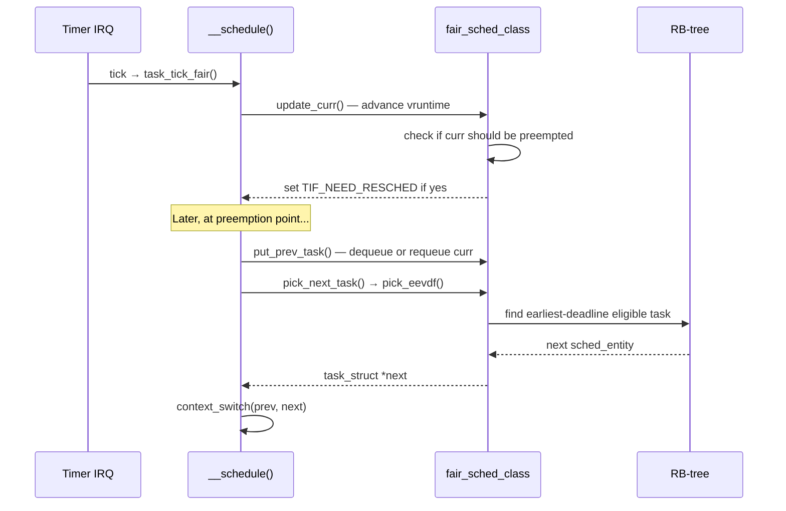

# CFS: Completely Fair Scheduler

> Virtual runtime, weighted fairness, and the red-black tree

## What CFS guarantees

CFS gives every task an equal share of CPU time, weighted by its priority. A process at nice -5 gets roughly 3x more CPU than a process at nice +5 — and that ratio holds even when the system is overloaded.

The "completely fair" property: if you run N tasks of equal priority, each gets exactly 1/N of the CPU, regardless of when they were created, when they last ran, or how long they've been sleeping.

## Virtual runtime

The central concept is **vruntime**: a measure of how much CPU time a task has consumed, scaled by its weight.

```
vruntime += (real time elapsed) × (NICE_0_WEIGHT / task weight)
```

A high-weight task (nice -20) advances vruntime slowly — it gets more real CPU time per unit of virtual time. A low-weight task (nice +19) advances vruntime quickly.

The scheduler always picks the task with the **smallest vruntime**. Combined with weight-based scaling, this achieves weighted fairness automatically.

### An example

Three tasks: A (nice -5, weight 3121), B (nice 0, weight 1024), C (nice +5, weight 335).

Total weight = 4480. Ideal CPU shares:
- A: 3121/4480 = 69.7%
- B: 1024/4480 = 22.9%
- C:  335/4480 =  7.5%

CFS achieves this by making vruntime advance at different rates:
- A's vruntime grows at `1024/3121` of real time (~0.33x)
- B's vruntime grows at `1024/1024` of real time (1.0x)
- C's vruntime grows at `1024/335` of real time (~3.1x)

After 1 second of real time, all three tasks will have similar vruntimes — but A ran for ~697ms, B for ~229ms, C for ~75ms.

## Weights and nice values

Nice-to-weight mapping is a fixed table in the kernel:

```c
// kernel/sched/core.c
const int sched_prio_to_weight[40] = {
 /* -20 */     88761,     71755,     56483,     46273,     36291,
 /* -15 */     29154,     23254,     18705,     14949,     11916,
 /* -10 */      9548,      7620,      6100,      4904,      3906,
 /*  -5 */      3121,      2501,      1991,      1586,      1277,
 /*   0 */      1024,       820,       655,       526,       423,
 /*   5 */       335,       272,       215,       172,       137,
 /*  10 */       110,        87,        70,        56,        45,
 /*  15 */        36,        29,        23,        18,        15,
};
```

Each step is ~1.25x. A task at nice -1 gets ~25% more CPU than nice 0. At nice -20 vs nice +19, the ratio is 88761/15 ≈ 5917x — nearly a 6000:1 difference.

## Data structures

### struct sched_entity

Every task that CFS manages is tracked through `struct sched_entity`, embedded in `task_struct`:

```c
// include/linux/sched.h
struct sched_entity {
    struct load_weight  load;             // weight (from nice value)
    u64                 vruntime;         // virtual runtime
    u64                 exec_start;       // wall time when last updated
    u64                 sum_exec_runtime; // total real CPU time consumed
    u64                 deadline;         // EEVDF virtual deadline
    u64                 slice;            // EEVDF time slice
    u64                 vlag;             // EEVDF lag
    // ...
    struct rb_node      run_node;         // position in cfs_rq RB-tree
    struct list_head    group_node;
    unsigned int        on_rq;            // currently queued?
    // ...
};
```

### struct cfs_rq

Each CPU has one CFS runqueue:

```c
// kernel/sched/sched.h
struct cfs_rq {
    struct rb_root_cached tasks_timeline; // RB-tree of runnable tasks
    struct sched_entity  *curr;           // currently running entity
    struct sched_entity  *next;           // buddy hint (wakeup preemption)
    unsigned int          nr_queued;      // number of runnable tasks
    s64                   avg_vruntime;   // weighted vruntime sum (for eligibility)
    // ...
};
```

`tasks_timeline` is an `rb_root_cached` — a red-black tree that also caches a pointer to the leftmost (minimum vruntime) node, making `O(1)` access to the next task to run.

## Core functions

### update_curr()

Called on every timer tick and context switch for the running task:

```c
// kernel/sched/fair.c
static void update_curr(struct cfs_rq *cfs_rq)
{
    struct sched_entity *curr = cfs_rq->curr;
    u64 now = rq_clock_task(rq_of(cfs_rq));
    u64 delta_exec;

    if (unlikely(!curr))
        return;

    delta_exec = now - curr->exec_start;
    if (unlikely((s64)delta_exec <= 0))
        return;

    curr->exec_start = now;
    curr->sum_exec_runtime += delta_exec;
    curr->vruntime += calc_delta_fair(delta_exec, curr);

    // update_deadline() and avg_vruntime maintenance omitted
}
```

### enqueue_entity() / dequeue_entity()

When a task wakes up or blocks:

```c
// kernel/sched/fair.c (simplified)
static void enqueue_entity(struct cfs_rq *cfs_rq,
                            struct sched_entity *se, int flags)
{
    // Place the entity in the RB-tree
    __enqueue_entity(cfs_rq, se);
    se->on_rq = 1;
    // Update load tracking, avg_vruntime, etc.
}

static bool dequeue_entity(struct cfs_rq *cfs_rq,
                             struct sched_entity *se, int flags)
{
    // Remove from RB-tree
    __dequeue_entity(cfs_rq, se);
    se->on_rq = 0;
    return true;
}
```

### pick_next_entity()

Selects the next task to run — since 6.6, this delegates to EEVDF:

```c
// kernel/sched/fair.c
static struct sched_entity *
pick_next_entity(struct rq *rq, struct cfs_rq *cfs_rq)
{
    return pick_eevdf(cfs_rq);
}
```

## The scheduling timeline



## Group scheduling

CFS supports hierarchical scheduling via cgroups. When `CONFIG_FAIR_GROUP_SCHED` is enabled, the RB-tree contains not just tasks but also **group scheduling entities** — virtual entities representing cgroups.

```
CPU
└── cfs_rq (top level)
    ├── task A (sched_entity)
    ├── group X (group sched_entity) → cfs_rq for group X
    │   ├── task B
    │   └── task C
    └── task D
```

Each group gets a share of CPU time as a single entity, then distributes it among its members. This allows setting CPU shares per container without each container's tasks competing directly with others.

## Viewing CFS state

```bash
# Per-task scheduler info
cat /proc/$PID/sched
# Shows: vruntime, exec_start, sum_exec_runtime, prio, etc.

# System-wide CFS stats per CPU
cat /proc/schedstat

# Detailed task scheduler info via perf
perf sched record ./workload
perf sched latency
```

## Common misconceptions

**"CFS gives equal CPU to all tasks"** — No. Equal CPU to tasks of equal *priority*. Nice values determine the ratio.

**"A task sleeping for a long time will get a CPU burst when it wakes up"** — Partially. The task's vruntime is placed at `avg_vruntime - half_slice` when it wakes, so it runs soon but doesn't monopolize the CPU.

**"CFS is still the scheduler in modern kernels"** — The `fair_sched_class` is, yes. But `pick_next_entity()` now calls `pick_eevdf()` instead of the old leftmost-node logic. EEVDF replaced the selection mechanism inside CFS in kernel 6.6.

## Further reading

- [EEVDF Scheduler](eevdf.md) — The selection algorithm that replaced CFS's leftmost-node approach
- [Scheduler Classes](scheduler-classes.md) — Where CFS fits in the class hierarchy
- [Runqueues](runqueues.md) — The per-CPU `struct rq` that contains `struct cfs_rq`
- [kernel/sched/fair.c](https://git.kernel.org/pub/scm/linux/kernel/git/torvalds/linux.git/tree/kernel/sched/fair.c) — Source (14,000+ lines)
