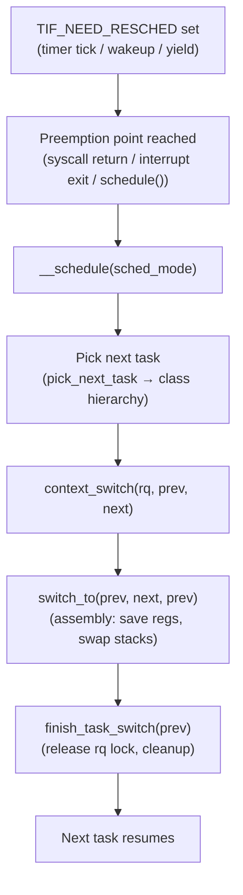
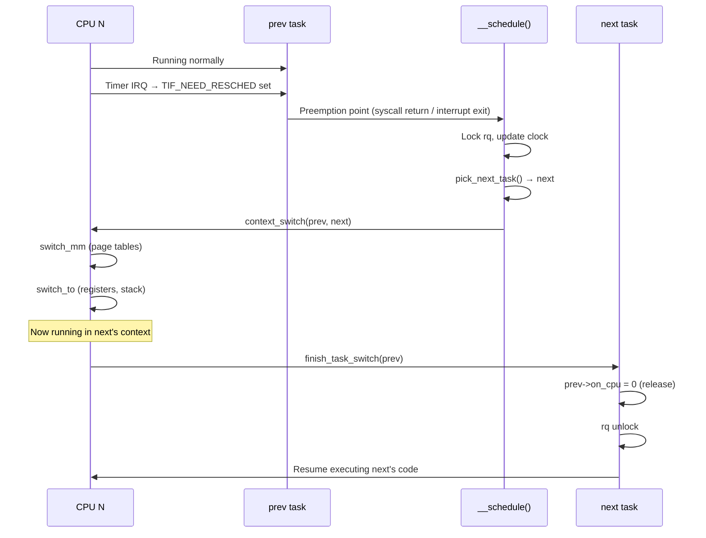

# Life of a Context Switch

> What happens inside `__schedule()` from preemption to resumption

## The big picture

A context switch moves the CPU from running one task to running another. It's triggered thousands of times per second and must be as fast as possible — yet it involves locking, memory barrier ordering, architecture-specific register saving, and careful pointer gymnastics to safely hand off execution.



## How a task gets marked for rescheduling

Before a context switch can happen, something must decide the current task should give up the CPU. This sets `TIF_NEED_RESCHED` on the current task:

```c
// kernel/sched/core.c
static void resched_curr(struct rq *rq)
{
    struct task_struct *curr = rq->curr;

    if (test_tsk_need_resched(curr))
        return;

    // ...
    set_tsk_need_resched(curr);
    set_preempt_need_resched();
}
```

Common triggers:
- **Timer tick** (`task_tick_fair()`): current task has run too long
- **Wakeup** (`wakeup_preempt()`): a higher-priority task became runnable
- **Explicit yield** (`sched_yield()`): task voluntarily gives up the CPU
- **Priority change**: task's priority lowered below a runnable task

## Voluntary vs involuntary switches

The kernel tracks two types of context switches per task:

```c
// include/linux/sched.h
unsigned long nvcsw;   /* voluntary context switches */
unsigned long nivcsw;  /* involuntary (non-voluntary) context switches */
```

**Voluntary** (`nvcsw`): The task called `schedule()` directly because it has nothing to do — blocked on I/O, sleeping, waiting for a lock.

**Involuntary** (`nivcsw`): The scheduler preempted the task — its timeslice expired or a higher-priority task woke up.

```bash
# See voluntary/involuntary switches for a process
cat /proc/$PID/status | grep ctxt
# voluntary_ctxt_switches:    1234
# nonvoluntary_ctxt_switches: 567
```

A high involuntary count relative to voluntary means the task is being preempted frequently — it always has work to do but keeps losing the CPU to other tasks.

## Schedule modes

`__schedule()` is called with a mode that determines what triggered it:

```c
// kernel/sched/core.c
#define SM_NONE           0   // voluntary (task called schedule())
#define SM_PREEMPT        1   // involuntary (timer/interrupt forced it)
#define SM_RTLOCK_WAIT    2   // RT lock contention (PREEMPT_RT only)
/* Note: there is no SM_IDLE constant; the idle loop calls __schedule(SM_NONE) */
```

This affects two things: which counter is incremented (`nvcsw` vs `nivcsw`) and whether the task's state is consulted before dequeuing.

## Inside __schedule()

```c
// kernel/sched/core.c (simplified)
static void __sched notrace __schedule(int sched_mode)
{
    struct task_struct *prev, *next;
    struct rq *rq;
    int cpu;

    cpu = smp_processor_id();
    rq = cpu_rq(cpu);
    prev = rq->curr;

    // 1. Disable IRQs and lock the runqueue
    local_irq_disable();
    rcu_note_context_switch(sched_mode == SM_PREEMPT);
    rq_lock(rq, &rf);

    // 2. Update the runqueue clock
    update_rq_clock(rq);

    // 3. If voluntary switch and task has state (it's blocking):
    //    dequeue it from the runqueue
    if (!(sched_mode & SM_MASK_PREEMPT) && prev->__state) {
        // Task is going to sleep — remove from runqueue
        try_to_block_task(rq, prev, &rf);
        switch_count = &prev->nvcsw;  // voluntary
    } else {
        switch_count = &prev->nivcsw; // involuntary
    }

    // 4. Clear the resched flag
    clear_tsk_need_resched(prev);
    clear_preempt_need_resched();

    // 5. Pick the next task to run
    next = pick_next_task(rq, prev, &rf);

    // 6. If same task, nothing to do
    if (likely(prev != next)) {
        rq->nr_switches++;
        rq->curr = next;
        ++*switch_count;

        // 7. Switch!
        context_switch(rq, prev, next, &rf);
        // --- execution now in 'next's context ---
        // When we return here, we are running as
        // whatever task resumed this CPU next.
    } else {
        rq_unpin_lock(rq, &rf);
        __balance_callbacks(rq);
        raw_spin_rq_unlock_irq(rq);
    }
}
```

## context_switch()

Once `next` is selected, `context_switch()` does the actual switch:

```c
// kernel/sched/core.c
static context_switch(struct rq *rq, struct task_struct *prev,
                      struct task_struct *next, struct rq_flags *rf)
{
    // 1. Pre-switch bookkeeping (tracing, perf, cgroup notifications)
    prepare_task_switch(rq, prev, next);

    // 2. Switch memory mappings
    if (!next->mm) {
        // Kernel thread: borrow prev's page tables (lazy TLB)
        next->active_mm = prev->active_mm;
        enter_lazy_tlb(prev->active_mm, next);
    } else {
        // User task: install next's page tables
        switch_mm_irqs_off(prev->active_mm, next->mm, next);
    }

    // 3. Switch CPU registers and stack
    switch_to(prev, next, prev);
    // ↑ After this line, we are running in next's context.
    //   'prev' now refers to the task that was running
    //   before *next* last yielded (not necessarily prev above).

    barrier();

    // 4. Post-switch cleanup — runs in next's context
    return finish_task_switch(prev);
}
```

### The memory switch

For a user-space task, `switch_mm_irqs_off()` installs the new task's page tables. On x86-64 with PCID, this is a CR3 write with the PCID bits set — the TLB is not fully flushed if the PCID is still cached.

For a kernel thread (no `mm`), it borrows the previous task's `active_mm` via lazy TLB: the page tables aren't switched, but the kernel thread is told "don't expect any user-space TLB entries to be valid."

### switch_to(): the assembly heart

`switch_to()` is architecture-specific. On x86-64:

```c
// arch/x86/include/asm/switch_to.h
#define switch_to(prev, next, last)             \
do {                                            \
    ((last) = __switch_to_asm((prev), (next))); \
} while (0)
```

`__switch_to_asm` (in `arch/x86/entry/entry_64.S`) saves callee-saved registers and swaps the stack pointer:

```asm
// Simplified x86-64 __switch_to_asm
__switch_to_asm:
    // Save prev's callee-saved registers
    pushq %rbp
    pushq %rbx
    pushq %r12
    pushq %r13
    pushq %r14
    pushq %r15

    // Save prev's stack pointer into task_struct->thread.sp
    movq %rsp, TASK_threadsp(%rdi)     // rdi = prev

    // Load next's stack pointer
    movq TASK_threadsp(%rsi), %rsp     // rsi = next

    // Restore next's callee-saved registers
    popq %r15
    popq %r14
    popq %r13
    popq %r12
    popq %rbx
    popq %rbp

    // Jump to __switch_to (C function) for FPU/debug reg handling
    jmp __switch_to
```

After `switch_to()` returns, the CPU is running on `next`'s stack with `next`'s saved registers. From the perspective of the code after `switch_to()`, "the current task" is now `next`.

### The prev pointer puzzle

```c
switch_to(prev, next, prev);
// After this line, 'prev' is NOT what you might expect.
```

The third argument to `switch_to` receives the **last task** that ran on this CPU before `next` was scheduled. This is necessary because:

- When `next` eventually yields and `__schedule()` runs again, `next` is now `prev`
- But what if `next` was previously on a different CPU? When it ran there, some other task was scheduled out
- The `last` variable gives the code after `switch_to()` the right `prev` to pass to `finish_task_switch()`

## finish_task_switch()

`finish_task_switch()` runs in the *new* task's context, cleaning up after the task that was just switched out:

```c
// kernel/sched/core.c
static struct rq *finish_task_switch(struct task_struct *prev)
{
    struct rq *rq = this_rq();
    struct mm_struct *mm = rq->prev_mm;

    rq->prev_mm = NULL;

    // Signal that prev is no longer running on any CPU
    finish_task(prev);   // smp_store_release(&prev->on_cpu, 0)

    // Release the runqueue lock (held since before pick_next_task)
    finish_lock_switch(rq);

    // Drop prev's mm if needed (lazy TLB cleanup)
    if (mm)
        mmdrop_lazy_tlb_sched(mm);

    // If prev is dead, release its resources
    if (unlikely(prev->__state == TASK_DEAD)) {
        // put_task_struct, cgroup cleanup, etc.
        put_task_struct_rcu_user(prev);
    }

    return rq;
}
```

The key ordering: `prev->on_cpu = 0` is set with release semantics before the lock is dropped. Any CPU trying to wake `prev` spins on `on_cpu` — this ensures `prev` is fully off the CPU before a wakeup can re-enqueue it.

## The full timeline



## Measuring context switch cost

```bash
# Count context switches system-wide
vmstat 1 | awk '{print "cs:", $12}'

# Per-process context switches
cat /proc/$PID/status | grep ctxt_switches

# Measure context switch latency with perf
perf stat -e context-switches,cs ./workload

# Detailed scheduling events
perf sched record ./workload
perf sched latency --sort=avg

# Trace scheduler switches in real time
trace-cmd record -e sched:sched_switch sleep 5
trace-cmd report | head -50
```

## Further reading

- [Runqueues](runqueues.md) — `struct rq`, `pick_next_task()`, and `__schedule()` structure
- [Scheduler Classes](scheduler-classes.md) — Which class provides the `next` task
- [What Happens When a Process Wakes Up](wakeup.md) — How tasks get back onto a runqueue
