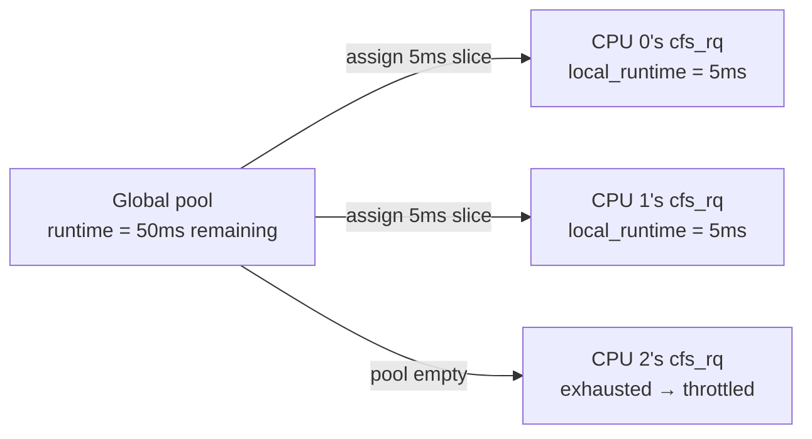

# CPU Bandwidth Control

> CFS bandwidth throttling: how the kernel enforces hard CPU limits

## What bandwidth control does

CPU weight (shares) controls the *proportion* of CPU a group gets when the system is busy. Bandwidth control caps the *absolute* amount — a group set to 50% will be throttled to 50% even if the other 99% of CPU is idle.

This matters for:
- **Predictable latency**: Ensure a group never monopolizes the CPU
- **Multi-tenant isolation**: Prevent one tenant from starving others
- **Resource accounting**: Know exactly how much CPU a container is using

## How it's configured

```bash
# v2 interface (unified)
# Format: "quota_us period_us" or "max period_us" for unlimited
cat /sys/fs/cgroup/mygroup/cpu.max
# 200000 100000  → 200ms every 100ms = 2 CPUs worth

echo "50000 100000" > /sys/fs/cgroup/mygroup/cpu.max  # 50% of 1 CPU

# v1 interface (separate files)
echo 50000  > /sys/fs/cgroup/cpu/mygroup/cpu.cfs_quota_us
echo 100000 > /sys/fs/cgroup/cpu/mygroup/cpu.cfs_period_us
```

The **bandwidth** is `quota / period`. For a quota of 200ms and period of 100ms, the group can use 2 CPUs concurrently (200% utilization). The quota is a wall-clock budget, not per-CPU.

## The bandwidth pool: struct cfs_bandwidth

Each cgroup has one global `cfs_bandwidth` pool:

```c
// kernel/sched/sched.h
struct cfs_bandwidth {
    raw_spinlock_t   lock;
    ktime_t          period;          // e.g., 100ms
    u64              quota;           // e.g., 50ms (in ns)
    u64              runtime;         // remaining this period
    u64              burst;           // burst allowance above quota

    struct hrtimer   period_timer;    // refills runtime at period end
    struct hrtimer   slack_timer;     // deferred unthrottle batching
    struct list_head throttled_cfs_rq; // per-CPU rqs that are throttled

    int nr_periods;
    int nr_throttled;
    u64 throttled_time;
};
```

At the start of each period, `runtime` is reset to `quota`. As tasks run, `runtime` drains. When `runtime` hits zero, all CPUs running tasks from this group are throttled.

## Distribution: pool → per-CPU slice

Tasks don't drain the global pool directly. Instead, each CPU grabs a **slice** from the pool when needed:

```c
// kernel/sched/fair.c
static u64 sched_cfs_bandwidth_slice(void)
{
    return (u64)sysctl_sched_cfs_bandwidth_slice * NSEC_PER_USEC;
    // Default: 5ms (sysctl: /proc/sys/kernel/sched_cfs_bandwidth_slice_us)
}
```



When a CPU's local runtime runs out, it calls `assign_cfs_rq_runtime()` to grab another slice. If the pool is empty, the CPU is throttled.

### assign_cfs_rq_runtime()

```c
// kernel/sched/fair.c
static void assign_cfs_rq_runtime(struct cfs_rq *cfs_rq)
{
    struct cfs_bandwidth *cfs_b = tg_cfs_bandwidth(cfs_rq->tg);

    raw_spin_lock(&cfs_b->lock);
    __assign_cfs_rq_runtime(cfs_b, cfs_rq, sched_cfs_bandwidth_slice());
    raw_spin_unlock(&cfs_b->lock);
}
```

## Throttling: throttle_cfs_rq()

When a CPU's local runtime drains to zero and the global pool is empty:

```c
// kernel/sched/fair.c
static bool throttle_cfs_rq(struct cfs_rq *cfs_rq)
{
    // Add to group's throttled list
    list_add_tail_rcu(&cfs_rq->throttled_list,
                      &cfs_b->throttled_cfs_rq);
    cfs_rq->throttled = 1;

    // Walk up the group scheduling hierarchy:
    // dequeue the group's sched_entity from parent runqueues
    // so tasks in this group can no longer be selected
    walk_tg_tree_from(cfs_rq->tg, tg_throttle_down, ...);

    return true;
}
```

After throttling, the group's `sched_entity` is removed from the parent runqueue. `pick_next_task()` will never select a task from this group until it's unthrottled.

## Refill: the period timer

At the end of each period, `period_timer` fires and refills the pool:

```c
// kernel/sched/fair.c
static void __refill_cfs_bandwidth_runtime(struct cfs_bandwidth *cfs_b)
{
    cfs_b->runtime += cfs_b->quota;

    // Cap at quota + burst (prevent unbounded accumulation)
    cfs_b->runtime = min(cfs_b->runtime, cfs_b->quota + cfs_b->burst);
}
```

After refilling, `unthrottle_cfs_rq()` is called for each throttled CPU:

```c
// kernel/sched/fair.c
static void unthrottle_cfs_rq(struct cfs_rq *cfs_rq)
{
    cfs_rq->throttled = 0;

    // Re-enqueue the group's sched_entity
    // back into parent runqueues
    walk_tg_tree_from(cfs_rq->tg, tg_unthrottle_up, ...);

    // Tasks can run again
}
```

## Burst: absorbing transient spikes

`cpu.max.burst` (v2) / `cpu.cfs_burst_us` (v1) allows a group to temporarily exceed its quota by consuming saved-up credit:

```bash
# Allow 20ms burst above the 50ms quota (max 70ms in a period)
echo "50000 100000 20000" > /sys/fs/cgroup/mygroup/cpu.max.burst
# v2 format: "quota period burst"
```

This helps workloads with bursty behavior (startup, GC pauses) avoid throttling while still maintaining average rate limits.

## Slack timer: batching unthrottles

Unthrottling each CPU individually as soon as runtime becomes available would cause many small lock acquisitions. The **slack timer** batches unthrottles:

```c
// When runtime is returned to the pool (e.g., task blocks before using its slice),
// instead of unthrottling immediately, arm the slack timer for 5ms
// and batch multiple unthrottles together.
```

This reduces lock contention on `cfs_b->lock` at the cost of up to 5ms extra throttle time.

## Diagnosing throttling

### Reading cpu.stat

```bash
cat /sys/fs/cgroup/mygroup/cpu.stat
nr_periods      100    # bandwidth periods elapsed
nr_throttled     23    # periods where group was throttled
throttled_usec  450000 # total throttle time (450ms)
nr_bursts         5    # periods where burst was used
burst_usec      15000  # total burst time (15ms)
```

A high `nr_throttled / nr_periods` ratio (say, >10%) indicates the quota is too low for the workload.

### Tracing bandwidth events

```bash
# Trace throttle/unthrottle events
trace-cmd record -e sched:sched_stat_throttled \
                 -e cgroup:cgroup_throttle_cfs_rq \
                 sleep 10
trace-cmd report
```

### Common causes of unexpected throttling

**Multi-threaded workloads**: If a group has 4 threads all running simultaneously, they collectively consume 4x the per-thread rate. A quota of 100ms/100ms = 100% is only 1 CPU — 4 threads will consume it in 25ms and be throttled for 75ms.

**Solution**: Set quota = `target_utilization × period × number_of_CPUs_you_want_to_use`.

```bash
# Allow 2 CPUs: 200ms quota / 100ms period = 2.0 CPUs
echo "200000 100000" > /sys/fs/cgroup/mygroup/cpu.max
```

**Short-lived bursts**: Tasks that do heavy work for 50ms then sleep will hit throttling during the heavy phase. Burst budget can absorb this.

## Bandwidth slice tuning

The default 5ms slice is a trade-off between:
- **Too small** (< 1ms): High lock contention on `cfs_b->lock`
- **Too large** (> 10ms): CPU gets 10ms of budget it may never use; throttle response is slow

```bash
# Default: 5000 µs
cat /proc/sys/kernel/sched_cfs_bandwidth_slice_us

# For latency-sensitive workloads, reduce to 1ms:
echo 1000 > /proc/sys/kernel/sched_cfs_bandwidth_slice_us
```

## Further reading

- [CPU cgroup v1 vs v2](cpu-cgroup.md) — The cgroup interface for bandwidth and weight
- [cpuset](cpuset.md) — Restrict which CPUs bandwidth is counted against
- [CFS](cfs.md) — The fair scheduler that bandwidth control wraps around
