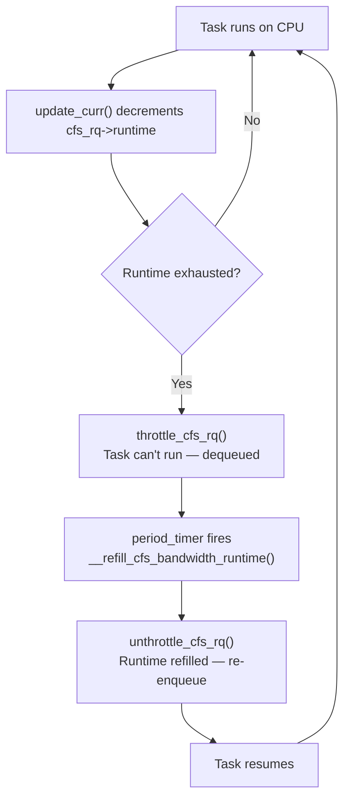

# CPU cgroup: v1 vs v2

> Controlling CPU allocation with cgroups — shares, weights, and bandwidth

## What CPU cgroups control

CPU cgroups give you two independent controls:

1. **Weight** (proportional share): "This group gets 2x more CPU than that group when both are busy"
2. **Bandwidth** (hard limit): "This group can use at most 50% of one CPU per period"

These are orthogonal. A group with high weight still gets throttled if it hits its bandwidth limit.

## The interface difference

cgroup v1 and v2 expose the same underlying mechanisms with different interfaces:

| Control | v1 file | v2 file | Default |
|---------|---------|---------|---------|
| Weight | `cpu.shares` | `cpu.weight` | 1024 / 100 |
| Bandwidth quota | `cpu.cfs_quota_us` | `cpu.max` (first field) | -1 (unlimited) |
| Bandwidth period | `cpu.cfs_period_us` | `cpu.max` (second field) | 100000 µs |
| Stats | `cpuacct.stat` + `cpu.stat` | `cpu.stat` | — |

### Weight: shares vs weight

v1 `cpu.shares` and v2 `cpu.weight` differ in scale but map to the same kernel concept:

```
v2 weight = (v1 shares × 100) / 1024
v1 shares = (v2 weight × 1024) / 100
```

- v1 default: **1024 shares**
- v2 default: **100 weight** (range: 1–10000)

Internally both set `task_group->shares` — the kernel always works in the v1 shares unit.

```bash
# v1: give group A twice the CPU of group B when both are busy
echo 2048 > /sys/fs/cgroup/cpu/groupA/cpu.shares
echo 1024 > /sys/fs/cgroup/cpu/groupB/cpu.shares

# v2: same, using weight
echo 200 > /sys/fs/cgroup/groupA/cpu.weight
echo 100 > /sys/fs/cgroup/groupB/cpu.weight
```

### Bandwidth: quota/period vs cpu.max

v1 exposes quota and period as separate files; v2 combines them:

```bash
# v1: limit to 50% of one CPU (50ms every 100ms)
echo 50000  > /sys/fs/cgroup/cpu/mygroup/cpu.cfs_quota_us
echo 100000 > /sys/fs/cgroup/cpu/mygroup/cpu.cfs_period_us

# v2: same
echo "50000 100000" > /sys/fs/cgroup/mygroup/cpu.max
# format: "quota period"
# "max 100000" means unlimited (default)
```

## The kernel structures

### struct task_group

Every cgroup maps to a `task_group` in the kernel:

```c
// kernel/sched/sched.h
struct task_group {
    struct cgroup_subsys_state css;

    // One sched_entity and cfs_rq per CPU
    struct sched_entity     **se;      // array[NR_CPUS]
    struct cfs_rq           **cfs_rq;  // array[NR_CPUS]
    unsigned long             shares;  // weight (cpu.shares value)

    // RT group scheduling (CONFIG_RT_GROUP_SCHED)
    struct sched_rt_entity  **rt_se;
    struct rt_rq            **rt_rq;

    struct task_group       *parent;

    // CFS bandwidth (CONFIG_CFS_BANDWIDTH)
    struct cfs_bandwidth      cfs_bandwidth;
};
```

Each CPU has its own `sched_entity` representing the group in that CPU's CFS runqueue. This allows the group to be scheduled as a single unit relative to other groups and tasks on that CPU, then internally distribute time among its members.

### struct cfs_bandwidth

```c
// kernel/sched/sched.h
struct cfs_bandwidth {
    raw_spinlock_t  lock;
    ktime_t         period;         // bandwidth period
    u64             quota;          // quota per period (ns)
    u64             runtime;        // remaining runtime this period
    u64             burst;          // allowed burst above quota
    s64             hierarchical_quota;

    struct hrtimer  period_timer;   // fires at period end to refill
    struct hrtimer  slack_timer;    // deferred unthrottle
    struct list_head throttled_cfs_rq; // throttled per-CPU runqueues

    // Statistics
    int             nr_periods;
    int             nr_throttled;
    u64             throttled_time;
};
```

## How bandwidth throttling works



### Distribution to CPUs

The global `cfs_b->runtime` budget is distributed to individual CPUs in slices:

```c
// kernel/sched/fair.c
static void assign_cfs_rq_runtime(struct cfs_rq *cfs_rq)
{
    // Request a slice from the global pool
    __assign_cfs_rq_runtime(cfs_b, cfs_rq,
                             sched_cfs_bandwidth_slice());
    // Default slice: 5ms (sysctl_sched_cfs_bandwidth_slice)
}
```

A CPU grabs a 5ms slice from the global pool. When the slice runs out, it requests another. If the global pool is exhausted (quota used up for this period), the CPU is throttled.

### Viewing throttling stats

```bash
# Per-group bandwidth stats
cat /sys/fs/cgroup/mygroup/cpu.stat
# nr_periods         - how many bandwidth periods elapsed
# nr_throttled       - how many periods were throttled
# throttled_usec     - total time throttled (microseconds)
# nr_bursts          - burst periods used
# burst_usec         - total burst time

# Detect throttling in real time
watch -n 1 'cat /sys/fs/cgroup/mycontainer/cpu.stat | grep throttled'
```

## Group scheduling hierarchy

With `CONFIG_FAIR_GROUP_SCHED`, CFS builds a two-level hierarchy:

```
Top-level CFS runqueue
├── group A's sched_entity  (weight=2000)
│   └── A's cfs_rq
│       ├── task1 (weight=1024)
│       └── task2 (weight=512)
└── group B's sched_entity  (weight=1000)
    └── B's cfs_rq
        └── task3 (weight=1024)
```

Group A gets 2000/(2000+1000) = 67% of CPU. Within A, task1 gets 2/3 and task2 gets 1/3 of A's share.

This nesting allows containers to have isolated CPU allocations while tasks within a container compete fairly among themselves.

## v1 vs v2: key behavioral differences

**Hierarchical bandwidth (v2 only)**: In v2, a child cgroup's effective quota is the minimum of its own quota and its ancestors' quotas. In v1, cgroup bandwidth is per-cgroup, not inherited.

**Unified controller (v2)**: v2 uses a single unified hierarchy — you can't mount cpu and cpuacct separately. Both are always enabled together.

**Weight range**: v1 shares: 2–262144. v2 weight: 1–10000. The effective range is the same proportionally.

## Practical examples

### Container CPU limits (v2)

```bash
# Create a cgroup for a container
mkdir /sys/fs/cgroup/containers/mycontainer

# Give it 2 CPUs worth of quota (200ms every 100ms)
echo "200000 100000" > /sys/fs/cgroup/containers/mycontainer/cpu.max

# Give it weight 200 (2x default)
echo 200 > /sys/fs/cgroup/containers/mycontainer/cpu.weight

# Add a process
echo $PID > /sys/fs/cgroup/containers/mycontainer/cgroup.procs
```

### Detecting CPU throttling

```bash
# Check if your container is being throttled
cat /sys/fs/cgroup/$(cat /proc/self/cgroup | grep cpu | cut -d: -f3)/cpu.stat | \
    awk '/throttled/ {print $0}'

# With cgroup v1
cat /sys/fs/cgroup/cpu/$(cat /proc/self/cgroup | grep ^7 | cut -d: -f3)/cpu.stat
```

## Further reading

- [CPU Bandwidth Control](cpu-bandwidth.md) — Deep dive into CFS bandwidth mechanics
- [cpuset](cpuset.md) — Restricting which CPUs and NUMA nodes a cgroup can use
- [Scheduler Classes](scheduler-classes.md) — How group scheduling fits into the class hierarchy
