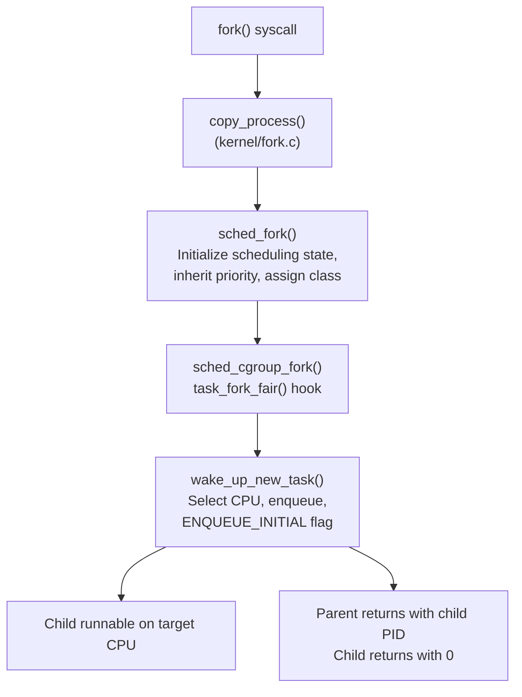

# What Happens When You fork() — The Scheduler's View

> How a new task enters the scheduler, inherits its parent's priority, and gets its first timeslice

## Overview

When a process calls `fork()`, the kernel must do more than copy memory — it must create a new `task_struct`, initialize its scheduling state, pick a CPU for it to start on, and add it to a runqueue. The scheduler is carefully involved at each step to ensure the child doesn't immediately monopolize the CPU or inherit unfair advantages.



## sched_fork(): initializing the child

`sched_fork()` is called inside `copy_process()` before the child is visible to the rest of the system:

```c
// kernel/sched/core.c
int sched_fork(u64 clone_flags, struct task_struct *p)
{
    // 1. Zero-initialize the scheduling entity
    __sched_fork(clone_flags, p);
    // sets: p->se.vruntime = 0, p->se.vlag = 0, p->on_rq = 0, etc.

    // 2. Mark as new — prevents premature wakeup
    p->__state = TASK_NEW;

    // 3. Inherit parent's priority
    p->prio = current->normal_prio;

    // 4. Handle sched_reset_on_fork: if set, reset to SCHED_NORMAL/nice 0
    if (unlikely(p->sched_reset_on_fork)) {
        if (task_has_rt_policy(p)) {
            p->policy = SCHED_NORMAL;
            p->static_prio = NICE_TO_PRIO(0);
        } else if (PRIO_TO_NICE(p->static_prio) < 0) {
            p->static_prio = NICE_TO_PRIO(0);
        }
        p->normal_prio = p->static_prio;
    }

    // 5. Assign scheduling class based on priority
    if (rt_prio(p->prio))
        p->sched_class = &rt_sched_class;
    else
        p->sched_class = &fair_sched_class;

    // 6. Initialize load tracking
    init_entity_runnable_average(&p->se);

    return 0;
}
```

### Priority inheritance

The child inherits `current->normal_prio` — the parent's *normal* priority, which accounts for nice values but not temporary boosts from priority inheritance (PI) protocols. This prevents priority escalation through fork.

```c
// The child's priority chain:
p->prio = current->normal_prio;   // dynamic prio (= normal_prio for non-PI)
p->normal_prio = p->prio;         // normal (non-boosted) priority
p->static_prio = current->static_prio;  // nice-derived base priority
```

If the parent has nice -10, the child starts at nice -10. This is intentional — a high-priority build system forking compilation workers should still run them at high priority.

### sched_reset_on_fork

Some container runtimes use `sched_reset_on_fork` to prevent privilege escalation via fork:

```c
// If parent is SCHED_FIFO/RR with priority 50,
// child resets to SCHED_NORMAL/nice 0
// (prevents RT tasks spawning RT children without CAP_SYS_NICE)
```

## The fair class task_fork hook

After `sched_fork()`, `sched_cgroup_fork()` calls `p->sched_class->task_fork(p)`. For `fair_sched_class`, this is `task_fork_fair()`:

```c
// kernel/sched/fair.c
static void task_fork_fair(struct task_struct *p)
{
    set_task_max_allowed_capacity(p);
}
```

This sets the maximum CPU capacity the task is allowed to use (for energy-aware scheduling on asymmetric CPU topologies like big.LITTLE). The actual vruntime initialization happens later in `wake_up_new_task()`.

## wake_up_new_task(): putting the child on a CPU

After `copy_process()` completes and the child is fully initialized, `wake_up_new_task()` makes it runnable:

```c
// kernel/sched/core.c
void wake_up_new_task(struct task_struct *p)
{
    struct rq *rq;

    // 1. Transition: TASK_NEW → TASK_RUNNING
    WRITE_ONCE(p->__state, TASK_RUNNING);

    // 2. Select target CPU using fork load balancing (WF_FORK)
    p->recent_used_cpu = task_cpu(p);
    __set_task_cpu(p, select_task_rq(p, task_cpu(p), &wake_flags));
    // wake_flags includes WF_FORK → select_task_rq_fair uses SD_BALANCE_FORK

    // 3. Lock the target CPU's runqueue
    rq = __task_rq_lock(p, &rf);
    update_rq_clock(rq);

    // 4. Initialize util average (load tracking)
    post_init_entity_util_avg(p);

    // 5. Enqueue with ENQUEUE_INITIAL flag
    activate_task(rq, p, ENQUEUE_NOCLOCK | ENQUEUE_INITIAL);

    // 6. Check if child should preempt current
    wakeup_preempt(rq, p, wake_flags);
}
```

### CPU selection for fork (WF_FORK)

`select_task_rq_fair()` receives the `WF_FORK` flag, which maps to `SD_BALANCE_FORK` when walking scheduling domains. The goal is to find an idle or lightly loaded CPU to spread load immediately — unlike wakeup placement (which optimizes for cache locality), fork placement optimizes for load balance.

On a 4-core system with one busy core:
```
CPU 0: [busy task, busy task]  ← parent running here
CPU 1: [idle]
CPU 2: [one task]
CPU 3: [idle]

Fork result: child placed on CPU 1 or CPU 3 (idle CPUs preferred)
```

### ENQUEUE_INITIAL: the fair start

`activate_task()` with `ENQUEUE_INITIAL` calls `enqueue_task_fair()`, which calls `place_entity()` with the initial flag. This is critical for fairness:

```c
// kernel/sched/fair.c — place_entity() with ENQUEUE_INITIAL
vruntime = avg_vruntime(cfs_rq);  // start near the current average
vslice /= 2;                       // half-slice advantage to run soon
se->vruntime = vruntime - lag;
se->deadline = se->vruntime + calc_delta_fair(se->slice, se);
```

**Why half-slice?** Without this, a newly forked child would have `vruntime = 0` and would run before every other task. With `avg_vruntime - half_slice`, it runs soon (but not immediately) and gets a fair share without starving others.

**Without ENQUEUE_INITIAL** (regular wakeup): the task is placed at `avg_vruntime` directly. The extra half-slice advantage is only for new tasks, reflecting the expectation that a freshly forked child often has real work to do (unlike a task waking from sleep that already had its fair share at fork time).

## fork() vs vfork() vs clone()

The scheduler treats these differently:

```c
// fork(): full copy, child on separate CPU
pid_t child = fork();

// vfork(): child SHARES parent's mm, parent blocks
// CLONE_VFORK in clone flags causes parent to wait on
// a completion — the scheduler still places the child normally
// but the parent won't run until child calls exec() or _exit()

// clone() with CLONE_VM: threads share mm
// Scheduled independently, but share the same memory mappings
pthread_create(...)  // internally uses clone(CLONE_VM|CLONE_THREAD|...)
```

For threads (`CLONE_VM`), `sched_fork()` still runs, still inherits priority, and the thread is placed on a CPU independently. The scheduler treats threads no differently from processes — the only distinction is in memory management, not scheduling.

## The parent vs child execution order

After `wake_up_new_task()` returns, either the parent or the child could run next. The kernel doesn't guarantee which one runs first — it depends on which CPU the child was placed on and whether a preemption occurred.

Historically, Linux ran the parent first (to avoid the COW cost if the child execs immediately). This policy has been revisited multiple times. The current behavior (with the CFS-era `sched_child_runs_first` tunable removed in EEVDF) is determined by relative virtual deadlines:

When the child is given an earlier deadline by `wake_up_new_task()`, CFS used `set_next_buddy(&p->se)` as a hint to prefer the child; under EEVDF the child's initial deadline placement determines run order.

## Observing fork scheduling

```bash
# Watch fork events with CPU placement
trace-cmd record -e sched:sched_process_fork -e sched:sched_wakeup_new \
    -e sched:sched_switch ./workload
trace-cmd report | grep -E "fork|wakeup_new"

# See how many new tasks were created per second
perf stat -e sched:sched_process_fork -a sleep 10

# Monitor CPU placement of new tasks
perf script | grep wakeup_new | awk '{print $NF}' | sort | uniq -c
```

## Further reading

- [What Happens When You fork() — Memory's View](../mm/fork.md) — COW, page table copying, mm_struct
- [What Happens When a Process Wakes Up](wakeup.md) — The `try_to_wake_up()` path for regular wakeups
- [CFS](cfs.md) — How `place_entity()` sets initial vruntime
- [Life of a Context Switch](context-switch.md) — What happens when the child gets its first CPU turn
