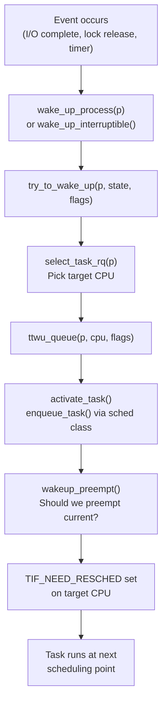
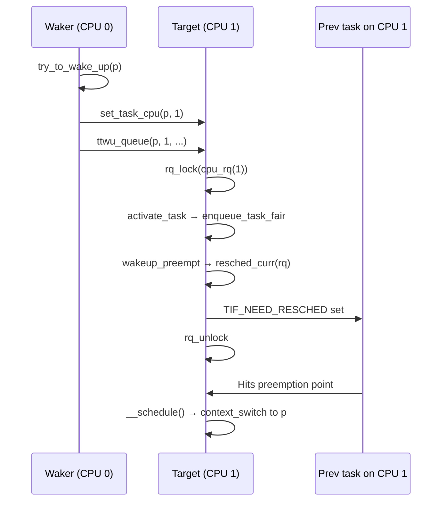

# What Happens When a Process Wakes Up

> From `wake_up_process()` to running on a CPU

## Overview

A process wakes up when something it was waiting for becomes available — a lock is released, data arrives on a socket, a timer fires, or a signal is delivered. The wakeup path must transition the task from sleeping to runnable, place it on the right CPU, and potentially preempt whatever is currently running there.



## Task states

Before diving in, the relevant sleeping states:

```c
// include/linux/sched.h
#define TASK_INTERRUPTIBLE      0x00000001  // can be woken by signals
#define TASK_UNINTERRUPTIBLE    0x00000002  // only explicit wakeup
#define TASK_WAKING             0x00000200  // being woken right now
```

`TASK_INTERRUPTIBLE` is the most common sleep state — used when waiting for I/O, locks, or events that might never come (so signals should be able to abort the wait). `TASK_UNINTERRUPTIBLE` is for waits that must complete — disk I/O in progress, kernel critical sections. This is the "D" state in `ps` output.

`wake_up_process()` uses `TASK_NORMAL = TASK_INTERRUPTIBLE | TASK_UNINTERRUPTIBLE` and will wake either.

## Entry: wake_up_process()

```c
// kernel/sched/core.c
int wake_up_process(struct task_struct *p)
{
    return try_to_wake_up(p, TASK_NORMAL, 0);
}
```

The kernel has several `wake_up_*` variants depending on which sleep states to wake:

| Function | Wakes |
|----------|-------|
| `wake_up_process(p)` | `TASK_INTERRUPTIBLE \| TASK_UNINTERRUPTIBLE` |
| `wake_up_interruptible(x)` | `TASK_INTERRUPTIBLE` only |
| `wake_up(x)` | `TASK_NORMAL` (via wait queue) |
| `wake_up_all(x)` | All tasks on a wait queue |

## try_to_wake_up()

The core wakeup function:

```c
// kernel/sched/core.c
int try_to_wake_up(struct task_struct *p, unsigned int state, int wake_flags)
{
    wake_flags |= WF_TTWU;

    // Fast path: waking ourselves (rare but valid)
    if (p == current) {
        if (!(READ_ONCE(p->__state) & state))
            return 0;
        WRITE_ONCE(p->__state, TASK_RUNNING);
        return 1;
    }

    // Acquire p->pi_lock to serialize with other wakers
    raw_spin_lock_irqsave(&p->pi_lock, flags);

    // Check if the task is actually in a wakeable state
    if (!(READ_ONCE(p->__state) & state))
        goto unlock;

    trace_sched_waking(p);

    // Mark transitioning: prevents signal-based double wakeup
    WRITE_ONCE(p->__state, TASK_WAKING);

    // If already on a runqueue, just fix up preemption
    if (READ_ONCE(p->on_rq)) {
        ttwu_runnable(p, wake_flags);
        goto unlock;
    }

    // Wait for task to be fully off the CPU it was running on
    smp_load_acquire(&p->on_cpu);  // spin until on_cpu == 0

    // Select target CPU
    cpu = select_task_rq(p, p->wake_cpu, &wake_flags);
    if (task_cpu(p) != cpu)
        set_task_cpu(p, cpu);

    // Enqueue on target CPU
    ttwu_queue(p, cpu, wake_flags);

unlock:
    raw_spin_unlock_irqrestore(&p->pi_lock, flags);
    ttwu_stat(p, task_cpu(p), wake_flags);
    return success;
}
```

### The on_cpu spin

```c
smp_load_acquire(&p->on_cpu);
```

If the task is still executing on another CPU (in the middle of `__schedule()` or running), this spins until `p->on_cpu` becomes 0. `finish_task_switch()` clears it with `smp_store_release()` after the task is fully off the CPU. This prevents placing the task on a new runqueue while it's still executing somewhere.

## CPU selection: select_task_rq()

The scheduler must decide which CPU to place the woken task on. For `SCHED_NORMAL` tasks, `select_task_rq_fair()` makes this decision:

```c
// kernel/sched/core.c
int select_task_rq(struct task_struct *p, int cpu, int *wake_flags)
{
    if (p->nr_cpus_allowed > 1 && !is_migration_disabled(p))
        cpu = p->sched_class->select_task_rq(p, cpu, *wake_flags);
    else
        cpu = cpumask_any(p->cpus_ptr);

    return cpu;
}
```

`select_task_rq_fair()` considers several factors:

**Wake affinity**: If the waker and wakee communicate frequently, placing the wakee near the waker improves cache locality. This is especially effective when the waker calls `wake_up()` and then blocks — the wakee can reuse the waker's cache contents.

**Load balancing**: The selected CPU should be idle or lightly loaded. The function walks scheduling domains (SMT → LLC → NUMA node → system) looking for a suitable CPU.

**The `WF_SYNC` flag**: Set when the waking task is about to block immediately after the wakeup (e.g., a producer sending to a consumer). In this case, the wakee might be placed on the waker's CPU since the waker is vacating it.

```c
// kernel/sched/sched.h
#define WF_SYNC         0x10  // waker goes to sleep after wakeup
#define WF_FORK         0x04  // new task (fork)
#define WF_MIGRATED     0x20  // task was migrated to new CPU
```

## Enqueuing: ttwu_queue() and activate_task()

```c
// kernel/sched/core.c
static void ttwu_queue(struct task_struct *p, int cpu, int wake_flags)
{
    struct rq *rq = cpu_rq(cpu);

    rq_lock(rq, &rf);
    update_rq_clock(rq);
    ttwu_do_activate(rq, p, wake_flags, &rf);
    rq_unlock(rq, &rf);
}

static void ttwu_do_activate(struct rq *rq, struct task_struct *p,
                              int wake_flags, struct rq_flags *rf)
{
    int en_flags = ENQUEUE_WAKEUP | ENQUEUE_NOCLOCK;

    // Activate (enqueue into sched class data structures)
    activate_task(rq, p, en_flags);

    // Check if newly runnable task should preempt current
    wakeup_preempt(rq, p, wake_flags);

    // Mark as runnable
    ttwu_do_wakeup(p);   // sets p->__state = TASK_RUNNING
}
```

`activate_task()` calls `p->sched_class->enqueue_task()`. For fair tasks this puts the task into the CFS RB-tree with a vruntime adjusted for how long it slept (via `place_entity()`).

### Vruntime placement on wakeup

A task that slept for a long time has a stale (low) vruntime. If it returned to the RB-tree at that old vruntime, it could monopolize the CPU catching up. Instead, `place_entity()` places the waking task at approximately `avg_vruntime - half_slice`:

```
Before sleep:  [A: vr=100] [B: vr=105] [C: vr=110]
After A sleeps for 500ms:  avg_vruntime ≈ 300
A wakes, placed at: 300 - half_slice ≈ 297
```

A gets to run soon (it's near the front) but doesn't starve B and C (it's not so far back that it needs to run for 200ms straight to "catch up").

## Preemption check: wakeup_preempt()

After enqueueing, the scheduler checks whether the newly runnable task should preempt whatever is currently running on the target CPU:

```c
// kernel/sched/core.c
void wakeup_preempt(struct rq *rq, struct task_struct *p, int flags)
{
    // Delegate to the running task's sched class
    rq->curr->sched_class->wakeup_preempt(rq, p, flags);
}
```

For `fair_sched_class`, `wakeup_preempt_fair()` checks whether the woken task's virtual deadline is earlier than the current task's. If so, it calls `resched_curr(rq)` to set `TIF_NEED_RESCHED`.

The target CPU won't preempt immediately — it sets the flag and waits for the next preemption point (interrupt exit, syscall return, or explicit `schedule()` call).

## Cross-CPU wakeup

When waking a task on a different CPU:



The waker enqueues the task and sets TIF_NEED_RESCHED on the target CPU using an inter-processor interrupt (IPI) if needed via `smp_send_reschedule()`.

## Wait queues

Most kernel code doesn't call `wake_up_process()` directly — it uses **wait queues**:

```c
// Kernel side: wake all tasks waiting on a queue
wake_up(&wq_head);            // wake TASK_NORMAL tasks
wake_up_interruptible(&wq);   // wake TASK_INTERRUPTIBLE only

// User side (inside driver/subsystem code):
wait_event(wq, condition);           // TASK_UNINTERRUPTIBLE
wait_event_interruptible(wq, cond);  // TASK_INTERRUPTIBLE
```

Wait queues serialize access to the condition variable, ensuring that wakeups aren't lost between when the condition is checked and when the task sleeps.

## Observing wakeups

```bash
# Wakeup latency: time from wakeup to first execution
perf sched record -a sleep 5
perf sched latency --sort=max

# Trace individual wakeup events
trace-cmd record -e sched:sched_wakeup -e sched:sched_switch ./workload
trace-cmd report

# See which CPUs tasks are waking up on
perf script -i perf.data | grep sched_wakeup | awk '{print $NF}' | sort | uniq -c

# /proc/PID/schedstat: wakeup stats per task
cat /proc/$PID/schedstat
# Fields: cpu_time, runqueue_wait, timeslices_run
```

## Further reading

- [Life of a Context Switch](context-switch.md) — What happens after TIF_NEED_RESCHED is set
- [CFS](cfs.md) — How vruntime is adjusted on wakeup via `place_entity()`
- [EEVDF](eevdf.md) — How eligibility and deadlines affect wakeup preemption decisions
